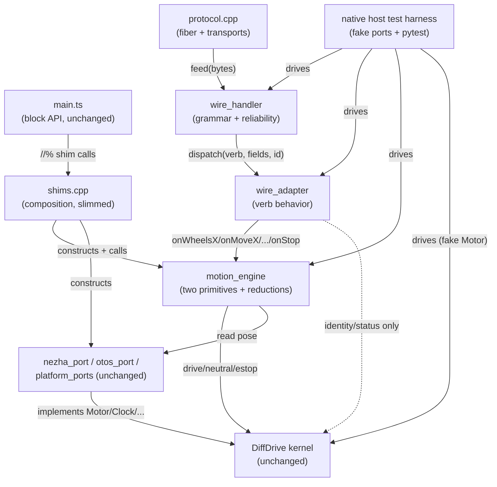

<!-- CLASI: Before changing code or making plans, review the SE process in CLAUDE.md -->

# Sprint 003: Protocol v6 wire grammar + Motion API six operations, with native host test harness

## Goals

Bring this extension's wire protocol up to **protocol v6** (case-direction,
mandatory sequence id, cumulative ack/nack, decode-failure-is-NAK) and
restructure the existing motion code onto the specified **six-operation
Motion API** (`wheelsX`, `wheelsV`, `moveX`, `moveV`, `goToR`, `goToW`) built
on the two-primitive reduction — while standing up this repo's first native
host test harness so both can be tested thoroughly on a laptop before any
hardware validation.

Covers two committed issues, planned together as one sprint:
- `implement-protocol-v6-wire-grammar-and-reliability.md`
- `implement-motion-api-six-operations.md`

## Problem

This repo's wire handler (`src/protocol.cpp`, ~1100 lines) predates v6: it
lacks case-sensitive command/reply direction, the mandatory `#<n>` sequence
id, the two-value (`expectedNext_`/`gapOutstanding_`) cumulative ack/nack
classification, and the decode-failure-is-NAK rule — all specified in
`radio-robot-lib/docs/design/protocol.md` (canonical; this repo conforms to
its grammar, it does not vendor its C++). Separately, the Motion API surface
that exists today (`move`, `goTo`, `goToWorld`, `startMove`, `driveTick` in
`src/main.ts`, backed by the segment executor in `src/shims.cpp` and the
wheel kernel in `src/diffdrive.cpp`) has the right behaviour but not the
specified six-operation names, units, or the sign/trackwidth/cruise
conventions in `radio-robot-lib/docs/design/motion-api.md` (canonical).

Both issues are testable on a laptop against a fake motor port — the
protocol's reliability edge cases (loss, reordering, retransmits, malformed
input) and the motion algebra (four translations onto two primitives) are
pure logic with no micro:bit dependency if the transport/motor seam is kept
clean. But this repo currently has **no test suite at all**
(`uv run pytest` collects nothing), and the stakeholder's instruction is to
test this thoroughly. Standing up a host-testable harness is therefore a
real piece of sprint scope, not incidental plumbing, and it needs to exist
before the bulk of the protocol/motion tickets so they have something to
test against.

## Solution

One sprint, not two, because the six motion verbs are simultaneously the
protocol's wire surface and the Motion API's behaviour — splitting them
would build a wire layer with nothing real behind it (protocol tickets
would fabricate verb semantics that the motion tickets would then have to
revisit) and force redoing every verb once the real behaviour landed.

Approach, at a high level:
1. Stand up a native host test harness EARLY (first tickets in Detail
   Mode) — compile the protocol and motion/kinematics code for the host,
   against a fake `Motor`/transport port, following
   `radio-robot-lib/tests/protocol/` and its `tools/sim` as a working
   reference for shape. Later protocol and motion tickets build on this
   harness rather than each inventing test scaffolding.
2. Implement the v6 wire grammar and reliability layer in `protocol.cpp`/
   `protocol.h`, verified against golden wire vectors and the adversarial
   input set, before or alongside the motion restructuring — the two
   share the verb catalog so sequencing must interleave, not strictly
   serialize.
3. Restructure the existing motion surface (`main.ts`, `shims.cpp`,
   `diffdrive.cpp`, `otos_port.cpp`) onto the six named operations and the
   two-primitive reduction, preserving the two hard-won behaviours flagged
   in the motion issue (yaw taper applies only to a pure turn, commit
   `bd9f005`; a move that ends still delivers the kernel's neutral to the
   motors, commit `3e919e5`) with explicit regression tests for both.
4. Defer hardware validation to a separate, later, stakeholder-present
   activity — a green laptop suite is evidence the algebra and protocol
   state machine are correct, not that the robot drives correctly.

Known implementation constraints carried over from prior work on this repo
(for Detail Mode's architecture and ticketing to respect): a `//%` PXT shim
with 5+ int32 params fails the MakeCode build with an error pointing at
`main.ts(1,1)`; a namespace-level `let` initialiser in `main.ts` runs AFTER
a test file's top-level code runs, so any such value needed by
`test/test.ts` must be declared with no initialiser; and writing the word
"radio" followed by a period, even inside a comment, makes PXT demand a
`radio` package dependency.

## Success Criteria

- Protocol v6 grammar, verb catalog, and reliability layer implemented in
  `protocol.cpp`/`protocol.h` and passing host-run tests covering: golden
  wire vectors for every verb in both directions; the full three-way id
  classification table, including an assertion that a retransmit does NOT
  re-invoke the adapter; decode-failure-is-NAK distinguished from a merits
  rejection; gap stalling and self-healing on a lost nack; the unsequenced
  exemption set (`HELLO`, `ESTOP`, `PING`); and the adversarial input set
  (overlong lines, embedded NULs, a lone `\r`, all-whitespace lines,
  partial lines split across `feed()` calls, a lowercase verb).
- All six motion operations (`wheelsX`, `wheelsV`, `moveX`, `moveV`,
  `goToR`, `goToW`) implemented on the two-primitive reduction with the
  specified names, units, and sign convention, unit-tested against
  hand-computed values, the degenerate cases (`wheels_x(+d,-d)` pivot,
  `wheels_x(d,d)` straight, `move_x(d,0)` straight, `move_x(0,θ)` pivot),
  and the pivot-vs-blend threshold in `moveX`.
- Explicit regression tests exist for both hard-won behaviours (yaw taper
  only on a pure turn; post-move kernel-neutral delivery) and fail if
  either regresses.
- A native host test harness exists, compiles independently of the
  micro:bit/PXT target, and is the thing later sprints extend rather than
  something each ticket reinvents.
- Effective track width (`b = trackwidth / rotational_slip`) is computed
  as a derived method, never a stored field, and `trackwidth` itself is
  never adjusted to make turns land — scrub correction lives only in
  `rotational_slip`.
- Hardware validation is explicitly out of this sprint's exit criteria and
  scheduled as a follow-up, stakeholder-present activity.

## Scope

### In Scope

- Native host test harness: a host-compilable build of the protocol and
  motion/kinematics logic against a fake `Motor`/transport port, modeled
  on `radio-robot-lib/tests/protocol/` + `tools/sim`. Sequenced early so
  subsequent tickets test against it.
- Protocol v6 wire grammar: case-sensitive command/reply direction,
  mandatory `#<n>` sequence id with digits-only parsing, cumulative
  ack/nack via `expectedNext_`/`gapOutstanding_`, decode-failure-is-NAK,
  the unsequenced exemption set, the clock-free handler constraint, the
  revised outcome model (`ok`/`done` removed, `ERR_DUPLICATE_ID` removed),
  and the grammar edge cases (240-byte line cap, single-space-separator
  collapsing, lone `\r` stripping, blank-line handling).
- Verb catalog: `HELLO PING ID VER STATUS HELP GET SET TLM WHEELS_X
  WHEELS_V MOVE_X MOVE_V GO_TO_R GO_TO_W STOP ESTOP RUN`, including the
  `WHEELS` → `WHEELS_V` rename and `STOP`'s optional `now` token.
- Motion API: the six operations on the two-primitive reduction, restated
  onto `src/main.ts`'s existing `move`/`goTo`/`goToWorld`/`startMove`/
  `driveTick` surface; effective track width as a derived method; CCW-
  positive sign convention; cruise confined to the X-forms; the three
  execution modes (background/fiber, manual tick, blocking); degrees-at-
  API / milliradians-on-wire conversion isolated to the binding.
- Regression tests for the two hard-won behaviours (`bd9f005`, `3e919e5`).

### Out of Scope

- `SEED`/`CAL` wire verbs — explicitly deferred per `protocol.md`.
- Hardware validation / on-robot driving trials — deferred to a later,
  stakeholder-present session; not an exit criterion for this sprint.
- Any change to the `radio-robot-lib` repository — it is the read-only
  specification authority for this sprint and has its own active sprint
  001 that this sprint must not touch.
- Other pending issues in this repo not named above (e.g.
  `break-up-main-ts-into-modules.md`, the OTOS/vevov tour issues, the
  testrig type-check issue) — left for separate sprints.

## Test Strategy

Testing is first-class sprint scope, not a wrap-up step, and is sequenced
early: standing up the native host test harness is among the first
tickets in Detail Mode so that every protocol and motion ticket after it
has something to test against, rather than treating tests as a per-ticket
afterthought.

Two test surfaces, both running on the host against fakes, no hardware
required:

1. **Protocol wire-format tests** — golden vectors per verb, both
   directions; the full three-way id classification table with an
   explicit assertion that the retransmit row does not re-invoke the
   adapter; decode-failure-is-NAK vs. a merits rejection; gap stalling and
   self-healing after a lost nack; the unsequenced exemption set; and the
   adversarial input set (overlong lines, embedded NULs, a lone `\r`,
   all-whitespace lines, partial lines split across `feed()` calls, a
   lowercase verb).
2. **Motion kinematics tests** — the four translations
   (`move_v`→`wheels_v`, `move_x`→`wheels_x`, `go_to_r`→`move_x`,
   `go_to_w`→`go_to_r`) against hand-computed values including the
   effective-track-width correction; the degenerate cases; sign
   convention exercised in both directions so a future cable-order "fix"
   fails a test instead of shipping; the pivot-vs-blend threshold in
   `moveX`; and regression tests for the two hard-won behaviours, all
   driven through a fake `Motor` port asserting on commanded segments.

Hardware validation is a distinct, later activity done with the
stakeholder present. A green laptop suite is evidence the protocol state
machine and motion algebra are correct — it is not proof the robot drives
correctly, and this sprint's exit criteria do not depend on it.

## Architecture

**Substantial** — this sprint introduces two new subsystems (a wire
reliability layer with mandatory sequencing and cumulative ack/nack;
a native host test harness with no prior counterpart in this repo),
restructures the existing motion surface onto a portable two-primitive
engine extracted out of `shims.cpp`, and touches 6+ modules with new
cross-module dependencies (the host harness depends on the new wire and
motion modules; the new wire adapter depends on the new motion engine).
The full 7-step methodology applies, diagrams included.

There is no consolidated `docs/architecture/` document for this
project yet (only `docs/design/{overview.md,specification.md,
usecases.md}`, which describe the CURRENT v5/pre-six-op system this
sprint replaces) — this section is written against that current source
and against `overview.md`'s "three layers, cleanly separated" framing,
which this sprint's split of `shims.cpp` deepens rather than abandons.

### Step 1 — Understand the Problem

Today's `src/protocol.cpp`/`.h` speak a bespoke v5 grammar (COBS
0x0A-keyed framing, a CRC-16 over binary verb bodies, locally-defined
fixed-size binary payloads for `MOVE`/`WHEELS`/`CONFIG`/etc.) with no
delivery guarantee at all — a lost or reordered command is silently
dropped or, worse, re-executed. It is wired directly into CODAL/PXT
(`pxt.h`, `MicroBitEvent`, `create_fiber`) with no host-testable seam.
Separately, `src/shims.cpp`'s `Rig` struct implements a body-frame
move engine (distance+yaw, with taper/ramp/settle shaping) that is
*kinematically* most of what `motion-api.md`'s six operations need, but
under different names, different units, and with no per-wheel-distance
primitive (`wheels_x`) at all. Both are entangled with `NezhaMotorPort`/
CODAL types, so neither can be exercised on a laptop today — this repo
has no test suite (`uv run pytest` collects nothing).

The sprint's job is to (a) replace the v5 wire layer with protocol v6's
ASCII grammar and reliability layer, (b) restate the motion surface onto
the six named operations built on the two-primitive reduction, and (c)
do both in a form a native host build can exercise, because the
interesting failure modes (loss, reordering, retransmits, the
taper/pure-turn distinction, the post-move neutral-delivery bug) are
exactly the ones a bench robot cannot reliably provoke.

### Step 2 — Responsibilities Identified

1. **Wire grammar mechanics** — line reassembly across arbitrary byte
   chunks, tokenizing, case-as-direction, the 240-byte cap, blank-line
   and lone-`\r` handling. Changes only when the grammar itself changes.
2. **Delivery reliability** — the mandatory `#<id>`, `expectedNext_`/
   `gapOutstanding_`, the three-way classification, decode-failure-is-
   NAK. Changes only when the reliability contract changes; orthogonal
   to what any given verb does.
3. **Session/config/telemetry verb behavior** — `HELLO`/`PING`/`ID`/
   `VER`/`STATUS`/`HELP`/`GET`/`SET`/`TLM`/`STOP`/`ESTOP`/`RUN`. Changes
   when identity, config field names, or telemetry columns change.
4. **Motion verb wire behavior** — decoding and dispatching the six
   motion verbs to typed calls. Changes when the verb catalog or wire
   argument shapes change; independent of what a planner does with them.
5. **Geometry and the two-primitive reduction** — `effectiveTrackWidth`,
   counts↔mm conversion, `wheels_x`/`wheels_v` as the two primitives,
   `move_x`/`move_v`/`go_to_r`/`go_to_w` as reductions onto them. Changes
   when the kinematic model changes; has no wire or CODAL awareness.
6. **Move-engine shaping** — ramp, end-of-move taper (pure-turn vs. arc),
   wrong-way abort, settle ticks, stall/deadline handling. Changes only
   when the shaping algorithm itself changes; today lives inextricably
   mixed into responsibility 5 inside `Rig`/`serviceMove` and is the
   thing this sprint must pull apart from it cleanly.
7. **Hardware transport/composition** — owning the CODAL fiber, the
   serial/radio byte plumbing, and wiring the concrete ports together.
   Changes only for transport/platform reasons, never for wire-grammar
   or motion reasons.
8. **PXT block-facing surface** — `main.ts`'s exported blocks. Changes
   only when the *student-visible* API changes — which this sprint
   deliberately does not do (see Design Rationale).
9. **Host test scaffolding** — fake ports, a recording sink, a compiled
   host binary, and the pytest/ctypes harness driving it. Changes only
   when what needs to be faked or exercised changes.

Responsibilities 1-2 and 3-4 are each independently testable and change
for different reasons, which is why they become four separate modules
below rather than one "protocol" blob; 5 and 6 are likewise separable
(a wheel-count reduction vs. a shaping algorithm layered on top of it),
which is the whole point of extracting them out of `Rig`.

### Step 3 — Subsystems and Modules

| Module | Purpose (one sentence) | Boundary | Use cases served |
|---|---|---|---|
| `src/wire_handler.{h,cpp}` **(new)** | Turns raw bytes into sequence-checked, dispatched wire lines. | Inside: `feed()` line reassembly, tokenizing, case rule, the `expectedNext_`/`gapOutstanding_` state machine, decode-then-ack ordering, reply formatting. Outside: what any verb DOES, what carries the bytes, any CODAL/PXT type. | SUC-002, SUC-005 |
| `src/wire_adapter.{h,cpp}` **(new)** | Implements the wire handler's verb contract against this robot's identity, config, and motion engine. | Inside: identity/status/GET-SET field table, TLM column projection, the six motion-verb methods, `onStop`/`onEstop`/`onRun`. Outside: any wire byte, any CODAL/PXT type. | SUC-001, SUC-003, SUC-005 |
| `src/motion_engine.{h,cpp}` **(new)** | Runs the six-operation motion model on top of the two wheel primitives. | Inside: `effectiveTrackWidth()`, counts↔mm, `wheelsX`/`wheelsV` (primitives), `moveX`/`moveV`/`goToR`/`goToW` (reductions), the taper/ramp/wrong-way/settle shaping, odometry. Outside: any wire byte, any CODAL/PXT type, any I2C/serial/radio call. | SUC-001, SUC-003, SUC-004, SUC-005 |
| `DiffDrive::DifferentialDrive` (`src/diffdrive.{h,cpp}`, **unchanged**) | Servos two wheels to a commanded velocity/twist under a lease. | Inside: the control law, stall/wedge/estop latches. Outside: geometry, wire, motion verbs. | SUC-003, SUC-004 |
| `src/nezha_port.*`, `src/otos_port.*`, `src/platform_ports.h` (**unchanged**) | Implement the kernel's/engine's ports against real hardware. | Inside: I2C, CODAL calls. Outside: geometry, wire. | SUC-004 |
| `src/protocol.{h,cpp}` (**repurposed**) | Owns the fiber loop and hands raw bytes between the transports and `wire_handler`. | Inside: `SerialTransport`/`RadioTransport` plumbing, the CODAL fiber, the `RUN` MessageBus bridge. Outside: line grammar, reliability state, verb behavior. | SUC-001 |
| `src/shims.cpp` (**slimmed**) | Composes the concrete ports + `MotionEngine` and forwards `//%` calls to it. | Inside: construction/wiring only. Outside: shaping algorithms, geometry math (moved to `motion_engine`). | SUC-004 |
| `src/main.ts` (**unchanged**) | The student-facing block surface. | Inside: block metadata, unit conversion (cm/deg ↔ mm/mrad), simulator fallbacks. Outside: everything else. | SUC-004 |
| Native host test harness (**new**: fake ports + `ctypes` shim + `pytest` suite) | Exercises `wire_handler`+`wire_adapter`+`motion_engine`+the real kernel on a laptop. | Inside: `FakeMotor`/`FakeClock`/`FakeSleeper`/`FakeFiberLauncher`/`FakePoseSource`, a `RecordingSink`, the compiled test binary, the Python test files. Outside: anything under `src/` that is hardware/CODAL-specific. | SUC-002, SUC-003, SUC-005 |

Every module addresses at least one SUC; `wire_handler`/`wire_adapter`/
`motion_engine` are the only genuinely new production modules, and each
passes the cohesion test above in one sentence, no "and".

### Step 4 — Diagrams

**Component diagram** — required: 3+ modules touched, and this sprint
introduces two new cross-module dependencies (`wire_adapter` →
`motion_engine`; the host harness → all three new modules).

`main.ts`/`shims`/`engine`/`kernel`/`ports` on the left is the
block-facing path (unchanged behavior, restructured internals);
`protocol`/`wireH`/`wireA` on the right is the new wire path; both meet
at `motion_engine`, which is the one new module both paths depend on —
by design, so a `WHEELS_V` sent over the wire and a `driveTwist()` block
produce identical wheel commands through one piece of code, not two.

**ERD**: none — this sprint introduces no persistent data store or
schema; `DifferentialDrive::Config` and the wire's `GET`/`SET` field
table are runtime state, not modeled data.

**Dependency graph**: the component diagram above already shows every
new edge; no cycle exists (`wire_adapter` → `motion_engine` → `kernel`
is one direction; nothing calls back up from `kernel` or `engine` into
`wire_adapter` or `wire_handler`).

### Step 5 — What Changed / Why / Impact / Migration

**What Changed**

- `src/protocol.h`/`.cpp`: the entire v5 grammar (COBS, CRC-16, binary
  verb payloads, the `MOVE`/`WHEELS`/`CONFIG`/`GET_CONFIG`/`SET_FIELD`/
  `CALIBRATE`/`CFG` verb set) is retired. What remains under these
  filenames is the fiber loop and the serial/radio byte plumbing,
  rewired to hand bytes to the new `wire_handler`.
- `src/wire_handler.{h,cpp}` (new): protocol v6's ASCII line grammar
  and reliability layer, modeled on `radio-robot-lib/docs/design/
  protocol.md` §2-§9 — this project conforms to that grammar, it does
  not vendor `radio-robot-lib`'s C++.
- `src/wire_adapter.{h,cpp}` (new): the verb-behavior seam behind
  `wire_handler` — identity, `GET`/`SET` field table (replacing the old
  `CONFIG`/`SET_FIELD`/`GET_CONFIG` verbs one-for-one, one field per
  `SET` call per the v6 grammar), `TLM` as v6's self-describing
  `thdr`/`t` frames (replacing the old cleartext `TLM:<x>:<y>:<heading>`
  line), and the six motion verbs.
- `src/motion_engine.{h,cpp}` (new): `Rig`'s geometry
  (`effectiveTrackWidth`, counts↔mm), the move-engine shaping
  (`serviceMove`'s ramp/taper/wrong-way-abort/settle logic), and
  odometry, extracted out of `shims.cpp` and restated as
  `wheelsX`/`wheelsV` (primitives) plus `moveX`/`moveV`/`goToR`/`goToW`
  (reductions per `motion-api.md` §2).
- `src/shims.cpp`: slimmed to construction/wiring; every `//%` function
  becomes a thin forward to `motion_engine`, behaviorally unchanged.
- `src/main.ts`: unchanged block surface (see Design Rationale).
- Native host test harness (new): fake ports, a `ctypes` shim, and a
  `pytest` suite (`uv run pytest`), modeled on
  `radio-robot-lib/tests/protocol/` + `tools/sim`.

**Why**

The wire rewrite is required by the issue (protocol v6 conformance);
the motion restructuring is required by the second issue (the
six-operation API); both are staged as one sprint because the six
motion verbs are simultaneously the wire's vocabulary and the engine's
behavior (sprint.md Solution). The `motion_engine` extraction is the
piece that makes the rest testable at all: today's shaping logic
depends on `NezhaMotorPort`/CODAL and cannot run on a laptop; pulling it
out from behind the existing `DiffDrive::Motor`/`Clock`/`Sleeper`/
`FiberLauncher` ports (already portable — see `diffdrive.md` §2) is what
lets both the wire path and the block path share one tested engine.

**Impact on Existing Components**

- `DiffDrive::DifferentialDrive` (kernel): **none** — untouched, same
  ports, same control law.
- `NezhaMotorPort`/`OtosPort`/`platform_ports.h`: **none** — still
  implement the same four ports plus a small new `PoseSource`-shaped
  read used by `goToW` (see Design Rationale); no interface break.
- `main.ts`/student block programs: **none observable** — see Design
  Rationale's block-API decision.
- `test/test.ts`/`test/testrig.ts`: **none** — both drive the block API
  (`startMove`, `driveTick`, `RUN` names), not the wire verb set or
  `Rig` internals directly; both must still pass unmodified after this
  sprint (verified in the final integration ticket).
- Bench/host tooling in `tools/*.py` that speaks the OLD v5 wire format
  (`camlink.py`, `robotlink.py`, etc.): **breaking**, unavoidably — the
  wire grammar itself changes from binary/COBS to ASCII v6. Out of this
  sprint's scope to update (not listed in Scope/In Scope); flagged as
  an Open Question below.

**Migration Concerns**

- **Wire format is a breaking change, not a migration** — v5 and v6
  share no framing, so there is no in-place upgrade path for a host
  mid-session; a host must be updated to speak v6 before it can talk to
  a robot running this sprint's firmware. This matches the issue's own
  framing (a clean cut, not a dual-mode bridge) and `protocol.md`'s
  "endpoints are rev-locked by policy."
- **No data migration**: neither library stores persistent config (per
  `protocol.md` §7, already this project's own posture) — `GET`/`SET`
  address the same `DifferentialDrive::Config`/`Rig` fields that exist
  today, under new wire names, with nothing to convert.
- **Deployment sequencing**: hardware validation is explicitly deferred
  (Out of Scope) — this sprint's exit criterion is a green host suite,
  not a flashed robot; flashing/bench validation is a separate,
  stakeholder-present follow-up.
- **PXT manifest**: every new/renamed `.cpp`/`.h` file must be added to
  `pxt.json`'s `files` array or the MakeCode build silently excludes it
  — a repo-specific gotcha, not a general migration concern, but easy
  to miss and worth a checklist item on every ticket that adds a file.

### Design Rationale

**Decision: the six wire verbs are ADDITIVE; the block API is
UNCHANGED.**
*Context*: `motion-api.md`'s six operations need real names/units on
the wire, but `main.ts`'s exported blocks are what students' existing
programs call.
*Alternatives considered*: (a) replace `move`/`goTo`/`goToWorld` with
new `moveX`/`goToR`/`goToW` blocks matching the wire vocabulary
one-for-one; (b) add the six as new blocks alongside the existing ones;
(c) change nothing block-visible and only add the six as wire verbs
dispatching into a restructured (but externally identical) engine.
*Why this choice*: sprint.md's own Scope already commits to (c) — "the
six operations... restated onto `main.ts`'s EXISTING move/goTo/
goToWorld/startMove/driveTick surface" — and it is the only option that
satisfies ticketing requirement 6 (do not change the visible toolbox)
with zero risk to an in-progress student project. (a) breaks every
existing program; (b) adds toolbox clutter sprint.md's stated scope
never asked for and this sprint has no use-case pressure to justify.
*Consequences*: a MakeCode program cannot yet call `wheelsX`/`goToR`/
etc. directly as blocks — only a wire host can. Adding matching blocks
later, once there is a concrete pedagogical need, is a small additive
change on top of `motion_engine`'s already-six-op-shaped internals, not
a rework.

**Decision: `go_to_w` (wire) and `goToWorld()` (block) stay two
call paths sharing one primitive, not one implementation.**
*Context*: the existing `goToWorld()` in `main.ts` has project-specific
accuracy heuristics (turn-first above a bearing threshold, a capped-arc
curvature limit) developed to fix a measured "tour never reaches its
corners" bug (see `shims.cpp`'s own comment trail). `motion-api.md`'s
`go_to_r`/`go_to_w` spec is the plain reduction: `move_x(arcLength,
2*atan2(y,x))`, no heuristic.
*Alternatives considered*: (a) reimplement `goToWorld()` on top of the
new plain `goToR`/`goToW` engine methods, losing the heuristics; (b)
port the heuristics into `goToR`/`goToW` itself, making the wire verb
diverge from the spec's stated algebra; (c) keep `goToWorld()`'s
existing TS-level heuristic untouched and add `goToR`/`goToW` as a
separate, spec-plain reduction in `motion_engine`.
*Why this choice*: (c). The heuristics are this project's own tuning
for the open-loop block API's specific failure mode (documented,
measured, and already regression-tested by existing test.ts tours) —
rewriting them is out of this sprint's scope and risks reintroducing
the bug they fixed. The wire verb answering the spec's plain algebra is
what "conform to the grammar" requires; a wire host is expected to
re-issue `GO_TO_R`/`GO_TO_W` itself if it wants supervisory re-solving
(`motion-api.md` §3.5), which this project's engine does not need to
do for it.
*Consequences*: two motion paths exist for "go to a point" — one
tuned/heuristic (block API), one spec-plain (wire API). This is stated
explicitly here so it is a decision, not a surprise found later.

**Decision: `motion_engine` exposes one lazy-singleton instance, reached
by both `shims.cpp` and `wire_adapter.cpp` through its own public API —
not by passing a pointer across the module boundary.**
*Context*: both the block API (`shims.cpp`) and the wire API
(`wire_adapter.cpp`) must command the SAME physical kernel — there is
one robot, one set of wheels — so whatever owns the `motion_engine`
instance must be reachable from both call paths without either owning
the other.
*Alternatives considered*: (a) `shims.cpp` constructs `motion_engine`
and hands `wire_adapter` a raw pointer/reference at composition time;
(b) `motion_engine.{h,cpp}` owns a lazy singleton (mirroring `shims.cpp`'s
own existing `ensure()`/`Rig*` pattern today) that any caller reaches
through `motion_engine.h`'s public accessor, with no pointer threaded
across a boundary.
*Why this choice*: (b) — this project already has exactly this pattern
proven in `shims.cpp` (`ensure()`) and `protocol.cpp` (`protocol()`), so
extending it to `motion_engine` is consistent with the existing
codebase rather than a new idiom; it also means `wire_adapter.cpp` need
not be constructed with, or store, anything from `shims.cpp`, keeping
the two translation units decoupled from each other (both depend on
`motion_engine.h`, neither depends on the other). This is a single,
clearly-owned mutable instance, not the "shared mutable state with no
clear owner" anti-pattern — the singleton accessor IS the owner.
*Consequences*: `motion_engine`'s host-test double (Step 3's harness
row) must NOT use this same singleton accessor — the harness
constructs its own `motion_engine` instance directly, over fake ports,
so tests do not share state across cases; this is a real difference
between the hardware composition path and the test composition path,
worth stating so a future ticket does not "simplify" the harness onto
the singleton by mistake.

**Decision: host test harness is `ctypes` + `pytest`, matching
`radio-robot-lib`'s own pattern exactly.**
*Context*: the issue cites `uv run pytest` collecting nothing as the
motivating gap, and `uv` is already available in this environment.
*Alternatives considered*: (a) a hand-rolled C++ test binary with
`assert()`-based checks and no Python; (b) `ctypes` + `pytest`, mirroring
`radio-robot-lib/tests/protocol/{mock_adapter.h,protocol_shim.cpp}`.
*Why this choice*: (b) — this repo's own reference authority already
solved this exact problem with a proven shape (a `MockAdapter`-style
test double, a thin `extern "C"` shim, and pytest driving it via
`ctypes`), and reusing that shape means a future maintainer reading
both repos sees one pattern, not two. (a) would work but reinvents
fixture/assertion machinery `pytest` already gives for free.
*Consequences*: this repo gains a `pyproject.toml`/`uv`-based Python
test dependency it did not have before — a real, new build-time
dependency, not just a convention; recorded here so it is not mistaken
for scope creep by a future reader.

**Decision: `STOP now`'s `immediate` flag is accepted but currently
behaviorally inert, matching the reference `DiffDriveAdapter` exactly.**
*Context*: `motion-api.md` §3.7 frames `stop(immediate)` as a
deceleration CHOICE between a ramp and an instant zero.
*Alternatives considered*: (a) implement a real ramped stop so the flag
does something observable; (b) accept and ignore it, since
`motion_engine`'s `neutral()` path (inherited from the kernel) is
already immediate either way, exactly as `protocol.md` §5.1 documents
for the reference's own `DiffDriveAdapter`.
*Why this choice*: (b) — this sprint's scope is wire/motion-API
conformance, not adding a new deceleration ramp to the kernel; the
reference spec explicitly anticipates and names this exact posture as
correct for an adapter with no ramp machinery of its own.
*Consequences*: `STOP` and `STOP now` behave identically on this robot
today; an adapter that later grows a real ramp is where the flag first
makes a difference (this sprint does not need to build one).

### Open Questions

1. **Bench tooling in `tools/*.py` speaks v5.** Updating
   `camlink.py`/`robotlink.py`/etc. to v6 is not in this sprint's Scope
   (not named in In Scope, and hardware validation is explicitly
   deferred) — flagging so the stakeholder can decide whether a
   follow-up sprint updates them before or after hardware validation
   resumes.
2. **`go_to_r`/`go_to_w`'s supervisory re-issue (`motion-api.md` §3.5's
   "re-solve as the robot proceeds") is NOT implemented** — the wire
   verb runs one reduction to completion, matching this project's
   existing "ONE PASS" `goToWorld()` convention (see Design Rationale)
   rather than the spec's continuous re-solve. Flagged because it is a
   deliberate scope-narrowing the spec itself frames as the normal
   case, not an oversight — the stakeholder should confirm this reading
   is acceptable for a first v6 pass.
3. **Sequence-id wraparound** (`protocol.md` §8.8.1, >999999) is
   explicitly unimplemented, matching the reference's own stated
   posture — a host-side reconnect discipline, not a wire-enforced
   limit. No action needed unless the stakeholder wants it enforced.
4. **The radio RX command plane stays `RUN`-only** (existing carve-out,
   `clasi/issues/radio-rx-command-plane-run-over-bridge.md`) — the six
   motion verbs are not reachable over the existing single-fragment
   radio RX path this sprint. Confirmed in scope as "unchanged," not
   newly introduced, but worth restating since the wire verb set
   itself is changing everywhere else.

## Use Cases

None of `docs/design/usecases.md`'s UC-001..UC-016 cover wire-protocol
or host-tooling behavior (they are all student-facing block use cases),
so the SUCs below mostly have no existing parent — noted per SUC. Where
a SUC preserves an existing block behavior, it parents to the UC that
behavior already serves.

### SUC-001: Bench Host Drives Motion Reliably Over the v6 Wire Protocol
Parent: N/A (bench/host use case; no student-facing block equivalent)

- **Actor**: A bench host program (e.g. a Python test rig, or a future
  `rogo`-style CLI) speaking protocol v6 over serial or radio.
- **Preconditions**: Robot is powered, running this sprint's firmware;
  host has sent `HELLO` and received the boot banner.
- **Main Flow**:
  1. Host sends a sequenced motion verb (e.g. `WHEELS_V 100 100 500
     #1`) with a strictly incrementing id.
  2. Robot decodes the line, dispatches to the wire adapter, and
     replies `ack 1 <lastDone> <reason>`.
  3. Host pipelines further commands (`#2`, `#3`, ...) without waiting
     for each ack.
  4. A reply is lost in transit; the host does not resend, since a
     LATER ack (piggybacked on the next reply or the next telemetry
     frame) still confirms id 1 was accepted.
  5. A command is lost in transit; the robot's next `nack <n> ...`
     names exactly the id the host must resend, and the host does so.
- **Postconditions**: Every command the robot actually executed was
  executed exactly once, in order; the host can always determine what
  the robot has and has not accepted from the cumulative ack/nack
  stream alone, with no per-id state of its own beyond "highest acked."
- **Acceptance Criteria**:
  - [ ] A resent command whose ack was lost re-acks the already-accepted
        id and does **not** re-invoke the wire adapter a second time.
  - [ ] A numeric gap (id arrives out of order) is nacked and does not
        execute; every subsequent command is nacked identically until
        the missing id arrives.
  - [ ] `HELLO`, `ESTOP`, and `PING` work correctly with no id at all,
        including while the sequence is stalled on a gap.

### SUC-002: Host Developer Verifies Protocol Reliability Before Hardware
Parent: N/A (host-tooling use case)

- **Actor**: A developer working on this extension, at a laptop, no
  robot attached.
- **Preconditions**: The native host test harness is built (a single
  command compiles `wire_handler.cpp`/`wire_adapter.cpp` for the host
  against a fake transport and a fake motor port).
- **Main Flow**:
  1. Developer runs `uv run pytest` (or the harness's documented
     equivalent single command).
  2. Golden wire vectors, the three-way id classification table, the
     decode-failure-is-NAK distinction, gap stalling/self-healing, the
     unsequenced exemption set, and the adversarial input set (overlong
     lines, embedded NULs, a lone `\r`, all-whitespace lines, partial
     lines split across `feed()` calls, a lowercase verb) all run and
     pass, with no micro:bit/PXT toolchain involved.
- **Postconditions**: A green run is evidence the wire state machine is
  correct; hardware validation remains a separate, later activity.
- **Acceptance Criteria**:
  - [ ] The harness compiles independently of any micro:bit/PXT header.
  - [ ] `uv run pytest` is the one command that runs the full suite.
  - [ ] Every case enumerated in this sprint's Success Criteria has at
        least one corresponding test.

### SUC-003: Host Developer Verifies Motion Kinematics Before Hardware
Parent: N/A (host-tooling use case)

- **Actor**: Same as SUC-002.
- **Preconditions**: Same harness, with a `FakeMotor` recording every
  commanded velocity/twist/lease and a `FakePoseSource` for `goToW`.
- **Main Flow**:
  1. Developer issues `wheelsX`/`wheelsV`/`moveX`/`moveV`/`goToR`/
     `goToW` calls directly against `motion_engine` (or via the wire
     adapter) and inspects the `FakeMotor`'s recorded commands.
  2. Hand-computed values for each of the four translations
     (`move_v`→`wheels_v`, `move_x`→`wheels_x`, `go_to_r`→`move_x`,
     `go_to_w`→`go_to_r`) match, including the effective-track-width
     correction.
  3. Degenerate cases (`wheels_x(+d,-d)` pivot, `wheels_x(d,d)`
     straight, `move_x(d,0)` straight, `move_x(0,θ)` pivot) and the
     pivot-vs-blend threshold in `moveX` are exercised at and around
     their boundary.
- **Postconditions**: Same evidentiary status as SUC-002 — correct
  algebra, not proof of on-robot accuracy.
- **Acceptance Criteria**:
  - [ ] Sign convention is exercised in both directions so a future
        cable-order "fix" fails a test instead of shipping silently.
  - [ ] `effectiveTrackWidth()` is computed as a derived method in every
        test path — no test stores or asserts against a "corrected"
        `trackWidth`.

### SUC-004: Existing Block Programs Are Unaffected by the Refactor
Parent: UC-002, UC-003, UC-004, UC-005, UC-006, UC-011 (the block
behaviors this SUC exists to preserve)

- **Actor**: Student/Teacher, exactly as in the parent UCs.
- **Preconditions**: A MakeCode program written against blocks that
  exist today (`set wheel speeds`, `drive`, `move`, `go to`,
  `go to world`, `stop`, `emergency stop`, etc.).
- **Main Flow**:
  1. Program runs unmodified, on hardware or in the simulator, after
     this sprint's `motion_engine` extraction and `shims.cpp` slimming.
  2. Every block resolves through the same shim entry points as before;
     internally these now call `motion_engine` instead of `Rig`'s own
     inline logic, with identical observable behavior.
- **Postconditions**: No block's behavior, units, or default values
  changed; `test/test.ts` and `test/testrig.ts` (the existing bench
  test programs) still compile and run unmodified.
- **Acceptance Criteria**:
  - [ ] No block is added, removed, or renamed in `main.ts`.
  - [ ] The two hard-won regressions (yaw taper on a pure turn only;
        post-move kernel-neutral delivery) are covered by dedicated
        host tests against `motion_engine` and pass.
  - [ ] `pxt.json`'s `files`/`testFiles` arrays list every touched or
        added source file (a build-silent-exclusion trap this project
        has hit before).

### SUC-005: A Corrupted Command Mid-Sequence Is Resent, Not Skipped
Parent: N/A (bench/host use case; directly implements the issue's
"eight-move square" example)

- **Actor**: A bench host driving a multi-leg autonomous routine (e.g.
  an eight-move square tour) over a lossy link.
- **Preconditions**: Host has an in-order session established
  (`expectedNext_` synchronized after `HELLO`).
- **Main Flow**:
  1. Host sends leg 4 of 8 as `MOVE_X 300 0 100 4000 #4`; the line
     arrives corrupted (e.g. a garbled field) — a decode failure, not a
     merits rejection.
  2. Robot does **not** advance its sequence and does **not** dispatch
     the corrupted command to `motion_engine`; it replies `nack 4
     <lastDone> <reason>` plus `err <code> #4`.
  3. Host resends a well-formed `MOVE_X ... #4`; this time it decodes,
     dispatches, and the robot replies `ack 4 ...`.
  4. Legs 5-8 proceed normally, in the order the host originally
     intended.
- **Postconditions**: The square is driven with all eight legs in the
  correct order; no leg was silently skipped or run out of sequence.
- **Acceptance Criteria**:
  - [ ] A decode failure on an in-order id nacks the SAME id (not
        `expectedNext_ + 1`) so the host knows exactly what to resend.
  - [ ] A decode failure is distinguished from a merits rejection (e.g.
        an out-of-range value) — the merits case still acks and
        advances, since resending an intrinsically-refused line would
        just be refused again.

## GitHub Issues

(GitHub issues linked to this sprint's tickets. Format: `owner/repo#N`.)

## Definition of Ready

Before tickets can be created, all of the following must be true:

- [ ] Sprint planning document is complete (sprint.md, including its
      Architecture and Use Cases sections)
- [ ] Architecture review passed (or skipped, for changes with no
      architectural impact)
- [ ] Stakeholder has approved the sprint plan

## Tickets

| # | Title | Depends On |
|---|-------|------------|
| 001 | Native host test harness scaffold | — |
| 002 | Wire grammar core: line reassembly, tokenizing, case-direction, grammar edge cases | 001 |
| 003 | Reliability layer: mandatory sequence id, cumulative ack/nack, decode-failure-is-NAK | 002 |
| 004 | Six motion verbs: wire decode and dispatch (WireAdapter, WHEELS_V real, five kUnknown) | 003 |
| 005 | Hardware transport-seam cutover: retire v5 protocol.cpp, wire WireHandler onto Serial/Radio transports | 004 |
| 006 | Motion engine extraction, part 1: geometry and the two wheel primitives (wheelsX, wheelsV) | 001 |
| 007 | Motion engine extraction, part 2: move-engine reduction (moveX, moveV, goToR) with taper/ramp/settle | 006 |
| 008 | Regression: yaw taper applies only to a pure turn (bd9f005) | 007 |
| 009 | Regression: a move that ends still delivers the kernel's neutral (3e919e5) | 007 |
| 010 | World-frame reduction: goToW via a pluggable PoseSource port | 007 |
| 011 | wheelsX and moveX wire verbs: real planner effect | 004, 006, 007 |
| 012 | moveV, goToR, and goToW wire verbs: real planner effect | 007, 010, 011 |
| 013 | Hardware integration: wire remaining motion verbs into the transport seam, full PXT build validation | 005, 008, 009, 011, 012 |

Tickets execute serially in the order listed. Two independent chains
run through this list — the wire track (002→003→004→005) and the
motion-engine track (006→007→{008,009,010}) — that converge at 011/012
(each wire motion verb needs both its own wire dispatch AND the engine
method behind it) and finish at 013, the sprint's single integration
point.
