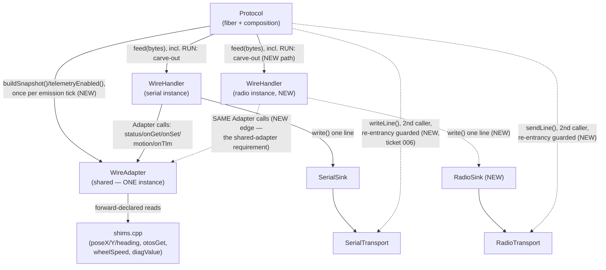

<!-- CLASI: Before changing code or making plans, review the SE process in CLAUDE.md -->

# Sprint 004: Radio full v6 transport + telemetry frame (firmware)

## Goals

This is the **firmware sprint** — the first of a two-sprint arc closing
`radio-speaks-full-v6-and-v6-gets-its-telemetry-frame.md` (Phases A-C) and
`status-lost-diag-numeric-surface.md` (via the `i2cf` column and `STATUS
i2cf=`). A second roadmap sprint retrofits the host tooling
(`tools/tlm.py` and its six consumers) onto the wire format this sprint
produces — deliberately deferred, planned separately, and out of scope
here.

**Scope boundary (read this before writing tickets in Detail Mode): this
sprint ends at a verified build, not a verified robot.** Phase C is a
bench checkpoint — build a flashable hex and hand the checkpoint to the
stakeholder. Flashing and hardware validation happen at the bench between
this sprint and the next; they are not sprint work. The instinct to keep
going past the hex and "just try it on hardware" should be resisted — the
whole reason for the two-sprint split is that the wire format must be
confirmed on real hardware before six tools are written against it. Do
not blur that line when detailing tickets.

## Problem

Sprint 003's v6 cutover left two holes that only became visible on the
bench, and they are one sprint because the second is worthless without
the first — tours run over radio, so a telemetry frame that cannot reach
the relay fixes nothing:

1. **Radio only accepts `RUN:`.** The v6 protocol stack (ack/nack,
   `TLM`, `STATUS`, etc.) is unreachable over radio; only the legacy
   `RUN:` prefix works. Stakeholder intent (2026-08-23): the radio is
   meant to be the full protocol, the same as every other transport. The
   sprint-003 restriction was recorded as an open question, not a design
   decision, and its rationale is circular (radio can't reach v6 because
   RX stays RUN-only, which justifies keeping RX RUN-only).
2. **There is no telemetry frame.** `WireHandler::emitTelemetry()` emits
   only the ack/nack keepalive; the old v5 `TLM:` cleartext line was
   deleted with no v6 replacement. `tour_run.py`, `tour_capture.py`,
   `tour_watch.py`, `truth_check.py`, `rotation_check.py`, and
   `tour_practice.py` all run to completion and silently write **empty**
   CSVs — an instrument that returns nothing is indistinguishable from a
   robot that did nothing, and it produces confident, wrong tour scores
   until fixed.
3. **`STATUS` has no numeric surface.** The retired `DIAG` verb's ~15
   numeric fields (most importantly `i2cf`, the I2C fault counter used to
   diagnose a wedged/unpowered Nezha brick) never migrated to `STATUS` or
   anywhere else in v6.

## Solution

### Phase A — radio becomes a full v6 transport

Per spec (`wifi-link.md:373` — one `ProtocolHandler` per transport over
one shared adapter): add a second `WireHandler` for radio plus a
`RadioSink` alongside the existing `SerialSink`, route radio RX into that
handler instead of the `RUN:` prefix test (**keep the `RUN:` carve-out**
as a fallback — `test.ts` bench tooling still speaks it; try v6 first),
and give each handler its own 50 ms keepalive cadence. Two independent
handlers over a shared adapter is what prevents two hosts from
corrupting each other's `expectedNext_`/`gapOutstanding_` sequence state
— it is a structural requirement, not an optimization.

Add a **re-entrancy guard** on `RadioTransport`: its `payloadBuf_`/
`frameBuf_` are documented single-fiber-only, and this phase adds the
protocol fiber as a second caller of `datagram.send()` (which can block
and yield) alongside the existing TS-fiber caller. A `sending_` bool
makes the second caller drop; a bool return lets `emitLine()`
`fiber_sleep(2)` and retry once. Losing a `t` telemetry frame is
harmless (the `seq` gap makes it visible); losing an `OCAL:` corner fix
silently degrades tour scoring, so the retry matters more on that path.

### Phase B — the `thdr`/`t` telemetry frame

Wire shape per `protocol.md` §5.2: `thdr <col> …` then `t <v> …`,
space-separated, lowercase, unsequenced (no `#id`). Adapter builds and
scales a `Column`/`Snapshot` pair; the handler only prints. Split
`emitTelemetry()` into `emitTelemetry(snapshot)` (thdr-if-due -> t) and
`emitReliability()` (today's ack/nack keepalive), so the keepalive
survives `TLM OFF`. Memoize the header (count/names/hex-ness, stored as
a copy) but **also re-emit every 20 frames (~1 Hz)** — a lossy broadcast
radio with tools that attach after boot would otherwise see `thdr` once
and never decode a `t` frame again.

POSE columns: the archived v6 set (`seq now flags x y h ox oy oh`) plus
`vl vr i2cf`. `vl`/`vr` belong in POSE, not FULL, because wheel speed
must never be re-derived by differencing the pose stream (24 ms ticks
sampled at ~56 ms alias into a ±25% sawtooth) — putting the correct
instrument on the default channel is what stops a consumer inventing the
wrong one. `i2cf` closes `status-lost-diag-numeric-surface.md`; also add
`i2cf=<n>` to `STATUS`, sourced from the same shared `computeFlags()`
that back both surfaces so they cannot disagree. FULL adds `cyc posl
posr dutl dutr lexc wrng cycovr`. Units stay v5-compatible plain
integers (no adoption of the reference implementation's `mm/s ×10`
quantum). Boot default is spec-conformant `TlmMode::kOff` — safe only
because Phase A means a radio host can now send `TLM POSE #1` itself.

Projection lives on `WireAdapter` (the only object holding `mode_`) via
new public `buildSnapshot()`/`telemetryEnabled()` methods, reached
through the existing forward-declaration block in `wire_adapter.cpp`
(all five sources already exist in `shims.cpp` — no new entry point, no
new header). Three hazards to comment at that block, each having already
cost real debugging time on this project:

- `poseX/Y/Heading` **mutate** (each calls `odomUpdate()`), and that is
  load-bearing — between moves nothing else advances odometry, so the
  50 ms telemetry frame is what keeps pose current when idle. Do not
  collapse into one cached read.
- `otosGet(0)`/`(1)` are **0.1 mm**; `otosGet(2)` is already centidegrees.
  Divide only the first two.
- `otosGet()` reads a **cache**; the protocol fiber must **never** call
  `otosRead()` — an I2C transaction interposed in the Nezha encoder's
  select->read window destroys the sample. This is the single hardest
  constraint in the sprint: the protocol fiber must never touch I2C.

Formatting constraints: build the line into a `WireHandler` **member**
buffer, never a stack local — the protocol fiber is 2 KB, `run()` already
holds a 240-byte line buffer, and `radio_transport.h:128` records a
measured hard-fault about 1 s after boot from exactly this mistake. Use
plain `snprintf` (not `std::snprintf` — not in `namespace std` on this
newlib-nano toolchain) and **no `%f`** anywhere (no float printf on
target) — emit scaled integers only. `RadioTransport::sendLine()`
silently truncates at 200 bytes, so the widest FULL column set must stay
under that.

### Phase C — bench checkpoint (end of this sprint)

Build a flashable hex via the project's deploy tooling. **This sprint
stops here.** No flashing, no hardware validation, no live telemetry
capture — those happen at the stakeholder's bench between this sprint
and the next, against a wire format this sprint has built and host-tested
but not yet run on a robot.

### PXT/toolchain traps to carry into implementation

- `//%` shims with 5+ `int32` params fail the build, pointing at
  `main.ts(1,1)` with no useful diagnostic.
- A `//%` annotation must sit immediately above the function signature it
  decorates.
- Namespace-level `let` initializers run **after** test-file top-level
  code — ordering-sensitive.
- The token "radio" followed by a period, even inside a comment, makes
  PXT demand a package this project does not use — watch comment wording
  near the radio changes.

## Success Criteria

- Radio accepts and answers the full v6 protocol (ack/nack, `TLM`,
  `STATUS`, etc.), not just `RUN:`; the `RUN:` fallback still works.
  (Within radio's existing single-fragment RX capacity — see Scope's
  Out of Scope entry on RX capacity/fragmentation; this sprint changes
  the GRAMMAR radio speaks, not how much of it fits in one fragment.)
- A `t` telemetry frame reaches both serial and radio sinks, correctly
  scaled (host tests prove scale, not just shape — see the issue's
  verification table for the specific scale-mismatch cases each test
  must catch).
- `thdr` behavior is correct: emitted on frame 1, on count/name/hex-ness
  change, and every 20 frames; never interleaved incorrectly with `t`
  and the ack/nack line.
- `STATUS` gains `i2cf=`, agreeing with the telemetry `i2cf` column
  because both are sourced from one shared `computeFlags()`.
- Per-transport reliability state stays isolated: a sequence gap on one
  transport does not disturb the other's `expectedNext_`.
- The protocol fiber never calls `otosRead()` (host-testable invariant).
- `uv run pytest` (220+ tests) passes; `uv run python
  tools/make_deploy.py` produces a flashable hex.
- Sprint ends at that verified build — no hardware validation performed
  or claimed as part of this sprint's completion.

## Scope

### In Scope

- Phase A: second `WireHandler` + `RadioSink` for radio over the shared
  `WireAdapter`; radio RX routed to it with the `RUN:` carve-out kept as
  fallback; `RadioTransport` re-entrancy guard.
- Phase B: `Column`/`Snapshot` types, `thdr`/`t` telemetry frame, header
  memo + 1 Hz refresh, `emitTelemetry`/`emitReliability` split,
  `WireAdapter` projection (`buildSnapshot()`, `telemetryEnabled()`),
  shared `computeFlags()`, `STATUS i2cf=`.
- Phase C: build a flashable hex as a bench checkpoint and hand over.
- Host-test verification per the issue's scale/frame-mechanics/
  per-transport-reliability tables, including the two "unusual" tests
  (`otosRead` absence in `wire_adapter.cpp`; a shared golden telemetry
  frame fixture used by both the C++-driven test and the Python parser
  test).
- **Serial transport hardening** (issue
  `serial-transport-rx-ring-and-tx-serialization.md`, code review
  R-19/R-20; ticket 006): `SerialTransport`'s RX ring resized from
  128 B to >= 480 B (>= 2x `kMaxLineBytes`), and a bounded-retry
  serialization guard on `SerialTransport::writeLine()` so `emitLine()`
  (TS fiber) and the serial `WireHandler`'s own replies/keepalives
  (protocol fiber) can no longer interleave or silently drop into one
  serial port. Corrects ticket 002's original AC, which wrongly
  asserted the serial path needed no such guard.
- **STATUS reports OTOS truthfully** (code review R-22/WIRE-06; folded
  into ticket 004): `out.otos` stops hardcoding `false` and instead
  reads the already-existing `otosGet(7)` connected boolean, so
  `STATUS` cannot claim "no OTOS" while `GO_TO_W` is actively using one.

### Out of Scope

- **Host tooling** (`tools/tlm.py` and retrofitting `tour_run.py`,
  `tour_capture.py`, `tour_watch.py`, `truth_check.py`,
  `rotation_check.py`, `tour_practice.py`) — deliberately deferred to a
  second sprint (issue `retrofit-bench-tooling-onto-the-v6-telemetry-stream.md`),
  planned separately so it targets a wire format a robot has confirmed
  rather than one that exists only on paper.
- **Flashing and hardware validation** — performed by the stakeholder at
  the bench between the two sprints, not sprint work.
- **Any change to `radio-robot-lib`** — that repo is spec authority and
  has its own active sprint; this sprint reads its `protocol.md`,
  `wifi-link.md`, and reference implementation but does not modify it.
- The two already-dead-independent-of-v6 tooling branches noted in the
  issue (`tour_watch.py:202`'s `len(f) == 7` check and
  `tour_capture.py:70`'s 7/4/3 field-count check) — real bugs, but they
  belong to the host-tooling sprint, not this one.
- **Radio RX capacity / fragmentation** (code review R-27/DES-01).
  `RadioTransport`'s RX path stays a single 64-byte slot with no
  multi-fragment reassembly, unchanged from before this sprint — this
  is a decision, not an oversight the review's previous "modulo the
  existing single-fragment RX size limit" one-liner made it sound like.
  Stated honestly: a v6 command line sent host-to-robot over radio
  whose encoding does not fit in that single 64-byte fragment does not
  fail cleanly today — depending on where the overflow lands, it either
  clamps to a parseable prefix (silently executing a truncated, wrong
  command) or is silently dropped. This sprint adds ZERO capacity or
  fragmentation work to change that. In practice this affects only v6
  lines whose formatted length exceeds ~64 bytes; the current verb
  catalog's short commands (`STATUS #1`, `HELLO`, `WHEELS_V 100 100 500
  #3`, etc.) fit comfortably, and `test.ts`'s `RUN:` bench tooling is
  well under the limit too — a verbose multi-field `SET` line is the
  plausible case that would not fit. This is deliberately out of scope
  for 004: Phase A's goal is making radio speak the v6 GRAMMAR, not
  resizing its RX capacity, and the existing hazard (present before
  this sprint, unchanged by it) is not this sprint's regression to fix.
  If bench use surfaces it as a real problem, that is follow-up work
  for a future sprint, not a silent expansion of this one's scope. (See
  also Open Question 2, below, for the SEPARATE and already-tracked
  TX-side 200-byte truncation cap on radio's outbound telemetry line —
  that is a different direction and a different limit from this one.)

## Test Strategy

Host-testable, no hardware required for this sprint's completion:
scale-correctness tests per the issue's table (each test picks
input/expected pairs where source and wire values differ by the factor
under test, not just shape), frame-mechanics tests (thdr cadence and
byte-exact ordering, `seq` wraparound 127->0), per-transport reliability
isolation, the `otosRead`-absence invariant, a `STATUS otos=` truthful-
reporting test (R-22, ticket 004), and a shared golden telemetry frame
fixture consumed by both the emitter-side C++ test and the Python
parser test so the two cannot drift. Full detail deferred to Detail
Mode's Use Cases / ticketing. **Not host-testable, by construction**
(both `radio_transport.cpp` and `serial_transport.cpp` `#include`
`pxt.h` directly with no host shim): `RadioTransport`'s re-entrancy
guard (ticket 002) and `SerialTransport`'s RX ring resize + write guard
(ticket 006, added post-review) — both verified by code review and
first exercised live at ticket 005's bench checkpoint.

## Architecture

**Substantial** — this sprint touches five modules with a new
cross-module dependency (a second `Wire::WireHandler` instance now
shares the one existing `WireAdapter`; `Protocol` gains a direct
`buildSnapshot()`/`telemetryEnabled()` call onto that adapter it never
made before) and introduces a new wire-facing value type (`Column`/
`Snapshot`) that two independent formatting call sites must agree on
byte-for-byte. It also closes sprint 003's own "Open Question 4" (the
radio RUN-only carve-out) by design, not by accident. **Amendment
(post-review, ticket 006):** `src/serial_transport.{h,cpp}` joins the
touched-module set — code review 2026-08-23 (R-19/R-20) found the
serial transport needs its own RX-ring resize and TX-serialization
guard, mirroring `RadioTransport`'s (this sprint does not add a NEW
cross-module dependency for this — `SerialTransport` was already
reached from `protocol.cpp` before this sprint; only its own internal
guard and ring size change). The full 7-step methodology applies,
diagrams included — no exception like sprint 020's is available here,
because this sprint's whole point is composing a NEW relationship
between existing modules (two handlers over one adapter), which is
exactly the case the methodology's diagram requirement exists for.

There is still no consolidated `docs/architecture/` document for this
project (only `docs/design/{overview.md,specification.md,
usecases.md}`, which describe the student-facing block API and predate
the wire protocol entirely) — this section is written against sprint
003's own Architecture section (the most recent structural precedent)
and the current source under `src/`.

### Architecture Overview

#### Step 1 — Understand the Problem

Today `src/protocol.cpp` owns exactly one `Wire::WireHandler` wired to
one `SerialSink`/`SerialTransport`; `RadioTransport` exists only as a
narrow, literal-prefix `RUN:` receiver feeding the old cleartext
MessageBus bridge, and its `sendLine()` has exactly one caller (the TS
fiber, via `Protocol::emitLine()`). `WireHandler::emitTelemetry()` takes
no arguments and emits only the ack/nack keepalive — there is no
telemetry frame anywhere in v6, and `STATUS` carries none of the ~15
numeric fields `DIAG` used to. Three problems, one root cause each:

1. Radio speaks a different, narrower grammar than serial, for a reason
   (sprint 003's Open Question 4) that turns out to be circular: RX
   stays RUN-only because nothing could reach the v6 stack over radio,
   which is true only because RX stays RUN-only.
2. `WireHandler`'s telemetry hook was deliberately left a stub (sprint
   003 ticket 005's own header comment names this exact gap) pending a
   real `Column`/`Snapshot` projection this sprint now builds.
3. `STATUS`'s numeric surface was never carried forward from `DIAG`
   because nothing in v6's verb catalog owned it — this sprint decides
   it belongs partly in `STATUS` (`i2cf=`, genuinely status) and partly
   in telemetry (everything else FULL adds), per the issue's own
   resolution of that split.

All three share one structural precondition: `wifi-link.md:373`'s "one
`ProtocolHandler` per transport over one shared adapter." Radio cannot
safely become a full v6 transport by just relaxing protocol.cpp's RX
prefix check, because a single shared `WireHandler` would let two
independent hosts (wired + radio) corrupt each other's
`expectedNext_`/`gapOutstanding_`. The second handler is not an
optimization; it is the precondition for Phase A being safe at all.

#### Step 2 — Responsibilities Identified

1. **Transport composition and scheduling** — owning the CODAL fiber,
   routing each transport's inbound bytes to its OWN handler (with the
   `RUN:` literal-prefix carve-out preserved, unchanged, on both), and
   driving each handler's periodic emission on the existing 50 ms
   cadence. Changes only for transport/scheduling reasons, never for
   wire-grammar or telemetry-content reasons. (`src/protocol.{h,cpp}`)
2. **Radio send-path safety** — the `RadioTransport` re-entrancy guard
   that lets a second fiber (the protocol fiber, newly a sender as of
   this sprint) share `sendLine()`'s member scratch buffers with the
   existing TS-fiber caller without corrupting them. Changes only when
   the concurrency story on that one class changes. (`src/radio_transport.{h,cpp}`)
3. **Wire line formatting, including telemetry** — turning a
   caller-supplied `Snapshot` into `thdr`/`t` lines, deciding when a
   fresh `thdr` is due (change OR staleness), and keeping the ack/nack
   keepalive alive independent of whether telemetry is subscribed.
   Changes only when the wire GRAMMAR for these lines changes; has no
   opinion on what a column means. (`src/wire_handler.{h,cpp}`)
4. **Robot-state projection** — reading live pose/OTOS/wheel-speed/diag
   state through the existing `shims.cpp` seam, scaling it to the
   wire's integer units, and assembling the POSE/FULL column sets plus
   `STATUS`'s flags/`i2cf`. Changes only when the column set or a scale
   factor changes; has no wire-byte or CODAL awareness of its own.
   (`src/wire_adapter.{h,cpp}`)
5. **Serial send-path safety** *(added post-review, ticket 006)* — the
   RX-ring capacity and write-serialization guard that let two fibers
   (the TS fiber's `emitLine()`, the protocol fiber's serial
   `WireHandler` replies/keepalives) share `writeLine()`'s underlying
   wire without overflowing or corrupting it. Changes only when the
   concurrency or capacity story on that one class changes.
   (`src/serial_transport.{h,cpp}`)

Responsibilities 1, 2, and 5 are already separate modules today and
stay separate (a scheduling bug, a radio-buffer-corruption bug, and a
serial-ring/write-corruption bug have nothing structurally in common
with each other, even though 2 and 5 are analogous IN KIND — same
category of defect, different transport, deliberately not unified into
one shared guard abstraction, per Design Rationale); 3-4 are the same
handler/adapter split sprint 003 already established for command
verbs, extended here to telemetry for the identical reason — "the
adapter builds and scales; the handler only prints" (`protocol.md`
§5.2) is a boundary this project already has, not a new one.

#### Step 3 — Subsystems and Modules

| Module | Purpose (one sentence) | Boundary | Use cases served |
|---|---|---|---|
| `src/protocol.{h,cpp}` **(extended)** | Owns the fiber loop and composes two independent transport/handler pairs over one shared adapter. | Inside: the CODAL fiber, per-transport RX routing (incl. the `RUN:` carve-out on both transports), the per-tick decision to call `buildSnapshot()`+`emitTelemetry(snapshot)` vs. plain `emitReliability()` on each handler. Outside: wire grammar, verb behavior, telemetry scaling. | SUC-001, SUC-002, SUC-006 |
| `src/wire_handler.{h,cpp}` **(extended)** | Formats and dispatches wire lines, including the self-describing telemetry frame. | Inside: `feed()`/`dispatch()` (unchanged), the new `Column`/`Snapshot` value types, `emitTelemetry(snapshot)`/`emitReliability()`, the per-instance header memo + 1 Hz refresh, per-instance `expectedNext_`/`gapOutstanding_`. Outside: what a column MEANS, any robot state, any CODAL type. | SUC-001, SUC-002, SUC-003, SUC-004 |
| `src/wire_adapter.{h,cpp}` **(extended)** | Projects live robot state into wire-scaled columns for whichever handler asks, and answers `STATUS`. | Inside: `buildSnapshot()`/`telemetryEnabled()`, the shared `computeFlags()`, the POSE/FULL column tables, `STATUS`'s `i2cf=` key. Outside: any wire byte, any CODAL/I2C call — `otosRead()` never appears here. | SUC-003, SUC-004, SUC-005 |
| `src/radio_transport.{h,cpp}` **(extended)** | Gets a formatted line onto the fleet radio, now safely shared by two independent fiber callers. | Inside: the `sending_` re-entrancy guard, the bool-returning `sendLine()`, fragment framing (unchanged). Outside: line content, verb semantics, retry policy (that lives in the caller). | SUC-001, SUC-002 |
| `src/serial_transport.{h,cpp}` **(extended, added post-review)** | Gets a formatted line onto USB-serial, now safely shared by two independent fiber callers. | Inside: the RX/TX ring size constants (sized for a full v6 line), the bounded-retry serialization guard around `writeLine()`, the new serial-drop counter. Outside: line content, verb semantics, retry POLICY choice for other transports (radio's policy is its own, per Design Rationale). | SUC-007 |
| `src/shims.cpp` **(no new entry point)** | Already-existing forward-declared reads (`poseX`/`poseY`/`poseHeading`/`otosGet`/`wheelSpeed`/`diagValue`) that this sprint's projection reuses as-is. | Inside: unchanged, plus one new `diagValue()` switch case (26, the serial-drop counter — a new case, not a new function). Outside: unchanged — this sprint adds zero new FUNCTIONS here. | SUC-003, SUC-004, SUC-005, SUC-007 |

Every module addresses at least one SUC below; each passes the
cohesion test in one sentence, no "and" (the table's "Purpose" column
is that sentence, verbatim).

#### Step 4 — Diagrams

**Component diagram** — required: a new cross-module dependency is
introduced (a second `WireHandler` instance now depends on the SAME
`WireAdapter` instance the first one already used; `Protocol` gains a
direct edge onto `WireAdapter` it never had before).

Dashed edges are new as of this sprint; solid edges already existed
(radio's own `RUN:`-only receive path, not drawn separately, is the
same "route RX bytes in" edge `proto --> wireHR` now generalizes). The
`proto -.-> serT` edge is an amendment added after the initial
architecture review (code review R-19/R-20): `emitLine()` was already
a caller of `serT` via `wireHS`'s sink before this sprint, but this
sprint is what makes that a formally-guarded, DOCUMENTED two-caller
relationship (ticket 006), the same way `proto -.-> radT` already was
in the original plan for radio.

**ERD**: none. `Column`/`Snapshot` are transient, stack/member-lived
formatting value objects for one emission tick — nothing here is
persisted, and no existing schema changes.

**Dependency graph**: the component diagram above already shows every
new edge. No cycle exists: `wireA -> shims` is one direction (`shims`
calls nothing back into `wire_adapter.cpp`); `wireHS`/`wireHR ->
wireA` is one direction (the `Wire::Adapter` interface is called BY the
handler, never the reverse); `proto -> {wireHS, wireHR, wireA, radT,
serT}` fans out from the one composition root (the `serT` edge added
post-review, ticket 006), with no edge pointing back into `proto` from
any of them.

#### Step 5 — What Changed / Why / Impact

**What Changed**

- `src/protocol.h`/`.cpp`: a second `Wire::WireHandler` (`wireHandlerRadio_`)
  plus a `RadioSink`, constructed the same NSDMI way `wireHandler_`/
  `serialSink_` already are; radio RX gains the SAME `RUN:`-literal-vs-v6
  branch serial's RX already has (`run()`'s existing radio-poll block is
  extended, not replaced); the periodic-emission block now drives BOTH
  handlers, and — once Phase B lands — decides per tick whether to call
  `wireAdapter_.buildSnapshot()` once (shared by both handlers) or skip
  straight to `emitReliability()` on each, based on
  `wireAdapter_.telemetryEnabled()`.
- `src/radio_transport.h`/`.cpp`: `sendLine()` returns `bool` (false =
  dropped, contention); a `sending_` guard around the
  `datagram.send()`-touching body protects `payloadBuf_`/`frameBuf_`
  now that a second fiber (the protocol fiber, via `RadioSink`) is a
  caller alongside the existing TS-fiber caller (`Protocol::emitLine()`);
  `emitLine()` alone gets a `fiber_sleep(2)`-and-retry-once on a dropped
  send (telemetry frames do not retry — see Design Rationale).
- `src/wire_handler.h`/`.cpp`: new `Column`/`Snapshot` structs (mirroring
  `radio-robot-lib/src/protocol/adapter.h:113-139`); `emitTelemetry()`
  splits into `emitTelemetry(const Snapshot&)` (thdr-if-due -> t ->
  `emitReliability()`) and `emitReliability()` (today's ack/nack
  keepalive, unchanged behavior); a per-instance header memo
  (`headerChanged()`/`rememberHeader()`, `kMaxHeaderColumns=40`,
  `kMaxHeaderNameBytes=16`) plus a 20-frame (~1 Hz) forced refresh; a
  member format buffer (never a stack local).
- `src/wire_adapter.h`/`.cpp`: new public `buildSnapshot()`/
  `telemetryEnabled()`; a `computeFlags()` free function extracted from
  the existing inline flags computation inside `status()` (unchanged
  bit layout), now called from BOTH `status()` and `buildSnapshot()`;
  five new forward declarations to `shims.cpp` (`poseX`/`poseY`/
  `poseHeading`/`otosGet`/`wheelSpeed`) — all five functions already
  exist there today; `execStatus()`'s format string gains `i2cf=<n>`,
  read via the ALREADY-forward-declared `diagValue(8)`.
- **`src/serial_transport.h`/`.cpp` (amendment, ticket 006):** RX/TX
  ring size raised from 128 B to >= 480 B (>= 2x `kMaxLineBytes`); a
  bounded-retry serialization guard around `writeLine()` so `emitLine()`
  and the serial `WireHandler`'s own replies/keepalives can no longer
  interleave or silently drop into one write; both `uBit.serial.send()`
  return values checked, with drops counted in a new `diagValue(26)`
  ordinal (`src/shims.cpp` gains one new `switch` case, not a new
  function).
- No new files. `pxt.json`'s `files` array needs no update (unlike
  sprint 003) — every change lands inside an existing `.h`/`.cpp` pair.

**Why**

Phase A is required before Phase B can matter: a telemetry frame that
cannot reach a radio host fixes nothing, since tours run untethered
(sprint.md Problem). Phase A itself requires the second-handler
structure because `wifi-link.md:373` is the ONLY architecture that lets
two hosts share one robot's reliability state safely. Phase B's
handler/adapter split mirrors sprint 003's own command-verb boundary
onto telemetry, for the same reason: `WireHandler` stays testable
against a canned `Snapshot` with no robot state, and `WireAdapter`
stays the one place scale factors live and can drift. Ticket 006's
serial hardening is added for a related but distinct reason: this
sprint is what puts the protocol fiber and the TS fiber's `emitLine()`
under closer review as concurrent transport writers (that review is
what caught R-20's radio half), and the same review caught that the
identical two-writer hazard already existed on serial, unfixed,
independent of anything this sprint otherwise changes there — fixing
it in this sprint (rather than filing it away for a later one) keeps
one sprint's review from leaving a confirmed, described defect
sitting unaddressed in a component this sprint is already touching.

**Impact on Existing Components**

- `Wire::Adapter` (the interface, `wire_handler.h`) — **none**: no
  method signature changes; `buildSnapshot()`/`telemetryEnabled()` are
  NEW methods on the concrete `WireAdapter`, not additions to the
  abstract contract (mirroring the reference's own `DiffDriveAdapter`-
  specific `buildSnapshot()`, not an `Adapter`-interface method).
- `tests/host/wire_mock_adapter.h` (`WireMockAdapter`) — **none required**
  for Phase A/the reliability-isolation test (two existing `Handle`s from
  `wire_grammar_shim.cpp` already have independent `WireMockAdapter`s and
  independent `WireHandler`s — the isolation property is already true of
  the CLASS, this sprint's job is to prove it and then rely on it in
  production). Phase B's handler-formatting tests construct a `Snapshot`
  by hand and need no adapter changes either.
- `tests/host/wire_motion_verb_shim.cpp` (`WaHandle`) — **extended**: five
  new test-double functions (mirroring `poseX`/`poseY`/`poseHeading`/
  `otosGet`/`wheelSpeed`) plus settable raw-unit state, needed by the
  projection ticket's scale tests.
- Existing serial-only verb BEHAVIOR (`STATUS`, `GET`/`SET`, the six
  motion verbs, `HELLO`/`PING`/`ESTOP`) — **unchanged at the wire-grammar
  level**: every existing verb's wire shape is untouched; `STATUS` gains
  two new keys (`i2cf=`, and `otos=` now reports truthfully instead of
  a hardcoded `false` — R-22), backward compatible per `protocol.md`
  §6.1's own "unknown keys ignored." **Correction (amendment, ticket
  006): serial's underlying TRANSPORT is NOT unchanged** — an earlier
  draft of this bullet claimed it was; code review R-19/R-20 found
  `SerialTransport`'s RX ring (v5-sized) and its unguarded two-fiber
  write path needed the same hardening `RadioTransport` gets in ticket
  002, and ticket 006 now does that. The wire GRAMMAR any existing host
  parses is unaffected; the TRANSPORT layer beneath it gets a bigger RX
  ring and a write guard it did not have before this sprint.
- `test.ts`/bench tooling's `RUN:` bridge — **unchanged** on both
  transports; this is the one grammar this sprint deliberately does not
  touch.
- Host tooling (`tour_run.py` etc.) — **still produces empty telemetry
  CSVs after this sprint**, unchanged from today, because parsing `t`
  frames is sprint 005's explicit, deliberately deferred scope. Not a
  regression introduced here; a gap this sprint narrows (the frame now
  EXISTS on the wire) but does not close end-to-end.

### Design Rationale

**Decision: two independent `WireHandler` instances over ONE shared
`WireAdapter` — not a single handler multiplexing both transports, and
not two independent adapters.**
*Context*: `wifi-link.md:373` prescribes "a separate `ProtocolHandler`
per transport over one shared adapter"; this project has exactly one
robot's worth of state to project (one kernel, one pose, one OTOS).
*Alternatives considered*: (a) one `WireHandler` fed by both
transports, tagging each inbound line with its origin; (b) two
handlers, each with its OWN adapter instance; (c) two handlers sharing
one adapter, per spec.
*Why this choice*: (c). (a) would share `expectedNext_`/
`gapOutstanding_` across two independent hosts — a gap on one transport
would nack the OTHER transport's next command, which is exactly the
corruption two-handlers-per-spec exists to prevent. (b) would let
`STATUS`/telemetry on the two transports report two different robots
that happen to share hardware (two independent `mode_`/motion-obligation
state machines racing to command the same kernel) — worse, not better,
than the shared-state consequence (c) accepts explicitly.
*Consequences*: `WireAdapter`'s `mode_` (the `TLM` subscription) is now
process-global across transports — see Open Questions.

**Decision: `Protocol::run()` calls `wireAdapter_.buildSnapshot()` at
most ONCE per emission tick, passing the SAME `Snapshot` reference to
both handlers' `emitTelemetry()` — not once per handler.**
*Context*: `buildSnapshot()` calls `poseX()`/`poseY()`/`poseHeading()`,
each of which MUTATES odometry (`odomUpdate()`); it also advances a
`seq` counter and reads `wheelSpeed()`/`otosGet()`/`diagValue()` fresh.
*Alternatives considered*: (a) each handler calls
`wireAdapter_.buildSnapshot()` for itself, right before its own
`emitTelemetry()`; (b) `Protocol::run()` builds one snapshot per tick
and hands the same reference to both handlers.
*Why this choice*: (b). (a) would run `odomUpdate()` and every other
projection read twice per 50 ms tick for no benefit, and would advance
`seq` twice per tick — meaning serial and radio would report DIFFERENT
`seq`/`now` values for what a human bench-watcher would reasonably
expect to be "the same instant." (b) costs one projection sweep per
tick regardless of how many transports are subscribed, and keeps both
streams' `seq`/`now`/pose numerically identical for the same tick,
which is the more honest behavior for two views onto one robot.
*Consequences*: each handler still independently decides its OWN
`thdr`-due state (its own header memo, its own frame counter) even
though the underlying `Snapshot` values are shared — a host attaching
to radio mid-stream gets its OWN fresh `thdr` on ITS OWN schedule,
unaffected by serial's header history.

**Decision: `RadioTransport`'s re-entrancy guard is a plain `sending_`
bool with a bool-returning `sendLine()` and a one-shot
`fiber_sleep(2)`-and-retry on the `emitLine()` caller only — not a full
lock, and not a blocking wait on every caller.**
*Context*: `payloadBuf_`/`frameBuf_` are members (`radio_transport.h:128`'s
measured hard-fault history is why they are members and not stack
locals in the first place), and `datagram.send()` can block/yield —
this sprint adds the protocol fiber as a SECOND caller alongside the
existing TS-fiber caller.
*Alternatives considered*: (a) a real critical section/mutex around the
whole send path; (b) a single bool guard, second caller drops
immediately; (c) (b), plus a bounded retry on the ONE caller whose
loss is user-visible.
*Why this choice*: (c). CODAL offers no cheap mutex primitive this
project already uses elsewhere, and the two callers have asymmetric
stakes: a dropped `t` telemetry frame self-heals for free (the `seq`
gap makes it visible next frame), but a dropped `emitLine()` call can
be a test's own recorded result (e.g. an `OCAL:` corner fix) with no
retransmission mechanism of its own — losing it silently degrades tour
scoring. (a) is more machinery than two callers and one asymmetric
retry need.
*Consequences*: a telemetry frame CAN be silently dropped under
contention with no retry, by design — this is stated explicitly here so
a future reader does not "fix" it into matching `emitLine()`'s retry.

**Decision (amendment, ticket 006): `SerialTransport`'s two-writer guard
uses a bounded retry on BOTH callers, not radio's asymmetric
drop-vs-retry-once.**
*Context*: code review R-19/R-20 found the identical two-fiber
`writeLine()` hazard already existed on serial, predating this sprint;
fixing it means choosing a guard policy the same way ticket 002 already
had to for radio.
*Alternatives considered*: (a) copy radio's exact policy (second caller
drops immediately, only `emitLine()` retries once); (b) a bounded retry
on every serial caller, capped and counted via a new `diagValue()`
ordinal.
*Why this choice*: (b). Radio's asymmetry is justified by telemetry's
own self-healing `seq` gap and by `emitLine()` being the one caller
whose loss is user-visible; serial has no such split — a lost `STATUS`
reply from the protocol fiber's `WireHandler` is exactly as bad as a
lost `emitLine()` result, so treating every serial writer the way
radio treats only `emitLine()` is the more honest match for serial's
actual stakes. Serial's lower contention (one host, not a fleet) also
makes the extra bounded-retry latency cheap.
*Consequences*: `RadioTransport` and `SerialTransport` now have two
DIFFERENT guard policies, deliberately, not a shared base class — a
future reader should not "unify" them without first re-reading this
decision and ticket 002's matching one.

**Decision: wire units for the new POSE/FULL columns stay v5-compatible
plain integers (`x`/`y` in mm, `vl`/`vr` in mm/s, etc.) — the
reference's `mm/s ×10` telemetry quantum is NOT adopted.**
*Context*: `radio-robot-lib`'s own `DiffDriveAdapter::buildSnapshot()`
emits `vell`/`velr` as `mm/s ×10` integers (its own §6.4 convention);
this project's `poseX()`/`poseY()`/`wheelSpeed()` already return plain
mm/mm/mm-per-s.
*Alternatives considered*: (a) adopt the reference's `×10` quantum for
consistency with the spec authority repo; (b) keep this project's
existing plain-integer scale, since it already has no fractional
precision need at these magnitudes.
*Why this choice*: (b) — sprint 005's host tooling (`tour_run.py` etc.)
and every existing test/bench script already assume v5's plain-integer
scale; changing scale during the SAME migration that changes framing
would be exactly the silent-wrong-number failure this project is
already primed to make (see the issue's own OTOS `/10` scale-test
table). `protocol.md` §5.2 does not mandate the `×10` quantum for every
adapter — it is `DiffDriveAdapter`'s own choice, not the wire grammar's.
*Consequences*: this project's `t` frames are not byte-compatible with
a tool written against `radio-robot-lib`'s own reference telemetry
scale — acceptable, since no such tool exists in this project's
tree, and the wire format is otherwise spec-conformant (self-describing
`thdr`, so no consumer hardcodes a column index either way).

**Decision: `computeFlags()` is extracted as a single free function
(unchanged bit layout) called from both `status()` and
`buildSnapshot()`; `i2cf` is read via the ALREADY-existing
`diagValue(8)` call from both `execStatus()` and `buildSnapshot()` —
not merged into one combined "status+telemetry" struct.**
*Context*: `status-lost-diag-numeric-surface.md` requires `STATUS`'s
`flags=` and the telemetry `flags` column to never disagree; the same
is true for `i2cf=` vs. the telemetry `i2cf` column.
*Alternatives considered*: (a) leave the flags computation duplicated
inline in both places (today's `status()` already inlines it; a new
copy in `buildSnapshot()` would be a second, independently-editable
copy); (b) extract `computeFlags()` once, call it from both; (c) go
further and build one combined struct carrying flags AND every numeric
field both surfaces need, computed in one call.
*Why this choice*: (b). Two call sites reading the SAME function (for
flags) and the SAME accessor (`diagValue(8)`, for `i2cf`) cannot drift
by construction, without inventing a new struct that `STATUS` and
telemetry would then BOTH have to depend on for fields they don't
otherwise share (`STATUS` has no other telemetry-shaped fields; a
combined struct would be speculative generality for a "shared source"
guarantee two function calls already provide).
*Consequences*: `computeFlags()`'s bit layout is unchanged from today's
inline version (this sprint moves it, does not redefine it) — no wire
compatibility break for existing `STATUS` consumers.

### Migration Concerns

- **No persistent data migration.** This firmware carries no on-device
  config store across versions (`protocol.md` §7's "the library stores
  none" posture, already this project's own); nothing here needs an
  upgrade path.
- **Backward compatible on the wire.** `STATUS` gains one new key
  (`i2cf=`); per `protocol.md` §6.1, "order not guaranteed, unknown keys
  ignored" — an existing host parsing `STATUS` today is unaffected.
  `STATUS`'s existing `otos=` key changes VALUE (R-22: it can now read
  `1`, not just an always-`0`) but not shape or key name — a host
  already parsing it as a boolean/int sees a more truthful number, not
  a new field to handle. Radio gaining the full v6 grammar is additive:
  the `RUN:` carve-out a bench host already speaks keeps working
  unchanged on both transports.
- **Serial transport hardening is a pure capacity/robustness change
  (amendment, ticket 006).** No wire-grammar host sees any difference —
  the RX ring resize and the TX serialization guard are both beneath
  the wire-grammar layer; a host that was already working reliably
  keeps working, and one hitting today's confirmed drop/interleave
  defects (R-19/R-20) stops hitting them. No migration action needed.
- **`TlmMode::kOff` boot default requires no code change** — `wire_adapter.h`
  already default-initializes `mode_` to `Wire::TlmMode::kOff` today;
  this sprint's Phase B only makes that default SAFE to rely on (a radio
  host can now self-subscribe via `TLM POSE #1`), it does not introduce
  the default.
- **Deployment sequencing**: this sprint's own stated scope boundary —
  Phase C produces a flashable hex and stops; flashing and hardware
  validation happen at the stakeholder's bench, between this sprint and
  sprint 005, against a format this sprint has host-tested but not yet
  run on a robot.
- **Host tooling stays broken exactly as it is today** — `tour_run.py`
  and its five siblings still write empty telemetry CSVs after this
  sprint (they do not yet parse `t` frames; that is sprint 005's whole
  job). Not a regression this sprint introduces; explicitly out of this
  sprint's scope, and the reason the two sprints are split at a bench
  checkpoint rather than done as one.
- **No `pxt.json` manifest change needed** — every change in this
  sprint lands inside a `.h`/`.cpp` pair already listed there; unlike
  sprint 003, no new file is added.

### Open Questions

1. **`TLM` subscription mode is now effectively global across
   transports.** Because both `WireHandler` instances share the ONE
   `WireAdapter` (`mode_` lives there, per Design Rationale), a radio
   host sending `TLM FULL #1` changes what the SERIAL host also
   receives, and vice versa — there is no per-transport subscription.
   This is a direct, structural consequence of `wifi-link.md`'s
   one-shared-adapter architecture, not an oversight, but it is a real
   behavior the stakeholder should confirm is acceptable: a bench
   technician on serial could see their telemetry mode change out from
   under them because a radio host (or a stale test.ts run) subscribed
   to something else. No action taken this sprint beyond documenting
   it; a per-transport mode would need its own follow-up if this proves
   surprising in practice.
2. **The widest FULL frame's byte width vs. `RadioTransport`'s silent
   200-byte truncation is UNVERIFIED at planning time.** POSE is 12
   columns; FULL adds 8 more (20 total). A pathological all-columns-
   near-`INT32_MIN` frame could approach ~240 bytes, over both
   `RadioTransport`'s 200-byte cap and close to `WireHandler`'s own
   240-byte line ceiling. Realistic values are far smaller, but "far
   smaller" is exactly the kind of claim that should be a test
   assertion, not an architecture-doc guess — ticket 004 must assert
   the actual formatted length for a realistic-but-large `FULL`
   snapshot, and ticket 005's bench checkpoint re-confirms the result in
   its handoff notes. If the test finds it too wide, the choice of
   whether to trim `FULL`'s radio-bound column set is deferred to
   whichever ticket's test fails, not decided here.
3. **Radio now carries line shapes (`thdr`/`t`/`ack`/`nack`/`err`/etc.)
   it never has before**, alongside the `RUN:` result lines any existing
   relay/log tooling already expects. No existing tool in this
   project's tree parses radio output structurally (confirmed: `tour_*.py`
   et al. read serial, not the relay's own logs), so this is not known
   to break anything today — flagged because sprint 005's tooling
   retrofit is the first place this would matter, and that sprint should
   inherit this note rather than rediscover it.
4. **Ticket 006's serial guard, like ticket 002's radio guard, has no
   host test for its real concurrency/timing behavior** (added post-
   review) — `SerialTransport`'s bounded-retry write guard and the RX
   ring resize are both first exercised live at ticket 005's bench
   checkpoint, not before. If the bench run shows unexpected serial
   drops or latency, that is this decision's first real feedback, not
   a regression from a previously-working state (the underlying R-19/
   R-20 defects were already present, just previously undocumented).

## Use Cases

None of `docs/design/usecases.md`'s UC-001..UC-016 cover wire-protocol
or telemetry behavior (they are all student-facing block use cases) —
every SUC below is bench/host-tooling scope, following sprint 003's own
precedent for this project's wire-protocol work.

### SUC-001: Radio Host Completes a Full v6 Session
Parent: N/A (bench/host use case; no student-facing block equivalent)

- **Actor**: A bench or fleet host (a relay-connected laptop, or a
  future `rogo`-style CLI) speaking protocol v6 over the radio relay.
- **Preconditions**: The robot has booted; the radio has joined the
  fleet's group/channel; the host is NOT constrained to `RUN:` anymore.
- **Main Flow**:
  1. Host sends `HELLO` over radio; robot resets radio's own
     `expectedNext_`/`gapOutstanding_` and replies with the boot banner
     shape.
  2. Host sends sequenced verbs (`STATUS #1`, `TLM POSE #2`,
     `WHEELS_V 100 100 500 #3`, etc.) over radio; each is acked/nacked
     exactly as it would be over serial.
  3. A bench test still sends the legacy `RUN:pivot:180` cleartext form
     over radio; it is recognized and dispatched via the unchanged
     MessageBus bridge, not rejected by the v6 grammar.
- **Postconditions**: The radio host has the same v6 command GRAMMAR a
  serial host has, but not the same CAPACITY (code review R-27/DES-01,
  CONFIRMED): `RadioTransport`'s RX path remains a single 64-byte slot
  with no multi-fragment reassembly, unchanged by this sprint. A v6
  line whose encoding does not fit that one fragment does not fail
  cleanly — it either clamps to a parseable prefix (silently executing
  a truncated, wrong command) or is silently dropped, depending on
  where the overflow lands. This sprint does not fix that; see Scope's
  Out of Scope entry for the explicit decision and what it excludes.
  `test.ts`'s bench tooling (well under 64 bytes per `RUN:` line) is
  unaffected either way.
- **Acceptance Criteria**:
  - [ ] A sequenced non-motion verb (`STATUS`/`GET`/etc.) sent over
        radio gets a correct ack/reply, not silently dropped.
  - [ ] A `RUN:name:arg` line sent over radio still dispatches through
        the existing MessageBus bridge, unchanged.
  - [ ] Radio's own `expectedNext_` starts at 1 and advances
        independently of anything happening on serial.
  - [ ] No new test is required to prove the single-fragment RX
        capacity itself (that limit is pre-existing and out of scope,
        per Out of Scope) — this SUC's acceptance is about GRAMMAR
        reachability for lines that already fit today's capacity.

### SUC-002: Two Transports Operate Without Cross-Contaminating Reliability State
Parent: N/A (bench/host use case; directly implements the architectural
requirement `wifi-link.md:373` states)

- **Actor**: Two independent hosts, one on serial (e.g. a bench laptop
  over USB) and one on radio (e.g. a relay-connected tour operator),
  talking to the same robot at the same time.
- **Preconditions**: Both transports are live; each host has its own
  view of "the next id I expect to have accepted."
- **Main Flow**:
  1. Radio host sends id `#1`, gets acked.
  2. Radio host's next command arrives as `#5` (a gap) — radio nacks
     and stalls, per the existing reliability layer's own rules.
  3. Serial host, meanwhile, sends its own `#1`, `#2`, `#3` in order —
     each acks normally, unaffected by radio's stalled gap.
- **Postconditions**: Radio's stall is visible only to the radio host;
  serial's sequence never skipped, nacked, or reset because of it.
- **Acceptance Criteria**:
  - [ ] A host test constructs two independent `Wire::WireHandler`
        instances, feeds a sequence gap into one, and asserts the
        other's `expectedNext_`/ack stream is completely unaffected.
  - [ ] The same test confirms neither handler's `malformedCount()` is
        affected by the other's traffic.

### SUC-003: A Telemetry Consumer Subscribes to POSE and Decodes a Self-Describing Frame
Parent: N/A (bench/host use case; implements `protocol.md` §5.2)

- **Actor**: A telemetry consumer (a future host parser, sprint 005's
  own eventual scope) attached from the very start of a session.
- **Preconditions**: `TLM POSE #<id>` has been accepted; the consumer
  has never seen a `thdr` line yet.
- **Main Flow**:
  1. First emission tick after subscribing: `thdr seq now flags x y h
     ox oy oh vl vr i2cf` goes out, then `t <12 values>`, then the
     ack/nack keepalive.
  2. Every subsequent tick (until 20 frames elapse or the column set
     changes): just `t <12 values>` then the keepalive — no repeated
     `thdr`.
  3. `x`/`y` are odometry mm; `ox`/`oy` are OTOS mm (correctly divided
     by 10 from the raw 0.1 mm source); `h`/`oh` are both centidegrees,
     unconverted; `vl`/`vr` are mm/s straight from `wheelSpeed()`, never
     re-derived by differencing `x`/`y` across frames.
- **Postconditions**: The consumer can decode every `t` line using only
  the most recent `thdr`, with no hardcoded column index.
- **Acceptance Criteria**:
  - [ ] `thdr` is emitted on the very first frame, and NOT on the
        second, when nothing has changed.
  - [ ] Each scale test in the issue's Verification table passes,
        exercised against RAW shim units (e.g. `waSetOtosRaw()` takes
        0.1 mm), not wire units — a setter that took wire units would
        make the `/10` test tautological.
  - [ ] `vl`/`vr` are present in POSE (not FULL-only).

### SUC-004: A Telemetry Consumer Attaches Mid-Stream and Still Recovers the Header
Parent: N/A (bench/host use case; the issue's own stated rationale for
the 1 Hz refresh)

- **Actor**: A relay-attached tool that starts listening some time
  after the robot booted and telemetry has been streaming for a while.
- **Preconditions**: The robot has been emitting `t` frames for more
  than 20 frames already, with no column-set change in that window (so
  a naive "emit-on-change-only" memo would never re-send `thdr`).
- **Main Flow**:
  1. Consumer attaches mid-stream, sees only `t` lines at first — no
     `thdr` to anchor on.
  2. Within 20 frames (~1 s), a `thdr` goes out anyway, independent of
     any actual column change, because the handler forces one every 20
     frames.
  3. Consumer can now decode every subsequent `t` line.
- **Postconditions**: A late-attaching consumer over a lossy broadcast
  radio is never permanently locked out of decoding.
- **Acceptance Criteria**:
  - [ ] A host test holds the column set constant for 25+ frames and
        asserts a second `thdr` appears at frame 20, not only at frame 1.
  - [ ] A hex-ness-only change (same names/count, one column's `hex`
        flag flips) also forces a fresh `thdr` — a lazy memo comparing
        only names/count would miss this.

### SUC-005: A Bench Operator Diagnoses a Wedged I2C Bus via STATUS
Parent: N/A (bench/host use case; closes `status-lost-diag-numeric-surface.md`)

- **Actor**: A bench operator debugging an unpowered/wedged Nezha brick
  (a real, recurring hardware failure this project already tracks).
- **Preconditions**: The robot is running, `i2cFaultCount` is climbing
  on the kernel side.
- **Main Flow**:
  1. Operator sends `STATUS #<id>` and reads `i2cf=<n>` directly off the
     reply — no `DIAG` verb needed, since v6 retired it.
  2. Operator also has telemetry subscribed; the `i2cf` column in the
     `t` frame reports the SAME number, at the same instant, because
     both are sourced from the same `diagValue(8)` accessor.
- **Postconditions**: The bench operator can distinguish "a boolean
  wedge flag is set" from "the counter is climbing at rate X" — the
  diagnostic `DIAG` used to provide, restored under v6's verb set.
- **Acceptance Criteria**:
  - [ ] `STATUS`'s reply includes `i2cf=<n>` alongside the existing
        `flags=` key, both from the same `computeFlags()`/`diagValue(8)`
        source.
  - [ ] `i2cf` is decimal, not the `flags` key's hex — a test pins
        `26` staying `26`, not becoming `1a`, catching a copy-pasted
        `hex` bit.

### SUC-006: Firmware Maintainer Produces a Bench-Ready Build Without Claiming Hardware Validation
Parent: N/A (bench/host use case; this sprint's own stated scope
boundary)

- **Actor**: The firmware maintainer closing out this sprint.
- **Preconditions**: All host tests pass (`uv run pytest`, 220+ and
  growing); Phases A-C's code changes are complete.
- **Main Flow**:
  1. Maintainer runs `uv run python tools/make_deploy.py` (re-running
     once if the documented nondeterministic `TS9283` packaging abort
     occurs — expected, not a bug).
  2. A flashable hex is produced.
  3. Maintainer writes up a bench checklist for the stakeholder — what
     to check when flashing (widest `FULL` frame under radio's 200-byte
     cap; `diagValue(19)` tick-overrun guidance) — and stops.
- **Postconditions**: A flashable artifact and a checklist exist; no
  flashing, no live telemetry capture, and no hardware-validated claim
  are made as part of this sprint's own completion.
- **Acceptance Criteria**:
  - [ ] `tools/make_deploy.py` produces a hex with no code change
        required beyond a re-run on the known nondeterministic abort.
  - [ ] The handoff notes name exactly what the stakeholder should
        check at the bench, without performing those checks here.

### SUC-007: Serial Transport Survives Two Writers and a Maximal Line Under Load
Parent: N/A (bench/host use case; added post-review, closes
`serial-transport-rx-ring-and-tx-serialization.md`, code review
R-19/R-20)

- **Actor**: The same TS fiber (`emitLine()`) and protocol fiber (the
  serial `WireHandler`'s own replies/keepalives) that have always
  shared `SerialTransport`, now under closer scrutiny as concurrent
  writers to one wire.
- **Preconditions**: The robot is running under wire-driven motion
  (WHEELS_V traffic, reliability-layer acks/keepalives) while the TS
  fiber emits at least one `RUN:` result line.
- **Main Flow**:
  1. The protocol fiber's serial `WireHandler` writes a reply/keepalive
     via `SerialTransport::writeLine()` at the same time the TS fiber's
     `emitLine()` calls the same function.
  2. The bounded-retry guard (ticket 006) serializes the two writers —
     neither call corrupts the other's bytes, and a caller that loses
     the race retries (capped) rather than either blocking forever or
     dropping unconditionally.
  3. Separately, a near-max-length (240 B) line arrives at the RX ring
     during one ~24 ms motion-tick window that also carries other
     traffic; the resized ring (>= 480 B) retains all of it rather than
     overflowing.
- **Postconditions**: No interleaved/garbled serial output under
  two-writer contention; no dropped RX bytes for a max-length line
  arriving mid-motion-window; any drop that does occur after the retry
  cap is exhausted is counted (`diagValue(26)`), not silent.
- **Acceptance Criteria**:
  - [ ] Code review confirms the guard covers both `writeLine()`
        `send()` calls (content and delimiter) and that `sending_` (or
        equivalent) is cleared on every path, including the
        retry-cap-exhausted one — no host test is possible for the
        real CODAL-level behavior (see ticket 006's own testing plan
        for why, mirroring ticket 002's precedent for radio).
  - [ ] `diagValue(26)` reads back the serial-drop counter correctly
        (host-testable if the counter is threaded through a location
        the existing shim already models).
  - [ ] The RX ring size constant used by `begin()` is >= 480 B
        (>= 2x `kMaxLineBytes`), confirmed by code review (not
        host-testable — see ticket 006).

## GitHub Issues

(GitHub issues linked to this sprint's tickets. Format: `owner/repo#N`.)

## Definition of Ready

Before tickets can be created, all of the following must be true:

- [ ] Sprint planning document is complete (sprint.md, including its
      Architecture and Use Cases sections)
- [ ] Architecture review passed (or skipped, for changes with no
      architectural impact)
- [ ] Stakeholder has approved the sprint plan

## Tickets

| # | Title | Depends On |
|---|-------|------------|
| 001 | Radio becomes a second v6 transport: second WireHandler + RadioSink + RX routing | — |
| 002 | RadioTransport re-entrancy guard for the protocol fiber's send path | 001 |
| 006 | Serial transport hardening: RX ring resize and TX serialization for the two-fiber send path | 001, 002 |
| 003 | Telemetry frame formatting: Column/Snapshot, thdr/t, header memo, emitTelemetry/emitReliability split | 001 |
| 004 | WireAdapter telemetry projection: buildSnapshot, shared computeFlags, POSE/FULL columns, STATUS i2cf=, STATUS otos= (R-22) | 003 |
| 005 | Phase C bench checkpoint: flashable hex and stakeholder handoff notes | 002, 004, 006 |

Tickets execute serially in the order listed. Phase A (001-002) and
Phase B (003-004) are each internally ordered by real dependency (002
needs 001's second handler to exist before its guard matters; 004 needs
003's split `emitTelemetry(snapshot)` signature to call); 003 does not
depend on 002 (formatting and the radio send-path guard are orthogonal
concerns). **Ticket 006 (added post-review, code review R-19/R-20)**
hardens `SerialTransport` — a technically independent change (it does
not require 001's or 002's actual code, since the serial two-writer
hazard predates both), sequenced here right after 002 so it lands
alongside the sprint's other transport-hardening work and can be read
as this project's answer to "did the review's two transport-guard
findings both get fixed, not just one." 005 depends on every other
chain's last ticket (002, 004, 006) since the bench checkpoint needs
the complete feature set, including the serial hardening that has no
host-test coverage of its own.
