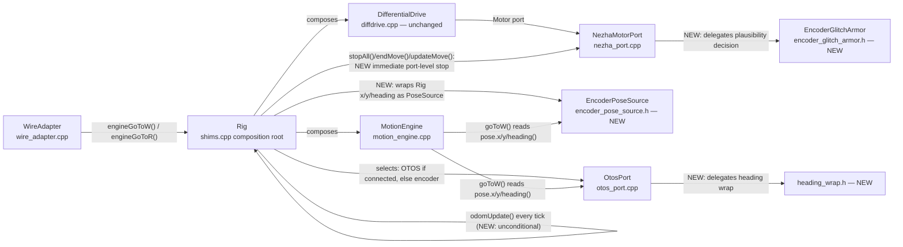

# src — the DiffDrive extension

**Owner:** Eric Busboom · **Last reviewed:** 2026-08-23 · **Status:** in-flux (as-built through sprint 004, closed and merged; sprint 005 roadmapped, not yet detail-planned; sprint 006 detail-planned — motion correctness: goTo geometry, cross-fiber stop delivery, continuous-mode odometry, OTOS heading wrap, encoder-reset rebaseline, encoder `PoseSource` fallback for GO_TO_W — not yet executed)

`src/` is flat — no subdirectories — so this one document carries the
logical subsystem breakdown as sections. Global conventions (units
ladder, CCW sign, mirroring, the ×1000 config convention, protocol
versioning, the tick model) live in
[`docs/design/design.md`](../docs/design/design.md) and are assumed
throughout.

## 1. Layer map and layering rules

From the bottom up, with each layer's *verified* include discipline —
these are enforced by nothing but convention plus the host test
harness (which fails to link if a "host-portable" file grows a CODAL
dependency), so treat them as invariants:

| Layer | Files | May include |
|---|---|---|
| Kernel | `diffdrive.h/.cpp` | `<cstdint>`/`<cmath>`/`<algorithm>` only — **no I2C, no CODAL, no MakeCode, no geometry** |
| Motion engine | `motion_engine.h/.cpp` | `diffdrive.h` + libc only — host-portable |
| Heading wrap (sprint 006) | `heading_wrap.h` | libc only — host-portable, no project includes at all |
| Encoder glitch armor (sprint 006) | `encoder_glitch_armor.h` | libc only — host-portable, no project includes at all |
| Encoder pose source (sprint 006) | `encoder_pose_source.h` | `motion_engine.h` + libc only — host-portable |
| Wire grammar | `wire_handler.h/.cpp` | libc only — host-portable, no project includes at all |
| Wire adapter | `wire_adapter.h/.cpp` | `wire_handler.h` + libc — host-portable; reaches hardware only through forward-declared `shims.cpp` free functions |
| Transports | `serial_transport.*`, `radio_transport.*` | CODAL (`pxt.h` in the .cpp) — know bytes and framing, **nothing** about verbs, grammar, or motion |
| Hardware ports | `nezha_port.*`, `otos_port.*`, `platform_ports.h` | `pxt.h` + the port interfaces they implement — know I2C/CODAL, nothing about blocks or the wire; `nezha_port.cpp` additionally calls into `encoder_glitch_armor.h` and `otos_port.cpp` into `heading_wrap.h`, both above (a dependency on a lower, host-portable layer, not membership in this one) |
| Protocol composition | `protocol.h/.cpp` | everything above — the CODAL fiber that plumbs transports into the wire stack |
| Shim + blocks | `shims.cpp`, `main.ts` | everything — the composition root and the student-facing API |

Cross-cutting convention: `shims.cpp` has **no header**. Its C++
callers (`protocol.cpp`, `wire_adapter.cpp`) reach it via same-package
forward declarations that must stay signature-compatible with the real
definitions; the host harness supplies its own test-double definitions
of the same signatures. This is what keeps `wire_adapter.cpp` and
`shims.cpp` decoupled while sharing one `MotionEngine` singleton.

## 2. Kernel — `diffdrive.h/.cpp` (`DiffDrive::DifferentialDrive`)

**Responsibility.** The closed-loop wheel-speed control law: per-cycle
PID + accel feedforward, per-wheel accel/decel correction curves,
slow adaptive bias, twist-hold trim, lambda authority scaling, speed
floor, crawl-pulse sub-breakaway dithering, stall/deficit latches,
lease-based command expiry, e-stop, and lock-free publication of a
diagnostics `Output` snapshot. Counts-native: 1 count = 0.1° shaft.

**Key data structures.** `Config` (staged/active pair, sequence-count
handoff), `Command` (mode neutral/velocity/raw-duty + lease
`validUntil`), `WheelSample`, `PositionRef`/`TwistRef` (integrated
command references the position-error and twist-hold terms compare
against), `Output` (published via an even/odd `outSeq_` counter so
readers never block the stepper).

**Public interface.** Fluent `setXxx()` config setters / `setConfig`;
`begin()`; `drive(velocity, twist, lease)` / `driveDuty()` /
`neutral()` / `estop()` / `estopClear()` / `emergencyStopMotors()` /
`clearStallLatch()` / `rebasePosition()`; `output()`; `step()` — and
`start()`, which launches the kernel's own paced fiber but is
**deliberately not called anywhere in this package** (see §9, tick
model). Refusals surface as a `Status` return plus a latched
`lastError()`.

**Ports it defines** (the complete surface a platform implements):
`Motor` (staged duty writes, split-phase encoder sampling, immediate
emergency stop), `Clock`, `Sleeper`, `FiberLauncher` (optional — a
host that owns its loop drives `step()` directly).

**Dependencies.** None. This is the bottom of the stack.

**Invariants.**
- *Vendored, synced copy*: extracted from the radio-robot firmware
  (`src/firm/control/`); a fidelity suite in that repo holds the two
  byte-for-byte to the same control law. Fix kernel bugs in both
  repos, never only here.
- Each `step()` runs split-phase encoder sampling:
  `requestSample()` → 4 ms settle sleep → `tick()` per wheel. Anything
  that lands other I2C traffic inside that settle window destroys the
  sample (see §7, bus discipline).
- Commands carry a lease; an expired lease means neutral on every
  subsequent step. `kLeaseMax` = 1 h.

## 3. Motion engine — `motion_engine.h/.cpp` (`diffDrive::MotionEngine`)

**Responsibility.** The two-primitive reduction the whole motion
surface is built on (canonical spec: `radio-robot-lib`
`motion-api.md` §2): everything is a constant-ratio wheel segment.
Owns chassis geometry (`travelCalib`, `trackWidth`, `rotationalSlip`)
and the move engine — end-of-move taper, acceleration ramp,
wrong-way abort, pivot-then-straight splitting, deadline backstop.

**Public interface.**
- Primitives: `wheelsV(left, right, duration)` — velocity hold whose
  `duration` **is** the kernel lease; `wheelsX(left, right, cruise,
  timeout)` — per-wheel distances, ratio-locked so both wheels finish
  together, dead-reckoned lease capped by `timeout`.
- Reductions: `moveX(distance, rotation, cruise, timeout)` (a
  |rotation| ≥ 50° with nonzero distance splits into pivot-then-
  straight, one caller-visible call, one shared deadline);
  `moveV(vx, omega, duration)`; `goToR(x, y, speed, arrive, timeout)`
  (single-shot, no supervisory re-solve). **Sprint 006**: `goToR` now
  owns its own split decision instead of inheriting `moveX`'s generic
  one — `moveX`'s pivot-then-straight split reissues the arc's own
  `(s, theta)` as pivot-then-straight, which reaches a different
  endpoint than the blended arc whenever the split threshold fires
  (the arc-length `s` is not the chord length except in the limit);
  `goToR` above the threshold instead issues pivot = `atan2(y, x)`
  (the line-of-sight bearing) then chord = `hypot(x, y)` straight,
  which reaches `(x, y)` exactly by construction. `theta` is
  normalized to the short arc (±180°) before the split decision, so a
  behind-the-robot target pivots at most ~180° instead of the long way
  around. `arrive` is now honored as a radial no-op gate
  (`hypot(x, y) <= arrive` returns without issuing a segment) — still
  single-shot, no supervisory re-solve; a caller wanting repeat-until-
  arrival re-issues `goToR()` itself, unchanged from before.
  `goToW(pose, …)` (reads a caller-supplied `PoseSource` **once**,
  rotates world delta into the body frame, delegates to `goToR`) is
  unaffected by this change other than inheriting `goToR`'s corrected
  geometry.
- Move servicing: `serviceMove()` — one advance per control cycle
  while active: rescales taper/ramp, re-issues `kernel_.drive()`
  **every tick** with a rolling 500 ms lease (gating on scale change
  would let the lease expire in steady phases), checks completion
  margins (10 counts dist; 4 counts yaw pure-turn, 10 in an arc),
  deadline, stall, and wrong-way (signed yaw progress <
  −3×margin). `endMove()`, `isMoveActive()`, `progress()` (0..1000),
  `wrongWayCount()`, and the per-tour shaping setters
  (`setDistTaper`/`setYawTaper`/`setDistFloor`/`setTurnFloor`/
  `setRampMs`).
- Geometry: `countsPerMm() = 10 / travelCalib`;
  `effectiveTrackWidth() = trackWidth / rotationalSlip`, a method,
  deliberately never cached.
- `PoseSource` — the three-read world-pose port (`x()/y()/heading()`),
  implemented by `OtosPort` on hardware, `EncoderPoseSource` on
  hardware without an OTOS (sprint 006, §7/§9), and `FakePoseSource`
  in tests. `MotionEngine` holds no `PoseSource` of its own; it is
  passed per `goToW()` call, which is what makes the class
  host-testable with no OTOS in the link. **Sprint 006**: the
  interface's `heading()` contract can no longer state a single wrap
  convention now that two hardware implementations disagree by
  construction — `OtosPort` reports heading wrapped to (−π, π] (the
  chip's own int16 register), `EncoderPoseSource` reports the same
  unwrapped heading `shims.cpp`'s odometry already carries. Both are
  contractually valid because `goToR()`/`goToW()` consume `heading()`
  only through `cos()`/`sin()` (wrap-invariant); the header comment now
  says so explicitly instead of asserting one universal convention —
  a caller that ever *differences* two `heading()` reads (rather than
  taking their cos/sin) must not assume a shared wrap convention across
  implementations.

**Key state.** `MoveState` (segment targets in counts, ramp start,
pending second phase, one `deadline` spanning both phases). Geometry
defaults are the vevov bake: `travelCalib` 0.8102 mm/deg, `trackWidth`
114.2 mm, `rotationalSlip` 0.952 — each with the measurement history
in the field comments.

**Dependencies.** Holds references to a caller-owned kernel and
`Clock` (the ramp and timeout need wall time independent of kernel
stepping). Owns **no odometry** — pose stays a `shims.cpp`/Rig
concern; callers update it around `serviceMove()`.

**Invariants.**
- `wheels_*` and every reduction **clears the planner first** — at
  most one move-engine move is ever active (motion-api.md §6).
- Never adjust `trackWidth` to fix a turn; the correction lives in
  `rotationalSlip` (see the system doc's geometry doctrine).
- The CCW sign convention is not re-derived from cable order anywhere
  in this file; host tests pin it.
- Only a **pure turn** tapers on yaw — in an arc the distance taper
  already scales twist by the same factor; an independent yaw taper
  double-counts (measured: legs pinned at the 25% floor, 2026-08-22).

## 4. Wire grammar — `wire_handler.h/.cpp` (`Wire::WireHandler`)

**Responsibility.** Protocol v6's ASCII line-grammar mechanics plus
the reliability layer. `feed()` reassembles arbitrary byte blocks into
lines (240-byte ceiling; overlong lines are discarded whole, never
truncated into a parseable prefix), tokenizes in place on spaces (no
allocation, no `std::string`), enforces case-as-direction (commands
UPPERCASE, replies lowercase), and dispatches an 18-entry verb table:
HELLO, PING, ID, VER, STATUS, HELP, GET, SET, TLM, WHEELS_X, WHEELS_V,
MOVE_X, MOVE_V, GO_TO_R, GO_TO_W, STOP, ESTOP, RUN.

**Reliability layer.** Every sequenced verb carries a mandatory
trailing `#<id>`, strictly incrementing from 1. Handler state is
exactly two fields — `expectedNext_` and `gapOutstanding_` — with **no
clock or timer anywhere** in the class. `dispatch()` resolves the id
first: in-order ids decode **before** any reply (decode failure nacks
the same id and does not advance — "decode failure is a NAK"); stale
retransmits re-ack without re-executing; gaps nack and stall the
stream until the missing id arrives. Merits rejections (verb decoded,
adapter refused) ack-and-advance plus `err <code> #<id>` — kept
sharply distinct from decode failures. `lastDone`/`lastDoneReason` are
polled fresh off the Adapter on every ack/nack, never cached.
HELLO/PING/ESTOP are unsequenced, intercepted before id resolution;
HELLO resets the sequence state (a reconnecting host's resync) but
never touches Adapter state. The reliability layer's periodic
self-healing re-emission is now two calls, split by sprint 004 ticket
003 (before, there was one, `emitTelemetry()`, and it carried no data
frame at all): `emitReliability()` alone re-states the highest
accepted id (or re-nacks a stalled gap) with no Snapshot involved;
`emitTelemetry(const Snapshot&)` additionally emits a fresh
`thdr <col>...` when one is due plus `t <v>...` for the given frame,
then calls `emitReliability()` internally as its own third step — so a
telemetry subscriber never has to poll a second entry point to also
learn whether its last command landed. The **application** still
supplies the cadence (protocol.cpp, 50 ms) and now also decides which
of the two to call, based on whether it has a `Snapshot` to project
(see §8's Fiber loop).

**`Adapter` seam.** The pure-virtual contract behind every verb:
identity/now/status, the six motion verbs (angles arrive as float
milliradians), estop/stop, GET/SET field delegation, TLM mode,
lastDone channel, and RUN's raw-token pass-through. Satisfied by
`WireAdapter` in production and `WireMockAdapter` in tests.

**`Column`/`Snapshot` value types (sprint 004 ticket 004; ticket 007's
correction).** `Column` (one telemetry value: `name`, `value`, `hex`)
and `Snapshot` (a borrowed array of `Column` plus a count) carry
default member initializers, which makes `Column` a non-aggregate
under C++11 — even though `tests/host/` compiles at C++20, where the
same rule does not disqualify it. `Column` therefore keeps an explicit
`Column() = default;` plus a 3-argument converting constructor so the
~20 `columns_[i++] = {"name", value, hex};` call sites in
`WireAdapter::buildSnapshot()` (§5) compile identically on both
standards, without dropping the NSDMIs (needed so a default-constructed
`Column columns_[kMaxSnapshotColumns]` never holds indeterminate
values) or touching any already-correct call site. `Snapshot` shares
the exact same defect under C++11 but is deliberately left unfixed: no
call site anywhere brace-initializes one (every site
default-constructs, then assigns `.columns`/`.count`), so it is a
latent structural twin, not a live one. This constructor pair is not a
style choice — see §11 for why silently removing it breaks the robot
build while every host test stays green.

**Invariants.**
- Decode functions are pure (no adapter call, no sink write); execute
  functions run only after the ack is already on the wire.
- Known, pinned characterization: an embedded NUL truncates the line
  at C-string comparisons (e.g. `PING\0extra` == `PING`); the one
  guarded case is a NUL as the first non-space byte (memory-safety,
  counted malformed).
- Duplicate-id handling has no error code by design — strict
  sequencing makes a duplicate structurally unreachable.

**Dependencies.** `Sink` (one `write()` per reply line, `\n`
included) and `Adapter`. Nothing else — host-portable by construction.

## 5. Wire adapter — `wire_adapter.h/.cpp` (`diffDrive::WireAdapter`)

**Responsibility.** The concrete `Wire::Adapter` for this robot. All
six motion verbs have real effect: WHEELS_V → `setWheelsTimed()`
(duration ceiling 5000 ms, shared by MOVE_V — "a dead host cannot mean
a runaway"); WHEELS_X/MOVE_X/MOVE_V/GO_TO_R/GO_TO_W → the
`engineXxx()` forwards onto the `MotionEngine` singleton. `cruise`/
`speed` handling is uniform: negative → `kRange`; zero → the
configured default via `engineDefaultCruiseMmS()` (full-duty velocity
in mm/s), refused `kRange` if that too is unconfigured. **Sprint 006**:
GO_TO_W no longer answers `kUnimplemented` for "no OTOS connected" —
`engineGoToW()` now falls back to `EncoderPoseSource` on any robot
without a live OTOS (§7/§9), so this handler always dispatches to
`MotionEngine::goToW()`. `mradToRad()`
here is the **single** place wire milliradians become radians.
GET/SET map 15 snake_case wire names 1:1 onto the `ConfigField`
ordinals (`kFields` table); STATUS packs diag booleans into a local
`flags` word and, since sprint 004 ticket 004, an honest `otos=`
(`otosGet(7) != 0`, replacing a hardcoded `false` that predated any
wire-reachable OTOS check — R-22/WIRE-06) plus a decimal `i2cf=` fault
count sourced from the same `diagValue(8)` call the telemetry `i2cf`
column reads (see the Telemetry projection paragraph below), so the
two can never disagree. `onRun()` is an honest `kUnknown` — the real
by-name test trigger is protocol.cpp's MessageBus RUN bridge, a CODAL
mechanism this host-portable class must never touch.

**Motion-obligation tracking.** This class sees every accepted motion
verb, so it records `now + duration/timeout` as a deadline and exposes
`hasLiveMotionObligation()` for protocol.cpp's fiber to poll — that
fiber owns the actual `tickDrive()` call. Armed by **all six** motion
handlers (ticket 012 fixed a real ticket-011 bug where only WHEELS_V
armed it and every other verb's move starved and was watchdog-stopped
almost immediately). The clock arrives as a plain C function pointer
(`NowMsFn`), nullptr on hosts with no clock (obligation then always
false — honest).

**Telemetry projection (sprint 004 ticket 004).** `buildSnapshot()`
returns a `const Wire::Snapshot&` into a member (mirroring
radio-robot-lib's own `DiffDriveAdapter::buildSnapshot()`), built from
five more forward-declared `shims.cpp` reads: `poseX`/`poseY`/
`poseHeading` (each **mutates** odometry as a side effect — load-
bearing, not an accident to optimize away, since nothing else advances
odometry between moves and the 50 ms telemetry tick is what keeps pose
current); `otosGet` (a **cache-only** read — the protocol fiber must
never trigger a fresh OTOS sample, since an I2C transaction interposed
in the Nezha encoder's select→read settle window destroys the encoder
sample; `otosGet(0)`/`otosGet(1)` are 0.1 mm, `otosGet(2)` is already
centidegrees — do not also divide it); and `wheelSpeed`. POSE's 12
columns (`seq now flags x y h ox oy oh vl vr i2cf`) are always
present; FULL adds 8 more (`cyc posl posr dutl dutr lexc wrng cycovr`)
only in `TlmMode::kFull`. `telemetryEnabled()` (`mode_ !=
TlmMode::kOff`) lets protocol.cpp skip building a Snapshot at all for
a session with no subscriber (see §8's Fiber loop). `computeFlags()`
(wire_adapter.cpp, anonymous namespace) is now the single source both
`status()` and `buildSnapshot()` read, so STATUS's `flags=`/`i2cf=`
and the telemetry `flags`/`i2cf` columns can never drift apart.

**Known inert surfaces (deliberate, documented):** `lastDone()`/
`lastDoneReason()` always report `0`/`kNone` — no completion channel
is threaded back through the void bridge functions; a wire host cannot
yet observe motion completion through acks.

**Dependencies.** `wire_handler.h`; `shims.cpp` free functions by
forward declaration only (`stopAll`, `estopAll`, `setWheelsTimed`,
`setKernelValue`, `getConfigValue`, `diagValue`, `engineWheelsX`,
`engineMoveX`, `engineDefaultCruiseMmS`, `engineMoveV`, `engineGoToR`,
`engineGoToW`, and — sprint 004 ticket 004 — `poseX`, `poseY`,
`poseHeading`, `otosGet`, `wheelSpeed`). Holds no kernel/engine/Rig
reference of its own.

## 6. Transports — `serial_transport.*`, `radio_transport.*`

**SerialTransport.** Owns the raw USB-serial byte stream and 0x0A
line delimiting; explicit `(buffer, length)` pairs, never
`ManagedString`. `begin()` grows CODAL's default ~20-byte serial rings
to `kRingBytes` (sprint 004 tickets 006/007). That number is a real
ceiling, not a tuning choice: codal-core's `setRxBufferSize()`/
`setTxBufferSize()` (`inc/driver-models/Serial.h`) take a `uint8_t`
size, capping at 255. `kRingBytes{255}` leaves only ~15 bytes of
headroom above one full 240-byte line — enough for one maximal line
plus a little slack, **not** enough to hold two full lines
concurrently. Ticket 006's original intent (`2 * kMaxLineBytes` = 480)
silently truncated to 224 on assignment — *below* `kMaxLineBytes`
itself, defeating the resize with nothing but an easy-to-miss
`-Woverflow` warning as the signal — which is why the constant changed
under ticket 007 and is now brace-initialized so a future edit that
overflows it again is a compile error, not a repeat of the same silent
truncation. `tryReadLine()` (the one Protocol uses) never sleeps:
drains buffered bytes into a 240-byte partial-line accumulator across
calls. `kMaxLineBytes` = 240 is deliberately kept equal to
`WireHandler::kMaxLineBytes` so this transport is never the tighter
cap (a 201–239-byte line would otherwise be truncated one layer below
the tested discard-whole-line guarantee). `writeLine()`'s two-writer
guard (sprint 004 ticket 006) is a **bounded retry inside the call
itself**: a second caller finding the guard held sleeps `fiber_sleep(2)`
and checks again, up to `kMaxSendAttempts = 5`, before giving up and
counting a drop — deliberately a *different* policy from
`RadioTransport::sendLine()`'s drop-and-retry-once below (the sprint's
architecture review explicitly approved keeping the two distinct:
serial has no caller whose loss is "fine" the way telemetry's
self-healing `seq` gap makes radio's drop acceptable). The drop
counter is exposed at diag ordinal 26 (`probe(26)`/`diagValue(26)`,
`shims.cpp`).

**RadioTransport.** Frames wire lines for the fleet's RADIOBRIDGE
relay: `[SEQ][FLAGS][LEN][payload]` fragments (START/MORE/END flags),
a TX-only port of the fleet's robot-side radio driver. Radio enable is
lazy (group 10, channel 4 — vevov's fleet assignment — power 7). RX is
a single-fragment command plane: `tryReceiveLine()` consumes a flag
set by the MICROBIT_RADIO_EVT_DATAGRAM handler — `datagram.recv()` is
**only** called inside that handler because polling an empty queue
kills the program within two polls (measured; CODAL EmptyPacket
refcounting). Multi-fragment inbound reassembly is deliberately out of
scope. Send-path scratch buffers are members, not stack locals — the
protocol fiber's 2 KB stack overflowed and hard-faulted with them on
the stack (measured). Those buffers are no longer single-fiber-only
(sprint 004 ticket 002): the protocol fiber (via `RadioSink::write()`)
and the TS fiber (via `Protocol::emitLine()`) both call `sendLine()`
now, guarded by a `sending_` bool — the second caller in returns
`false` untouched. `emitLine()` retries once after `fiber_sleep(2)`;
`RadioSink::write()` ignores the drop by design (a lost `t` frame
self-heals via the next `seq` gap). Not host-testable (this file
includes `pxt.h`); verified by code review, first exercised live at
the bench.

**Layering.** Both know bytes and framing only — no verbs, no COBS,
no semantics. Siblings under Protocol, deliberately uncoupled from
each other.

## 7. Hardware ports — `nezha_port.*`, `otos_port.*`, `heading_wrap.h`, `encoder_glitch_armor.h`, `platform_ports.h`

**NezhaMotorPort** (`DiffDrive::Motor` over I2C 0x10). The
write-shaping pipeline is not styling — each stage guards a measured
hardware failure: exact-zero short-circuit (the brick latches its last
commanded speed across MCU resets, so stop is never shaped, throttled,
or slewed); stopNotTaken re-write; reversal dwell through zero (an
instant H-bridge flip latches the 0x46 encoder readback — the
"encoder wedge"); sigma-delta integer-percent quantizer whose carry is
discarded on zero so a stopped wheel cannot creep; min-write throttle
+ slew, both bypassed for stops. Encoder sampling is split-phase
(select 0x46 → 4 ms settle → read), counts never device-reset —
rebaseline is a software offset (`rebaseline()`, offset-only, no bus
traffic).

**`EncoderGlitchArmor` (`encoder_glitch_armor.h`, sprint 006 — new
host-portable module).** The raw-counts plausibility decision that used
to live entirely inside `NezhaMotorPort::collect()` — implausible-jump
rejection, two-strike accept — extracted into a small header with no
`pxt.h`/I2C dependency, alongside `motion_engine.h` in spirit: a pure
function of `(rawCounts, lastGoodRaw, rejectPending)` returning one of
three decisions (`kAccept` — plausible, integrate as motion;
`kAcceptAsRebaseline` — a second consecutive self-consistent reading
after an implausible jump, but now treated as *the counter restarted*,
not *the wheel teleported*; `kRejectPending` — first implausible
reading, hold and wait for a second). This changes KERN-07/R-07's
existing two-strike behavior: previously the second consistent reading
was accepted as a real ~4 m position jump; now that same trigger is
routed to `kAcceptAsRebaseline`, which `NezhaMotorPort::collect()` (the
thin, hardware-only caller) turns into an offset re-anchor
(`encOffset_ = raw`, matching the existing manual `rebaseline()`'s own
software-offset technique) instead of an integrated jump — position
stays continuous, velocity reads as the (small) real motion during the
gap rather than a multi-m/s spike. `NezhaMotorPort` is the only
caller; the class is otherwise unaware of I2C, CODAL, or the kernel.
Host-tested directly (no fakes needed — it has no hardware dependency
to fake); see §11 for this module's C++11 syntax-gate coverage.

**OtosPort** (SparkFun OTOS, I2C 0x17; implements `PoseSource`).
Ported verbatim from the reference firmware: register map, distinct
velocity LSB scales (decoding velocity with the position constants
reads 2× high / 11.1× low — measured), boot-time zeroing of the
chip's offset **and** scalar registers (the chip survives nRF resets
and silently inherits a previous session's values — measured 42.7 mm
pivot circle from a stale arm). The lever arm is applied in
**software** on every read/seed; the chip's own offset register is
held at zero — applying both double-corrects. **Sprint 006**:
`setPose()` now wraps the heading channel into (−π, π] before handing
it to `writePoseMm()`'s quantizer — the chip's heading register is a
wrap-mandatory quantity (full scale ±π) that `writePoseMm()` was
clamping like a length (x/y keep the clamp; only the heading channel
gains a wrap). A seed heading of 350° (a 0–360° convention source, or
the deliberately-unwrapped odometry heading echoed back through
`seedPose()`) now lands at the equivalent −10° instead of clamping to
+179.89°, keeping the OTOS and encoder pose sources agreed at seed
time — the disagreement `seedPose()`'s own drift-measurement contract
depends on not existing yet. **Host-testability note**: `otos_port.h`
includes `pxt.h` unconditionally (§1), so `OtosPort` itself cannot be
compiled into any host test — there is no existing seam that exercises
its I2C-bound methods host-side. The wrap math therefore needs the same
treatment as `EncoderGlitchArmor` below: a tiny host-portable helper
(`heading_wrap.h` — one pure function, no dependencies at all, smaller
in scope than `encoder_glitch_armor.h`) that `setPose()` calls and that
a host test exercises directly, proving the same LSB round-trip
(350° → −10°) the real register write would produce without needing
I2C in the link.

**`EncoderPoseSource` (`encoder_pose_source.h`, sprint 006 — new
host-portable module).** A second `PoseSource` implementation over
`shims.cpp`'s existing dead-reckoned odometry (`Rig::x/y/heading`), for
robots with no OTOS fitted — most of the fleet (the OTOS is on vevov
only). Three-method port, same shape as `OtosPort`: holds const
references to the Rig's already-computed `x`/`y`/`heading` floats and
returns them verbatim — it does not compute odometry itself. It is
constructed as a `Rig` member (or otherwise lifetime-tied to `Rig`'s
own lazy-singleton, process-lifetime instance) so the references it
holds never outlive their target — the same lifetime relationship
`MotionEngine`'s own `kernel_`/`clock_` references already have to
their `Rig`-owned targets; this is not a dangling-reference risk so
long as no `EncoderPoseSource` is ever constructed with a shorter
lifetime than `Rig` itself. It does not need its own epoch-tracking for the "epoch-guarded rebaseline"
motion-api.md §3.6 calls for, because it reads the same Rig-local state
`odomUpdate()` already produces, and `EncoderGlitchArmor` above already
makes that state continuous across a detected brick-reset — the
guarantee is inherited, not re-implemented. Heading is reported
unwrapped, matching `shims.cpp`'s existing odometry contract (§3's
`PoseSource` note on the two implementations' differing wrap
conventions). Host-portable and host-tested the same way
`FakePoseSource` already is.

**Bus discipline (system invariant).** The Nezha brick and the OTOS
share one I2C bus. Every OTOS transaction must run on the same fiber
that ticks the kernel; an OTOS read interposed in the encoder's
select→read settle window destroys the encoder sample.

**platform_ports.h.** One-line CODAL implementations of
`Clock`/`Sleeper`/`FiberLauncher`
(`system_timer_current_time_us`/`fiber_sleep`/`schedule`/
`create_fiber`).

## 8. Protocol composition — `protocol.h/.cpp` (`diffDrive::Protocol`)

**Responsibility.** The CODAL fiber that plumbs bytes between the
transports and the v6 wire stack — it knows nothing of the grammar
itself. Composition by NSDMI in declaration order: `SerialSink`/
`RadioSink` (each strips the trailing `\n` WireHandler supplies,
because its own transport appends its own), a single `WireAdapter`
(constructed with a placeholder identity; `run()` installs the real
one via `setIdentity()` once the fiber is executing — the proven-safe
time to call `microbit_friendly_name()`/`microbit_serial_number()`),
then **two** `Wire::WireHandler` instances — `wireHandler_` (serial)
and `wireHandlerRadio_` (radio, sprint 004 ticket 001) — composed over
that **same** `WireAdapter` instance, not two adapters. Each handler
still keeps its own `expectedNext_`/`gapOutstanding_` (plain instance
members) — the whole point: two independent hosts share one robot's
adapter state without one transport's sequence gap nacking the
other's next command.

**Fiber loop (`run()`).** Sends the boot banner unsolicited
(byte-identical to HELLO's reply), then forever: poll serial
`tryReadLine()` — lines with the literal `RUN:` prefix go to the
legacy MessageBus bridge, everything else is `feed()`'d to
`wireHandler_`; poll radio RX the same way (sprint 004 ticket 001,
closing sprint 003's own Open Question 4) — lines with the literal
`RUN:` prefix go to the same legacy bridge, preserved unchanged as a
fallback, everything else — the full v6 grammar — is `feed()`'d to
`wireHandlerRadio_` instead; every 50 ms, if
`wireAdapter_.telemetryEnabled()`, call `wireAdapter_.buildSnapshot()`
**once** and hand that same `Snapshot` reference to both handlers'
`emitTelemetry(snapshot)` (sprint 004 tickets 003/004) — building it
twice would double-advance `seq_` and mutate odometry twice, and would
report different `seq`/`now` to serial vs radio for what should read
as the same instant; with telemetry off (the boot default, or on any
tick where no host has subscribed), both handlers call
`emitReliability()` alone instead; and while
`wireAdapter_.hasLiveMotionObligation()`, call `tickDrive()` itself
(the fiber is the tick source for wire-issued motion), else
`fiber_sleep(5)`.

**RUN bridge (legacy, deliberately preserved).** `RUN:<name>[:<arg>…]`
parks the payload in a 4-slot ring (MessageBus events queue; a
one-minute test handler must not have its text overwritten by the next
burst) and raises event source 0x2001 with the slot as the value;
`main.ts` reads it back via `runCommandText()` and dispatches by name
on the handler's own fiber. 3 s same-text dedupe absorbs hosts
repeating commands to survive the single-slot radio buffer (measured:
one 3×-repeated RUN ran three consecutive pivots).

**`emitLine()`** writes one caller-supplied line to **both**
transports — test results must come back over radio because USB only
reaches the bench stand, where the wheels are off the ground. Note it
caps at 200 bytes (predates the 240 raise). Since sprint 004 ticket
002, the radio half checks `RadioTransport::sendLine()`'s bool return:
`false` means its re-entrancy guard fired against the protocol fiber's
own concurrent `RadioSink::write()`, and — because this is the one
caller whose loss is user-visible (a test's own recorded result) —
this retries once after `fiber_sleep(2)` before giving up silently,
not in a loop.

**Lifecycle.** Lazy singleton `protocol()`, started by `main.ts`'s
top-level `_startProtocol()` the moment the extension's compiled code
loads — never a global constructor (uBit.init ordering). Identity
constants: drivetrain "diffdrive", profile "tovez", version — a
manually-synced mirror of `pxt.json`'s version.

**Telemetry gap (closed, sprint 004).** The old periodic cleartext
`TLM:` line was retired with v5 and had no v6 replacement through
sprint 003. Sprint 004 built the replacement: ticket 003 added the
`thdr`/`t` frame mechanics (§4's `emitTelemetry()`/`emitReliability()`
split); ticket 004 wired the real projection (§5's
`WireAdapter::buildSnapshot()`) so a `t` frame actually carries live
pose/OTOS/wheel-speed/fault-count data once a host subscribes via
`TLM`. `tools/`'s existing scripts still parse the *old* `TLM:`
prefix, though, and this firmware never emits that prefix again — they
will see nothing until they are retrofit onto the new frame (sprint
005, roadmapped, not yet detail-planned).

## 9. Shim + blocks — `shims.cpp`, `main.ts`

**shims.cpp** is the composition root and the MakeCode-facing C++
surface. The lazy-singleton `Rig` composes: two `NezhaMotorPort`s
(left M1 `-1`, right M2 `+1` — vevov wiring), the CODAL ports, the
kernel (tovez-bake defaults + `twistHoldGain` 2.0, cadence 24 ms),
and the `MotionEngine` (declared **after** the kernel — member init
follows declaration order). `ensure()` calls `kernel.begin()` but
**not** `kernel.start()` — the pure tick model — and launches the one
background fiber this file owns, the starvation watchdog.

Pieces the kernel deliberately does not contain:

- **Odometry** (`odomUpdate`): differential dead-reckoning from
  kernel `Output` positions using the engine's geometry
  (`countsPerMm`, `effectiveTrackWidth`), midpoint-heading
  integration into Rig-local `x/y/heading`. **Sprint 006**: `tickDrive()`
  now folds `odomUpdate()` into **every** tick unconditionally, not
  only while a move-engine move is (was) active — continuous-mode
  driving (`setWheels`/`driveTwist` under a `while (tickDrive())` loop)
  previously updated pose only on the next explicit pose read, which
  integrated the whole driven interval as one straight chord regardless
  of actual curvature (UC-009's "pose is always live-updated from
  odometry regardless of command mode" was aspirational, not true,
  before this fix). `updateMove()`'s own odometry gate (only while a
  move is active) is unchanged — that path is move-engine polling, not
  continuous-mode driving, and stays correct as-is.
- **Tick engine** (`tickDrive()`): one `kernel.step()` +
  `serviceMove()` on the caller's fiber, then absolute-deadline
  self-pacing to the kernel's configured 24 ms cadence (re-anchored
  after gaps). A cooperative-fiber `stepBusy` flag serializes
  concurrent tickers. On the tick that ends a move it runs up to 12
  extra settle steps until the wheels measure at rest, folding coast
  counts into odometry before the final read — without this the
  neutral never reached the motors before the `while (tickDrive())`
  caller exited (measured: +9–13° per turn). This settle loop is
  **not host-testable** (bolted to Rig-local odometry) — a known,
  accepted gap; only hardware exercises it. **Sprint 006 leaves this
  loop's shape untouched deliberately** — the follow-up issue
  `settle-tick-loop-is-not-host-testable` (sprint 008) plans to extract
  its logic into a host-portable helper, and this sprint's own stop-
  delivery fix (below) is placed elsewhere specifically so it does not
  collide with that future extraction.
- **Stop delivery** (sprint 006, new): `stopAll()`/`endMove()`
  (`stop`/`stop move`) and `updateMove()`'s own move-completion branch
  (the `isMoving()`/`move progress` poller's path, which can end a move
  at its deadline without ever calling `tickDrive()`) now each also
  call a small shared helper that pushes an immediate, port-level
  zero write to both motors — the exact same primitive the starvation
  watchdog already uses (`Motor::emergencyStop()`, tick-independent,
  never touches the kernel's e-stop latch) — in addition to staging
  `kernel.neutral()` as before. This closes R-08/BLK-01: previously a
  stop/move-completion issued from a fiber other than the one currently
  inside `kernel.step()`'s ~8 ms settle window staged a neutral that
  was not delivered to the motors until that settle window's step()
  returned *and* another tick ran — which, if the tick loop had already
  exited (exactly the case when the completing/stopping call is what
  ended it), meant no further step() ran at all until the ~100–150 ms
  starvation watchdog fired. The fix adds no new fiber/ticker (the
  "one ticker per move" invariant, `settle-tick-loop-is-not-host-
  testable`, is unaffected) and does not touch the vendored kernel
  (`diffdrive.{h,cpp}` stay byte-unchanged, so no cross-repo resync is
  needed) — it is entirely a `shims.cpp`-level composition reusing an
  existing, already-proven primitive.
- **Starvation watchdog**: every ~50 ms, if something looks active
  (`isMoveActive()` or nonzero applied duty) and no tick has run for
  ~100 ms, it calls `kernel.neutral()`, `engine.endMove()`, and
  port-level `emergencyStop()` on both motors — a *resumable soft
  stop* that never touches the e-stop latch, so a fresh tick resumes
  motion with no clear step. Unchanged this sprint; the stop-delivery
  fix above reuses this same port-level primitive rather than adding a
  new mechanism.
- **Wire bridges**: `setWheelsTimed`/`driveTwistTimed` (duration =
  lease), the six `engineXxx()` forwards, `engineDefaultCruiseMmS()`,
  `diagValue()` (the DIAG/STATUS ordinal table),
  `getConfigValue`/`setKernelValue` (the ×1000 table), `probe()`,
  taper/ramp setters, `wheelSpeed()`.
- **OTOS surface**: a lazy singleton **separate from Rig** (usable
  without starting the drive), `otosBegin/otosRead/otosGet/otosZero/
  otosCalibrate/otosSetOffset`, `seedPose()` (writes **both** pose
  sources so their later divergence is the drift being measured — now
  correctly agreed at seed time for any heading, per §7's OTOS heading-
  wrap fix). **Sprint 006**: `engineGoToW()` no longer refuses when the
  OTOS is not connected — it now selects `OtosPort` when connected,
  `EncoderPoseSource` otherwise (§7), in this one place, and always
  dispatches to `MotionEngine::goToW()`. This closes
  `no-encoder-odometry-posesource-fallback`: GO_TO_W (and the block
  API's world-pose moves that route through it) is no longer a no-op
  on the fleet's OTOS-less robots (tovez, gopiv, zeguz) — it drives on
  dead-reckoned odometry instead, a materially weaker (drifting)
  promise than the OTOS gives, which the ticket's own documentation
  update states plainly rather than leaving the two verbs looking
  identical.

**main.ts** owns the student units and the block API (groups Drive,
Move, Pose, World, Setup), the browser-simulator fallback bodies (a
kinematic stand-in that mirrors the tick engine's 24 ms pacing), and
the RUN dispatcher. Notable TS-side design points, all measured the
hard way:

- Continuous-mode commands (`setWheelSpeeds`/`driveTwist`) only move
  the robot while a `while (diffDrive.driveTick())` loop ticks;
  blocking moves tick internally. `startMove`/`startGoTo` + polling
  does **not** advance a move by itself — a documented tick-model gap.
- `goToWorld()` is this project's own TS-level closed-loop heuristic
  (one pass, pivot-first beyond 12°, curvature capped at 25°,
  residual error inherited by the next hop) — deliberately a separate
  call path from the wire's GO_TO_W/`MotionEngine::goToR` plain
  reduction. The OTOS is read here, between moves only.
- The `run*` state arrays are declared **with no initialisers** —
  namespace initialisers run after a test file's top-level code, so an
  initialiser both crashes early registration (silent boot death,
  panic 980) and would wipe handlers already registered.
- PXT traps pinned in comments: never write the word "radio" followed
  by a dot in prose (dependency scanner), `//%` must sit immediately
  above the signature, shims max out at two int args (TS9200 compiler
  assert).

## 10. Open questions / known limitations

- `tools/`'s bench scripts still parse the old cleartext `TLM:`
  prefix (see §8's Telemetry gap paragraph); the v6 `thdr`/`t` frames
  sprint 004 built are real but nothing in `tools/` consumes them yet
  — that retrofit is sprint 005 (roadmapped, not yet detail-planned).
- `WireAdapter::lastDone()`/`lastDoneReason()` permanently inert —
  hosts cannot observe motion completion via the reliability channel.
- Radio RX is a single 64-byte fragment slot with no multi-fragment
  reassembly (unchanged this sprint — sprint 004 closed the *grammar*
  question, not the *capacity* one). An inbound line longer than one
  fragment is clamped to a parseable prefix rather than reassembled or
  rejected, which can execute as a different, shorter, legal command,
  not merely drop one — and radio's own TX cap (`kMaxPayloadBytes` =
  200) is already provably exceedable by a legal, if pathological,
  telemetry frame (up to 239 bytes measured). Filed as
  `clasi/issues/radio-rx-capacity-fragmentation.md`, claimed by sprint
  010.
- The post-move settle loop is hardware-only-tested (unchanged this
  sprint; see §9's stop-delivery note on why the fix landed elsewhere).
- `protocol.cpp`'s `kVersion` is a manual mirror of `pxt.json` and
  can drift.
- **(Resolved, sprint 006)** ~~The encoder-odometry `PoseSource`
  fallback for OTOS-less robots is explicitly not built; GO_TO_W
  refuses on such robots.~~ `EncoderPoseSource` (§7) now serves that
  role; GO_TO_W dispatches on every robot regardless of OTOS presence
  (§9). Remaining caveat: the fallback carries no drift/uncertainty
  signal back to the caller — a GO_TO_W served by encoders is silently
  a weaker promise than one served by the OTOS, distinguishable today
  only by reading STATUS's `otos=` flag before calling, not by
  anything GO_TO_W itself returns.
- `EncoderGlitchArmor`'s rebaseline-on-discontinuity path (§7) is
  built and host-tested against the *code path* KERN-07 identified,
  but the *hardware premise* — whether a Nezha brick MCU reset actually
  restarts the 0x46 counter near zero — remains unconfirmed absent a
  bench run; see `brick-reset-odometry-teleport.md` and sprint 006's
  bench-checklist ticket.

## 11. Host-vs-target language standard (a standing build-gate constraint)

`tests/host/` compiles this package's portable C++ at `-std=c++20`
(`tests/host/test_kernel_harness.py`); both real embedded targets — the
legacy mbed-classic/yotta build and the codal-microbit-v2 build — compile
at `-std=c++11`, baked into the pxt-microbit target's own yotta/CMake
toolchain files and not overridable from this project's `pxt.json`. A
green host suite is therefore **not evidence of target viability**: any
C++14/17/20-only construct in `src/` compiles and passes on the host
side while silently failing to compile for the robot at all, with no
signal from the test suite. The confirmed instance is §4's
`Column`/`Snapshot` paragraph — a struct with default member
initializers is not a C++11 aggregate, and ~20 brace-initialization
call sites in `WireAdapter::buildSnapshot()` (§5) compiled and passed
253 host tests while failing every real target build
(`clasi/issues/host-tests-compile-newer-standard-than-target.md`,
sprint 008 — filed after sprint 004 ticket 005 could not produce a
flashable hex against that fully green suite).

Sprint 004 ticket 007 narrowed the gap for `src/` specifically: a
`-std=c++11 -fsyntax-only` compile gate
(`tests/host/test_cxx11_syntax_gate.py`) now runs, as part of the host
suite, over the four translation units that do not include `pxt.h` and
are therefore syntax-checkable this way — `diffdrive.cpp`,
`motion_engine.cpp`, `wire_handler.cpp`, `wire_adapter.cpp`. This
closes the specific defect class ticket 007 fixed for those four files
going forward, but it is a syntax-only check on a subset of files, not
a substitute for actually building the hex: the CODAL-facing files
(`protocol.*`, `*_transport.*`, the hardware ports, `shims.cpp`) still
need `pxt.h` and are not covered by this gate at all, and a *linkable*
target build — not merely syntax-valid C++11 — is only ever proven by
the sprint checkpoint that actually builds a flashable hex.

**Sprint 006** adds three new host-portable headers with no `pxt.h`
dependency of their own — `heading_wrap.h`, `encoder_glitch_armor.h`,
and `encoder_pose_source.h` (§7) — to this same gate, via a small
dedicated syntax-check translation unit each (none has a natural
`.cpp` of its own the way `motion_engine.h` rides along with
`motion_engine.cpp`). This is the gate's coverage growing by the three
files this sprint adds that are eligible for it; it does **not**
narrow the gap for the files this sprint actually changes that remain
ineligible — `shims.cpp` (stop delivery, continuous-mode odometry
fold, `EncoderPoseSource`/`OtosPort` selection wiring) and
`nezha_port.cpp`/`otos_port.cpp` (the hardware-port callers of the
three new headers) all still include `pxt.h` and stay outside this
gate, exactly as `src/DESIGN.md`'s pre-sprint-006 text already said.
`otos_port.cpp` is a sharper instance of this than the rest: with
`heading_wrap.h`'s wrap math extracted and gate-covered, the entirety
of `otos_port.cpp`'s OWN code (the I2C calls, the LSB quantization
call site) is still completely untested outside a real chip — there is
no host seam for `OtosPort` at all, extracted helper or not. A green
host suite for this sprint's `shims.cpp`/port changes is, as always,
not evidence they compile for the robot — only the sprint's own
flashable-hex checkpoint proves that.

## 12. Sprint 006 — architecture diagram and change summary

Substantial-tier sprint update (see `sprint.md`'s Architecture section
for the sizing decision and rationale). Six issues from the 2026-08-23
code review's motion-correctness cluster, five CONFIRMED defects plus
one capability gap sharing the same `PoseSource`/heading-wrap seam.
Three new host-portable modules are introduced (`heading_wrap.h`,
`EncoderGlitchArmor`, `EncoderPoseSource`); the kernel
(`diffdrive.{h,cpp}`) stays byte-unchanged throughout, so no cross-repo
(radio-robot firmware) resync is triggered by this sprint.

**Sprint Changes (recap — module level; see §3/§7/§9 above for detail):**

- `motion_engine.cpp` — `goToR()` owns its own pivot-split decision
  (bearing-pivot + chord, not inherited from `moveX`'s generic split);
  theta normalized to the short arc; `arrive` honored as a radial
  no-op gate.
- `shims.cpp` — `tickDrive()` folds `odomUpdate()` unconditionally
  into every tick (continuous-mode odometry fix); `stopAll()`/
  `endMove()`/`updateMove()`'s completion branch each add an immediate
  port-level stop (cross-fiber settle-window fix); `engineGoToW()`
  selects `OtosPort` or `EncoderPoseSource` in one place instead of
  refusing without an OTOS.
- `otos_port.cpp` — `setPose()` wraps the heading channel via
  `heading_wrap.h` before quantizing (seed-heading clamp fix).
- `nezha_port.cpp` — `collect()`'s two-strike acceptance now routes
  through `EncoderGlitchArmor` and rebaselines on a detected
  discontinuity instead of integrating it as motion.
- `heading_wrap.h` (new) — extracted, host-portable heading-wrap pure
  function (the only host-testable surface for `otos_port.cpp`'s fix —
  `OtosPort` itself includes `pxt.h` and cannot be host-compiled at
  all).
- `encoder_glitch_armor.h` (new) — extracted, host-portable
  plausibility/rebaseline decision.
- `encoder_pose_source.h` (new) — `PoseSource` over existing Rig
  odometry, for OTOS-less robots.
- `motion_engine.h` — `PoseSource::heading()` contract comment
  clarified (wrap convention is implementation-defined; consume only
  via cos/sin).

No entity-relationship diagram: no persistent data model exists in
this embedded package, and none of the six issues introduces one. No
separate dependency-direction graph beyond the diagram above: dependency
direction is unchanged (Presentation/wire → MotionEngine → Kernel/ports,
Kernel at the bottom); the three new modules sit at the bottom of the
stack (host-portable, zero outward dependencies) with exactly one
caller each (`NezhaMotorPort` for `EncoderGlitchArmor`, `OtosPort` for
`heading_wrap.h`, `Rig` for `EncoderPoseSource`) — no cycle is
introduced.

**Migration concerns.** None requiring data migration or a deployment
sequencing change. Two behavior changes are visible to an existing
caller and worth flagging explicitly rather than treating as purely
internal: (1) GO_TO_W becomes more permissive — a caller that
previously received `kUnimplemented` on an OTOS-less robot now receives
`kOk` and an encoder-driven move; this is a strict widening (nothing
that worked before stops working), but any caller-side logic that
specifically branched on `kUnimplemented` to mean "this robot has no
world-pose capability at all" will observe different behavior. (2)
`stop`/`stop move` now deliver a hardware-level zero write immediately
in addition to the pre-existing staged neutral, which changes worst-case
stop latency (better) but not documented behavior (UC-011's postcondition
already promised "further Drive/Move commands work normally" — this
sprint makes that true sooner, not differently).

**Risk (known, pre-existing, not newly introduced by this sprint):**
the new immediate port-level write in `stopAll()`/`endMove()`/
`updateMove()` shares the same I2C bus as the Nezha brick's encoder
settle window (§7's bus discipline note) — if it lands on a *different*
fiber than the one currently inside `kernel.step()`'s ~4 ms-per-wheel
settle sleep, it is exactly the kind of "other I2C traffic during the
settle window" `diffdrive.h`'s own kernel invariant warns can corrupt a
sample. This exposure already exists today in the starvation
watchdog's own port-level writes (same primitive, same bus, no
fiber coordination); this sprint's fix increases how *often* the
collision window can be hit (any cross-fiber stop, not only a fully
abandoned tick loop), not its consequence. Consequence, if it happens:
`refreshSample()`'s existing fault path already treats a corrupted
collect as a failed sample — position/velocity hold at their last good
value and `i2cFaultCount_` increments — precisely because the robot is
stopping in that same tick, a stale encoder reading for one cycle is
low-consequence. No design change is proposed to close this fully (that
would mean serializing all port writes through the tick fiber, a larger
change than this sprint's scope); ticket 002 should add a host test
confirming a corrupted collect during this window is counted, not
silently accepted as a valid sample.
