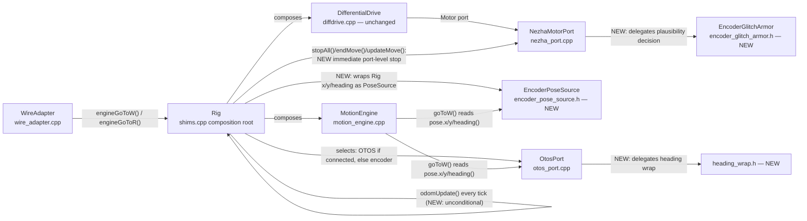
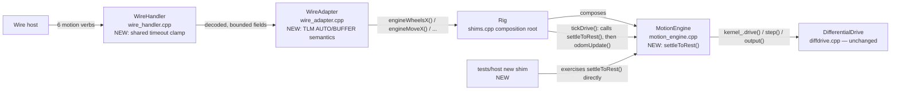
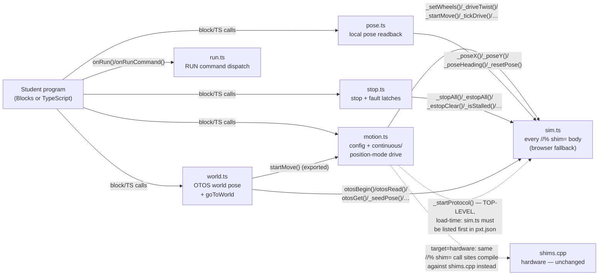

# src — the DiffDrive extension

**Owner:** Eric Busboom · **Last reviewed:** 2026-08-25 · **Status:** in-flux (as-built through sprint 008, closed and merged — wire hardening and tests that can fail: timeout reject/clamp unified across all six motion verbs, `kVersion`/line-cap/`RUN_EVENT_SOURCE`/`kDiag*` single-sourced or drift-tested, the `WaHandle` test doubles re-synced to production, the post-move settle loop extracted into a host-testable `MotionEngine` helper, `TLM AUTO`/`BUFFER` given defined semantics, and a triage-aware `make_deploy.py` plus a standing per-sprint build-checkpoint-ticket convention closing the target-viability gap; sprint 005 roadmapped, not yet detail-planned, blocked on a hardware bench checkpoint; sprint 009 (comment cleanup, upstream re-diff) done; sprint 012 **executed and closing** — split the single `main.ts` into six cohesion-sized modules, `sim.ts`/`run.ts`/`pose.ts`/`stop.ts`/`world.ts`/`motion.ts` (`main.ts` retired, ticket 006), replacing `main.ts`'s one entry in `pxt.json`'s and `tsconfig.json`'s `files` arrays; block-surface content (captions/`group=`/param ranges) verified identical to the pre-split baseline, see §15)

`src/` is flat — no subdirectories — so this one document carries the
logical subsystem breakdown as sections. Global conventions (units
ladder, CCW sign, mirroring, the ×1000 config convention, protocol
versioning, the tick model) live in
[`docs/design/design.md`](../docs/design/design.md) and are assumed
throughout.

## 1. Layer map and layering rules

From the bottom up, with each layer's *verified* include discipline —
these are enforced by nothing but convention plus the host test
harness (which fails to link if a "host-portable" file grows a CODAL
dependency), so treat them as invariants:

| Layer | Files | May include |
|---|---|---|
| Kernel | `diffdrive.h/.cpp` | `<cstdint>`/`<cmath>`/`<algorithm>` only — **no I2C, no CODAL, no MakeCode, no geometry** |
| Motion engine | `motion_engine.h/.cpp` | `diffdrive.h` + libc only — host-portable |
| Heading wrap (sprint 006) | `heading_wrap.h` | libc only — host-portable, no project includes at all |
| Encoder glitch armor (sprint 006) | `encoder_glitch_armor.h` | libc only — host-portable, no project includes at all |
| Encoder pose source (sprint 006) | `encoder_pose_source.h` | `motion_engine.h` + libc only — host-portable |
| Wire grammar | `wire_handler.h/.cpp` | libc only — host-portable, no project includes at all |
| Wire adapter | `wire_adapter.h/.cpp` | `wire_handler.h` + libc — host-portable; reaches hardware only through forward-declared `shims.cpp` free functions |
| Transports | `serial_transport.*`, `radio_transport.*` | CODAL (`pxt.h` in the .cpp) — know bytes and framing, **nothing** about verbs, grammar, or motion |
| Hardware ports | `nezha_port.*`, `otos_port.*`, `platform_ports.h` | `pxt.h` + the port interfaces they implement — know I2C/CODAL, nothing about blocks or the wire; `nezha_port.cpp` additionally calls into `encoder_glitch_armor.h` and `otos_port.cpp` into `heading_wrap.h`, both above (a dependency on a lower, host-portable layer, not membership in this one) |
| Protocol composition | `protocol.h/.cpp` | everything above — the CODAL fiber that plumbs transports into the wire stack |
| Shim + blocks | `shims.cpp`, `sim.ts`, `run.ts`, `pose.ts`, `stop.ts`, `world.ts`, `motion.ts` (sprint 012: split from a single `main.ts` — see §9/§15) | everything — the composition root and the student-facing API |

Cross-cutting convention: `shims.cpp` has **no header**. Its C++
callers (`protocol.cpp`, `wire_adapter.cpp`) reach it via same-package
forward declarations that must stay signature-compatible with the real
definitions; the host harness supplies its own test-double definitions
of the same signatures. This is what keeps `wire_adapter.cpp` and
`shims.cpp` decoupled while sharing one `MotionEngine` singleton.

## 2. Kernel — `diffdrive.h/.cpp` (`DiffDrive::DifferentialDrive`)

**Responsibility.** The closed-loop wheel-speed control law: per-cycle
PID + accel feedforward, per-wheel accel/decel correction curves,
slow adaptive bias, twist-hold trim, lambda authority scaling, speed
floor, crawl-pulse sub-breakaway dithering, stall/deficit latches,
lease-based command expiry, e-stop, and lock-free publication of a
diagnostics `Output` snapshot. Counts-native: 1 count = 0.1° shaft.

**Key data structures.** `Config` (staged/active pair, sequence-count
handoff), `Command` (mode neutral/velocity/raw-duty + lease
`validUntil`), `WheelSample`, `PositionRef`/`TwistRef` (integrated
command references the position-error and twist-hold terms compare
against), `Output` (published via an even/odd `outSeq_` counter so
readers never block the stepper).

**Public interface.** Fluent `setXxx()` config setters / `setConfig`;
`begin()`; `drive(velocity, twist, lease)` / `driveDuty()` /
`neutral()` / `estop()` / `estopClear()` / `emergencyStopMotors()` /
`clearStallLatch()` / `rebasePosition()`; `output()`; `step()` — and
`start()`, which launches the kernel's own paced fiber but is
**deliberately not called anywhere in this package** (see §9, tick
model). Refusals surface as a `Status` return plus a latched
`lastError()`.

**Ports it defines** (the complete surface a platform implements):
`Motor` (staged duty writes, split-phase encoder sampling, immediate
emergency stop), `Clock`, `Sleeper`, `FiberLauncher` (optional — a
host that owns its loop drives `step()` directly).

**Dependencies.** None. This is the bottom of the stack.

**Invariants.**
- *Vendored, synced copy*: extracted from the radio-robot firmware
  (`src/firm/control/`); a fidelity suite in that repo holds the two
  byte-for-byte to the same control law. Fix kernel bugs in both
  repos, never only here.
- Each `step()` runs split-phase encoder sampling:
  `requestSample()` → 4 ms settle sleep → `tick()` per wheel. Anything
  that lands other I2C traffic inside that settle window destroys the
  sample (see §7, bus discipline).
- Commands carry a lease; an expired lease means neutral on every
  subsequent step. `kLeaseMax` = 1 h.

## 3. Motion engine — `motion_engine.h/.cpp` (`diffDrive::MotionEngine`)

**Responsibility.** The two-primitive reduction the whole motion
surface is built on (canonical spec: `radio-robot-lib`
`motion-api.md` §2): everything is a constant-ratio wheel segment.
Owns chassis geometry (`travelCalib`, `trackWidth`, `rotationalSlip`)
and the move engine — end-of-move taper, acceleration ramp,
wrong-way abort, pivot-then-straight splitting, deadline backstop.

**Public interface.**
- Primitives: `wheelsV(left, right, duration)` — velocity hold whose
  `duration` **is** the kernel lease; `wheelsX(left, right, cruise,
  timeout)` — per-wheel distances, ratio-locked so both wheels finish
  together, dead-reckoned lease capped by `timeout`.
- Reductions: `moveX(distance, rotation, cruise, timeout)` (a
  |rotation| ≥ 50° with nonzero distance splits into pivot-then-
  straight, one caller-visible call, one shared deadline);
  `moveV(vx, omega, duration)`; `goToR(x, y, speed, arrive, timeout)`
  (single-shot, no supervisory re-solve). **Sprint 006**: `goToR` now
  owns its own split decision instead of inheriting `moveX`'s generic
  one — `moveX`'s pivot-then-straight split reissues the arc's own
  `(s, theta)` as pivot-then-straight, which reaches a different
  endpoint than the blended arc whenever the split threshold fires
  (the arc-length `s` is not the chord length except in the limit);
  `goToR` above the threshold instead issues pivot = `atan2(y, x)`
  (the line-of-sight bearing) then chord = `hypot(x, y)` straight,
  which reaches `(x, y)` exactly by construction. `theta` is
  normalized to the short arc (±180°) before the split decision, so a
  behind-the-robot target pivots at most ~180° instead of the long way
  around. `arrive` is now honored as a radial no-op gate
  (`hypot(x, y) <= arrive` returns without issuing a segment) — still
  single-shot, no supervisory re-solve; a caller wanting repeat-until-
  arrival re-issues `goToR()` itself, unchanged from before.
  `goToW(pose, …)` (reads a caller-supplied `PoseSource` **once**,
  rotates world delta into the body frame, delegates to `goToR`) is
  unaffected by this change other than inheriting `goToR`'s corrected
  geometry.
- Move servicing: `serviceMove()` — one advance per control cycle
  while active: rescales taper/ramp, re-issues `kernel_.drive()`
  **every tick** with a rolling 500 ms lease (gating on scale change
  would let the lease expire in steady phases), checks completion
  margins (10 counts dist; 4 counts yaw pure-turn, 10 in an arc),
  deadline, stall, and wrong-way (signed yaw progress <
  −3×margin). `endMove()`, `isMoveActive()`, `progress()` (0..1000),
  `wrongWayCount()`, and the per-tour shaping setters
  (`setDistTaper`/`setYawTaper`/`setDistFloor`/`setTurnFloor`/
  `setRampMs`).
- Geometry: `countsPerMm() = 10 / travelCalib`;
  `effectiveTrackWidth() = trackWidth / rotationalSlip`, a method,
  deliberately never cached. **Sprint 007**: `rotationalSlip` gains
  `setRotationalSlip(float)`, validated `>0` exactly like
  `setTrackWidth()`/`setTravelCalib()` (invalid values silently
  ignored, prior value retained) — closing the one geometry field that
  had a getter but no setter (API-06: the doctrine already named
  `rotationalSlip` as the only correct turn-calibration knob, but no
  caller anywhere could reach it). Reachable from `shims.cpp` through
  the existing generic `ConfigField`/`kFields` mechanism (§5, §9), not
  a new dedicated `setGeometry()`-style shim — this field is a
  one-time chassis-calibration constant for a non-reference kit, not a
  value tuned as routinely as `trackWidth`/`travelCalib`.
- `PoseSource` — the three-read world-pose port (`x()/y()/heading()`),
  implemented by `OtosPort` on hardware, `EncoderPoseSource` on
  hardware without an OTOS (sprint 006, §7/§9), and `FakePoseSource`
  in tests. `MotionEngine` holds no `PoseSource` of its own; it is
  passed per `goToW()` call, which is what makes the class
  host-testable with no OTOS in the link. **Sprint 006**: the
  interface's `heading()` contract can no longer state a single wrap
  convention now that two hardware implementations disagree by
  construction — `OtosPort` reports heading wrapped to (−π, π] (the
  chip's own int16 register), `EncoderPoseSource` reports the same
  unwrapped heading `shims.cpp`'s odometry already carries. Both are
  contractually valid because `goToR()`/`goToW()` consume `heading()`
  only through `cos()`/`sin()` (wrap-invariant); the header comment now
  says so explicitly instead of asserting one universal convention —
  a caller that ever *differences* two `heading()` reads (rather than
  taking their cos/sin) must not assume a shared wrap convention across
  implementations.

**Key state.** `MoveState` (segment targets in counts, ramp start,
pending second phase, one `deadline` spanning both phases). Geometry
defaults are the vevov bake: `travelCalib` 0.8102 mm/deg, `trackWidth`
114.2 mm, `rotationalSlip` 0.952 — each with the measurement history
in the field comments.

**Dependencies.** Holds references to a caller-owned kernel and
`Clock` (the ramp and timeout need wall time independent of kernel
stepping). Owns **no odometry** — pose stays a `shims.cpp`/Rig
concern; callers update it around `serviceMove()`.

**Invariants.**
- `wheels_*` and every reduction **clears the planner first** — at
  most one move-engine move is ever active (motion-api.md §6).
- Never adjust `trackWidth` to fix a turn; the correction lives in
  `rotationalSlip` (see the system doc's geometry doctrine).
- The CCW sign convention is not re-derived from cable order anywhere
  in this file; host tests pin it.
- Only a **pure turn** tapers on yaw — in an arc the distance taper
  already scales twist by the same factor; an independent yaw taper
  double-counts (measured: legs pinned at the 25% floor, 2026-08-22).

## 4. Wire grammar — `wire_handler.h/.cpp` (`Wire::WireHandler`)

**Responsibility.** Protocol v6's ASCII line-grammar mechanics plus
the reliability layer. `feed()` reassembles arbitrary byte blocks into
lines (240-byte ceiling; overlong lines are discarded whole, never
truncated into a parseable prefix), tokenizes in place on spaces (no
allocation, no `std::string`), enforces case-as-direction (commands
UPPERCASE, replies lowercase), and dispatches an 18-entry verb table:
HELLO, PING, ID, VER, STATUS, HELP, GET, SET, TLM, WHEELS_X, WHEELS_V,
MOVE_X, MOVE_V, GO_TO_R, GO_TO_W, STOP, ESTOP, RUN. **Sprint 007**:
`kCommandTable`'s size is now derived (`static const VerbEntry
kCommandTable[];`, defined with a deduced size plus a `static_assert`
pinning the expected count) instead of the size being hand-written
twice (declaration and definition both said `[18]`) — closing WIRE-09:
removing a verb without updating both `[18]`s used to compile silently
and zero-fill the vacated slot, which `strcmp()`s a `nullptr` on the
first lookup that reaches it (a hard fault on the robot, for every
command). No verb is added, removed, or reordered by this change — the
18 names above are unchanged; only how the array's size is spelled
changes. **Sprint 008**: the six motion verbs' `timeout`/`duration`
fields (`WHEELS_X`/`WHEELS_V`/`MOVE_X`/`MOVE_V`/`GO_TO_R`/`GO_TO_W`) now
pass through one shared decode-time clamp before any verb-specific
decode logic runs: `0` is rejected (`kRange`), and any value above
2^31−1 is silently clamped to 2^31−1. This closes WIRE-02/KERN-06
(R-06 — `WHEELS_X`/`MOVE_X` disagreeing about what `0` means, and a
`WHEELS_X … timeout 0` leaving a stale kernel lease armed with no
motion obligation tracking it) and WIRE-10/KERN-10-adjacent (R-18 — a
timeout above 2^31 wrapping the deadline arithmetic negative and
re-triggering the ticket-011 starvation-kill pattern for an input class
no prior test reached). Enforcing this once, at decode, in
`wire_handler.cpp`, rather than six times in each `wire_adapter.cpp`
handler, is deliberate: every downstream consumer (`WireAdapter`'s own
obligation-window math, `MotionEngine::wheelsX()`'s lease-clamp
arithmetic, the kernel's `drive()` lease) now only ever sees an
in-range value, so none of them individually needs to reason about `0`
or overflow — see this sprint's Design Rationale (§14) for why reject
(not clamp) was chosen for the `0` case specifically.

**Reliability layer.** Every sequenced verb carries a mandatory
trailing `#<id>`, strictly incrementing from 1. Handler state is
exactly two fields — `expectedNext_` and `gapOutstanding_` — with **no
clock or timer anywhere** in the class. `dispatch()` resolves the id
first: in-order ids decode **before** any reply (decode failure nacks
the same id and does not advance — "decode failure is a NAK"); stale
retransmits re-ack without re-executing; gaps nack and stall the
stream until the missing id arrives. Merits rejections (verb decoded,
adapter refused) ack-and-advance plus `err <code> #<id>` — kept
sharply distinct from decode failures. `lastDone`/`lastDoneReason` are
polled fresh off the Adapter on every ack/nack, never cached.
HELLO/PING/ESTOP are unsequenced, intercepted before id resolution;
HELLO resets the sequence state (a reconnecting host's resync) but
never touches Adapter state. The reliability layer's periodic
self-healing re-emission is now two calls, split by sprint 004 ticket
003 (before, there was one, `emitTelemetry()`, and it carried no data
frame at all): `emitReliability()` alone re-states the highest
accepted id (or re-nacks a stalled gap) with no Snapshot involved;
`emitTelemetry(const Snapshot&)` additionally emits a fresh
`thdr <col>...` when one is due plus `t <v>...` for the given frame,
then calls `emitReliability()` internally as its own third step — so a
telemetry subscriber never has to poll a second entry point to also
learn whether its last command landed. The **application** still
supplies the cadence (protocol.cpp, 50 ms) and now also decides which
of the two to call, based on whether it has a `Snapshot` to project
(see §8's Fiber loop).

**`Adapter` seam.** The pure-virtual contract behind every verb:
identity/now/status, the six motion verbs (angles arrive as float
milliradians), estop/stop, GET/SET field delegation, TLM mode,
lastDone channel, and RUN's raw-token pass-through. Satisfied by
`WireAdapter` in production and `WireMockAdapter` in tests.

**`Column`/`Snapshot` value types (sprint 004 ticket 004; ticket 007's
correction).** `Column` (one telemetry value: `name`, `value`, `hex`)
and `Snapshot` (a borrowed array of `Column` plus a count) carry
default member initializers, which makes `Column` a non-aggregate
under C++11 — even though `tests/host/` compiles at C++20, where the
same rule does not disqualify it. `Column` therefore keeps an explicit
`Column() = default;` plus a 3-argument converting constructor so the
~20 `columns_[i++] = {"name", value, hex};` call sites in
`WireAdapter::buildSnapshot()` (§5) compile identically on both
standards, without dropping the NSDMIs (needed so a default-constructed
`Column columns_[kMaxSnapshotColumns]` never holds indeterminate
values) or touching any already-correct call site. `Snapshot` shares
the exact same defect under C++11 but is deliberately left unfixed: no
call site anywhere brace-initializes one (every site
default-constructs, then assigns `.columns`/`.count`), so it is a
latent structural twin, not a live one. This constructor pair is not a
style choice — see §11 for why silently removing it breaks the robot
build while every host test stays green.

**Invariants.**
- Decode functions are pure (no adapter call, no sink write); execute
  functions run only after the ack is already on the wire.
- Known, pinned characterization: an embedded NUL truncates the line
  at C-string comparisons (e.g. `PING\0extra` == `PING`); the one
  guarded case is a NUL as the first non-space byte (memory-safety,
  counted malformed).
- Duplicate-id handling has no error code by design — strict
  sequencing makes a duplicate structurally unreachable.

**Dependencies.** `Sink` (one `write()` per reply line, `\n`
included) and `Adapter`. Nothing else — host-portable by construction.

## 5. Wire adapter — `wire_adapter.h/.cpp` (`diffDrive::WireAdapter`)

**Responsibility.** The concrete `Wire::Adapter` for this robot. All
six motion verbs have real effect: WHEELS_V → `setWheelsTimed()`
(duration ceiling 5000 ms, shared by MOVE_V — "a dead host cannot mean
a runaway"); WHEELS_X/MOVE_X/MOVE_V/GO_TO_R/GO_TO_W → the
`engineXxx()` forwards onto the `MotionEngine` singleton. `cruise`/
`speed` handling is uniform: negative → `kRange`; zero → the
configured default via `engineDefaultCruiseMmS()`, refused `kRange` if
that too is unconfigured. **Sprint 007**: `engineDefaultCruiseMmS()`
no longer derives from `fullDutyVelocity` (the kernel's ~875 mm/s
100%-duty rail) — it now reads a new, independently configured
`defaultCruiseMmS_` field (`shims.cpp` Rig state, seeded 150 mm/s to
match the block layer's own `defaultSpeed`), closing R-11/BLK-03/API-03:
the wire's "0 = configured default" convenience sentinel and the
kernel's unrelated "0 = uncalibrated, refuse" sentinel on
`fullDutyVelocity` were two different meanings of zero collapsed onto
one field — a spec-following host sending `cruise 0` got the fastest,
least-controlled move the robot can make instead of a sane default.
The four verb handlers' refusal-on-`<=0` logic above is **unchanged**;
only the value it reads changed. **Sprint 006**:
GO_TO_W no longer answers `kUnimplemented` for "no OTOS connected" —
`engineGoToW()` now falls back to `EncoderPoseSource` on any robot
without a live OTOS (§7/§9), so this handler always dispatches to
`MotionEngine::goToW()`. `mradToRad()`
here is the **single** place wire milliradians become radians.
GET/SET map snake_case wire names 1:1 onto the `ConfigField` ordinals
(`kFields` table) — 15 through sprint 006, **18 as of sprint 007**:
`default_cruise` (ordinal 15, backed by the new `shims.cpp` Rig field
above, not `kernel.config()`), `rotational_slip` (ordinal 16, backed
by `MotionEngine::setRotationalSlip()`/`rotationalSlip()`, §3), and
`stall_clear` (ordinal 17, a write-triggered action wearing a
config-field's clothes: `SET stall_clear <nonzero>` calls
`DifferentialDrive::clearStallLatch()`, already existed, previously
had no caller anywhere in the package outside a test shim; its GET
side is a convenience readback of `stallHalted`, not a stored value —
alongside the pre-existing STATUS `flags` bit 2 and `probe(2)`, now
documented, this is the third independent way to read the stall
latch's state). `stall_clear` is deliberately **not** a new top-level
wire verb and is **not** folded into `clearEmergencyStop()`/`ESTOP`
(§9) — the stall latch and the e-stop latch are semantically distinct
fault classes, same principle sprint 006 established for
`deliverStopNow()` deliberately not touching `estopLatch_`. STATUS
packs diag booleans into a local
`flags` word and, since sprint 004 ticket 004, an honest `otos=`
(`otosGet(7) != 0`, replacing a hardcoded `false` that predated any
wire-reachable OTOS check — R-22/WIRE-06) plus a decimal `i2cf=` fault
count sourced from the same `diagValue(8)` call the telemetry `i2cf`
column reads (see the Telemetry projection paragraph below), so the
two can never disagree. `onRun()` is an honest `kUnknown` — the real
by-name test trigger is protocol.cpp's MessageBus RUN bridge, a CODAL
mechanism this host-portable class must never touch.

**Motion-obligation tracking.** This class sees every accepted motion
verb, so it records `now + duration/timeout` as a deadline and exposes
`hasLiveMotionObligation()` for protocol.cpp's fiber to poll — that
fiber owns the actual `tickDrive()` call. Armed by **all six** motion
handlers (ticket 012 fixed a real ticket-011 bug where only WHEELS_V
armed it and every other verb's move starved and was watchdog-stopped
almost immediately). The clock arrives as a plain C function pointer
(`NowMsFn`), nullptr on hosts with no clock (obligation then always
false — honest). **Sprint 008**: the `duration`/`timeout` value every
handler reads here is now guaranteed already in-range (nonzero, ≤
2^31−1) by `wire_handler.cpp`'s shared decode-time clamp (§4) — no
handler here changed its own logic; the values arriving at
`motionObligationDeadlineMs_ = nowMs_() + timeout` simply can no longer
be `0` or large enough to matter for wraparound.

**Telemetry projection (sprint 004 ticket 004).** `buildSnapshot()`
returns a `const Wire::Snapshot&` into a member (mirroring
radio-robot-lib's own `DiffDriveAdapter::buildSnapshot()`), built from
five more forward-declared `shims.cpp` reads: `poseX`/`poseY`/
`poseHeading` (each **mutates** odometry as a side effect — load-
bearing, not an accident to optimize away, since nothing else advances
odometry between moves and the 50 ms telemetry tick is what keeps pose
current); `otosGet` (a **cache-only** read — the protocol fiber must
never trigger a fresh OTOS sample, since an I2C transaction interposed
in the Nezha encoder's select→read settle window destroys the encoder
sample; `otosGet(0)`/`otosGet(1)` are 0.1 mm, `otosGet(2)` is already
centidegrees — do not also divide it); and `wheelSpeed`. POSE's 12
columns (`seq now flags x y h ox oy oh vl vr i2cf`) are always
present; FULL adds 8 more (`cyc posl posr dutl dutr lexc wrng cycovr`)
only in `TlmMode::kFull`. **Sprint 008**: `TlmMode::kAuto` and
`TlmMode::kBuffer`'s previously-undocumented fall-through to POSE's
column set is now a stated decision, not an accident:
`TlmMode::kAuto` is a documented alias for `TlmMode::kPose` (same 12
columns, same cadence — matches the pre-existing de facto behavior
exactly, so no wire-visible change), while `TlmMode::kBuffer` refuses
at the `TLM` verb itself (`kUnimplemented`) rather than silently
emitting POSE's columns — no buffering mechanism exists anywhere in
this codebase to give "buffer" real, narrower semantics yet, and
refusing is more honest than emitting a column set no one specified
(see §14's Design Rationale). `telemetryEnabled()` (`mode_ !=
TlmMode::kOff`) lets protocol.cpp skip building a Snapshot at all for
a session with no subscriber (see §8's Fiber loop). `computeFlags()`
(wire_adapter.cpp, anonymous namespace) is now the single source both
`status()` and `buildSnapshot()` read, so STATUS's `flags=`/`i2cf=`
and the telemetry `flags`/`i2cf` columns can never drift apart.

**Known inert surfaces (deliberate, documented):** `lastDone()`/
`lastDoneReason()` always report `0`/`kNone` — no completion channel
is threaded back through the void bridge functions; a wire host cannot
yet observe motion completion through acks.

**Dependencies.** `wire_handler.h`; `shims.cpp` free functions by
forward declaration only (`stopAll`, `estopAll`, `setWheelsTimed`,
`setKernelValue`, `getConfigValue`, `diagValue`, `engineWheelsX`,
`engineMoveX`, `engineDefaultCruiseMmS`, `engineMoveV`, `engineGoToR`,
`engineGoToW`, and — sprint 004 ticket 004 — `poseX`, `poseY`,
`poseHeading`, `otosGet`, `wheelSpeed`). Holds no kernel/engine/Rig
reference of its own.

## 6. Transports — `serial_transport.*`, `radio_transport.*`

**SerialTransport.** Owns the raw USB-serial byte stream and 0x0A
line delimiting; explicit `(buffer, length)` pairs, never
`ManagedString`. `begin()` grows CODAL's default ~20-byte serial rings
to `kRingBytes` (sprint 004 tickets 006/007). That number is a real
ceiling, not a tuning choice: codal-core's `setRxBufferSize()`/
`setTxBufferSize()` (`inc/driver-models/Serial.h`) take a `uint8_t`
size, capping at 255. `kRingBytes{255}` leaves only ~15 bytes of
headroom above one full 240-byte line — enough for one maximal line
plus a little slack, **not** enough to hold two full lines
concurrently. Ticket 006's original intent (`2 * kMaxLineBytes` = 480)
silently truncated to 224 on assignment — *below* `kMaxLineBytes`
itself, defeating the resize with nothing but an easy-to-miss
`-Woverflow` warning as the signal — which is why the constant changed
under ticket 007 and is now brace-initialized so a future edit that
overflows it again is a compile error, not a repeat of the same silent
truncation. `tryReadLine()` (the one Protocol uses) never sleeps:
drains buffered bytes into a 240-byte partial-line accumulator across
calls. `kMaxLineBytes` = 240 is deliberately kept equal to
`WireHandler::kMaxLineBytes` so this transport is never the tighter
cap (a 201–239-byte line would otherwise be truncated one layer below
the tested discard-whole-line guarantee). `writeLine()`'s two-writer
guard (sprint 004 ticket 006) is a **bounded retry inside the call
itself**: a second caller finding the guard held sleeps `fiber_sleep(2)`
and checks again, up to `kMaxSendAttempts = 5`, before giving up and
counting a drop — deliberately a *different* policy from
`RadioTransport::sendLine()`'s drop-and-retry-once below (the sprint's
architecture review explicitly approved keeping the two distinct:
serial has no caller whose loss is "fine" the way telemetry's
self-healing `seq` gap makes radio's drop acceptable). The drop
counter is exposed at diag ordinal 26 (`probe(26)`/`diagValue(26)`,
`shims.cpp`).

**RadioTransport.** Frames wire lines for the fleet's RADIOBRIDGE
relay: `[SEQ][FLAGS][LEN][payload]` fragments (START/MORE/END flags),
a TX-only port of the fleet's robot-side radio driver. Radio enable is
lazy (group 10, channel 4 — vevov's fleet assignment — power 7). RX is
a single-fragment command plane: `tryReceiveLine()` consumes a flag
set by the MICROBIT_RADIO_EVT_DATAGRAM handler — `datagram.recv()` is
**only** called inside that handler because polling an empty queue
kills the program within two polls (measured; CODAL EmptyPacket
refcounting). Multi-fragment inbound reassembly is deliberately out of
scope. Send-path scratch buffers are members, not stack locals — the
protocol fiber's 2 KB stack overflowed and hard-faulted with them on
the stack (measured). Those buffers are no longer single-fiber-only
(sprint 004 ticket 002): the protocol fiber (via `RadioSink::write()`)
and the TS fiber (via `Protocol::emitLine()`) both call `sendLine()`
now, guarded by a `sending_` bool — the second caller in returns
`false` untouched. `emitLine()` retries once after `fiber_sleep(2)`;
`RadioSink::write()` ignores the drop by design (a lost `t` frame
self-heals via the next `seq` gap). Not host-testable (this file
includes `pxt.h`); verified by code review, first exercised live at
the bench. **Sprint 008**: `kMaxPayloadBytes`'s own doc comment
previously claimed it was "sized the same as SerialTransport's bound"
— false since ticket 005 (sprint 004) raised `SerialTransport`'s
`kMaxLineBytes` to 240 while this constant stayed 200; the comment now
states the true relationship: `kMaxPayloadBytes` is deliberately the
**tighter** of the two transports' caps, and `protocol.cpp`'s
`emitLine()` (§8) now names this constant directly instead of
re-declaring its own bare `200` literal, so the two can never drift
apart silently again the way they already had (WIRE-05/R-21). The
*value* is unchanged — still 200, still radio's real capacity ceiling
— this sprint single-sources the constant, it does not raise radio's
capacity: that is `radio-rx-capacity-fragmentation.md`'s scope (sprint
010), which also already tracks the adjacent, still-open finding that a
legal `FULL`-mode telemetry frame can itself reach up to 239 bytes,
above this same cap (§10's Open Questions).

**Layering.** Both know bytes and framing only — no verbs, no COBS,
no semantics. Siblings under Protocol, deliberately uncoupled from
each other.

## 7. Hardware ports — `nezha_port.*`, `otos_port.*`, `heading_wrap.h`, `encoder_glitch_armor.h`, `platform_ports.h`

**NezhaMotorPort** (`DiffDrive::Motor` over I2C 0x10). The
write-shaping pipeline is not styling — each stage guards a measured
hardware failure: exact-zero short-circuit (the brick latches its last
commanded speed across MCU resets, so stop is never shaped, throttled,
or slewed); stopNotTaken re-write; reversal dwell through zero (an
instant H-bridge flip latches the 0x46 encoder readback — the
"encoder wedge"); sigma-delta integer-percent quantizer whose carry is
discarded on zero so a stopped wheel cannot creep; min-write throttle
+ slew, both bypassed for stops. Encoder sampling is split-phase
(select 0x46 → 4 ms settle → read), counts never device-reset —
rebaseline is a software offset (`rebaseline()`, offset-only, no bus
traffic).

**`EncoderGlitchArmor` (`encoder_glitch_armor.h`, sprint 006 — new
host-portable module).** The raw-counts plausibility decision that used
to live entirely inside `NezhaMotorPort::collect()` — implausible-jump
rejection, two-strike accept — extracted into a small header with no
`pxt.h`/I2C dependency, alongside `motion_engine.h` in spirit: a pure
function of `(rawCounts, lastGoodRaw, rejectPending)` returning one of
three decisions (`kAccept` — plausible, integrate as motion;
`kAcceptAsRebaseline` — a second consecutive self-consistent reading
after an implausible jump, but now treated as *the counter restarted*,
not *the wheel teleported*; `kRejectPending` — first implausible
reading, hold and wait for a second). This changes KERN-07/R-07's
existing two-strike behavior: previously the second consistent reading
was accepted as a real ~4 m position jump; now that same trigger is
routed to `kAcceptAsRebaseline`, which `NezhaMotorPort::collect()` (the
thin, hardware-only caller) turns into an offset re-anchor
(`encOffset_ = raw`, matching the existing manual `rebaseline()`'s own
software-offset technique) instead of an integrated jump — position
stays continuous, velocity reads as the (small) real motion during the
gap rather than a multi-m/s spike. `NezhaMotorPort` is the only
caller; the class is otherwise unaware of I2C, CODAL, or the kernel.
Host-tested directly (no fakes needed — it has no hardware dependency
to fake); see §11 for this module's C++11 syntax-gate coverage.

**OtosPort** (SparkFun OTOS, I2C 0x17; implements `PoseSource`).
Ported verbatim from the reference firmware: register map, distinct
velocity LSB scales (decoding velocity with the position constants
reads 2× high / 11.1× low — measured), boot-time zeroing of the
chip's offset **and** scalar registers (the chip survives nRF resets
and silently inherits a previous session's values — measured 42.7 mm
pivot circle from a stale arm). The lever arm is applied in
**software** on every read/seed; the chip's own offset register is
held at zero — applying both double-corrects. **Sprint 006**:
`setPose()` now wraps the heading channel into (−π, π] before handing
it to `writePoseMm()`'s quantizer — the chip's heading register is a
wrap-mandatory quantity (full scale ±π) that `writePoseMm()` was
clamping like a length (x/y keep the clamp; only the heading channel
gains a wrap). A seed heading of 350° (a 0–360° convention source, or
the deliberately-unwrapped odometry heading echoed back through
`seedPose()`) now lands at the equivalent −10° instead of clamping to
+179.89°, keeping the OTOS and encoder pose sources agreed at seed
time — the disagreement `seedPose()`'s own drift-measurement contract
depends on not existing yet. **Host-testability note**: `otos_port.h`
includes `pxt.h` unconditionally (§1), so `OtosPort` itself cannot be
compiled into any host test — there is no existing seam that exercises
its I2C-bound methods host-side. The wrap math therefore needs the same
treatment as `EncoderGlitchArmor` below: a tiny host-portable helper
(`heading_wrap.h` — one pure function, no dependencies at all, smaller
in scope than `encoder_glitch_armor.h`) that `setPose()` calls and that
a host test exercises directly, proving the same LSB round-trip
(350° → −10°) the real register write would produce without needing
I2C in the link.

**`EncoderPoseSource` (`encoder_pose_source.h`, sprint 006 — new
host-portable module).** A second `PoseSource` implementation over
`shims.cpp`'s existing dead-reckoned odometry (`Rig::x/y/heading`), for
robots with no OTOS fitted — most of the fleet (the OTOS is on vevov
only). Three-method port, same shape as `OtosPort`: holds const
references to the Rig's already-computed `x`/`y`/`heading` floats and
returns them verbatim — it does not compute odometry itself. It is
constructed as a `Rig` member (or otherwise lifetime-tied to `Rig`'s
own lazy-singleton, process-lifetime instance) so the references it
holds never outlive their target — the same lifetime relationship
`MotionEngine`'s own `kernel_`/`clock_` references already have to
their `Rig`-owned targets; this is not a dangling-reference risk so
long as no `EncoderPoseSource` is ever constructed with a shorter
lifetime than `Rig` itself. It does not need its own epoch-tracking for the "epoch-guarded rebaseline"
motion-api.md §3.6 calls for, because it reads the same Rig-local state
`odomUpdate()` already produces, and `EncoderGlitchArmor` above already
makes that state continuous across a detected brick-reset — the
guarantee is inherited, not re-implemented. Heading is reported
unwrapped, matching `shims.cpp`'s existing odometry contract (§3's
`PoseSource` note on the two implementations' differing wrap
conventions). Host-portable and host-tested the same way
`FakePoseSource` already is.

**Bus discipline (system invariant).** The Nezha brick and the OTOS
share one I2C bus. Every OTOS transaction must run on the same fiber
that ticks the kernel; an OTOS read interposed in the encoder's
select→read settle window destroys the encoder sample.

**platform_ports.h.** One-line CODAL implementations of
`Clock`/`Sleeper`/`FiberLauncher`
(`system_timer_current_time_us`/`fiber_sleep`/`schedule`/
`create_fiber`).

## 8. Protocol composition — `protocol.h/.cpp` (`diffDrive::Protocol`)

**Responsibility.** The CODAL fiber that plumbs bytes between the
transports and the v6 wire stack — it knows nothing of the grammar
itself. Composition by NSDMI in declaration order: `SerialSink`/
`RadioSink` (each strips the trailing `\n` WireHandler supplies,
because its own transport appends its own), a single `WireAdapter`
(constructed with a placeholder identity; `run()` installs the real
one via `setIdentity()` once the fiber is executing — the proven-safe
time to call `microbit_friendly_name()`/`microbit_serial_number()`),
then **two** `Wire::WireHandler` instances — `wireHandler_` (serial)
and `wireHandlerRadio_` (radio, sprint 004 ticket 001) — composed over
that **same** `WireAdapter` instance, not two adapters. Each handler
still keeps its own `expectedNext_`/`gapOutstanding_` (plain instance
members) — the whole point: two independent hosts share one robot's
adapter state without one transport's sequence gap nacking the
other's next command.

**Fiber loop (`run()`).** Sends the boot banner unsolicited
(byte-identical to HELLO's reply), then forever: poll serial
`tryReadLine()` — lines with the literal `RUN:` prefix go to the
legacy MessageBus bridge, everything else is `feed()`'d to
`wireHandler_`; poll radio RX the same way (sprint 004 ticket 001,
closing sprint 003's own Open Question 4) — lines with the literal
`RUN:` prefix go to the same legacy bridge, preserved unchanged as a
fallback, everything else — the full v6 grammar — is `feed()`'d to
`wireHandlerRadio_` instead; every 50 ms, if
`wireAdapter_.telemetryEnabled()`, call `wireAdapter_.buildSnapshot()`
**once** and hand that same `Snapshot` reference to both handlers'
`emitTelemetry(snapshot)` (sprint 004 tickets 003/004) — building it
twice would double-advance `seq_` and mutate odometry twice, and would
report different `seq`/`now` to serial vs radio for what should read
as the same instant; with telemetry off (the boot default, or on any
tick where no host has subscribed), both handlers call
`emitReliability()` alone instead; and while
`wireAdapter_.hasLiveMotionObligation()`, call `tickDrive()` itself
(the fiber is the tick source for wire-issued motion), else
`fiber_sleep(5)`.

**RUN bridge (legacy, deliberately preserved).** `RUN:<name>[:<arg>…]`
parks the payload in a 4-slot ring (MessageBus events queue; a
one-minute test handler must not have its text overwritten by the next
burst) and raises event source 0x2001 with the slot as the value;
`run.ts` reads it back via `runCommandText()` (sprint 012: this shim
body itself lives in `sim.ts`, called cross-file — see §9/§15) and
dispatches by name on the handler's own fiber. 3 s same-text dedupe
absorbs hosts repeating commands to survive the single-slot radio
buffer (measured: one 3×-repeated RUN ran three consecutive pivots).
**Sprint 008**: the literal event source `0x2001` above and `run.ts`'s
own (sprint 012: formerly `main.ts`'s)
`RUN_EVENT_SOURCE = 0x2001` are two independent hand-typed copies of
the same MessageBus event id (WIRE-01-adjacent minor, R-21) — now
pinned by a drift test that reads both source files as text and fails
if they diverge, rather than single-sourced across the TS/C++ boundary
(no shared-constant mechanism crosses that boundary today; a drift test
is the same shape sprint 004/006/007 already use for cross-language
pairs like this).

**`emitLine()`** writes one caller-supplied line to **both**
transports — test results must come back over radio because USB only
reaches the bench stand, where the wheels are off the ground.
**Sprint 008**: its cap now names `RadioTransport::kMaxPayloadBytes`
directly instead of re-declaring its own bare `200` literal (WIRE-05/
R-21) — this constant is deliberately the **tighter** of the two
transports' caps (radio's, not serial's 240), chosen so a line this
call clips never depends on which transport happens to carry it; the
previous bare literal was numerically correct but disconnected from
that rationale, which is what let it read as merely stale once ticket
005 raised serial's own cap independently. `kMaxPayloadBytes` itself
moves from `private` to `public` on `RadioTransport` to make this
reference possible — a one-line access-specifier change with no
encapsulation cost (it stays a compile-time constant, still used
in-class to size `payloadBuf_`. Note that `RadioTransport`'s other
size/framing constants — `kFrameHeaderBytes`, `kGroup`, `kChannel`,
`kTransmitPower` — remain `private`, and only `kMaxPayloadBytes` was
moved: nothing outside the class needs to name the others, so widening
them would be access-loosening without a caller to justify it).
Single-sourcing the name, not the value, closes the drift risk without
touching radio's actual capacity (sprint 010's scope, §6). Since
sprint 004 ticket
002, the radio half checks `RadioTransport::sendLine()`'s bool return:
`false` means its re-entrancy guard fired against the protocol fiber's
own concurrent `RadioSink::write()`, and — because this is the one
caller whose loss is user-visible (a test's own recorded result) —
this retries once after `fiber_sleep(2)` before giving up silently,
not in a loop.

**Lifecycle.** Lazy singleton `protocol()`, started by a top-level
`_startProtocol()` call the moment the extension's compiled code loads
— never a global constructor (uBit.init ordering). **Sprint 012**: the
call site lives in `motion.ts` (formerly `main.ts`); the shim body it
calls lives in `sim.ts`. This is the one load-time file-order
constraint the sprint 012 split has to satisfy — `sim.ts` must be
listed before `motion.ts` in `pxt.json`'s `files` array, or this call
resolves to nothing the moment the namespace loads (see §15). Identity
constants: drivetrain "diffdrive", profile "tovez", version. **Sprint
008**: `kVersion` no longer hand-mirrors `pxt.json`'s version as a
literal that can silently drift (it had, by ten version bumps —
WIRE-01/MOD-01/BLK-09, R-17) — it is now single-sourced or drift-tested
against `pxt.json` (the specific mechanism is a build-time-feasibility
call made during ticket execution, per this sprint's Design Rationale,
§14) so `ID`/`VER`'s wire reply can no longer misreport the build a
host is actually talking to, restoring the `mbdeploy` → `VER`
deploy-verification flow's own precondition.

**Telemetry gap (closed, sprint 004).** The old periodic cleartext
`TLM:` line was retired with v5 and had no v6 replacement through
sprint 003. Sprint 004 built the replacement: ticket 003 added the
`thdr`/`t` frame mechanics (§4's `emitTelemetry()`/`emitReliability()`
split); ticket 004 wired the real projection (§5's
`WireAdapter::buildSnapshot()`) so a `t` frame actually carries live
pose/OTOS/wheel-speed/fault-count data once a host subscribes via
`TLM`. `tools/`'s existing scripts still parse the *old* `TLM:`
prefix, though, and this firmware never emits that prefix again — they
will see nothing until they are retrofit onto the new frame (sprint
005, roadmapped, not yet detail-planned).

## 9. Shim + blocks — `shims.cpp`, `sim.ts`, `run.ts`, `pose.ts`, `stop.ts`, `world.ts`, `motion.ts`

**shims.cpp** is the composition root and the MakeCode-facing C++
surface. The lazy-singleton `Rig` composes: two `NezhaMotorPort`s
(left M1 `-1`, right M2 `+1` — vevov wiring), the CODAL ports, the
kernel (tovez-bake defaults + `twistHoldGain` 2.0, cadence 24 ms),
and the `MotionEngine` (declared **after** the kernel — member init
follows declaration order). `ensure()` calls `kernel.begin()` but
**not** `kernel.start()` — the pure tick model — and launches the one
background fiber this file owns, the starvation watchdog.

Pieces the kernel deliberately does not contain:

- **Odometry** (`odomUpdate`): differential dead-reckoning from
  kernel `Output` positions using the engine's geometry
  (`countsPerMm`, `effectiveTrackWidth`), midpoint-heading
  integration into Rig-local `x/y/heading`. **Sprint 006**: `tickDrive()`
  now folds `odomUpdate()` into **every** tick unconditionally, not
  only while a move-engine move is (was) active — continuous-mode
  driving (`setWheels`/`driveTwist` under a `while (tickDrive())` loop)
  previously updated pose only on the next explicit pose read, which
  integrated the whole driven interval as one straight chord regardless
  of actual curvature (UC-009's "pose is always live-updated from
  odometry regardless of command mode" was aspirational, not true,
  before this fix). `updateMove()`'s own odometry gate (only while a
  move is active) is unchanged — that path is move-engine polling, not
  continuous-mode driving, and stays correct as-is.
- **Tick engine** (`tickDrive()`): one `kernel.step()` +
  `serviceMove()` on the caller's fiber, then absolute-deadline
  self-pacing to the kernel's configured 24 ms cadence (re-anchored
  after gaps). A cooperative-fiber `stepBusy` flag serializes
  concurrent tickers. **Sprint 008**: on the tick that ends a move,
  `tickDrive()` now calls a new `MotionEngine` settle helper instead of
  running its own inline loop — the helper steps the kernel up to 12
  times, breaking early once both wheels measure at rest, identical
  behavior to the loop it replaces (measured: without this step, the
  neutral never reached the motors before the `while (tickDrive())`
  caller exited, +9–13° per turn). `tickDrive()` still calls
  `odomUpdate(r)` once, itself, immediately after the helper returns —
  folding coast counts into Rig-local odometry stays a `shims.cpp`
  concern, unmoved by this extraction; only the settle/rest *decision*
  (how many steps, when to stop) crossed into `motion_engine`, which
  needed nothing more than the already-host-portable
  `kernel.step()`/`kernel.output()` surface to make that decision. This
  is a narrower cut than sprint 003 ticket 013's own note anticipated
  ("extracting cleanly would mean moving odometry ownership into
  motion_engine too") — that concern applies to extracting the whole
  settle-then-integrate behavior as one unit; it does not apply once the
  settle decision and the odometry fold are kept as two separate calls,
  which is what this sprint does. The extracted helper is now
  **host-tested directly** (exercised via `motion_engine_shim.cpp`
  extended with `meSettleToRest`/`meArmSettleProfile`, plus
  `fake_ports.h`'s `FakeSleeper::onSleep` hook sprint 006 added, reused
  here to script a decaying velocity profile across the helper's own
  internal step loop — `kernel_shim.cpp` has no `MotionEngine` instance
  to call the method on, so this ticket extended the existing
  `motion_engine_shim.cpp` instead, per its own header comment: "extend
  this file's function list, don't invent a second shim") — closing the
  gap sprint 003's own regression test could only argue for by proxy. No
  new fiber or ticker is introduced; the one-fiber-ticks-a-move
  constraint (§4/§8) is unaffected — `tickDrive()` is still the loop's
  only caller.
  **Sprint 007**: `tickDrive()`'s
  return value changes from raw post-`serviceMove()` move-engine state
  to `commandLooksActive(r)` (the same helper the starvation watchdog
  below already used and proved correct in production — move-engine
  active **or** nonzero applied duty), closing R-10/API-01: the
  documented `while (diffDrive.driveTick())` continuous-drive idiom
  (README, spec §4.2, UC-002) exited on its first iteration, because
  `wheelsV()`/`wheelsX()` clear the move planner before `tickDrive()`
  is ever called, so raw move-engine state read `false` immediately.
  `commandLooksActive()`'s existing "or nonzero applied duty" clause is
  exactly what a continuous-mode command needs; for a position-mode
  move's final tick, the settle loop just above already drives
  `appliedDutyLeft/Right` to zero before this function returns, so the
  documented "a move's final tick still returns false, ending the loop
  on the same call that finishes the move" behavior is preserved with
  no new logic. No doc site's prose changes meaning — see §13's Design
  Rationale.
- **Stall latch clear + readback** (new, sprint 007): the kernel's
  `clearStallLatch()` and `Output.stallHalted` already existed and were
  already correct (R-01/API-02's finding was a **missing caller**, not
  missing kernel logic) — `clearStallLatch()`'s only caller anywhere in
  the package was a host-test shim, and the only readback was an
  undocumented `probe(2)`. Two thin new `shims.cpp` forwards close
  this: `clearStall()` (calls `kernel.clearStallLatch()`) and
  `isStalled()` (returns `kernel.output().stallHalted`), each reachable
  from a dedicated Drive-group block (`clearStallLatch()`,
  `isStalled()`) parked next to `emergencyStop()`/`clearEmergencyStop()`
  — and, on the wire, `stall_clear`'s new `kFields`/`ConfigField`
  ordinal (§5) reaches the same `clearStallLatch()` call via
  `setKernelValue()`'s ordinal 17. Deliberately **not** folded into
  `clearEmergencyStop()`/`ESTOP` — see §13's Design Rationale for why
  the two latches stay separate.
- **Stop delivery** (sprint 006, new): `stopAll()`/`endMove()`
  (`stop`/`stop move`) and `updateMove()`'s own move-completion branch
  (the `isMoving()`/`move progress` poller's path, which can end a move
  at its deadline without ever calling `tickDrive()`) now each also
  call a small shared helper that pushes an immediate, port-level
  zero write to both motors — the exact same primitive the starvation
  watchdog already uses (`Motor::emergencyStop()`, tick-independent,
  never touches the kernel's e-stop latch) — in addition to staging
  `kernel.neutral()` as before. This closes R-08/BLK-01: previously a
  stop/move-completion issued from a fiber other than the one currently
  inside `kernel.step()`'s ~8 ms settle window staged a neutral that
  was not delivered to the motors until that settle window's step()
  returned *and* another tick ran — which, if the tick loop had already
  exited (exactly the case when the completing/stopping call is what
  ended it), meant no further step() ran at all until the ~100–150 ms
  starvation watchdog fired. The fix adds no new fiber/ticker (the
  "one ticker per move" invariant, `settle-tick-loop-is-not-host-
  testable`, is unaffected) and does not touch the vendored kernel
  (`diffdrive.{h,cpp}` stay byte-unchanged, so no cross-repo resync is
  needed) — it is entirely a `shims.cpp`-level composition reusing an
  existing, already-proven primitive.
- **Starvation watchdog**: every ~50 ms, if something looks active
  (`isMoveActive()` or nonzero applied duty) and no tick has run for
  ~100 ms, it calls `kernel.neutral()`, `engine.endMove()`, and
  port-level `emergencyStop()` on both motors — a *resumable soft
  stop* that never touches the e-stop latch, so a fresh tick resumes
  motion with no clear step. Unchanged this sprint; the stop-delivery
  fix above reuses this same port-level primitive rather than adding a
  new mechanism.
- **Wire bridges**: `setWheelsTimed`/`driveTwistTimed` (duration =
  lease), the six `engineXxx()` forwards, `engineDefaultCruiseMmS()`,
  `diagValue()` (the DIAG/STATUS ordinal table),
  `getConfigValue`/`setKernelValue` (the ×1000 table, 15→18 ordinals as
  of sprint 007 — see §5), `probe()`, taper/ramp setters, `wheelSpeed()`.
  **Sprint 007**: `engineDefaultCruiseMmS()` no longer derives from
  `fullDutyVelocity`; it returns a new `defaultCruiseMmS_` Rig field
  (seeded 150 mm/s), settable/gettable through `setKernelValue`/
  `getConfigValue` ordinal 15 (§5). `diagValue(2)` (`stallHalted`,
  already existed) gains a name in `probe()`'s doc comment instead of
  staying an undocumented magic index. `diagValue()`'s own switch has
  its spliced `case 25` (between the "23/24" comment and cases 23/24)
  reordered — a reader trap, no behavior change.
- **OTOS surface**: a lazy singleton **separate from Rig** (usable
  without starting the drive), `otosBegin/otosRead/otosGet/otosZero/
  otosCalibrate/otosSetOffset`, `seedPose()` (writes **both** pose
  sources so their later divergence is the drift being measured — now
  correctly agreed at seed time for any heading, per §7's OTOS heading-
  wrap fix). **Sprint 006**: `engineGoToW()` no longer refuses when the
  OTOS is not connected — it now selects `OtosPort` when connected,
  `EncoderPoseSource` otherwise (§7), in this one place, and always
  dispatches to `MotionEngine::goToW()`. This closes
  `no-encoder-odometry-posesource-fallback`: GO_TO_W (and the block
  API's world-pose moves that route through it) is no longer a no-op
  on the fleet's OTOS-less robots (tovez, gopiv, zeguz) — it drives on
  dead-reckoned odometry instead, a materially weaker (drifting)
  promise than the OTOS gives, which the ticket's own documentation
  update states plainly rather than leaving the two verbs looking
  identical.

**The TypeScript side** owns the student units and the block API
(groups Drive, Move, Pose, World, Setup), the browser-simulator
fallback bodies (a kinematic stand-in that mirrors the tick engine's
24 ms pacing), and the RUN dispatcher. **Sprint 012** split this out of
a single `main.ts` into six cohesion-sized modules — see §15 for the
full sprint record, sizing decision, and diagram. Current structure:

- **`motion.ts`** — the `ConfigField` enum, the two movement-default
  `let`s (`defaultSpeed`/`defaultYawRate`) and their Setup-group
  setters (`setDefaultSpeed`, `setDefaultYawRate`, `setTrackWidth`,
  `setWheelCalibration`, `setConfigValue`), continuous-mode drive
  (`setWheelSpeeds`, `driveTwist`, `driveTick` — Drive/Move groups),
  position-mode move (`move`, `goTo`, `startMove`, `startGoTo`,
  `isMoving`, `moveProgress`, `stopMove`, `whileMoving`,
  `whileGoingTo` — Move group), and the namespace's one load-time
  side-effecting statement, the top-level `_startProtocol()` call.
- **`pose.ts`** — `poseX`, `poseY`, `heading`, `resetPose` (Pose
  group). Reads local (encoder-odometry) pose only; never touches the
  world/OTOS sensor.
- **`stop.ts`** — `stop`, `emergencyStop`, `clearEmergencyStop`,
  `isStalled`, `clearStallLatch` (Drive group). Owns the two
  independent fault latches (e-stop, stall) and nothing else.
- **`world.ts`** — OTOS world-pose tracking (`startWorldTracking`,
  `worldTrackingReady`, `seedPose`, `readWorld`, `worldX`/`Y`/
  `Heading`, `calibrateWorldSensor`, `setWorldSensorOffset`) and
  `goToWorld` with its own tuning state (`arriveTolCm`,
  `turnFirstDeg`) and private `tickedMove()` runner (World group).
- **`run.ts`** — the RUN command dispatcher: the no-initialiser state
  block (`runParts`/`runNames`/`runHandlers`/`runAnyHandlers`/
  `runWired`), `ensureRunState()`, `RUN_EVENT_SOURCE`,
  `wireRunDispatch()`, `onRun`/`onRunCommand` (Move group in the
  toolbox, despite being dispatch machinery — see §15's Design
  Rationale for why block `group=` and module boundary diverge here),
  and the block-hidden `runArg`/`runArgText`/`runArgCount`. Fully
  self-contained: nothing outside this file reads or writes its state.
- **`sim.ts`** — every `//% shim=`-annotated function's TypeScript
  body: the kinematic browser-simulator state (`simX`/`simY`/
  `simHeading`/`simVel`/`simYawRate`/…) and its per-tick integration
  (`simIntegrate()`), the shim bodies that give the browser real
  motion/pose/stop behaviour (`_setWheels`, `_driveTwist`,
  `_startMove`, `_updateMove`, `_tickDrive`, `_progress`, `_endMove`,
  `_stopAll`, `_estopAll`, `_estopClear`, `_poseX`/`Y`/`Heading`,
  `_resetPose`, `_seedPose`), and the no-op stand-ins for shim-only
  surface with no browser model at all (`_clearStallLatch`,
  `_isStalled`, `_setGeometry`, `_setKernelValue`, `_startProtocol`,
  `probe`, `setTaperWindows`/`Floors`/`RampMs`, `otosBegin`/`Read`/
  `Get`/`Zero`/`Calibrate`/`SetOffset`, `emitLine`, `runCommandText`).
  The issue that proposed this split named a `sim.ts` row and a
  separate `shims.ts` row; verified against the real file, that
  boundary does not exist — nearly every `//% shim=` function's body
  *is* the simulator fallback, interleaved throughout, not two
  contiguous halves — so they are one module here (see §15).

Notable design points, all measured the hard way and unchanged by the
sprint 012 split (module attribution updated to the file each now
lives in):

- Continuous-mode commands (`setWheelSpeeds`/`driveTwist`, `motion.ts`)
  only move the robot while a `while (diffDrive.driveTick())` loop
  ticks; blocking moves tick internally. **Sprint 007**: this is now
  true in fact, not only in prose — `driveTick()`'s return contract fix
  above is what makes it true; the simulator's own `_tickDrive()`
  (`sim.ts`) gets the same fix (returns "does anything still look
  commanded" — sim move active, or nonzero `simVel`/`simYawRate` —
  instead of raw sim move-engine state) so the browser and hardware
  idioms match. `startMove`/`startGoTo` + polling does **not** advance
  a move by itself — a documented tick-model gap, unchanged this
  sprint.
- **Sprint 007, simulator/hardware parity** (`sim.ts`): `_setWheels`'
  sim body drops a stray `/10` in its yaw-rate term
  (`(right-left)/10/track` → `(right-left)/track`) that made simulator
  turns 10× slower than hardware for the same `set wheel speeds` call
  (R-12/BLK-06) — the formula now matches `_driveTwist`'s own,
  already-correct sim math. A `simEstopped` flag, set in `_estopAll()`
  and cleared in `_estopClear()`, gates `_setWheels`/`_driveTwist`/
  `_startMove` (checked, no-op while set) — mirroring hardware's
  intake-time refusal (`checkCommandable()`'s `estopLatch_` gate) so
  `emergency stop` now refuses further motion in the browser exactly
  as it does on hardware (R-13/BLK-07); previously the simulator
  refused nothing, so the UC-011 "forgot to clear" trap was invisible
  exactly where students develop.
- **Sprint 007**: `runArgCount()` (`run.ts`) gains the null guard its
  sibling `runArgText()` already had (`if (!runParts) return 0`) —
  closing R-15/BLK-02, a documented silent-boot-death (panic 980) class
  for any call before the first RUN event registers a handler.
- `goToWorld()` (`world.ts`) is this project's own TS-level closed-loop
  heuristic (one pass, pivot-first beyond 12°, curvature capped at
  25°, residual error inherited by the next hop) — deliberately a
  separate call path from the wire's GO_TO_W/`MotionEngine::goToR`
  plain reduction. The OTOS is read here, between moves only.
- The `run*` state arrays (`run.ts`) are declared **with no
  initialisers** — namespace initialisers run after a test file's
  top-level code, so an initialiser both crashes early registration
  (silent boot death, panic 980) and would wipe handlers already
  registered. **Sprint 012 preserves this verbatim** — it does not
  become the split's file-order problem (see below); it is a
  same-file, self-contained pattern regardless of which file `run.ts`'s
  content lives in.
- PXT traps pinned in comments: never write the word "radio" followed
  by a dot in prose (dependency scanner) — the one comment threading
  this today, `emitLine()`'s, moves to `sim.ts` unchanged; `//%` must
  sit immediately above the signature in every file, not just the
  original one; shims max out at two int args (TS9200 compiler
  assert).
- **New (sprint 012): the split's one load-time file-order
  constraint.** Splitting one file into six means functions in one
  module now call non-exported helpers declared in another — e.g.
  `pose.ts`'s `poseX()` calling `sim.ts`'s `_poseX()`. This relies on
  TypeScript's documented multi-file-namespace merging: files that
  reopen the same `namespace` and compile as one Program (which is how
  PXT's `files` list works) share one merged scope, exported or not.
  Every one of those references in this split is a function-**body**
  reference — resolved when the function is *called*, after every
  file has already loaded — so file order does not matter for it. The
  **one** exception is `motion.ts`'s top-level `_startProtocol()`
  call (§8's Lifecycle paragraph): that statement executes the moment
  `motion.ts` loads, so `sim.ts`'s `_startProtocol` definition must
  already exist — `sim.ts` must be listed before `motion.ts` in
  `pxt.json`'s `files` array. No other cross-file reference in this
  split has a load-time ordering requirement. See §15's Design
  Rationale for how this is verified (ticket 001 IS the empirical
  test) and the fallback if it is not.

## 10. Open questions / known limitations

- `tools/`'s bench scripts still parse the old cleartext `TLM:`
  prefix (see §8's Telemetry gap paragraph); the v6 `thdr`/`t` frames
  sprint 004 built are real but nothing in `tools/` consumes them yet
  — that retrofit is sprint 005 (roadmapped, not yet detail-planned).
- `WireAdapter::lastDone()`/`lastDoneReason()` permanently inert —
  hosts cannot observe motion completion via the reliability channel.
- Radio RX is a single 64-byte fragment slot with no multi-fragment
  reassembly (unchanged this sprint — sprint 004 closed the *grammar*
  question, not the *capacity* one). An inbound line longer than one
  fragment is clamped to a parseable prefix rather than reassembled or
  rejected, which can execute as a different, shorter, legal command,
  not merely drop one — and radio's own TX cap (`kMaxPayloadBytes` =
  200) is already provably exceedable by a legal, if pathological,
  telemetry frame (up to 239 bytes measured). Filed as
  `clasi/issues/radio-rx-capacity-fragmentation.md`, claimed by sprint
  010.
- **(Resolved, sprint 008)** ~~The post-move settle loop is
  hardware-only-tested.~~ Its bounded-iteration/break-on-rest decision
  is now a `MotionEngine` helper, host-tested directly (§9). Remaining,
  narrower gap: `odomUpdate(r)` itself and the loop's actual
  `kernel.step()` calls against real hardware are still only ever
  exercised by flashing — this sprint host-tests the *decision logic*,
  not the physical settle behavior, which is the same boundary every
  other host-portable extraction in this document draws.
- **(Resolved, sprint 008)** ~~`protocol.cpp`'s `kVersion` is a manual
  mirror of `pxt.json` and can drift.~~ Single-sourced or drift-tested
  against `pxt.json` (§8) — ten version bumps had drifted at the time
  this was fixed (WIRE-01/R-17).
- **(New, sprint 008)** `TlmMode::kBuffer` now refuses
  (`kUnimplemented`) rather than falling through to POSE's columns
  (§5) — a real behavior change for any host that was unknowingly
  relying on the old fall-through, though none is known to exist. A
  future sprint that gives BUFFER real, narrower semantics changes this
  refusal into an implementation, not a widening of an existing
  contract.
- **(New, sprint 008)** The target-viability gap
  (`host-tests-compile-newer-standard-than-target.md`) is addressed by
  a standing per-sprint build-checkpoint-ticket *convention* (§11, §14;
  `docs/design/design.md`'s matching update), not by a hard automated
  gate in `close_sprint` — that tool is CLASI-server code outside this
  project's own source tree, so no ticket here can wire a gate into it.
  This closes the gap procedurally (every future sprint's own planner
  is expected to include the ticket) rather than mechanically
  (nothing currently prevents a sprint from being planned without one);
  flagged for the team-lead/stakeholder as a process decision worth
  revisiting if a sprint ever ships without its checkpoint ticket.
- **(Resolved, sprint 006)** ~~The encoder-odometry `PoseSource`
  fallback for OTOS-less robots is explicitly not built; GO_TO_W
  refuses on such robots.~~ `EncoderPoseSource` (§7) now serves that
  role; GO_TO_W dispatches on every robot regardless of OTOS presence
  (§9). Remaining caveat: the fallback carries no drift/uncertainty
  signal back to the caller — a GO_TO_W served by encoders is silently
  a weaker promise than one served by the OTOS, distinguishable today
  only by reading STATUS's `otos=` flag before calling, not by
  anything GO_TO_W itself returns.
- `EncoderGlitchArmor`'s rebaseline-on-discontinuity path (§7) is
  built and host-tested against the *code path* KERN-07 identified,
  but the *hardware premise* — whether a Nezha brick MCU reset actually
  restarts the 0x46 counter near zero — remains unconfirmed absent a
  bench run; see `brick-reset-odometry-teleport.md` and sprint 006's
  bench-checklist ticket.
- **(New, sprint 007)** The review's Design assessment names a broader
  opportunity this sprint deliberately does not build: e-stop, the
  stall latch, the starvation watchdog's soft-stop, and lease expiry
  are four distinct "robot is off" states a student currently
  distinguishes only by reading separate readbacks; a single unified
  "why won't it move" surface could retire the whole class. Excluded
  this sprint because the watchdog's soft-stop is **deliberately
  non-latching** (§9) while the other three latch/expire — a unified
  reporter needs to represent that asymmetry correctly, which is a new
  design question (enum? bitmask? which ordinals feed it?) this
  sprint's research did not narrow down enough to ticket safely. Three
  of the four states are now independently readable after this sprint
  (e-stop: STATUS flags bit 1; stall: STATUS flags bit 2 / DIAG
  ordinal 2 / `stall_clear` GET, §5/§9; the settle loop's own
  stop-delivery fix, sprint 006) — a future sprint would design the
  aggregation, not invent readbacks from scratch.
- **(New, sprint 007)** `default_cruise`'s seed value (150 mm/s,
  matching the block layer's `defaultSpeed`) is a planning-time choice,
  not a measured one — if a bench host's own idea of a sane default
  differs from the block layer's, this is the constant to revisit.
- **(New, sprint 007)** `pxt.json`'s `microphone` dependency's true
  purpose is genuinely unknown — two independent code-review passes
  found no reference to it anywhere in `src/`/`test/`, and disagreed
  with each other on whether that means it is dead. Documented, not
  deleted (`specification.md` §2); flagged here in case the stakeholder
  has out-of-band knowledge this review process cannot see from source
  alone.

## 11. Host-vs-target language standard (a standing build-gate constraint)

`tests/host/` compiles this package's portable C++ at `-std=c++20`
(`tests/host/test_kernel_harness.py`); both real embedded targets — the
legacy mbed-classic/yotta build and the codal-microbit-v2 build — compile
at `-std=c++11`, baked into the pxt-microbit target's own yotta/CMake
toolchain files and not overridable from this project's `pxt.json`. A
green host suite is therefore **not evidence of target viability**: any
C++14/17/20-only construct in `src/` compiles and passes on the host
side while silently failing to compile for the robot at all, with no
signal from the test suite. The confirmed instance is §4's
`Column`/`Snapshot` paragraph — a struct with default member
initializers is not a C++11 aggregate, and ~20 brace-initialization
call sites in `WireAdapter::buildSnapshot()` (§5) compiled and passed
253 host tests while failing every real target build
(`clasi/issues/host-tests-compile-newer-standard-than-target.md`,
sprint 008 — filed after sprint 004 ticket 005 could not produce a
flashable hex against that fully green suite).

Sprint 004 ticket 007 narrowed the gap for `src/` specifically: a
`-std=c++11 -fsyntax-only` compile gate
(`tests/host/test_cxx11_syntax_gate.py`) now runs, as part of the host
suite, over the four translation units that do not include `pxt.h` and
are therefore syntax-checkable this way — `diffdrive.cpp`,
`motion_engine.cpp`, `wire_handler.cpp`, `wire_adapter.cpp`. This
closes the specific defect class ticket 007 fixed for those four files
going forward, but it is a syntax-only check on a subset of files, not
a substitute for actually building the hex: the CODAL-facing files
(`protocol.*`, `*_transport.*`, the hardware ports, `shims.cpp`) still
need `pxt.h` and are not covered by this gate at all, and a *linkable*
target build — not merely syntax-valid C++11 — is only ever proven by
the sprint checkpoint that actually builds a flashable hex.

**Sprint 006** adds three new host-portable headers with no `pxt.h`
dependency of their own — `heading_wrap.h`, `encoder_glitch_armor.h`,
and `encoder_pose_source.h` (§7) — to this same gate, via a small
dedicated syntax-check translation unit each (none has a natural
`.cpp` of its own the way `motion_engine.h` rides along with
`motion_engine.cpp`). This is the gate's coverage growing by the three
files this sprint adds that are eligible for it; it does **not**
narrow the gap for the files this sprint actually changes that remain
ineligible — `shims.cpp` (stop delivery, continuous-mode odometry
fold, `EncoderPoseSource`/`OtosPort` selection wiring) and
`nezha_port.cpp`/`otos_port.cpp` (the hardware-port callers of the
three new headers) all still include `pxt.h` and stay outside this
gate, exactly as `src/DESIGN.md`'s pre-sprint-006 text already said.
`otos_port.cpp` is a sharper instance of this than the rest: with
`heading_wrap.h`'s wrap math extracted and gate-covered, the entirety
of `otos_port.cpp`'s OWN code (the I2C calls, the LSB quantization
call site) is still completely untested outside a real chip — there is
no host seam for `OtosPort` at all, extracted helper or not. A green
host suite for this sprint's `shims.cpp`/port changes is, as always,
not evidence they compile for the robot — only the sprint's own
flashable-hex checkpoint proves that.

**Sprint 008** closes the *centerpiece* gap this section documents —
not by widening the syntax gate further (the settle-loop extraction's
new logic lands as a method on the already-gate-covered `MotionEngine`
class, defined in `motion_engine.cpp`, so no new file and no new gate
registration are needed — a deliberately simpler choice than sprint
006's three new headers, since `motion_engine.cpp` already composes the
kernel reference the new method needs and was already portable, unlike
`otos_port.cpp`/`nezha_port.cpp`, which had no portable home to extract
into without building one) — but by formalizing what this section has
said all along in different words: "a *linkable* target build... is
only ever proven by the sprint checkpoint that actually builds a
flashable hex." Sprints 004 and 007 each proved that sentence true by
accident (their own last ticket happened to run `make_deploy.py`, and
each time that accident is what caught the sprint's own defect). This
sprint makes the accident a rule: every sprint that touches
build-eligible source now includes a mandatory, always-last
build-checkpoint ticket (see `docs/design/design.md`'s matching update
and §14 below), and `tools/make_deploy.py` itself gains the triage
this section's own "known-benign, tolerate a retry" caveats needed —
distinguishing a real `.cpp` compile failure from the legacy V1
hex-merge failure and the nondeterministic `TS9283`/`TS9043`/`TS9200`
packaging abort, retrying only the latter automatically. This still
does not turn the syntax gate into something it isn't: the gate proves
syntax validity for four portable files plus their extracted-header
siblings; the checkpoint proves the whole package actually links for
both real targets. Both are needed; neither substitutes for the other.

## 12. Sprint 006 — architecture diagram and change summary

Substantial-tier sprint update (see `sprint.md`'s Architecture section
for the sizing decision and rationale). Six issues from the 2026-08-23
code review's motion-correctness cluster, five CONFIRMED defects plus
one capability gap sharing the same `PoseSource`/heading-wrap seam.
Three new host-portable modules are introduced (`heading_wrap.h`,
`EncoderGlitchArmor`, `EncoderPoseSource`); the kernel
(`diffdrive.{h,cpp}`) stays byte-unchanged throughout, so no cross-repo
(radio-robot firmware) resync is triggered by this sprint.

**Sprint Changes (recap — module level; see §3/§7/§9 above for detail):**

- `motion_engine.cpp` — `goToR()` owns its own pivot-split decision
  (bearing-pivot + chord, not inherited from `moveX`'s generic split);
  theta normalized to the short arc; `arrive` honored as a radial
  no-op gate.
- `shims.cpp` — `tickDrive()` folds `odomUpdate()` unconditionally
  into every tick (continuous-mode odometry fix); `stopAll()`/
  `endMove()`/`updateMove()`'s completion branch each add an immediate
  port-level stop (cross-fiber settle-window fix); `engineGoToW()`
  selects `OtosPort` or `EncoderPoseSource` in one place instead of
  refusing without an OTOS.
- `otos_port.cpp` — `setPose()` wraps the heading channel via
  `heading_wrap.h` before quantizing (seed-heading clamp fix).
- `nezha_port.cpp` — `collect()`'s two-strike acceptance now routes
  through `EncoderGlitchArmor` and rebaselines on a detected
  discontinuity instead of integrating it as motion.
- `heading_wrap.h` (new) — extracted, host-portable heading-wrap pure
  function (the only host-testable surface for `otos_port.cpp`'s fix —
  `OtosPort` itself includes `pxt.h` and cannot be host-compiled at
  all).
- `encoder_glitch_armor.h` (new) — extracted, host-portable
  plausibility/rebaseline decision.
- `encoder_pose_source.h` (new) — `PoseSource` over existing Rig
  odometry, for OTOS-less robots.
- `motion_engine.h` — `PoseSource::heading()` contract comment
  clarified (wrap convention is implementation-defined; consume only
  via cos/sin).

No entity-relationship diagram: no persistent data model exists in
this embedded package, and none of the six issues introduces one. No
separate dependency-direction graph beyond the diagram above: dependency
direction is unchanged (Presentation/wire → MotionEngine → Kernel/ports,
Kernel at the bottom); the three new modules sit at the bottom of the
stack (host-portable, zero outward dependencies) with exactly one
caller each (`NezhaMotorPort` for `EncoderGlitchArmor`, `OtosPort` for
`heading_wrap.h`, `Rig` for `EncoderPoseSource`) — no cycle is
introduced.

**Migration concerns.** None requiring data migration or a deployment
sequencing change. Two behavior changes are visible to an existing
caller and worth flagging explicitly rather than treating as purely
internal: (1) GO_TO_W becomes more permissive — a caller that
previously received `kUnimplemented` on an OTOS-less robot now receives
`kOk` and an encoder-driven move; this is a strict widening (nothing
that worked before stops working), but any caller-side logic that
specifically branched on `kUnimplemented` to mean "this robot has no
world-pose capability at all" will observe different behavior. (2)
`stop`/`stop move` now deliver a hardware-level zero write immediately
in addition to the pre-existing staged neutral, which changes worst-case
stop latency (better) but not documented behavior (UC-011's postcondition
already promised "further Drive/Move commands work normally" — this
sprint makes that true sooner, not differently).

**Risk (known, pre-existing, not newly introduced by this sprint):**
the new immediate port-level write in `stopAll()`/`endMove()`/
`updateMove()` shares the same I2C bus as the Nezha brick's encoder
settle window (§7's bus discipline note) — if it lands on a *different*
fiber than the one currently inside `kernel.step()`'s ~4 ms-per-wheel
settle sleep, it is exactly the kind of "other I2C traffic during the
settle window" `diffdrive.h`'s own kernel invariant warns can corrupt a
sample. This exposure already exists today in the starvation
watchdog's own port-level writes (same primitive, same bus, no
fiber coordination); this sprint's fix increases how *often* the
collision window can be hit (any cross-fiber stop, not only a fully
abandoned tick loop), not its consequence. Consequence, if it happens:
`refreshSample()`'s existing fault path already treats a corrupted
collect as a failed sample — position/velocity hold at their last good
value and `i2cFaultCount_` increments — precisely because the robot is
stopping in that same tick, a stale encoder reading for one cycle is
low-consequence. No design change is proposed to close this fully (that
would mean serializing all port writes through the tick fiber, a larger
change than this sprint's scope); ticket 002 should add a host test
confirming a corrupted collect during this window is counted, not
silently accepted as a valid sample.

## 13. Sprint 007 — architecture diagram and change summary

Substantial-tier sprint update (see `sprint.md`'s Architecture section
for the sizing decision). Six issues from the 2026-08-23 code review's
API-contract cluster, sharing one boundary: student-observable surface
(blocks, wire verbs, the browser simulator, and the doc sites that
describe all of it). No new module is introduced; the vendored kernel
(`diffdrive.{h,cpp}`) stays byte-unchanged throughout, so no cross-repo
resync is triggered.

**Sprint Changes (recap — module level; see §3/§4/§5/§9/§10 above for
detail):**

- `shims.cpp` — two new thin kernel forwards (`clearStall()`,
  `isStalled()`); a new `defaultCruiseMmS_` Rig field + accessors
  replacing `engineDefaultCruiseMmS()`'s old `fullDutyVelocity`
  derivation; `tickDrive()`'s return expression changes to
  `commandLooksActive(r)`; three new `setKernelValue()`/
  `getConfigValue()` ordinals (15/16/17); `diagValue()`'s spliced
  `case 25` reordered; two wire-boundary casts clamped (WIRE-08).
- `motion_engine.h` — `MotionEngine::setRotationalSlip(float)`,
  validated `>0`.
- `wire_adapter.cpp`/`.h` — `kFields` grows 15→18
  (`default_cruise`/`rotational_slip`/`stall_clear`); no forward
  declarations added.
- `wire_handler.h`/`.cpp` — `kCommandTable`'s size becomes derived
  (`kVerbCount` + `static_assert`) instead of hand-counted; no verb
  added, removed, or reordered.
- `main.ts` — two new Drive-group blocks (`clearStallLatch`,
  `isStalled`); three new `ConfigField` entries; `runArgCount()`'s
  null guard; `_setWheels`'s corrected yaw-rate formula; a new
  `simEstopped` latch gating three sim bodies; `_tickDrive()`'s return
  expression fixed in step with `tickDrive()`'s; `maxNudges` deleted;
  `goToWorld()`'s JSDoc corrected.
- `tsconfig.json` — gains `pxt_modules/core/serial.ts`.
- `tests/host/wire_motion_verb_shim.cpp` — `engineDefaultCruiseMmS()`'s
  test double updated in lockstep with the real one (required, not
  optional — see Migration Concerns).

**No new component/module diagram.** Every edge this sprint uses
already exists and is already drawn in §1 (`wire_adapter.cpp` →
`shims.cpp` forward declarations; `shims.cpp` → `MotionEngine`;
`main.ts` → `shims.cpp` via `//%` shims). Nothing new is composed —
three named fields join an existing flat table, one return expression
changes, one array becomes derived-size. A diagram would redraw the
current module graph with no new nodes or edges, which clarifies
nothing beyond what §1 already shows (the same reasoning sprint 020's
own architecture doc used to omit its diagram).

**No entity-relationship diagram** — no persistent data model exists
in this embedded package (nothing survives a power cycle), and this
sprint doesn't change that. The wire protocol's *field* model does
change; shown as a table instead of an ERD, since `kFields`/
`ConfigField` is a flat name→ordinal list, not an entity graph:

| Ordinal | Wire name | Enum member | Backing store | New? |
|---|---|---|---|---|
| 0–14 | (existing 15) | (existing) | `kernel.config()` | no |
| 15 | `default_cruise` | `DefaultCruise` | `shims.cpp` Rig field | **yes** |
| 16 | `rotational_slip` | `RotationalSlip` | `MotionEngine` field | **yes** |
| 17 | `stall_clear` | `StallClear` | kernel action (no storage) | **yes** |

Ordinal 17's GET side is a convenience readback of `stallHalted`, not
a stored value — it is an action wearing a config-field's clothes (see
Design Rationale below).

**No dependency-direction graph** beyond the statement above:
dependency direction is unchanged (Presentation/wire → MotionEngine →
Kernel/ports, kernel at the bottom); every new call this sprint adds
travels an edge that already existed in that direction.

**Migration concerns.** One real wire-behavior change, not internal:
a bench host or Python tool that has learned to send `cruise 0`
*because* it wants full-duty speed will get ~150 mm/s instead once
`default_cruise` ships — the entire point of the fix. No in-tree tool
sends a literal `cruise 0` for that reason today (not exhaustively
checked — grepping `tools/` for a literal `0` fourth-field pattern is
cheap due diligence before merging, not a blocker). No other verb's
wire-visible behavior changes: the four motion verbs' refusal-on-`<=0`
logic is untouched, only the value it reads changed.
`tests/host/wire_motion_verb_shim.cpp`'s `engineDefaultCruiseMmS()`
test double **must** be updated in the same ticket that changes the
real one, or `test_wheels_x_cruise_zero_uses_configured_default` and
its `MOVE_X`/`GO_TO_R` siblings keep silently validating the OLD,
wrong contract forever — the single highest-risk item in this sprint,
because a missed test-double update produces a fully green suite that
proves nothing about the actual fix. No data persists across power
cycles anywhere in this system today, so the two new configured fields
carry no migration question beyond "what do they default to" (answered
above).

**Design Rationale (selected decisions — see `sprint.md`'s own
Architecture section for the condensed version a reader of that file
alone would need):**

*Decision: `tickDrive()`'s contract is "return whether anything still
looks commanded," not a new `driveHold()` idiom.* Alternatives were (a)
redefine the return to `commandLooksActive()` [chosen] or (b) add a
`driveHold()`/similar idiom and leave `driveTick()`'s return as
move-progress-only, rewriting all four doc sites. (a) requires zero
doc-text rewrites — the README, spec §4.2, and UC-002 already describe
this exact contract; they were aspirational, not wrong, before the
code caught up — and reuses a helper already proven correct in
production by the starvation watchdog, with the settle loop (§9)
already driving `appliedDuty` to zero exactly when a position-mode
move's final tick needs the loop to end. (b) would add a second
continuous-mode idiom to teach and contradict `testrig.ts`'s existing
bare-tick usage, for no behavioral gain over (a). Consequence: doc
sites need confirmation edits (a cross-reference to the new regression
test), not content rewrites.

*Decision: the stall latch gets a dedicated block + a SET-able wire
field, not a new top-level verb, and is not folded into
`clearEmergencyStop()`.* Folding in is rejected on the same principle
sprint 006 established for `deliverStopNow()` deliberately not
touching `estopLatch_` — the stall latch and the e-stop latch are
semantically distinct fault classes; blurring their clear paths
reintroduces exactly the ambiguity that decision fixed for a different
pair. A brand-new top-level wire verb is rejected because this project
has no existing precedent for a wire-level "clear a latch" verb at all
(even `estopClear()` is block-only today), and this sprint is already
resizing `kCommandTable` for WIRE-09 in the same sprint — adding a row
to a table this sprint is simultaneously trying to make less fragile
is avoidable risk for no gain over the SET-action route the review's
own remedy text names as sufficient. Consequence: `stall_clear` shows
up in the generic `set config` dropdown alongside the dedicated block
— a minor, accepted UI redundancy, not a defect.

*Decision: `default_cruise` is a new, independent field, not a
reinterpretation of `fullDutyVelocity`.* The wire's "0 = configured
default" convenience sentinel and the kernel's unrelated "0 =
uncalibrated, refuse" sentinel on `fullDutyVelocity` are two different
meanings of zero that never need to coexist in one read — they're
consumed in unrelated code paths (`checkCommandable()`'s calibration
gate vs. `engineDefaultCruiseMmS()`'s substitution). Splitting them is
the review's own stated remedy and requires no change to the four verb
handlers' existing, already-correct refusal-on-`<=0` logic — only the
value `engineDefaultCruiseMmS()` returns changes.

*Decision: `rotationalSlip` gets the generic `ConfigField` escape
hatch, not a dedicated "set turn slip" block.* This is a one-time
chassis-calibration constant for a teacher/builder setting up a
non-reference kit, not a value tuned as routinely as
`trackWidth`/`travelCalib` (which chose the dedicated-block route
precisely because they are the common case). The review's own text
accepts "at minimum... `ConfigField`" as sufficient. Consequence: the
measurement-derivation comment travels with the field, corrected per
`verify-comments.md`'s CHALLENGE (the 0.915 ratio → 120.0 mm effective
track → 0.952 slip bridge, previously missing from the in-tree
comment) so a future re-measurer does not "fix" 0.952 back to 0.915.

**Risk (known, not newly introduced):** none specific to this sprint's
own changes — every kernel primitive this sprint reaches
(`clearStallLatch()`, `Output.stallHalted`, `checkCommandable()`)
already existed and was already correct, and `tickDrive()`'s settle
loop (sprint 006) already produces the exact zero-duty state the new
return expression depends on. The one item worth tracking is
procedural, not architectural: a ticket that changes
`engineDefaultCruiseMmS()` without also updating
`tests/host/wire_motion_verb_shim.cpp`'s mirror leaves a fully green
host suite that has stopped testing the real contract — called out
above and in the corresponding ticket's acceptance criteria.

## 14. Sprint 008 — architecture diagram and change summary

Substantial-tier sprint update (see `sprint.md`'s Architecture section
for the sizing decision). Six issues from the 2026-08-23 code review's
"tests must be able to fail" cluster, spanning the wire layer, the host
test harness, and the project's own build-verification process. No new
module is introduced in the sense sprint 006's three headers were (new
files with no prior home); the settle-loop extraction (issue 4) adds a
new *method* to the existing `MotionEngine` class instead. The vendored
kernel (`diffdrive.{h,cpp}`) stays byte-unchanged throughout, so no
cross-repo resync is triggered.

**Sprint Changes (recap — module level; see §4/§5/§6/§8/§9/§11 above
for detail):**

- `wire_handler.h`/`.cpp` — one shared decode-time clamp for all six
  motion verbs' `timeout`/`duration` fields: reject `0` (`kRange`),
  clamp values above 2^31−1 down to it.
- `wire_adapter.cpp`/`.h` — no handler-level logic change for timeout
  (the values they read are now pre-bounded); `TlmMode::kAuto` is
  documented as a `TlmMode::kPose` alias, `TlmMode::kBuffer` refuses
  (`kUnimplemented`) instead of falling through to POSE's columns.
- `protocol.cpp` — `kVersion` single-sourced or drift-tested against
  `pxt.json`; `emitLine()`'s cap now names
  `RadioTransport::kMaxPayloadBytes` instead of a bare `200` literal;
  the `0x2001` RUN event-source literal is drift-tested against
  `main.ts`'s `RUN_EVENT_SOURCE`.
- `radio_transport.h` — `kMaxPayloadBytes`'s doc comment corrected
  (deliberately the tighter cap, not "equal" to serial's); value
  unchanged.
- `main.ts` — no functional change; `RUN_EVENT_SOURCE` is now the
  drift-tested half of the `0x2001` pair above.
- `motion_engine.h`/`.cpp` — new settle-to-rest method consuming only
  the existing `kernel_` reference and `DiffDrive::DifferentialDrive`'s
  already-portable `step()`/`output()` surface; no geometry, no
  odometry.
- `shims.cpp` — `tickDrive()`'s inline settle loop replaced by a call to
  the new `MotionEngine` method, followed by the existing, unmoved
  `odomUpdate(r)` call; no other behavior change.
- `tools/make_deploy.py` — `build()` gains triage: distinguishes a real
  `.cpp` compile failure from the two documented benign abort shapes
  and retries the latter once automatically, instead of only checking
  "does a hex exist."
- `tests/host/` — boundary-value timeout tests across all six motion
  verbs; a `kVersion`/`pxt.json` drift test; an `emitLine`/transport
  line-cap test; a `RUN_EVENT_SOURCE` drift test; the `WaHandle` wedge/
  `setWheelsTimed`/config-rounding re-sync plus a demonstrated drift
  test; a new settle-helper shim (`motion_engine_shim.cpp`/`fake_ports.h`
  extension, reusing `FakeSleeper::onSleep`) and its host test; `TLM
  AUTO`/`BUFFER` `thdr`/`err` pinning tests.

The new edge worth naming explicitly: `tests/host/`'s new shim becomes
a direct consumer of `MotionEngine`'s new method — the same kind of
edge `WaHandle`'s existing shims already have to `wire_adapter.cpp`, not
a new *kind* of dependency, but a genuine new instance of one, which is
why this sprint clears the "new cross-module dependency" substantial-tier
signal on its own even before counting module totals.

No entity-relationship diagram: no persistent data model exists in this
embedded package, and none of the six issues introduces one — the wire
protocol's field set (`kFields`, `TlmMode`, the six motion verbs' own
fields) is unchanged; only field-level *semantics* (timeout 0, `TLM
AUTO`/`BUFFER`) are defined more precisely. No separate dependency-
direction graph beyond the diagram above: dependency direction is
unchanged (Presentation/wire → MotionEngine → Kernel/ports, kernel at
the bottom); the one new edge (`tests/host` → the new `MotionEngine`
method) travels the same direction test shims already travel toward
production code, and the settle-helper's own dependency
(`MotionEngine` → `DifferentialDrive`, via the existing `kernel_`
reference) already existed — no cycle is introduced.

**Migration concerns.** Three real wire-behavior changes, all detailed
in `sprint.md`'s own Architecture section and repeated here for the
overlay's own completeness: (1) every motion verb refuses `timeout`/
`duration` `0` instead of the two disagreeing prior behaviors (a strict
behavior change, but both prior meanings were bugs the review confirmed,
not features anything should depend on); (2) a `timeout`/`duration`
above 2^31−1 is now clamped and the move runs, instead of wrapping
negative and dying early (a strict improvement); (3) `TLM BUFFER` now
refuses instead of silently emitting POSE's columns (a behavior change
for any host relying on the undocumented fall-through — none known to
exist in-tree). No data persists across power cycles anywhere in this
system, so none of the three carries a data-migration question beyond
the behavior changes themselves.

**Risk (known, not newly introduced by this sprint).** The settle-loop
extraction's call-site change in `shims.cpp::tickDrive()` is, like every
`shims.cpp` change, invisible to the C++11 syntax gate and every host
test by construction (§1's layering table) — only this sprint's own
build-checkpoint ticket proves that call site still compiles and links
against the new `MotionEngine` method signature. This is not a new risk
class; it is this sprint's own riskiest single change landing exactly
in the gap issue 6 exists to describe, which is why the build-checkpoint
ticket is ordered last and depends on every other ticket in this
sprint — it is meant to catch exactly this kind of change, not only
future sprints' changes.

**Design Rationale (selected decisions):**

*Decision: reject `timeout`/`duration == 0`, don't clamp it to a small
minimum.* Alternatives were (a) reject outright [chosen], (b) clamp `0`
up to some small nonzero minimum (e.g. 1 ms), (c) keep two different
per-verb meanings but document them explicitly. (a) needs no new
"minimum" constant to invent and justify, matches the existing
precedent that a nonsensical input is refused rather than silently
reinterpreted (`cruise <= 0` already refuses this way on every
X/GO_TO verb), and gives a host an unambiguous signal (`err 3`) instead
of a magic-number substitution it would have to know about out of band.
(c) was rejected because the review's own finding is that today's two
meanings are *both* bugs — WHEELS_X's stale-lease lurch and MOVE_X's
silent no-op are not two intentional designs worth preserving side by
side. Consequence: any host that was deliberately sending `timeout 0`
to mean "instant no-op" (MOVE_X's old behavior) must send a very small
positive value instead; no in-tree tool does this today.

*Decision: clamp (not reject) values above 2^31−1.* A host sending an
oversized timeout is asking for "a very long time," and the practical
intent — run for as long as it takes, bounded generously — is served by
capping rather than refusing. Rejecting would force every host that
uses a sentinel-like "very large number" pattern for "no real timeout"
to learn this project's specific ceiling; clamping serves that intent
transparently. Consequence: `GET`/wire replies never need a new error
code for this case, and 2^31−1 ms (~24.8 days) is generous enough that
no legitimate caller's intent is frustrated by the clamp.

*Decision: `TLM AUTO` becomes an alias for `TLM POSE`; `TLM BUFFER`
becomes a refusal, not a narrower column set.* Alternatives for AUTO
were (a) alias to POSE [chosen], (b) build real "robot chooses cadence"
semantics. (b) is a real feature with its own design surface (what
signal picks the cadence? does it change mid-session?) that this
Low-priority housekeeping issue does not warrant opening in a hardening
sprint — (a) matches today's actual behavior exactly, so it is a
zero-risk documentation fix, not a feature. Alternatives for BUFFER were
(a) refuse until real semantics exist [chosen], (b) also alias to POSE,
(c) invent a narrower column set now. (b) was rejected because "buffer"
implies a distinct transport-level behavior (accumulating frames before
a batched send) that does not exist anywhere in this codebase today —
aliasing it to POSE would document a lie, not a decision. (c) was
rejected because inventing column semantics with no consumer or
transport mechanism to validate them against is exactly the kind of
speculative generality this project's own architecture principles warn
against. (a) is honest about the gap and matches the issue's own stated
preference ("answering err is better than emitting a column set no one
specified"). Consequence: a future sprint that builds real buffering
gets to define BUFFER's semantics without inheriting an accidental
column-set contract nobody chose.

*Decision: the settle-loop's extracted logic becomes a `MotionEngine`
method, not a new standalone header.* Alternatives were (a) a new
header in the `heading_wrap.h`/`encoder_glitch_armor.h`/
`encoder_pose_source.h` mold [rejected], (b) a method on the existing
`MotionEngine` class [chosen]. Those three sprint-006 precedents were
extracted *from* CODAL-bound files (`otos_port.cpp`, `nezha_port.cpp`)
that had no portable home at all — a new header was the only way to
gain any host-test coverage. The settle loop's situation is different:
`motion_engine.cpp` is already host-portable, already gate-covered, and
already composes the exact `kernel_` reference the settle decision
needs (§3's Dependencies) — there is no missing home to build. Adding a
method to an existing, already-correct-layer class is simpler than
inventing a new file and gains gate coverage for free (no new syntax-
check translation unit to register). Consequence: `shims.cpp::tickDrive()`
calls one new `MotionEngine` method instead of running its own loop;
`odomUpdate(r)` stays exactly where it was, called once, immediately
after, by `shims.cpp` itself — the fold-coast-counts-into-odometry
concern this extraction deliberately does not move.

*Decision: close the target-viability gap with a mandatory per-sprint
build-checkpoint ticket, not a hard gate in `close_sprint`.* Covered in
full in `sprint.md`'s own Architecture section (the centerpiece
decision) and `docs/design/design.md`'s matching convention update;
restated here in Design Rationale form. Alternatives were (a) compile
the whole host suite at `-std=c++11` [Option 1 in the issue], (b) widen
the existing syntax gate further [Option 2, already partially done by
sprint 004/006 and this sprint's shared-clamp addition to `wire_handler.cpp`
in §4], (c) a hard automated build gate wired into `close_sprint`
[Option 3, hard-gate variant], (d) a mandatory per-sprint
build-checkpoint ticket [Option 3, ticket variant — chosen]. (a) was
not attempted this sprint: the issue itself flags "existing test-side
code... may use newer features deliberately, so this may not be a
one-line change — measure before committing to it," and this sprint's
own scope is already substantial without absorbing that measurement and
its fallout. (b) narrows one defect class (language-standard mismatches)
but the issue's own evidence table shows it is structurally incapable
of catching class 2 (`-Woverflow`-only defects) or class 3 (`pxt.json`
manifest omissions) — no amount of widening the syntax gate closes
those, because the gate never reads `pxt.json` and never runs the real
target's warning set. (c) was rejected because `close_sprint` is
CLASI-server code outside this project's own repository, so no ticket
here can implement it, and because the two documented benign-abort
shapes make a naive pass/fail gate unreliable in exactly the way that
would erode trust in it over time. (d) is what sprints 004 and 007
already did *by accident* — this sprint's contribution is making it a
named, written-down convention (`design.md`, `src/DESIGN.md` §11) plus
giving `tools/make_deploy.py` the triage logic that was missing (today
it only checks "does a hex exist," with no distinction between "the
compiler rejected a `.cpp`" and "packaging aborted for a known, benign,
retriable reason"). Consequence: target viability is now proven once
per sprint by construction of the planning process (every future
sprint-planner is expected to include this ticket), not by which ticket
happened to run a real build first — but it remains a *process*
guarantee, not a *mechanical* one, since nothing currently prevents a
sprint from being planned without its checkpoint ticket. Flagged as an
open question for the team-lead/stakeholder below.

**Open Questions (sprint 008):**

- Should the mandatory build-checkpoint-ticket convention be enforced
  mechanically (e.g., a CLASI-level check that a sprint cannot close
  without a ticket that ran `make_deploy.py`) rather than relying on
  every future sprint-planner remembering to include one? This sprint
  cannot answer that — enforcing it would mean changing CLASI's own
  `close_sprint`/`sprint-planner` behavior, outside this project's
  authority — but flags it as the natural next escalation if a sprint
  ever does ship without its checkpoint.
- The `kVersion`/`pxt.json` single-sourcing mechanism (build-time
  substitution vs. a drift test) is left to ticket-execution-time
  measurement of what the pxt/yotta build toolchain actually allows —
  this sprint's architecture states the requirement (never drift again)
  without pre-committing to a mechanism that might not survive contact
  with the actual build pipeline.
- The `kDiag*` ordinal set shared, by convention only, between
  `wire_adapter.cpp`'s named constants and `shims.cpp`'s raw numeric
  `case` labels is a softer instance of the same "single source of
  truth" problem as `kVersion` — this sprint pins it with a drift test
  (§4/§8's pattern) rather than restructuring `shims.cpp` to include
  `wire_adapter.h` for the shared constants, since that coupling change
  is a real design choice (see `src/DESIGN.md` §1's deliberate
  `shims.cpp`-has-no-header convention) better made deliberately in its
  own review than folded into a Minor here.

## 15. Sprint 012 — architecture diagram and change summary

**Sizing: substantial/structural.** Six new-or-changed modules
(`sim.ts`, `run.ts`, `pose.ts`, `stop.ts`, `world.ts`, `motion.ts`,
replacing the single `main.ts`) clears the 3+-modules signal on its
own, and the split introduces a genuine new cross-module dependency
class that did not exist before: previously-implicit, same-file
references between these responsibilities become explicit,
compile-order-sensitive, cross-*file* references within one TS
namespace. No dependency-direction change (Presentation/Blocks →
composition → hardware-or-simulator is unchanged) and no data-model
change (no persistent data model exists in this embedded package, and
this sprint doesn't touch the wire protocol's field set). Full
7-step methodology used, diagram included — this is the same tier the
component diagram itself exists to clarify, not a sprint where "many
existing modules touched independently" (sprint 020's exception)
applies: this sprint *does* compose something new (the six-file
dependency graph below), even though every function's behavior stays
byte-for-byte identical.

### Sprint Changes (module level)

- **`src/sim.ts`** (new) — every `//% shim=`-annotated function's
  TypeScript body: simulator kinematic state + `simIntegrate()` +
  motion/pose/stop shim bodies + the no-op OTOS/taper/diagnostic
  stand-ins + `emitLine`/`runCommandText`. Absorbs the issue's
  separately-proposed `sim.ts` and `shims.ts` rows into one module —
  see Design Rationale below for why that boundary doesn't survive
  contact with the real file.
- **`src/run.ts`** (new) — the RUN command dispatcher: no-initialiser
  state, `ensureRunState()`, `RUN_EVENT_SOURCE`, `wireRunDispatch()`,
  `onRun`/`onRunCommand`/`runArg`/`runArgText`/`runArgCount`. Fully
  self-contained (no cross-file state reference in or out).
- **`src/pose.ts`** (new) — `poseX`/`poseY`/`heading`/`resetPose`.
  Calls `sim.ts`'s pose shims cross-file.
- **`src/stop.ts`** (new) — `stop`/`emergencyStop`/
  `clearEmergencyStop`/`isStalled`/`clearStallLatch`. Calls `sim.ts`'s
  stop/latch shims cross-file.
- **`src/world.ts`** (new) — OTOS world-pose tracking + `goToWorld` +
  `tickedMove`. Calls `sim.ts`'s OTOS shims and `motion.ts`'s
  `startMove()` cross-file.
- **`src/motion.ts`** (new, formerly `src/main.ts`) — `ConfigField`
  enum, config state/setters, continuous-mode drive, position-mode
  move, and the top-level `_startProtocol()` call. Calls `sim.ts`'s
  motion shims cross-file; is called by `world.ts`.
- **`pxt.json`** — `files` array: `src/main.ts`'s one entry replaced
  by six entries, in the order `sim.ts, run.ts, pose.ts, stop.ts,
  world.ts, motion.ts` (the one hard constraint: `sim.ts` before
  `motion.ts`, see below).
- **`tsconfig.json`** — same six-file substitution in its own `files`
  array (currently ungated by any host test — see Open Questions).
- **`docs/design/specification.md`** — `main.ts` references (its
  files-array table, the "public surface" paragraph, the `startMove`
  doc-comment cross-reference, the shim-boundary paragraph) updated to
  the new module list — execution-time doc work, tracked as ticket
  acceptance criteria, not part of this overlay (`specification.md` is
  not part of the canonical `design_docs` set this overlay covers).
- **`shims.cpp`** and every `.h`/`.cpp` file — **unchanged**. This
  sprint is TypeScript/manifest-only.

This diagram **is** this sprint's dependency graph — no separate one
follows. Every edge above is new only in the sense of becoming an
explicit cross-*file* reference; none is a new logical dependency (the
call already existed within the single `main.ts`). No cycles: `sim.ts`
has no outgoing edges (it is the leaf every other module reaches into,
plus the hardware-target alternative shown for context), `motion.ts`
is the only module `world.ts` calls into, and nothing calls back into
`world.ts`, `pose.ts`, `stop.ts`, or `run.ts` from elsewhere in this
graph. No entity-relationship diagram: no persistent data model exists
in this embedded package, and this sprint's changes are confined to
TypeScript module boundaries and two build manifests — no field-level
change to the wire protocol or any other data shape.

### Migration Concerns

This is a pure internal restructuring with no student-visible surface
change by design, so "migration" here means "these six files must
compile and behave exactly as the one file did," not any data or API
migration:

- **File-order dependency.** `sim.ts` must precede `motion.ts` in both
  `pxt.json`'s and `tsconfig.json`'s `files` arrays (`motion.ts`'s
  top-level `_startProtocol()` call needs `sim.ts`'s definition to
  already exist at load time). No other pair has a load-time ordering
  requirement — see §9's new bullet and the Design Rationale below.
- **The no-initialiser pattern must travel intact.** `run.ts`'s
  `runParts`/`runNames`/`runHandlers`/`runAnyHandlers`/`runWired`
  keep zero initialisers, created on first use via `ensureRunState()`
  — this is a same-file, self-contained pattern in the new layout
  (unlike the file-order item above), so the split does not make it
  *harder* to preserve, but it remains the single highest-consequence
  detail to get right (its violation is the documented panic-980
  silent boot death).
- **`//%` annotation adjacency and `group=` values travel with their
  function, verbatim**, into whichever new file that function lands
  in — this is mechanical (cut-paste-preserve-comment-order) but easy
  to get subtly wrong when a function's JSDoc and `//%` lines are
  separated from a *shared* comment block that also covers unrelated
  code (see the dual-purpose comment at old `main.ts` lines 58-78,
  called out explicitly in ticket 002's acceptance criteria).
- **The `tsconfig.json` manifest is currently ungated.**
  `test_pxt_manifest_completeness.py` (sprint 007 ticket 006) only
  reads `pxt.json`; nothing today checks `tsconfig.json`'s `files`
  array the same way. A file added to `pxt.json` but missed in
  `tsconfig.json` fails silently at `tsc -p .` time only, the same
  defect class sprint 007 ticket 006 found and fixed for `pxt.json` —
  flagged as an Open Question, not mandated as new test-writing work
  (out of this sprint's stated scope).
- **Two docs go stale if not updated as part of this sprint's
  tickets**: `docs/design/specification.md`'s files-array table and
  its five `main.ts` prose references (lines ~5, 35, 70, 76, 151, 269,
  765 as of this planning pass) become actively wrong once `main.ts`
  no longer exists — tracked as ticket 006 acceptance criteria, not
  this overlay (out of the canonical `design_docs` set).

### Risk

The whole risk surface of this sprint is PXT-specific compile/load
behavior that no host test reaches (`main.ts`/its successors are
outside the C++11 gate and outside `tests/host/` entirely — §1's
layering table). The two concrete risks, both addressed above: (1) the
`sim.ts`-before-`motion.ts` file-order constraint, mechanically simple
once known but silent if violated (the symptom would be a load-time
`ReferenceError`/`undefined is not a function` on `_startProtocol`,
the TS-side analog of the panic-980 class this project has already
been bitten by once) — **retired: preserved via ticket 006's pure
`git mv` rename; `sim.ts` precedes `motion.ts` in both `pxt.json`'s and
`tsconfig.json`'s `files` arrays in the final tree** (unverified on
actual hardware — no board was flashed with the split tree as part of
this sprint, see ticket 007's handoff notes); (2) whether PXT's
compiled-as-one-Program model actually honors TypeScript's documented
multi-file-namespace merging for **non-exported** members the way the
language spec says it should — **retired, and the answer was NO**:
ticket 001's real build (confirmed independently by `tsc -p .`) showed
29 `Cannot find name`-class errors on non-exported cross-file
references; the scoped fallback (`export` added to exactly the 21
symbols the compiler named, no others — see Design Rationale below)
resolved it, confirmed by a return to the pre-split `tsc -p .` error
count. Both risks retired by evidence (a real build across all six
tickets), not by inspection, consistent with this sprint's Test
Strategy in `sprint.md`.

### Design Rationale

*Decision: merge the issue's proposed `sim.ts` and `shims.ts` rows
into one module.* Context: the filed issue proposed `sim.ts` (~200
lines, "the simulator, which nothing on hardware needs") and a
separate `shims.ts` (~50 lines, "the `//%` shim declarations") as two
rows. Verified against the real, current `src/main.ts`: from the
"internal shims" section onward, almost every `//% shim=`-annotated
function's body *is* the simulator fallback (`_setWheels`,
`_tickDrive`, `_poseX`, …), and the no-op stand-ins that aren't
(`_clearStallLatch`, the OTOS/taper stubs) are physically interleaved
with the real-state functions, not two contiguous blocks — e.g.
`_seedPose` (real sim state) sits *after* the OTOS no-op stubs at the
very end of the file. Alternatives: (a) force the two-row split
anyway, reordering functions to make two contiguous halves [rejected];
(b) one module for the whole shim surface [chosen]. Why: (a) adds pure
reordering risk (more diff surface for a behavior-neutral sprint to
get subtly wrong) for a boundary that isn't real — both halves already
pass a single cohesion test ("every `//% shim=`-annotated function's
TypeScript body") more honestly than two artificial ones would.
Consequences: `sim.ts` is closer to ~370 lines than the roadmap's
"~200 lines" estimate, but its risk profile (zero hardware coupling,
first/lowest-risk extraction) is unaffected by line count.

*Decision: split `pose.ts` out on its own, diverging from the
roadmap's DES-05 recommendation to keep config/motion/pose in one
file.* Context: DES-05's stated concern was that config, motion, and
pose "share the `defaultSpeed`/`defaultYawRate` state, and splitting
them apart risks separating a value from the functions that read it."
Verified: `defaultSpeed`/`defaultYawRate` are read by exactly one
function, `motion.ts`'s own `startMove()`, as bare non-exported
`let`s — pose's four functions never reference them. Pose is reached
by motion (`whileMoving`/`whileGoingTo` call `poseX()`/`poseY()`/
`heading()`) exclusively through **exported** functions, which resolve
safely across files regardless of load order — a categorically safer
reference than a bare cross-file `let` read. Alternatives: (a) config
+ motion + pose in one file, per DES-05 literally [rejected]; (b)
config + motion together, pose separate [chosen]; (c) split config
away from motion too [rejected]. Why: (a) over-applies a caution that
is genuinely earned for config/motion (a real non-exported `let`
reference) to pose (which has no such reference) — pose.ts on its own
cleanly passes the one-sentence cohesion test ("report and reset the
robot's local pose") and gains nothing from staying bundled. (c) would
split `defaultSpeed`/`defaultYawRate` from `startMove()`'s direct
non-exported read of them, which is exactly the risk DES-05 correctly
flagged. Consequences: six modules instead of a strict five-module
reading of DES-05; each still passes the cohesion test on its own
merits, so the count reflects a real extra distinguishable concern
(fault-latch handling, in `stop.ts`, separated from movement
commanding), not fragmentation for its own sake.

*Decision: sequence `sim.ts` as ticket 001, and let its build serve as
the empirical proof of cross-file non-exported namespace visibility,
rather than a separate throwaway spike ticket.* Context: nearly every
cross-file call this split needs is a reference to a **non-exported**
function (`_poseX`, `_stopAll`, `_seedPose`, …) — safe under
TypeScript's documented multi-file-namespace-merging semantics, but
unverifiable by this planning pass, which has no PXT build tooling
available to it. Alternatives: (a) a dedicated ticket 000 adding two
throwaway dummy files to `pxt.json` purely to test the pattern, then
reverting them [rejected]; (b) let the first real extraction (`sim.ts`,
called into by everything still left in the file at that point) serve
as the test [chosen]. Why: (a) spends a whole ticket proving nothing
shippable; (b) gets identical evidence for free from real, otherwise-
necessary work, and keeps the roadmap's independently-argued
"simulator first" sequencing (lowest risk, zero hardware coupling)
intact rather than displacing it. Consequences: ticket 001's
acceptance criteria carry more evidentiary weight than the other
extraction tickets' — its build success is the proof every later
ticket's identical cross-file pattern relies on, not only proof that
`sim.ts` itself works.

*Decision: primary mitigation for the cross-file reference question is
"rely on the namespace merge, verified by ticket 001's build";
exporting a currently-private shim function is a fallback, not a
default.* Context: exporting a function like `_poseX` would make it
callable from a student's TypeScript-mode program
(`diffDrive._poseX(...)`) — not reachable today, even though it would
carry no `//% block=` annotation and so never become a block.
Alternatives: (a) export every function that crosses a file boundary,
unconditionally, up front [rejected]; (b) keep everything non-exported
as today, prove the merge via ticket 001's real build, export only
whatever a real compile failure names [chosen]. Why: (a) trades a
confirmed, if minor, behavior-neutrality risk (new TS-reachable
surface — this sprint's hardest constraint, "not one line of
student-visible behavior... changes") for a risk that (b) can settle
empirically at negligible cost by simply attempting the real thing
first. **Outcome (resolved, ticket 001): the namespace merge did NOT
hold for non-exported members** — the real `pxt build` (confirmed
independently by `tsc -p .`) named 29 `Cannot find name`/`Did you
mean` errors, one per non-exported `sim.ts` symbol referenced
cross-file. The fallback was applied to exactly those, no others:
`export` added to 21 named symbols in `src/sim.ts` —
`_startProtocol`, `_setWheels`, `_driveTwist`, `_tickDrive`,
`runCommandText`, `_startMove`, `_updateMove`, `_progress`,
`_endMove`, `_poseX`, `_poseY`, `_poseHeading`, `_resetPose`,
`_seedPose`, `_stopAll`, `_estopAll`, `_estopClear`, `_isStalled`,
`_clearStallLatch`, `_setGeometry`, `_setKernelValue` (`simIntegrate()`
and `_cycleStat()` were deliberately left non-exported — no cross-file
caller). None of the 21 carries a `//% block=` caption, so none
becomes a new toolbox block; the only behavior change is that these 21
symbols become reachable from a student's TypeScript-mode program
(`diffDrive._poseX()` etc.) — the exact, accepted tradeoff this
Decision anticipated. Ticket 001's 21-symbol fallback turned out to be
sufficient for the whole sprint: tickets 002-006 each confirmed by a
real build (not assumed) that none of their own moved symbols needed a
*new* export — every cross-file non-exported reference they made
(`pose.ts`/`stop.ts`/`world.ts` into `sim.ts`, `world.ts` into
`motion.ts`'s already-exported `startMove()`) resolved against the
namespace-merge/export surface ticket 001 already established.

### Open Questions (sprint 012)

- ~~Does PXT's actual multi-file compile model resolve non-exported
  namespace members across files exactly as TypeScript's documented
  namespace-merge semantics predict?~~ **Resolved (ticket 001): no.**
  The real `pxt build` (confirmed independently by `tsc -p .`) could
  not resolve 29 non-exported cross-file references; the scoped
  21-symbol export fallback in `src/sim.ts` (see Design Rationale
  above) fixed it, and tickets 002-006 confirmed by their own real
  builds that no further exports were needed. `test/test.ts`/
  `test/testrig.ts` could not be run in the literal PXT simulator on
  either tree (pre-existing, unrelated `TS9256` defect — see ticket
  001's and ticket 007's completion notes); the substitute evidence
  (byte-identical moved function bodies, a real `pxt build` accepting
  every cross-file call site, `tsc -p .` returning to the pre-split
  baseline error count) is recorded in those tickets' own notes.
- Should this sprint also add a `test_tsconfig_completeness.py`
  mirroring `test_pxt_manifest_completeness.py`'s pattern for
  `tsconfig.json`'s `files` array, currently ungated by any host test?
  Flagged, not mandated — a natural, cheap follow-on this sprint's own
  six-way file split makes more valuable than it was for one file, but
  outside the issue's and this sprint's stated scope.
- Where should the file-header doc comment (old `main.ts` lines 1-12,
  the extension-level `/** DiffDrive — ... */` block) live once
  `main.ts` no longer exists? Recommend `motion.ts` (the largest
  direct descendant of the original file), but this is a low-stakes
  call the ticket 006 programmer can make either way with no behavior
  consequence (doc comments have no runtime effect).
- `docs/design/overview.md` (one `main.ts` mention) and
  `tools/DESIGN.md` (one `main.ts` mention, in a sentence that remains
  true in substance after the split) carry minor, non-load-bearing
  stale references this sprint's doc pass could touch up; recommend
  bundling them into ticket 007's handoff notes on a time-permitting
  basis rather than gating the sprint on them — unlike
  `specification.md`'s files-array table, neither becomes actively
  false.
