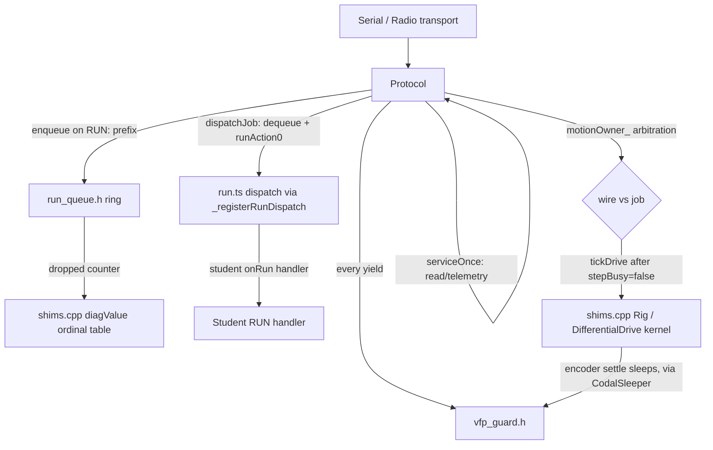

<!-- CLASI: Before changing code or making plans, review the SE process in CLAUDE.md -->

# Sprint 026: Fiber safety and command dispatch

## Goals

Close two defects with one origin, root-caused in
`clasi/issues/fiber-safety-and-command-dispatch.md`: commands are
executed on whatever fiber happens to pick them up, and no fiber is
currently safe to switch away from while holding a pointer.

1. Stop `RUN:` motion programs from hard-faulting the board (measured
   3/3 on gopiv) by guarding every yield this extension owns against
   CODAL's failure to save the FPU register bank across a fiber switch.
2. Replace the write-cursor-only RUN payload buffer
   (`runSlots_`/`nextRunSlot_`) with a real queue that surfaces overflow
   instead of silently destroying an unread command.
3. Collapse the three coexisting execution models (wire motion on the
   protocol fiber, `RUN:` motion on a forked MessageBus fiber, student
   blocks on the calling fiber) into one deliberate model: a single
   executor on the protocol fiber, with the tour's own tick loop
   inverted onto it rather than the reverse.

## Problem

**CODAL's fiber context switch saves R0-R12/SP/LR and no VFP
registers** (`codal-nrf52/asm/CortexContextSwitch.s`). This firmware is
built `-mfpu=fpv4-sp-d16 -mfloat-abi=softfp`, so GCC allocates the
callee-saved FPU bank s16-s31 (= d8-d15) as ordinary spill space — for
pointers as well as floats. Any fiber parked at a yield while holding a
value in that bank loses it the instant another fiber runs float code.

MEASURED gopiv 2026-09-01 (pyOCD, `DIFFDRIVE_FAULT_SPIN` build):
`Protocol::run()` parks `&radioTransport_` in s17 across its poll
`fiber_sleep`; a RUN handler fiber's `DifferentialDrive::drive(float,
float)` writes a wheel speed into s16/s17; the protocol fiber wakes,
restores float `-25.0f` as `this`, and dereferences it — `CFSR 0x8200`
(precise data bus error), board reset. `RUN:straight:20`,
`RUN:pivot:90` and `RUN:square:20` fault 3/3; host-driven `MOVE_X`
(which ticks on the protocol fiber alone) does not. CODAL is
non-preemptive — context switches happen only at explicit yields —
which is what makes "guard every yield we own" a *sufficient* fix, not
merely a mitigation.

Two further defects share the same root cause of "no single, disciplined
execution model":

- `runSlots_[4][48]` + `nextRunSlot_` (`src/comms/protocol.h:142-145`)
  is a write cursor with no read cursor, no occupancy tracking, and no
  overflow signal. A burst arriving during a long tour silently
  overwrites text a pending handler has not read yet. The 3 s
  same-text dedupe (`protocol.cpp`) exists only to paper over that —
  and it makes sending the identical command twice inside 3 s silently
  impossible, which is exactly what `tools/turn_sweep.py` does.
- Three execution models coexist today: wire motion ticks on the
  protocol fiber, `RUN:` motion ticks on a forked MessageBus fiber, and
  student blocks tick on the calling fiber. Only the third is
  deliberate; the other two are historical accidents that also happen
  to be where the FPU hazard actually bites.

## Solution

Three steps, landing in strict dependency order — step 1 must be
hardware-confirmed on gopiv before step 3 begins (per the issue's own
"Proposed fix" ordering):

1. **VFP yield guard** (ticket 001) — a `noinline` `vfpSafeSleep()` /
   `vfpSafeYield()` pair in `src/platform/vfp_guard.{h,cpp}` whose
   inline-asm clobber of d8-d15 forces AAPCS to save/restore the whole
   bank around every yield this extension owns, on the calling fiber's
   own stack. Every direct `fiber_sleep()`/`schedule()` call site in
   this extension's own code is rerouted through it, plus one
   `SYNC_SLEEP` call inside `uBit.serial.send()` that yields without
   naming a yield primitive. The source-level implementation, its
   guardrails (a fiber-yield-safety rule, a system-invariant note in
   `src/DESIGN.md`, in-header rationale, and a teaching-oriented
   permanent test), and the full host suite are **already done and
   sitting uncommitted in the working tree** — what remains is a
   firmware build, a codegen census, and the hardware kill test.
2. **A real RUN queue** (ticket 002) — a header-only ring in
   `src/comms/run_queue.h`, following the host-portable-extraction
   precedent `src/core/heading_wrap.h` and
   `src/core/encoder_glitch_armor.h` set. `handleRun()` enqueues
   instead of overwriting; a `dropped` counter surfaces overflow
   through the existing `diagValue()` ordinal table. No fiber or
   dispatch change — host-testable in isolation.
3. **Single executor on the protocol fiber** (ticket 003) — split
   `Protocol::run()` into a non-blocking `serviceOnce()` plus a loop
   that services the wire, dispatches one queued job via the TS action
   dispatcher, and ticks or sleeps. The tour keeps its own
   `startMove()`/`driveTick()` tick shape; the loop inverts onto the
   executor's fiber rather than moving the tick into TypeScript. A
   `motionOwner_ ∈ {none, wire, job}` field in `Protocol` arbitrates a
   wire move against a running RUN job. `RUN:abort`/`RUN:clearestop`
   bypass the queue outright — abort must never wait behind the job it
   is meant to stop.

## Success Criteria

- Baseline (current firmware) reproduces 3/3 resets on
  `RUN:straight:20`; the fixed firmware produces 0/10
  `RUN:straight:20`, 0/10 `RUN:pivot:90`, 0/5 `RUN:square:20` on gopiv,
  in the same pyOCD session.
- A disassembly census of the flashed ELF shows exactly three symbols
  (`vfpSafeSleep`, `vfpSafeYield`, the serial-send wrapper) still
  calling a yield primitive directly; the codegen for both wrappers
  shows a `vpush.64 {d8-d15}` / `vldm sp!, {d8-d15}` pair around a `bl`
  (not a `b.w`).
- A burst of RUN commands arriving faster than a handler can drain them
  is either queued and delivered in order, or counted as `dropped` and
  visible via `diagValue()` — never silently overwritten.
- Exactly one execution model remains for engine-facing motion: the
  protocol fiber. `RUN:abort` still stops a running job with no queue
  delay. A wire `MOVE_X` arriving mid-`RUN:`-job is arbitrated by
  `motionOwner_`, not silently overwritten.
- `uv run pytest` passes throughout; `tests/system/run_tour.py` (the
  host-driven `.tour` suite) passes unchanged.

## Scope

### In Scope

- `src/platform/vfp_guard.{h,cpp}` and every call site rerouted through
  it (already implemented in the working tree; this sprint verifies and
  lands it).
- `src/comms/run_queue.h` and `handleRun()`'s switch to it.
- `Protocol::run()`'s split into `serviceOnce()` + executor loop,
  `dispatchJob()`, `tickDrive()`'s post-`stepBusy` service hook,
  `motionOwner_`, the `_registerRunDispatch(cb)` shim replacing
  `control.onEvent(RUN_EVENT_SOURCE, ...)`, and the `device_stack_size`
  bump to 4096 via `pxt.json`'s yotta config seam.
- The hardware kill test and radio-traffic/tigez wedge re-test on
  gopiv, per the issue's Verification section.

### Out of Scope

- The genuine upstream fix (CODAL's `swap_context` saving s16-s31, or
  building `-mfloat-abi=soft`/`-ffixed-s16...s31`) — out of bounds,
  vendored toolchain; to be filed upstream, not patched here.
- Removing the underlying hazard for student `control.inBackground()`
  C++-adjacent code — the guard protects this extension's own frames
  only; PXT's TypeScript codegen emits no `vpush`/`vldm`, so pure-TS
  student code has nothing in the bank to lose, and that narrower claim
  is what gets documented, not a broader fix.
- Arming the motion obligation from TypeScript so the protocol fiber
  ticks TS-issued moves directly — explicitly superseded in the issue:
  `tourWorld()`'s OTOS reads between moves would land inside the
  encoder select-to-read window, trading an FPU hazard for an I2C one.
- A definitive resolution of the radio-traffic wedge
  (`fw-1-20260829-1-wedges-on-radio-traffic-during-motion.md`) and the
  tigez wedge — this sprint re-tests both after ticket 001 and reports
  either way, but does not treat either as closed by this work alone.

## Test Strategy

- **Host tests** (no toolchain): `tests/host/test_vfp_guard_source_pin.py`
  (already written) pins the source-level guard discipline; new host
  tests for `run_queue.h`'s ring semantics (enqueue/dequeue order,
  `dropped` counting on overflow) following `heading_wrap.h`'s
  syntax-check-translation-unit precedent; `test_run_abort_source_pin.py`
  is rewritten at ticket 003 to pin "abort bypasses the queue" instead
  of "an abort handler exists"; `test_wire_constants_drift.py`'s
  `RUN_EVENT_SOURCE`/`0x2001` pin is deleted with the code it pins, at
  ticket 003.
- **Codegen verification** (ticket 001 only, no host toolchain
  substitute exists): `arm-none-eabi-gdb` disassembly of the flashed
  ELF (`.tmp/deploy-head/built/dockercodal/build/MICROBIT`, not the
  stale repo-root copy) — confirms the `vpush`/`vldm`/`bl` shape of both
  wrappers and the "exactly three yield call sites remain" census.
- **Hardware acceptance** (ticket 001 gate for ticket 003; gopiv on farm
  node magni, pyOCD only — DAPLink mass storage blanks the board on
  that host): baseline 3/3 resets on current firmware, then 0/10
  `RUN:straight:20`, 0/10 `RUN:pivot:90`, 0/5 `RUN:square:20` on the
  fixed firmware, then the harder race (subscribe `TLM`, interleave
  `MOVE_X` during `RUN:square:20`), then the radio-traffic and tigez
  wedge re-tests, reported either way.
- **System/integration**: `tests/system/run_tour.py` (the host-driven
  `.tour` suite) re-run after ticket 003 to confirm the inverted tick
  loop changes nothing observable about wire-driven tours.
- **Full suite**: `uv run pytest` runs once per ticket scoped to the
  modules touched (per `.claude/rules/source-code.md`), and in full at
  `close_sprint`.

## Architecture

**Substantial.** Three tickets touch four modules with a new
cross-module composition: `src/platform/vfp_guard.{h,cpp}` (new leaf
module every yield site now depends on), `src/comms/run_queue.h` (new
host-portable module), `src/comms/protocol.{h,cpp}` (gains a queue
member, a `motionOwner_` field, and a split run loop), and the TS RUN
dispatch shim (`src/blocks/run.ts` + `src/shims.cpp`, which gains a
`_registerRunDispatch(cb)` seam replacing a `control.onEvent()`
registration). Ticket 003 also introduces a genuinely new
cross-module dependency — the protocol fiber calling directly into the
TS action dispatcher (`runAction0`) — and changes an existing
dependency's shape (`Protocol` gains ownership of a decision,
`motionOwner_`, that today doesn't exist anywhere). No data-model
change: the queue is in-memory only, nothing persisted, so no ERD.

### Architecture Overview

**Module responsibilities (one sentence each):**

- **`vfp_guard`** — makes a yield safe by construction; the only
  sanctioned way for this extension's C++ to call `fiber_sleep()`/
  `schedule()`.
- **`run_queue`** — holds pending RUN command text in arrival order and
  counts what it had to drop; knows nothing about fibers, MessageBus,
  or dispatch.
- **`Protocol`** — owns the one CODAL fiber that services the wire, the
  RUN queue, and (as of ticket 003) motion-job dispatch; arbitrates
  which caller (wire or job) currently owns the drivetrain via
  `motionOwner_`.
- **TS RUN dispatch shim** (`run.ts`/`shims.cpp`) — maps a dequeued
  command's name to the student-registered handler and runs it; after
  ticket 003 it is *invoked by* the protocol fiber (`_registerRunDispatch`)
  rather than *invoking itself* off a MessageBus event on its own forked
  fiber.

**Component diagram (target shape, after ticket 003):**

**Before (current state, tickets 001-002 land without changing this):**
wire motion ticks on the protocol fiber (safe today only because it's
the sole fiber doing float work); `RUN:` motion ticks on a
MessageBus-forked fiber holding its own `while (driveTick())` loop,
concurrently with the protocol fiber — this second fiber is the one the
FPU hazard actually fires across, and it is also *why* `RUN:abort`
works today (it runs concurrently, "by accident," per the issue).
Ticket 003 removes this second fiber's motion role entirely; the queue
and the guard (tickets 001-002) are prerequisites that make the
collapse safe, not the collapse itself.

**Dependency-direction note:** before ticket 003, `run.ts` initiates
its own dispatch (TS owns the fiber). After, `Protocol` initiates
dispatch into TS (`dispatchJob()` calls `runAction0()`), which is a new
firmware-to-TS-runtime edge. This is mechanically supported — PXT's
`runAction3` pushes a per-fiber `ThreadContext` that `gcProcessStacks`
already walks — but it is new, so it is called out here rather than
left implicit.

**No entity-relationship diagram**: no persisted or wire-format data
model changes. The queue is a fixed-size in-memory ring; its shape
(head/tail/count/dropped) is described in prose in the Solution section
above and needs no ERD to be understood.

### Design Rationale

**Decision: contain the hazard with a source-level guard rather than
waiting on an upstream CODAL fix.**
- *Context*: the true root cause (`swap_context` saving no VFP
  registers) is a CODAL defect. The clean fixes — patching
  `swap_context`, or building `-mfloat-abi=soft`/`-ffixed-s16...s31` —
  both require editing vendored toolchain files; `codal.json` exposes
  preprocessor `definitions` only, no compiler-flag knob.
- *Alternatives considered*: (a) wait for/patch upstream CODAL —
  rejected, out of bounds for this repo and blocks the fleet
  indefinitely; (b) disable the hardware FPU entirely
  (`-mfloat-abi=soft`) — rejected for the same vendored-toolchain
  reason, and it would also cost real cycles on every float operation,
  not just at yields; (c) a source-level `noinline` + clobber wrapper
  around every yield this extension owns — chosen, because CODAL's
  non-preemptive scheduling makes the set of yield points finite and
  enumerable, so "guard all of them" is a complete fix for this
  extension's own code, not a partial mitigation.
- *Consequences*: the hazard is NOT closed for student
  `control.inBackground()` programs that call into C++ frames beneath
  their own fiber outside this extension's guarded call sites (though
  pure-TS student code is unaffected, since PXT's codegen never uses
  the bank). This narrower, accurate claim must be documented for
  students, not silently generalized into "the hazard is fixed."
  Reported upstream regardless (see the issue's own closing note).

**Decision: invert the tour's tick loop onto the executor fiber, rather
than arming the motion obligation from TypeScript (the superseded
approach).**
- *Context*: an earlier writeup proposed making TS-issued moves arm
  `hasLiveMotionObligation()` the same way wire moves do, so the
  protocol fiber would tick TS-issued moves too.
- *Alternatives considered*: (a) arm the obligation from TS (superseded)
  — rejected: `tourWorld()` reads the OTOS on the handler's own fiber
  between moves, and moving the tick elsewhere puts those reads inside
  the encoder select-to-read window `src/DESIGN.md`'s bus-discipline
  invariant forbids — this would trade an FPU hazard for an I2C one;
  (b) make the executor drive the tour directly (turn the tour into a
  state machine the executor steps) — rejected, it destroys the
  explicit `startMove()` + `driveTick()` shape `test/test.ts` calls
  deliberately, for no benefit; (c) keep the tour's own tick loop
  intact and run that loop's *iterations* on the executor's fiber via a
  service hook fired after `stepBusy = false` and before the pacing
  sleep — chosen.
- *Consequences*: `tickDrive()` gains one function-pointer service hook
  on `Rig`, kept out of `shims.cpp` deliberately so no new CODAL surface
  leaks into that file; it is host-testable via the existing
  `FakeSleeper::onSleep` injection. The hook must never fire inside
  `stepBusy` — `step()` already yields twice inside the encoder
  select-to-read window on its own.

**Decision: `motionOwner_` lives in `Protocol`, not `WireAdapter`.**
- *Context*: today a wire `MOVE_X` arriving mid-tour silently overwrites
  the tour's move, with no error surfaced to either side.
- *Alternatives considered*: (a) add ownership tracking to
  `WireAdapter` — rejected, it would make the wire-verb host tests
  (which construct `WireAdapter` without a `Protocol`) depend on a
  concept that only exists once a `Protocol`-owned job can compete for
  the drivetrain, invalidating them; (b) track it in `Protocol` — chosen,
  since `Protocol` is the only object that can see both a wire request
  and a dispatched job.
- *Consequences*: the wire-verb tests stay valid unmodified; arbitration
  logic lives beside the thing being arbitrated (the executor loop).

**Decision: `RUN:abort`/`RUN:clearestop` bypass the queue.**
- *Context*: abort works today "by accident" — the MessageBus fork
  means it runs on a second, concurrent fiber, so it can interrupt a
  running test. Under one executor, a *queued* abort would sit behind
  the very job it's meant to stop.
- *Alternatives considered*: (a) queue everything uniformly, including
  abort — rejected, defeats abort's entire purpose; (b) give abort/
  clearestop a fast path that runs immediately, ahead of the queue —
  chosen.
- *Consequences*: `test_run_abort_source_pin.py` must be rewritten at
  ticket 003 — the pin moves from "an abort handler exists" to "abort
  bypasses the queue," per the issue's own Traps list.

**Decision: `hasLiveMotionObligation()` stays wire-only; RUN jobs get no
obligation.**
- *Context*: obligation tracking exists to let the protocol fiber know
  it must keep ticking a wire move even with no other fiber watching.
- *Alternatives considered*: (a) extend it to RUN jobs — rejected, a
  RUN job already has its own tick loop running (inverted onto the
  executor fiber per the decision above), so it needs no separate
  obligation; extending the concept would make a wire motion incorrectly
  report `kStop` where `kTimeout` is the correct answer; (b) leave it
  wire-only — chosen.
- *Consequences*: the wire-only contract stays exactly as documented
  today; no behavior change for wire-issued moves.

### Migration Concerns

- **No data migration.** The RUN queue is in-memory only; nothing
  persisted changes shape.
- **Strict sequencing, not just ordering.** Ticket 001 must be
  hardware-confirmed (the gopiv kill test passing) before ticket 003
  begins. Ticket 003 restructures the very fiber the guard protects;
  starting it on an unconfirmed guard would make a ticket-003 test
  failure ambiguous between "the guard doesn't work" and "the
  restructuring is wrong."
- **Two tests are retired or rewritten, not silently left broken**:
  `test_wire_constants_drift.py`'s `RUN_EVENT_SOURCE`/`0x2001` literal
  pin becomes meaningless once the 0x2001 event leaves the RUN path at
  ticket 003 and must be deleted with the code it pins, not left
  failing or vacuously passing. `test_run_abort_source_pin.py` is
  rewritten in place at ticket 003 (see Design Rationale above).
- **Build target discipline**: all firmware builds and the hardware
  acceptance test in this sprint use `--robot gopiv` explicitly —
  `DEFAULT_ROBOT` is vevov, and building for the wrong robot would
  invalidate the channel/group baked into the hex without any build
  error.
- **Flashing gopiv on farm node magni**: DAPLink mass storage times out
  mid-write on that host and blanks the board. Use `pyocd erase --mass`
  followed by `pyocd flash -t nrf52833` — never the MSD drag-and-drop
  path — for every flash in ticket 001's hardware acceptance.
- **The archaeology marker budget is at 388/388 with zero slack** —
  `test_archaeology_marker_budget.py` fails the build on any new
  comment line naming a sprint, a ticket, an `R-NN` code, or any `.md`
  filename. Every new file this sprint adds must describe mechanisms,
  not provenance; issue/ticket references belong in commit messages
  only.
- **`test_pxt_manifest_completeness.py` checks `pxt.json` both
  directions** — a new source file with no `pxt.json` entry fails the
  build the same way an orphaned `pxt.json` entry does.

### Open Questions

1. Whether the radio-traffic wedge
   (`fw-1-20260829-1-wedges-on-radio-traffic-during-motion.md`) and the
   tigez wedge (identical `CFSR 0x8200`, previously attributed to heap
   corruption) actually clear once ticket 001 lands is genuinely
   unknown until the hardware re-test runs. The issue is explicit that
   this must be reported either way — a persisting fault after the
   guard means it is a *separate* fault, and the guard must not be
   allowed to become its explanation by default.
2. Whether `device_stack_size = 4096` (up from the yotta default of
   2048) is the right headroom for the executor's new call depth
   (service hook + `runAction0` + whatever a student's RUN handler
   itself calls) is a judgment call in the issue, not a measured
   number. If ticket 003's hardware testing shows stack pressure, this
   value may need revisiting.
3. The hazard for student `control.inBackground()` code beneath a C++
   frame is explicitly not fixed by this sprint (see Scope). Where and
   how to document this for students (a `DESIGN.md`-adjacent student-
   facing note, a README caveat, or something else) is not decided
   here and is left to a follow-up.

## Use Cases

### SUC-001: A `RUN:` motion command completes without resetting the board
Parent: None — internal firmware fiber-safety guarantee;
`docs/design/usecases.md` covers the extension's block-level API, not
the wire/RUN protocol's internal execution-fiber discipline, so no
existing UC applies.

- **Actor**: A bench host (or relay) sending `RUN:<name>[:<arg>]` over
  serial or radio; the five bench tools that drive through RUN verbs
  (`otos_levercal.py`, `pivot_truth.py`, `truth_check.py`,
  `rotation_check.py`, `turn_sweep.py`).
- **Preconditions**: The robot has booted and accepted the RUN command;
  the command drives the motors (e.g. `straight`, `pivot`, `square`).
- **Main Flow**:
  1. The host sends `RUN:<name>:<arg>`.
  2. The command is parked and dispatched to the matching
     `onRun()`-registered handler.
  3. The handler drives the motion to completion, yielding
     periodically.
  4. Every yield anywhere in this extension's own call graph — parked
     pointers included — survives the yield unchanged.
  5. The handler returns; the robot's uptime counter and `cyc` continue
     advancing without interruption.
- **Postconditions**: No boot banner re-appears on the wire mid-test; no
  `pong`/`STATUS` reply shows a reset uptime. `PING`'s counter never
  goes backward.
- **Acceptance Criteria**:
  - [ ] Baseline (current/unguarded firmware): `RUN:straight:20` resets
        the board 3/3, confirming the repro before the fix is judged.
  - [ ] Fixed firmware: 0/10 `RUN:straight:20`, 0/10 `RUN:pivot:90`,
        0/5 `RUN:square:20` on gopiv.
  - [ ] A disassembly census of the flashed ELF confirms exactly three
        symbols (the two guard wrappers plus the serial-send wrapper)
        still call a yield primitive directly, and both wrappers show
        `vpush.64 {d8-d15}` / `vldm sp!, {d8-d15}` around a `bl`.
  - [ ] The harder race (subscribed `TLM` plus interleaved `MOVE_X`
        during `RUN:square:20`) also produces zero resets.

### SUC-002: A burst of RUN commands is never silently destroyed
Parent: None — internal wire-protocol delivery guarantee; no existing
UC in `docs/design/usecases.md` covers the RUN transport's own
buffering behavior.

- **Actor**: A bench host sending RUN commands faster than the current
  handler can drain them (a retry burst surviving the single-slot
  inbound path, or a legitimate repeated command such as
  `tools/turn_sweep.py` sends).
- **Preconditions**: A RUN handler is mid-execution when one or more
  further RUN commands arrive.
- **Main Flow**:
  1. Each arriving RUN command is enqueued in `run_queue.h`'s ring
     rather than overwriting a fixed slot.
  2. If the ring is full, the newest command increments a `dropped`
     counter instead of silently overwriting a pending command's text.
  3. The `dropped` counter is readable via the existing `diagValue()`
     ordinal table.
  4. Once the running handler completes, the executor dispatches the
     next queued command in arrival order.
- **Postconditions**: No command's text is destroyed before some
  handler has read it, except when the ring is genuinely full — in
  which case the loss is counted and visible, never silent. Sending the
  identical command twice within a short window is no longer
  categorically suppressed by a dedupe workaround (the dedupe window
  may shrink or be removed once the queue makes it unnecessary).
- **Acceptance Criteria**:
  - [ ] A host test proves enqueue/dequeue preserves arrival order.
  - [ ] A host test proves an overflowing burst increments `dropped`
        rather than corrupting a pending slot's text.
  - [ ] `turn_sweep.py`'s repeated-identical-command pattern is no
        longer defeated by the 3 s same-text dedupe.

### SUC-003: RUN dispatch and wire motion run on one deliberate execution model
Parent: None — internal firmware concurrency/execution-model guarantee;
no existing UC in `docs/design/usecases.md` covers which fiber executes
which command class.

- **Actor**: The protocol fiber itself, arbitrating between a wire
  `MOVE_X`/`GO_TO_*` request and a dispatched RUN job; a host sending
  `RUN:abort` while a job is running.
- **Preconditions**: Ticket 001 is hardware-confirmed; ticket 002's
  queue is in place.
- **Main Flow**:
  1. `Protocol::run()`'s loop calls `serviceOnce()` (wire read, radio
     read, telemetry if due).
  2. If a job is queued and no job is currently running, `dispatchJob()`
     invokes the TS handler via `runAction0()` on the protocol fiber.
  3. `tickDrive()`'s service hook fires after `stepBusy = false` and
     before the pacing sleep, letting a running job's own tick loop
     advance on this same fiber.
  4. If `RUN:abort` or `RUN:clearestop` arrives, it bypasses the queue
     and takes effect immediately, regardless of what is running.
  5. A wire motion request arriving while a job holds `motionOwner_ ==
     job` is arbitrated, not silently overwritten.
- **Postconditions**: Exactly one fiber executes all engine-facing
  motion. `RUN:abort` still stops a running job with no queue delay.
- **Acceptance Criteria**:
  - [ ] `test_run_abort_source_pin.py` (rewritten) proves abort bypasses
        the queue.
  - [ ] A host test or documented manual check confirms a wire `MOVE_X`
        arriving mid-job is arbitrated via `motionOwner_`, not silently
        overwritten.
  - [ ] `test_wire_constants_drift.py`'s now-meaningless
        `RUN_EVENT_SOURCE` pin is deleted along with the `0x2001` event
        path.
  - [ ] `tests/system/run_tour.py` (the host-driven `.tour` suite)
        passes unchanged.

## GitHub Issues

(No GitHub issues linked yet.)

## Definition of Ready

Before tickets can be created, all of the following must be true:

- [x] Sprint planning document is complete (sprint.md, including its
      Architecture and Use Cases sections)
- [x] Architecture review passed (or skipped, for changes with no
      architectural impact)
- [ ] Stakeholder has approved the sprint plan

## Tickets

| # | Title | Depends On |
|---|-------|------------|
| 001 | VFP yield guard — verify and hardware-confirm | — |
| 002 | A real RUN queue | — |
| 003 | Single executor on the protocol fiber | 001, 002 |

Tickets execute serially in the order listed.
