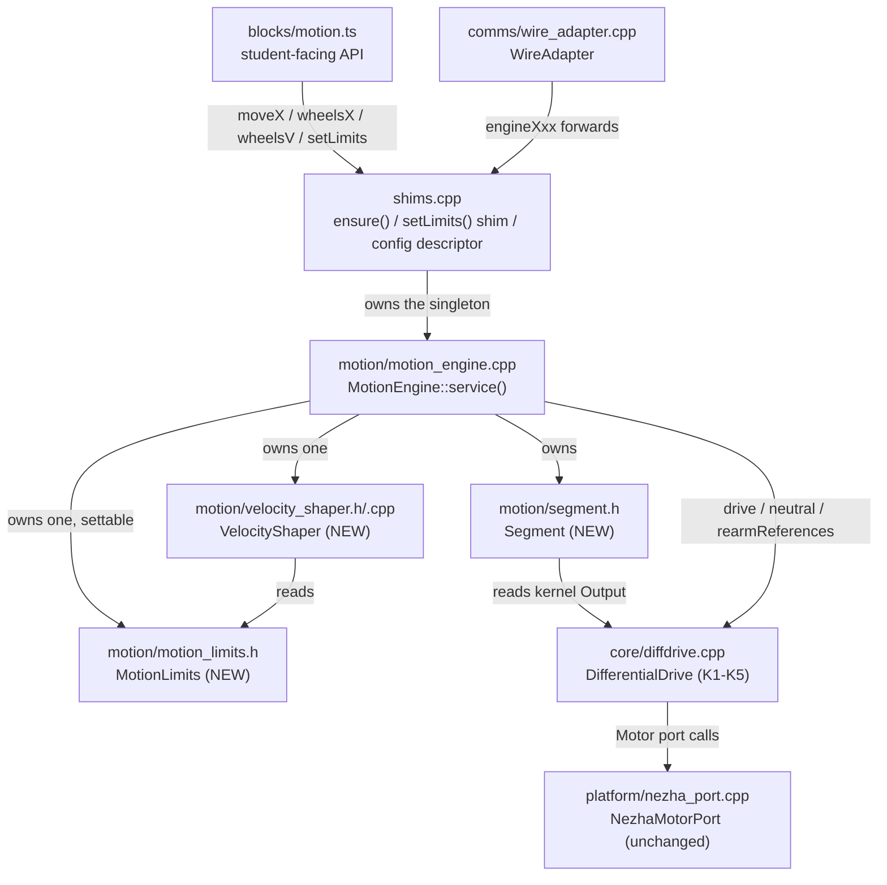

<!-- CLASI: Before changing code or making plans, review the SE process in CLAUDE.md -->

# Sprint 029: Motion profile unification: one shaper, one floor, predictive arrival

## Goals

Implement `docs/design/motion-profile-unification.md` end to end: retire
the two uncoordinated shaping algorithms in `serviceMove()` and the
kernel's own floor/twist-hold in favor of one `VelocityShaper` that
every entry point (`move`, `goTo`, `wheelsX`, `wheelsV`, `driveTwist`,
the wire's six verbs) goes through, with predictive arrival replacing
the post-hoc completion test that costs every pivot ~2° of coast. The
design's own section 11 lists five implementation tickets in dependency
order (kernel patches K1-K5 with paired-PR host tests; `MotionLimits` +
`VelocityShaper` in isolation; `Segment` + `MotionEngine::service()`
wired in, legacy deleted; the config descriptor surface; bench
acceptance) — this sprint follows that ordering. Alongside the profile
work: strip unit suffixes from identifier names across project-owned
`src/` per `.claude/rules/no-units-in-identifiers.md` (the `motion/`
renames ride with ticket 3 above; the rest — `shims.cpp`, `comms/`,
`blocks/`, `platform/` — is its own ticket), and fix the two stale
bench-tool constants the bench acceptance gates (G1-G6, design §10)
depend on: `camlink.py`'s stale tag-53 mount overwriting the daemon's
persistent registry every tool start, and `robotlink.py` tuning the
relay to vevov's retired 4/10 radio address instead of its current
37/43.

## Problem

Three uncoordinated mechanisms decide wheel speed at once — the move
engine's scale multiplier (legacy taper or trapezoid, both with an
inert floor below 280 mm/s), the kernel's post-floor speed clamp, and
the kernel's pre-floor twist-hold reference — and their interaction,
not any single bug, is the accuracy loss the project has been
calibrating away per-robot as `pivot_overrun`. MEASURED on the real
kernel and engine (`profile_probe.out`): every pivot coasts ~1.5°/tick
past its target because completion is detected after the crossing;
below ~200 mm/s cruise the twist servo fights the floor and ends with
an ~11% reverse kick; the position-only integral loop overspeeds ~10%
after every ramp and jumps duty ~6 points on a single frozen encoder
tick; jerk is unbounded at the start and end of every move in every
mode, including the nominally jerk-limited one. Separately, on the
bench-tooling side, two files hold two different calibrations of record
for the robot the bench acceptance gates will be run on: `camlink.py`
re-registers a pre-remount tag-53 mount over the daemon's live registry
on every tool start, silently overwriting the 2026-09-02 remeasurement
in `field_calibration.json`, and `robotlink.py` still tunes the relay
to an address vevov left on 2026-08-30 — a stale calibration and a dead
radio address are exactly the failure modes the bench gates (G1-G6)
would misattribute to the new profile code if left unfixed.

## Solution

Follow `docs/design/motion-profile-unification.md` section 11's five
tickets in order: (1) kernel patches K1-K4 (twist-hold integrates the
post-floor half-differential, freeze the position reference on a stale
tick, anti-windup clamp, `rearmReferences()`) plus K5 (`vMin = 0`) with
host tests, shipped as a paired change against
`radio-robot-elite/src/firm/diffdrive/` pending the kernel-fork
decision below; (2) `MotionLimits` and `VelocityShaper` as new,
host-tested, host-portable files, not yet wired in; (3) `Segment` +
`MotionEngine::service()` replacing `serviceMove()`'s two braided
algorithms and thirteen knobs, `wheelsV` through a shaped hold,
`wheelsX` becoming closed-loop like `moveX`, and the `motion/`-scoped
identifier renames landing in the same pass since the files are
already open; (4) the config descriptor surface (wire names, removed
ordinals answering `err 1` for one release, blocks as hidden no-ops,
`test.ts`'s two profiles as `MotionLimits` literals); (5) bench
acceptance on one robot (gates G1-G6) with the two measured constants
(`stop_distance`, `omega_floor`) recorded. The identifier-naming
cleanup for everything outside `motion/` (`shims.cpp`, `comms/`,
`blocks/`, `platform/`) is a separate ticket with its own source-pin
test. The bench-tooling fix (`camlink.py` reads `field_calibration.json`
as the one calibration of record and never re-registers a mount it did
not load except via explicit `--register`; `robotlink.py` derives the
relay address from the board name or reads it from
`field_calibration.json`) is sequenced before the bench-acceptance
ticket so gates G1-G6 measure the new profile against a trustworthy
camera truth and a reachable radio link, not a stale mount or a silent
robot.

## Success Criteria

- Design section 7's "after" predictions are confirmed by the probe
  promoted to a test (`test_profile_probe.py`): 90° pivots end within
  0.5° with no reverse duty; the frozen-tick duty kick is zero; the
  600 mm straight no longer overspeeds ~10% after the ramp.
- Bench gates G1-G6 (design §10.1) pass on one robot and are cited with
  their capture artifacts per `.claude/rules/measurement-citations.md`.
- `pivot_overrun` is gone from `kFields`, the bake, and every robot
  config; `stop_distance` and `omega_floor` are measured (design §10.2)
  and recorded.
- No `MmS`/`Ms`/`Mm`/`Rad`/`Counts` unit suffix remains in `src/motion/`;
  the source-pin test for the rest of `src/` is green with an empty
  allow-list except the documented conversion functions.
- `camlink.py` starting any tool leaves the daemon's registry
  unchanged; `open_link(radio=True)` on vevov gets a pong on the first
  try.

## Scope

### In Scope

- Kernel patches K1-K5 (`src/core/diffdrive.*`) with host tests.
- `MotionLimits`, `VelocityShaper`, `Segment`, `MotionEngine::service()`
  (`src/motion/`), replacing the legacy taper and the shaped-mode fork.
- Config descriptor surface for the shaping fields (`shims.cpp`,
  `wire_adapter.cpp`, `blocks/motion.ts`, `test/test.ts` profiles,
  `tools/` and `firmware_bake` keys for the removed/renamed ordinals).
- Identifier-naming cleanup: `motion/` (with ticket 3) and the rest of
  project-owned `src/` (its own ticket), per
  `.claude/rules/no-units-in-identifiers.md`, each with its `// [unit]`
  comment and a source-pin test.
- `tools/camlink.py` (one calibration of record, explicit registration)
  and `tools/robotlink.py` (relay address derived from the board name
  or read from `field_calibration.json`) — scoped to what the bench
  acceptance gates need; the broader tools consolidation is sprint E.
- Bench acceptance run (design §10) on one robot; the two measurements
  in §10.2.

### Out of Scope

- Everything in sprints B (bus discipline/fiber safety), C (test
  program/blocks/simulator), D (odometry object, config descriptor
  table beyond the shaping fields, Protocol diet), E (bench tools
  beyond camlink/robotlink), and F (comment work order).
- Retuning `ki`, adding `kp`, or changing the feed-forward gain (design
  §12, explicitly out of scope — a tuning campaign after this lands).
- Odometry ownership (`Odometry` object) — sprint D.
- The wire grammar's verb set; field *names* change, verbs do not.
- Supervisory re-solve for `goTo` — still single-shot.

## Open Question

The kernel-fork decision (`decide-the-kernel-fork.md`) gates ticket 1:
either this repo owns its vendored `DifferentialDrive` fork outright
(drop the byte-identical rule, keep a behavioural fidelity test), or
every kernel ticket — K1-K5 here, and any future kernel fix — ships as
a paired PR against `radio-robot-elite/src/firm/diffdrive/`. This is a
stakeholder decision, not a planning decision this sprint can make; the
design (§12) is written to work under either, with ticket 1 assuming
the paired-PR case as the safer default until the stakeholder decides
otherwise. Detail-mode planning for this sprint should surface the
decision explicitly before ticket 1 starts.

### Tooling note: `seed_sprint_design_overlay` slug collision (found during this sprint's planning)

`seed_sprint_design_overlay("029", ["design.md", "src/DESIGN.md",
"src/motion/DESIGN.md", "src/core/DESIGN.md", "tools/DESIGN.md"])`
silently overwrote `src/DESIGN.md`'s seeded overlay copy with
`tools/DESIGN.md`'s content: both files are their own `project.sources`
root's top-level `DESIGN.md` (`sources: [src, tools, tests, test]` per
`.clasi/config.yaml`), and the tool's documented slug-derivation
("path components relative to the doc's nearest enclosing source root")
strips the root name itself, so a root's own top-level doc always
reduces to the bare slug `DESIGN.md` — identical for every root. The
`architecture-authoring` skill's own Mode 2a documentation states this
collision case is handled ("multiple `DESIGN.md` files seeded in the
same call land under distinct filenames... so co-located subsystem
docs... do not collide") but that only holds when each doc has a
subdirectory component relative to its root (`core/DESIGN.md`,
`motion/DESIGN.md` got distinct slugs correctly); two *different roots'
own* top-level docs are not distinguished at all. This project has four
declared source roots (`src`, `tools`, `tests`, `test`), each with its
own top-level `DESIGN.md` — the exact shape this gap hits.

Practical effect on this sprint's overlay: `src/DESIGN.md` — the doc
carrying this sprint's most substantial content (the kernel §2 and
motion-engine §3 object-model rewrite) — has **no overlay copy** this
planning session; the overlay's `design/DESIGN.md` slot correctly holds
`tools/DESIGN.md` instead (confirmed via `_sources.json` and content
inspection) and was edited accordingly (the camlink/robotlink
calibration-of-record note). `design/design.md`, `design/motion-
DESIGN.md`, and `design/core-DESIGN.md` were seeded and edited without
issue (unique slugs) and the overlay validates clean
(`validate_design(overlay_dir=...)` → `ok: true`) for what it does
contain.

**Recommendation**: report this as a CLASI tool defect
(`seed_sprint_design_overlay`'s `_derive_overlay_slug` should include
the source-root name itself when a doc's path relative to its root has
no subdirectory component, not just when it does). **Until fixed**,
`src/DESIGN.md`'s architecture updates for this sprint are handled as
direct, real-file ticket edits instead of overlay-mediated ones —
tickets 001 (§2, the kernel patches and fork regime), 003 (§3, the
object-model rewrite — the largest edit), 004 (§5, the config
descriptor table), and 007 (§3's measured-constant field comments) each
carry this explicitly in their Implementation Plan. This means
`close_sprint`'s automatic `design_overlay_apply`/`clasi design
validate` step will **not** cover `src/DESIGN.md`'s correctness at
sprint close (only the overlay's four other, correctly-seeded docs are
covered) — a human reviewer or the team-lead should confirm
`src/DESIGN.md`'s real-file edits landed and are internally consistent
before or during `close_sprint`, since the usual automated gate is
silently narrower than usual for this one sprint.

## Related Issues

- [`code-review/decide-the-kernel-fork.md`](../../issues/code-review/decide-the-kernel-fork.md)
- [`code-review/kernel-reference-handling-twist-floor-stale-tick-antiwindup.md`](../../issues/code-review/kernel-reference-handling-twist-floor-stale-tick-antiwindup.md)
- [`code-review/pivot-end-predictive-termination-and-yaw-floor.md`](../../issues/code-review/pivot-end-predictive-termination-and-yaw-floor.md)
- [`code-review/one-velocity-shaper-profile-object-out-of-servicemove.md`](../../issues/code-review/one-velocity-shaper-profile-object-out-of-servicemove.md)
- [`code-review/strip-units-from-identifier-names.md`](../../issues/code-review/strip-units-from-identifier-names.md)
- [`code-review/one-calibration-of-record-camlink-robotlink.md`](../../issues/code-review/one-calibration-of-record-camlink-robotlink.md)

## Test Strategy

Three layers, in the order the tickets land them:

1. **Host-side, per object** (`tests/host/`, real C++ linked against
   `fake_ports.h`, no hardware): `test_kernel_reference_handling.py`
   pins K1-K4 one scenario each (ticket 001); `test_velocity_shaper.py`
   pins the shaper's five properties from design §6.1 (ticket 002);
   `test_segment_lazy_origin.py` pins the rebase race closed (ticket
   003); `test_config_descriptor_table.py` round-trips every wire name
   and asserts the removed ones answer `err 1` (ticket 004); a
   source-pin test fails on any new unit-suffixed identifier (ticket
   005). Each ticket runs only its own scoped subset
   (`.claude/rules/source-code.md`); the full suite runs once, at
   `close_sprint`.
2. **The probe promoted to a regression test** (`test_profile_probe.py`,
   ticket 003): the review's `profile_probe.cpp` scenarios — pivots at
   three cruises, the 45° arc, the 600 mm straight on ideal and lagged
   wheels, the frozen tick, `wheelsV` from rest — with design §7's
   "after" column as the asserted numbers. This is what proves the
   design's predictions before a robot moves, and what catches a
   regression in the control law afterwards.
3. **Bench acceptance on one robot** (ticket 007): design §10's six
   camera-truthed gates G1-G6 plus the two measurements
   (`stop_distance`, `omega_floor`), every number citing its capture.
   Ticket 006 lands first so the camera mount and the radio address the
   gates depend on are trustworthy. Ticket 008 then proves the combined
   state builds a flashable hex at `-std=c++11`, which no host test can.

Rewritten rather than deleted: the four tests that pin the legacy
taper/shaped-mode split (listed in ticket 003). Kept unchanged: the
deadline, e-stop/refusal, goToW geometry, primitives and reductions
tests — they pin targets and outcomes, not shaping.

## Architecture

**Sizing: Substantial.** Three or more modules are touched
(`src/core`, `src/motion`, `src/shims.cpp`, `src/comms/wire_adapter.cpp`,
`src/blocks`, `test/test.ts`, `tools/`, `tests/host`), new objects are
introduced with new cross-module dependencies (`MotionEngine` gains
`MotionLimits`/`VelocityShaper`/`Segment` as owned collaborators
replacing an inline algorithm), and the config data model changes
(nine `MotionLimits` fields replace thirteen scattered shaping knobs
plus a kernel field). Full 7-step methodology, diagrams included. The
object model, math, and every MEASURED number below are defined once in
`docs/design/motion-profile-unification.md` and cited by section here
rather than re-derived — this section restates the design at module
level, states what changes structurally in this codebase's existing
subsystem docs, and adds nothing the design doesn't already own.

### Step 1: The problem

See design §1. Three objects (`serviceMove()`'s scale multiplier,
`DifferentialDrive::applySpeedFloor()`, the kernel's twist-hold
reference) each decide wheel speed with no knowledge of the other two,
and a fourth thing — the stage→land→move pipeline latency — is modeled
by none of them. The fix removes the question "what should the wheels
do this tick" from everywhere except one new object.

### Step 2: Responsibilities introduced or changed this sprint

1. **Hold shaping limits** (accel/decel/jerk/vMax/omegaMax/floors/
   arrival windows) as one settable value object — currently scattered
   across thirteen `MotionEngine` fields plus the kernel's `vMin`.
2. **Compute the one per-tick commanded speed** for any segment or
   continuous hold, given remaining distance and the limits — currently
   two braided algorithms inside `serviceMove()`.
3. **Own a segment's target and progress** (what a move *is*, plan vs.
   plan-independent state) — currently `MoveState`, entangled with the
   ramp/taper math that computed speed from it.
4. **Orchestrate one tick**: pull a segment or hold, ask the shaper for
   a speed, ask the kernel to move — currently `serviceMove()`'s 360
   lines and five mode forks.
5. **Track the wheel-speed servo's own references without the
   caller's help** — currently the caller (engine) has to sacrifice a
   neutral tick and copy a rebase-epoch guard three times to work
   around the kernel's reference-handling bugs.
6. **Present the shaping fields as one descriptor table on the wire and
   in blocks** — currently three parallel switches (kernel `ConfigField`
   ordinals, engine setters, block-level shims).
7. **Give the bench acceptance run trustworthy inputs**: the camera's
   registered tag mount and the radio relay address it is tuned to —
   currently two files each hold their own, disagreeing, calibration of
   record for these.

Responsibilities 1-4 change independently from 5 (kernel-internal) and
from 6-7 (tooling/config, not motion math), which is why they land as
separate tickets (see Tickets below); 1-4 are co-located in one new
subsystem because they share one lifecycle (a segment or hold, serviced
every tick) and one origin (design §3's "who owns the question").

### Step 3: Subsystems and modules

| module | purpose (one sentence) | boundary | serves |
|---|---|---|---|
| `MotionLimits` (`src/motion/motion_limits.h`, new) | Hold the shaping numbers and convert them between axis units. | In: the nine limit fields, unit conversion, validation. Out: no per-tick decision, no state beyond the numbers themselves. | SUC-002, SUC-003, SUC-004 |
| `VelocityShaper` (`src/motion/velocity_shaper.{h,cpp}`, new) | Compute the one commanded dominant-wheel speed for this tick. | In: the braking plan, rate limit, jerk rounding, floor, arrival decision (design §6.1). Out: no knowledge of counts, wheels, or the kernel — a pure function of `(target, remain, floor, cap, dt, limits)` plus its own two-value rate-limiter state. | SUC-001, SUC-002 |
| `Segment` (`src/motion/segment.h`, new, replaces `MoveState`) | Hold what a move *is* and how far along it is. | In: targets, origin capture, progress/remaining/wrong-way as pure functions of kernel `Output`. Out: no speed computation (delegates to `VelocityShaper`), no kernel calls. | SUC-001 |
| `MotionEngine` (`src/motion/motion_engine.{h,cpp}`, existing, rewritten `service()`) | Orchestrate one tick: choose segment-vs-hold, ask the shaper, drive the kernel. | In: `Segment`, a `Hold` struct, one `VelocityShaper`, one `MotionLimits`; the existing geometry/primitive/reduction public surface. Out: no shaping math of its own (moved to `VelocityShaper`), no kernel-reference bookkeeping (moved to K4). | SUC-001, SUC-002, SUC-004 |
| `DifferentialDrive` (`src/core/diffdrive.{h,cpp}`, existing, four patches K1-K4 + one config change K5) | Track a commanded wheel velocity; nothing else. | In: the FF+I control law, lambda, bias, stall/deficit latches, lease, e-stop, output publication — plus corrected reference handling (post-floor twist integration, stale-tick freeze, anti-windup, `rearmReferences()`). Out: no floor policy (K5 pins `vMin = 0`) — the floor decision moves up to `MotionLimits`/`VelocityShaper`. | SUC-001, SUC-002 (indirectly — every entry point depends on the kernel tracking what it's given) |
| Config descriptor surface (`shims.cpp`, `comms/wire_adapter.cpp`, `blocks/motion.ts`, `test/test.ts`) | Present `MotionLimits`' fields as wire names, block setters, and named profiles. | In: the ordinal↔field table, removed-ordinal `err 1` shim, hidden no-op blocks, `test.ts`'s two `MotionLimits` literals. Out: no shaping decision of its own — a thin, single-sourced mapping. | SUC-003, SUC-004 |
| Bench-tooling calibration (`tools/camlink.py`, `tools/robotlink.py`) | Give the bench acceptance run one trustworthy camera mount and one reachable radio address. | In: reading `field_calibration.json` as the calibration of record, explicit (not constructor-side-effect) tag registration, board-name-derived relay addressing. Out: no motion/profile logic — unrelated to the shaper except as the instrument the bench gates (G1-G6) depend on. | SUC-001, SUC-002 (as measurement, not runtime, dependencies) |

`NezhaMotorPort` is unchanged in code; only its header comment gains
the "hardware protection, not profile shaping" framing (design §4.6) —
not a module this sprint modifies structurally.

### Step 4: Diagrams

**Component diagram** — required: a new cross-module dependency is
introduced (`MotionEngine` → `MotionLimits`/`VelocityShaper`/`Segment`)
and 3+ modules are touched.

**Dependency graph note**: this is the same set of edges as the
component diagram — `MotionEngine`'s three new collaborators
(`Segment`, `VelocityShaper`, `MotionLimits`) are all *host-portable,
downward* dependencies (design §4.1-4.3: `<cstdint>`/libc only), so no
new upward or circular edge is created. `VelocityShaper` depends on
`MotionLimits`; `Segment` depends on nothing but the kernel's `Output`
type (read-only). `MotionEngine` is the only module that depends on all
three, which is the orchestrator role, not god-component: each of the
three passes the cohesion test independently (Step 3's "purpose in one
sentence").

**No ERD** — no persistent data model exists in this project (config
is in-memory + a JSON bake file consumed by `tools/`, not a database);
the shift from thirteen scattered fields to nine `MotionLimits` fields
is fully captured by Step 3's table and design §4.1/§8 (the knob
compatibility table), not by an entity-relationship diagram.

### Step 5: What changed, why, impact, migration

**What changed.** See Step 3's table. In one sentence: the engine's two
braided shaping algorithms and the kernel's own floor/twist-hold
collapse into one `VelocityShaper` that every entry point (`move`,
`goTo`, `wheelsX`, `wheelsV`, `driveTwist`, the wire's six verbs) goes
through, with `Segment` replacing `MoveState` and predictive arrival
replacing the post-hoc completion test.

**Why.** Design §1: the interaction of three uncoordinated
speed-deciding mechanisms — not any single bug — is the accuracy loss
the project has been calibrating away per-robot as `pivot_overrun`.
MEASURED (`profile_probe.out`, design §1 and code review §1): pivots
coast ~1.5°/tick past target; the twist servo fights the kernel floor
below ~200 mm/s cruise (−11% reverse kick); the engine's own floor
knobs are inert at every tour speed; jerk is unbounded at the start and
end of every move in every mode.

**Impact on existing components.**
- `MotionEngine`'s public surface (primitives, reductions, `goToW`,
  geometry, `isMoveActive`, `progress`, `endMove`, `settleToRest`) is
  **unchanged** — callers (`shims.cpp`, `wire_adapter.cpp`) see the same
  entry points; only `service()`'s internals and the shaping-setter
  surface (now `limits()` returning one `MotionLimits&`) change.
- `DifferentialDrive`'s public surface gains one method
  (`rearmReferences()`) and no removed methods; `applySpeedFloor()`
  stays in the code (upstream firmware may still use it) but is inert
  under the fleet bake's `vMin = 0`.
- `WireAdapter`, `shims.cpp`'s free functions, and `blocks/motion.ts`
  change only which config names they expose (Step 3's descriptor
  surface row) — no change to the six motion verbs' dispatch shape or
  to `wheelsX`/`moveX`'s call signatures.
- `tools/camlink.py`/`robotlink.py` changes are isolated to those two
  files; no other tool in `tools/DESIGN.md`'s inventory is touched.

**Migration concerns.**
- **Wire compatibility, one release.** Removed ordinals (`brake_frac`,
  `dist_taper`, `yaw_taper`, `dist_floor`, `turn_floor`, `ramp_ms`,
  `plateau_min_s`, `profile_exit`) answer `err 1` on GET/SET rather than
  silently doing nothing (design §4.7) — a stale bench or student script
  fails loudly instead of finding its tuning has no effect, exactly the
  silent-inertness bug this sprint fixes elsewhere.
- **Block compatibility, one release.** `setTaperWindows`/
  `setTaperFloors`/`setRampMs` become hidden no-op shims so saved
  MakeCode projects still compile (design §4.7); whether they can be
  removed outright next release is stakeholder open question 3 (design
  §12).
- **Fleet config migration.** `pivot_overrun_mm` retiring from
  `firmware_bake` in `radio-robot-lib` is a cross-repo config change
  (design §12, open question 2) — flagged, not silently assumed done by
  this sprint's own tickets.
- **Kernel fork.** K1-K4 modify `src/core/diffdrive.cpp`, which
  `.claude/rules/fiber-yield-safety.md` currently documents as "do not
  edit" under the byte-identical-to-upstream rule. This sprint's own
  Open Question (below, from `decide-the-kernel-fork.md`) is exactly
  this tension; ticket 1 proceeds under the paired-PR default per design
  §12 until the stakeholder rules otherwise, and the "do not edit"
  guidance is updated as part of that ticket regardless of which way the
  decision goes (either it is relaxed for a local fork, or it gains an
  explicit "except via a paired upstream PR, see decide-the-kernel-fork"
  carve-out).
- **No data migration** — no persisted robot state beyond the JSON bake
  file, already covered above.

### Step 6: Design rationale

**Decision: the speed floor is a profile concept, not a servo
concept.** Context: motion-api.md §4 lists a "ratio-preserving speed
floor" as a kernel feature. Alternatives: keep the floor in the kernel
and have the profile avoid commanding below it (rejected — this is the
status quo, and it is exactly the two-decision-makers defect this
sprint removes); split the floor between kernel and profile by axis
(rejected — reintroduces "which one wins" per axis). Why this choice:
only the profile knows which axis is dominant and in what units;
moving the floor up removes a second decision-maker without changing
the physical guarantee (the ratio is still preserved, λ scales both
wheels). Consequences: this is a deliberate, recorded divergence from
motion-api.md §4's kernel-feature list (design §3, §12) — `src/DESIGN.md`
§3 must state it as such, not as an oversight.

**Decision: legacy shaping is deleted, not kept behind a mode.**
Context: `serviceMove()` currently braids a legacy taper/ramp algorithm
and a shaped-mode algorithm through five mode forks. Alternatives: keep
both, gated by a flag (rejected — "two modes in one method is the
defect," design §12, and it is what produced the 360-line method this
sprint replaces). Why this choice: nothing outside `field_dance.py`
opts into shaped mode today, so nothing depends on legacy staying
reachable, and every "after" number in design §7 needs the shaped path
as the only path to be true. Consequences: `test.ts`'s two profiles and
any tool that assumed the legacy taper's field names must migrate in
ticket 4; no rollback path to legacy behavior after this sprint merges.

**Decision: start from the floor, not from zero.** Context: a wheel
below breakaway does not move; ramping from 0 means the two wheels can
break away at different times ("cold first move yaws," a known project
issue). Alternatives: ramp from 0 with a short jerk-limited onset
(rejected — does not solve desynchronized breakaway, only makes it
slower). Why this choice: commanding the floor on both wheels
simultaneously is a synchronous breakaway; the accel limit then applies
above the floor, where jerk was already meant to matter. Consequences:
the first tick of every move is a step to the floor (mm/s), not a ramp
from 0 — a deliberate, visible behavior change from today's smoother-
looking-but-desynchronized start.

**Decision: `wheelsX` becomes closed-loop on encoders, like `moveX`.**
Context: today `wheelsX` issues one dead-reckoned `drive()`; `moveX` is
already closed-loop. Alternatives: leave `wheelsX` dead-reckoned
(rejected — motion-api.md's own contract already permits either: "a
required backstop, not the stop condition" for the timeout). Why this
choice: removes the only remaining reason the two primitives differ in
how they end, and gives `wheelsX` the same predictive-arrival benefit
as every other segment. Consequences: `wheelsX` gains a `Segment`
instead of a bare `drive()` call — no public signature change, but its
internal completion behavior changes from "always runs the full
duration" to "can end early on arrival," which any caller relying on
the old dead-reckoned timing must be checked against (ticket 3's test
plan covers this).

### Step 7: Open questions

Carried from design §12, unchanged by this planning pass (these are
stakeholder decisions, not something ticketing can resolve):

1. **The kernel fork** (`decide-the-kernel-fork.md`, this sprint's own
   linked issue) — byte-identical-to-upstream rule dropped in favor of
   a local fork with a behavioral fidelity test, or every kernel ticket
   (K1-K4 here, and every future kernel fix) ships as a paired PR
   against `radio-robot-elite/src/firm/diffdrive/`. Gates ticket 1.
   Surfaced explicitly below as this sprint's Open Question.
2. **Retiring `pivot_overrun` from the fleet configs** — a cross-repo
   `firmware_bake` change in `radio-robot-lib`, outside this repo's own
   tickets to execute unilaterally.
3. **Whether the taper/floor/ramp blocks may be removed outright** or
   must stay as hidden no-ops for a release, given students' saved
   projects. Decide in ticket 4 if the stakeholder has ruled by then;
   default to hidden no-op (safer) otherwise.

Quality checks confirmed: every module in Step 3 addresses at least one
SUC; the dependency graph (Step 4) has no cycle (`VelocityShaper`/
`Segment`/`MotionLimits` are all downward, host-portable dependencies of
`MotionEngine`, none of them depends back up); each module in Step 3
passes the cohesion test (one-sentence purpose, no "and").

### Design Rationale

See Step 6 above.

### Migration Concerns

See Step 5's "Migration concerns" above.

## Use Cases

### SUC-001: A student's move stops without an end bump and pivots land on target
Parent: UC (student motion blocks — `move`, `go to`, `set wheel speeds`)

- **Actor**: A student running a MakeCode program on real hardware.
- **Preconditions**: The robot is calibrated (`travelCalib`, `trackWidth`,
  `rotationalSlip`) and idle.
- **Main Flow**:
  1. Student's program calls `move 47 cm turning 90 deg` (or `go to`, or
     a pivot-only move).
  2. The robot ramps up from the floor (not a step to 100 mm/s), holds
     cruise, and — because the split rule is unchanged (design §3.3) —
     pivots first if `|rotation| >= 50°`, then travels straight.
  3. Near the end of each phase, the shaper predicts arrival
     (`remain <= vCmd·dt + stopDistance`) and commands neutral on that
     tick instead of coasting past the target and discovering it a tick
     later.
- **Postconditions**: The pivot ends within 0.5° of the commanded angle
  with no reverse-duty kick; the straight leg does not overshoot cruise
  by ~10% after the ramp; no per-move "end bump" is visible in
  `dutl`/`dutr`.
- **Acceptance Criteria**:
  - [ ] `test_profile_probe.py` (design §9.2): 90° pivots at cruise
        60/100/200 end within 0.5° on ideal wheels, no negative duty on
        either wheel.
  - [ ] Bench gate G1 (design §10.1): 12 alternating pivots, camera at
        rest, mean |error| ≤ 0.5°, sd ≤ 0.4°.
  - [ ] Bench gate G3 (design §10.1): straight leg camera-length
        600 ± 3 mm, no leg-end bump.

### SUC-002: `set wheel speeds` ramps instead of lurching
Parent: UC (continuous drive — `wheelsV`/`driveTwist`)

- **Actor**: A student driving continuously, e.g. `set wheel speeds 200
  200` or a joystick-style loop.
- **Preconditions**: The robot is idle or already driving continuously.
- **Main Flow**:
  1. Student's program issues a new `(left, right)` velocity target,
     directly or via the wire's `WHEELS_V`.
  2. `MotionEngine::service()`'s continuous-hold path (design §5) slews
     the commanded speed toward the new target through the same
     `VelocityShaper` every entry point uses, at `accel`/`decel`, not a
     one-tick step.
  3. The command re-issues on a rolling lease each tick until superseded
     or the duration elapses.
- **Postconditions**: Wheel speed rises from the floor at the
  configured `accel`, never overshoots the target by more than the
  I-term's bounded catch-up (K3), and a commanded crawl below `vFloor`
  is honored (no floor on continuous drive, design §13) rather than
  silently forced up to 70 mm/s.
- **Acceptance Criteria**:
  - [ ] `test_velocity_shaper.py` (design §9.1): accel/decel never
        exceed the configured limits; a jerk-limited step never exceeds
        `jerk·dt`.
  - [ ] Bench gate G5 (design §10.1): `WHEELS_V 200 200 2000` from rest
        rises at ≤ 1.5× `accel`, no overshoot above 210 mm/s.

### SUC-003: A bench operator calibrates the shaping limits and measures `stop_distance`
Parent: UC (bench setup — `SET accel/decel/vMax/omegaMax/vFloor/omegaFloor/stopDistance`)

- **Actor**: A bench operator tuning a robot over the wire (USB or
  radio) before a run.
- **Preconditions**: `robotlink.py` reaches the robot (radio address
  derived from the board name or read from `field_calibration.json`,
  not a stale constant — ticket 6).
- **Main Flow**:
  1. Operator issues `SET accel 400`, `SET decel 400`, `SET v_max 250`,
     `SET omega_max`, `SET v_floor`, `SET omega_floor`, `SET
     stop_distance` (design §4.7's descriptor table) — one field, one
     wire name, one place it lives (`MotionLimits`).
  2. Operator runs the two measurement procedures (design §10.2):
     `stop_distance` from ten pivots at the yaw floor, camera-truthed;
     `omega_floor` from a `WHEELS_V` sweep down from 70 mm/s.
  3. Operator records the measured values in the fleet bake
     (`firmware_bake.stop_distance_mm`, replacing `pivot_overrun_mm`).
  4. A removed field name (`dist_taper`, `turn_floor`, etc.) answers
     `err 1` on GET/SET for one release rather than silently doing
     nothing, so a stale bench script fails loudly.
- **Postconditions**: Every shaping field lives in exactly one place
  (`MotionLimits`), settable from the wire and from a block program;
  `pivot_overrun` no longer exists as a calibration constant anywhere
  in `kFields`, the bake, or a robot config.
- **Acceptance Criteria**:
  - [ ] `test_config_descriptor_table.py` (design §9.5): every wire name
        round-trips through SET/GET; removed names answer `err 1`.
  - [ ] `stop_distance` and `omega_floor` measured and recorded per
        design §10.2, cited per `.claude/rules/measurement-citations.md`.
  - [ ] `pivot_overrun` is gone from `kFields`, the bake, and every
        robot config (cross-repo flag if not fully retirable this
        sprint).

### SUC-004: A tour author selects one of two named motion profiles
Parent: UC (test program authoring — `test/test.ts`)

- **Actor**: A tour/test-program author (project maintainer) writing
  `test/test.ts`.
- **Preconditions**: `MotionLimits` and the `setLimits()` shim exist
  (ticket 4).
- **Main Flow**:
  1. Author calls `openLoopProfile()` or `closedLoopProfile()`, each one
     `setLimits({accel, decel, vMax, omegaMax})` call (design §4.7) —
     not two braided shaping-field sets.
  2. The two profiles now produce genuinely different accel/decel/
     cruise behavior instead of an identical crawl (both were below the
     kernel's inert floor before this sprint).
- **Postconditions**: `test.ts`'s tours run distinguishably different
  open-loop vs. closed-loop motion.
- **Acceptance Criteria**:
  - [ ] `test.ts`'s two profile functions each reduce to a single
        `setLimits()` call (design §4.7).
  - [ ] Bench gate G6 (design §10.1): `RUN:square` × 3 closure no worse
        than the recorded baseline.

## GitHub Issues

(GitHub issues linked to this sprint's tickets. Format: `owner/repo#N`.)

## Definition of Ready

Before tickets can be created, all of the following must be true:

- [x] Sprint planning document is complete (sprint.md, including its
      Architecture and Use Cases sections)
- [x] Architecture review passed (or skipped, for changes with no
      architectural impact)
- [ ] Stakeholder has approved the sprint plan — including the
      kernel-fork open question above, which ticket 001 needs answered
      (or proceeds under the paired-PR default per design §12)

## Tickets

| # | Title | Depends On |
|---|-------|------------|
| 001 | Kernel patches K1-K4: post-floor twist-hold reference, stale-tick freeze, anti-windup, rearmReferences() | — |
| 002 | MotionLimits and VelocityShaper: new host-portable objects, not yet wired in | — |
| 003 | Segment and MotionEngine::service(): wire in the shaper, delete the legacy algorithms and thirteen fields, motion/ identifier renames | 001, 002 |
| 004 | Config surface: descriptor table, wire names, removed ordinals, hidden no-op blocks, test.ts profiles, tools/firmware_bake keys | 003 |
| 005 | Strip units from identifier names in shims.cpp, comms/, blocks/, platform/ | 004 |
| 006 | One calibration of record: camlink.py reads field_calibration.json, robotlink.py derives the relay address from the board name | — |
| 009 | Lag-aware braking and arrival: plan against measured wheel speed, add the lag limit, prove it on the lagged host model | 004 |
| 007 | Bench acceptance: gates G1-G6 and the stop_distance/omega_floor measurements, camera-truthed, on one robot | 004, 006, 009 |
| 008 | Build checkpoint: confirm a flashable hex from the sprint's final combined state | 005, 006, 007, 009 |

Tickets execute serially in the order listed. 001 and 002 are
independent of each other and of the rest (design §11); 006 is
independent of 001-005 (touches only `tools/`, per sprint.md's
Solution section) but must land before 007.

**Ticket 009 was added during execution**, after ticket 007's first
hardware run on tovez (2026-09-04) found 90° pivots ending +13…+56°
long — a real gap between the ideal-wheel probe's ±0.5° prediction and
a lagged drivetrain, closed by the design amendment to §4.1/§6.1/§6.3/
§10.2 (`docs/design/motion-profile-unification.md`) that ticket 009
implements. It is sequenced after 004 (needs the config surface live)
and before 007 (bench acceptance must measure the lag-aware engine,
not the pre-fix one) — see `captures/bench-acceptance-029-20260904/notes.md`
and ticket 007's own appended session notes for the hardware finding.
