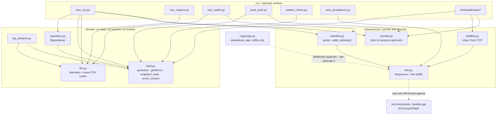
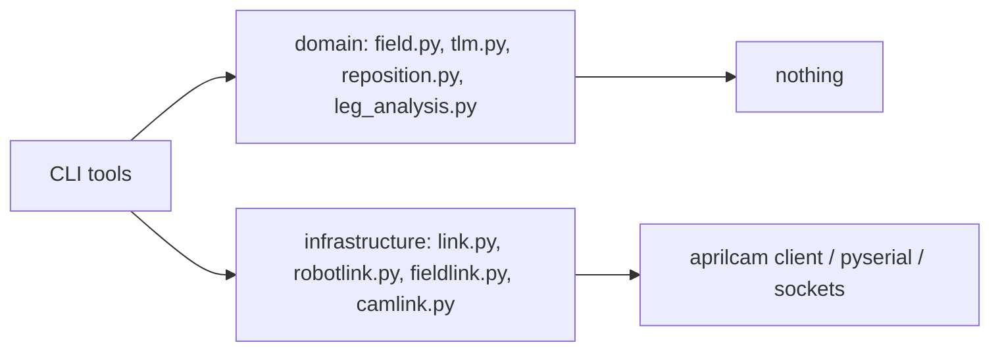

<!-- CLASI: Before changing code or making plans, review the SE process in CLAUDE.md -->

# Sprint 034: Bench tools: verbs, geofence, schemas, consolidation

## Goals

Drift-test `robotlink.py`'s `_V6_VERBS` table against the firmware's
own verb table so a `MOVE_X` sent through `Link` can no longer be
silently dropped for lacking a sequence id (the table currently names
non-firmware verb spellings and omits `MOVE_X`/`MOVE_V`/`GO_TO_R`
entirely). Wire the existing but zero-caller geofence (`field.py`) into
every tool that commands motion (`tour_run.place()`,
`Repositioner.go()`, `tour_closedloop`), and unify the two different
field sizes currently in play. Collapse the three incompatible pose-CSV
schemas (`tour_capture`/`tour_watch`/`tour_practice`) into one, with a
header line the reader keys on instead of guessing by column count.
Fix the four analysis bugs the review found: `total_turn()`'s inability
to resolve a ±180° pivot that over-rotates, `score_corners()`'s
whole-run search that can starve later corners, a heading-only miss
mislabeled as overrun/truncation, and a printed conclusion still scaled
by the retired `rotationScrub` constant. Consolidate the tools that
have accreted duplicate implementations: import aprilcam in-process
(dropping `camproc.py`'s subprocess-into-a-second-venv, whose premise —
a separate venv requirement — no longer holds), one `wrap()` instead of
four, one link layer instead of four (with three relay addresses and
two sequence-id schemes), one repositioning loop, deletion of dead
tools kept "for reference" but still executable against a stale relay
address, and a `tools/DESIGN.md` truth pass (it currently omits 11 of
30 tools). Close the host-harness gaps the baseline run surfaced: the
`tsc` gate should skip with a reason instead of failing red when
`node_modules` is absent, `run_tour.py`'s travelCalib mirror should be
pinned, ruff should be gated in CI, `motion_lib` compiles should be
session-scoped instead of recompiled eleven times per session, and the
seven `pxt.h`-bound translation units compiled by nothing should either
get a `pxt.h` stub or a documented reason they don't.

## Problem

`tools/robotlink.py:120-123`'s `_V6_VERBS` names `MOVE/PIVOT/GO_TO/ARC`
— not the firmware's actual verb spellings — and omits
`MOVE_X`/`MOVE_V`/`GO_TO_R` outright; a `MOVE_X` sent through `Link`
gets no `#id` attached and is silently dropped by the robot, the exact
failure mode `.claude/rules/mcp-required.md`-adjacent bench rules exist
to prevent (a command that appears sent but never executes). The
geofence from a prior review (08-26 D-08) exists with zero callers;
`tour_run.place()`, `Repositioner.go()`, and `tour_closedloop` all
drive unchecked, and a second, different field size lives hard-coded in
a test file. Three different pose-CSV schemas (mm/centidegree vs
cm/degree) coexist across three capture tools, and `tour_chart.py`
picks a reader by counting columns — a `tour_watch` CSV silently plots
10× too small with no error raised. `total_turn()`'s `round(0.5) = 0`
means a 183° physical pivot reads as −177°, flipping the accuracy
ratio's sign. `score_corners()`'s first-corner search spans the whole
run and can starve every corner after it. A heading-only miss gets
mislabeled by the sign of a sub-tolerance distance error.
`rotation_check.py` still scales its printed conclusion by
`rotationScrub 1.040`, a retired constant. On the consolidation side:
08-26's Q-06/Q-09 findings that justified `camproc.py`'s subprocess
shape are gone now that `aprilcam[daemon]` is a direct dependency of
this venv; four `wrap()` implementations disagree on boundary
semantics; the link layer is written four times with three different
relay addresses and two sequence-id implementations, one of which
documents an ordering bug the other still has; `truth_check.py` is dead
on arrival (v1 JSON keys against a hard-coded port) and duplicates
`pivot_truth.py`; five reference-only tools remain executable against a
stale relay address; `tools/DESIGN.md` is missing over a third of the
tool inventory. On the harness side, the baseline run for this review
was 922 passed / 1 failed, and the failure is an environment
precondition (`tsc` absent) surfacing as a red test rather than a skip.

## Solution

Generate or drift-test `_V6_VERBS` against the firmware's
`kCommandTable` so the two can't silently diverge again. Add one
`check_path()` call to every tool that commands motion, and unify on
one field size (deleting the test file's private copy). Define one
pose-CSV schema with an explicit header line the reader keys on
instead of inferring from column count; migrate the three capture
tools to write it. Fix `total_turn()` to unwrap using the commanded
sign as a prior instead of `round()`'s ambiguity at exactly 180°; give
`score_corners()` a per-corner time or arc-length search window instead
of the whole run; add a heading-miss classification distinct from
overrun/truncation; delete the `rotationScrub` scaling. Import aprilcam
in-process and delete `camlink`/`camproc`'s subprocess shape and the
second `Cam` class; consolidate to one `wrap()` in `field.py`, one
`Link`, one repositioner; delete `truth_check.py` and the five
reference-only tools (git history keeps them if ever needed); rewrite
`tools/DESIGN.md` as a true inventory of what exists. For the harness:
`pytest.skip` with a reason (and install instructions) when `tsc` is
absent; pin the `run_tour.py` travelCalib mirror against its source of
truth; add a `[tool.ruff]` gate to CI; session-scope the `motion_lib`
compile fixture; either compile the seven uncovered translation units
against a `pxt.h` stub or record in `tests/DESIGN.md` why they're
excluded.

## Success Criteria

- A drift test fails if `_V6_VERBS` and the firmware's verb table
  diverge; a `MOVE_X` through `Link` carries a sequence id.
- Every tool that commands motion calls `check_path()` against one
  field size; the test file's private field-size copy is gone.
- One pose-CSV schema with a header line; `tour_chart.py` no longer
  guesses by column count.
- Unit tests on synthetic runs for each analysis fix: `total_turn()`
  resolves a >180° over-rotating pivot correctly; `score_corners()`'s
  window doesn't starve later corners; a heading-only miss is labeled
  distinctly; the retired-constant print is gone.
- `camproc.py`'s subprocess shape and the second `Cam` class are
  deleted; one `wrap()`, one `Link`, one repositioner remain;
  `tools/DESIGN.md` inventories all tools that exist.
- `uv run pytest -q` shows the `tsc` test skipping with a reason (not
  failing) when `node_modules` is absent, and passing when present.

## Scope

### In Scope

- `tools/robotlink.py` verb table and its drift test.
- `tools/field.py`'s geofence wiring into `tour_run.py`,
  `Repositioner`, `tour_closedloop`, and the field-size unification.
- The pose-CSV schema unification across `tour_capture.py`,
  `tour_watch.py`, `tour_practice.py`, `tour_chart.py`.
- `rotation_check.py`, `truth_check.py` (deleted here, not just fixed),
  `field.py`'s `score_corners()`, `leg_analysis.py`.
- The in-process aprilcam consolidation (`camlink.py`, `camproc.py`),
  `wrap()`/`Link`/repositioner consolidation, dead-tool deletion,
  `tools/DESIGN.md`.
- Host harness: `test_typescript_typecheck.py`, `run_tour.py`'s
  travelCalib mirror, ruff CI gate, `motion_lib` fixture scope, the
  seven uncovered translation units.

### Out of Scope

- Everything in sprints A (motion profile — including the two specific
  camlink/robotlink stale-constant fixes already done there as bench-
  acceptance prerequisites; this sprint's `robotlink.py` verb-table
  work and camlink consolidation build on top of that, not instead of
  it), B (bus/fiber safety), C (test program/blocks/simulator), D
  (odometry, config descriptor table, Protocol diet), and F (comment
  work order).
- Any further calibration-constant fixes beyond what's already landed
  in sprint A.

## Related Issues

- [`code-review/tools-v6-verbs-geofence-pose-csv-schema.md`](../../issues/code-review/tools-v6-verbs-geofence-pose-csv-schema.md)
- [`code-review/analysis-fixes-total-turn-score-corners-leg-analysis.md`](../../issues/code-review/analysis-fixes-total-turn-score-corners-leg-analysis.md)
- [`code-review/tools-consolidation-inprocess-aprilcam-wrap-link-layer.md`](../../issues/code-review/tools-consolidation-inprocess-aprilcam-wrap-link-layer.md)
- [`code-review/host-harness-gaps.md`](../../issues/code-review/host-harness-gaps.md)

## Test Strategy

**Every ticket in this sprint is verifiable host-side, with no robot and
no camera.** That is a hard constraint, not a preference: this sprint is
planned to be executed overnight by programmer agents with no bench
session. Concretely, each ticket's tests are one or more of:

- **pytest under `tests/tools/`** — the natural home for anything that
  pins a `tools/*.py` module. Injected fakes are the established shape
  here (`camlink.Cam(client=...)`, `test_turn_calibration_gates.py`'s
  `_FakeLink`); use them rather than reaching for a socket.
- **pytest under `tests/host/`** — for the drift tests that read
  firmware source as text (`test_wire_constants_drift.py` is the
  precedent) and for the compile fixtures.
- **Synthetic runs** — the analysis fixes are pure functions over
  sample rows. Build the row list in the test; do not require a capture.
- **Recorded CSVs** — the pose-CSV codec is pinned against small
  fixture files written by the test itself, one per legacy schema, so a
  reader that guesses is caught.

**Scope the run, foreground.** Per `.claude/rules/source-code.md`, each
ticket runs the tests for the modules it touches (e.g. `uv run pytest
tests/tools/test_field.py -q`), in the foreground, never
`run_in_background`. The full suite runs once, inside `close_sprint`.

**Line numbers in the issues are from 2026-09-02 and have moved.** Every
ticket restates this. Re-anchor by content — grep for the symbol or the
literal string named in the finding, never `sed -n` on the cited line
range. Several of the review's own citations are already stale in this
tree: `_V6_VERBS` is at `robotlink.py:183`, not `:120`; `score_corners`
is at `field.py:191`, not `:123`; `test_run_tour_programs.py`'s private
field size is at `:247`, not `:171`.

**What this sprint cannot prove without hardware** is named once, in
ticket 013, and deferred there rather than buried inside a software
ticket.

## Architecture

**Sizing: Substantial / structural.** Three signals, any one of which
would be sufficient: (1) more than three modules change — `field.py`,
`tlm.py`, `robotlink.py`, `camlink.py`/`camproc.py`, `reposition.py`,
`leg_analysis.py`, plus a new `tools/link.py` and a new
`tests/host/conftest.py`; (2) the data model changes — the pose CSV
gets one schema and a header contract where three incompatible ones
exist today; (3) a dependency changes direction — `camproc.py`'s
subprocess-into-a-second-interpreter boundary is removed and aprilcam
becomes an ordinary in-process import, and a new shared `tools/link.py`
inverts four hand-rolled carriers onto one sequencer.

### Corrections to the roadmap text above

The Goals / Problem / Solution / Scope sections above were written on
2026-09-03 and are kept verbatim as the brief. Four of their factual
claims have moved since, and the tickets follow the corrected version:

- **"seven `pxt.h`-bound translation units"** — eight today.
  `src/comms/wifi_uart.cpp` landed with the WiFi transport. Verified
  2026-09-06 by compiling the `#include "pxt.h"` list under `src/`.
- **"recompiled eleven times per session"** — thirteen today
  (`grep -rl 'def motion_lib' tests/host/`, 2026-09-06).
- **"11 of 30 tools missing from `tools/DESIGN.md`"** — the tree has
  changed shape: `tests/playfield/` no longer exists (sprint 031 moved
  its programs to `tests/calibration/`), `tools/field_dance.py` is now
  a shim, and `tools/gen_config_field_enum.py`, `tools/wifilink.py`,
  `tools/rogo/` and `tools/linefollow/` have arrived. Ticket 012
  re-counts against the tree it finds; do not plan against "11 of 30".
- **"five reference-only tools"** — only three whole files are
  defensibly dead (`truth_check.py`, `tour_square.py`,
  `tour_closedloop.py`), plus `camproc.py`, which ticket 008 deletes
  for a different reason. `tour_practice.py` and `practice_chart.py`
  are live; only the dead blocks *inside* them go. Ticket 003 names
  every path explicitly.
- **"still executable against a stale relay address"** — no longer
  true. TL-01 was fixed before this sprint: `robotlink.py` now derives
  the relay pair with `radio_address(robot)` and the
  `ZAVAZ_CHANNEL`/`ZAVAZ_GROUP` constants are gone. The dead tools are
  still worth deleting; that particular hazard is not the reason.

Two items the roadmap implies and this sprint does **not** need to do,
both verified 2026-09-06:

- **No tool carries a wire error-code lookup table**, so nothing needs
  to learn sprint 033's new code 12. `tools/wire_acceptance.py` already
  asserts `err 12` for `GET rebase` (its `:334-340` block); every other
  match on `err` in `tools/` is a literal string check in that same
  file. No ticket covers this.
- **`wire_get()`'s staleness was fixed 2026-09-05** and the program
  moved under `tests/calibration/`. Not re-planned here.

### Sprint Changes

#### Step 2 — responsibilities this sprint moves

Seven responsibilities are currently duplicated, unowned, or owned by
the wrong module:

| responsibility | today | after |
|---|---|---|
| which verbs the wire sequences | a hand-typed set in `robotlink.py` that does not match the firmware | derived from `src/comms/wire_handler.cpp`'s `kCommandTable`, pinned by a drift test |
| allocating and re-using sequence ids | four implementations (`robotlink.Link`, `fieldlink._SequencedLink`, `wire_acceptance`'s link family, `tests/calibration/turn_calibration.Link`) | one `Sequencer` in `tools/link.py` |
| choosing a relay address | three (`fieldlink` host `torture`; `wire_acceptance.RadioLink` host `192.168.1.12` with **group hard-coded to 10**; `robotlink.radio_address()` derived from the robot name) | one — `robotlink.radio_address(robot)`, already correct |
| the on-disk pose sample format | three writers, one reader that guesses by column count | one codec in `tlm.py`, header-keyed |
| reading the overhead camera | two `Cam` classes across a process boundary | one `Cam` in `camlink.py`, in-process |
| the playfield's size and margin | two (`field.py` 134.3 x 89.3 cm / 12 cm; `test_run_tour_programs.py` 120 x 80 cm / 5 cm) | one, in `field.py` |
| placing the robot before a run | two loops, one carrying the ordering bug the other documents | one `Repositioner` |

#### Step 3 — modules, each with one sentence and a boundary

- **`tools/link.py` (new)** — owns the sequenced-wire protocol that
  every carrier shares.
  *Inside*: id allocation, resend-with-the-same-id, `ack`/`nack`/`err`
  parsing, line reassembly, the sequenced/unsequenced verb split.
  *Outside*: how a socket or a serial port is opened (each carrier
  keeps its own small transport class), discovery, and every CLI.
  Serves SUC-001, SUC-004.
- **`tools/tlm.py`'s pose-CSV codec (changed)** — owns the on-disk pose
  sample format. *Inside*: the header names, the wire units, the
  writer, and a reader that binds by header name and refuses a header
  it does not know. *Outside*: what the samples mean — that is
  `leg_analysis.py` and `tour_chart.py`. Serves SUC-003.
- **`tools/camlink.py`'s `Cam` (changed)** — owns in-process access to
  the aprilcam daemon's tag stream. *Inside*: connect, register a mount
  from `field_calibration.json`, yield one dict per real frame, raise
  `CamDown` when the daemon goes. *Outside*: pose arithmetic (that is
  `field.pose_from_registered_samples()`), and any notion of a
  subprocess. Serves SUC-005.
- **`tools/field.py` (changed)** — remains the one owner of playfield
  geometry and of the angle math the scorers need. *Inside*: `LIMITS`,
  `MARGIN`, the derived usable extent, `check_path`, `clears_margin`,
  `wrap`, the new `turn_total`, `score_corners`,
  `pose_from_registered_samples`. *Outside*: anything that talks to a
  robot or a camera — `field.py` imports neither and must keep not
  importing them, which is what lets `tests/calibration/*` and
  `tests/host/*` both import it. Serves SUC-002, SUC-006.
- **`tools/reposition.py`'s `Repositioner` (changed)** — owns the
  pre-run placement loop. *Inside*: position-first-then-heading
  ordering, tolerances, retry count, and a `check_path` refusal.
  *Outside*: who decides where to place the robot. Serves SUC-002.
- **`tests/host/conftest.py` (new)** — owns the one session-scoped
  compile of the motion-engine shared library. *Inside*: the fixture and
  its source list. *Outside*: every test's own assertions. Serves
  SUC-007.

#### Step 4 — diagrams

A component diagram **is** warranted here (unlike sprint 020's
independent-bugfix shape): this sprint composes genuinely new things —
one link layer under four carriers, one codec between the capture tools
and the analysis tools, one camera class where a process boundary used
to be. Two diagrams follow; there is no entity-relationship diagram
because the only data-model change is a flat CSV schema, which the
table in "Migration Concerns" states directly and which an ERD would
obscure rather than clarify.

**Component diagram — the tools subsystem after this sprint.**

**Dependency graph — the direction that must hold.**

The invariant this sprint must not break: **the domain box has no
outward edges.** `field.py` and `tlm.py` import neither `pyserial` nor
`aprilcam` nor `socket` today, and that is precisely why
`tests/calibration/turn_calibration.py` and
`tests/host/test_run_tour_programs.py` can both import `field.py` on a
machine with no robot attached. Ticket 007 must wire the geofence by
having the *planners* call `field.check_path()`, never by having
`field.py` learn about a link. There are no cycles in either graph.

### What Changed

1. **`_V6_VERBS` is derived, not typed** (ticket 005). The firmware's
   `kCommandTable` (18 entries) minus its seven unsequenced verbs
   (`HELLO PING ID VER STATUS HELP ESTOP`) is the sequenced set. A
   text-reading drift test in `tests/host/` fails when the two diverge.
2. **One sequencer** (ticket 006). `tools/link.py` holds the
   `Sequencer` and the line buffer; `robotlink.Link`,
   `fieldlink._SequencedLink`, `wire_acceptance`'s TCP relay links and
   `tests/calibration/turn_calibration.Link` use it. Relay addresses
   come from `robotlink.radio_address(robot)`; `RadioLink`'s hard-coded
   group 10 goes.
3. **One pose-CSV schema** (ticket 004). `tlm.write_pose_csv()` /
   `tlm.read_pose_csv()`; wire units (mm, centidegrees, mm/s) with the
   wire's own column names, matching how `tlm.py` already binds
   telemetry columns by name from the last `thdr`.
4. **The geofence becomes a gate** (ticket 007). `check_path()` in
   `Repositioner.go()`, `tour_run.place()`, and every surviving planner;
   `clears_margin()` in the recorders' score line. One field size, in
   `field.py`.
5. **One camera class, in-process** (ticket 008). `camproc.py` is
   deleted; `camlink.Cam` grows a thread-backed `latest`/`fix()` so its
   existing consumers keep their interface.
6. **Analysis is correct** (tickets 001, 002). `field.turn_total()`
   anchors on the commanded angle; `score_corners()` searches a
   per-corner window; `leg_analysis` gains a `HEADING_MISS` class; the
   retired-`rotationScrub` print goes.
7. **The harness reports honestly** (tickets 010, 011). The `tsc` gate
   skips with a reason; `ruff` is gated; the third `travelCalib` copy is
   pinned; one `conftest.py` replaces thirteen identical fixtures.
8. **Dead code is gone** (ticket 003) and **`tools/DESIGN.md` is an
   inventory** (ticket 012).

### Why

Each of these is one failure mode: **a tool that reports success while
doing nothing, or reports failure while nothing is wrong.** That is the
same class this repo's rules exist to catch — `.claude/rules/
playfield-testing.md`'s "the robot is OFF" section, `.claude/rules/
measurement-citations.md`'s fabricated-measurement episode. A `MOVE_X`
that gets no `#id` is silently dropped and the odometry still reports
travel. A `tour_watch` CSV plotted by a column-count guess draws a
confident closure figure ten times too small. A red `tsc` test in a
fresh worktree teaches the next agent that a red suite is normal. None
of these announce themselves.

### Impact on Existing Components

- **`tests/calibration/*`** import `tools/field.py` and
  `tools/fieldlink.py` today (`turn_calibration.py:116`,
  `field_dance.py:37-41`). Tickets 006 and 009 change both; the
  calibration programs must keep working and
  `tests/calibration/test_turn_calibration_gates.py` must stay green.
- **`tools/rogo/`** is a standalone, stdlib-only, pipx-installable CLI
  with its own `pyproject.toml`, `DESIGN.md`, and
  `tests/tools/test_rogo.py`. It **must not** gain an import of
  `tools/link.py` — that would break `pipx install` from this checkout.
- **`field.pose_from_registered_samples()`** must keep its exact
  semantics through ticket 008: a *registered* sample's `yaw_rad` is
  the robot's heading already, and must NOT be run through
  `robot_heading_from_tag_yaw()`. Adding the +90 deg convention twice is
  the bug that produced sprint 029's consistent +87/+91/+86 deg bearing
  errors (`.claude/rules/tag-yaw-is-the-front-edge-not-the-hat.md`,
  "Registered vs raw").
- **`tests/tools/test_camproc.py`** and four `truth_check` tests in
  `tests/tools/test_run_verbs.py` are deleted with their subjects.
- **Firmware is not touched.** Ticket 005 reads
  `src/comms/wire_handler.cpp` as text; it does not modify it.

### Migration Concerns

**The pose-CSV schema is a breaking format change for recorded
captures.** Three writers become one:

| writer, today | header today | after |
|---|---|---|
| `tour_capture.py:133` | `t_host,t_dev_ms,x_mm,y_mm,h_cdeg,ox_mm,oy_mm,oh_cdeg` | unchanged — this is the surviving schema |
| `tour_watch.py:219` | `t,dev_ms,enc_x_cm,...,otos_h_deg` (cm/deg) | writes the wire-unit header |
| `tour_practice.py:148` | `t,enc_x,...,dev_ms,vl_mms,vr_mms` | writes the wire-unit header |

`tour_capture.py`'s header wins because it is already in wire units,
already the only one `leg_analysis.py` reads, and already what
`tour_chart.py` assumes throughout. **Existing CSVs under `captures/`
are not migrated** — the reader must recognise each legacy header by
name and either convert it or refuse it with a message naming the file
and the schema, never silently mis-scale it. Which of convert-or-refuse
is ticket 004's call; refusing with a clear message satisfies the
success criterion.

**The field-size unification tightens the y limit.** `field.py`'s
`LIMITS - MARGIN` is `(55.15, 32.65)` cm of half-extent;
`test_run_tour_programs.py`'s private pair is `(55.0, 35.0)`. x agrees
to 1.5 mm; **y is 2.35 cm tighter** under `field.py`. A `.tour` figure
that passes today may therefore fail after unification. That is a
finding about the tour, not a reason to loosen the margin — see Open
Question 1.

**`tests/DESIGN.md` is not in this sprint's design overlay.**
`seed_sprint_design_overlay` derives an overlay slug relative to the
nearest `project.sources` root, so `tools/DESIGN.md` and
`tests/DESIGN.md` both derive `DESIGN.md` and the second silently
overwrote the first. The overlay was re-seeded with `tools/DESIGN.md`
holding that slug (it is the doc a whole ticket rewrites) and
`tests/DESIGN.md` left out. Ticket 011 edits `tests/DESIGN.md`
canonically; **the team-lead must sync it by hand at close** rather
than trusting the overlay to cover it.

### Design Rationale

**1. Drift-test `_V6_VERBS`, do not generate it.**
*Context*: sprint 033 set the house precedent for a C++ table feeding a
non-C++ consumer — `tools/gen_config_field_enum.py` generates
`ConfigField` from `src/comms/config_fields.h`, and a test regenerates
and compares. *Alternatives*: (a) generate a Python module the same
way; (b) parse `wire_handler.cpp` at import time; (c) keep the literal
set and add a drift test. *Choice*: (c). Generation earns its keep when
the consumer is a *dropdown with labels* that a human cannot derive —
`ConfigField` has 30-plus rows with block labels. The verb set is 11
strings a reader should be able to see in the file. (b) makes every
tool's import depend on a C++ file parsing correctly, on machines that
may not have `src/` (rogo's users). *Consequences*: the literal set
stays readable; a firmware verb rename fails a host test rather than
silently dropping a command.

**2. `field.py` owns the one field size; the tour test imports it.**
*Context*: two definitions, both "enforced", differing by 2.35 cm in y.
*Alternatives*: (a) keep both, document the difference; (b) move
`test_run_tour_programs.py`'s numbers into `field.py` as a second named
constant; (c) one physical field plus margin, with the usable extent
derived. *Choice*: (c). `.claude/rules/playfield-testing.md` states the
physical field (134.3 x 89.3 cm, AprilTag-1-centred) and the 12 cm
margin as measured facts about the room; the 120 x 80 cm figure is a
*derived* operating envelope that happens to agree to 1.5 mm in x. A
derived number should be derived. *Consequences*: one number to change
when the field moves; and one tour may need re-sizing (Open Question 1).

**3. `tools/rogo/` stays a deliberate duplicate.**
*Context*: "one link layer" would naively swallow rogo too.
*Alternatives*: (a) rogo imports `tools/link.py`; (b) `tools/link.py`
is packaged so rogo can depend on it; (c) rogo stays standalone, and a
drift test pins any constant it shares. *Choice*: (c). rogo's whole
premise, stated in its own `DESIGN.md`, is "nothing installed but
Python" — it is stdlib-only and pipx-installable straight from git. (a)
breaks that outright; (b) adds a published package to maintain for one
consumer. *Consequences*: rogo's copy is intentional and must be
labelled as such in both `DESIGN.md`s, so the next review does not
re-file it as a duplicate.

**4. Delete `truth_check.py` rather than retarget it.**
*Context*: it shells out five subprocesses per fix against a hard-coded
port and reads v1 JSON keys the v2 client no longer emits; retargeting
it onto `camlink.Cam` produces `pivot_truth.py`. *Consequences*: four
tests in `test_run_verbs.py` go with it; git history keeps the file.

**5. One `Cam`, with a thread where the process boundary was.**
*Context*: `camproc.Cam`'s subprocess exists solely to bridge two
interpreters. `pyproject.toml` now declares `aprilcam[daemon]` as a
direct, editable dependency of this venv, so there is one interpreter.
*Alternatives*: (a) minimal — set `venv = sys.executable`, keep the
subprocess; (b) fold `camlink.Cam.frames()` into a thread inside one
`Cam`. *Choice*: (b). (a) keeps a line protocol, a reader thread, a
respawn path and an `ERR` vocabulary to bridge nothing. *Consequences*:
`camproc.Cam`'s consumers (`tour_run`, `pivot_truth`, `turn_sweep`,
`reposition`, `tour_watch`) must keep working against the same
`latest`/`fix()`/`deaths` surface, so ticket 008 preserves that
interface rather than redesigning it.

**6. Dead-tool deletion runs early (ticket 003), not last.**
*Context*: the team-lead's ordering guidance put deletion last "so it
describes the final state". *Why changed*: that reason applies to the
`DESIGN.md` truth pass, which does stay last. Deletion last would have
tickets 004, 006 and 008 migrate `tour_square.py`, `tour_closedloop.py`
and `truth_check.py` onto the new CSV codec, the new `Link` and the new
`Cam` — three files' worth of work thrown away, plus three chances to
introduce a conflict. Deleting first is strictly less work and less
risk. *Consequences*: ticket 003 must be careful, because nothing
downstream re-checks it; hence its explicit grep sweep across `tests/`,
`tools/`, `docs/`, `.claude/rules/` and `clasi/`.

**7. The `pxt.h`-bound translation units get a decision, not an
investigation.** *Context*: eight `.cpp` files under `src/` include
`pxt.h` (the review said seven; `src/comms/wifi_uart.cpp` has landed
since) and are compiled by nothing on the host. *Choice*: ticket 011 is
a decision ticket with the criteria written down in advance, and it may
legitimately conclude "documented exclusion". A stub `pxt.h` that
compiles but models nothing would create the worst outcome available: a
green gate that proves less than `test_include_paths_match_target.py`
already proves.

**8. The pose-CSV codec lives in `tlm.py`, not a new module.**
*Context*: `tlm.py` already owns the telemetry-frame parser, so adding
the pose codec gives it two formats. *Alternatives*: (a) a new
`tools/posecsv.py`; (b) put it in `tlm.py`. *Choice*: (b). The two are
one concern stated once: **this repo's on-disk sample formats, all bound
by column name.** `tlm.py` binds telemetry columns by name from the last
`thdr` precisely so a shape change is handled, and the pose CSV's whole
defect is that it regressed to positions — the fix belongs beside the
thing that already does it right, and its `write_tlm_csv` /
`read_meta_sidecar` fail-loud trio is the shape to copy. *Consequences*:
`tlm.py` grows; if it later grows a third format, split it then. Every
consumer already imports `tlm`, so no new dependency edge appears.

**9. `field.py` stays one module, deliberately.**
*Context*: `field.py` will hold `LIMITS`/`MARGIN`/`check_path`/
`clears_margin`/`wrap`/`turn_total`/`score_corners`/`closure`/
`path_deviation`/`pose_from_registered_samples` — enough surface to
read as a god module. *Why it is not*: every one of those is pure
geometry over field coordinates with no I/O, and they all change for
the same reason — the field moved, or the pose convention changed. It
passes the cohesion test as "the field's geometry and the angle math
that reads it". *Why not split*: `field.py` importing nothing is the
property that lets `tests/calibration/turn_calibration.py`,
`tests/host/test_run_tour_programs.py` and every `tools/` CLI import it
on a machine with no robot. Splitting it into `geometry.py` +
`scoring.py` would multiply that import surface for no reduction in
coupling. *Consequences*: recorded here so the next review sees a
decision rather than drift. The invariant to hold: **nothing that does
I/O goes into `field.py`.**

### Open Questions

1. **Does any `.tour` figure fail the tighter y limit?** Ticket 007
   must run `tests/host/test_run_tour_programs.py` after unification.
   *Decision rule, stated in advance*: if a tour fails, the tour is
   re-sized or added to `_UNSIZED` **with a written reason**; the margin
   is not loosened and `field.py`'s numbers are not changed. If more
   than one tour fails, stop and throw a ticket exception — that would
   mean the 120 x 80 cm envelope was not conservative and the
   stakeholder's 2026-09-01 direction needs revisiting.
   **Resolved (as-built):** ZERO tours failed the tighter y limit
   (ticket 007) — every sized `.tour` and referenced spline path fit
   under 551.5 x 326.5 mm half-extent; no re-size, no `_UNSIZED`
   addition, no exception thrown.
2. **Does `wire_acceptance.RadioLink`'s hard-coded group 10 have a live
   user who depends on it?** It cannot be right — the fleet table has
   groups 43, 60, 108, 114. Ticket 006 replaces it with
   `robotlink.radio_address(robot)`. Flagged so a reviewer notices the
   behaviour change rather than reading it as a refactor.
   **Resolved (as-built):** replaced as planned (ticket 006). This is a
   real behaviour change, not a refactor: `--radio` now takes a robot
   NAME instead of a channel int, and the host moved from the bare IP
   `192.168.1.12` to `torture`; an old `--radio 4` invocation now fails
   loudly instead of silently tuning to 4/10.
3. **`tests/DESIGN.md` is outside the design overlay** (see Migration
   Concerns). Team-lead action at close, not a programmer's.
   **Resolved (as-built):** `tests/DESIGN.md` was edited canonically by
   tickets 011 and 012 (the pxt.h-exclusion table and the design-doc
   truth pass); the team-lead synced it into the design overlay by hand
   at close, as flagged.

### Revision (as-built, 2026-09-06)

The twelve software tickets (001-012) closed as planned; ticket 013
(optional, hardware) has its host half landed and its on-robot half
deferred. This subsection records where implementation deviated from
or sharpened the plan above; the Architecture prose above is kept as
written. Per-ticket detail lives in each ticket's Implementation
record / Decision record under `tickets/done/`.

- **Ticket 001** — `field.turn_total(commanded, measured)` landed with
  unit-free parameter names, per `.claude/rules/no-units-in-identifiers.md`
  (the plan's own acceptance criteria used `_deg`-suffixed language
  informally). `pivot_truth.py` additionally grew a `gyro_over_camera()`
  helper and a `NO_ROTATION = 0.5 # [deg]` threshold — a chosen
  constant, not a measured one — to guard the "camera saw no rotation"
  case. `rotation_check.py`'s module docstring was rewritten (not just
  the print deleted) so the guard reads as current rather than
  retired-but-annotated.
- **Ticket 002** — the bounded-window remedy used
  `CORNER_WINDOW_RADIUS = 15.0 # [cm]` (the review's own suggested
  figure), searched from `used + 1`; `used = besti + 1` closes the
  double-claim gap named in the issue. `leg_analysis.HEADING_MISS` was
  added as a class constant; since nothing enumerates the classification
  set exhaustively, no `else` branch needed updating to avoid a silent
  fallthrough.
- **Ticket 003** — three whole files were deleted, not the roadmap's
  original "five reference-only tools" figure (already corrected above,
  under "Corrections to the roadmap text"): `truth_check.py`,
  `tour_square.py`, `tour_closedloop.py`. Dead blocks were removed from
  `tour_watch.py` (the whole second chart subplot went, not just the
  `vel` list), `tour_practice.py`, and `practice_chart.py` (the
  duplicate `TRACK_CM` now has no owner at all). `camlink.py`'s `--hz`
  argument was removed here — and, as a forced consequence, `camproc.py`'s
  matching `hz` plumbing was removed early in this ticket rather than
  waiting for ticket 008, because leaving it would have made every
  `Cam()` spawn a `camlink.py` that rejected an unrecognised argument.
  New guard: `tests/tools/test_deleted_tools_stay_deleted.py`. The
  sweep found and reported (but did not touch) a stale worktree,
  `.claude/worktrees/sprint-20-work-tree-8741c7/`.
- **Ticket 004** — `tlm.py` gained `POSE_CSV_COLUMNS`,
  `write_pose_csv(rows, path, wheels=False)`, `read_pose_csv(path) ->
  (rows, schema)` and `PoseCsvSchemaError`. The convert-or-refuse
  question (left open by the ticket) resolved to **convert** every
  legacy header this repo's own tools actually wrote — `tour_watch`
  (cm/deg), `tour_practice` with and without the wheel pair including
  the older `vl_cms` spelling, and a wire-unit variant with unsuffixed
  OTOS columns found in seven `captures/` files that the ticket's own
  table did not list — and **refuse** everything else by name. Of 35
  pose CSVs surveyed under `captures/` and `.tmp/`, 23 read (every one
  under `captures/`) and 12 were refused, all 12 `.tmp/` scratch files
  missing a required column. `--meta`'s `start_world_cm[2]` is
  documented and converted as degrees.
- **Ticket 005** — `_V6_VERBS` stayed a literal in `robotlink.py`, per
  Design Rationale 1 above (11 sequenced verbs). The drift test
  (`tests/host/test_wire_constants_drift.py`, new section 11) parses
  the firmware's `kCommandTable` (18 rows) and the seven unsequenced
  early-return verbs structurally out of the source, pins that parse
  against the literal as a second, independent check, and cross-checks
  the firmware's own `static_assert(... == 18)`.
- **Ticket 006** — `tools/link.py`'s surface is `RELAY_HOST`/`RELAY_PORT`,
  `relay_setup_lines()`, `LineBuffer`, `Sequencer`. The relay-setup
  disagreement named in the Architecture prose was settled toward
  **all four lines** (`!ECHO OFF`/`!MODE RAW250`/`!CG`/`!P 7`) on
  **every** relay carrier, because the relay persists its configuration
  across resets and `!ECHO` is a radio transponder, not terminal echo.
  `wire_acceptance.py` adopted `LineBuffer` but deliberately took **no**
  `Sequencer` — its own job is to hand-write ids to probe the
  sequencing contract, which a `Sequencer` would make untestable.
  `GautiLink` and `WifiLink` were left untouched (out of scope; see the
  ticket record for why). Behaviour changes beyond Open Question 2's
  resolution above: `turn_calibration.robot_radio()`'s `radio_group`
  default of 10 was removed (a missing key now raises rather than
  silently defaulting).
- **Ticket 007** — Open Question 1 resolved above (zero failing tours).
  `field.require_clear_path()` / `PathRefused` wraps `check_path()`;
  `Repositioner.check_path()` runs before the seed; `tour_run.main()`
  catches `PathRefused` and abandons the run rather than tracebacking.
  Tools that command only relative motion (`pivot_truth.py`,
  `turn_sweep.py`, `rotation_check.py`, `arc_capture.py`,
  `tour_capture.py`, `otos_levercal.py`, `otos_bench.py`, the
  `linefollow/` and calibration `distance`/`mount`/`lag`/`dance`
  programs) were deliberately left unwired — they carry no coordinate
  to check. `field.usable_half_extent()` (a derived value) replaced
  `test_run_tour_programs.py`'s private `_FIELD_MM`/`_MARGIN_MM` pair.
- **Ticket 008** — the full option (Design Rationale 5) was taken:
  `camlink.Cam(tag=None, cam=CAM, client=None, stream=True, wait=15.0)`
  runs a background reader thread over the existing `frames()`
  generator, publishing `latest`/`fix()`/`samples`/`since()`/`err`/
  `notag`/`lock`/`close()` — the exact surface `camproc.Cam`'s five
  consumers depended on. `deaths`/`respawn` were dropped, not carried
  over (no live reader survived ticket 003's deletions). `test_camproc.py`
  was deleted; its live behavioural pins moved into `test_camlink.py`.
  `fix()`'s docstring was corrected in passing: stale-after is ~10 s at
  the camera's ~4 Hz, not the ~2 s it previously claimed.
- **Ticket 009** — `wrap()`'s boundary convention, `(-180, 180]` with
  the upper end closed, was kept as `field.py`'s existing behaviour, not
  flipped to the modulo idiom's `[-180, 180)` the other three copies
  used — chosen because `turn_total()` needs the commanded sign
  preserved at exactly ±180°. No caller's behaviour changed as a result
  (no float measurement ever lands on exactly 180.0). One real
  doc/code disagreement was found and closed: `leg_analysis._wrap_deg()`'s
  docstring had claimed `(-180, 180]` while its body implemented
  `[-180, 180)`. `otos_levercal.py`'s equivalent `atan2` form was folded
  into the shared `wrap()`. `Repositioner.go()` now carries `place()`'s
  two-phase ordering (position to completion, then heading);
  `tour_run.py` gained `make_repositioner()`, `START`, and
  `report_start_pose()`. Two `place()` behaviours were deliberately
  **not** carried over: its `send_until()` retransmits and its
  `sleep(0.7)` settle (superseded by `fix()`'s multi-sample median,
  which settles longer than the sleep it replaces). The new
  `tests/tools/test_angle_wrap_ownership.py` guard uses `ast` rather
  than a text grep, since several converted files cannot be imported at
  collection time (they open a daemon/serial connection at module
  scope).
- **Ticket 010** — the review's "eleven" `motion_lib` fixtures were
  thirteen on the tree, all textually identical (including
  `velocity_shaper.cpp`, which the review's three-file description
  predates); collapsed into one `tests/host/conftest.py` fixture. Suite
  wall time went from 75.3 s to ~58 s (`uv run pytest tests/host
  tests/tools -q`, measured 2026-09-06). The `tsc` gate now skips with a
  reason naming `npm ci`. The third `travelCalib` copy
  (`tests/system/run_tour.py`) is pinned. The new ruff gate
  (`tests/tools/test_ruff_clean.py`) found and fixed **ten** findings,
  not the review's stale count of five. The repo-wide `F811` silence
  was **narrowed**, not deleted — to `tests/host/**` only, where 115
  legitimate cross-module fixture imports remain (the conftest removal
  was not what the silence existed for). TL-18 (the stale "vevov, ch 4"
  claim) was fixed in the affected tests, `make_deploy.py`,
  `tools/DESIGN.md`, and one comment in `src/comms/radio_transport.h`.
- **Ticket 011** — **Branch B** (documented exclusion) was chosen over
  a stub `pxt.h`, per Design Rationale 7 above. The re-derived list is
  8 pxt.h-bound translation units (`wifi_uart.cpp` having landed since
  the review's count of seven): `protocol.cpp`, `nezha_port.cpp`,
  `otos_port.cpp` (transitively), plus `shims.cpp`, `radio_transport.cpp`,
  `serial_transport.cpp`, `wifi_uart.cpp`, `vfp_guard.cpp` (directly).
  Criterion 4 ("what breaks if we do nothing") was answered concretely,
  not left abstract: two historical breaks in exactly these files
  (`setRxBufferSize`'s `uint8_t` truncation, sprint 004; the five-arg
  `TS9200` shim crash, sprint 015) were caught by neither a real build
  log nor anything a stub could have modelled. The exclusion table lives
  in `tests/DESIGN.md`, guarded by
  `tests/host/test_pxt_bound_exclusion_is_current.py` so a ninth such
  file fails loudly. The `-I src` inconsistency the review flagged was
  **fixed**, not merely recorded: the C++11 gate now compiles production
  sources with no `-I`, matching `compile_shared_lib()` exactly.
- **Ticket 012** — the tree-derived inventory count is **39 entries**
  (38 `*.py` files plus `tools/field_calibration.json`), of which 26
  were already named before this ticket — not the roadmap's stale
  "11 of 30 missing" figure. New completeness guard:
  `tests/tools/test_tools_design_inventory.py` (41 tests). Of the six
  named comment-hygiene replacements, five were applied and #5
  (`camproc.py`'s docstring) was a no-op because ticket 008 had already
  deleted the file. The `otos_bench.py` "silent no-op" paragraph was
  rewritten as a two-program table rather than a corrected sentence,
  because the true answer differs by program: numeric `RUN:<n>` is live
  against `test/testrig.ts` but genuinely a no-op against `test/test.ts`.
  Two additional truth fixes surfaced during verification and were
  corrected in place: `tests/DESIGN.md`'s claim that `uv run pytest`
  collects only `host/` and `tools/` (it also collects
  `tests/calibration/`), and `fieldlink.py`'s unartifacted "66-83%"
  delivery figure, now marked **UNVERIFIED** in the design doc.
- **Ticket 013** — the host half landed
  (`tests/calibration/consolidation_acceptance.py`, registered in
  `calibrate.py` as the `acceptance` subcommand, with 55 host-side
  tests against injected fake links and cameras). The on-robot half is
  **UNVERIFIED**: no board was assigned for the overnight session and
  the ticket's own text says not to run hardware in that batch. Deferred
  to `clasi/issues/bench-acceptance-of-the-sprint-034-consolidated-tools.md`,
  which names the exact commands a future operator runs. Per
  `completes_issue: false` on this ticket, the sprint's linked issues
  archived on tickets 004-009's completion, not on this one.
- **CLASI process notes.** The `tools/DESIGN.md` / `tests/DESIGN.md`
  design-overlay slug collision predicted under Migration Concerns
  materialised exactly as expected: `tests/DESIGN.md` was edited
  canonically (tickets 011, 012) and synced into the overlay by hand at
  close, per Open Question 3's resolution above. Separately, and as
  anticipated under "Two items the roadmap implies and this sprint does
  not need to do": sprint 033's new wire error code 12 needed no tool
  change — `wire_acceptance.py` already asserted `err 12` before this
  sprint, and no other tool carries an error-code lookup table.

## Use Cases

### SUC-001: A motion command sent through the shared link cannot be silently dropped
Parent: UC-004 (bench and diagnostic tooling)

- **Actor**: A programmer or agent driving a robot from a host tool.
- **Preconditions**: A `Link` is open over any carrier.
- **Main Flow**:
  1. The caller sends `MOVE_X 200 0 150 5000`.
  2. The link recognises `MOVE_X` as a firmware-sequenced verb, because
     the sequenced set is derived from the firmware's own verb table.
  3. The line goes out carrying `#<id>`.
  4. A resend of the same logical command reuses that same id.
- **Postconditions**: No sequenced verb ever leaves a host tool without
  an id. A firmware verb rename fails a host test.
- **Acceptance Criteria**:
  - [ ] A drift test fails when `_V6_VERBS` and `kCommandTable` diverge.
  - [ ] A test asserts `MOVE_X`, `MOVE_V` and `GO_TO_R` are formatted
        with an id, and that the seven unsequenced verbs are not.

### SUC-002: No tool commands motion to a point outside the field
Parent: UC-004

- **Actor**: Any host tool that plans a move.
- **Preconditions**: The tool holds a measured current pose.
- **Main Flow**:
  1. The tool computes the projected path from the measured pose.
  2. It calls `field.check_path()` before arming the move.
  3. Offending waypoints are refused with the offending points named.
- **Postconditions**: One field size and one margin exist in the repo.
- **Acceptance Criteria**:
  - [ ] `Repositioner.go()` and every surviving planner call
        `check_path()`; a test proves an out-of-bounds target is refused.
  - [ ] `tests/host/test_run_tour_programs.py` imports its limits from
        `field.py`; `_FIELD_MM`/`_MARGIN_MM` are gone.

### SUC-003: A pose CSV is read by its header, never by its shape
Parent: UC-004

- **Actor**: An analyst charting or scoring a recorded run.
- **Preconditions**: A pose CSV exists on disk.
- **Main Flow**:
  1. The reader reads the header line and binds columns by name.
  2. An unrecognised header is refused, naming the file.
- **Postconditions**: No CSV is ever plotted in the wrong units.
- **Acceptance Criteria**:
  - [ ] One writer and one header-keyed reader in `tlm.py`.
  - [ ] A test feeds a legacy `tour_watch`-schema CSV and asserts it is
        converted or refused — never silently scaled by 10x.

### SUC-004: One sequencer, one relay address
Parent: UC-004

- **Actor**: A programmer adding or fixing a carrier.
- **Main Flow**: A change to the sequencing contract is made in one file.
- **Postconditions**: `tools/rogo/` remains standalone and stdlib-only.
- **Acceptance Criteria**:
  - [ ] `tools/link.py` holds the one `Sequencer`; `robotlink`,
        `fieldlink`, `wire_acceptance` and `turn_calibration` use it.
  - [ ] No relay group is hard-coded; `tests/tools/test_rogo.py` passes
        unchanged and rogo imports nothing from `tools/`.

### SUC-005: The camera is read in this interpreter
Parent: UC-004

- **Actor**: Any tool needing an overhead fix.
- **Main Flow**: The tool constructs one `Cam` and reads it directly.
- **Postconditions**: One `Cam` class; no second venv path; a registered
  sample's `yaw_rad` is still used unchanged.
- **Acceptance Criteria**:
  - [ ] `tools/camproc.py` is deleted; `camlink.Cam` serves its
        consumers' `latest`/`fix()` surface.
  - [ ] `tests/tools/test_field.py::test_pose_from_registered_samples_*`
        still passes and no new caller runs a registered sample through
        `robot_heading_from_tag_yaw()`.

### SUC-006: An analysis verdict says what actually happened
Parent: UC-004

- **Actor**: An analyst reading a scored run.
- **Main Flow**: A 183 deg physical pivot against a 180 deg command
  reports +183, not -177; each corner is scored in its own window; a
  leg that is on-distance but off-heading is labelled a heading miss.
- **Acceptance Criteria**:
  - [ ] Synthetic-run unit tests for each of the three fixes.
  - [ ] No printed conclusion is scaled by `rotationScrub 1.040`.

### SUC-007: A green suite means the code is good, not that the machine is lucky
Parent: UC-005 (host test harness)

- **Actor**: A programmer or agent running the suite in a fresh worktree.
- **Main Flow**: With no `node_modules`, the `tsc` gate skips with a
  reason naming `npm ci`; the rest passes.
- **Acceptance Criteria**:
  - [ ] The `tsc` test skips (not fails) without `node_modules` and
        passes with it.
  - [ ] One `tests/host/conftest.py` `motion_lib` fixture; `ruff` gated;
        the third `travelCalib` copy pinned.

## GitHub Issues

(GitHub issues linked to this sprint's tickets. Format: `owner/repo#N`.)

## Definition of Ready

Before tickets can be created, all of the following must be true:

- [x] Sprint planning document is complete (sprint.md, including its
      Architecture and Use Cases sections)
- [x] Architecture review passed (or skipped, for changes with no
      architectural impact)
- [x] Stakeholder has approved the sprint plan

## Tickets

| # | Title | Depends On | Issue |
|---|-------|------------|-------|
| 001 | One commanded-anchored `turn_total()`, and delete the retired rotationScrub print | — | analysis-fixes |
| 002 | Per-corner `score_corners()` window, and a heading-miss leg class | — | analysis-fixes |
| 003 | Delete the dead tools and dead blocks, with a reference sweep | — | tools-consolidation |
| 004 | One pose-CSV schema: a header-keyed codec in `tlm.py` | 003 | tools-v6-verbs |
| 005 | Derive `_V6_VERBS` from the firmware verb table, with a drift test | — | tools-v6-verbs |
| 006 | One sequencer in `tools/link.py`; one relay address | 003, 005 | tools-consolidation |
| 007 | Wire the geofence into every planner; one field size | 003 | tools-v6-verbs |
| 008 | One in-process `Cam`; delete `camproc.py` | 003 | tools-consolidation |
| 009 | One `wrap()`; one repositioner | 001, 003, 007 | tools-consolidation |
| 010 | Host harness: skip the `tsc` gate with a reason, gate ruff, pin the third travelCalib, one `motion_lib` fixture | — | host-harness-gaps |
| 011 | Decision: stub `pxt.h` or document the exclusion for the uncovered translation units | 010 | host-harness-gaps |
| 012 | `tools/DESIGN.md` truth pass and the co-located design docs | 004, 005, 006, 007, 008, 009, 010, 011 | tools-consolidation |
| 013 | **OPTIONAL, HARDWARE** — bench acceptance of the consolidated link, camera and geofence | 012 | tools-v6-verbs + tools-consolidation |

Tickets execute serially in the order listed.

**Tickets 001-012 are the sprint.** Every one is verifiable host-side —
pytest under `tests/tools/` or `tests/host/`, synthetic runs, and CSV
fixtures the tests write themselves. None needs a robot, a camera or an
aprilcam daemon. That is a hard constraint of this sprint, not a
preference: it is planned to be executed overnight with no bench
session.

**Ticket 013 is optional, is hardware, and is last.** It carries
`completes_issue: false`, so the issues it references archive on
tickets 004-009 completing rather than waiting on a bench session that
may not happen. It exists so the hardware dependency is named in one
place instead of being buried inside a software ticket.

Issue column, in full:
`analysis-fixes` = `code-review/analysis-fixes-total-turn-score-corners-leg-analysis.md`;
`tools-v6-verbs` = `code-review/tools-v6-verbs-geofence-pose-csv-schema.md`;
`tools-consolidation` = `code-review/tools-consolidation-inprocess-aprilcam-wrap-link-layer.md`;
`host-harness-gaps` = `code-review/host-harness-gaps.md`.

### Use-case coverage

| SUC | Tickets |
|---|---|
| SUC-001 sequenced verbs | 005, 006, 013 |
| SUC-002 geofence | 007, 009, 013 |
| SUC-003 pose CSV | 004 |
| SUC-004 one sequencer / one relay address | 003, 006, 009, 012 |
| SUC-005 in-process camera | 008, 013 |
| SUC-006 analysis verdicts | 001, 002 |
| SUC-007 honest harness | 010, 011 |
