<!-- CLASI: Before changing code or making plans, review the SE process in CLAUDE.md -->

# Sprint 038: Flash-backed WiFi credential store with join-failure diagnostics

## Goals

Move WiFi credentials out of the hex and into flash, as a settable,
walkable list, and give the join state machine enough visibility into
*why* a join failed that a list-walker (and a bench operator) can tell
a wrong password from a slow join or an out-of-range AP.

Concretely (from `clasi/issues/wifi-credentials-live-in-flash-not-in-the-hex.md`,
requirements R1-R6):

- **R1 Report** — over the wire: is a WiFi module fitted, what SSID is
  current/being tried, and whether that entry has a password set — never
  what the password *is*.
- **R2 Set** — credentials can be set on a running robot, no rebuild, no
  reflash.
- **R3 Persist** — credentials survive both a power cycle and a reflash
  of the program, because they live in flash, not in the image.
- **R4 A list** — the store holds multiple `(ssid, password)` entries.
- **R5 Walk it** — on boot the link tries list entries in order until
  one joins, so one image works across the classroom AP and a
  competition AP.
- **R6 Get/set the list** — the whole list is readable and writable in
  one wire exchange, so a host tool can provision a board.

And, sequenced first as the enabling diagnostic (from
`clasi/issues/wifi-join-failure-does-not-say-why.md`): surface the
Ai-WB2 module's `+CWJAP:<code>` instead of discarding it in
`WifiLink::serviceJoin()`'s fall-through to `enterBackoff()`. Without
this, a list-walker burns a full `kJoinTimeout` per wrong entry with no
idea whether the entry was bad or the AP was just slow, and a bench
operator is back to fingerprinting secrets files by hand (as happened
MEASURED gopiv 2026-09-09,
`nezha-robot-template/captures/wifi-calibration-20260909/notes.md`).

**HARD CONSTRAINT — no passphrase ever leaves the board.** A password
must never appear on the wire, in a `DBG:` line, or in a `GET` reply,
in this sprint or any consumer of it. R1/R6 report and transfer whether
a password is SET, never its value. `scripts/redact-wifi-trace.sh` in
`nezha-robot-template` exists because this leaked once already — this
sprint must not reopen that hole in a different shape (e.g. a new
"list" verb that echoes passwords back).

## Problem

Today a robot's WiFi credentials are compile-time only — baked by
`tools/make_deploy.py::_inject_wifi_secrets()` from
`config/wifi_secrets.json`, or set once via `setupWifi()` from a
consumer's gitignored source. Both put the passphrase inside the hex,
which means: a public release (`League-Robotics/nezha-robot-template`)
can never ship working credentials; changing a password means
rebuilding and reflashing every board; and a robot can only ever know
one network. Separately, when a join does fail, the firmware discards
the one signal (`+CWJAP:<code>`) that would say why, so every failure
mode — wrong password, AP out of range, 5 GHz-only SSID, AP down —
presents identically as a climbing `restarts` counter.

## Solution

High-level, to be worked out in Detail Mode architecture:

1. Parse and retain the module's `+CWJAP:<code>` in `WifiLink`, and
   surface it (raw code first — no word mapping until confirmed on
   hardware) so a caller can distinguish a bad credential from a slow
   or absent AP.
2. Design a flash-backed store for a list of `(ssid, password)`
   records, sized for realistic 802.11 lengths (SSID up to 32 octets,
   WPA2 passphrase up to 63) and for more than one entry — CODAL's
   `KeyValueStorage` (16-byte key, 32-byte value, 5 pairs) does not fit
   either constraint. Candidates to weigh in architecture:
   `MicroBitFile`/`MicroBitFileSystem` vs. a dedicated flash page
   written through `MicroBitFlash`/`NRF52FlashManager`.
3. Change `WifiLink`'s join sequencing to walk that list on boot,
   advancing to the next entry on a definitive failure (using the
   `+CWJAP:` code from step 1) rather than only on timeout.
4. Extend the wire protocol (new verb and/or `STATUS`/`GET` fields) for
   R1 (module present / current SSID / password-set) and R6 (get/set
   the whole list), with a passphrase-set boolean standing in for the
   passphrase itself everywhere on the wire.
5. Reconcile `setupWifi()`'s existing late-call refusal
   (`src/comms/protocol.cpp:272-295`) with a store-backed setter — does
   a wire `SET` write flash and take effect next join/reboot, or does
   `WifiLink` grow a supported way to be re-pointed mid-flight? This is
   an architecture decision for Detail Mode, not a detail to improvise
   during ticketing.

## Success Criteria

- A board with an empty credential store behaves exactly as an
  unprovisioned board does today: `kDisabled`, zero module traffic, no
  behavior change (regression guard for R1-R6).
- A board with 2+ stored entries, one wrong and one correct, joins on
  the correct entry within one boot, and a host can tell from the wire
  which entries are configured (SSID + has-password) without ever
  reading a password back.
- Credentials set over the wire survive both a power cycle and an
  `mbdeploy deploy` reflash — MEASURED on a board, not asserted from
  header reading (see Risks below).
- `DBG:wifi` (or its replacement) reports a `+CWJAP:` failure code on a
  bad-password join, confirmed against a deliberately wrong password on
  real hardware (Ai-WB2-12F) per the join-failure issue's proposed
  resolution.
- No commit, log line, or wire capture in this sprint's own test
  artifacts contains a plaintext passphrase.

## Scope

### In Scope

- A flash-backed credential store holding multiple `(ssid, password)`
  entries (R3, R4).
- `WifiLink` join-list walking on boot, informed by the `+CWJAP:<code>`
  failure signal (R5, and the join-failure issue in full).
- Wire-level get/set of the credential list (R2, R6).
- Wire-level status reporting: module-present, current/attempted SSID,
  password-is-set (R1) — never the password itself.
- Parsing and exposing the module's `+CWJAP:<code>` from
  `WifiLink::serviceJoin()`, stored across backoff and reported (raw
  code first; a text mapping only after hardware confirmation, per the
  issue's proposed resolution step 4).
- Host tests for both the credential store and the `WifiLink` join
  state machine (scripted `+CWJAP:2` etc.).
- Whatever `docs/robot-connections.md` / `nezha-robot-template/docs/wifi.md`
  updates follow from the above.

### Out of Scope

- **Changing `League-Robotics/nezha-robot-template`'s CI to bake
  credentials into a public release hex.** The point of this sprint is
  that the public hex stays credential-free; provisioning happens
  post-flash, over the wire, into flash. CI baking is explicitly not
  part of this work.
- **Any change to the robot-console host.** Provisioning tooling in
  this sprint targets `tools/` (`wifilink.py`/`robotlink.py`/`rogo`),
  not the robot-console project.
- Mapping `+CWJAP:` codes to human-readable words in the debug line —
  deferred until the raw-code behavior is confirmed on hardware (per
  the issue's own proposed resolution, step 4).
- Any UI/provisioning workflow polish beyond a working get/set wire
  exchange — a host-side "provisioning wizard" is not this sprint's job.

## Test Strategy

Host-side unit tests for the credential store (round-trip, list
semantics, page-boundary/record-size edge cases) and for `WifiLink`'s
join-list walking and `+CWJAP:<code>` retention (scripted AT replies),
following the existing `WifiLink` host test pattern. Wire-level
get/set and status verbs get protocol-level tests alongside the
existing `wire_handler`/`protocol` test suite. The flash-durability
claims (R3: survives reflash, survives mass erase, does not collide
with what PXT already keeps in flash) are **not** satisfiable by host
tests — they require a MEASURED on-hardware check (a board, a
`mbdeploy deploy`, and a read-back), called out explicitly as this
sprint's main risk below. No passphrase may appear in any captured
test artifact, wire log, or `DBG:` fixture — reviewed as part of
closing each ticket, not just at sprint close.

## Risks

**Main risk — flash region survival, MEASURED not assumed.** Whether
the chosen flash region survives `mbdeploy deploy` (which erases pages)
depends on exactly which pages that erase touches and what PXT itself
already keeps in flash (the DAL/CODAL runtime, `MicroBitFileSystem` if
already in use elsewhere, MakeCode's own persisted state). This is a
hardware question, not a header-reading question: it must be answered
by flashing a board, writing a store entry, reflashing, and reading it
back — before committing to a storage layout in Detail Mode
architecture. If the first candidate region does not survive, the
architecture must pick one that does, or explicitly document that R3
only covers power-cycle persistence, not reflash persistence, and get
that narrowing signed off by the stakeholder (R3 as written requires
reflash survival).

Secondary risks: reconciling `setupWifi()`'s "no late calls" invariant
with a store-backed setter without introducing a mid-flight WifiLink
state bug; wire protocol growth (`DBG:wifi`/`STATUS` budget, per the
join-failure issue's own note that the line is already long); and the
`+CWJAP:` code semantics being UNVERIFIED on this hardware until
step 1 is confirmed against a real wrong-password join.

## Architecture

**Substantial** — this sprint introduces two new host-portable modules
(a flash-backed credential store and a join-list sequencer), a new
cross-module dependency (`Protocol`/`WireAdapter` → the new store, via
a seam mirroring `RunRegistry`'s), a new wire verb, and a new
CODAL-coupled flash port — 3+ modules touched, a new dependency edge,
and a new external integration (raw flash) all apply. Full 7-step
methodology, diagram included.

Grounding for the decisions below (read from vendored source, not
measured — flagged where that distinction matters):
`built/dockercodal/libraries/codal-core/inc/drivers/KeyValueStorage.h`
(16-byte key, 32-byte value, 5-pair ceiling — `uBit.storage`'s shape);
`built/dockercodal/libraries/codal-microbit-v2/inc/MicroBitConfig.h`
and `.../model/MicroBit.cpp:78` (flash region layout: `internalFlash`
is a single-page `NRF52FlashManager` fixed at `MICROBIT_STORAGE_PAGE`
= `0x0007F000`, backing `uBit.storage`; `MICROBIT_DEFAULT_SCRATCH_PAGE`
= `0x0007E000` is both `MicroBitFlash`'s own erase-merge scratch page
*and* `MicroBitFileSystem`'s default scratch page; `MICROBIT_APP_REGION_END`
equals that same scratch page address — i.e. the compiled program's own
region ends there too); `src/comms/protocol.{h,cpp}` (`setupWifi()`'s
late-call refusal, `wifiDbgBuf_` at 384 bytes with ~294/320 already
used before its `trunc=` field); `src/comms/wifi_link.{h,cpp}`
(`serviceJoin()`/`enterBackoff()`, `Config`/`begin()`'s single-credential
shape); `src/comms/wire_handler.cpp` (`execFuncs()` as the existing
precedent for a variable-length, one-line-per-entry, sequenced,
adapter-disclosed enumeration — `RunRegistry`'s seam is the same shape
this sprint reuses for the credential list); `src/comms/config_fields.h`
(the `GET`/`SET` scalar ×1000-fixed-point table — wrong shape for a
string list).

### Architecture Overview

**Responsibilities this sprint introduces or changes** (Step 2):
persisting a list of `(ssid, password)` records in flash, independent
of any AT session; deciding which record to try next and when a join
outcome means "try the next one" vs "retry this one"; parsing the
module's own failure signal out of an AT reply; exposing list
contents (never secrets) and per-record status over the wire; letting
a host write/clear list entries over the wire. These are five
genuinely separate reasons-to-change (a record layout change, a
retry-policy change, an AT-parsing change, a wire-grammar change, and
a host-tool change), so they become five modules/edges below rather
than one.

**Modules** (Step 3):

- **`WifiCredentialStore`** (new, `src/comms/wifi_credential_store.{h,cpp}`).
  Purpose: persist a bounded list of fixed-size `(ssid, password,
  occupied)` records in one dedicated flash page. Boundary: knows
  record layout and slot indexing; knows nothing about AT commands,
  join state, or the wire. Host-portable — no `pxt.h` — reaching real
  flash through a thin seam (`WifiFlashPort`, mirroring `WifiUart`'s
  split) so `tests/host/` can run it against a fake page. Serves
  SUC-002 (provision), SUC-003 (persist), SUC-004 (list), SUC-005
  (wire get/set).
- **`WifiFlashPort`** (new, `src/platform/wifi_flash_port.{h,cpp}`, the
  one non-host-portable translation unit this sprint adds). Purpose:
  the CODAL-coupled adapter from `WifiCredentialStore`'s abstract
  read/write/erase-page calls onto `MicroBitFlash`/`NRF52FlashManager`
  at the sprint's chosen page address. Boundary: no record-layout
  knowledge, just bytes at addresses — same division of labor
  `wifi_uart.cpp` already has relative to `WifiLink`.
- **`WifiJoinSequencer`** (new, `src/comms/wifi_join_sequencer.{h,cpp}`).
  Purpose: decide which stored slot `WifiLink` is currently trying, and
  when to move to the next one. Boundary: owns a slot index and a
  reference to `WifiCredentialStore` and to `WifiLink`; knows nothing
  about AT command text or flash records. Host-portable. Serves
  SUC-004 (walk the list), and depends on SUC-006's diagnostic (the
  retry-vs-advance decision reads `WifiLink::lastJoinError()`). Per the
  2026-09-10 Revision above, every `Config` it hands to `WifiLink` sets
  `forceExplicitJoin = true`, so the slot it is currently testing is
  the credential the module actually attempts, not whatever the module
  auto-rejoined to from memory.
- **`WifiLink`** (existing, extended). Purpose: unchanged — bring up
  one AT session for one `(ssid, password)`. Extension: retains the
  module's `+CWJAP:<code>` (or its absence) across the `kJoin` →
  `kBackoff` transition and exposes it. `Config`/`begin()`'s
  single-credential shape is explicitly UNCHANGED — see Design
  Rationale #2. Serves SUC-006 (diagnose a join failure), and remains
  the dependency SUC-004's sequencer builds on. Per the 2026-09-10
  Revision above, gains one additive `Config` field
  (`forceExplicitJoin`, default false) that, when set, replaces the
  `AT+CWJAP?` auto-rejoin poll with an `AT+CWQAP` disassociate before
  the explicit join — default-off, so every non-sequencer caller is
  unaffected. Separately (ticket 009, ahead of ticket 002), stops
  ever placing the passphrase into `lastCommand()`'s trace buffer.
- **`Protocol`** (existing, extended). Purpose: unchanged — the CODAL
  fiber that plumbs transports into the wire stack. Extension: owns a
  `WifiCredentialStore` and a `WifiJoinSequencer` alongside `wifiLink_`;
  `serviceWifi()` calls `sequencer.service()` instead of
  `wifiLink_.service()` directly; `emitWifiDebug()` grows `join=` and
  `ssid=`/`haspw=` fields (budget permitting — Open Question 3).
- **`Wire::WireHandler` / `WireAdapter`** (existing, extended). Purpose:
  unchanged — verb dispatch / adapter seam. Extension: one new verb,
  `WIFICRED` (bare enumeration: one `wificred <slot> <ssid> <haspw>`
  line per occupied slot, SSID and has-password only, exactly
  `execFuncs()`'s shape; `WIFICRED SET <slot> <ssid> <password> #<id>`
  and `WIFICRED CLEAR <slot> #<id>`, sequenced because they mutate what
  the enumeration reads — same reasoning `config_fields.h`'s own
  comment gives for why `GET` is sequenced). `WireAdapter` grows four
  methods (`wifiCredCount()`/`wifiCredSlot(i, ...)`/`wifiCredSet(...)`/
  `wifiCredClear(...)`) delegating to `Protocol`, the same seam shape
  `runCount()`/`runName()`/`runSignature()` already established for
  `RunRegistry`. Serves SUC-001 (report), SUC-005 (wire get/set).
- **`tools/` provisioning** (existing, extended — `wifilink.py`/
  `robotlink.py`). Purpose: unchanged — host-side link layer. Extension:
  helpers to issue `WIFICRED SET`/`CLEAR` and parse the enumeration.
  `tools/make_deploy.py::_inject_wifi_secrets()` is UNCHANGED in
  mechanism; its role narrows from "the credential path" to "the
  last-resort compile-time fallback used only when the flash store is
  empty" (Design Rationale #3).

**Diagram** (Step 4 — doubles as the dependency graph; every edge below
is new or changed by this sprint except `WireHandler → WireAdapter` and
`WifiLink → WifiUart`, included only for orientation):

```mermaid
graph LR
    tools["tools/ provisioning\n(wifilink.py / robotlink.py)"]
    WH["Wire::WireHandler\n(+ WIFICRED verb)"]
    WA["WireAdapter\n(+ wifiCred* seam)"]
    PROTO["Protocol\n(owns store + sequencer)"]
    SEQ["WifiJoinSequencer\n(new)"]
    STORE["WifiCredentialStore\n(new, host-portable)"]
    LINK["WifiLink\n(+ lastJoinError_)"]
    PORT["WifiFlashPort\n(new, platform)"]
    UART["WifiUart\n(existing platform)"]
    FLASH["MicroBitFlash / NRF52FlashManager\n(vendored CODAL, not edited)"]

    tools -- "WIFICRED SET/CLEAR, wire line" --> WH
    WH -- "verb dispatch" --> WA
    WA -- "wifiCredCount/Slot/Set/Clear" --> PROTO
    PROTO -- "service() each poll" --> SEQ
    SEQ -- "get(slot) / advance policy" --> STORE
    SEQ -- "begin(config) / lastJoinError()" --> LINK
    STORE -- "read/write/erasePage" --> PORT
    PORT -- "flash_write / erase_page" --> FLASH
    LINK -- "read/write bytes" --> UART
```

**What Changed** (Step 5): two new host-portable modules
(`WifiCredentialStore`, `WifiJoinSequencer`) and one new platform port
(`WifiFlashPort`); `WifiLink` gains failure-code retention without
changing its public `Config`/`begin()` contract; `Protocol` gains
ownership of the store and sequencer and changes what it calls each
poll; the wire grammar gains one verb (`WIFICRED`); `tools/` gains a
thin provisioning helper; `make_deploy.py`'s baking path is unchanged
code, reinterpreted role.

**Why**: R1-R6 (`wifi-credentials-live-in-flash-not-in-the-hex.md`) plus
the join-failure issue's own proposed resolution, both linked to this
sprint; see Goals above.

**Impact on Existing Components**: `WifiLink`'s public shape is
unchanged (additive: one new getter); every existing `WifiLink` host
test keeps passing unmodified. `Protocol`'s `setupWifi()` and its
late-call refusal are UNCHANGED — see Design Rationale #3; a board
with an empty store and no `setupWifi()` call behaves exactly as today
(the sprint's own regression-guard success criterion). `wifiDbgBuf_`
grows two field groups — a real byte-budget risk, not assumed safe
(Open Question 3). `wire_handler.cpp`'s `kCommandTable` grows by one
row, and its `static_assert` count must be bumped alongside it (the
file's own documented convention for adding a verb).

### Revision — 2026-09-10, ticket 001's hardware findings

Two findings came out of ticket 001's on-hardware step (gopiv,
2026-09-09, `captures/wifi-join-codes-20260909/notes.md` and the three
logs beside it) that this revision addresses in place, per the
`architecture-authoring` skill's "revise in place" convention. Neither
changes the sizing tier (still Substantial) or the module/dependency
diagram (no new module, no new edge) — both are extensions of
`WifiLink`'s existing boundary, not new subsystems.

**Finding 1 — `DBG:wifi` prints the passphrase in cleartext.**
`Protocol::emitWifiDebug()` reports `WifiLink::lastCommand()` verbatim,
and `lastCommand()` is populated unconditionally from whatever command
string `startCommand()` was given — which, for the `AT+CWJAP=` join
step, is `AT+CWJAP="<ssid>","<password>"`. This has been true of
already-shipped code since before this sprint; the sprint's own HARD
CONSTRAINT ("no passphrase ever leaves the board") was violated by
code this sprint extends, not code it introduces.
`clasi/issues/dbg-wifi-prints-the-passphrase-in-cleartext.md` (filed
2026-09-09) tracks it. **Decision**: fix at the source — `WifiLink`
gains a trace-override parameter on `startCommand()` so the one
secret-carrying call site can record a redacted trace
(`AT+CWJAP="<ssid>",***`) while the real command reaches the UART
unchanged; `Protocol::emitWifiDebug()` needs no change. New ticket 009
(`WifiLink: redact the passphrase from lastCommand() and DBG:wifi`),
sequenced immediately after ticket 001 and before ticket 002 — before
any credential-store or wire-protocol work adds a second surface for
the same class of leak. See "Ticket ordering" below for how 009 is
sequenced without renumbering 002-008.

**Finding 2 — the Ai-WB2 module auto-rejoins from its own memory,
which can mask a wrong stored password.** `badpw-boot.log`
(`captures/wifi-join-codes-20260909/notes.md`): a build with a
deliberately wrong baked password reached `state=5` with a real IP and
`join=-` — no `+CWJAP:` code was ever captured, because none was ever
sent. The module persists the last AP it associated with and
auto-reconnects after the `AT+RST` that begins every
`kConfigure` pass (`src/comms/wifi_link.cpp`'s `kConfigureSteps[0]`).
`serviceJoin()`'s existing step 0 — `AT+CWJAP?` poll matching
`+CWJAP:"<ssid>"` — was designed as a LANDMINE avoidance (the
wifi-link note, section 5.3: firing an explicit `AT+CWJAP=` into an
in-progress auto-join was MEASURED to near-livelock the module), but it
matches on SSID name alone. Since the module's own NVS-stored
credential can auto-associate to an SSID that matches `config_.ssid`
even though the PASSWORD the module used internally is not the one
`WifiLink` was told to test, the poll cannot distinguish "the intended
credential worked" from "the module quietly used a different,
previously-remembered password for the same network name." This
affects every slot on every attempt, including the very first —
`badpw-boot.log` is a cold-boot, first-attempt case, not a
later-slot case, because the auto-rejoin fires as a side effect of the
same `AT+RST` that starts the whole configure sequence, before
`WifiLink` has sent any command of its own.

This undercuts ticket 005 (`WifiJoinSequencer`) as originally written:
a sequencer that walks a credential list in order is not in control of
what the module actually tries unless something forces the module to
attempt the EXACT credential under test. Options weighed:

- **`AT+CWAUTOCONN=0` at configure time** — disables the module's
  persistent auto-reconnect flag. Rejected as the primary fix: the
  command can only be sent AFTER `AT+RST`, but the auto-rejoin this
  sprint measured fires AS A SIDE EFFECT of that same `AT+RST`, before
  `WifiLink` gets a turn to send anything — so it cannot address the
  exact failure mode `badpw-boot.log` demonstrated on a cold first
  attempt. It would help on later slots within the same boot (once
  sent once, it persists in the module's NVS across subsequent
  `AT+RST`s later in the same session), but "helps sometimes" is the
  wrong shape for a correctness fix.
- **An explicit `AT+CWJAP=` that unconditionally skips the poll, with
  nothing else changed** — rejected standalone: it reintroduces
  exactly the LANDMINE the poll exists to avoid, since the module's
  auto-join may still be in flight when the explicit command fires.
  The poll-first design in `serviceJoin()` step 0 is not removed by
  this revision; it stays, unmodified, for every caller that does not
  opt into forcing a specific credential (see below) — "do not
  casually delete it" per this revision's own instruction, honored by
  keeping it as the default path.
- **`AT+CWQAP` (quit AP) before the credential under test is sent** —
  chosen, in combination with skipping the poll. `AT+CWQAP` acts on the
  module's CURRENT association regardless of how that association was
  reached (auto-rejoin or a prior explicit join), so unlike
  `AT+CWAUTOCONN=0` it can undo the very auto-rejoin `badpw-boot.log`
  measured, on the first attempt, not just later ones. Combined with
  skipping the poll-and-wait, the explicit `AT+CWJAP=` that follows
  always targets a freshly-disassociated module — no auto-join can be
  in progress for it to collide with, which is what the original
  LANDMINE was about.

**Decision**: `WifiLink::Config` gains one additive field,
`bool forceExplicitJoin` (default `false` — every existing caller,
including the `setupWifi()`/baked single-credential fallback path that
this sprint's own regression guard requires to behave EXACTLY as
today, is unaffected in both behavior and timing). When
`forceExplicitJoin` is true, `serviceJoin()`'s step 0 sends
`AT+CWQAP` (tolerant, matching the existing tolerant-teardown
convention already used for `AT+CIPCLOSE` in `kConfigureSteps` — an
`ERROR` reply because nothing was associated is expected, not a
fault) and proceeds directly to the existing step 1 explicit
`AT+CWJAP=` send, without the `AT+CWJAP?` poll-and-wait. When
`forceExplicitJoin` is false (the default), step 0 is byte-for-byte
unchanged from ticket 001's shipped code. `WifiJoinSequencer` (ticket
005) sets `forceExplicitJoin = true` on every `Config` it builds — it
is the one caller for which "which entry actually gets tried" must be
certain. This is an additive extension to `WifiLink`'s existing
boundary (still one AT session for one credential; still no list
knowledge), not a new module, and does not change Design Rationale
#2's point that list semantics live in `WifiJoinSequencer`, not
`WifiLink` — `forceExplicitJoin` is a policy bit about HOW one join is
attempted, not WHICH credential to try next.

**Cost**: `AT+CWQAP`'s own interaction with an in-flight auto-join is
UNVERIFIED on this module — the same category of unknown the original
poll-first design existed to manage for the explicit-`CWJAP=` case.
Ticket 005 carries a MEASURED acceptance criterion (gopiv,
Ai-WB2-12F) re-running the `badpw-boot.log` scenario — a previously
associated SSID with a now-wrong stored password — and confirming
`forceExplicitJoin` produces a `+CWJAP:2` failure and no
join/backoff/RST instability, before the sequencer's slot-ordering
behavior can be trusted. Also see "any 'entry 2 wins' test is
measuring the module's memory, not the sequencer, until this is
settled" — carried into ticket 005's acceptance criteria below.

**Ticket ordering**: ticket 009 is sequenced to run immediately after
001 and before 002 (see the Tickets table). It is not renumbered into
the 002-008 range — `create_ticket` auto-assigns the next sprint
number (009), and per this sprint's own "tickets execute serially in
the order listed" convention, the Tickets table's row order is the
authority on execution sequence, not the numeral. Tickets 002, 003,
004, 006, 007, and 008 are otherwise unchanged by this revision; only
005's description/acceptance criteria are updated (below) to reflect
the `forceExplicitJoin` decision.

### Design Rationale

**1. Storage: a dedicated flash page via `MicroBitFlash`/
`NRF52FlashManager`, not `KeyValueStorage`, not `MicroBitFileSystem`.**
Context: `uBit.storage` (`KeyValueStorage`) cannot hold this data at
all — 16-byte keys, 32-byte values, 5 pairs total, against a 32-octet
SSID and 63-character passphrase in one record, times several records.
Alternatives considered: (a) `KeyValueStorage` — rejected, does not
fit, confirmed by reading its own header constants, not by trying it.
(b) `MicroBitFileSystem` — rejected as unjustified complexity for this
shape of data: it is a directory/block-allocation filesystem sized for
files, and its own default scratch page (`MICROBIT_DEFAULT_SCRATCH_PAGE`)
is the SAME page `MicroBitFlash`'s low-level erase-merge write path
already uses as scratch for every flash write on this chip — adopting
it would add a second, heavier flash consumer to store what fits in a
handful of fixed-size records. (c) A dedicated page via
`MicroBitFlash`/`NRF52FlashManager`, chosen. Consequences: this is a
genuine hardware risk, not a design-doc-closable one — the exact page
address must sit outside both `MICROBIT_STORAGE_PAGE` (0x7F000,
`uBit.storage`'s) and `MICROBIT_DEFAULT_SCRATCH_PAGE` (0x7E000, the
flash driver's own scratch, also `MICROBIT_APP_REGION_END` — where the
compiled program's own region is understood to end), and whether that
address actually survives `mbdeploy deploy` and a power cycle can only
be answered by flashing a board — hence the mandatory hardware ticket
this sprint requires, sequenced after the layout is implemented but
before the sprint can claim R3.

**2. `WifiLink`'s `Config`/`begin()` stays single-credential; list
semantics live in a new `WifiJoinSequencer` above it, not inside
`WifiLink`.** Context: `WifiLink`'s existing host test suite is built
around one `Config` per `begin()`; the sprint's own Test Strategy
requires the list-walker to be host-testable independent of the AT
state machine. Alternatives: teach `WifiLink` itself to own the list
— rejected, conflates AT bring-up mechanics with credential-selection
policy and would force every existing bring-up test fixture to also
carry list state. Put the walking logic directly in
`Protocol::serviceWifi()` — rejected, `Protocol` is CODAL/`pxt.h`-
coupled and cannot be host-tested the way `WifiLink` is, which is
exactly what the sprint's Test Strategy asks for. Why this choice: each
piece stays single-purpose and independently testable —
`WifiCredentialStore` just persists records, `WifiLink` just brings up
AT for one credential, `WifiJoinSequencer` just decides which slot and
when to move on. Consequences: one more class and one more seam
`Protocol` must plumb into `WireAdapter`, traded for testability the
sprint explicitly asks for. **Amended by the 2026-09-10 Revision
above**: `WifiLink` also gains a `forceExplicitJoin` policy bit on
`Config` (default false, so this doesn't change) — still a statement of
HOW one join is attempted, not WHICH credential to try, so this
rationale's division of labor is unchanged.

**3. A wire `SET` writes only the flash store; `setupWifi()`'s existing
late-call refusal is UNCHANGED.** Context: this is the exact "open
architecture decision" the issue and this sprint's own Solution step 5
flag. Alternatives: make a wire `SET` re-point a live `WifiLink`
immediately — rejected, `WifiLink` has no supported mid-flight
re-point path today, and building one is the riskier of the two
options the issue itself names. Route a wire `SET` through
`setupWifi()` — rejected, collides with the late-call refusal for no
benefit once the store is the credential source of truth whenever it
is non-empty. Why this choice: `WifiJoinSequencer` already wraps to
slot 0 and re-reads the store fresh on every lap (needed anyway for
R5's "keep walking" behavior), so a wire `SET` made mid-walk is picked
up on the very next lap at zero extra mechanism — no new re-point path
needed anywhere. Precedence: when the store holds any entries, the
sequencer uses ONLY the store; when the store is empty, behavior is
EXACTLY today's (`setupWifi()`-supplied or baked `kWifiSsid`/
`kWifiPassword`, or `kDisabled` if neither) — this is both the
regression guard the sprint's Success Criteria names and the answer to
"what does baking mean once flash wins" (Design Rationale #5).
Consequences: a `SET` issued while the board is deep in a `kJoinTimeout`
wait on some other slot can take up to one full list-length's worth of
per-slot timeouts before being tried — acceptable for a bench
provisioning workflow; no stronger guarantee exists today either.

**4. A new `WIFICRED` verb, not `GET`/`SET`'s existing scalar config
table.** Context: `config_fields.h`'s `GET`/`SET` surface is fixed-point
numeric only (the ×1000 convention) — wrong shape for two variable-
length strings per record. Alternatives: overload the numeric field
table — rejected, does not fit the data and would still need a second
mechanism for the strings themselves. Inline the whole list into
`STATUS` — rejected, `STATUS` is one fixed-shape line and an unbounded
list does not fit a fixed line the way a per-entry enumeration does.
Why this choice: `execFuncs()` already establishes exactly this shape
(adapter-declared count, one sanitized line per entry, sequenced,
terminated by the reply's own ack) for a different variable-length
enumeration (`RunRegistry`); reusing a proven shape is lower-risk than
inventing new grammar. Consequences: `WireAdapter` grows four methods
mirroring `RunRegistry`'s seam; `kCommandTable`'s row count and its
compile-time `static_assert` both grow by one, per that file's own
documented convention for adding a verb.

**5. `make_deploy.py::_inject_wifi_secrets()` is unchanged code, with a
narrowed role.** Context: the issue's own affected-code list asks "what
baking means once flash wins." Alternatives: remove the bake path —
rejected, out of scope (Out of Scope explicitly keeps
`nezha-robot-template`'s public-release behavior untouched) and would
break the fleet's own non-public test program, which still uses it.
Why this choice: Design Rationale #3's precedence rule already makes
the baked/`setupWifi()` path a pure fallback for an empty store, so no
code change is needed — only the mental model of what it's for.
Consequences: none to the bake mechanism itself; documented so a
future reader does not assume it was removed.

### Migration Concerns

No existing persisted data to migrate — this is new flash content on a
previously-unallocated (from this firmware's perspective) page. An
erased/never-written page reads as all-`0xFF` bytes; `WifiCredentialStore`
must treat that pattern as "empty store," not corrupted data, on first
boot after this firmware ships — a host-test edge case (Ticket
requirement: host tests cover page-boundary/record-size edge cases).

Deployment sequencing: a board reflashed from pre-sprint firmware needs
no forced migration step — with an empty store it behaves exactly as
before (Design Rationale #3's precedence rule). A stakeholder wanting
list behavior provisions the store once, post-flash, via `WIFICRED SET`.

Backward compatibility: existing bench tooling that does not know
`WIFICRED` is unaffected — it is a new verb, not a changed one.
`DBG:wifi` gains fields; anything that parses that line by a fixed
column count (flagged for the implementing tickets:
`nezha-robot-template/docs/wifi.md`'s fingerprinting recipe,
`scripts/redact-wifi-trace.sh`) must be checked, not assumed unaffected.

### Open Questions

1. The exact dedicated flash page address, and whether it collides with
   anything this project's compiled program occupies or with a future
   `MicroBitFileSystem` use, is a hardware question — settled by the
   mandatory hardware ticket (write a record, `mbdeploy deploy`,
   power-cycle, read back), not by this document. If the first
   candidate page does not survive, a different page must be chosen
   before R3 can be claimed.
2. The `+CWJAP:<code>` → "advance to next slot" vs "retry this slot"
   classification is UNVERIFIED pending the CWJAP ticket's hardware
   confirmation (a deliberately wrong password on gopiv, Ai-WB2-12F).
   `WifiJoinSequencer`'s exact policy table is finalized in that
   ticket's sequence, not here — this is *why* the CWJAP ticket is
   sequenced before the sequencer ticket. **Amended by the 2026-09-10
   Revision**: ticket 001's hardware run also showed the module can
   auto-rejoin from its own stored config and mask a wrong credential
   entirely (`badpw-boot.log`), which is a separate question from the
   code-classification one — settled by the `forceExplicitJoin`
   decision above, itself still carrying an UNVERIFIED sub-question
   (does `AT+CWQAP` interact safely with an in-flight auto-join on
   this module?) that ticket 005 must confirm on hardware before its
   slot-ordering acceptance criteria can be trusted.
3. Exact `DBG:wifi` field layout, and whether `wifiDbgBuf_` (currently
   384 bytes, ~294/320 used before `trunc=`) needs to grow again or
   whether a lower-value existing field should be dropped, is a
   byte-budget accounting deferred to the implementing tickets. The
   CWJAP ticket (adding `join=`) is sequenced first and settles what
   budget remains for the R1 status ticket's `ssid=`/`haspw=` fields.
4. Maximum list length (slot count `K`) is a wire/enumeration-length
   and UX choice, not a flash-capacity constraint (one 4096-byte page
   holds far more than a handful of ~100-byte records). Proposed
   default: 8. To be confirmed against the stakeholder's actual
   classroom-plus-competition use case during ticketing/implementation.
5. Whether `MicroBit::eraseUserStorage()`'s `log.invalidate()` path
   (fired on a detected reflash, gated by
   `CONFIG_MICROBIT_ERASE_USER_DATA_ON_REFLASH`, default on) touches
   anything beyond the DAL's own `MicroBitLog` region is read from
   source, not measured — the hardware ticket's reflash-survival check
   is what actually settles whether it (or anything else triggered by a
   detected reflash) reaches the chosen credential-store page.

## Use Cases

### SUC-001: Report WiFi module presence, current SSID, and whether a password is set
Parent: None — new capability; no existing UC-NNN in
`docs/design/usecases.md` covers WiFi connectivity. Candidate for a
future UC (not added by this sprint; provisioning tooling is Out of
Scope for docs/design/usecases.md changes).

- **Actor**: Bench operator / host tool, over any wire transport.
- **Preconditions**: Board is powered and answering the wire protocol.
- **Main Flow**:
  1. Operator queries WiFi status (via `DBG:wifi` and/or bare `WIFICRED`).
  2. Firmware reports: whether a WiFi module is fitted (module
     present/absent, from `WifiLink::state()` beyond `kDisabled`), the
     SSID currently joined or being attempted, and whether that entry
     has a password configured.
  3. No passphrase value appears anywhere in the reply.
- **Postconditions**: Operator can distinguish "no module," "module
  present, unprovisioned," and "module present, joining/joined SSID X"
  without ever learning a secret.
- **Acceptance Criteria**:
  - [ ] A board with no module fitted (or `kDisabled`) reports that
        plainly, not silence.
  - [ ] The current/attempted SSID is reported when the link is past
        `kConfigure`.
  - [ ] A password-set boolean is reported per relevant entry; the
        password itself never appears in any reply, `DBG:` line, or
        telemetry frame (verified by test/inspection, not assertion).

### SUC-002: Set WiFi credentials on a running robot, no rebuild, no reflash
Parent: None — see SUC-001.

- **Actor**: Bench operator / host tool.
- **Preconditions**: Board is powered and answering the wire protocol;
  WiFi module fitted (store operations are still possible with no
  module, but have no join effect).
- **Main Flow**:
  1. Operator sends `WIFICRED SET <slot> <ssid> <password>`.
  2. Firmware validates lengths, writes the record to flash, and
     acknowledges.
  3. No rebuild or reflash occurs.
- **Postconditions**: The new record is available to
  `WifiJoinSequencer` on its next lap (immediately if the link is
  between attempts, within one list-length's worth of timeouts
  otherwise — Design Rationale #3).
- **Acceptance Criteria**:
  - [ ] A `SET` with an SSID/password within length limits round-trips
        (readable back as present + has-password, not as the value).
  - [ ] A `SET` with an oversized SSID or password is rejected with a
        clear error, not silently truncated (contrast with
        `setupWifi()`'s existing clip-and-flag behavior, which this
        verb does NOT inherit without an explicit decision to do so).
  - [ ] No passphrase appears in the command's ack, any `DBG:` line, or
        any captured test artifact for this ticket.

### SUC-003: Credentials survive a power cycle and a reflash
Parent: None — see SUC-001.

- **Actor**: Bench operator.
- **Preconditions**: A credential was previously set via SUC-002.
- **Main Flow**:
  1. Operator power-cycles the board (unplug/replug, or `mbdeploy`
     reset) — MEASURED, not assumed.
  2. Operator separately reflashes the board via `mbdeploy deploy`.
  3. After each, operator reads the store back (`WIFICRED` bare
     enumeration or a successful join on that entry).
- **Postconditions**: The record set in SUC-002 is still present and
  usable after both events.
- **Acceptance Criteria**:
  - [ ] MEASURED (not asserted from header reading): a record survives
        a power cycle.
  - [ ] MEASURED: a record survives an `mbdeploy deploy` reflash — this
        is the sprint's main risk (see Risks) and its own hardware
        ticket.
  - [ ] If the chosen flash region does NOT survive reflash, this is
        reported to the stakeholder as a narrowing of R3 (power-cycle
        only), not silently shipped as if R3 were fully met.

### SUC-004: Walk a list of stored entries on boot until one joins
Parent: None — see SUC-001.

- **Actor**: The robot itself (autonomous boot behavior); observed by a
  bench operator.
- **Preconditions**: The credential store holds 2+ entries, at least
  one of which is a valid, in-range network; WiFi module fitted.
- **Main Flow**:
  1. On boot (or on `enableWifi()`), `WifiJoinSequencer` reads the
     store and begins `WifiLink` on the first occupied slot.
  2. On a successful join, the sequencer stops advancing; the link
     proceeds to `kAddress`/`kSocket`/`kReady` as today.
  3. On a join outcome that `WifiLink::lastJoinError()` (or its
     absence, e.g. a genuine timeout) classifies as "move on" (per
     Open Question 2's policy, finalized in the CWJAP-dependent
     ticket), the sequencer advances to the next occupied slot and
     retries.
  4. After the last occupied slot, the sequencer wraps to slot 0,
     re-reading the store fresh (so a concurrent SUC-002 `SET` is
     picked up).
- **Postconditions**: The robot joins the first entry in list order
  that actually works, without an operator having to know which one in
  advance.
- **Acceptance Criteria**:
  - [ ] With one wrong entry followed by one correct entry, the robot
        reaches `kReady` within one boot, on the correct entry — and,
        per the 2026-09-10 Revision, this must hold even when the
        "wrong" entry's SSID matches a network the module has
        previously joined with a DIFFERENT (correct) password, i.e.
        the module's own memory must not be able to make a wrong
        entry appear to work. `WifiJoinSequencer`'s
        `forceExplicitJoin = true` is what makes this true; a test
        that doesn't reproduce that condition is measuring the
        module's memory, not the sequencer.
  - [ ] An all-wrong store neither wedges nor crashes — it keeps
        cycling, and a host can see the cycling via `DBG:wifi`.
  - [ ] An empty store behaves exactly as today (regression guard,
        shared with SUC-002/003's precedence rule).

### SUC-005: Get and set the whole credential list in one wire exchange
Parent: None — see SUC-001.

- **Actor**: Host provisioning tool (`tools/wifilink.py`/`robotlink.py`).
- **Preconditions**: Board reachable over any transport.
- **Main Flow**:
  1. Tool sends a bare `WIFICRED`.
  2. Firmware replies with one `wificred <slot> <ssid> <haspw>` line
     per occupied slot (FUNCS-shaped), terminated by the reply's ack.
  3. Tool issues `WIFICRED SET`/`CLEAR` per slot to provision a board
     in one scripted session.
- **Postconditions**: A host tool can provision or audit a board's
  whole list without hand-crafting individual GET/SET calls per field.
- **Acceptance Criteria**:
  - [ ] The enumeration never includes a password value.
  - [ ] The enumeration is stable and parseable (host test asserts
        exact line shape, mirroring `test_wire_handler.py`'s existing
        `FUNCS` coverage).
  - [ ] A `tools/` helper exists that can provision a store's worth of
        entries in one scripted call, per this sprint's In Scope.

### SUC-006: Diagnose a join failure from the module's own `+CWJAP:<code>`
Parent: None — see SUC-001; this is the join-failure issue's own use
case, sequenced first in tickets because SUC-004 depends on it.

- **Actor**: Bench operator.
- **Preconditions**: A join attempt fails (wrong password, AP out of
  range, AP down, etc.).
- **Main Flow**:
  1. `WifiLink::serviceJoin()` sends `AT+CWJAP="ssid","pw"`.
  2. The module answers with `+CWJAP:<code>` (or `ERROR`/timeout) before
     `enterBackoff()` is entered.
  3. `WifiLink` retains the code (`lastJoinError_`) across the
     transition to `kBackoff`.
  4. `Protocol::emitWifiDebug()` reports it as a raw number (`join=<code>`
     or `join=-` when none), no word mapping (Out of Scope for this
     sprint).
- **Postconditions**: A bench operator reading one `DBG:wifi` line can
  tell "the module rejected this specific credential" from "still
  waiting"/"no signal at all," without cross-referencing secrets files
  by hand (contrast the MEASURED gopiv 2026-09-09 incident this issue
  documents).
- **Acceptance Criteria**:
  - [ ] MEASURED on real hardware (gopiv, Ai-WB2-12F): a deliberately
        wrong password produces a `+CWJAP:<code>` that is captured and
        reported, with the artifact path cited in the ticket per
        `.claude/rules/measurement-citations.md`.
  - [ ] The code is retained across the `kJoin` → `kBackoff` transition
        (host test, scripted AT reply).
  - [ ] `emitWifiDebug()`'s new field fits the existing `wifiDbgBuf_`
        budget (Open Question 3) without truncating any other field.

## GitHub Issues

(GitHub issues linked to this sprint's tickets. Format: `owner/repo#N`.)

## Definition of Ready

Before tickets can be created, all of the following must be true:

- [ ] Sprint planning document is complete (sprint.md, including its
      Architecture and Use Cases sections)
- [ ] Architecture review passed (or skipped, for changes with no
      architectural impact)
- [ ] Stakeholder has approved the sprint plan

## Tickets

| # | Title | Depends On |
|---|-------|------------|
| 001 | WifiLink: retain and expose the +CWJAP failure code | — |
| 009 | WifiLink: redact the passphrase from lastCommand() and DBG:wifi | — |
| 002 | WifiCredentialStore and WifiFlashPort: flash-backed record store | — |
| 003 | WIFICRED wire verb: enumerate, set, and clear credential slots | 002 |
| 004 | HARDWARE: measure credential flash region survival across reflash and power cycle | 003 |
| 005 | WifiJoinSequencer: walk the credential list on boot | 001, 004 |
| 006 | Protocol integration: own the store and sequencer, report status over DBG:wifi | 005 |
| 007 | tools/ provisioning helpers and documentation updates | 006 |
| 008 | Build checkpoint: confirm a flashable hex from the sprint's final state | 007 |

Tickets execute serially in the order listed — **numeral order is not
execution order**: ticket 009 was created after 002-008 already
existed (`create_ticket` auto-assigns the next sprint number) but is
positioned here to run second, immediately after 001 and before 002,
per the 2026-09-10 Revision above. It carries no `depends-on` entry
because it has none of its own; its position in this table is what
sequences it ahead of 002. Ticket 004 is the sprint's HARDWARE
ticket — its on-robot steps (gopiv, via Pi `null`) are run by the
team-lead directly as one scripted session, not dispatched through
programmer cycles, per project convention. Ticket 001 also carries an
on-hardware confirmation step (a deliberately wrong password against a
real Ai-WB2-12F join) but is otherwise a normal host-tested programmer
ticket; ticket 005 now carries one too (the `forceExplicitJoin`/
`AT+CWQAP` confirmation, per the Revision). Ticket 008 is the
mandatory, always-last build-checkpoint per `docs/design/design.md`'s
standing convention.
