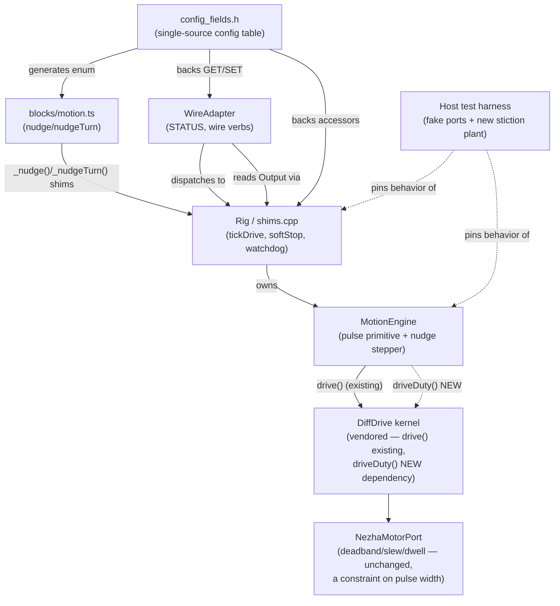

<!-- CLASI: Before changing code or making plans, review the SE process in CLAUDE.md -->

# Sprint 039: Nudge mode: sub-floor micro-moves for calibrateL

## Goals

1. Give the robot a way to execute heading/position corrections smaller
   than the kernel's speed floor can sustain (~67 deg/s pivot, ~15 mm /
   5 deg today) — a settle-gated raw-duty pulse stepper ("nudge mode")
   in `MotionEngine`, gated on a floor-truthed per-pulse
   characterization before any control-loop code is written.
2. Ship a block API (`nudge()` / `nudgeTurn()`) that blocks until done
   and reports the encoder-measured displacement, so the
   `nezha-robot-template` `calibrateL` program can loop on it — that
   consumer is the reason this sprint exists now.
3. Fix `STATUS active` staying `1` after a soft stop, and diagnose a
   newly-observed reverse-to-forward transition where a `driveTick()`
   loop appears to stop ticking altogether without finishing its
   budget or printing its completion line.
4. Investigate (host-sim) whether K2's frozen-sample-tick behavior
   self-locks a slow continuous hold below breakaway, and fix it at
   the `MotionEngine` level if the fix is small; the vendored kernel
   (`src/core/diffdrive.{h,cpp}`) is out of scope for an edit.

## Problem

`calibrateL` squares the robot to a floor line using the Trackbit's
four channels, then must nudge-round by a measured angle to within 1
degree, forward and reverse. It cannot: the kernel's floor (`vMin`
pinned 0, `MotionLimits::vFloor` 70 mm/s) makes ~67 deg/s the slowest
sustainable pivot rate, and rotation targets under ~2-3 deg are
deliberate no-ops today (margin + the old `pivot_overrun`, now
`stop_distance`). The template session's own workaround —
`setWheelSpeeds()` + N x `driveTick()` — cannot substitute: source
reading shows `tickDrive()` steps the kernel *before* `service()`
stages a hold's first command (a 1-tick nudge sends nothing), and
`wheelsV()` resets the shaper and ramps at 400 mm/s^2 (5 ticks peak
near 38 mm/s). Both are now confirmed on hardware — see Use Cases
below.

Two related defects surfaced from the same bench session and are
in scope because they sit on the same code paths a nudge loop will
exercise: `STATUS active` reads `1` indefinitely after a stop
(breaks any host that polls for `active=0`), and — newly discovered
this session — a `driveTick()` loop that follows a reversal sometimes
stops advancing partway through its tick budget with no completion
line, which looks like a fiber-level hang rather than an early
return. A third, unrelated defect (slow continuous creep below
breakaway never moving) shares the same "frozen encoder sample" shape
and is investigated in parallel.

## Solution

A new `MotionEngine`-level pulse primitive (`driveDuty()`'s
already-vendored raw-duty mode, PID/floor/crawl-dither/twist-hold all
bypassed) exposed diagnostically first, characterized on the floor
second, and only then wrapped in a settle-gated stepper loop
("nudge mode") that re-reads remaining error from encoder counts
between pulses and terminates on margin, deadline or pulse budget.
Two new blocks (`nudge()`, `nudgeTurn()`) sit on top. Auto-routing
`MOVE_X`/`move()` requests below the floor into nudge mode — the
issue's original stretch goal — is explicitly deferred (see Design
Rationale) pending floor validation of the block API.

The STATUS staleness fix and the newly-observed reverse-to-forward
hang are diagnosed and fixed together, ahead of the characterization
gate: nudge mode's own settle loop routinely reverses direction
(issue text), so an unresolved fiber-level hang on exactly that
transition would silently corrupt both the characterization data and
nudge mode's own hardware validation. The creep self-lock is a
host-sim investigation with an optional small `MotionEngine`-level
fix; no kernel patch.

## Success Criteria

- A per-pulse displacement map exists for vevov (amplitude x width x
  wheel x temperature), camera-truthed, with an explicit go/no-go
  verdict recorded in ticket 003.
- On GO: `nudge()`/`nudgeTurn()` exist, are host-tested, and a
  hardware acceptance run shows 1-3 deg trims and 5-10 mm nudges
  landing within calibrateL's 1 deg tolerance, forward and reverse.
- `STATUS active` reads `0` promptly after a stop in every case tested,
  including immediately after a reverse-then-forward `driveTick()`
  transition; the same transition completes its full commanded tick
  budget and prints its completion line every time in a repeated
  hardware repro.
- The creep self-lock investigation produces either a landed small
  `MotionEngine`-level fix with a host-sim test, or a documented
  recommendation and an UNVERIFIED-labeled path to settle it on
  hardware, filed as a follow-up if not fixed this sprint.

## Scope

### In Scope

- `MotionEngine`: raw-duty pulse primitive (fire, report encoder delta,
  hard zero) and the settle-gated nudge stepper (ticket 004), gated on
  ticket 003's verdict.
- Diagnostic exposure of the pulse primitive (wire verb or
  RUN-accessible path) for the characterization gate (ticket 001).
- New config fields for nudge amplitude/width/settle time via the
  single-source `config_fields.h` table (ticket 004).
- Blocks `nudge(leftMm, rightMm)` / `nudgeTurn(deg)` (ticket 005).
- `STATUS active` staleness after a soft stop, and the reverse-to-
  forward `driveTick()` transition defect discovered in
  `captures/calibratel-vevov-20260915/bench-log.md` (ticket 002).
- Host-sim stiction-plant investigation of the creep self-lock, and a
  small `MotionEngine`-level fix if one is small enough to land this
  sprint (ticket 006).

### Out of Scope

- Any edit to `src/core/diffdrive.{h,cpp}` (vendored, byte-synced with
  `radio-robot-lib`) — this applies to both the nudge-mode work and the
  creep self-lock fix.
- Auto-routing `MOVE_X`/`move()` requests below the floor into nudge
  mode. Deferred to a follow-up sprint once the block API is
  floor-proven (Design Rationale, Open Questions).
- Turning on the existing kernel `crawl_pulse` dither — measured worse
  than the floor-70 baseline (`captures/tovez-taper-20260829/variants.json`).
- Per-robot baked nudge calibration (`firmware_bake`-style) — a future
  sprint once the mechanism itself is proven on vevov.

## Test Strategy

Host tests are the primary gate for every code change: the pulse
primitive, the nudge stepper's settle/budget/deadline logic against a
fake motor with a stiction model, the `STATUS`/soft-stop fix (in the
style of `tests/host/test_wire_motion_verbs.py`), and the creep
stiction-plant sim. Hardware runs are separate, team-lead-run sessions
(`hardware-tickets-run-them-yourself`): the characterization gate
(ticket 003) and the hang repro (ticket 002) both require the floor,
the camera, and — for ticket 002 — `TLM FULL` streaming plus diags 28
and 29 read before and after each step, none of which a host test can
stand in for. Per `.claude/rules/playfield-testing.md`, wheels-up
bench data is not a proxy for loaded-floor stiction for any of this
work.

## Architecture

**Substantial** — this sprint adds a new cross-module dependency that
does not exist today (`MotionEngine` driving the kernel's raw-duty
mode directly, alongside its existing PID-mode `drive()`/`neutral()`
calls), touches five modules (`MotionEngine`, `Rig`/`shims.cpp`,
`WireAdapter`, the `config_fields.h` config surface with its two
downstream consumers, and `blocks/motion.ts`), and — per the fresh
hardware evidence below — likely touches the fiber-scheduling/watchdog
machinery in `shims.cpp` for a suspected hang, a class of defect this
codebase treats as safety-critical (`fiber-yield-safety.md`). Full
7-step methodology, diagram included.

### Architecture Overview

**Responsibilities this sprint introduces or changes:**

1. **Raw-duty pulse primitive** — fire one bounded-width, bounded-
   amplitude duty pulse per wheel via the kernel's existing
   `driveDuty()` (`kModeRawDuty`, `src/core/diffdrive.h:69,204` —
   already bypasses PID, floor, crawl-dither and twist-hold; E-stop
   and lease expiry still force neutral), then hard-zero, and report
   the encoder counts each wheel moved once settled. This is pure
   diagnostic substrate — no automatic looping.
2. **Settle-gated nudge stepper** — loop the primitive: fire only when
   both wheels read at rest (mirroring `MotionEngine::settleToRest()`'s
   existing rest test), re-read remaining error from encoder counts,
   terminate on margin, deadline, or a pulse budget. This is the
   "nudge mode" the issue proposes; it owns no PID state of its own —
   raw-duty mode has none to own.
3. **Nudge config surface** — three new rows in the single-source
   `config_fields.h` table (amplitude, width, settle time), consumed
   by `shims.cpp`'s accessor table and generated into
   `blocks/motion.ts`'s `ConfigField` enum exactly as every existing
   field is.
4. **Block API** — `nudge()`/`nudgeTurn()` in `blocks/motion.ts`,
   following `move()`'s own blocking-with-`driveTick()`-loop shape,
   returning the actually-measured encoder displacement rather than a
   fire-and-forget signature.
5. **Soft-stop / STATUS accuracy, and the reverse-transition hang** —
   `Rig::softStop()` (`src/shims.cpp:391`) writes the motor port
   directly but never forces a fresh kernel `Output`; `WireAdapter::
   status()`'s `active` bit (`src/comms/wire_adapter.cpp:312`) reads
   that stale `Output` and can report "moving" forever. The 2026-09-15
   hardware evidence additionally shows a `driveTick()` loop
   immediately following a reversal sometimes not completing its full
   tick budget and never printing its post-loop line at all —
   `captures/calibratel-vevov-20260915/bench-log.md` runs 7-9 — which
   points at something not returning control to the caller (the port's
   100 ms reversal dwell interacting with `driveTick()`'s return value
   or the starvation watchdog; a `busGuard.acquire()` that never
   returns; or a silently dropped `emitLine()`, diag 29) rather than a
   second, independent stale-read bug. Both symptoms are diagnosed and
   fixed together in one ticket, because a hardware-visible early
   return AND a stuck `active` flag both showing up back-to-back on
   the same reversal is more likely one mechanism than two.
6. **Creep self-lock investigation** — a host-sim stiction plant
   (fake motor: no motion below a breakaway duty, quantized increments
   above) to test the issue's hypothesis that K2 does not integrate
   `PositionRef` on a tick whose encoder sample did not advance, so the
   I-term never winds up enough to break a sub-breakaway continuous
   hold free. `MotionEngine`-level mitigation only (e.g. an
   `MotionEngine`-level floor or breakaway allowance for a continuous
   `Hold`, which today passes floor 0 to the shaper —
   `motion_engine.cpp:397`); no kernel patch.

**Module boundaries:**

- `MotionEngine` (`src/motion/motion_engine.{h,cpp}`) — purpose: turn
  distance/rotation/velocity requests into kernel commands, now
  including sub-floor pulse requests. Inside: the new pulse primitive,
  the nudge stepper's state (a new struct alongside `Segment`/`Hold`),
  settle detection. Outside: wire framing, config storage, motor-port
  timing. Serves SUC-001, SUC-002.
- `Rig` / `shims.cpp` — purpose: own the one live `MotionEngine` +
  kernel instance and the tick/stop/watchdog machinery around it.
  Inside: `tickDrive()`, `Rig::softStop()`, the starvation watchdog,
  the diagnostic exposure for the pulse primitive. Outside: wire
  parsing, block-layer TypeScript. Serves SUC-001, SUC-003.
- `WireAdapter` (`src/comms/wire_adapter.{h,cpp}`) — purpose: translate
  wire verbs and `STATUS` fields to and from `Rig`. Inside: `status()`,
  a possible new sequenced verb for the pulse primitive. Outside: the
  motion math itself. Serves SUC-001, SUC-003.
- `config_fields.h` config surface — purpose: the single source of the
  `SET`/`GET` field table, bound by ordinal to `shims.cpp`'s accessor
  table and generated into `blocks/motion.ts`. Inside: three new rows.
  Outside: the values' runtime meaning. Serves SUC-001, SUC-002.
- `blocks/motion.ts` — purpose: the student-facing block surface.
  Inside: `nudge()`/`nudgeTurn()`. Outside: engine internals. Serves
  SUC-002.
- Host test harness (`tests/host/`) — purpose: pin engine and shim
  behavior against fake ports/clock, including a new stiction-model
  fake motor. Inside: the new test files/fixtures. Outside: hardware
  timing itself. Serves SUC-001 through SUC-004 (as the mechanism that
  gates everything except the two genuinely hardware-only steps).

**Diagram** (5 code modules + the vendored kernel boundary + the host
test harness; a new cross-module edge — `MotionEngine` -> raw-duty
`driveDuty()` — is exactly the kind of change this diagram exists to
show):

No entity-relationship diagram: this sprint adds no persisted data
model, only in-memory engine state (a struct alongside `Segment`/
`Hold`) and three wire-config rows. No separate dependency graph:
the diagram above already shows every new edge, and none of them
introduce a cycle — `MotionEngine` gains a new *kind* of call into the
kernel, not a new direction of dependency.

### Design Rationale

**Decision: nudge mode lives in `MotionEngine`, not the vendored
kernel.**
- Context: the kernel (`src/core/diffdrive.{h,cpp}`) is byte-synced
  with `radio-robot-lib`'s firmware; changing it means changing two
  repos and their fidelity suite (`fiber-yield-safety.md`).
- Alternatives considered: extend `crawlDuty()` in the kernel itself.
- Why this choice: `MotionEngine` is host-portable, already owns
  segments/margins/deadlines, and the kernel already exposes exactly
  the substrate needed (`driveDuty()`/`kModeRawDuty`) with zero kernel
  changes.
- Consequences: nudge mode gets no PID assistance and must do its own
  settle detection and error re-read between pulses — acceptable,
  since that bookkeeping is the whole point of the feature.

**Decision: raw-duty pulses ride the kernel's existing `kModeRawDuty`,
not a new mode.**
- Context: `driveDuty()` already bypasses PID, floor, crawl-dither and
  twist-hold, and E-stop/lease-expiry protection is already proven on
  this path.
- Alternatives considered: add a new kernel raw-pulse mode.
- Why this choice: zero kernel edits, reuses an already-hardened
  safety path.
- Consequences: raw-duty mode updates no stall/deficit latch, so the
  nudge stepper's own deadline + pulse budget is the only runaway
  backstop — must be conservative (the issue's own ~40-pulse
  suggestion).

**Decision: ship the block API this sprint; defer auto-routing
`MOVE_X`/`move()` below the floor into nudge mode.**
- Context: the original proposal (`reports/crawl-mode-analysis-
  20260831.md`) wanted `MOVE_X` to auto-route sub-floor requests
  transparently; the issue's 2026-09-15 update instead surfaces a
  concrete need for an explicit `nudge()`/`nudgeTurn()` block API.
- Alternatives considered: implement both this sprint.
- Why this choice: auto-routing changes `MOVE_X`'s existing
  goal-directed contract for every caller, not just calibrateL, and
  there is no floor-truthed accuracy data yet for the full (distance,
  rotation) sub-floor space — only for the narrow band the
  characterization gate will cover. Shipping the explicit blocks first
  lets calibrateL's real need land without that blast radius.
- Consequences: calibrateL calls `nudge()`/`nudgeTurn()` directly this
  sprint. A follow-up issue tracks auto-routing once the mechanism is
  floor-proven (see Open Questions).

**Decision: the reverse-to-forward hang and the STATUS staleness
defect are diagnosed and fixed as one ticket (002), sequenced before
the characterization gate (003) and the nudge engine (004).**
- Context: the original issue-provided sequencing put the STATUS fix
  last, as an independent small fix. The 2026-09-15 bench session
  (`captures/calibratel-vevov-20260915/bench-log.md`, runs 7-9)
  additionally shows a `driveTick()` loop after a reversal sometimes
  not finishing its tick budget and never printing its completion
  line — a symptom that looks like something is not returning control
  to the caller, not merely a stale read.
- Alternatives considered: keep the original order (STATUS fix last,
  independent of everything else); treat the newly-observed hang as a
  separate, lower-priority ticket.
- Why this choice: nudge mode's own settle loop pays a reversal dwell
  on every direction flip (issue text) and the characterization gate
  fires hundreds of individual pulses across amplitude/width/wheel/
  temperature cells — either one hitting an unresolved fiber-level
  hang would silently corrupt hardware data that is expensive to
  re-collect, and this codebase treats exactly this class of defect
  (a fiber not returning as expected around a yield/dwell) as
  safety-critical precedent (`fiber-yield-safety.md`'s 2026-09-01
  hard-fault writeup). Resolving it first is cheaper than discovering
  it mid-characterization.
- Consequences: ticket 003 (characterization) and ticket 004 (nudge
  engine) both depend on ticket 002. If ticket 002 cannot isolate a
  root cause within its debugging budget, see Open Questions for the
  fallback.

**Decision: the creep self-lock ticket stays investigation-plus-
optional-small-fix, no kernel patch.**
- Context: the issue's own suspected lock is inside K2
  (`diffdrive.cpp:977`), vendored.
- Alternatives considered: patch K2 directly.
- Why this choice: out of scope per this sprint's stated constraint; a
  kernel patch needs either the paired-upstream-patch process
  (`fiber-yield-safety.md`'s "Related invariants") or an explicit
  stakeholder decision, neither of which this sprint is positioned to
  produce.
- Consequences: ticket 006 either lands a small `MotionEngine`-level
  mitigation (e.g., continuous-hold floor/breakaway handling) with a
  host-sim test, or closes as a documented recommendation with a
  follow-up issue for the kernel-patch decision.

### Migration Concerns

- **Wire contract**: three new config-field ordinals (next free after
  38 = `StraightTrim`... — actually after the highest live ordinal, 39
  = `GoToTimeout`; the retired gaps 22-27/29/31 are never reused per
  `config_fields.h`'s own header comment, so the new rows take 40, 41,
  42). `tools/gen_config_field_enum.py` must be re-run and its output
  committed; `tests/tools/test_gen_config_field_enum.py` and
  `tests/host/test_config_surface_single_source.py` both fail the
  build if the generated enum and the C++ table disagree.
- **Firmware version**: per `bump-the-version-before-a-behaviour-flash`
  (memory), any hardware flash used for tickets 002/003 needs a
  distinguishable firmware pin so two builds flashed in the same
  session can be told apart over `ID` — this is the runtime pin
  version, separate from the repo's `close_sprint`-driven version-file
  bump (`git-commits.md`'s cadence rule); do not conflate the two when
  running the hardware tickets.
- **No persisted data migration**: no database, no schema, no
  on-device stored state beyond the new config rows (which are
  ordinary runtime config, not persisted across power cycles today,
  matching every other field in the table).
- **Deployment sequencing**: ticket 001 (pulse primitive, host-tested)
  and ticket 002 (hang diagnosis/fix, host-tested where possible) must
  both be flashed before ticket 003's characterization run, since 003
  depends on both being present and stable on the hardware it
  characterizes against.

## Use Cases

### SUC-001: Fire and characterize a raw-duty pulse
Parent: UC-003 (Drive a Straight Distance) / UC-004 (Pivot in Place) —
extends both below the kernel's speed floor.

- **Actor**: team-lead, running the characterization gate on vevov
- **Preconditions**: ticket 001's pulse primitive is flashed; the robot
  is on the floor with the camera live; the dance
  (`field-dance-first.md`) has passed this session.
- **Main Flow**:
  1. Operator commands a single raw-duty pulse on one wheel: amplitude
     in {15, 20, 25, 35, 50}%, width in {1, 2, 3} ticks.
  2. The primitive fires the pulse via `driveDuty()`, then hard-zeros,
     then reports the wheel's encoder-count delta once settled.
  3. The camera independently confirms (or refutes) the reported
     delta.
  4. Repeated ~20x per (amplitude, width, wheel, temperature) cell.
- **Postconditions**: a displacement map exists with mean/sd per cell,
  in both mm and encoder counts (vevov's ~0.79 mm/count, ~0.8 deg/count
  per wheel in a pivot).
- **Acceptance Criteria**:
  - [ ] Every cell's mean and sd (mm and counts) is recorded with a
        named capture artifact.
  - [ ] The go/no-go verdict (some cell gives a repeatable 0.3-2 mm
        increment, sd/mean <= 0.4) is stated explicitly in ticket 003.

### SUC-002: calibrateL nudges to within 1 degree, forward and reverse
Parent: UC-003 / UC-004, extended.

- **Actor**: the `calibrateL` MakeCode program (or any student program)
- **Preconditions**: ticket 003's verdict is GO; `nudge()`/
  `nudgeTurn()` are flashed.
- **Main Flow**:
  1. Program calls `nudgeTurn(deg)` (or `nudge(leftMm, rightMm)`) with
     a sub-floor correction, forward or reverse.
  2. The call blocks; internally the settle-gated stepper fires pulses
     only when both wheels read at rest, re-reading remaining error
     from encoder counts between pulses.
  3. The call returns the actually-measured encoder displacement.
  4. The program loops on the return value until within its own
     tolerance (1 deg for calibrateL).
- **Postconditions**: robot heading/position has moved by
  approximately the requested sub-floor amount; the caller knows
  exactly how much, not just "done".
- **Acceptance Criteria**:
  - [ ] Host tests pin: pulses fire only when settled; the ledger
        converges; budget/deadline terminate the loop; a direction
        flip pays exactly one reversal dwell.
  - [ ] A hardware acceptance run (team-lead) commands 1/2/3 deg trims
        and 5/10 mm nudges, camera-scored, forward and reverse.

### SUC-003: STATUS active is accurate after a stop, including after a
reversal
Parent: UC-011 (Stop and Emergency-Stop), extended.

- **Actor**: any host reading `STATUS` after issuing a stop
  (robotlink, a calibration script, the wire's own `STOP` verb)
- **Preconditions**: robot was driving (continuous `WHEELS_V`/
  `setWheelSpeeds` or a position-mode move).
- **Main Flow**:
  1. Caller issues a stop (block `stop()`, wire `STOP`, or a move
     reaching its natural deadline).
  2. `Rig::softStop()` runs: engine cleared, kernel commanded neutral,
     motor port zeroed directly.
  3. A subsequent `STATUS` read reports `active=0` promptly — not
     after an indefinite wait for something else to step the kernel.
  4. Separately: a `driveTick()` loop that follows a reversal (as in
     `captures/calibratel-vevov-20260915/bench-log.md` runs 7-8)
     completes its full commanded tick budget and prints its
     completion line every time.
- **Postconditions**: `STATUS active` matches physical reality within
  one tick; no `driveTick()` loop silently stops advancing after a
  reversal.
- **Acceptance Criteria**:
  - [ ] A host test (style of `tests/host/test_wire_motion_verbs.py`)
        pins `active=0` promptly after every soft-stop path (`stop()`,
        wire `STOP`, the starvation watchdog).
  - [ ] A hardware repro (team-lead), with `TLM FULL` streaming and
        diags 28/29 read before and after, reproduces runs 7-9's
        pattern and confirms it no longer occurs after the fix, or
        documents which of the three candidate mechanisms (reversal
        dwell/`driveTick()`-return interaction, a `busGuard.acquire()`
        that does not return, or a dropped `emitLine()`/diag 29) was
        the cause.

### SUC-004: Understand whether slow continuous creep self-locks below
breakaway
Parent: N/A — internal investigation, no student-facing use case.

- **Actor**: firmware maintainer (team-lead / programmer agent)
- **Preconditions**: none beyond the existing `MotionEngine`/kernel
  host-test harness.
- **Main Flow**:
  1. Build a host-sim stiction plant: no motion below a breakaway
     duty, quantized increments above, driven through the same
     continuous-hold path `wheelsV()`/`moveV()` use.
  2. Reproduce the issue's suspected lock: on a tick whose sample did
     not advance, does the I-term fail to wind up (`ki` never sees a
     growing position error)?
  3. Recommend a fix location; implement it only if `MotionEngine`-
     level and small.
- **Postconditions**: either a landed, host-sim-tested
  `MotionEngine`-level fix, or a documented recommendation for a
  follow-up (including whether a kernel-level patch is genuinely
  required).
- **Acceptance Criteria**:
  - [ ] The host-sim stiction plant exists and is testable in
        isolation.
  - [ ] MEASURED artifact reference for
        `captures/calibratel-vevov-20260915/bench-log.md` run 5's
        i2cf/cyc numbers is used as the hardware anchor for the sim's
        plausibility, not re-derived from memory.
  - [ ] A recommendation is written even if no fix lands this sprint.

## GitHub Issues

(None linked yet.)

## Definition of Ready

Before tickets can be created, all of the following must be true:

- [x] Sprint planning document is complete (sprint.md, including its
      Architecture and Use Cases sections)
- [x] Architecture review passed (or skipped, for changes with no
      architectural impact)
- [ ] Stakeholder has approved the sprint plan

## Tickets

| # | Title | Depends On |
|---|-------|------------|
| 001 | Raw-duty pulse primitive (engine + diagnostic exposure) | — |
| 002 | Diagnose and fix: STATUS active staleness + reverse-to-forward driveTick hang | — |
| 003 | Per-pulse characterization gate on vevov (go/no-go) | 001, 002 |
| 004 | Nudge mode: settle-gated pulse stepper in MotionEngine | 003 |
| 005 | Blocks: nudge() / nudgeTurn() | 004 |
| 006 | Creep self-lock: host-sim stiction plant investigation | — |

Tickets execute serially in the order listed. Ticket 006 has no
dependency on the others and could run at any point; it is sequenced
last because it is the lowest-priority, most open-ended item and
should not delay the calibrateL-facing work. If ticket 003 returns
NO-GO, tickets 004 and 005 do not proceed this sprint — see the
Architecture section's Design Rationale and note below.

**Ticket 002 closed 2026-09-16 with its hang half unresolved.** Defect
1 (stale `STATUS active`) is fixed and CONFIRMED on hardware (MEASURED
vevov 2026-09-16, `captures/039-002-repro-20260915/repro-results.md`).
Defect 2 (the reverse-to-forward `driveTick()` hang) did not
reproduce in 22 hardware transitions on the fixed build, but the root
cause was never isolated — the build also carries the Defect 1 change
to the same stop path, so "does not reproduce" is not "fixed". Per the
NO-GO/stall fallback below, this is carried forward as
`clasi/issues/reverse-to-forward-drivetick-hang-never-reproduced.md`;
tickets 003/004 should apply the documented workaround (avoid
reverse-then-immediate-forward `driveTick()` loops) until that issue
resolves.

**NO-GO / stall fallbacks** (stated per plan-sprint's effort-decision
guidance, not left implicit):

- If ticket 003 (characterization) returns **NO-GO** — every
  (amplitude, width) cell is nothing-or-lurch bimodal — tickets 004
  and 005 are cancelled for this sprint. The sprint closes with
  001/002/003/006 done, and a follow-up issue records the negative
  result and whatever amplitude/width range might still be worth
  trying.
- If ticket 002 cannot isolate a root cause for the reverse-to-forward
  hang within its debugging budget, tickets 003/004/005 proceed only
  with an explicit documented workaround (avoid reverse-then-
  immediate-forward `driveTick()` loops in the characterization
  script and in nudge mode's own pulse sequencing), and a follow-up
  issue tracks the unresolved hang for a future sprint.
