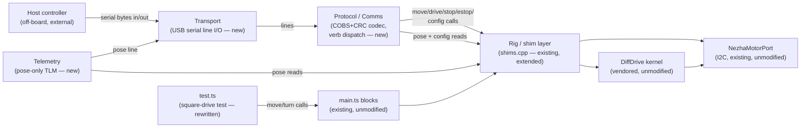

<!-- CLASI: Before changing code or making plans, review the SE process in CLAUDE.md -->

# Sprint 001: Simple Protocol v5 and square-drive test system

## Goals

1. Give this extension a host-facing wire protocol — a simplified
   variant of Protocol v5 (from the radio-robot-elite firmware's wire
   spec) — so a computer can identify, drive, configure, and read pose
   from a Nezha diffdrive robot over USB serial, without needing to be
   a MakeCode program.
2. Replace the existing smoke-test `test.ts` with a square-drive
   integration test that returns the robot to its start pose, usable
   as both a functional check and a manual demo.
3. Establish that all hardware-in-the-loop testing (now and for the
   protocol work specifically, later) resolves the test device by name
   ("zetuv") via `mbdeploy`, never a hard-coded port.

## Problem

This extension currently has no way for an external host (a laptop, a
test harness, a future companion app) to talk to the robot — the only
interface is MakeCode blocks running *on* the micro:bit. There is also
no automated integration-style exercise of the closed-loop move engine
beyond the existing ad hoc `test.ts` smoke program (a 50 cm square with
no net-pose-zero check, plus an unrelated `whileMoving` demo on button
B).

## Solution

Add a new wire-protocol layer on top of the existing shim/kernel stack,
implementing Protocol v5's line grammar and full command-verb registry
over USB serial, with one deliberate simplification: telemetry is
reduced to a cleartext pose-only record instead of the spec's binary
`ReplyEnvelope`. The protocol layer is purely additive — it calls the
same `shims.cpp` entry points the MakeCode blocks already use; the
vendored kernel and Nezha motor port are untouched. Separately, rewrite
`test.ts` to drive a 30 cm square that ends with a net-zero pose
change, and document the `mbdeploy`/"zetuv" convention for whenever
this or the protocol work is validated on real hardware.

## Success Criteria

- A host speaking Protocol v5's line grammar over USB serial can: get
  the boot/HELLO identity banner, ping for liveness, ask for
  configured identity and firmware version, command motion (MOVE,
  WHEELS, STOP, ESTOP), read and write tuning (CONFIG, GET_CONFIG,
  SET_FIELD), issue CALIBRATE (accepted, a documented no-op — no OTOS
  on this hardware), and receive a cleartext pose line on a regular
  cadence.
- `test.ts` drives a 30 cm square as (30 cm straight, 90° turn) × 4 on
  button A and ends within the existing move engine's normal tracking
  tolerance of its starting pose.
- The vendored kernel (`diffdrive.h`/`.cpp`) is unmodified.
- Physical hardware validation is explicitly deferred to the
  stakeholder (post-close, on `master`); no ticket blocks on it.

## Scope

### In Scope

- A new Transport module (USB serial line I/O) and Protocol/Comms
  module (COBS+CRC-16 codec, line-grammar parsing, verb registry and
  dispatch) implementing every v5 host→robot verb: `HELLO`, `PING`,
  `ID`, `VER` (cleartext) and `MOVE`, `CONFIG`, `STOP`, `WHEELS`,
  `ESTOP`, `GET_CONFIG`, `SET_FIELD`, `CALIBRATE` (binary).
- The boot/HELLO identity banner (`DEVICE:NEZHA2:robot:<name>:<serial>`).
- Simplified cleartext pose-only telemetry (`x`, `y`, `heading`),
  emitted on a regular cadence — the sprint's one deliberate deviation
  from the reference spec's binary `ReplyEnvelope`/`Telemetry` framing.
- A locally-defined (not protobuf-derived) binary payload encoding for
  each binary verb, sized to this project's actual capability surface
  (see Design Rationale) — not byte-compatible with the firmware's
  generated wire schema.
- `test.ts` rewritten for the 30 cm net-zero-pose square.
- Verification-instruction updates (in the relevant tickets) recording
  the `mbdeploy`/"zetuv" hardware-test convention.

### Out of Scope

- Radio transport (`RadioTransport`) — this hardware has no radio
  dongle; see Design Rationale.
- Byte-exact compatibility with the firmware's generated
  `commands.proto`/`wire_codec.py` schema, multi-group `ConfigGroupTarget`
  addressing, or OTOS-backed calibration — none of the underlying
  capability exists on this extension's target hardware.
- An ack ring / per-command outcome reporting on the wire — a direct
  consequence of the pose-only TLM deviation (see Design Rationale);
  flagged as an Open Question below, not silently assumed.
- Any change to `diffdrive.h`/`diffdrive.cpp` (vendored kernel) or the
  public MakeCode block API (`main.ts`).
- Physical on-robot validation — deferred to the stakeholder after
  sprint close.

## Test Strategy

This is a MakeCode/PXT extension with no unit-test harness in the repo
(`test.ts` is a smoke program, not an assertion suite — see
`specification.md` §14) and no protobuf/codec test tooling ported from
the firmware. Verification for this sprint is therefore:

- **Desk/code-review verification** for the codec (COBS 0x0A-keyed
  round-trip, CRC-16/CCITT-FALSE against the spec's own known-answer
  vector `crcCompute("123456789", 9) == 0x29B1`) and for each verb
  handler's mapping onto existing `shims.cpp` entry points — checked
  during ticket execution and code review, since there is no on-device
  automated test runner to gate on.
- **Simulator-level verification** for `test.ts`'s square-drive
  behavior, using the existing kinematic simulator fallback (§5 of
  `specification.md`) to confirm the net-zero-pose property
  programmatically before any hardware is involved.
- **Deferred hardware verification**: physical validation of both the
  protocol (serial framing, real command round-trips) and the
  square-drive test happens after this sprint closes, on `master`, by
  the stakeholder — using `mbdeploy` to resolve the micro:bit named
  "zetuv" rather than a hard-coded port, per
  `test-on-microbit-zetuv-via-mbdeploy.md`. No ticket in this sprint is
  blocked on that hardware pass.

## Architecture

**Substantial** — this sprint introduces a new subsystem (a host-facing
wire protocol: transport, framing/codec, verb dispatch, telemetry) with
3+ new/changed modules and a new cross-module dependency (the protocol
layer calling into the existing `shims.cpp`/`Rig` surface) that did not
exist before. It also adds a new external integration (USB serial to
an off-board host). None of the existing kernel or port modules change.

### Architecture Overview

**Step 1 — Problem.** Today, `shims.cpp` exposes a small, fixed C++ API
(`setWheels`, `driveTwist`, `startMove`/`updateMove`/`endMove`,
`stopAll`/`estopAll`/`estopClear`, `poseX`/`poseY`/`poseHeading`,
`setGeometry`/`setKernelValue`) called only from `main.ts`'s MakeCode
block bodies. This sprint adds a second caller of that same surface: a
wire protocol reachable over USB serial, independent of any MakeCode
block being placed in a student's program.

**Step 2 — Responsibilities.** Four responsibilities are new or
change together for the same reason, and one existing responsibility
(the application layer) gains an independent new caller:

1. Owning the raw serial byte stream and line delimiting (`0x0A`).
2. Translating wire lines into `(verb, cleartext-or-binary data)` pairs
   and back — the COBS+CRC codec and the v5 line grammar (§2.1) — and
   looking verbs up in a small closed registry (§2.4).
3. Dispatching each recognized verb to the right existing `shims.cpp`
   call (or a small additive one — see Impact, below) and formatting
   the cleartext reply verbs (`DEVICE`/`PONG`/`ID`/`VER`) and the one
   binary reply verb this sprint keeps binary (`CFG`, for `GET_CONFIG`).
4. Periodically formatting and sending the simplified pose-only `TLM`
   line, reading pose from the existing `Rig`/odometry state.
5. (Unchanged responsibility, new caller) `shims.cpp`'s `Rig`
   composition and the vendored kernel/Nezha port — the protocol layer
   is purely a new client of this existing surface.

**Step 3 — Modules.**

- **Transport** (new, `serial_transport.{h,cpp}` or similar) — purpose:
  own the raw USB-serial byte stream and line boundaries. Boundary:
  knows CODAL/`uBit.serial` and `0x0A` framing; knows nothing about
  COBS, CRC, verbs, or command semantics. Serves SUC-001 through
  SUC-005 as their shared foundation.
- **Protocol/Comms** (new, e.g. `protocol.{h,cpp}`) — purpose: turn wire
  lines into verb dispatch and back. Boundary: owns the COBS 0x0A-keyed
  codec, CRC-16/CCITT-FALSE, the closed verb registry, and each binary
  payload's (locally-defined) shape; calls into `Rig`/`shims.cpp` for
  every effect and reads pose/config state back through it; never
  touches the kernel or Nezha port directly. Runs in its own CODAL
  fiber (launched the same way the kernel launches its own, via
  `CodalFiberLauncher` — see Design Rationale), independent of the
  kernel's 24 ms real-time fiber. Serves SUC-001, SUC-002, SUC-003,
  SUC-005.
- **Telemetry** (new, a focused piece of the Protocol/Comms module or a
  small sibling file) — purpose: emit the pose-only `TLM` line on a
  regular cadence. Boundary: reads pose via the same `Rig` accessors
  `main.ts`'s Pose blocks use; writes only through Transport; carries
  no command-dispatch logic. Serves SUC-004.
- **Rig / shim layer** (`shims.cpp`, existing, extended) — purpose:
  compose the kernel, ports, odometry, and move engine for any caller.
  Boundary unchanged in kind; gains a small number of additive entry
  points the block API never needed (e.g., reading back current
  per-field config values for `GET_CONFIG`, and a duration-bound
  variant of the existing wheel-speed primitive for `WHEELS` — see
  Impact). Serves all SUCs indirectly, and all of `docs/design/usecases.md`
  as before.
- **DiffDrive kernel / NezhaMotorPort** (existing, vendored/ported,
  unmodified) — unchanged.
- **`test.ts`** (rewritten) — purpose: exercise the public block API
  end to end as a square-drive integration check. Boundary: calls only
  `main.ts`'s existing public blocks (`resetPose`, `move`,
  `whileMoving`, etc.); has no dependency on the new Protocol module.
  Serves SUC-006.

**Step 4 — Diagram.** Component/dependency diagram (doubles as the
dependency graph — every edge below is also a dependency edge, and
there are no cycles):

No entity-relationship diagram: this sprint introduces wire *message*
shapes, not stored/relational data — configuration and pose remain
existing in-memory `Rig`/kernel state; nothing is persisted or newly
related. No separate ERD would clarify anything beyond the payload
descriptions in Design Rationale below.

**Step 5 — What Changed / Why / Impact / Migration.**

*What changed*: two new modules (Transport, Protocol/Comms, with
Telemetry as a focused piece of the latter); `shims.cpp` gains a small
number of additive entry points; `test.ts` is rewritten; `pxt.json`'s
`files` list gains the new source files.

*Why*: the extension needs a host-reachable interface independent of a
MakeCode program being run, for automated/bench testing and for any
future non-MakeCode tooling; Protocol v5's grammar is the project's own
established reference for what that interface should look like.

*Impact on existing components*: **None** to the vendored kernel or
Nezha port. `shims.cpp` is additive-only: no existing exported function
changes signature or behavior. `main.ts` and the public block API are
untouched. The only genuinely new capability `shims.cpp` needs that the
block API never required is (a) a duration-bound variant of the
existing wheel-speed primitive, for `WHEELS`' "hold for a required
duration" semantics, layered the same way the existing move engine
already layers a lease/deadline over `kernel.drive()` — no kernel
change; and (b) a way to read back the current value of each
`ConfigField`, for `GET_CONFIG` — the setters already exist
(`setKernelValue`), only a matching getter is new.

*Migration concerns*: None — purely additive, no data migration, no
existing behavior changes. Deployment sequencing: `pxt.json`'s `files`
list must include every new source file for the MakeCode build to pick
it up (ticket 001's acceptance criteria covers this explicitly, since
it is the first ticket to add new source files).

### Design Rationale

**Decision: Transport medium is USB serial (CDC), not radio.**
*Context*: the reference spec (§2.1) supports either a serial CDC link
or a radio relay dongle (`RadioTransport`), with the SAME line grammar
riding either one. *Alternatives considered*: radio relay, matching the
firmware's own bench-gate testing setup (spec §12). *Why this choice*:
this project has no radio dongle in its bill of materials — the
`test-on-microbit-zetuv-via-mbdeploy` issue itself describes hardware
testing purely in terms of a serial port resolved by device name, with
no mention of a radio link. USB serial is also the ubiquitous fallback
already implicit in how `mbdeploy` and MakeCode's own deploy flow talk
to a micro:bit. *Consequences*: the wire grammar, framing, and verb
registry stay spec-faithful regardless of transport (§2.1 makes this
transport-agnostic by design), so choosing serial now doesn't foreclose
adding a radio transport later if this project ever gains that hardware
— it would be a new Transport implementation behind the same
Protocol/Comms boundary, not a rewrite of it.

**Decision: Binary payload encoding is locally defined, not
protobuf-derived.** *Context*: the reference spec's binary payloads
are generated from `commands.proto`/`robot_config.proto` via
`gen_messages.py`, producing a specific field-tag wire encoding and a
7-group `ConfigGroupTarget` address space. This repo has no protobuf
toolchain, no code generator, and — more importantly — a materially
smaller capability surface: one flat 15-member `ConfigField` enum
(§4.8 of `specification.md`), not seven config groups; no OTOS sensor
at all; a single-active-move engine, not a 5-deep planner queue.
*Alternatives considered*: (a) hand-port the firmware's exact
protobuf wire encoding and full `ConfigGroupTarget` address space
even though most of it would be dead weight here; (b) define a
minimal local encoding sized to what this hardware actually has.
*Why this choice*: (b) — porting a byte-exact protobuf codec by hand,
for a config surface this extension doesn't have, is effort with no
payoff for an educational Nezha kit; the spec's own framing/registry
layer (§2.1, §2.4) is transport- and payload-agnostic, so verb names
and line grammar stay faithful while payload shape is sized to this
project. *Consequences*: this implementation is **not** byte-compatible
with the firmware's real `NezhaProtocol`/`wire_codec.py` host client —
a from-scratch or purpose-built host tool is required to talk to it.
Flagged as Open Question 2 below, since it's the one place this
sprint's reading of "simplified" goes beyond the issue's literal text
(which named only telemetry as the deviation).

**Decision: `GET_CONFIG`/`SET_FIELD` address a single implicit config
group by field number (matching the existing `ConfigField` enum),
not `(group, field)` pairs.** *Context*: the spec addresses a field as
`(ConfigGroupTarget, protobuf field number)` because the firmware has
seven config groups. *Alternatives considered*: mirror all seven groups
even though fourteen of this extension's fifteen tunable fields would
land in one of them and the rest have no analogue at all. *Why this
choice*: this extension has exactly one flat config surface already
(`ConfigField`); reusing its existing enum ordinals as the wire field
number is the simplest mapping that is still genuinely field-number
addressed (not name-string addressed), matching the spec's own stated
rationale for field-number addressing (§6.2) — smaller wire cost, no
hand-maintained name vocabulary to drift. *Consequences*: `CONFIG`
(the multi-field patch arm) and `SET_FIELD` (the single-field arm)
differ only in how many `(field, value)` pairs one command line
carries — a smaller distinction than in the full spec, where `CONFIG`
patches a whole group's message and `SET_FIELD` addresses one field
within it.

**Decision: the protocol loop runs in its own fiber, not the kernel's.**
*Context*: the kernel already owns one real-time fiber (24 ms cadence,
§6.1 of `specification.md`); serial I/O, codec work, and dispatch have
no comparable deadline and could, if run inside the kernel's own fiber
or step, risk stealing cycles from the wheel-speed control loop — a
genuine closed-loop-timing risk, not a cosmetic one. *Alternatives
considered*: (a) drive the protocol loop from the kernel's `step()`
callback directly; (b) drive it from a MakeCode-level `basic.forever()`
TypeScript loop instead of C++; (c) give it its own CODAL fiber, mirroring
how the kernel itself is launched. *Why this choice*: (c) — the kernel's
own `DiffDrive::FiberLauncher` port exists precisely so a caller can
start an independent cooperative fiber without coupling to the kernel's
internals; reusing that same launch mechanism keeps the protocol loop
off the kernel's own critical path while staying in C++ (avoiding the
TS↔C++ boundary's per-call overhead for something that runs continuously).
*Consequences*: the protocol loop and the kernel fiber are both
cooperative (CODAL fibers yield, never preempt), so a long-running
protocol-side operation (e.g. a slow write) could still delay the
kernel's next scheduling point; handlers must stay short and non-blocking
— an implementation-ticket concern (ticket 001), not a further
architectural split.

**Decision: `CALIBRATE` is accepted and parsed, but is a documented
no-op.** *Context*: the spec's `CALIBRATE` re-runs OTOS gyro bias
calibration; this hardware has no OTOS sensor. *Why this choice*: the
spec itself already defines the correct behavior for a robot without
OTOS — `ERR_NOT_CONFIGURED` (§2.4's registry table) — so accepting the
verb (keeping it out of `malformedCount_`) while performing no
calibration is spec-consistent, not an invented deviation. Given this
sprint's fire-and-forget command-outcome model (see Open Question 1),
there is no wire-visible error to send back; the no-op is silent,
matching every other binary command arm's outcome visibility in this
sprint. *Consequences*: a host cannot currently distinguish "CALIBRATE
was accepted and is a no-op on this hardware" from any other silently
accepted binary command — acceptable for this sprint's scope, revisit
if a future sprint adds any outcome-reporting plane.

### Migration Concerns

None beyond the deployment-sequencing note in Impact above
(`pxt.json`'s `files` list). No data migration; no backward-compatibility
concern, since there is no prior wire protocol to be compatible with.

### Open Questions

**Resolved 2026-08-19** — the stakeholder approved this sprint plan
with all three open questions below accepted as stated (see the
`stakeholder_approval` gate notes on this sprint). Left in place for
implementers as a record of what was explicitly decided, not as
outstanding blockers.

1. **No ack ring / per-command outcome reporting.** The reference
   spec's only place a command's success/failure/completion is
   wire-visible is inside `Telemetry`'s `acks` field (§7.1) — which
   this sprint's pose-only TLM deviation removes entirely. The
   consequence: `MOVE`/`CONFIG`/`STOP`/`WHEELS`/`ESTOP`/`SET_FIELD` all
   become fire-and-forget from the wire's perspective; only
   `GET_CONFIG` keeps a genuine synchronous reply (`CFG`/`ERR`), because
   it was never carried by the ack ring even in the full spec. This
   follows directly from the issue's own stated TLM scope, but is
   surfaced here explicitly — including for `ESTOP`, where "did the
   halt actually take effect" has some safety relevance — for the
   stakeholder to confirm before ticket 003/004 implementation locks it
   in.
2. **Binary payload schema is locally defined, not protobuf-derived**
   (see Design Rationale above) — confirm this reading of "simplified"
   is acceptable, versus requiring byte-level compatibility with the
   firmware's actual generated wire schema (which would be
   substantially more work and, for several fields, has no local
   hardware analogue to encode in the first place).
3. **`replace=false` (enqueue behind active command) has no analogue**
   in this extension's single-active-move engine (no planner queue).
   This sprint's `MOVE` handler treats every `MOVE` as immediate/
   preemptive regardless of the `replace` flag's value. Confirm this is
   acceptable, versus (out of scope for this sprint) adding a small
   command queue to `shims.cpp`.

**Accepted simplifications, per stakeholder approval**: USB-serial
transport (no radio dongle), locally-defined binary payload encoding,
the fire-and-forget command plane (no TLM ack field), `MOVE` always
preemptive, and `CALIBRATE` as a parsed no-op — all as designed above.

## Use Cases

New actor this sprint: **Host controller** — a computer or bench
script speaking Protocol v5 over USB serial to a running robot, not a
MakeCode program on the micro:bit itself. Distinct from
`docs/design/usecases.md`'s existing Student/Teacher actor (UC-001
through UC-016), who continues to interact only through blocks.

### SUC-001: Host Discovers and Identifies the Robot
Parent: None — new capability this sprint (no prior wire interface
existed to extend)

- **Actor**: Host controller
- **Preconditions**: Robot is powered and running; a serial connection
  to the resolved device (via `mbdeploy`, once on hardware) is open.
- **Main Flow**:
  1. Robot emits the `DEVICE:NEZHA2:robot:<name>:<serial>` banner at
     boot, unsolicited.
  2. Host sends `HELLO` at any later point and receives the same
     `DEVICE:` banner as a reply.
  3. Host sends `ID` and receives `ID:<drivetrain>:<profile>:<version>`.
  4. Host sends `VER` and receives `VER:<version>`.
- **Postconditions**: Host has confirmed it is talking to a Nezha
  diffdrive robot, and knows its configured identity and firmware
  version.
- **Acceptance Criteria**:
  - [ ] The boot banner is emitted once at startup without any host
        request.
  - [ ] `HELLO`, `ID`, and `VER` each produce the spec-specified reply
        line, byte-for-byte for the fixed parts of the format.

### SUC-002: Host Commands Motion Over the Wire
Parent: None — new capability this sprint; composes the existing move
engine (`docs/design/usecases.md` UC-002 through UC-006) via a new
caller.

- **Actor**: Host controller
- **Preconditions**: Robot identified (SUC-001, not required but
  typical); robot not e-stopped.
- **Main Flow**:
  1. Host sends `MOVE` with a velocity variant (twist or wheels), a
     stop condition (time, distance, or angle), and a timeout.
  2. Robot applies the move via the existing move engine / drive
     primitives (§ Architecture Overview, Impact).
  3. Host sends `WHEELS` for a duration-bound direct wheel-speed
     command, or `STOP`/`ESTOP` to end motion.
- **Postconditions**: Robot's motion state reflects the last-applied
  command; pose has advanced accordingly (observable via SUC-004).
- **Acceptance Criteria**:
  - [ ] `MOVE`, `WHEELS`, `STOP`, and `ESTOP` are each recognized,
        parsed, and dispatched to the correct existing drive/move/stop
        primitive.
  - [ ] `ESTOP` bypasses normal shaping the same way the existing
        `emergency stop` block does (`_estopAll`).
  - [ ] An unrecognized or malformed binary body does not crash or
        hang the protocol loop.

### SUC-003: Host Configures and Reads Back Robot Tuning Over the Wire
Parent: None — new capability this sprint; extends the reach of the
existing config surface (`docs/design/usecases.md` UC-015) to a
non-MakeCode caller.

- **Actor**: Host controller
- **Preconditions**: Robot identified (typical, not required).
- **Main Flow**:
  1. Host sends `CONFIG` with one or more `(field, value)` pairs; robot
     applies each via the existing `setKernelValue`-equivalent path.
  2. Host sends `GET_CONFIG` for one field and receives a synchronous
     `CFG` reply with its current value.
  3. Host sends `SET_FIELD` to write exactly one field.
  4. Host sends `CALIBRATE`; robot accepts and parses it, performs no
     calibration (no OTOS on this hardware — see Design Rationale).
- **Postconditions**: Targeted `ConfigField` values reflect the last
  write; a `GET_CONFIG` read reflects the true current value.
- **Acceptance Criteria**:
  - [ ] `CONFIG`, `GET_CONFIG`, `SET_FIELD`, and `CALIBRATE` are each
        recognized, parsed, and dispatched.
  - [ ] `GET_CONFIG`'s reply reflects the value most recently set,
        whether set via the wire (`CONFIG`/`SET_FIELD`) or via a
        MakeCode `set config` block in the same running program.
  - [ ] `CALIBRATE` never crashes or hangs the protocol loop and never
        touches motor output.

### SUC-004: Host Receives Continuous Pose Telemetry
Parent: None — new capability this sprint

- **Actor**: Host controller
- **Preconditions**: Robot running.
- **Main Flow**:
  1. Robot emits a cleartext pose line — `x`, `y`, `heading` — on a
     regular cadence, independent of whether the host has sent any
     command.
  2. Host reads pose lines to track the robot's motion in real time
     (e.g., while a MOVE is in flight).
- **Postconditions**: Host has a running, low-latency view of the
  robot's pose.
- **Acceptance Criteria**:
  - [ ] Telemetry is emitted on a regular cadence without requiring a
        host request.
  - [ ] Telemetry carries only `x`, `y`, `heading` — no binary framing,
        no ack data (this sprint's one deliberate deviation from the
        reference spec's `Telemetry` message).

### SUC-005: Host Verifies Liveness
Parent: None — new capability this sprint

- **Actor**: Host controller
- **Preconditions**: Robot running.
- **Main Flow**:
  1. Host sends `PING`.
  2. Robot replies `PONG:t=<ms>` using its own clock.
- **Postconditions**: Host has confirmed the link is alive and has a
  timestamp usable for clock-sync purposes.
- **Acceptance Criteria**:
  - [ ] `PING` reliably produces a `PONG:t=<ms>` reply.

### SUC-006: Student/Teacher Runs the Square-Drive Integration Test
Parent: `docs/design/usecases.md` UC-003 (Drive a Straight Distance)
and UC-004 (Pivot in Place) — this use case composes both, four times
each, via the existing block API.

- **Actor**: Student/Teacher
- **Preconditions**: `test.ts` is the running program (simulator or
  hardware); robot at rest.
- **Main Flow**:
  1. User presses button A.
  2. Program resets pose, then runs four iterations of (drive 30 cm
     straight, turn 90°).
  3. Program ends with a turn (4 straights + 4 turns total).
- **Postconditions**: Robot's net displacement and net heading change
  are zero (within the move engine's existing tracking tolerance) —
  the robot has returned to its starting pose.
- **Acceptance Criteria**:
  - [ ] Pressing button A triggers exactly one square traversal.
  - [ ] The traversal is (30 cm straight, 90° turn) × 4, ending with a
        turn.
  - [ ] In the simulator, `poseX()`/`poseY()`/`heading()` after the run
        are at (or within simulator floating-point tolerance of) their
        pre-run values.
  - [ ] Physical hardware confirmation is explicitly deferred (see Test
        Strategy); the test program itself must not require hardware
        to be judged complete for this sprint.

## GitHub Issues

(No GitHub issues linked to this sprint's tickets yet.)

## Definition of Ready

Before tickets can be created, all of the following must be true:

- [x] Sprint planning document is complete (sprint.md, including its
      Architecture and Use Cases sections)
- [x] Architecture review passed (or skipped, for changes with no
      architectural impact)
- [x] Stakeholder has approved the sprint plan

## Tickets

| # | Title | Depends On |
|---|-------|------------|
| 001 | Serial transport and Protocol v5 wire codec (COBS+CRC-16, line grammar) | — |
| 002 | Cleartext identity/liveness verbs and boot banner (HELLO/DEVICE, PING/PONG, ID, VER) | 001 |
| 003 | Binary motion verbs (MOVE, WHEELS, STOP, ESTOP) | 001, 002 |
| 004 | Binary config verbs (CONFIG, GET_CONFIG, SET_FIELD, CALIBRATE) | 001, 002 |
| 005 | Simplified cleartext pose telemetry (TLM) | 001, 002 |
| 006 | Square-drive test system (test.ts rewrite) | — |

Tickets execute serially in the order listed.
