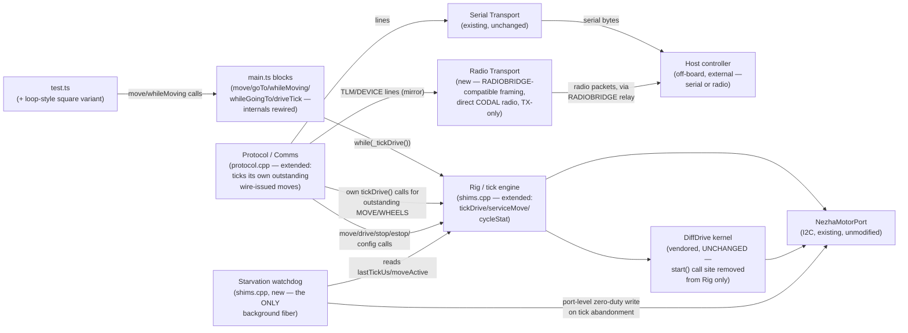

<!-- CLASI: Before changing code or making plans, review the SE process in CLAUDE.md -->

# Sprint 002: Caller-driven tick loop and radio telemetry

## Goals

1. Replace the DiffDrive kernel's background-fiber pacer with a pure
   caller-driven tick model (generator-style `tickDrive()`/`next()`):
   every control cycle runs on whichever fiber calls it, self-paced to
   the existing 24 ms cadence, with a starvation watchdog as the only
   remaining background fiber. This closes a latent multi-fiber Rig
   read-modify-write hazard implicated in bench-observed stunted/
   corrupted square-drive legs on `vevov`.
2. Mirror pose-only cleartext `TLM` (and the `DEVICE` boot banner) onto
   the micro:bit radio, wire-compatible with the fleet's existing
   RADIOBRIDGE relay boards, so field runs get live telemetry without a
   tether. USB serial stays untouched for bench work.

## Problem

**Tick loop.** The kernel currently free-runs its own 24 ms fiber
(`DifferentialDrive::start()`), and every caller — student blocks,
sprint 001's wire protocol — is a passive spectator polling `Rig` state
that fiber updates in the background. That background fiber is a third
(soon fourth) uncoordinated toucher of `Rig`'s odometry/move-engine
state (`shims.cpp`), which is an unprotected read-modify-write — the
suspected cause of bench-observed square-drive legs that drive briefly
then stunt, alongside sporadic corrupted single-sample telemetry
spikes. It also hides the control cycle from student loop bodies, which
today beat against the fiber's cadence (`basic.pause(24)`) instead of
being phase-locked to it.

**Radio telemetry.** TLM only reaches USB serial today (sprint 001),
so a robot running untethered in the field is invisible — no live pose
during a demo or an outdoor run — even though the fleet already has
RADIOBRIDGE relay hardware built for exactly this.

## Solution

**Tick loop.** Lift the kernel's own absolute-deadline pacing logic
(already present and liftable, `diffdrive.cpp:290-306`) into a new
`shims.cpp` shim, `tickDrive()`, that runs one `kernel.step()` +
`serviceMove()` on the caller's own fiber, then self-paces to the next
24 ms boundary before returning. Remove the single `rig->kernel.start()`
call site (kernel itself untouched — `start()`/`run()`/`fiberEntry()`
stay compiled and available, re-enable by restoring the call). Add a
starvation watchdog — the only remaining background fiber — that
force-stops the robot at the port level if nothing has ticked in
~100 ms. Rewire `main.ts`'s blocking and loop move forms to
`while (_tickDrive())`, unchanged signatures, unchanged beginner UX.
Rewire `protocol.cpp` (sprint 001) so it becomes its own bounded tick
caller for wire-issued motion, since a host-driven `MOVE`/`WHEELS` has
no student loop to supply ticks.

**Radio telemetry.** Add a small, TX-only radio module that talks
directly to CODAL's `uBit.radio` datagram API (not the MakeCode `radio`
block package — this project's flash budget has no room for it) using
the same on-air fragment framing the fleet's RADIOBRIDGE relay already
expects (`[SEQ][FLAGS][LEN]` fragments, fixed group 10). `protocol.cpp`
mirrors the same formatted `TLM`/`DEVICE` line bytes it already sends
over serial onto this new transport — one source of truth for line
content, two sinks. No new wire verbs, no commands accepted over radio
this sprint.

## Success Criteria

- The kernel's background fiber is never started; `tickDrive()` is the
  sole executor of `kernel.step()`. `diffdrive.h`/`.cpp` are
  byte-unmodified.
- `move()`/`goTo()`/`whileMoving()`/`whileGoingTo()` behave identically
  from a block author's perspective (same signatures, same blocking/
  looping contract) while internally driven by `while (_tickDrive())`.
- `setWheelSpeeds()`/`driveTwist()`/`WHEELS` only move the robot while
  something ticks; an abandoned tick loop or wire session is force-
  stopped by the watchdog within ~150 ms, resumable without an e-stop
  clear.
- A host speaking Protocol v5 over USB serial can still issue `MOVE`/
  `WHEELS`/`STOP`/`ESTOP` and have them execute correctly — the
  protocol fiber now ticks its own outstanding commands.
- `TLM` and the `DEVICE` banner reach a host through a RADIOBRIDGE relay
  over radio, using the fleet's existing on-air framing, while USB
  serial TLM is unaffected.
- Physical hardware validation (bench timing counts, watchdog timing,
  radio range/reliability) is explicitly deferred to the stakeholder,
  post-close, on `master`, targeting **vevov** — no ticket blocks on it
  (this project's established sprint 001 convention; `zetuv` references
  in either source issue are superseded per stakeholder ruling
  2026-08-19).

## Scope

### In Scope

- `shims.cpp`: remove the `kernel.start()` call site (re-enable
  comment); extract `serviceMove()` (no-yield invariant); add
  `tickDrive()`/`cycleStat()`; add the starvation watchdog fiber; add
  `lastTickUs`/`stepBusy`/a Rig-level tick-overrun counter.
- `main.ts`: `_tickDrive`/`_cycleStat` shim declarations with simulator
  bodies; new `driveTick()` block; rewire `move`/`goTo`/`whileMoving`/
  `whileGoingTo` internals (signatures unchanged); JSDoc documenting the
  continuous-mode ticking contract, including its gap for the existing
  async/advanced move-polling blocks (see Open Questions).
- `protocol.cpp`: rework the motion-verb handlers and `run()`'s loop so
  the protocol fiber ticks its own outstanding `MOVE`/`WHEELS`
  obligations; `STOP`/`ESTOP` clear that local obligation tracking too.
- `test.ts`: add a loop-style square variant (button B) demonstrating
  the generator model, alongside the existing button-A stepwise tour.
- `README.md`: document the tick contract ("the robot only moves while
  your loop ticks").
- A new radio transport module (`radio_transport.h`/`.cpp` or similar)
  — direct CODAL `uBit.radio` datagram TX, RADIOBRIDGE-compatible
  on-air framing, group fixed at 10, a default channel, TX-only.
- `protocol.cpp`: mirror `sendTelemetry()` and `sendDeviceBanner()`
  onto the new radio transport, in addition to (not instead of) serial.
- `pxt.json` `files` list updated for the new radio source files.

### Out of Scope

- Any change to `diffdrive.h`/`.cpp` (vendored kernel) — binding
  constraint from the issue and from sprint 001's architecture, which
  this sprint's issue supersedes only for the fiber-pacer wiring
  decision, not the kernel files themselves.
- Dual mode / any block or config path that re-enables the fiber pacer
  — the issue is explicit: pure tick model, no dual mode.
- Commands accepted over radio (host→robot) — deferred; this sprint is
  telemetry-out only. Revisit only if a future sprint finds it nearly
  free given the framing this sprint establishes.
- Multi-robot radio channel allocation/selection (a block or config
  surface for picking a channel) — no fleet channel registry exists
  today and this project currently targets one test robot; deferred as
  an Open Question below.
- Byte-level changes to the Protocol v5 line grammar, verb registry, or
  TLM/DEVICE line content — this sprint changes *transport*, not
  *wire format*.
- Fixing the existing async/advanced move-polling blocks' interaction
  with the tick model beyond documenting it (see Open Questions) — the
  issue's own rewiring list does not include them.
- Physical hardware validation — deferred to the stakeholder post-close
  on `master`, targeting vevov (see Success Criteria).

## Test Strategy

Same convention sprint 001 established: this is a MakeCode/PXT
extension with no unit-test harness and no on-device automated test
runner, so verification is layered:

- **Desk/code-review verification** for the tick engine's absolute-
  deadline pacing logic (lifted from the kernel's own proven `run()`),
  the watchdog's port-level stop path (reuses `emergencyStop()`, already
  proven tick-independent), the protocol fiber's idle-vs-tick loop
  branching, and the radio module's on-air framing against the
  reference implementation it must interoperate with
  (`radio-robot-elite`'s `microbit_radio_link.{h,cpp}`, RadioRelay §5).
- **Simulator-level verification** for `main.ts`'s rewired blocking/
  loop move forms (`_tickDrive`'s simulator body: kinematic integrate +
  `basic.pause` to a 24 ms absolute schedule) — confirms block-author-
  visible behavior is unchanged. Tick timing precision, the watchdog,
  and radio are not meaningfully simulator-testable (no fiber scheduler
  or radio peripheral in the browser simulator); these are desk-
  reviewed and deferred to hardware.
- **Deferred hardware verification**, on `master`, post-close, on
  `vevov` via `mbdeploy` — the issue's own Verification section is the
  checklist: `driveTick()` tick-count over a timed move (~208 at 24 ms
  over 5 s), `cycleStat(2)` overruns stay 0 through the existing square
  test, a hostile-loop-body test (PID rate drops but the move
  completes), an abandoned-loop test (watchdog stops within ~150 ms,
  no e-stop-clear needed to resume), `setWheelSpeeds` without ticking
  does not move the robot, old-vs-new square end-pose parity, and radio
  TLM/DEVICE reception through an actual RADIOBRIDGE relay (compiled
  packet-size and fragmentation behavior — see Open Questions — is
  itself part of this pass). No ticket in this sprint blocks on this
  pass.

## Architecture

**Substantial** — this sprint touches 3+ existing modules (`shims.cpp`,
`main.ts`, `protocol.cpp`) and adds a new one (radio transport); it
introduces a new cross-module dependency that did not exist before
(`protocol.cpp` now depends on `shims.cpp`'s tick cadence, not just its
command surface, to make wire-issued motion progress at all); and it
adds a new external integration (the micro:bit radio link to the
fleet's RADIOBRIDGE relay hardware). The vendored kernel
(`diffdrive.h`/`.cpp`) and the Nezha port are unchanged.

### Step 1 — Problem

Today, exactly one thing steps the kernel: its own background fiber,
started once from `shims.cpp`'s `ensure()` and free-running forever at
24 ms regardless of who's calling in. Every caller — `main.ts`'s blocks,
sprint 001's wire protocol — polls state that fiber already advanced;
none of them owns the cadence. This sprint moves ownership of the
control cycle to callers: whoever wants the robot moving must
periodically call a new tick primitive, and the two existing callers
(student TS code via `main.ts`, the wire protocol via `protocol.cpp`)
must each be rewired to do so. A new radio transport is added alongside
this, structurally unrelated to the tick change but sharing this
sprint's scope per the stakeholder's two ratified goals.

### Step 2 — Responsibilities

Four responsibilities are new or change together for the same reason
(the tick ownership move), and one is new and independent (radio):

1. **Owning one control-cycle execution + absolute-deadline pacing**,
   liftable near-verbatim from the kernel's own `run()`
   (`diffdrive.cpp:290-306`) into a caller-callable primitive.
2. **Guaranteeing the robot cannot be left driving forever** if its tick
   caller disappears — a background safety net, minimal by design (it
   does no control, only a port-level stop).
3. **Each existing tick caller (student TS, wire protocol) adopting the
   new primitive** without changing its own public contract (block
   signatures; wire verb registry).
4. **(Unchanged responsibility)** `shims.cpp`'s composition, odometry,
   and move-engine logic — extended, not replaced; `serviceMove()` is
   pulled out of the existing `updateMove()` body so both the old poll
   path and the new tick path share one implementation.
5. **(New, independent)** Getting the same bytes `protocol.cpp` already
   sends over serial onto the micro:bit radio, framed the way the
   fleet's existing relay hardware expects.

### Step 3 — Modules

- **Rig / tick engine** (`shims.cpp`, existing, substantially
  extended) — purpose: compose the kernel, ports, and the caller-paced
  control/move/drive engine for any caller. Boundary: unchanged in
  kind from sprint 001 (still the sole owner of `Rig` state and the
  kernel/port objects); gains the tick primitive, the extracted
  `serviceMove()`, and the starvation watchdog as one more responsibility
  of the same composition layer (the watchdog only ever *stops*, never
  *drives*, so it does not pull in a second concern). Serves SUC-001,
  SUC-002, SUC-003.
- **`main.ts` blocks** (existing, internals rewired) — purpose: expose
  the caller-driven model to MakeCode as unchanged-signature blocks plus
  one new `driveTick` block. Boundary: TS-side units/scaling only, as
  before; calls the tick engine through the existing `//%` shim
  boundary, nothing new architecturally. Serves SUC-001, SUC-002.
- **`test.ts`** (existing, extended) — purpose: demonstrate and
  desk-verify the generator model via a loop-style square variant.
  Boundary: calls only `main.ts`'s public blocks. Serves SUC-001,
  SUC-002.
- **Protocol / Comms** (`protocol.cpp`, existing, extended) — purpose:
  turn wire lines into verb dispatch and back (unchanged from sprint
  001) — extended so it also ticks its own outstanding motion
  obligations, since a host-driven move has no student loop to supply
  ticks. Boundary: still owns the codec/registry/dispatch and its own
  fiber; the new obligation-tracking state (mirroring the move engine's
  own deadline pattern) is protocol-local, not pushed into `shims.cpp`.
  Serves SUC-001 (indirectly, by relying on the same tick engine),
  SUC-003.
- **Radio transport** (new, `radio_transport.{h,cpp}` or similar) —
  purpose: get a formatted wire line onto the micro:bit radio, framed
  for the fleet's RADIOBRIDGE relay. Boundary: knows `uBit.radio`, the
  RadioRelay on-air fragment framing, the fixed group, and the channel;
  knows nothing about pose, COBS, CRC, or verb dispatch — mirrors how
  `SerialTransport` is a thin CODAL-facing leaf beneath `Protocol`.
  TX-only: no receive path, no ACK handling, no reassembly — this
  sprint's scope is telemetry-out only. Serves SUC-004.
- **DiffDrive kernel / NezhaMotorPort / platform ports** (existing,
  vendored/ported, unmodified) — unchanged; the kernel's `start()`/
  `run()`/`fiberEntry()` remain compiled but uncalled.

### Step 4 — Diagram

Component/dependency diagram (doubles as the dependency graph — every
edge is a dependency edge; no cycles):

No entity-relationship diagram: no data model changes — pose, move,
and config state remain existing in-memory `Rig`/kernel state, exactly
as sprint 001 already established; nothing is persisted or newly
related. The diagram above already serves as the dependency graph.

### Step 5 — What Changed / Why / Impact / Migration

**What changed**: `shims.cpp` gains a tick engine and a watchdog fiber
in place of the kernel's own background fiber; `main.ts`'s move-form
internals are rewired and gain one new block; `protocol.cpp`'s motion
handlers and main loop gain tick-caller responsibility; a new radio
transport module is added and `protocol.cpp` mirrors `TLM`/`DEVICE`
onto it; `pxt.json`'s `files` list gains the new radio source files.

**Why**: closes a latent multi-fiber `Rig` race implicated in bench-
observed square-drive faults; phase-locks student loop bodies to the
real control cycle instead of an independent `basic.pause(24)`; makes
protocol-driven motion safe under the same model (no background pacer
means a lost/abandoned wire session must still be caught); gets live
pose to the field without a tether, using hardware the fleet already
has.

**Impact on existing components**: **None** to `diffdrive.h`/`.cpp` or
the Nezha port — both unmodified; the kernel's `start()`/`run()`/
`fiberEntry()` remain compiled and available, re-enabled by restoring
one call site if ever needed. `main.ts`'s block **signatures** are
unchanged (issue's binding constraint), but `setWheelSpeeds`/
`driveTwist`/`WHEELS`' **runtime semantics** change in a way existing
programs can observe — see Migration Concerns. Sprint 001's wire verb
registry, line grammar, and `TLM`/`DEVICE` content are unchanged; only
their delivery gains a second transport.

**Migration concerns**:

- **Breaking runtime-semantics change, not a signature change**: any
  existing program calling `setWheelSpeeds()`/`driveTwist()` (or the
  wire's `WHEELS`/time-stop `MOVE`) without a following tick source
  will now only move for as long as something ticks — previously these
  ran indefinitely until superseded or stopped. This is the issue's own
  explicitly ratified contract change; it must be documented prominently
  (JSDoc + README, ticket 004) since it silently changes behavior for
  any pre-existing program that used the "Drive" block group as a
  fire-and-forget continuous command.
- **Existing async/advanced move-polling blocks are left in a degraded
  state, not rewired**: `startMove()`/`startGoTo()`/`isMoving()`/
  `moveProgress()`/`stopMove()` keep their existing non-stepping
  `_updateMove()`/`_progress()` bodies (the issue explicitly preserves
  `isMoving()`'s non-stepping check and does not include these in its
  rewiring list). Under the pure tick model, a program using this old
  poll pattern with no tick source will not progress the move at all —
  the watchdog will stop it at ~150 ms and clear `moveActive`, so
  `isMoving()` will eventually report `false`, but the commanded
  distance/angle will not have been reached. This is flagged, not
  silently decided — see Open Questions.
- **Deployment sequencing**: `pxt.json`'s `files` list must include the
  new radio source files (ticket 005's acceptance criteria, mirroring
  sprint 001 ticket 001's own convention for the first ticket adding new
  source files).
- **Flash budget**: this project is known to run within roughly a
  thousand bytes of its deploy budget (sprint 001 evidence: a single
  icon table overran it by 876 bytes). Goal 2 (radio) is sequenced after
  goal 1 in this sprint's tickets specifically so a budget overrun there
  does not block goal 1's higher-priority bug fix; ticket 005/006's
  acceptance criteria must include a compiled-size check.

### Design Rationale

**Decision: pure tick model, fiber pacer entirely unwired — no dual
mode.** *Context*: the alternative (supporting both a fiber-paced and a
caller-paced mode) was considered and rejected by the stakeholder
(issue, 2026-08-19) before this sprint began. *Why*: a dual mode would
leave the exact multi-fiber `Rig` hazard this sprint exists to close
open whenever the fiber mode was active, and doubles the surface to
maintain/test for no benefit this project currently needs. *Consequence*
(accepted by the stakeholder): every continuous-mode caller — including
any future one — must supply ticks; there is no "just start it and walk
away" fallback anymore. This sprint honors that decision as given, not
re-derived.

**Decision: cadence stays 24 ms.** *Context*: 20 ms was considered and
rejected by the stakeholder — it would disturb the 19 ms motor
write-throttle in `nezha_port.h:87` and two tick-count kernel constants
(`kStopEnforceTicks`, `kAccelSmoothing`) tuned against 24 ms, for no
required benefit (24 ms already clears the ≥40 Hz PID requirement).
*Consequence*: zero kernel retuning; the tick engine's absolute-deadline
logic is a direct lift of the kernel's own proven pacing math at the
same period.

**Decision: the starvation watchdog stops at the port level, not via
the kernel's e-stop latch.** *Context*: something must guarantee the
robot cannot be left driving forever with no active tick caller (the
Nezha brick physically latches its last commanded duty across MCU
resets — one lost stop is permanent). *Alternatives considered*: (a)
have the watchdog call `kernel.estop()`, matching the block API's
existing emergency-stop primitive; (b) a soft, resumable stop that
zeroes the port directly without latching anything. *Why this choice*:
(b) — the kernel's e-stop latch requires an explicit `clearEmergencyStop()`
before any further motion, which would turn an incidental abandoned loop
(e.g., a student's program pausing mid-development) into a state
requiring deliberate recovery; the watchdog's job is to make the robot
safe, not to demand an operator intervention to resume. This reuses
`emergencyStop()`'s existing port-level path (`nezha_port.cpp:80-85`),
already proven tick-independent (§7.2's exact-zero short-circuit).
*Consequences*: this is a genuinely third stop flavor alongside the
block API's existing `stop()`/`emergencyStop()` — worth naming
distinctly in code comments/README so implementers and future readers
don't conflate "the watchdog stopped me" with either existing primitive.

**Decision: `tickDrive()` always executes exactly one `kernel.step()` +
`serviceMove()` per call; its boolean return reports move-active state
*after* that step.** *Context*: this is the one place the issue's own
wording ("false immediately when no move is active") could be read two
ways — always-step-then-report, or skip-the-step-when-idle. *Why this
choice*: continuous modes (`setWheelSpeeds`/`driveTwist`/`WHEELS`) only
work under the tick model if every call genuinely steps the kernel —
otherwise a `driveTick()` loop driving a continuous command would do
nothing. Skip-when-idle would silently break exactly the capability this
sprint's Success Criteria requires. *Consequence*: `while (_tickDrive())`
still terminates on the same call that finishes a position-mode move
(no extra idle tick), because `serviceMove()` runs *before* the
post-step `moveActive` check inside that same call. Stated explicitly
here so tickets 001-003 share one unambiguous contract.

**Decision: `protocol.cpp` ticks conditionally (only while it has an
outstanding motion obligation), not on every loop iteration.**
*Context*: unlike a student's dedicated `while (_tickDrive())` loop,
`protocol.cpp`'s fiber has other jobs (line dispatch, TLM cadence) it
must keep servicing. *Alternatives considered*: (a) tick unconditionally
on every iteration, simplest code; (b) track a local motion obligation
(mirroring `shims.cpp`'s own `moveActive`/deadline pattern for
`MOVE`-with-distance/angle and `MOVE`/`WHEELS`-with-time respectively)
and only tick while it's live. *Why this choice*: (b) — (a) would spin
the kernel's I2C encoder sampling forever even when nothing is
commanded, defeating part of why the fiber pacer was removed in the
first place (bounded execution, not perpetual background work).
*Consequences*: while a wire-issued move is outstanding, the protocol
loop's own cadence becomes `tickDrive()`'s ~24 ms (its pacing sleep
replaces the loop's normal 5 ms idle poll for that iteration) instead of
5 ms — command dispatch (including `STOP`/`ESTOP`) and TLM emission are
serviced once per that coarser iteration during an active move. This is
still comfortably inside the watchdog's ~150 ms bound, and `ESTOP`'s
actual physical effect is unaffected regardless — it already bypasses
`step()` entirely via `emergencyStopMotors()`'s direct port write
(sprint 001, `nezha_port.cpp:80-85`); only how promptly the *next* wire
line is noticed is affected. `STOP`/`ESTOP` handlers must also clear the
local obligation tracking (not just call the existing shim), or the
loop would keep ticking until its tracked deadline elapsed even after a
stop was dispatched — an explicit implementation note for ticket 003.

**Decision: radio talks to CODAL's `uBit.radio` directly, not the
MakeCode `radio` block package.** *Context*: this project's flash
budget is extremely tight (sprint 001: an icon table alone overran it
by 876 bytes). *Alternatives considered*: (a) the MakeCode `radio`
namespace — simplest to reach for, but pulls in a full block/runtime
layer this sprint has no other use for (no radio blocks are being added
for students); (b) direct `uBit.radio`/`.datagram` calls, the same
pattern this project already uses for `uBit.serial` (`serial_transport.cpp`)
and `uBit.i2c` (`nezha_port.cpp`). *Why this choice*: (b) — no new
`pxt.json` dependency, minimal code, and it's the only choice compatible
with also matching the fleet relay's exact on-air framing (below), which
the MakeCode `radio` package's own framing does not use.

**Decision: on-air framing matches the fleet's existing RADIOBRIDGE
relay (RadioRelay §5) exactly — fixed group 10, `[SEQ][FLAGS][LEN]`
fragment header, TX-only.** *Context*: `radio-robot-elite`'s own robot
firmware (`src/firm/platform/microbit/microbit_radio_link.{h,cpp}`) is
the reference implementation the relay hardware is built against: group
fixed at 10 to match the relay, channel boot-selected (frequency band),
fragments framed `[SEQ:1][FLAGS:1][LEN:1][payload]` with
START/MORE/END/ACK flags, one shared `'\n'`-terminated line grammar
riding the same framing as serial. *Alternatives considered*: (a) a
bespoke, simpler wire format — rejected outright, it would not be
receivable by the fleet's actual relay hardware, violating the issue's
explicit compatibility requirement; (b) replicate the reference's full
bidirectional implementation (RX + reassembly + ACK handling) —
rejected as more code and complexity than this sprint's telemetry-only
scope needs. *Why this choice*: framing compatibility is a hard
requirement (b's TX-only subset already satisfies it fully — a sender
never needs its own reassembly buffer or ISR listener); this sprint's
lines (`TLM`, `DEVICE`) are also short enough to typically fit one
fragment, but the module still fragments generally (payload split across
`[SEQ][FLAGS][LEN]` frames as needed) so it stays correct regardless of
actual compiled packet size (see Open Questions) rather than assuming a
single-fragment special case. *Consequences*: commands-over-radio remain
out of scope (no RX path exists to receive them); adding RX later is a
bounded, additive follow-on to this same module (an ISR datagram
listener + reassembly buffer), not a rewrite of the framing this sprint
establishes.

**Decision: mirror the exact formatted line bytes `protocol.cpp`
already builds for serial, onto both `sendDeviceBanner()` and
`sendTelemetry()`'s call sites uniformly.** *Context*: `sendDeviceBanner()`
is called both proactively at boot and again on every `HELLO`; the issue
says "mirror... TLM (and possibly the DEVICE banner)" without
distinguishing which banner call sites. *Why this choice*: mirroring
inside `sendDeviceBanner()` itself (rather than special-casing the boot
call) needs no extra logic and gives a field observer radio-visible
confirmation of robot identity on request too — a strict improvement for
untethered debugging at negligible cost. *Consequences*: one source of
truth for line content (`Protocol` still decides *what*; the new module
only decides *how the bytes reach the air*) — any future wire-format
change to `TLM`/`DEVICE` applies to both transports automatically.

**Decision: radio channel defaults to a fixed constant (0) this
sprint; no per-robot channel-selection surface.** *Context*: the
reference firmware's channel is "boot-selected... queried/set via the
robot `RF` command" for a fleet running several robots on one field;
this project has no such command (radio is receive-only from the
relay's perspective, commands are out of scope) and no existing channel
registry. *Why this choice*: this project currently targets one test
robot (vevov); building channel-selection UI for a fleet scenario that
doesn't exist yet is speculative generality this sprint doesn't need.
*Consequences*: flagged as an explicit Open Question for whenever this
project scales to multiple simultaneous robots sharing the field.

### Open Questions

1. **Can `MICROBIT_RADIO_MAX_PACKET_SIZE` be raised for this
   MakeCode/PXT extension the way the reference firmware raises it to
   250 via `codal.json` at the whole-firmware level?** Unconfirmed for a
   third-party extension (this repo has no vendored CODAL target
   sources to inspect, unlike `radio-robot-elite`'s own firmware build).
   CODAL's own default is 32 bytes. This does not block ticket 005/006's
   design — the radio module fragments generally rather than assuming a
   packet size — but ticket 005's acceptance criteria should confirm the
   actual compiled packet size on device and verify fragmentation
   triggers correctly for a worst-case-length `TLM`/`DEVICE` line at
   whatever that size turns out to be.
2. **Multi-robot radio channel allocation** is out of scope this sprint
   (single fixed default channel, no selection surface — see Design
   Rationale). Revisit if/when this project runs multiple robots
   sharing a field with distinct relays.
3. **The existing async/advanced move-polling blocks
   (`startMove`/`startGoTo`/`isMoving`/`moveProgress`/`stopMove`) are
   left non-functional-without-ticking under the pure tick model**, per
   the issue's own scope (it does not rewire them). This sprint
   documents the gap (ticket 002's JSDoc) rather than fixing it — flagged
   for stakeholder confirmation that leaving these `advanced`-marked
   blocks in this state is acceptable, versus a future sprint giving
   them their own tick source.
4. **Flash budget headroom for goal 2** is unverified until ticket
   005/006 actually compile, given this project's demonstrated
   tightness (sprint 001 evidence). Tickets are sequenced so this risk
   lands after goal 1's higher-priority fix is already complete and
   independently valuable.

## Use Cases

New actor this sprint: none — SUC-001 through SUC-003 extend the
existing Student/Teacher actor (`docs/design/usecases.md` UC-001
through UC-016) and sprint 001's Host controller actor; SUC-004 extends
the Host controller actor to a second physical transport.

### SUC-001: Student Runs a Position-Mode Move Under Caller-Driven Ticking
Parent: `docs/design/usecases.md` UC-003 (Drive a Straight Distance),
UC-004 (Pivot in Place) — same student-visible contract, now internally
tick-driven.

- **Actor**: Student/Teacher
- **Preconditions**: A program uses `move`, `goTo`, `whileMoving`, or
  `whileGoingTo`.
- **Main Flow**:
  1. Student code calls `move(distance, yaw)` (or `goTo`,
     `whileMoving`, `whileGoingTo`).
  2. Internally, the block loops `while (_tickDrive())` (blocking forms)
     or `while (_tickDrive()) { body(...) }` (loop forms) instead of the
     old `basic.pause(24)`-paced poll.
  3. The move completes; control returns to the student's program (or
     the loop body simply stops being called).
- **Postconditions**: Robot has completed the commanded move; pose
  reflects it, identically to sprint 001's behavior.
- **Acceptance Criteria**:
  - [ ] `move`/`goTo`/`whileMoving`/`whileGoingTo` signatures and
        observable blocking/looping contract are unchanged from a block
        author's perspective.
  - [ ] Old-vs-new build end-pose parity within the existing move
        engine's tracking tolerance (deferred hardware check).
  - [ ] `whileMoving`/`whileGoingTo`'s body now runs phase-locked to the
        real 24 ms control cycle, not an independent `basic.pause(24)`.

### SUC-002: Student Drives Continuously and Must Tick to Keep Moving
Parent: `docs/design/usecases.md` UC-001 (Drive Continuously) —
contract change ratified by the stakeholder (issue, 2026-08-19).

- **Actor**: Student/Teacher
- **Preconditions**: A program calls `setWheelSpeeds`/`driveTwist`.
- **Main Flow**:
  1. Student code calls `setWheelSpeeds(left, right)` (or
     `driveTwist`).
  2. Student code runs a `driveTick()` loop (the new block) to keep the
     robot moving; sensor/comms checks can run in the loop body between
     ticks.
  3. If the student's loop stops calling `driveTick()` (e.g., the loop
     exits, or the program is paused mid-development), the robot
     continues briefly on residual duty, then the starvation watchdog
     zeroes it within ~150 ms.
- **Postconditions**: Robot moves only while ticked; an abandoned loop
  leaves the robot stopped, not latched — a fresh `driveTick()` loop (or
  any move) can resume immediately, no `clearEmergencyStop()` needed.
- **Acceptance Criteria**:
  - [ ] `setWheelSpeeds`/`driveTwist` alone, with no subsequent tick
        source, does not move the robot indefinitely the old way
        (deferred hardware check: "setWheelSpeeds without ticking").
  - [ ] An abandoned `driveTick()` loop is stopped by the watchdog
        within ~150 ms of the last tick (deferred hardware check).
  - [ ] The watchdog's stop is resumable without any e-stop-clear call.
  - [ ] JSDoc/README document this contract change prominently as a
        behavior break for pre-existing continuous-mode programs.

### SUC-003: Host Commands Motion Over the Wire Under the Tick Model
Parent: sprint 001's SUC-002 (Host Commands Motion Over the Wire) —
same wire contract, now internally tick-driven on the protocol fiber.

- **Actor**: Host controller
- **Preconditions**: Robot running; host connected over USB serial.
- **Main Flow**:
  1. Host sends `MOVE` or `WHEELS`.
  2. `protocol.cpp` dispatches to the existing `startMove`/
     `setWheelsTimed`/`driveTwistTimed` shims (unchanged), and begins
     ticking its own outstanding obligation for that command instead of
     relying on a background fiber.
  3. Host sends `STOP` or `ESTOP` mid-move; the handler stops the robot
     and clears the protocol fiber's local obligation tracking so it
     reverts to idle (non-ticking) cadence.
  4. If the host disconnects or stops sending mid-move with no `STOP`,
     the starvation watchdog covers the abandonment identically to
     SUC-002.
- **Postconditions**: Robot's motion state reflects the last-applied
  wire command, executed correctly with no background fiber; pose
  advances accordingly (observable via `TLM`).
- **Acceptance Criteria**:
  - [ ] `MOVE`/`WHEELS` issued over the wire actually execute (not just
        get accepted) with the fiber pacer removed.
  - [ ] `STOP`/`ESTOP` remain responsive during an active wire-issued
        move — physical stop effect is unaffected by tick cadence
        (`ESTOP` already bypasses `step()`); the wire-loop's next-line
        latency during an active move rises to ~24 ms (documented, not
        a regression against the watchdog bound).
  - [ ] An abandoned wire session mid-move is caught by the watchdog
        within ~150 ms, identically to a student's abandoned loop.

### SUC-004: Host Receives Pose Telemetry Over Radio in the Field
Parent: sprint 001's SUC-004 (Host Receives Continuous Pose Telemetry)
— same telemetry content, now also reachable over a second transport.

- **Actor**: Host controller (untethered, via a RADIOBRIDGE relay)
- **Preconditions**: Robot running; a RADIOBRIDGE relay is powered and
  in range, on the robot's radio group/channel.
- **Main Flow**:
  1. Robot emits `TLM` on its existing cadence and the `DEVICE` banner
     at boot/on `HELLO`, as before (sprint 001) — both now also sent
     over the radio transport, using the fleet's existing on-air
     fragment framing.
  2. The RADIOBRIDGE relay receives the radio packets and forwards the
     reassembled line to a host connected to the relay's own USB serial
     port, exactly as it already does for `radio-robot-elite`'s fleet.
  3. Host reads `TLM`/`DEVICE` lines from the relay to track the
     robot's pose and identity during an untethered run.
- **Postconditions**: Host has a live view of the robot's pose without
  a USB tether to the robot itself; USB serial TLM (bench use) is
  unaffected.
- **Acceptance Criteria**:
  - [ ] `TLM` and `DEVICE` lines reach a host through an actual
        RADIOBRIDGE relay, byte-compatible with its expected on-air
        framing (deferred hardware check — this is the one part of this
        sprint that is not desk- or simulator-verifiable at all).
  - [ ] USB serial `TLM`/`DEVICE` output is unchanged by the radio
        addition.
  - [ ] No new wire verb is accepted from radio — TX-only, per scope.
  - [ ] The radio module's own code footprint does not push the
        compiled extension over the deploy flash budget (or, if it
        does, this is surfaced clearly rather than silently shipped).

## GitHub Issues

(No GitHub issues linked to this sprint's tickets yet.)

## Definition of Ready

Before tickets can be created, all of the following must be true:

- [x] Sprint planning document is complete (sprint.md, including its
      Architecture and Use Cases sections)
- [x] Architecture review passed (or skipped, for changes with no
      architectural impact)
- [ ] Stakeholder has approved the sprint plan

## Tickets

| # | Title | Depends On |
|---|-------|------------|
| 001 | Tick engine + starvation watchdog (shims.cpp) | — |
| 002 | main.ts caller-driven rewiring (driveTick block, move/goTo/whileMoving/whileGoingTo) | 001 |
| 003 | protocol.cpp tick integration for wire-issued motion | 001 |
| 004 | Loop-style square test.ts variant + README tick-contract docs | 001, 002 |
| 005 | Radio transport module (RADIOBRIDGE-compatible, direct CODAL radio, TX-only) | — |
| 006 | Protocol radio mirror (TLM + DEVICE onto radio transport) | 005 |

Tickets execute serially in the order listed.
