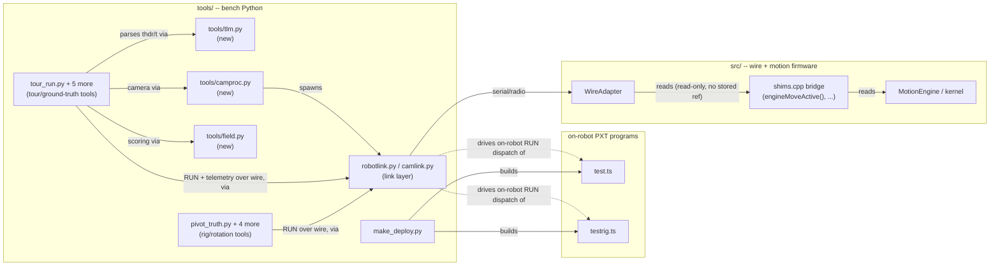

<!-- CLASI: Before changing code or making plans, review the SE process in CLAUDE.md -->

# Sprint 005: Retrofit bench tooling onto the v6 telemetry stream

> **Precondition satisfied (2026-08-24, tovez).** Sprint 004 closed and its
> Phase C bench checkpoint passed on real hardware: a flashed robot (hex
> from master at `4e14817`, sprints 004+006+007+008 merged) confirmed
> emitting `thdr`/`t` frames over both USB serial and radio, with the
> exact column names and order this sprint's plan assumed, header-memo
> cadence matching `kHeaderRefreshFrames = 20`, and — in a second capture
> with the kernel awake and the robot driving — real non-zero payload
> values (`t 25 988992 31 142 -16 11737 0 0 0 -122 126 3 101 286 3319
> -1300 1800 0 0 0`, 75 B, comfortably under the 200 B radio cap). Full
> evidence is captured in
> `clasi/issues/retrofit-bench-tooling-onto-the-v6-telemetry-stream.md`
> under "Bench confirmation of the v6 frame" and "Realistic-value
> capture". This sprint is now detail-planned against that confirmed wire
> format — see Architecture and Use Cases below.

## Goals

This is the **host-tooling sprint** — the second of a two-sprint arc closing
`retrofit-bench-tooling-onto-the-v6-telemetry-stream.md`. Sprint 004 makes
radio a full v6 transport and gives v6 a `thdr`/`t` telemetry frame; this
sprint retrofits six bench tools onto that frame through one new shared
parser, `tools/tlm.py`, and makes "the instrument returned nothing" a loud,
immediate failure instead of a silent empty CSV.

The same 2026-08-23 code-review pass that unblocked this sprint surfaced
three further, related defects now folded in here rather than deferred to
their own sprints, because all three share this sprint's host — the Python
tool suite and the wire boundary it drives — closely enough that splitting
them would mean re-deriving the same link-layer and wire-frame context from
scratch:

- **`tools-link-layer-consolidation.md` (R-24/R-26)** — stale hardcoded
  venvs, a swallowed camera `ERR` channel, and seven copied `Cam` wrapper
  scaffolds with two incompatible tuple orders.
- **`wire-motion-completion-signal.md` (R-23)** — `WireAdapter`'s
  `lastDone()`/`lastDoneReason()` are permanently inert; this sprint's own
  closed-loop tooling needs a real completion signal.
- **`testfiles-are-not-type-checked-testrig-is-broken.md` (R-16)** —
  `testrig.ts` fails to build, and separately, the numeric `RUN:<n>`
  vocabulary five bench tools still send is a silent no-op against
  current firmware's named-verb dispatch.

## Problem

All six bench tools currently parse the retired v5 `TLM:` cleartext line:
`tour_run.py`, `tour_capture.py`, `tour_watch.py`, `truth_check.py`,
`rotation_check.py`, and `tour_practice.py`. Each has its own scattered
`/10.0`, `/100.0`, and field-count arity logic. Two problems make this
sprint's shape non-optional rather than a style preference:

1. **Two of the six tools are already silently dead, independent of v6.**
   `tour_watch.py:202` tests `len(f) == 7` and `tour_capture.py:70` accepts
   only lengths 7, 4, or 3 — but the retired v5 line carried **nine**
   fields. Both branches died when `vl`/`vr` were added and nobody noticed,
   because the failure mode is an empty CSV, not a crash. Six scattered
   parsers is how that kind of breakage hides; one shared parser is the
   fix, not just a refactor for its own sake.
2. **An instrument that returns nothing is indistinguishable from a robot
   that did nothing.** This project's recurring, expensive failure mode is
   a tour scored against an empty or header-only telemetry file producing
   confident, wrong conclusions. Fail-loud guards against that are
   acceptance criteria for this sprint, not polish.

## Solution

New `tools/tlm.py` — the single place any scale factor is written. A
`TlmStream` class tracks the `thdr` column header (re-emitted by firmware
at ~1 Hz so a late-attaching consumer can resync; an identical re-read is a
no-op) and feeds `t` lines, exposing `frames`, `orphan_frames` (a `t` before
any header), `malformed` (a `t` whose value count disagrees with the
header — the defense against `RadioTransport`'s 200-byte line truncation),
and `dropped`/`loss_pct` (from `seq` gaps — a 7-bit wrapping counter at
20 Hz, unambiguous up to ~6.4 s of loss). Unit-conversion helpers
(`pose_cm`, `otos_cm`, `wheels_mms`) live here too, so no consumer computes
its own scale factor again.

Three fail-loud guards, all acceptance criteria:

1. `require_stream(link, timeout=3.0)` subscribes (`TLM POSE`) and aborts
   **before** a run is triggered if no `t` frame arrives — a dead
   instrument must not cost a run.
2. `write_tlm_csv()` raises on zero rows. Never write a header-only CSV. An
   absent file is unambiguous; an empty one produces confident, wrong
   conclusions.
3. A `<stem>_tlm.meta.json` sidecar records frames / dropped / loss_pct /
   orphan_frames / malformed / columns / duration; `tour_chart.py` and
   `practice_chart.py` refuse to plot a run with `frames == 0`.

Then retrofit the six consumers onto `TlmStream`, deleting their scattered
arity ladders and scale factors. `truth_check.py` and `rotation_check.py`'s
`enc_heading()` becomes "read `h` from the last `t` frame," returning
`None` (so the caller aborts) rather than silently reporting a stale or
zero heading.

New capability worth calling out on its own: `seq`-gap tracking gives
`dropped`/`loss_pct` for the first time — the tools have never before been
able to say how much the radio link dropped. The loss report is an
acceptance criterion of the retrofit, not a nice-to-have; a column nothing
consumes is decoration.

## Success Criteria

- `tools/tlm.py` is the only place a telemetry scale factor is written;
  all six consumers import it instead of parsing lines themselves.
- All three fail-loud guards are implemented and tested: `require_stream`
  aborts before a run on a dead instrument; `write_tlm_csv` raises rather
  than writing a header-only CSV; the chart tools refuse a zero-frame run.
- `seq`-gap tracking produces a real `dropped`/`loss_pct` figure, surfaced
  in the `.meta.json` sidecar and in at least one tool's console output.
- The two pre-existing dead branches (`tour_watch.py:202`,
  `tour_capture.py:70`) are gone along with the rest of the per-tool arity
  logic they belonged to.
- `tests/tools/test_tlm.py` passes: header tracking, seq-gap counting,
  arity rejection, orphan frames, unit helpers.
- End-to-end: a real `tour_run.py --tour world` run against actual
  hardware produces a non-empty CSV and a loss report.
- `pyproject.toml` declares `pyserial`; `uv run python -c "import
  robotlink"` (from `tools/`) succeeds under the project's own venv, not
  only under the system interpreter.
- Camera process spawn/interpreter resolution lives in one place
  (`tools/camproc.py`), not six hardcoded spawn sites; a camera `ERR` line
  reaches the calling tool instead of being discarded; a mid-session
  stream death invalidates the last known pose rather than letting
  `place()`/`fix()` re-seed from a frozen value. The 7 copied `Cam`
  wrappers and 6 duplicated playfield-constant blocks collapse onto
  `tools/field.py` plus the existing shared `Cam` in `camlink.py`.
- `WireAdapter::lastDone()`/`lastDoneReason()` report real values for all
  six motion verbs; host tests cover each of the five terminal reasons
  (done, superseded, timeout, stall, estop) against the real adapter, not
  only the mock.
- `test/testrig.ts` builds clean and its numeric `RUN:<n>` vocabulary
  reaches the right branch again; `tools/make_deploy.py`'s testFiles
  handling can no longer silently drop a `testFiles` entry from what
  actually gets built/type-checked.
- `pivot_truth.py`, `truth_check.py`, `rotation_check.py`, `turn_sweep.py`,
  and `otos_levercal.py` send RUN strings that match a real handler on
  current firmware — verified against a mocked link (no robot required).

## Scope

### In Scope

- New `tools/tlm.py`: `TlmStream`, header tracking, `frames` /
  `orphan_frames` / `malformed` / `dropped` / `loss_pct`, and the
  `pose_cm`/`otos_cm`/`wheels_mms` unit helpers.
- The three fail-loud guards: `require_stream()`, a raising
  `write_tlm_csv()`, and the `<stem>_tlm.meta.json` sidecar plus the
  zero-frame refusal in `tour_chart.py` and `practice_chart.py`.
- Retrofitting all six consumers: `tour_run.py`, `tour_capture.py`,
  `tour_watch.py`, `truth_check.py`, `rotation_check.py`,
  `tour_practice.py` — including removing the two already-dead
  field-count branches (`tour_watch.py:202`, `tour_capture.py:70`) and
  every scattered `/10.0`/`/100.0` scale factor.
- `tests/tools/test_tlm.py` (lives under `tests/`, per `pyproject.toml`'s
  `testpaths = ["tests"]` — not under `tools/`), importing the shared
  golden frame from `tests/host/golden_telemetry.py` as parser input.
- An end-to-end real-hardware `tour_run.py --tour world` check producing a
  non-empty CSV and a loss report.
- New `tools/camproc.py` (camera subprocess spawn, interpreter
  resolution, `ERR` surfacing, staleness) and `tools/field.py` (playfield
  constants, `wrap()`, corner scoring), routing every tool through
  `robotlink`/`camlink` instead of a per-tool copy; `pyproject.toml`
  gains a `pyserial` dependency.
- `WireAdapter`'s completion channel: real `lastDone()`/`lastDoneReason()`
  for all six motion verbs, backed by WireAdapter's own existing
  lease-deadline bookkeeping plus one new thin, read-only `shims.cpp`
  bridge function; `Wire::DoneReason` gains `kStall`. Host tests for each
  terminal reason.
- `test/testrig.ts`'s `onRunCommand` fix (stores the parsed verb name, not
  the always-zero arg); `tools/make_deploy.py`'s testFiles handling so
  `testrig.ts` cannot again silently vanish from what actually gets
  built; two new named RUN verbs on `test/test.ts` (relative pivot,
  turn-rate) and retargeting `pivot_truth.py`, `truth_check.py`,
  `rotation_check.py`, `turn_sweep.py`, and `otos_levercal.py` off their
  dead numeric `RUN:<n>` vocabulary.

### Out of Scope

- Anything in sprint 004: the `WireHandler`/`RadioSink` radio transport
  work, the `thdr`/`t` frame emitter, `STATUS i2cf=`, or any firmware
  change to the telemetry path itself. This sprint only consumes the wire
  format sprint 004 produces.
- Any change to `radio-robot-lib` (spec authority, out of this project's
  scope regardless of sprint) — this includes the shape of `Wire::Adapter`
  itself; `DoneReason`'s new `kStall` value is local to this project's own
  `wire_handler.h`, not a radio-robot-lib type.
- Generalizing `DoneReason`/the completion channel beyond the five
  reasons this sprint's six existing motion verbs need (no motion queue,
  no completion history, no new wire verb).
- Porting `testrig.ts`'s whole numeric vocabulary (OTOS probe/servo/drum/
  lever-arm, `RUN:20`..`RUN:54180+deg`) to named verbs — only the
  dispatch bug that makes it unusable is in scope; see Design Rationale.
- Camera calibration, playfield re-mapping, or any change to
  `camlink.py`'s gRPC stream itself — the consolidation targets spawn/
  staleness/scoring duplication around it, not the stream.
- Fixing the two open hardware defects noted in the stakeholder brief
  (`get-full-duty-velocity-returns-garbage.md`'s GET/duty mismatch, the
  never-ticked/dead-brick ambiguity) — tooling must not assume they work,
  but fixing them is separately scoped.

## Test Strategy

`tests/tools/test_tlm.py` (under `tests/`, not `tools/`, per
`pyproject.toml`'s `testpaths`): header tracking (including the 1 Hz
re-emit no-op case), seq-gap counting and wraparound, arity/malformed
rejection, orphan-frame counting before any header, and the unit-helper
conversions. The shared golden frame in `tests/host/golden_telemetry.py`
is imported here as parser input — the same fixture sprint 004's firmware
test uses as expected sink bytes, so emitter and parser cannot drift apart
even though they're built in different sprints. Beyond unit tests, an
end-to-end check: a real `tour_run.py --tour world` against hardware
producing a non-empty CSV and a non-trivial loss report — the fail-loud
guards are only proven by trying to break them on a live, imperfect radio
link, not just by unit tests against synthetic data.

## Architecture

**Substantial** — 3+ modules touched (new `tools/tlm.py`,
`tools/camproc.py`, `tools/field.py`; changed `src/wire_adapter.{h,cpp}`,
`src/wire_handler.h/.cpp`, `src/shims.cpp`; changed `test/test.ts`,
`test/testrig.ts`, `tools/make_deploy.py`; six retrofitted consumer
tools), a genuinely new cross-module dependency (`WireAdapter` gains a
read into `MotionEngine`'s own move-active state, crossing a boundary the
codebase has deliberately held open since sprint 003 ticket 012), and a
data-shape change (`Wire::DoneReason` gains `kStall`; new
`<stem>_tlm.meta.json` sidecar shape). The full 7-step methodology
applies, with a required component diagram (see below).

### Architecture Overview

**Step 1 — the problem.** Four issues share one host: the Python bench
tool suite and the wire boundary it drives. (1) Six tools still parse a
retired v5 line and two are already silently dead. (2) The tool suite has
stale hardcoded venvs, a swallowed camera error channel, and seven copied
scaffolds. (3) The wire's motion-completion channel has been permanently
inert since sprint 003, and this sprint's own closed-loop tooling is the
first real consumer that needs it. (4) `testrig.ts` fails to build, the
build tooling that would have caught it silently excludes it, and five
bench tools send a numeric RUN vocabulary current firmware's named-verb
dispatch has no branch for.

**Step 2 — responsibility groups.**

1. **Telemetry parsing & fail-loud guards** (issue 1) — decode `thdr`/`t`
   frames, track header/seq state, convert units, refuse to produce
   confidently-wrong output from no data.
2. **Link-layer process/environment hygiene** (issue 2) — resolve the
   right Python interpreter once, surface camera transport errors instead
   of swallowing them, and stop seven tools each re-inventing playfield
   geometry and a `Cam` wrapper.
3. **Wire motion-completion signal** (issue 3) — give `WireAdapter`'s
   already-declared `lastDone()`/`lastDoneReason()` real values, sourced
   from state the wire layer already owns or can cheaply read.
4. **On-robot RUN-vocabulary correctness** (issue 4) — fix the dispatch
   bug that makes `testrig.ts` unusable, fix the build tooling that let
   it go unbuilt, and give the five bench tools sending dead numeric RUN
   strings a real named target.
5. **Verification** — host tests for 1 and 3 (both host-testable today);
   mocked-link tests for 4's RUN-string retargeting; a real-hardware
   end-to-end check for 1's fail-loud guards, isolated to its own
   handoff ticket per this project's no-hardware-in-acceptance-criteria
   convention.

**Step 3 — modules.**

| Module | Purpose (one sentence) | Boundary | Serves |
|---|---|---|---|
| `tools/tlm.py` (new) | Be the single trustworthy source of decoded v6 telemetry, refusing to represent absent or malformed data as real. | Knows wire-frame syntax, header caching, seq-gap loss math, and unit scale factors; does not know tour semantics, camera state, or CLI argument parsing. | SUC-001, SUC-002, SUC-003 |
| `tools/camproc.py` (new) | Own camera-subprocess lifecycle: interpreter resolution, spawn, `ERR` surfacing, staleness detection. | Knows how to start/watch/stop a `camlink.py` subprocess and report its health; does not know playfield geometry or corner scoring. | SUC-004, SUC-005 |
| `tools/field.py` (new) | Own playfield geometry: dot/corner constants, `wrap()`, corner scoring. | Pure data/geometry, no process or I/O of its own; consumes `camlink.py`'s existing shared `Cam`, does not re-wrap it. | SUC-005 |
| `tools/robotlink.py` (changed, small) | Unchanged responsibility (USB/radio link); gains no new code beyond what the `pyserial` dependency fix requires. | Same as today. | SUC-004 |
| Six tour/ground-truth consumers (`tour_run.py`, `tour_capture.py`, `tour_watch.py`, `truth_check.py`, `rotation_check.py`, `tour_practice.py`) | Drive one tour or ground-truth measurement, recording what came back through `tools/tlm.py` rather than parsing wire lines themselves. | Own CLI/orchestration only; own no scale factor or arity logic after this sprint. | SUC-001, SUC-002, SUC-003 |
| `tour_chart.py` / `practice_chart.py` (changed, small) | Plot recorded runs. | Gains one guard: refuse `frames == 0` from the `.meta.json` sidecar. | SUC-002 |
| `src/wire_handler.h`/`.cpp` (changed, small) | Own the wire-level `DoneReason` vocabulary, spelling included. | Gains one enumerator (`kStall`) and one `doneReasonWireName()` case; the ack/nack format itself is unchanged. | SUC-006 |
| `src/shims.cpp` (changed, small) | Be the sole seam between `wire_adapter.cpp` and the `Rig`/`MotionEngine`/kernel it never holds a reference to. | Gains one new thin, read-only, forward-declared free function (`engineMoveActive()`), matching the existing `engineWheelsX()`-style convention exactly. | SUC-006 |
| `src/wire_adapter.h`/`.cpp` (changed) | Report real motion-completion state instead of the inert default. | Reads its own existing lease-deadline bookkeeping plus the one new bridge function and the diagnostic-flags path already threaded through for `stall_halted`/`estopped`; still holds no reference to `MotionEngine`/`Rig`. | SUC-006 |
| `test/testrig.ts` (changed, small) | The zeguz OTOS rig's on-robot dispatch. | One-line dispatch fix; vocabulary itself (its numeric offsets) is unchanged. | SUC-007 |
| `test/test.ts` (changed, small) | The playfield test program's named RUN-verb surface. | Gains two named verbs (relative pivot, turn-rate), following the exact `runArg()` pattern `goto`/`face` already use. | SUC-008 |
| `tools/make_deploy.py` (changed, small) | Generate the scratch deploy manifest from the repo's own `pxt.json`. | Its `testFiles`-promotion filter widens so a declared test file cannot again silently vanish from what gets built/type-checked. | SUC-007 |
| Five ground-truth/rig tools (`pivot_truth.py`, `truth_check.py`, `rotation_check.py`, `turn_sweep.py`, `otos_levercal.py`) | Drive on-robot rotation/lever-arm measurement. | Send named RUN verbs instead of dead numeric offsets; no other behavior changes. | SUC-008 |

**Step 4 — component diagram.** Required: 3+ modules touched and a new
cross-module dependency (`WireAdapter` → the engine/kernel bridge). No
ERD — nothing here is a persisted, related-entity data model; the two
data-shape changes (`DoneReason`'s new enumerator, the `.meta.json`
sidecar) are message/file shapes, described in the module table and
Migration Concerns instead. No separate dependency graph beyond this
diagram — it already shows every new edge, and none of them create a
cycle: `WireAdapter` still never holds a `MotionEngine`/`Rig` reference,
only a one-way, forward-declared, read-only function call, the same
shape every existing bridge function already has.

**Step 5 — What Changed / Why / Impact / Migration Concerns.**

*What Changed*: see the module table (Step 3) — five new/changed Python
modules, three changed C++ files, two changed TypeScript files, one
changed build-tooling file.

*Why*: each responsibility group (Step 2) traces directly to one of the
four linked issues, each independently confirmed by the 2026-08-23 code
review or by this session's own hardware bench capture.

*Impact on Existing Components*: `tools/robotlink.py` and `tools/
camlink.py` are unchanged in behavior (robotlink gains only a dependency
fix; camlink's shared `Cam` gains real consumers instead of copies, no
API change). `wire_handler.h`'s `DoneReason` enum widens additively — no
existing wire consumer reads `kStall` today, so nothing breaks. `test.ts`'s
own header comment (lines 9-14, the authoritative "Other named commands"
list) gains two entries, kept in sync as an acceptance criterion.
`tools/DESIGN.md`'s "Known limitation — the telemetry gap" section
becomes stale the moment `tlm.py` lands and must be rewritten to describe
the new parser, not the retired vocabulary (see the design overlay).

*Migration Concerns*: None for persisted data (no database). Wire
backward compatibility: `DoneReason`'s wire spelling is free text per the
existing `doneReasonWireName()` switch (S8.8), so adding `"stall"` cannot
break a host that has never seen it. No hard ordering constraint between
issue 1's ticket and issue 3's ticket — the Python retrofit depends on
sprint 004's already-shipped `thdr`/`t` frame, not on the completion
channel. `testrig.ts`'s dispatch fix and `make_deploy.py`'s testFiles
fix should land together so the sprint's own build-checkpoint ticket can
prove both at once. **Risk called out explicitly for the implementing
ticket**: `test.ts` and `testrig.ts` are two independent, mutually
exclusive on-robot programs (playfield robot vs. the zeguz drum rig),
each with its own top-level `basic.forever` loop and button handlers —
`make_deploy.py`'s existing `sync()` deliberately promotes only `test.ts`
into the flashable hex's `files` (see its own docstring: "so the hex
actually has the button handlers"). Widening the `testFiles`-promotion
filter must fix the exclusion bug (`testrig.ts` cannot again silently
disappear from what gets built/type-checked) **without** also promoting
`testrig.ts` into `files` alongside `test.ts` — that would compile both
programs' top-level code into one hex and is not a "wider filter," it is
a different, wrong deploy shape. The ticket should check/build
`testrig.ts` on its own terms (e.g. a second, separate scratch variant,
or a type-check-only pass), not fold it into `test.ts`'s deploy.

### Design Rationale

**Decision: one new shims.cpp bridge function, not a live `MotionEngine`
reference on `WireAdapter`.**
*Context*: `WireAdapter::lastDone()`/`lastDoneReason()` have been
inert since sprint 003 ticket 012, by explicit, documented decision —
`wire_adapter.h`'s own header comment calls this "a natural candidate to
revisit once a real use case needs [it] to mean something." This sprint
is that use case.
*Alternatives considered*: (a) leave it inert — rejected, `wire-motion-
completion-signal.md` (R-23) now names it a landmine this sprint's own
closed-loop tooling runs into; (b) give `WireAdapter` a direct reference
to `Rig`/`MotionEngine` — rejected, it breaks the decoupling boundary
`wire_adapter.cpp`/`shims.cpp` have held deliberately since ticket 012,
for a signal only one new one-way read actually requires; (c) give every
one of the six bridge functions (`engineWheelsX()`, `engineMoveX()`, …) a
stateful "how did the last call end" return value — rejected, it touches
six call sites to answer a question only the goal-directed verbs
(MOVE_X/GO_TO_R/GO_TO_W) actually need, since lease-style verbs
(WHEELS_V/WHEELS_X/MOVE_V) already resolve done-vs-timeout-vs-superseded
from `WireAdapter`'s own existing `motionObligationActive_`/
`motionObligationDeadlineMs_` bookkeeping with no new dependency at all.
*Why this choice*: exactly one new, thin, read-only, forward-declared
free function (`engineMoveActive()`), matching the existing convention
byte-for-byte; `stall`/`estop` need no new plumbing at all, since
`stall_halted`/`estopped` already reach `WireAdapter` through the
diagnostic-flags path `computeFlags()`/`diagValue()` already use for
STATUS and telemetry.
*Consequences*: the decoupling boundary gains exactly one new edge, in
the same direction and shape every existing edge already has — no cycle,
no widened fan-out beyond one.

**Decision: `DoneReason` gains `kStall`, not an overload of `kAborted`
or `kEstop`.**
*Context*: the issue's own target vocabulary is "done, superseded,
timeout, stall, estop" — five reasons, but the existing enum only
spells four (`kStop`/`kTimeout`/`kEstop`/`kAborted`, plus `kNone`).
*Alternatives*: fold stall into `kAborted` — rejected, a stalled
drivetrain and a superseded command are different failure classes a
host needs to tell apart (one might retry a superseded move immediately,
the other should not); fold into `kEstop` — rejected, stall is
drivetrain-local, not the same safety condition. *Why this choice*: one
new, purely additive wire-spelled reason ("stall"), matching `stallLatch`
semantics the kernel already tracks. *Consequences*: `kAborted` is
repurposed as "superseded" for this sprint's purposes ("the caller
abandoned it" already covers a new command replacing a still-live one
before it finished) — no enum growth needed for "superseded" itself.

**Decision: `testrig.ts` gets a one-line dispatch fix, not a port to
named verbs.**
*Context*: the bug is `onRunCommand(function(name, n) { rigPending = n
})` storing `arg` (always 0 for every bare `RUN:<n>`), not `name` — a
storage bug, not a vocabulary design problem.
*Alternatives*: port testrig.ts's whole dense, offset-encoded vocabulary
(`RUN:20`..`RUN:54180+deg`) to named verbs, matching `test.ts`'s
convention — rejected for this sprint: it is exercised only by
`otos_bench.py`, nothing else depends on it, and a wider port is not
required to make it work again. *Why this choice*: restore the numeric
compatibility dispatch — the second option `testfiles-are-not-type-
checked-testrig-is-broken.md` itself offers — by parsing `name` as the
verb number. *Consequences*: `otos_bench.py` needs no change at all;
the vocabulary itself remains exactly as documented in `testrig.ts`'s
own header comment.

**Decision: two new named verbs on `test.ts`, not a numeric-compat path
there too.**
*Context*: `pivot_truth.py`, `truth_check.py`, `rotation_check.py`, and
`turn_sweep.py` send numeric offsets (`RUN:2/4/5/10`, `RUN:57000+rate`,
`RUN:58360+deg`) that match no handler — `test.ts` migrated fully to
named verbs and has no catch-all `onRunCommand`. `otos_levercal.py`'s
`RUN:8`/`RUN:14` already have a real named equivalent (`RUN:cal`/
`RUN:cal:1` — confirmed against `test.ts`'s own header comment and
`leverCal(verify)`'s `OCAL:begin`/`OCAL:end` output), so it needs only a
Python-side rename, no firmware change.
*Alternatives*: restore a numeric path in `test.ts` too — rejected, it
re-creates the exact ambiguity this sprint removes elsewhere, and
`test.ts` has no catch-all handler to hang it on; drop the four
still-broken tools from scope — rejected, they are the instruments this
project's own hardware-calibration history depends on (the 38.2 mm lever
arm, the `rotationalSlip` baseline). *Why this choice*: two small named
verbs (relative pivot, turn-rate), using the exact `runArg()`-based
pattern `goto`/`face` already establish. *Consequences*: `test.ts`'s own
header comment (its authoritative named-command list) must be updated in
the same ticket, or it becomes another stale-doc landmine on day one.

**Decision: `tools/camproc.py` and `tools/field.py` stay two modules,
not one.**
*Context*: `tools-link-layer-consolidation.md` asks for both process
hygiene and geometry/scoring consolidation.
*Alternatives*: one combined module — rejected, it fails the cohesion
test: camera process lifecycle changes because of environment/venv
drift; playfield geometry and corner scoring change because of a
recalibration. Different change reasons, same module would mean neither
description fits in one sentence without "and." *Why this choice*: two
modules, one per responsibility, each consuming the existing shared
`Cam` in `camlink.py` rather than re-wrapping it.

### Migration Concerns

None beyond what Step 5 already states: no persisted data, additive wire
vocabulary, and one stated build-order preference (`testrig.ts`'s fix and
`make_deploy.py`'s filter fix land together, proven by the same
build-checkpoint ticket).

### Open Questions

1. `lastDone()`'s numeric value has never been given a concrete meaning
   anywhere in this codebase or in `radio-robot-lib`'s own reference
   adapter (which also leaves it permanently inert). This sprint's own
   plan is to return the accepted `id` of whichever motion verb most
   recently reached a terminal state — that is what makes `ack <id>
   <lastDone> <reason>` legible to a future host — but no real wire host
   exists yet to confirm the convention against. Flag for stakeholder
   confirmation if it surfaces during ticket execution; not a blocker to
   starting.
2. `tools/camproc.py`'s interpreter-resolution mechanism (an env var vs.
   a small config file) is left to the implementing ticket; the only firm
   requirement (from the issue itself) is that it resolve once, in one
   place, never hardcoded per spawn site.

## Use Cases

None of `docs/design/usecases.md`'s UC-001..UC-016 cover bench tooling or
wire-protocol behavior (they are all student-facing block use cases) —
every SUC below is bench/host-tooling scope, following sprint 004's own
precedent for this project's wire-protocol and tooling work.

### SUC-001: Bench Tool Detects a Dead Telemetry Instrument Before Wasting a Run
Parent: N/A (bench/host use case; no student-facing block equivalent)

- **Actor**: A bench operator running `tour_run.py` (or any of the six
  retrofitted tools) against a robot that never subscribes or never
  emits `t` frames (dead radio, wedged firmware, wrong channel).
- **Preconditions**: The tool has opened a link and is about to trigger a
  run.
- **Main Flow**:
  1. Tool calls `require_stream(link, timeout=3.0)`, which sends
     `TLM POSE` and waits for one `t` frame.
  2. No `t` frame arrives within the timeout.
  3. `require_stream()` raises before the run-triggering `RUN:` command
     is ever sent.
- **Postconditions**: No run was wasted on a dead instrument; the failure
  is loud and immediate, not a silent empty CSV forty seconds later.
- **Acceptance Criteria**:
  - [ ] A unit test feeds `TlmStream` zero frames within the timeout
        window and asserts `require_stream()` raises before any `send()`
        of a run-triggering command is observed on a fake link.
  - [ ] A unit test feeds one `t` frame inside the timeout and asserts
        `require_stream()` returns normally.

### SUC-002: Bench Tool Refuses to Write a Header-Only Telemetry CSV
Parent: N/A (bench/host use case; no student-facing block equivalent)

- **Actor**: Any of the six retrofitted tools, after a run that produced
  zero telemetry rows (e.g. the robot moved but the stream died mid-run).
- **Preconditions**: `TlmStream` has accumulated zero `frames`.
- **Main Flow**:
  1. Tool calls `write_tlm_csv()` at the end of the run.
  2. `write_tlm_csv()` raises instead of writing a header-only file.
  3. Separately, `tour_chart.py`/`practice_chart.py` reads a run's
     `<stem>_tlm.meta.json` sidecar and refuses to plot a `frames == 0`
     run.
- **Postconditions**: An absent CSV/refused plot is the unambiguous
  signal of "no data," never confused with "the robot did nothing."
- **Acceptance Criteria**:
  - [ ] A unit test asserts `write_tlm_csv()` raises on zero rows and
        that no file is left on disk.
  - [ ] A unit test asserts `write_tlm_csv()` writes normally for one or
        more rows, and that the `.meta.json` sidecar's `frames` field
        matches.
  - [ ] A unit test asserts the chart tools' zero-frame refusal path is
        reached given a `frames: 0` sidecar.

### SUC-003: Bench Operator Reads Radio Loss From a Tour's Telemetry
Parent: N/A (bench/host use case; no student-facing block equivalent)

- **Actor**: A bench operator reviewing a completed tour's console output
  or `.meta.json` sidecar.
- **Preconditions**: A run has completed with some frames dropped (a
  `seq` gap observed mid-stream).
- **Main Flow**:
  1. `TlmStream` tracks `seq` (a 7-bit wrapping counter at 20 Hz) across
     consecutive `t` frames and counts the gap into `dropped`.
  2. `loss_pct` is computed from `dropped` against frames-plus-dropped.
  3. The figure is surfaced in the `.meta.json` sidecar and in at least
     one tool's console output.
- **Postconditions**: The operator can, for the first time, say how much
  the radio link dropped during a specific run.
- **Acceptance Criteria**:
  - [ ] A unit test feeds a `seq` sequence with a known gap and asserts
        `dropped`/`loss_pct` match the expected count.
  - [ ] A unit test exercises 7-bit wraparound (`seq` rolling from 127
        back to 0) and asserts it is not miscounted as loss.

### SUC-004: Bench Tooling Runs Under the Project's Own Dev Environment
Parent: N/A (bench/host use case; no student-facing block equivalent)

- **Actor**: A developer or agent running bench tooling via `uv run
  python`, the project's own declared dev environment.
- **Preconditions**: `pyproject.toml` lacks a `pyserial` dependency
  (today's state) — `tools/robotlink.py` cannot be imported under `uv
  run python`, only under the system interpreter.
- **Main Flow**:
  1. `pyproject.toml` declares `pyserial`.
  2. `uv run python -c "import robotlink"` (from `tools/`) succeeds.
  3. Separately, camera-spawning tools resolve the AprilTags interpreter
     from one place (`tools/camproc.py`), not six hardcoded paths.
- **Postconditions**: Every bench tool in `tools/` runs under the same
  interpreter the project's own tests run under, for the link layer at
  least (the camera daemon still runs under its own pipx/AprilTags venv
  by design, per `tools/DESIGN.md`).
- **Acceptance Criteria**:
  - [ ] `uv run python -c "import sys; sys.path.insert(0,'tools');
        import robotlink"` exits zero.
  - [ ] A unit test (or direct read) confirms no `tools/*.py` spawn site
        still hardcodes the AprilTags venv path directly — all route
        through `tools/camproc.py`'s single resolution point.

### SUC-005: Camera Stream Death Mid-Tour Is Surfaced, Not Silently Scored
Parent: N/A (bench/host use case; no student-facing block equivalent)

- **Actor**: A bench operator running a camera-scored tour when the
  camera subprocess dies partway through.
- **Preconditions**: A tool has an open `camproc`-managed camera
  subprocess and a `latest` pose cache.
- **Main Flow**:
  1. The camera subprocess emits an `ERR` line (or exits).
  2. `camproc` surfaces it to the calling tool instead of discarding it
     (today's `stderr=DEVNULL` behavior).
  3. The tool's `latest`/cached pose is invalidated rather than left to
     `fix()`/`place()` re-seed the robot's world frame from a frozen,
     stale value.
- **Postconditions**: A mid-session camera death is a visible failure,
  not a silently wrong scoring result.
- **Acceptance Criteria**:
  - [ ] A unit test simulates a camera `ERR` line and asserts the calling
        tool observes it (not a swallowed/discarded event).
  - [ ] A unit test asserts a stale cached pose is not returned as fresh
        after the stream has been marked dead.

### SUC-006: A Wire Host Observes Real Motion Completion and Its Reason
Parent: N/A (bench/host use case; closes `wire-motion-completion-
signal.md`, directly enables this sprint's own closed-loop tooling)

- **Actor**: Any sequenced-verb wire host (bench tool or future fleet
  host) that has issued a motion verb and polls `lastDone()`/
  `lastDoneReason()` via a subsequent ack/nack.
- **Preconditions**: A motion verb (one of the six) has been accepted.
- **Main Flow**:
  1. The motion completes on its own terms (reaches its stop condition)
     → `lastDoneReason()` reports `kStop` ("done").
  2. A later motion verb arrives and supersedes a still-live one →
     the superseded one's outcome reports `kAborted` ("superseded").
  3. A lease-style verb's deadline elapses with nothing superseding it →
     `kTimeout`.
  4. The kernel's stall latch is set during the move → `kStall`.
  5. An ESTOP lands during the move → `kEstop`.
- **Postconditions**: A wire host can distinguish all five terminal
  states without polling STATUS `active` at poll granularity.
- **Acceptance Criteria**:
  - [ ] A host test drives each of the five terminal reasons against the
        real `WireAdapter` (not `WireMockAdapter`) and asserts
        `lastDoneReason()`/`doneReasonWireName()` report the correct
        wire string.
  - [ ] A host test confirms `lastDone()`/`lastDoneReason()` are read
        fresh on every ack/nack (matching the existing S8.8 contract),
        not cached across calls, for the newly-real values too.
  - [ ] A host test confirms an in-flight WHEELS_V superseded by a new
        WHEELS_V before its lease expires reports `kAborted`, not
        `kTimeout`.

### SUC-007: The Repo's Declared testFiles Actually Get Built
Parent: N/A (bench/host use case; closes `testfiles-are-not-type-checked-
testrig-is-broken.md`'s build-hygiene half)

- **Actor**: A developer running `tools/make_deploy.py` (or the sprint's
  own build-checkpoint ticket).
- **Preconditions**: `pxt.json`'s `testFiles` lists both `test/test.ts`
  and `test/testrig.ts`; `make_deploy.py`'s promotion filter today
  matches only files whose name ends exactly in `test.ts`, silently
  excluding `testrig.ts`.
- **Main Flow**:
  1. `make_deploy.py`'s testFiles handling widens so `testrig.ts` cannot
     again silently vanish from what actually gets built/type-checked.
  2. `testrig.ts`'s own dispatch fix (SUC-008's firmware half) is in
     place, so the build succeeds rather than surfacing a fresh type
     error.
  3. A build run (this sprint's mandatory build-checkpoint ticket)
     exercises both files.
- **Postconditions**: The working build and the repo's own declared
  manifest cannot silently diverge the way they did before this sprint.
- **Acceptance Criteria**:
  - [ ] A unit test (extending `tests/tools/test_make_deploy_triage.py`
        or a new sibling) asserts `testrig.ts` is included in whatever
        `make_deploy.py` builds/type-checks, given a `pxt.json` fixture
        listing both files.
  - [ ] The sprint's build-checkpoint ticket produces a flashable hex
        with no compile diagnostic from either `test.ts` or `testrig.ts`.

### SUC-008: Ground-Truth Bench Tools Drive Real Robot Verbs Instead of Silent No-Ops
Parent: N/A (bench/host use case; closes `testfiles-are-not-type-checked-
testrig-is-broken.md`'s RUN-vocabulary half)

- **Actor**: A bench operator running `pivot_truth.py`, `truth_check.py`,
  `rotation_check.py`, `turn_sweep.py`, or `otos_levercal.py` against
  current firmware.
- **Preconditions**: Today, each of these sends a numeric `RUN:<n>`
  string that matches no handler in `test.ts` (named-verb-only dispatch)
  and silently does nothing; `testrig.ts`'s own `onRunCommand` stores the
  always-zero `arg` instead of the parsed verb name.
- **Main Flow**:
  1. `test.ts` gains two new named verbs (relative pivot, turn-rate);
     `otos_levercal.py` is retargeted onto the already-working
     `RUN:cal`/`RUN:cal:1`.
  2. The five tools' RUN strings are updated to match.
  3. `testrig.ts`'s dispatch fix restores its own numeric vocabulary for
     `otos_bench.py`.
- **Postconditions**: Every RUN string these tools send matches a real,
  reachable handler.
- **Acceptance Criteria**:
  - [ ] A unit test, for each of the five tools, asserts the exact RUN
        string sent matches one of `test.ts`'s or `testrig.ts`'s
        documented named/numeric verbs (a string-level check against a
        mocked link, no robot required).
  - [ ] `test.ts`'s own header comment (its authoritative named-command
        list, lines 9-14) is updated to list the two new verbs.

## GitHub Issues

(GitHub issues linked to this sprint's tickets. Format: `owner/repo#N`.)

## Definition of Ready

Before tickets can be created, all of the following must be true:

- [ ] Sprint planning document is complete (sprint.md, including its
      Architecture and Use Cases sections)
- [ ] Architecture review passed (or skipped, for changes with no
      architectural impact)
- [ ] Stakeholder has approved the sprint plan

## Tickets

| # | Title | Depends On |
|---|-------|------------|
| 001 | tools/tlm.py: shared v6 telemetry parser and fail-loud guards | — |
| 002 | Retrofit the six tour/ground-truth tools onto tools/tlm.py | 001 |
| 003 | Link-layer consolidation: pyserial fix, tools/camproc.py, tools/field.py | 002 |
| 004 | WireAdapter: real motion-completion signal (lastDone/lastDoneReason) | — |
| 005 | testrig.ts dispatch fix and make_deploy.py testFiles build-hygiene | — |
| 006 | test.ts named pivot/turn-rate verbs; retarget five ground-truth tools off dead numeric RUN | 003 |
| 007 | Build/verification checkpoint and bench handoff | 001, 002, 003, 004, 005, 006 |

Tickets execute serially in the order listed. 001-003 (issue: retrofit-
bench-tooling-onto-the-v6-telemetry-stream.md) build and land the
shared telemetry parser, then retrofit its six consumers, then
consolidate the camera/link layer those same consumers share. 004
(issue: wire-motion-completion-signal.md) is independent C++ firmware
work with no ordering constraint against 001-003 or 005-006 — it is
placed here by issue order, not by a dependency. 005-006 (issue:
testfiles-are-not-type-checked-testrig-is-broken.md) fix the on-robot
RUN dispatch and build-hygiene defects the same code review surfaced.
007 is the mandatory final build-checkpoint ticket (this project's
standing per-sprint convention) and this sprint's bench-hardware
handoff checklist — it depends on all six prior tickets because it
validates their combined final state.
