<!-- CLASI: Before changing code or making plans, review the SE process in CLAUDE.md -->

# Sprint 013: Source tree reorganization: group src/ into core, comms, motion, platform and blocks

## Goals

Turn `src/`'s current flat pile of 30 files into five directories grouped
by concern (`core/`, `motion/`, `platform/`, `comms/`, `blocks/`), with
`shims.cpp` and `DESIGN.md` staying at `src/`'s top level, and with every
reference that breaks on the move — `#include` directives, `pxt.json`,
`tsconfig.json`, `tests/host/` path literals, `tools/` and `docs/design/`
prose — fixed. No behavior change: no symbol renames, no logic edits, no
"while we're here" improvements.

## Problem

`src/` holds 30 files with no subdirectory structure: kernel, motion
engine, wire protocol/transports, hardware ports, and the six TS block
modules all sit side by side. `src/DESIGN.md` itself has to compensate by
carrying the entire subsystem breakdown as document sections rather than
letting directory structure carry any of it (`src/DESIGN.md` line 5:
"`src/` is flat — no subdirectories — so this one document carries the
logical subsystem breakdown as sections"). As the project grows this
flatness makes the tree harder to navigate and makes `src/DESIGN.md`
carry more organizational weight than it should have to.

## Solution

Move the 30 files into five new subdirectories by concern, then fix every
reference that the move breaks. Two build-time facts, confirmed
empirically before this plan was written, govern every ticket in this
sprint:

1. **PXT does not add subdirectories to the C++ include path.** A bare
   `#include "heading_wrap.h"` compiles only when `heading_wrap.h` is a
   direct child of `src/`. Moving a file into a subdirectory without
   requalifying every `#include` that names it produces a cloud-compile
   failure (`fatal error: heading_wrap.h: No such file or directory`),
   confirmed by moving `heading_wrap.h` out of `src/` root in a scratch
   build.
2. **Path-qualified includes, relative to `src/`'s root, do work.**
   `#include "core/heading_wrap.h"` compiled and linked cleanly. This
   sprint's own research (see Architecture Overview's include-path rule
   below) extends this to a case the original finding didn't test: it
   also applies when the includer and the included file land in the
   **same** new directory — there is no such thing as an unqualified
   same-directory `#include` surviving this move, because the include
   path this project's builds pass is anchored at `src/`'s root
   (`-I src`), never at the including file's own directory. Ticket 001
   verifies this before any other ticket depends on it.

Every ticket that moves a group ends with a real `tools/make_deploy.py`
build (and `--testrig`) — not just `pytest` — because the failure mode
this sprint is guarding against (finding 1) only shows up in the cloud
C++ compile, never in the host test suite.

## Success Criteria

- `src/` contains exactly five new directories (`core/`, `motion/`,
  `platform/`, `comms/`, `blocks/`) plus `shims.cpp` and `DESIGN.md` at
  its top level — no other files remain directly in `src/`.
- `uv run python tools/make_deploy.py` and `tools/make_deploy.py
  --testrig` both produce a flashable hex from the final tree.
- The full `tests/host/` suite passes unchanged (regression fence — this
  sprint changes no logic).
- No file under `tests/`, `tools/`, or `docs/design/` still references a
  pre-move `src/<bare-filename>` path for a file that moved.
- `pxt.json`'s and `tsconfig.json`'s `files[]` arrays are internally
  consistent with the final tree and preserve their original relative
  ordering (load-order matters for the `.ts` files — see Migration
  Concerns).

## Scope

### In Scope

- Moving all 30 `src/` files into `core/`, `motion/`, `platform/`,
  `comms/`, `blocks/` (or leaving them at `src/`'s top level, for
  `shims.cpp`/`DESIGN.md`).
- Requalifying every `#include` directive, in production `src/` files
  and in `tests/host/` shim/syntax-check `.cpp`/`.h` files, that names a
  moved file.
- Updating `pxt.json`'s `files[]` array (every ticket) and
  `tsconfig.json`'s `files[]` array (only the `blocks/` ticket — see the
  Migration Concerns correction) to the new paths, preserving order.
- Rewriting `tests/host/test_pxt_manifest_completeness.py`'s file-listing
  helper to recurse into subdirectories (it currently uses a
  non-recursive `iterdir()` that would silently stop checking any file
  that moves into a subdirectory, rather than failing loudly).
- Updating every `tests/host/*.py` path literal (`_SHIM_SOURCES` compile
  lists, and the plain-text `.read_text()` drift-check literals in
  `test_wire_constants_drift.py`/`test_wire_telemetry_projection.py`)
  that names a moved file.
- Sweeping stale `src/<bare-filename>` prose references in `tools/`
  (`tlm.py`, `make_deploy.py`'s own comments) and `docs/design/*.md`
  (`design.md`, `overview.md`, `specification.md`), and updating
  `src/DESIGN.md`'s own layer-map table and its now-inaccurate "`src/`
  is flat" claim.
- A real build (`make_deploy.py`, and `--testrig`) after every
  file-moving ticket, and a final full build plus flashable hex.

### Out of Scope

- Any symbol rename, logic change, or refactor beyond what a pure file
  move requires. If a ticket finds itself wanting to also fix or improve
  something it touches along the way, that goes in a follow-up issue,
  not this sprint.
- Deciding whether `platform/` is warranted at all — the stakeholder's
  "maybe" is resolved in this plan (platform/ is used; see Design
  Rationale) but this sprint does not revisit it mid-execution.
- Any change to `test/test.ts`, `test/testrig.ts`, or anything under
  `pxt_modules/` (none of the moved files' references appear there).
- Any change to `tools/make_deploy.py`'s logic — confirmed
  manifest-driven and path-agnostic (see Architecture Overview); it
  needs no functional change, only the two comment-only sweeps noted
  above.

## Test Strategy

Every ticket that moves files runs, in order: the existing `tests/host/`
subset that exercises the moved files' shims/syntax-checks (fast
feedback), then a real `tools/make_deploy.py` build, then
`tools/make_deploy.py --testrig`. A ticket does not count as done until
both builds succeed from a tree with no dangling bare `#include` of a
moved file. Per this project's standing convention (`.claude/rules/
source-code.md`), the full `tests/host/` suite runs once, automatically,
at `close_sprint` — per-ticket runs scope to the modules that ticket
touches, not the full suite. The final ticket adds one more thing no
earlier ticket can: a repo-wide grep confirming no stale bare-path
reference to a moved file survives anywhere in `tests/`, `tools/`, or
`docs/design/`.

## Architecture

**Substantial** — by the tier's own module-count criterion (3+ modules
touched), not by complexity: this sprint touches all 30 files in `src/`
across every layer of the existing dependency graph, and requires an
`#include`/manifest/test-harness-literal update for each one. No
module's responsibility, interface, or dependency direction changes, and
no data model is touched — the "substantial" classification reflects
blast radius, not new complexity, so this write-up stays proportionate
to what's actually new (a directory-to-module mapping and one
correctness rule about include qualification), not to what changed
architecturally (nothing did).

### Architecture Overview

**Responsibilities and the new module boundary.** This sprint does not
create or change any responsibility — `src/DESIGN.md` §1's layer map
already names eleven "layers" (really: existing modules, some
multi-file). This sprint's only job is to give five of the resulting
groups a real directory, matching the layer boundaries that already
exist in the document:

| New directory | Files | Purpose (one sentence) | Existing layer(s), per `src/DESIGN.md` §1 |
|---|---|---|---|
| `src/core/` | `diffdrive.h/.cpp`, `heading_wrap.h`, `encoder_glitch_armor.h` | The dependency-free algorithmic layer: the closed-loop kernel plus the two host-portable math utilities that depend on nothing but libc | Kernel; Heading wrap; Encoder glitch armor |
| `src/motion/` | `motion_engine.h/.cpp` | Chassis geometry and move-primitive reduction, the one layer directly above `core/` | Motion engine |
| `src/platform/` | `platform_ports.h`, `nezha_port.h/.cpp`, `otos_port.h/.cpp`, `encoder_pose_source.h` | The hardware-facing port implementations (I2C/CODAL) plus the pose-source abstraction they share | Hardware ports; Encoder pose source |
| `src/comms/` | `protocol.h/.cpp`, `serial_transport.h/.cpp`, `radio_transport.h/.cpp`, `wire_handler.h/.cpp`, `wire_adapter.h/.cpp` | The wire-protocol stack: grammar, adapter, transports, and the fiber that composes them | Wire grammar; Wire adapter; Transports; Protocol composition |
| `src/blocks/` | `sim.ts`, `run.ts`, `pose.ts`, `stop.ts`, `world.ts`, `motion.ts` | The student-facing MakeCode block API (sprint 012's six-way split of the former `main.ts`) | Shim + blocks (TS half) |
| `src/` (unchanged) | `shims.cpp`, `DESIGN.md` | The C++ composition root (no header — reached only via forward declarations) and this subsystem's design doc | Shim + blocks (C++ half) |

`encoder_pose_source.h` and `heading_wrap.h`/`encoder_glitch_armor.h`
are placed by what they *are*, not solely by who calls them:
`heading_wrap.h`/`encoder_glitch_armor.h` depend on nothing (not even
`diffdrive.h`) despite being consumed only by `platform/`'s
`otos_port.cpp`/`nezha_port.h` — `src/DESIGN.md` §1 already documents
this deliberately ("a dependency on a lower, host-portable layer, not
membership in this one"), so they group with `core/`'s other
dependency-free math, not with their platform-layer callers.
`encoder_pose_source.h` is the opposite case: it depends on
`motion/motion_engine.h`, but its *role* is an alternate `PoseSource`
backend alongside `otos_port`'s OTOS-based one, so it groups with
`platform/` by role rather than with `motion/` by its one dependency.

The TypeScript files were not named by the stakeholder's grouping and
needed a placement decision. They go in `src/blocks/`, not scattered
into the C++ groups, for two reasons: (1) they are a different
language with a different manifest (`tsconfig.json`) and a different
compilation model (PXT's global-namespace bundling, no `#include`s to
requalify) — grouping them with C++ concerns they don't share would be
misleading; (2) naming the directory `blocks/` rather than reusing one
of `motion/`/`comms/`/`platform/` avoids a live readability trap: this
sprint already creates `src/motion/motion_engine.*`, and a `motion.ts`
sitting in that same directory (or, worse, a second directory also
named for motion) would be the kind of same-name-different-thing
confusion this reorganization exists to reduce, not add.

**Include-path rule (governs every ticket).** Every `#include "X"` in
`src/` or in `tests/host/` that names one of the 30 moved files must be
rewritten to `#include "<newdir>/X"`, where `<newdir>` is relative to
`src/`'s root — regardless of whether the includer and the included file
land in the same new directory or different ones. `diffdrive.cpp`
including `diffdrive.h` (both moving into `core/` in the same ticket)
needs `#include "core/diffdrive.h"`, not a bare `#include
"diffdrive.h"`, for the same reason a cross-directory include does:
the include path this project's builds pass (`-I src`, both in the PXT
cloud build and in `tests/host/`'s `compile_shared_lib`/syntax-gate
helpers) is anchored at `src/`'s root, never at the including file's own
directory. `#include "pxt.h"` is untouched throughout — it resolves
through PXT's own module system, not through this project's `-I src`.

**Dependency graph — confirmed unchanged, not newly drawn.** The diagram
below exists to demonstrate that fact, not to introduce anything: same
nodes as `src/DESIGN.md`'s existing layer table, same edges, now labeled
by directory instead of by layer name.

```mermaid
graph TD
    core["src/core/&#10;diffdrive, heading_wrap,&#10;encoder_glitch_armor"]
    motion["src/motion/&#10;motion_engine"]
    platform["src/platform/&#10;platform_ports, nezha_port,&#10;otos_port, encoder_pose_source"]
    comms["src/comms/&#10;protocol, serial_transport,&#10;radio_transport, wire_handler,&#10;wire_adapter"]
    shims["src/shims.cpp&#10;(composition root, no header)"]
    blocks["src/blocks/&#10;sim, run, pose, stop, world, motion (.ts)"]

    motion -->|"#include"| core
    platform -->|"#include"| core
    platform -->|"#include"| motion
    comms -->|"#include (protocol.h -> platform_ports.h)"| platform
    shims -->|"#include"| core
    shims -->|"#include"| motion
    shims -->|"#include"| platform
    comms -.->|"forward-declared calls"| shims
    blocks -.->|"//% shim= calls"| shims
```

**What Changed.** Physical file location and every reference to it
(`#include` directives, `pxt.json`, `tsconfig.json`, `tests/host/` path
literals, `tools/`/`docs/design/` prose, `src/DESIGN.md`'s own layer-map
table). Nothing else: no class/function signature changes, no new
dependency, no new file, no deleted file (each of the 30 files is moved,
not rewritten).

**Why.** `src/`'s flatness has already forced `src/DESIGN.md` to carry
the entire subsystem breakdown as document sections instead of
directory structure carrying any of it, and makes navigating a
30-file directory harder than it needs to be as the project grows.

**Impact on Existing Components.** None of the eleven existing layers'
responsibilities, interfaces, or dependencies change. The only "impact"
is mechanical: every file that `#include`s a moved file needs that one
line updated, and every manifest/test-literal that names a moved file's
path needs that one string updated. Ticket-by-ticket detail (which
files, which literals) lives in each ticket's own Implementation Plan,
built from a full repo-wide trace of every `#include`, `_SHIM_SOURCES`
entry, and `.read_text()` literal that names one of the 30 files — see
each ticket.

### Design Rationale

**Decision: ticket order is core → motion → platform → comms → blocks →
final sweep, not the stakeholder's prose order (core, comms, motion,
platform).** Context: the stakeholder's request listed the four C++
groups in that prose order, but did not prescribe it as an execution
order. Alternatives considered: follow the prose order as given.
Why this choice: tracing the actual `#include` graph shows `platform/`
depends on `motion/` (`otos_port.h` and `encoder_pose_source.h` both
include `motion_engine.h`) and `comms/` depends on `platform/`
(`protocol.h` includes `platform_ports.h`) — moving `comms/` before
`motion/`/`platform/` would leave `protocol.h` referencing a
`platform_ports.h` that hasn't moved yet, which still works (nothing
requires moving in dependency order — only that references are kept
qualified correctly at every point) but is a needless source of
confusion mid-sprint. Dependency order removes that risk for free.
Consequences: none — this is a strict improvement on the suggested
order, not a scope change.

**Decision: `platform/` is used (resolving the stakeholder's "maybe").**
Context: the stakeholder was unsure whether a fourth grouping was
warranted alongside core/comms/motion. Alternatives considered: fold
`platform_ports.h`/`nezha_port.*`/`otos_port.*`/`encoder_pose_source.h`
into `core/` (they're not wire-protocol code, so `comms/` doesn't fit)
or leave them at `src/`'s top level alongside `shims.cpp`. Why this
choice: these five files are a cohesive, single-sentence-describable
group ("hardware-facing port implementations") distinct from `core/`'s
dependency-free algorithms — folding them into `core/` would break
`core/`'s own cohesion (pure math vs. I2C/CODAL hardware access).
Consequences: five new directories instead of three; justified by each
one passing its own cohesion test.

**Decision: TypeScript files go in `src/blocks/`.** Already covered
above (Architecture Overview) — restated here only because it was the
stakeholder's one open question. Consequences: `src/motion/` (C++) and
`src/blocks/motion.ts` (TS) coexist without a same-name collision.

**Decision: `test_pxt_manifest_completeness.py`'s recursive rewrite
lands in ticket 001, not its own ticket.** Context: the stakeholder's
brief named this test as something that "must be updated" but didn't
specify when. Alternatives considered: a dedicated ticket 000 that
rewrites the test before any file moves. Why this choice: ticket 001 is
already the proof ticket for the whole mechanism (real build, path
qualification, manifest edits) — folding the recursive rewrite in there
means ticket 001 also proves the guard test survives a real move, rather
than proving it against a synthetic/still-flat tree in isolation.
Consequences: ticket 001 is larger than tickets 002-004, which is
appropriate for a proof ticket.

### Migration Concerns

**None in the data/deployment sense** — this is a pure file move with no
runtime behavior change, so there is nothing to migrate for an end user
or a running system. The concerns that do apply are build-time
correctness ones, already threaded through the sections above:
requalifying every `#include`, keeping `pxt.json`'s array order
unchanged while editing its path strings in place (order matters:
`motion.ts` has a top-level `_startProtocol()` call that needs `sim.ts`
loaded first — an existing constraint from sprint 012, not new to this
sprint, but one this sprint's `blocks/` ticket must not disturb), and
sweeping test/tool/doc path literals so no guard test silently degrades.

**Correction to the stakeholder's brief:** `tsconfig.json`'s `files[]`
array lists only the pxt_modules core `.d.ts`/`.ts` files, the six
`.ts` block files, and `test/test.ts`/`test/testrig.ts` — it has **no**
`.h`/`.cpp` entries at all (confirmed by reading the file). Only
`pxt.json`'s `files[]` lists all 30 `src/` files. This means
`tsconfig.json` needs editing only in the `blocks/` ticket (005), not in
every C++-group ticket, contrary to the brief's "both must be updated"
framing for every move. `pxt.json` does need an edit in every ticket.

**Additional functional path dependency found, beyond `_SHIM_SOURCES`:**
`tests/host/test_wire_constants_drift.py` and `tests/host/
test_wire_telemetry_projection.py` read `wire_handler.h`,
`serial_transport.h`, `run.ts`, and `wire_adapter.cpp` as plain text
(`.read_text()`) to drift-check hand-duplicated literal constants
(`kVersion`, the line cap, `kDiagXxx` ordinals, wire unit scale
factors) against `pxt.json`/other sources. These are functional path
literals, not comments, and they break the same way `_SHIM_SOURCES`
entries do (a `FileNotFoundError`, not a silent pass) — the brief's own
"`_SHIM_SOURCES` lists ... sweep them" instruction undersold the actual
surface. Tickets 004 (`comms/`) and 005 (`blocks/`) cover these two
files' respective literals.

### Open Questions

- `src/DESIGN.md` §2-§9's individual section headings currently name
  files without a directory (e.g. "## 2. Kernel — `diffdrive.h/.cpp`").
  This plan updates them to include the new directory prefix (ticket
  006) as a factual-accuracy fix, matching the brief's explicit call to
  update `src/DESIGN.md`'s file-layout documentation — this is judged
  in-scope (fixing something the move makes false) rather than
  "while-we're-here" (improving something the move doesn't touch).
  Flagging it here in case the stakeholder wants a narrower interpretation
  where only §1's table changes and the numbered section headers are
  left as historical/stable anchors.
- None of this sprint's findings call the suggested grouping into
  question, so there is no grouping-level open question — only the
  ticket-sequencing and manifest-scope corrections recorded above.

## Use Cases

This sprint introduces no new student/teacher-facing behavior — all 16
existing use cases in `docs/design/usecases.md` (UC-001 through UC-016)
must continue to behave identically. The two sprint-level use cases
below are structural: one names the reorganization goal itself, the
other names the regression fence every ticket in this sprint must pass.

### SUC-001: Reorganize src/ into cohesion-grouped subdirectories
Parent: none (structural — no existing UC describes source tree layout)

- **Actor**: Maintainer / future contributor to this repository.
- **Preconditions**: `src/` is a flat directory of 30 files with no
  subdirectory structure; `src/DESIGN.md` carries the full subsystem
  breakdown as document sections to compensate.
- **Main Flow**:
  1. Files are moved into `src/core/`, `src/motion/`, `src/platform/`,
     `src/comms/`, `src/blocks/` by concern, one group per ticket, in
     dependency order.
  2. Every `#include`, manifest entry, and test/tool/doc path reference
     that names a moved file is updated to match.
  3. Each ticket ends with a real build (`make_deploy.py` and
     `--testrig`) confirming the moved tree still produces a flashable
     hex.
- **Postconditions**: `src/` contains five purpose-named subdirectories
  plus `shims.cpp`/`DESIGN.md` at the top level; every reference
  resolves; a flashable hex results from the final tree.
- **Acceptance Criteria**:
  - [ ] All 30 files are in their planned new location (or confirmed
        staying at `src/`'s top level for `shims.cpp`/`DESIGN.md`).
  - [ ] `uv run python tools/make_deploy.py` and `tools/make_deploy.py
        --testrig` both succeed against the final tree.
  - [ ] A repo-wide grep finds no stale bare-path reference to a moved
        file in `tests/`, `tools/`, or `docs/design/`.

### SUC-002: Preserve existing block-API behavior across the reorganization
Parent: UC-001 through UC-016 (regression fence — every existing use
case must continue to behave identically; this sprint introduces no new
use case of its own)

- **Actor**: Student/teacher using the MakeCode block API (indirectly —
  this sprint's obligation is that they observe no change at all).
- **Preconditions**: The full `tests/host/` suite passes and the
  pre-sprint block surface (captions, `group=` values, parameter ranges)
  is the known-good baseline.
- **Main Flow**:
  1. Each ticket that moves files changes no symbol, no logic, and no
     block annotation — only file location and the references to it.
  2. `tests/host/` (scoped per ticket to the modules it touches; full
     suite once at `close_sprint`) and a real build/testrig run confirm
     no observable change.
- **Postconditions**: The block API's captions, groups, parameter
  ranges, and runtime behavior are unchanged; the full test suite is
  green at sprint close.
- **Acceptance Criteria**:
  - [ ] Full `tests/host/` suite passes unchanged at `close_sprint`.
  - [ ] No ticket in this sprint changes a function/class signature, a
        `//%` block annotation, or any runtime logic.

## GitHub Issues

(None — this sprint has no linked GitHub issues.)

## Definition of Ready

Before tickets can be created, all of the following must be true:

- [x] Sprint planning document is complete (sprint.md, including its
      Architecture and Use Cases sections)
- [x] Architecture review passed (or skipped, for changes with no
      architectural impact)
- [ ] Stakeholder has approved the sprint plan

## Tickets

| # | Title | Depends On |
|---|-------|------------|
| 001 | Proof: move src/core/ (kernel + host-portable math), verify the include-qualification rule, and make the manifest-completeness guard subdirectory-aware | — |
| 002 | Move src/motion/ (motion engine) and its cross-file references | 001 |
| 003 | Move src/platform/ (hardware ports + pose-source abstraction) and its cross-file references | 001, 002 |
| 004 | Move src/comms/ (wire protocol stack: protocol, transports, wire grammar/adapter) and its cross-file references | 003 |
| 005 | Move src/blocks/ (TypeScript block API) and update pxt.json + tsconfig.json in tandem | — (independently movable; sequenced last among moves for narrative clarity, not a technical dependency — see Design Rationale) |
| 006 | Final sweep: DESIGN.md and doc/tool prose accuracy, repo-wide stale-path verification, full build and flashable hex | 001, 002, 003, 004, 005 |

Tickets execute serially in the order listed.
