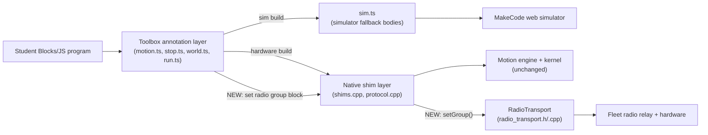

<!-- CLASI: Before changing code or making plans, review the SE process in CLAUDE.md -->

# Sprint 021: MakeCode blocks usability and correctness

> **Two governance notes carried from triage.** The toolbox reorganization gate is
> **satisfied**: Eric delegated the layout decision to team-lead on
> 2026-08-26, and the approved mapping is recorded in
> `block-toolbox-groups-reorganization.md` under "Decision". Implement that
> table exactly; any deviation needs a fresh call. The `make_deploy.py` build-gate work that
> triage originally parked here **moved to sprint 023** (Eric, 2026-08-26):
> it is build tooling, not blocks. This sprint's hardware verification still
> leans on that gate meaning what it says, so 023 should land first.

## Goals

Make the blocks extension usable and correct for a student sitting at the
local MakeCode editor: fix the three defects in `src/blocks/sim.ts` that
currently block basic JS<->Blocks conversion and simulator use, add a
radio-group Setup block, reorganize the toolbox groups (pending Eric's
approval of the layout), and document the local-editor workflow this
sprint's own verification depends on.

## Problem

Three separate defects in `src/blocks/sim.ts` currently make the extension
close to unusable in the editor a student actually sits at:

- **JS->Blocks conversion fails outright.** `int32`-typed parameters on the
  sim-fallback shim functions trip pxt's decompiler typecheck (`TS9256:
  bit sizes are not supported for locals and parameters`) on every
  conversion attempt for a project using the extension. A sprint-013-era
  audit found `int32` params on ~10 functions, not just the two lines the
  error points at (`_setWheels`, `_driveTwist`, `_startMove`, `_cycleStat`,
  `_setGeometry`, `runCommandText`, `setTaperWindows`, `setTaperFloors`,
  and others).
- **The web simulator crashes at boot.** ~9 empty-bodied shim functions
  (`_startProtocol`, `_setGeometry`, `_setKernelValue`, `probe`,
  `setTaperWindows`, `setTaperFloors`, `setRampMs`, `otosSetOffset`,
  `otosZero`, `otosCalibrate`, `_clearStallLatch`) are emitted by pxt as
  native-only calls with no `pxsim` implementation, so the simulator
  throws on the first statement of `<main>` and dies with "Simulator
  crashed, no error handler."
- **The simulator disagrees with hardware, and with itself.** `_setWheels()`
  (`sim.ts:99`) divides yaw rate by a hard-coded 115, standing in for
  caliper-measured `trackWidth_` (114.2 mm) alone; hardware's equivalent
  path (`MotionEngine::wheelsV()`) divides by `effectiveTrackWidth()` =
  `trackWidth / rotationalSlip` = 119.96 mm — a 4.3% discrepancy. The
  sim's *other* turn path, `_driveTwist()`, already reproduces hardware's
  math exactly, so today `_setWheels()`- and `_driveTwist()`-driven turns
  disagree with each other before either is compared to hardware.

Beyond the sim/conversion defects, the toolbox itself doesn't read as
designed: Move/Drive/World groups mix continuous-drive, position-move, and
world-frame concerns, and nothing exposes the radio group a student's
program listens on (RX is already on by default at group 10 via
`ensureRadioReady()`, but nothing in the toolbox says so or lets it
change). And the knowledge needed to work on any of this — how to serve
the editor locally, see disk projects, build and flash a plain V2 hex
instead of MakeCode's unparseable universal hex — currently lives in one
evening's session memory (2026-08-25), not in the repo.

## Solution

Fix the `sim.ts` trio together — the int32 params, the empty-bodied shims,
and the yaw-rate divisor all live in one file, and the first two are
explicitly cross-referenced issues from the same editing session. Verify
in the local editor (`http://localhost:3232/index.html?ws=fs`): clean
JS->Blocks conversion, a simulator that boots without crashing, and — if
the divisor fix is accepted — `_setWheels()` and `_driveTwist()` producing
the same turn rate for the same input. Confirm on hardware afterward that
the TS-level type changes didn't touch the native shim ABI, the way
issue 1's own pre-verification already did (`RUN:go` on a patched build
landed a commanded 200 mm move at 200.3 mm).

Add the radio-group Setup block on top of the already-working
`ensureRadioReady()`/`kGroup = 10` default (`src/comms/radio_transport.*`),
applying idempotently whether the block runs before or after the radio
comes up, and leaving the fleet channel (4) fixed and out of student
control.

The toolbox reorganization is annotation-only (`//%` `group=`/`weight=`/
`advanced=` edits across `src/blocks/*.ts` plus one `groups=[...]` on the
namespace, no shim or C++ change). The layout is **decided** — implement the
table in the issue's "Decision" section verbatim, including its two
departures from the earlier draft (stop/estop stays top-level; only true
sensor calibration goes to World Setup).

Write `docs/local-editor.md` from the already-working scaffold on
`claude/blocks-local-codeserver-test-bf93c6` (`.claude/launch.json` +
`projects/`), covering every gotcha the 2026-08-25 session hit: the
`?ws=fs` double-navigate, the `_history` auto-save-disabled
wedge, and building a plain V2 hex via `pxt build` + `mbdeploy` instead of
MakeCode's Download (which produces a universal hex that mass-erases the
board on a failed flash attempt).

## Success Criteria

- [ ] A project using the extension converts JS -> Blocks cleanly in the
      local editor: no `TS9256`, no Problems-pane error.
- [ ] The web simulator boots without crashing for a bare project using the
      extension (start icon shows; no "Simulator crashed" error).
- [ ] `_setWheels()`'s simulated yaw rate matches `_driveTwist()`'s for the
      same wheel-speed input, or the decision to leave them mismatched is
      recorded with reasoning.
- [ ] A hardware run (e.g. `RUN:go`) after the `sim.ts` changes lands within
      the same tolerance as pre-sprint firmware, confirming the TS-level
      type/divisor changes are shim-ABI-safe.
- [ ] A "set radio group" block exists in the toolbox, defaults to 10,
      works from `on start`, and is idempotent regardless of whether the
      radio has already come up.
- [ ] The shipped toolbox matches the approved mapping in
      `block-toolbox-groups-reorganization.md` exactly: eight groups in the
      declared order, 39 existing blocks + `set radio group`, stop/estop
      top-level.
- [ ] `docs/local-editor.md` exists, is linked from the README, and a
      fresh reader can serve the editor, see a disk project, and flash a
      plain V2 hex using only the doc.

## Scope

### In Scope

`src/blocks/sim.ts` (int32 params, empty-bodied shims, yaw-rate divisor),
`src/blocks/*.ts` (toolbox group/weight/advanced annotations; new radio
Setup block), `src/comms/radio_transport.*` (radio group setter),
`docs/local-editor.md` (new) plus a README pointer.

### Out of Scope

- Playfield accuracy campaigns and the `travelCalib`/`goToWorld`/rotation
  work — that's sprint 020, independent of this one in source (020 is
  campaigns/tools on already-corrected motion; this sprint doesn't touch
  motion firmware at all).
- The pivot-overshoot and arc/stop-path work already closed in sprints
  015-019.
- Any simulator physics beyond the yaw-rate divisor — whether the sim's
  contract is exact hardware parity or an approximation is a question for
  this sprint's architecture pass, not a license to rewrite more of
  `sim.ts`.
- The `make_deploy.py` build gate entirely -- moved to sprint 023.
- `cleartext-run-hangs-the-link-under-active-telemetry.md`-style wire
  concerns and anything in the v6 sequenced-command path — this sprint's
  remote-testing pattern (issue 6) uses unsequenced cleartext `RUN:name`
  only.

## Test Strategy

Two verification tracks, matching where each defect actually lives:

- **Local editor, software-only.** `http://localhost:3232/index.html?ws=fs`
  covers JS->Blocks conversion, the simulator-boot check, and the toolbox
  group layout review — all three are editor-observable and need no
  hardware.
- **Hardware, for anything touching the shim boundary or firmware.** `pxt`
  CLI build + `mbdeploy` flash + serial `RUN:` verbs confirms the `sim.ts`
  type changes don't affect the native shim ABI, and confirms the radio
  group block actually changes what the robot listens on.

The toolbox-reorganization ticket verifies in the local editor: every
group renders in the declared order, block counts match the approved
table, and no block lands in a group the table does not name.

## Architecture

**Sizing: Substantial.** Three modules are touched in one sprint — the
blocks simulator-fallback layer (`src/blocks/sim.ts`), the toolbox
annotation layer spread across four existing block files (`motion.ts`,
`stop.ts`, `world.ts`, `run.ts`), and `src/comms/radio_transport.*` — and
the radio-group work adds a genuine new cross-module capability: student
blocks gain a *write* path into `RadioTransport`'s configuration, where
today the blocks layer only ever *starts* the comms layer
(`_startProtocol()`) or *writes lines* through it (`emitLine()`), never
reconfigures it. That crosses the "new cross-module dependency" trigger
on its own, independent of the module count, so this uses the full
7-step methodology with one diagram. No ERD: nothing in this sprint
introduces or changes persisted/structured data — only in-memory
constants, one mutable field, and `//%` annotations.

### Step 1 — The problem

Three independent defects share one file and one editing session
(`src/blocks/sim.ts`): `int32`-typed sim-fallback parameters break the
JS→Blocks decompiler (TS9256); ~10 empty-bodied shim fallbacks crash the
web simulator at boot because pxt treats an empty TS body as native-only;
and the simulator's own two turn-rate paths (`_setWheels()`,
`_driveTwist()`) disagree with each other by 4.3% because only one of
them reproduces hardware's `effectiveTrackWidth()` correction. Separately,
the toolbox's `//% group=` layout doesn't read as designed (stop mixed
into Drive, remote dispatch mixed into Move, calibration mixed into
World) — the approved fix is annotation-only and already decided
(`block-toolbox-groups-reorganization.md` "Decision"). A new "set radio
group" Setup block needs to reach the already-working
`ensureRadioReady()`/`kGroup=10` default without giving students control
over the fleet channel. And the local-editor workflow this sprint's own
verification depends on needs to be written down.

### Step 2 — Responsibilities

- **R1 — Decompiler compatibility**: no sim-fallback function may declare
  an `int32` parameter (return types are unaffected — TS9256 fires on
  locals/parameters only).
- **R2 — Simulator boot completeness**: every shim `pxsim` may reach at
  runtime must have a real (if trivial) TS body, never a bare `{}`.
- **R3 — Simulator turn-rate fidelity**: the simulator's two
  wheel-speed-implies-turn paths must agree with each other, and that
  shared value must be *derived from*, not merely equal to, the same
  quantities hardware derives it from.
- **R4 — Toolbox information architecture**: which drawer group and
  disclosure level (`advanced=`) each existing block renders under, and
  the top-level drawer order itself.
- **R5 — Radio group control**: let a student declare (and re-declare)
  the group the robot listens on, independent of call order relative to
  lazy radio bring-up, without exposing the channel.
- **R6 — Local-editor knowledge capture**: a written, repeatable path
  from a fresh checkout to a running local editor and a flashed hex.

R1-R3 are grouped (same file, same session, per the issues' own
cross-references). R4 is independent of R1-R3 (annotation-only, touches
different files) but shares a *sequencing* need with R5 (both place
blocks into the new "Remote" group). R5 is the only responsibility that
crosses the blocks/comms boundary. R6 is a documentation artifact, not a
code module — noted under "What Changed," not given its own module
entry.

### Step 3 — Modules

- **`src/blocks/sim.ts`** (existing, no new file). Purpose: provide
  browser-simulator fallback bodies for every native shim, so a program
  using this extension runs in the web simulator without a physical
  robot. Boundary: inside — TS-only kinematic/stub bodies keyed by
  `shim=` names that mirror the native C++ signatures; outside — the
  native shim ABI itself (governed by the C++ signatures in `shims.cpp`,
  untouched by this sprint) and the pxt build/decompiler toolchain.
  Serves R1, R2, R3 (SUC-001, SUC-002, SUC-003).
- **Toolbox annotation layer** — not a new module, a cross-cutting
  metadata pass over `src/blocks/motion.ts` (plus the new
  `groups=[...]` on the `diffDrive` namespace, `motion.ts:55`),
  `stop.ts`, `world.ts`, `run.ts`. Purpose: declare which drawer group
  and disclosure level each block renders under. Boundary: inside —
  `//% group=`/`weight=`/`advanced=`/`groups=` values; outside — block
  signatures, shim bindings, and any C++ (explicitly annotation-only,
  per this sprint's constraints). Serves R4 (SUC-005).
- **`src/comms/radio_transport.h`/`.cpp`** (existing, gaining one
  capability). Purpose: own on-air fragment framing and lazy radio
  bring-up for TX/RX. Boundary: inside — radio bring-up, group, channel,
  transmit power, and RadioRelay frame encode/decode; outside — channel
  selection (stays fixed at the fleet value, out of student control) and
  wire-grammar parsing (owned by `Wire::WireHandler` above it). Gains: a
  runtime-mutable group value and a `setGroup()` entry point, replacing
  today's `constexpr uint8_t kGroup = 10`. Serves R5 (SUC-004), together
  with the next module.
- **New "set radio group" block + shim** — a new function co-located in
  `src/blocks/run.ts` (the file that already implements the Remote
  group's `on run`/`on run command`), its shim fallback in `sim.ts`
  (given a real body from the start — see Design Rationale), and its
  native passthrough as a new small free function beside
  `startProtocol()` in `src/comms/protocol.cpp`, forwarding into
  `RadioTransport::setGroup()`. Purpose: let a student program declare
  its radio listen group, defaulting to 10, applied whether the radio
  has already come up or not. Boundary: inside — the group value only;
  outside — channel and transmit power (both stay fixed). Serves R5
  (SUC-004).
- **`docs/local-editor.md`** (new) + a README pointer. Not a code module
  — no architectural boundary; captures R6 (SUC-006).

### Step 4 — Diagram

One diagram serves as both the component diagram (required — a new
cross-module dependency is introduced) and the dependency graph (module
dependencies change by exactly the one new edge below); a second,
near-duplicate diagram would not add information. No ERD: no
persisted/structured data changes.

No cycles. Every module addresses at least one SUC (cross-checked in
Step 3 above). The one new edge (`Shims -> Radio`, `setGroup()`) is the
sprint's only dependency-graph change; its direction matches the
existing Presentation/API → Domain → Infrastructure flow (blocks call
down into comms, never the reverse).

### Step 5 — What changed / why / impact on existing components

**What changed**

- `sim.ts`: every sim-fallback function's *parameters* (not return
  types) that were `int32` become `number`; every function whose body
  was a bare `{}` gets a real, if trivial, TS body; `_setWheels()`'s
  yaw-rate divisor is re-derived from the same quantities hardware's
  `effectiveTrackWidth()` uses instead of a bare geometric stand-in.
- `motion.ts`, `stop.ts`, `world.ts`, `run.ts`: `//%` `group=`/`weight=`/
  `advanced=` reassignment to the eight approved groups, plus one
  `groups=[...]` declaration fixing drawer order.
- `radio_transport.h`/`.cpp`: `kGroup` becomes a mutable field with an
  idempotent setter; channel and transmit power are untouched.
- One new block, shim, and native passthrough for "set radio group."
- One new doc (`docs/local-editor.md`) plus a README pointer.

**Why** — see Step 1/Step 2 above; each change closes one of the six
linked issues.

**Impact on existing components**

- `sim.ts` changes are TS-only; the native shim ABI (C++ signatures in
  `shims.cpp`) is untouched — confirmed hardware-safe for the `int32`
  sweep by the issue's own pre-verification (tovez, `RUN:go` landed
  200.3 mm on a 200 mm command against a patched build), and the
  empty-body/divisor fixes touch only the simulator side of an already-
  unchanged `shim=` binding, so the same ABI-safety argument extends to
  them — this sprint's own hardware-verification ticket confirms it
  rather than assumes it.
- Toolbox reassignment changes *where* a block is found, not its
  `block=` id, shim binding, or parameters — existing saved
  `.blocks`/`.ts` projects using these blocks are unaffected; only the
  drawer position changes.
- `_setWheels()`'s simulated yaw rate changes value (closing the 4.3%
  gap) — a *simulator-only* behavior change; hardware's own
  `effectiveTrackWidth()` in `motion_engine.h` is not touched (this
  sprint does not modify motion firmware).
- `RadioTransport`'s default behavior (group 10, lazy bring-up) is
  unchanged until a student program explicitly calls the new block —
  existing fleet behavior is preserved by default.

### Step 6 — Design Rationale

**Decision: the simulator's contract is exact parity on observable
kinematic output, not a physical model of hardware's calibration
mechanism.** `_driveTwist()`'s sim body already reproduces hardware's
full round-trip through `effectiveTrackWidth()` — it takes an angular
rate directly, so no track-width math is needed at all, and it already
matches hardware output exactly. `_setWheels()` is the one function that
must actually *derive* yaw rate from a wheel-speed differential, and its
divisor (115, standing in for `trackWidth_` alone, 114.2 mm) omits
`rotationalSlip_` (0.952) — a *hardware calibration correction* for a
physical imperfection (uneven wheel diameter/friction) that an idealized
kinematic simulator has no equivalent of. The fix is not to give the
simulator its own "slip" concept — there is nothing physical to correct
for — it is to make `_setWheels()` reproduce the same *observable*
result hardware and `_driveTwist()` already agree on: divide by
`effectiveTrackWidth()` (119.96 mm today), expressed as the two named
constituent constants (a `trackWidth_` mirror and a `rotationalSlip_`
mirror), not a single opaque literal, so a future geometry/slip bake
update doesn't silently reopen this gap the way the current bare `115`
already did once (R-12/BLK-06, sprint 007). *Alternative considered*:
leave `_setWheels()` alone and record the mismatch as an accepted
approximation. Rejected — sprint.md's own Success Criteria requires
either a fix or a reasoned decision to leave it mismatched, and leaving
two blocks that express the same physical intent (differential wheel
speeds vs. body speed+yaw rate) disagree by 4.3% inside the *same*
simulator is a usability defect independent of any sim/hardware parity
philosophy — a student switching between `set wheel speeds` and `drive
turning` blocks should see consistent behavior. *Consequence*: the
simulator's geometry setter (`_setGeometry()`) stays a no-op — this
sprint fixes the stand-in's *value*, not its live-settability; flagged
as an open question below, not silently expanded into.

**Decision: the new radio-group block and its native passthrough are
co-located in existing files (`run.ts`, `protocol.cpp`), not a new
`src/blocks/radio.ts` or new comms file.** `run.ts` already implements
the Remote group's other two blocks; the file-per-concern split recorded
in `src/blocks/DESIGN.md` doesn't carve out a distinct "comms config"
concern from "remote dispatch," and one new block does not justify
growing the module count from six files to seven. `protocol.cpp`
already has exactly this shape of thin free-function passthrough
(`void startProtocol() { protocol(); }`) for the same lazy-singleton
`Protocol&`.

**Decision: `kGroup` becomes a mutable field with an idempotent setter,
not a "must run before radio comes up" requirement.** *Alternatives
considered*: (a) require the block to run before `ensureRadioReady()` —
rejected, brittle and order-dependent, the exact footgun the issue calls
out; (b) always eagerly re-enable/reconfigure the radio on every
`setGroup()` call — rejected, forces `uBit.radio.enable()`'s RAM/
softdevice cost even for programs that never send anything, defeating
the lazy-init design `radio_transport.h`'s own header comment documents
as deliberate. *Chosen*: store the requested value unconditionally; if
the radio is already up, re-apply immediately via
`uBit.radio.setGroup()`; if not yet up, the stored value is picked up
whenever `ensureRadioReady()` eventually runs — the same lazy-init
idiom the rest of the class already uses, extended rather than replaced.

**Decision: the new radio-group shim's simulator fallback must not be
an empty `{}` body.** This sprint is fixing the exact defect (empty
shim bodies crash the sim) that a new empty shim would reintroduce;
give it a real (if trivial — e.g., recording the value in a sim-side
variable, matching `_setGeometry`'s no-op-with-real-body convention
once R2 lands) body from the start.

**Not re-litigated**: the toolbox group layout itself is a stakeholder-
delegated, already-approved decision recorded in
`block-toolbox-groups-reorganization.md`'s "Decision" section. This
Architecture section records only the *mechanism* (annotation edits +
one `groups=[...]` declaration), not the layout choice.

**Self-review note (shotgun surgery check)**: the toolbox reassignment
touching four files (`motion.ts`, `stop.ts`, `world.ts`, `run.ts`) for
one conceptual change looks, at a glance, like the shotgun-surgery
anti-pattern. It isn't: pxt's `//% group=` annotation is declared at
each block's own definition site with no central registry to edit
instead — touching every file that defines a reassigned block is the
only mechanism available, not an emergent design smell. The change
remains annotation-only in each file (no signature/shim/C++ edits), so
the "surgery" is uniformly shallow.

### Migration Concerns

None requiring data migration — no persisted/structured data changes
anywhere in this sprint. Toolbox reassignment preserves existing block
ids, so saved `.blocks`/`.ts` projects are unaffected. `sim.ts` changes
are TS-only and do not require a hardware re-flash of already-deployed
programs until a student rebuilds. Deployment sequencing: this sprint's
hardware verification (sim.ts ABI check, radio-group hardware check)
uses the *current* manual `pxt build` + `mbdeploy` flow (documented in
this same sprint's own `docs/local-editor.md` ticket) — it does not need
sprint 023's `make_deploy.py --robot` gate to land first. The
cross-sprint relationship recorded in this sprint's own governance note
(023's gate should still land before it is *relied on* as a
hardware-safety net for future sprints) is a roadmap-ordering concern,
not a blocker internal to 021's own tickets.

### Step 7 — Open Questions

1. Should `sim.ts` express the corrected divisor as two named constants
   (`trackWidth_` mirror × `rotationalSlip_` mirror) or a single derived
   119.96 literal with a comment tying it back to
   `motion_engine.h`? Leaning toward two named constants (matches the
   issue's own "Suggested direction" and survives a future geometry
   bake without a second silent drift) — left to the implementing
   ticket as a small implementation choice, not a structural one.
2. Does the radio-group setter need bounds validation on the group
   value, or does it accept whatever CODAL's own `uBit.radio.setGroup()`
   accepts? No validation exists today; recommend none be added unless
   the ticket finds CODAL's own signature narrower than a full byte.
3. Should `projects/` (the local-editor scaffold) be committed to the
   repo, or does it stay a gitignored, locally-recreated scratch
   directory? The issue states `.claude/launch.json` and the gitignore
   rules are already on master — the documentation ticket should
   confirm which state `projects/` itself is in before writing
   "create this directory" vs. "this directory already exists" into the
   doc.
4. Sprint 022's per-robot channel injection (`make_deploy.py --robot`)
   was not visible in detail during this sprint's planning; the
   assumption here is that it does not interact with the radio-group
   *value* (channel and group are orthogonal fields on `RadioTransport`)
   — worth a one-line confirmation once 022 lands, not a blocker to
   021's own tickets.

## Use Cases

Six sprint-level use cases, one per linked issue — each ticket below
traces to exactly one of these (SUC-001–SUC-003 all trace to the
combined `sim.ts` ticket, since the issues themselves are one coherent
unit).

### SUC-001: Convert a Program Using the Extension from JS to Blocks
Parent: UC-016 (Develop and Test in the Browser Simulator)

- **Actor**: Student or teacher working in the MakeCode editor (local or
  web)
- **Preconditions**: A project depends on this extension and contains
  code that calls into `diffDrive` functions backed by sim-fallback
  shims.
- **Main Flow**:
  1. Student writes or pastes JS code using `diffDrive` blocks-backed
     functions.
  2. Student clicks "Blocks" to convert.
  3. MakeCode's decompiler typechecks every function on the sim-fallback
     path, including `diffDrive`'s shim functions.
  4. No function on that path declares an `int32` parameter, so the
     typecheck passes and the equivalent block program renders.
- **Postconditions**: The project shows a working Blocks view with no
  Problems-pane error.
- **Acceptance Criteria**:
  - [ ] `TS9256` does not appear for any project that calls any
        `diffDrive` block.
  - [ ] Every sim-fallback function in `sim.ts` with an `int32`
        parameter (audited fresh against the current file, not assumed
        from the original sprint-013-era list) now uses `number`.
  - [ ] Return types are unchanged.

### SUC-002: Run a Program Using the Extension in the Browser Simulator
Parent: UC-016 (Develop and Test in the Browser Simulator)

- **Actor**: Student
- **Preconditions**: A project depends on this extension.
- **Main Flow**:
  1. Student opens/creates a project using the extension in the editor.
  2. Student clicks the simulator's start control.
  3. The simulator executes `<main>`, including the top-level
     `_startProtocol()` call `motion.ts` makes at namespace load.
  4. Every shim function the program reaches runs its TS fallback body
     instead of crashing on a missing native call.
- **Postconditions**: The simulator shows the running program's UI
  instead of "Simulator crashed, no error handler."
- **Acceptance Criteria**:
  - [ ] A bare project using the extension (`on start` + one `diffDrive`
        block) boots without a crash.
  - [ ] Every function in `sim.ts` previously an empty `{}` body
        (audited fresh against the file) now has a real, if trivial,
        body.
  - [ ] No Problems-pane error referencing `startProtocol` or any other
        shim.

### SUC-003: Get Consistent Turn Behavior in the Simulator
Parent: UC-016 (Develop and Test in the Browser Simulator)

- **Actor**: Student
- **Preconditions**: A project uses `set wheel speeds` and/or `drive ...
  turning ...` in the simulator.
- **Main Flow**:
  1. Student commands a turn via `set wheel speeds left X right Y`.
  2. Student commands the kinematically-equivalent turn via `drive
     speed cm/s turning yawRate deg/s`.
  3. Both produce the same simulated yaw rate.
- **Postconditions**: A student switching between the two blocks sees
  consistent, predictable turning in the simulator.
- **Acceptance Criteria**:
  - [ ] `_setWheels()`'s yaw-rate divisor mirrors
        `effectiveTrackWidth()` (`trackWidth / rotationalSlip`), not
        `trackWidth` alone.
  - [ ] For a matched input, `_setWheels()` and `_driveTwist()` produce
        the same simulated yaw rate (within rounding).
  - [ ] The sim/hardware contract decision (exact parity on observable
        output, not on mechanism) is recorded in this sprint's
        Architecture section (see Design Rationale, above).

### SUC-004: Configure the Radio Listen Group from Blocks
Parent: none existing — `docs/design/usecases.md` has no radio/remote-
command use case yet (a pre-existing gap, not introduced by this
sprint); nearest sibling in spirit is UC-011's Setup-block/`on start`
pairing convention. Recommend a future consolidation pass add a
dedicated UC once this ships.

- **Actor**: Student
- **Preconditions**: Program includes an `on run`/`on run command`
  handler and the student wants to control, or just confirm, which
  radio group it listens on.
- **Main Flow**:
  1. Student places a "set radio group" block, typically in
     `on start`, with a group number (default 10).
  2. Program runs; the call reaches `RadioTransport` whether the radio
     has already lazily come up (via an earlier RX/TX) or not yet.
  3. The robot listens for RUN commands on the configured group from
     then on.
- **Postconditions**: The robot's radio group matches what the block
  declared, regardless of call order relative to radio bring-up.
- **Acceptance Criteria**:
  - [ ] Block defaults to 10 and is idempotent whether it runs before
        or after the radio comes up.
  - [ ] Channel (4, fleet-fixed) is not exposed as student-editable by
        this block.
  - [ ] Block sits in the new Remote toolbox group with a doc comment
        stating plainly what it does.
  - [ ] The new shim's simulator fallback has a real (non-empty) body.

### SUC-005: Find the Right Block Quickly in the Toolbox
Parent: cross-cutting — supports discoverability for UC-001 through
UC-016 collectively; no single owning UC.

- **Actor**: Student
- **Preconditions**: Extension installed, toolbox open.
- **Main Flow**:
  1. Student opens the DiffDrive category.
  2. Groups render in the declared order: Move, Drive, Stop, World,
     Pose, Remote, World Setup, Setup.
  3. Student finds `stop` at the top level (not behind an advanced
     disclosure) because it is a safety-critical control.
  4. Student finds `start world tracking`/`set world pose` directly in
     World (not hidden in an advanced group) because they are mandatory
     before `go to world x/y` works.
- **Postconditions**: Every one of the 39 existing blocks, plus the new
  `set radio group`, renders in exactly the group the approved table
  names.
- **Acceptance Criteria**:
  - [ ] `groups=[...]` on the `diffDrive` namespace declares the eight
        groups in the approved order.
  - [ ] Block-to-group assignment matches
        `block-toolbox-groups-reorganization.md`'s "Decision" table
        exactly, including both departures from the earlier draft
        (stop/estop top-level; World Setup holds only true calibration).
  - [ ] Final count is 40 blocks (39 existing + `set radio group`)
        across the eight groups; no block lands in a group the table
        does not name.
  - [ ] No shim, signature, or C++ change accompanies the annotation
        edits themselves.

### SUC-006: Serve the Local Editor and Flash a Plain Hex
Parent: UC-016 (Develop and Test in the Browser Simulator) — broadened
here to include local serving and hardware flashing, not just the web
simulator; closest existing entry.

- **Actor**: Developer/maintainer working on the extension itself (not
  an end-student).
- **Preconditions**: Repo checked out; `pxt` CLI available.
- **Main Flow**:
  1. Reader runs `pxt serve --noBrowser --noauth --noSerial` from the
     repo root.
  2. Reader navigates to `http://localhost:3232/index.html?ws=fs`
     twice (the first load consumes the auth token and drops the query
     string).
  3. Reader sees `projects/` folders as open-able local projects.
  4. Reader edits; if the `_history` auto-save wedge appears, follows
     the documented recovery.
  5. Reader builds a plain V2 hex with `pxt build` (not MakeCode's
     Download) and flashes it with `mbdeploy`, parking any browser tab
     holding a WebUSB pairing first.
- **Postconditions**: A fresh reader, using only `docs/local-editor.md`,
  can serve the editor, see a disk project, and flash real hardware.
- **Acceptance Criteria**:
  - [ ] `docs/local-editor.md` exists and covers all seven points from
        the issue (serve, `?ws=fs` double-navigate, consumer-project
        pattern, first-open patience, `_history` wedge, plain-hex
        build+flash, remote-testing `RUN:` pattern).
  - [ ] README links to it.
  - [ ] A fresh reader can follow it end-to-end without additional
        tribal knowledge.

## GitHub Issues

(GitHub issues linked to this sprint's tickets. Format: `owner/repo#N`.)

## Definition of Ready

Before tickets can be created, all of the following must be true:

- [x] Sprint planning document is complete (sprint.md, including its
      Architecture and Use Cases sections)
- [x] Architecture review passed (or skipped, for changes with no
      architectural impact)
- [ ] Stakeholder has approved the sprint plan

## Tickets

| # | Title | Depends On |
|---|-------|------------|
| 001 | Document the local MakeCode editor (codeserver) workflow | — |
| 002 | Fix sim.ts: int32 decompiler breakage, empty-shim sim crash, yaw-rate divisor | 001 |
| 003 | Hardware ABI verification for sim.ts changes | 002 |
| 004 | Reorganize the block toolbox groups | 001 |
| 005 | Add the "set radio group" Setup block | 004 |

Tickets execute serially in the order listed. 001 runs first because
this sprint's own local-editor and hardware verification steps
(002/003's software+hardware checks, 004's toolbox review, 005's
hardware radio check) all lean on the workflow it documents. 002/003
are one coherent unit (the `sim.ts` trio, fix then hardware-confirm) and
independent of 004/005 (different files); 005 depends on 004 because it
places its new block into the Remote group 004 creates, and 005's own
final acceptance criterion is the sprint's one end-to-end toolbox check
(40 blocks, all eight groups, matching the approved table).
