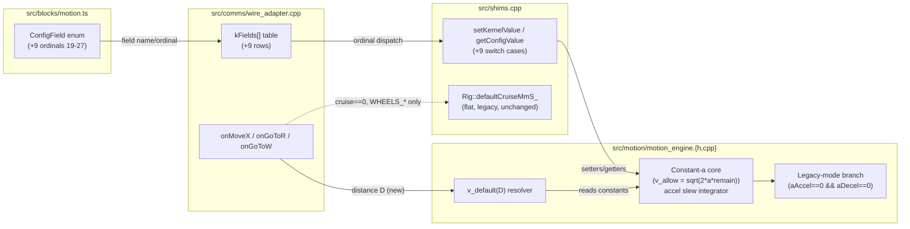

<!-- CLASI: Before changing code or making plans, review the SE process in CLAUDE.md -->

# Sprint 025: Trajectory shaping: constant-acceleration profiles and speed chosen by distance

## Goals

Replace the two proxy quantities the move engine currently shapes a
stop and a start with — a fixed-distance taper window and a
fixed-time acceleration ramp — with real engineering-unit terms
(mm/s²), and use the same physics to pick a sane default cruise speed
from a leg's own length. Ship the mechanism with legacy behavior ON
by default; the tuned constants come from a later bench sweep, not
this sprint.

## Problem

`clasi/issues/trajectory-shaping-constant-acceleration-profiles-speed-chosen-by-distance.md`
(read in full before touching code) has the measured evidence and the
root-cause analysis; this section summarizes it.

Deceleration is computed as `remain / distTaper_` over a **fixed**
31.5 mm window (`motion_engine.cpp:356-398`). Because the window is
fixed, the deceleration this formula *demands* grows as the square of
cruise speed: MEASURED from the compiled engine (host harness, no
hardware, `captures/motion-profile-probe-20260901/profile_probe.py`)
105 mm/s² at cruise 100 rising to 5081 mm/s² at cruise 600, with the
decel phase collapsing from 26 control ticks to 2 — under 4 ticks,
which is not a tuning problem, it is a formula that cannot be
satisfied by any real robot. This reproduces the field symptom
(`captures/fleet-tours-speed-20260831.json`: at 400 mm/s the robot
never decelerates at all and just stops wherever momentum puts it,
mean leg miss 3.6-4.1 cm vs 2.0-2.1 cm at 200 mm/s).

Acceleration has the mirror-image defect: `elapsed / rampMs_`
(`motion_engine.cpp:402-408`, `rampMs_` = 400 ms fixed) is **time**-
based, not acceleration-based, so effective accel is `1.875 x cruise`
and silently rescales with whatever cruise is commanded — not an
acceleration at all, and neither term is expressed in mm/s² or
independently controllable from the other (both are `min()`-combined
into one `scale`).

Third, every move that asks for the wire's `cruise == 0` "use the
default" sentinel gets a flat, distance-independent speed
(`Rig::defaultCruiseMmS_`, seeded 150 mm/s) — so nothing stops a
default-speed move from being asked to travel farther than it can
brake from before its own stop point.

## Solution

One kinematic equation answers both the deceleration defect and the
distance-based default: constant deceleration `a` implies braking
distance `d = v^2/(2a)`, so the speed permissible with `remain` left is
`v_allow = sqrt(2 * a * remain)`.

1. **Deceleration** — replace the fixed-window `remain/distTaper_`
   axis-scale with this braking-speed solve, in engineering units
   (mm, mm/s), still min-combined with the existing floors
   (`distFloor_`/`turnFloor_`) and with `distTaper_`/`yawTaper_`
   retained as a window *ceiling* rather than deleted.
2. **Acceleration** — replace the `elapsed/rampMs_` time fraction with
   a true velocity-slew integrator (`v_cmd <= v_prev + a_accel * dt`),
   independently settable from deceleration, and fix the undocumented
   `0.25f` first-tick literal that currently bypasses `turnFloor_`
   while here.
3. **Speed chosen by distance** — resolve the existing `cruise == 0`
   wire sentinel (for `moveX()`/`goToR()`/`goToW()`, the taper-shaped
   move family) to
   `v_default(D) = min(vMaxMmS_, sqrt(2 * aDecelMmS2_ * brakeFrac_ * D))`
   instead of the flat default, so a default-speed move is never asked
   for a stop it cannot make. No wire arity change, no new verb.
4. **Legacy mode** — with `aAccel == 0 && aDecel == 0` (the shipped
   default), the engine reproduces today's formulas bit-for-bit, and
   the pinned regression tests pass unmodified. `wheelsX()`/`wheelsV()`
   keep the flat `Rig::defaultCruiseMmS_` sentinel unconditionally —
   they command raw per-wheel distances with no single "leg length"
   the braking formula is defined over.
5. **Wire-settable knobs** — expose the four new physics constants
   (`accel`, `decel`, `v_max`, `brake_frac`) and the five shaping knobs
   that are currently reachable only from TypeScript (`distTaper_`,
   `yawTaper_`, `distFloor_`, `turnFloor_`, `rampMs_`) as SET/GET
   fields, following the `pivot_overrun` precedent, so a bench sweep
   never costs a reflash.

Real tuned constants (`a_accel`, `a_decel`, `v_max`, `brake_frac`) come
from a later Tier-2 bench sweep on hardware. This sprint ships the
mechanism with conservative, inert defaults (legacy mode ON) — it does
not guess the numbers. Priority is accuracy over speed.

## Success Criteria

- A host-simulation test proves deceleration measured in mm/s² is
  constant across a range of commanded cruise speeds (100/200/400/600),
  in contrast to today's measured v² growth.
- Legacy mode (`aAccel == 0 && aDecel == 0`, the shipped default)
  reproduces today's engine output bit-for-bit; every pinned regression
  test (`test_motion_engine_deadline_boundary.py`,
  `test_regression_yaw_taper_pure_turn.py`) passes unmodified.
- Acceleration and deceleration are independently settable and
  independently observed in engine output.
- `v_default(D)` is monotonic in `D` and never exceeds the speed the
  leg can brake from at the configured `aDecelMmS2_`.
- All nine new fields are wire-settable and wire-readable (`SET`/`GET`),
  and `docs/design/specification.md` §4.8 lists every ordinal through
  27 (it is currently stale at 17).
- `tools/make_deploy.py` still produces a flashable hex from the
  sprint's final state (build-checkpoint ticket).

## Scope

### In Scope

- `src/motion/motion_engine.{h,cpp}`: constant-`a` deceleration solve,
  velocity-slew acceleration integrator, distance-chosen default-speed
  resolver, legacy-mode preservation, new getters for the five
  previously setter-only shaping fields.
- `src/comms/wire_adapter.cpp`: `onMoveX`/`onGoToR`/`onGoToW` call
  sites pass their own leg distance into the new resolver instead of
  the flat sentinel; nine new `kFields[]` rows.
- `src/shims.cpp`: `setKernelValue`/`getConfigValue` switch cases for
  the nine new ordinals.
- `src/blocks/motion.ts`: nine new `ConfigField` enum members
  (ordinals 19-27), additive only.
- `tests/host/`: new host-simulation tests (constant-decel-in-mm/s²,
  legacy bit-for-bit, `v_default` monotonicity); required drift-test
  updates (`wire_motion_verb_shim.cpp`, `motion_engine_shim.cpp`,
  `test_block_toolbox_order.py`, `test_wire_constants_drift.py`).
- `docs/design/specification.md` §4.8 table, brought current through
  ordinal 27.
- Mandatory build-checkpoint ticket (`tools/make_deploy.py`) per this
  project's standing convention (`docs/design/design.md`, "Standing
  convention (sprint 008)").

### Out of Scope

- The real numeric values of `a_accel`, `a_decel`, `v_max`,
  `brake_frac` — Tier-2 bench sweep on hardware, a follow-up activity,
  not this sprint. This sprint ships the mechanism inert (legacy mode
  ON).
- `src/core/diffdrive.{h,cpp}` — vendored byte-identical from
  radio-robot; not touched by this sprint under any circumstance.
- `clasi/issues/goto-under-closed-profile-terminates-legs-early.md` —
  related (implicates ramp shaping) but a separate open issue; not
  folded into this sprint.
- `WHEELS_X`/`WHEELS_V`'s own default-cruise behavior — stays on the
  flat `Rig::defaultCruiseMmS_` sentinel; not made distance-aware.
- Any telemetry/`TLM` frame change — `kMaxSnapshotColumns = 20` is
  exactly full; no new column is added.
- Tier-2 (bench) and Tier-3 (field) verification runs themselves —
  this sprint delivers the mechanism and its Tier-1 host proof only.

## Test Strategy

**Tier 1 — host simulation, no hardware, this sprint's own gate.**
`tests/host/` already drives the real compiled `MotionEngine` tick by
tick (`_drive_to_completion()`,
`test_motion_engine_deadline_boundary.py:317-351`) and samples
`meOutVelocityLeft/Right`. New tests, added by ticket 004, assert:

- Decel measured in mm/s² (fit from the sampled velocity trace) is
  constant across cruise 100/200/400/600, in contrast to the v²
  relationship measured on today's engine.
- Accel and decel are independently settable and independently
  observed (changing one leaves the other's measured rate unchanged).
- `v_default(D)` is monotonic in `D` and never exceeds
  `sqrt(2 * aDecelMmS2_ * remain)` at any point during the resulting
  move.
- Legacy mode (`aAccel == 0 && aDecel == 0`) reproduces today's
  profile bit-for-bit — the existing pinned regression tests pass
  unmodified, with no test-file edits.

Tickets 001-003 each carry their own scoped unit/regression coverage
for the code they add (the engine core, the sentinel resolution, the
wire exposure); ticket 004 is the cross-cutting acceptance proof tying
all three together end to end, which is why it is sequenced after all
three rather than folded into any one of them.

**Tier 2 — bench, lossless (out of this sprint's scope, tracked for
follow-up).** With a robot on USB, sweep distance x cruise and capture
`TLM FULL` at 20 Hz off the USB tap; fit actual accel/decel per run —
this is the source of the real constants. Must explicitly re-check for
the end-of-leg stiction bump described in
`reports/tovez-taper-stall-20260829.md` under the new, longer
ramp-down.

**Tier 3 — field (out of this sprint's scope, tracked for follow-up).**
Re-run the orange-dot tour at the tuned defaults; success is 400 mm/s
matching or beating the 2026-08-31 baseline 200 mm/s accuracy (2.0 cm
mean leg miss).

## Architecture

**Substantial** — three or more modules are touched
(`src/motion/motion_engine.{h,cpp}`, `src/comms/wire_adapter.cpp`,
`src/shims.cpp`, `src/blocks/motion.ts`, `tests/host/`,
`docs/design/specification.md`), and the wire config-field surface
gains nine new fields end to end (enum -> wire table -> shim switch ->
engine getter/setter) — a real data-model change to that surface, not
a single-module tweak. Full 7-step methodology applied below.

### Step 1 — Understand the Problem

Covered in Problem/Solution above; see the linked issue for the full
measured evidence and root-cause analysis. The short version: two
shaping terms that are supposed to be accelerations are actually a
fixed distance and a fixed time, so neither scales correctly with
commanded speed, and the wire's speed-sentinel and the move's braking
physics have never been connected.

### Step 2 — Identify Responsibilities

- **R1 — Constant-`a` kinematic core.** The braking-speed solve
  (`v_allow = sqrt(2*a*remain)`) and the velocity-slew accel
  integrator. Changes independently of everything else; it is pure
  math over engine-owned state.
- **R2 — Legacy-mode equivalence.** A mode switch on R1's own output
  (`aAccel==0 && aDecel==0` selects today's formulas byte-for-byte).
  Grouped with R1 — same module, same functions, one behavioral
  branch — not a separate module.
- **R3 — Distance-chosen default-speed resolution.** Uses R1's
  constants (`aDecelMmS2_`, `vMaxMmS_`, `brakeFrac_`) but is invoked
  from a different call site (the wire verb handlers, which alone know
  a given call's leg distance) — a distinct responsibility from R1
  because it changes for a different reason (which verbs get a
  distance-aware default is a wire-layer policy call, not physics).
- **R4 — Wire configuration surface.** Mapping a wire/block field name
  to a motion-engine setter/getter (`ConfigField` enum ->
  `kFields[]` -> `setKernelValue`/`getConfigValue` switch). Already
  exists for 19 fields; this sprint appends 9 more. Changes for a
  different reason than R1-R3 (adding a knob to the table, vs.
  changing what the knob does), so it stays its own responsibility
  even though the same ticket sequencing touches it right after R1-R3
  land.
- **R5 — Verification.** Host-simulation proof that R1-R3 behave as
  specified, plus the drift-test mirrors (`wire_motion_verb_shim.cpp`,
  `motion_engine_shim.cpp`, `test_block_toolbox_order.py`) that R4's
  own 8-file touch list requires to stay green.
- **R6 — Documentation.** `specification.md` §4.8 catching up to
  R4's table.

### Step 3 — Define Subsystems and Modules

No new module or subsystem directory is introduced. Every module below
already exists; this sprint extends each along its existing boundary.

- **`MotionEngine` (`src/motion/motion_engine.{h,cpp}`)** — Purpose:
  reduce every commanded move into constant-ratio wheel-velocity
  segments shaped by an engineering-unit acceleration/deceleration
  profile. Boundary: owns the shaping constants (`aAccelMmS2_`,
  `aDecelMmS2_`, `vMaxMmS_`, `brakeFrac_`, plus the five existing
  taper/floor/ramp fields) and the kinematics that consume them;
  explicitly excludes kernel duty/PID (`diffdrive.{h,cpp}`, untouched,
  vendored) and odometry (owned by `Rig` in `shims.cpp`). Serves
  SUC-001, SUC-002, SUC-003. Implements R1, R2, R3's math.
- **Wire Motion Verbs (`onMoveX`/`onGoToR`/`onGoToW` in
  `wire_adapter.cpp`)** — Purpose: resolve the wire's `cruise == 0`
  sentinel to a concrete speed before dispatching to `MotionEngine`.
  Boundary: no kinematics of its own — it owns only the policy
  decision of *which* verbs get the distance-aware default (R3) and
  supplies the one input (`distance`) `MotionEngine` cannot supply for
  itself. Serves SUC-003. `onWheelsX`/`onWheelsV` are explicitly
  unchanged (still call the flat `engineDefaultCruiseMmS()`).
- **Wire Config Surface (`ConfigField` enum in `blocks/motion.ts`,
  `kFields[]` in `wire_adapter.cpp`, the `setKernelValue`/
  `getConfigValue` switch in `shims.cpp`)** — Purpose: map one wire/
  block field name to one motion-engine or kernel accessor. Boundary:
  pure dispatch table, no computation; adding a row never changes what
  the row's target does. Serves SUC-004. Implements R4.
- **Host Test Harness (`tests/host/`)** — Purpose: compile this
  project's portable C++ for the desktop and drive it deterministically
  from pytest. Boundary: read-only with respect to production code;
  extended here with new engine-level assertions and the mechanical
  mirrors R4's touch list requires (test doubles, enum baselines).
  Serves R5, verifying SUC-001/002/003/004's acceptance criteria.
- **`docs/design/specification.md`** — Purpose: the stakeholder-facing
  block-API reference, including §4.8's `ConfigField` table. Serves R6.

### Step 4 — Diagram

A component diagram is warranted here: the one genuinely new inter-
module interaction this sprint introduces is a wire verb handler now
needing to hand its own leg distance to a resolver it previously
called with no arguments at all (`engineDefaultCruiseMmS()` ->
distance-aware). That is worth drawing; a dependency graph is not
needed (no dependency direction changes — the wire layer still calls
down into the engine, never the reverse), and no ERD applies (no
relational data model; the "data model change" cited in the sizing
decision is the config-field table, already fully covered by the
Wire Config Surface module above and its own worked field list in the
Solution section).

### Step 5 — Complete the Document

**What Changed**

- `MotionEngine` gains four fields (`aAccelMmS2_`, `aDecelMmS2_`,
  `vMaxMmS_`, `brakeFrac_`, all defaulting to values that select
  legacy mode) and getters for the five fields that previously had
  setters only (`distTaper()`, `yawTaper()`, `distFloor()`,
  `turnFloor()`, `rampMs()`) — needed for `getConfigValue`'s read-back.
- `serviceMove()`'s deceleration axis-scale becomes the constant-`a`
  braking-speed solve when `aDecelMmS2_ > 0`, still floored by
  `distFloor_`/`turnFloor_` and still ceilinged by `distTaper_`/
  `yawTaper_`'s existing counts windows; when `aDecelMmS2_ == 0` the
  original `remain/distTaper_` formula runs unchanged.
- `startSegment()`'s acceleration ramp becomes a velocity-slew
  integrator when `aAccelMmS2_ > 0`; when `aAccelMmS2_ == 0` the
  original `elapsed/rampMs_` formula (including the `0.25f` first-tick
  floor) runs unchanged, so the "fix the 0.25f literal" work only takes
  effect once a caller has opted into the new mode.
- `onMoveX`/`onGoToR`/`onGoToW` in `wire_adapter.cpp` pass their own
  leg distance into `MotionEngine`'s new default-speed resolver instead
  of calling the flat `engineDefaultCruiseMmS()`, but only when
  `aDecelMmS2_ > 0` (legacy: `resolvedCruise` still falls back to the
  flat sentinel). `onWheelsX`/`onWheelsV` are unchanged.
- Nine new `ConfigField` ordinals (19-27: `Accel`, `Decel`, `VMax`,
  `BrakeFrac`, `DistTaper`, `YawTaper`, `DistFloor`, `TurnFloor`,
  `RampMs`), additive only — ordinals 0-18 are untouched, so the PXT
  toolbox and every existing wire integration is unaffected.
- `docs/design/specification.md` §4.8 gains rows 18-27 (18,
  `PivotOverrun`, was already missing before this sprint) and its own
  stale-since note is resolved.

**Why**

Braking distance and acceleration are properties of physics, not of a
fixed window or a fixed time; expressing them that way is what makes
them scale correctly with commanded speed, and it is the only way to
connect the wire's speed-default sentinel to something the move can
actually stop within. See Solution above for the full argument.

**Impact on Existing Components**

- `src/core/diffdrive.{h,cpp}` (kernel duty/PID) — none; untouched by
  hard constraint.
- `Rig::defaultCruiseMmS_` (ordinal 15) — none; retained unchanged as
  the legacy/`WHEELS_*` default, so any existing bench script or block
  program relying on `SET default_cruise` keeps working exactly as
  today.
- Existing pinned regression tests
  (`test_motion_engine_deadline_boundary.py`,
  `test_regression_yaw_taper_pure_turn.py`) — none, by construction:
  legacy mode is bit-for-bit today's behavior, and these tests are not
  edited.
- Telemetry (`kMaxSnapshotColumns = 20`) — none; no new column.
- PXT block toolbox — additive only (new `ConfigField` members appended
  at the end); no reordering, no existing block's behavior changes.

**Migration Concerns**

None for existing users of the block API or the wire protocol — no
existing verb changes arity, no existing `ConfigField` ordinal changes
meaning, and the new behavior is inert (legacy mode) until a robot's
`aAccel`/`aDecel` are explicitly set to nonzero values, which happens
only during the (out-of-scope) Tier-2 bench sweep. A reflash is
required for any given robot to carry the new fields at all, exactly
as for any other firmware change — not a data migration.

### Design Rationale

**Decision: `v_default(D)` lives in `MotionEngine`, not in
`shims.cpp`/`Rig`.**
Context: the resolver needs `aDecelMmS2_`, `vMaxMmS_`, and
`brakeFrac_`, which are `MotionEngine`-owned.
Alternatives considered: compute it in `wire_adapter.cpp` or
`shims.cpp` from GET-exposed values.
Why this choice: keeps the one derived formula that must stay
consistent with the taper's own braking-speed solve inside the
host-tested engine, as the single source of truth — matching this
class's existing doctrine for `effectiveTrackWidth()` ("never cache a
derived value outside the class that owns its inputs").
Consequences: `wire_adapter.cpp`'s call sites become thin — they
supply `distance`, the one input only they have, and take the result;
no duplicate formula to drift.

**Decision: only `moveX()`/`goToR()`/`goToW()` get the distance-aware
default; `wheelsX()`/`wheelsV()` keep the flat sentinel.**
Context: `wheelsX()` commands independent per-wheel distances with no
single "leg length" the braking formula is defined over, and bench/
calibration scripts depend on its default being flat and predictable.
Alternatives considered: apply the distance-aware default everywhere
cruise resolves from 0.
Why this choice: `wheelsX()`'s two distances can differ (a turning
move); solving one formula against which of the two, or against their
mean, would be an unmotivated policy choice with no physical
grounding, unlike `moveX()`'s single well-defined leg distance.
Consequences: a `WHEELS_X` bench script's speed defaults are
unaffected by this sprint; only `MOVE_X`/`GO_TO_R`/`GO_TO_W` (and
`goToWorld()`, which delegates to `goToR()`) benefit from the new
default.

**Decision: `distTaper_`/`yawTaper_` retained as a window ceiling
rather than removed.**
Context: the constant-`a` formula alone has no upper bound on how far
out braking begins — an extreme `aDecelMmS2_`/cruise combination could
compute an arbitrarily long window.
Alternatives considered: delete `distTaper_`/`yawTaper_` entirely once
the constant-`a` formula is in place.
Why this choice: the existing counts-based ceiling is a cheap,
already-tested safety bound, and keeping it is one more axis of
continuity between legacy and shaped mode (both trigger tapering at
the same `remain <= distTaper_` boundary; only the speed commanded
within that window differs).
Consequences: an operator tuning `aDecelMmS2_` very low at high cruise
will see the taper window clipped at `distTaper_`'s ceiling rather
than growing without bound — a deliberate safety behavior to flag
during the Tier-2 sweep, not a bug.

**Decision: real tuning constants deferred to a follow-up Tier-2
bench sweep; this sprint ships legacy mode ON.**
Context: stakeholder priority is accuracy over speed, and no bench
sweep has run yet.
Alternatives considered: pick conservative non-zero defaults now (e.g.
from the issue's own measured table) and ship shaped mode ON.
Why this choice: any number chosen without the Tier-2 sweep is a
guess; shipping legacy mode ON by default means this sprint changes
no robot's field behavior until an operator deliberately opts in,
which is the safer posture given the accuracy priority.
Consequences: the mechanism ships fully wire-tunable but numerically
inert; a follow-up sprint (or OOP bench session) does the sweep and
sets the fleet's real constants.

### Migration Concerns

See "Impact on Existing Components" / "Migration Concerns" under
Step 5 above — none beyond the standard reflash-to-deploy step.

## Use Cases

### SUC-001: A Move Decelerates at a Constant, Configured Rate
Parent: UC-003

- **Actor**: The move engine (`MotionEngine::serviceMove()`), on
  behalf of any caller of `moveX()`/`goToR()`/`goToW()`.
- **Preconditions**: `aDecelMmS2_ > 0` has been set (shaped mode); a
  move is active and has entered its taper window (`remain <=
  distTaper_`/`yawTaper_`).
- **Main Flow**:
  1. `serviceMove()` computes `remain`, the distance left on the
     move's dominant axis, as it does today.
  2. It solves `v_allow = sqrt(2 * aDecelMmS2_ * remain_mm)` (mm
     converted via `countsPerMm()`) instead of `remain / distTaper_`.
  3. It commands `scale = v_allow / cruise`, floored by
     `distFloor_`/`turnFloor_` and never issuing a window wider than
     `distTaper_`/`yawTaper_`'s existing ceiling, exactly as today's
     floor/ceiling logic already does.
  4. The move completes when `remain` falls inside its existing
     margin, unchanged.
- **Postconditions**: the measured deceleration (fit from the
  commanded velocity trace) is the same mm/s² value at cruise 100,
  200, 400, and 600 — in contrast to today's v²-growing demand.
- **Acceptance Criteria**:
  - [ ] A host-simulation test drives the engine at cruise
        100/200/400/600 and fits a constant decel within tolerance at
        each.
  - [ ] The taper never commands a window wider than `distTaper_`/
        `yawTaper_`'s existing counts ceiling.
  - [ ] With `aDecelMmS2_ == 0`, the measured trace is bit-for-bit
        identical to today's `remain/distTaper_` formula.

### SUC-002: Acceleration Is an Independent, Physical Ramp
Parent: UC-014

- **Actor**: The move engine, on any newly-started segment
  (`startSegment()`).
- **Preconditions**: `aAccelMmS2_ > 0` has been set (shaped mode).
- **Main Flow**:
  1. `startSegment()` begins the segment at the existing
     `distFloor_`/`turnFloor_` floor (not the undocumented `0.25f`
     literal, which this ticket removes for the shaped path).
  2. Each `serviceMove()` tick raises the commanded velocity by at
     most `aAccelMmS2_ * dt` toward the taper-limited target, instead
     of `elapsed / rampMs_`.
  3. Changing `aAccelMmS2_` alone changes only the observed
     acceleration; changing `aDecelMmS2_` alone changes only the
     observed deceleration.
- **Postconditions**: acceleration is expressed and observed in
  mm/s², independent of cruise magnitude and independent of the
  deceleration term.
- **Acceptance Criteria**:
  - [ ] A host-simulation test sets two different `aAccelMmS2_` values
        at the same cruise and observes two different, correctly
        proportioned ramp durations.
  - [ ] Changing `aDecelMmS2_` alone (accel fixed) does not change the
        measured acceleration phase.
  - [ ] With `aAccelMmS2_ == 0`, the measured trace, including the
        `0.25f`-equivalent first-tick behavior, is bit-for-bit
        identical to today's `elapsed/rampMs_` formula.

### SUC-003: A Default-Speed Move Never Outruns Its Own Stop
Parent: UC-003

- **Actor**: A wire caller sending `MOVE_X`/`GO_TO_R`/`GO_TO_W` with
  `cruise == 0` ("use the default").
- **Preconditions**: `aDecelMmS2_ > 0` (shaped mode); the call's own
  leg distance `D` is known at the wire-handler call site.
- **Main Flow**:
  1. `onMoveX`/`onGoToR`/`onGoToW` detect the `cruise == 0` sentinel,
     as today.
  2. Instead of substituting the flat `Rig::defaultCruiseMmS_`, the
     handler passes `D` to `MotionEngine`'s resolver, which computes
     `v_default(D) = min(vMaxMmS_, sqrt(2 * aDecelMmS2_ * brakeFrac_ *
     D))`.
  3. The resolved cruise is dispatched to `moveX()`/`goToR()`/
     `goToW()` exactly as an explicit, caller-supplied cruise would be.
- **Postconditions**: the move never commands a cruise the leg cannot
  brake from within the `brakeFrac_` share of its own length.
- **Acceptance Criteria**:
  - [ ] A host-simulation test confirms `v_default(D)` is monotonic
        non-decreasing in `D` up to the `vMaxMmS_` ceiling.
  - [ ] A host-simulation test confirms the resolved default never
        exceeds `sqrt(2 * aDecelMmS2_ * remain)` at any point in the
        resulting move (i.e., the move never needs to brake harder
        than its own configured `aDecelMmS2_`).
  - [ ] `WHEELS_X`/`WHEELS_V`'s `cruise == 0` resolution is unchanged
        (still the flat `Rig::defaultCruiseMmS_`).
  - [ ] With `aDecelMmS2_ == 0` (legacy), `cruise == 0` resolves to the
        flat `Rig::defaultCruiseMmS_`, unchanged from today.

### SUC-004: A Bench Operator Tunes Every Shaping Knob Without a Reflash
Parent: UC-015

- **Actor**: A bench operator (human or tour-runner tooling) driving
  the robot over USB or radio during a calibration sweep.
- **Preconditions**: firmware built from this sprint's final state is
  flashed once.
- **Main Flow**:
  1. The operator sends `SET accel <value>`, `SET decel <value>`,
     `SET v_max <value>`, `SET brake_frac <value>`, and/or `SET
     dist_taper`/`yaw_taper`/`dist_floor`/`turn_floor`/`ramp_ms`
     (ordinals 19-27), each taking effect immediately.
  2. The operator reads any of the nine back with the matching `GET`.
  3. A bare `GET` dump (or the block-level `set config %field to
     %value` escape hatch) lists all nine alongside the existing 19
     fields, in `ConfigField` declaration order.
- **Postconditions**: a full distance x cruise sweep for the Tier-2
  bench activity can be run and re-tuned entirely over the wire, with
  no reflash between iterations.
- **Acceptance Criteria**:
  - [ ] Each of the nine new ordinals round-trips through `SET`/`GET`
        (`wire_motion_verb_shim.cpp`'s test double and the real engine
        agree).
  - [ ] `test_block_toolbox_order.py`'s enum baseline includes all 27
        ordinals in declaration order, with 0-18 unchanged.
  - [ ] `docs/design/specification.md` §4.8 lists all 27 ordinals with
        correct block labels and (where applicable) kernel/engine
        field names.
  - [ ] `test_wire_constants_drift.py` passes with no manual constant
        duplication left un-mirrored.

## GitHub Issues

(None linked yet — this sprint originates from a CLASI issue file, not
a GitHub issue.)

## Definition of Ready

Before tickets can be created, all of the following must be true:

- [x] Sprint planning document is complete (sprint.md, including its
      Architecture and Use Cases sections)
- [x] Architecture review passed (or skipped, for changes with no
      architectural impact)
- [ ] Stakeholder has approved the sprint plan

## Tickets

| # | Title | Depends On |
|---|-------|------------|
| 001 | Constant-acceleration/deceleration kinematic core in MotionEngine | — |
| 002 | Distance-chosen default cruise speed (cruise==0 sentinel) | 001 |
| 003 | Wire SET/GET exposure for the new and existing shaping knobs | 001 |
| 004 | Host-simulation acceptance tests for constant-decel, independent accel, and v_default | 001, 002, 003 |
| 005 | Update specification.md section 4.8 and run the build checkpoint | 003, 004 |

Tickets execute serially in the order listed.
