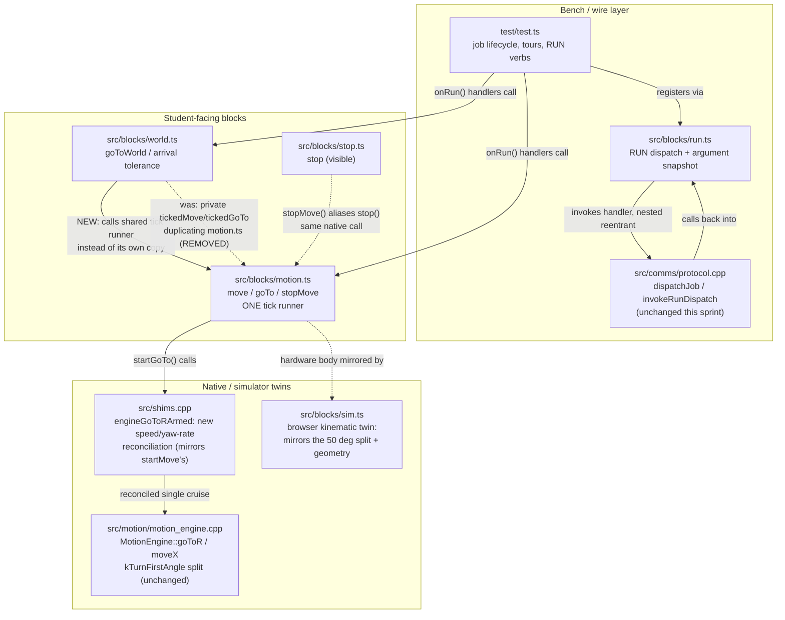

<!-- CLASI: Before changing code or making plans, review the SE process in CLAUDE.md -->

# Sprint 032: Test program, blocks and simulator parity

## Goals

Give the shipped test program one job lifecycle instead of eight
ad-hoc copies: reset the `aborted` flag, apply a named shaping profile,
and emit a terminal `<VERB>:end:<reason>` line from one shared
`beginJob()`/`endJob()` pair that every motion handler uses, so a
`RUN:abort` doesn't silently turn every later pivot/straight/face into
a one-tick no-op that reports a normal end. Snapshot RUN dispatch
arguments per dispatch so a nested `abort`/`clearestop` can't overwrite
the outer handler's `runArg()` reads, and fix the JSDoc that still
claims handlers run on their own fiber (they've run on the protocol
fiber, nested, since sprint 028). Bring the simulator to parity with
hardware on the 50° pivot-then-straight split so `move 47 cm turning
90°` doesn't silently disagree between browser and robot, and drift-test
its geometry constants against the real kernel's. Fix the small
remaining block-API issues: `goTo`'s pivot honoring the default turn
rate, arrival tolerance applying to both go-to blocks, one tick runner
instead of three divergent copies, and deleting dead `cycleStat` shim
surface.

## Problem

`test.ts`'s `aborted` flag is reset only by the eight tours
(`test.ts:59`); after any `RUN:abort`, every `RUN:pivot`/`straight`/
`face`/`cal`/`arc` stops after one tick and emits a normal `*:end` — an
instrument fault that looks exactly like a 99% under-rotation to a bench
tool that doesn't know to suspect it. The five 2026-09-01 tours and
`leverCal` set no shaping profile and emit no `TOUR:end:<reason>` — a
regression of prior fixes. `RUN:abort` can't interrupt a `goToWorld` leg.
RUN handlers still block the wire for the duration of every
`basic.showNumber`/`showString`/`pause`, leaving PING/ESTOP/abort
unserviced, and the handler-fiber JSDoc is factually wrong post-sprint-
028. `runArg()` maps a typo to 0, so `RUN:circle:abc` silently pivots
in place eight times instead of erroring. Separately, the simulator
blends every `(distance, yaw)` into one arc while hardware splits at
50° into pivot-then-straight — the block's own JSDoc ("both at once
makes an arc") is only true in the browser — and its geometry constants
(`trackWidth`, `rotationalSlip`) have no drift test and ignore
`_setGeometry`, so a calibrated robot's browser twin turns 12% differently
from the real one. Smaller: `goTo`'s pivot runs at the linear cruise
instead of honoring "set default turn rate"; three near-duplicate tick
runners exist across `motion.ts`/`world.ts`/`test.ts`; arrival tolerance
gates only one of the two go-to blocks; `cycleStat` has no caller
anywhere.

## Solution

One `beginJob(name)` that sets `touring`, clears `aborted`, applies a
named profile, and resets `maxGapMs`; one `endJob(reason)` that emits
`GAP:` and the terminal `<VERB>:end:<reason>` line; every motion
handler in `test.ts` calls both. The `abort` handler calls
`diffDrive.stopMove()` so abort becomes universal, including mid-`goToWorld`.
Replace blocking `showNumber`/`showString`/`pause` calls inside RUN
handler bodies with non-blocking forms or tick-serviced waits.
`runArgOr(i, default)` rejects NaN and non-positive radii instead of
silently mapping to 0. For the dispatch contract: bind the split
argument array into the handler call (closure value, or a push/pop
stack the nested bypass restores) instead of reassigning the
module-level `runParts`; rewrite `onRun()`'s JSDoc to say handlers run
on the wire's fiber and that anything that sleeps stalls the wire; fix
the three factually wrong comments this implies. For the simulator:
mirror the split in `_startMove` using the existing `simMoveRemain*`
machinery, with the 50° threshold drift-tested against
`kTurnFirstAngleRad`; fix `move()`'s JSDoc; add a drift test for the
sim's geometry constants and make the sim honor `_setGeometry` and
`RotationalSlip`. For the block minors: convert the default yaw rate to
a pivot cruise in `startGoTo` (or fix both comments so they agree with
the code); have `world.ts` call the shared `move()`/`goTo()` instead of
its own copy; decide `_endMove()`'s behavior once; make `turnFirstDeg`
a `const`; pass `arriveTolCm` into `_goToR`; unify `stop`/`stop move`
into one block with `stopMove` as a hidden alias; delete `cycleStat`.

## Success Criteria

- `test_run_abort_source_pin.py` (extended): every motion handler
  resets `aborted`, or `beginJob` is the only entry point that can.
- `test_run_tour_programs.py`: every tour emits a terminal line with a
  reason.
- No `basic.pause`/`showString`/`showNumber` inside a RUN handler body.
- A host test (TS type-check plus a source pin): `runArg()` after a
  nested bypass returns the outer command's argument, not the nested
  one's.
- The simulator's pivot-then-straight split threshold is drift-tested
  against `kTurnFirstAngleRad`; its geometry constants are drift-tested
  against the real kernel's; `_setGeometry`/`RotationalSlip` affect
  simulated motion.
- `goTo`'s pivot honors "set default turn rate" (or the comment is
  fixed to match the code, whichever the sprint decides); `cycleStat`
  is gone; one tick-runner implementation is shared by `motion.ts`,
  `world.ts`, and `test.ts`.

## Scope

### In Scope

- `test/test.ts`: job lifecycle (`beginJob`/`endJob`), abort's
  `stopMove()` call, non-blocking display in handler bodies,
  `runArgOr()`.
- `run.ts` / `protocol.h` / `protocol.cpp`: per-dispatch argument
  snapshot, JSDoc and comment fixes for the handler-fiber model.
- `blocks/sim.ts`: the 50° split mirror, geometry drift tests,
  `_setGeometry`/`RotationalSlip` honored.
- `blocks/motion.ts`, `blocks/world.ts`: `goTo` turn-rate fix, one tick
  runner, arrival tolerance on both go-to blocks, one stop block,
  `cycleStat` deletion.

### Out of Scope

- Everything in sprints A (motion profile — note the design's
  `omegaMax`/`MotionLimits` may eventually absorb the yaw-rate half of
  the `goTo` turn-rate fix; this sprint is sequenced independently and
  the block-level fix here is not blocked on that), B (bus/fiber
  safety), D (odometry, config descriptor table, Protocol diet beyond
  the dispatch-argument fix), E (bench tools), and F (comment work
  order beyond what's needed to fix the three factually wrong dispatch
  comments here).
- The one-fiber I2C invariant itself (sprint B) — this sprint only
  fixes the RUN-handler blocking-call symptom of handlers running on
  the protocol fiber, not the underlying bus-ownership guard.

## Related Issues

- [`code-review/test-program-job-lifecycle-abort-profile-terminal-line.md`](../../issues/code-review/test-program-job-lifecycle-abort-profile-terminal-line.md)
- [`code-review/run-dispatch-contract-argument-snapshot-and-fiber-doc.md`](../../issues/code-review/run-dispatch-contract-argument-snapshot-and-fiber-doc.md)
- [`code-review/simulator-split-parity-and-geometry-drift.md`](../../issues/code-review/simulator-split-parity-and-geometry-drift.md)
- [`code-review/goto-turn-rate-arrival-tolerance-tick-runner-cyclestat.md`](../../issues/code-review/goto-turn-rate-arrival-tolerance-tick-runner-cyclestat.md)

## Test Strategy

This is a pure host/desk sprint — no hardware, no bench session. Three
test layers apply, and every ticket says which ones it touches:

- **`tests/host/` (pytest, source-pin + native-C++-under-ctypes style).**
  `test_run_abort_source_pin.py` and `test_run_tour_programs.py` are
  extended, not replaced, since both already pin real (if incomplete)
  properties of the current file. New source-pin tests cover: the
  push/pop argument-snapshot stack surviving a nested dispatch
  (`test_run_dispatch_argument_snapshot.py`, new), the simulator's
  pivot-then-straight split threshold matching
  `MotionEngine::turnFirstAngle()` byte-for-byte (extends
  `test_motion_engine_primitives.py` or a new
  `test_sim_geometry_drift.py`), and the simulator's `kSimTrackWidth`/
  `kSimRotationalSlip` constants matching whatever the real kernel's
  fleet bake declares (same drift-test pattern
  `test_archaeology_marker_budget.py` and the existing kernel-drift
  tests already use — grep for one to match the house style before
  inventing a new one).
- **TypeScript type-check.** Every ticket touching `test/test.ts` or
  `src/blocks/*.ts` must type-check before being called done. This
  repo's `tsc`/`pxt` gate needs `node_modules` (`npm install` once) and
  a `pxt_modules/` PXT dependency tree pxt regenerates and gitignores —
  a ticket's own testing plan states which of `npx tsc --noEmit` (fast,
  catches most block-file mistakes, needs `node_modules`) or a real
  `pxt build`-in-`.tmp/` (slow, the only thing that proves the
  simulator body itself runs, per `extension-publish-pipeline` memory)
  it used, and why. A source-pin test cannot substitute for either —
  it proves shape, not compilation.
- **The archaeology-marker budget is tight (~387/388,
  `tests/dev/test_archaeology_marker_budget.py`).** Every ticket
  records its own provenance/measurement notes in its commit message,
  not as a new source comment, unless the comment documents something
  a future reader genuinely needs at that call site (the existing
  comment density in `test.ts`/`motion.ts`/`world.ts` is already the
  house style — match it, don't add a new marker-consuming block per
  ticket).
- **No hardware in this sprint.** Where a finding could only be fully
  confirmed by a robot (e.g. whether a reconciled goTo pivot rate
  "feels right" at the calibrated fleet bake), the ticket says
  UNVERIFIED and names the follow-up bench check rather than asserting
  MEASURED — see `.claude/rules/measurement-citations.md`. A simulator
  parity claim is a measurement claim: "the sim matches hardware" may
  only be asserted with a named drift test as the artifact, never as a
  bare comment.

## Architecture

**Substantial** — this sprint touches 3+ modules across two
subsystems (`test/test.ts`; `src/blocks/{run,motion,world,sim,stop}.ts`
and `src/shims.cpp`, all inside `src/blocks/DESIGN.md`'s subsystem) and
changes a cross-module dependency: `world.ts`'s `goToWorld()` currently
duplicates `motion.ts`'s tick-runner instead of calling it, and one
ticket below makes it call `motion.ts`'s exported `move()`/`goTo()`
directly — a new, explicit dependency edge that did not exist before.
No data-model change, no new external integration, so no ERD is
warranted; one component/dependency diagram is, because a real edge is
being added and removed in the same sprint.

**Everything below was verified against the CURRENT source on this
branch, not against the issues' own prose** — every one of the four
issues was code-reviewed against a snapshot from before sprints 030/031
landed, and the corrective note in this dispatch's own brief ("verify
every issue premise against current source... expect at least one to
be stale") was taken seriously. The finding here is the opposite of
what was expected: **all four issues' core premises are still
live** — confirmed by reading, not by trusting the issue text. See
"What sprints 030/031 already changed, and what they didn't" below for
the one place a premise needed real re-derivation (BT-08).

### Step 1 — The problem

Two failure classes, orthogonal to each other:

1. **Job discipline in `test/test.ts`.** Eleven `onRun()` handlers
   each hand-roll their own slice of "reset abort, pick a shaping
   profile, run the move, report how it ended" — some do all three
   correctly (`tourRobot`/`tourWheels`/`tourWorld`), some do none of
   them (`squareTour`/`infinityTour`/`snakeTour`/`diamondTour`,
   `pivot`/`face`/`arc`/`straight`/`goto`/`cal`). A bench tool reading
   a terminal line has no way to tell "this pivot under-rotated 99%"
   from "an abort from ten minutes ago never got cleared." Confirmed
   still true by direct inspection (`test/test.ts` lines ~390-1024):
   only 3 of ~11 verb handlers reset `aborted` or emit a
   reason-tagged terminal line at all.
2. **Two independent implementations of "how far does the robot turn
   for this command" disagreeing with each other and with themselves**:
   the browser simulator blends every commanded (distance, yaw) into
   one arc while the real kernel splits at 50°
   (`MotionEngine::kTurnFirstAngle`), and `goTo`'s own native path
   reuses one `cruise` value for both the pivot and the chord phases of
   its own internal split, so the "set default turn rate" block cannot
   actually reach the pivot phase of a goTo call the way it already
   reaches a plain `move()`'s pivot phase.

Neither failure class was touched by sprint 030 (bus/fiber safety) or
031 (drivetrain tuning) — both sprints edited different code for
different reasons. See the dedicated subsection below for exactly what
030/031 DID change nearby, so this sprint does not re-solve it.

### Step 2 — Responsibilities

Six distinct, independently-testable responsibilities this sprint
changes or adds:

1. **Job lifecycle** (new): one entry/exit pair every motion handler
   in `test.ts` calls, replacing eleven hand-rolled copies.
2. **Wire-fiber responsiveness**: RUN handler bodies must not block the
   protocol fiber for hundreds of ms at a time (display calls today
   do).
3. **Typo-safe argument parsing**: distinguishing "no argument given"
   from "argument given, unparseable" from "argument given, invalid
   value" at the `run.ts` layer.
4. **Dispatch-argument integrity under reentrancy**: a nested
   `abort`/`clearestop` dispatch (which now runs INSIDE a job's own
   tick loop, unchanged since sprint 028) must not corrupt the outer
   job's already-consumed — or not-yet-consumed — arguments.
5. **Simulator kinematic parity**: the browser twin must reduce a
   (distance, yaw) command the same way hardware's `MotionEngine` does,
   and its two geometry constants must track the real kernel's instead
   of silently drifting.
6. **Block-API consolidation**: collapse three near-duplicate tick
   runners to one, make `goTo`'s pivot phase honor the same "default
   turn rate" `move()`'s pivot phase already does, share one arrival
   tolerance between both go-to blocks, and remove one dead shim
   surface (`cycleStat`) and one duplicate block pairing
   (`stop`/`stop move`, now byte-identical at the native layer per
   `shims.cpp`'s `stopAll()`/`endMove()`).

### Step 3 — Modules touched, purpose, boundary

No new module is created. Every module below already exists; this
sprint changes behavior inside their existing boundaries, plus adds
one new call edge (world.ts → motion.ts).

| Module | Purpose (one sentence) | Boundary | Use cases served |
|---|---|---|---|
| `test/test.ts` | Runs the on-robot bench test program that answers named `RUN:` verbs. | Owns `touring`/`aborted`/profile state and every tour/verb body; calls into `src/blocks/*` for all actual motion. | SUC-001, SUC-002 |
| `src/blocks/run.ts` | Dispatches a wire `RUN:<name>[:args]` line to the handler(s) registered for that name. | Owns `runNames`/`runHandlers`/the argument-snapshot mechanism; never itself decides what a handler does with its arguments. | SUC-002, SUC-003 |
| `src/comms/protocol.h`/`.cpp` | Native RUN-queue/dispatch engine: `dispatchJob()`, `invokeRunDispatch()`, the abort/clearestop bypass. | Behavior is UNCHANGED this sprint (see below) — only its own doc comments are read for accuracy, none are found wrong at this layer. | (supports SUC-002/003, no behavior change) |
| `src/blocks/motion.ts` | Student-facing body-frame move blocks (`move`, `goTo`, `startMove`, `startGoTo`, `stopMove`) plus the shared tick-running pattern. | Becomes the ONE place `while (_tickDrive())` is written for a position-mode move; `world.ts` calls into it rather than repeating it. | SUC-004, SUC-006, SUC-007 |
| `src/blocks/world.ts` | Student-facing world-frame navigation (`goToWorld`, `setArrivalTolerance`). | Consumes `motion.ts`'s tick runner and (after this sprint) its shared arrival-tolerance state, rather than owning either independently. | SUC-006, SUC-007 |
| `src/blocks/sim.ts` | Browser kinematic twin of the hardware kernel + `MotionEngine`, for the MakeCode simulator. | Must reduce (distance, yaw) and geometry the same way `MotionEngine`/`shims.cpp` do; never touches real hardware. | SUC-004, SUC-005 |
| `src/blocks/stop.ts` | Student-facing safety stop blocks. | `stop()`'s native call (`_stopAll`) and `motion.ts`'s `stopMove()` native call (`_endMove`) are now identical bodies (`shims.cpp`) — this sprint picks one visible block and hides the other as an alias. | SUC-004 (indirectly, no new UC) |
| `src/shims.cpp` | Composition root / native shim layer PXT calls into. | `engineGoToRArmed()`'s shim gains the same speed/yaw-rate reconciliation `startMove()`'s shim already does — no OTHER shim in this file changes. | SUC-006 |

### Step 4 — Diagram

A component/dependency diagram is warranted here (not the sprint-020
"no diagram" exception): a real edge is added (`world.ts` →
`motion.ts`'s tick runner) and the goTo native path gains a new
internal reconciliation step mirroring one that already exists for
`move()`. Both are exactly the kind of structural change a diagram
clarifies.

### Step 5 — What changed, why, impact, migration

**What changed.** See Step 3's table. In prose: `test.ts` gains a
shared job-lifecycle pair and loses eleven hand-rolled variants of the
same three lines; `run.ts` gains a snapshot mechanism so a nested
dispatch cannot corrupt an outer handler's arguments, and loses two
stale fiber-model comments (a third stale comment in `test.ts` is also
fixed); `sim.ts` gains the same pivot-then-straight split hardware
already has, and starts reading `_setGeometry`/`RotationalSlip` instead
of ignoring them; `motion.ts`/`world.ts`/`shims.cpp` gain one shared
tick runner, one shared arrival tolerance, and a goTo pivot phase that
finally honors "set default turn rate"; `stop.ts`/`motion.ts` collapse
to one visible stop block; `cycleStat` is deleted end to end (shim,
`sim.ts` stub, and the desk-diagnostics caller surface, since nothing
calls it).

**Why.** Every finding above degrades either correctness-under-fault
(job lifecycle: an abort silently poisons every later command) or
correctness-under-porting (simulator parity: a browser lesson and a
robot disagree on where 47 cm and 90° actually ends up). Both are
exactly the failure modes a classroom deployment cannot absorb — a
student debugging their own logic against a simulator that lies about
turn radius is debugging the wrong thing.

**Impact on existing components.** `protocol.h`/`.cpp` are read, not
changed — their own doc comments already describe the current (post-
028/030) dispatch model correctly; this sprint's dispatch-argument fix
is entirely in `run.ts` (TypeScript layer), because the actual
vulnerability is `runParts` being a bare module-level variable with no
enforcement, not anything in the native queue/ownership machinery.
`stop.ts`'s public surface shrinks by zero blocks (the alias stays
callable) but the toolbox shows one fewer top-level stop control.
`world.ts` loses two private functions (`tickedMove`/`tickedGoTo`) with
no behavior change (they were already calling `startMove`/`startGoTo`
then ticking to completion, byte-for-byte what `motion.ts`'s
`move()`/`goTo()` already do).

**Migration concerns.** None for saved MakeCode projects: every
renamed/consolidated block keeps its underlying function reachable
(the "stop move" block becomes hidden, not deleted — `blockHidden`
blocks still execute for code that already used them, only the
toolbox drag target changes). `cycleStat`'s shim deletion is the one
genuinely breaking change in this sprint, and it is safe only because
this dispatch confirmed zero callers anywhere in `src/`, `test/`,
`tests/`, or `tools/` (grepped, not assumed) before scoping its
removal.

### What sprints 030/031 already changed, and what they didn't

The dispatching brief for this sprint asked explicitly whether sprint
030's fiber-safety work already fixed "the underlying cause" this
sprint's scope note calls a "symptom." Read against the actual diffs:

- **030 fixed the BUS-OWNERSHIP/FIBER-IDENTITY hazard**
  (`src/core/bus_guard.h`, `src/core/fiber_identity.h`,
  `src/core/motion_owner.h`'s `kBlock`), NOT the responsiveness
  problem. `fiber_identity.h`'s own header comment is explicit about
  what it fixes: a SECOND fiber calling `tickDrive()` while a job ran
  on the protocol fiber used to run `serviceOnce()` again,
  concurrently, corrupting the wire dispatcher's shared line buffer.
  That is a correctness/crash hazard, and it is fixed. It has nothing
  to do with a SINGLE fiber (the protocol fiber itself) blocking on its
  own `basic.showNumber`/`pause` call inside a handler body — that
  code path never involves a second fiber at all, so 030's fix cannot
  touch it. Confirmed still present: `test.ts` still calls
  `basic.showNumber`/`showString`/`pause` from inside handler bodies
  (grepped; unchanged since before 028).
- **030/031 did NOT touch `test.ts`'s job-lifecycle gap.** `test.ts`
  was last touched (per file mtime and `git log`) before both
  sprints' own ticket work; the three older tours
  (`tourRobot`/`tourWheels`/`tourWorld`) already had the fix pattern
  from an EARLIER sprint (their own comments reference sprint-028/030
  work like `readWorld()` sampling on the calling fiber), but the five
  newer tours and `straightRun`/`leverCal`/`pivot`/`face`/`arc`/`goto`
  never got it. This sprint's own scope note ("only fixes the
  symptom... not the underlying bus-ownership guard") is accurate and
  should stand as written — 030 is the guard, this sprint is the
  symptom, and the symptom is real and unfixed.
- **031's `motion.ts`/`world.ts` edits (tickets 002/003) touched
  parallax correction (`mount_z_cm`) and the wire done-reason latch —
  neither one is a tick-runner, arrival-tolerance, or turn-rate
  concern.** Grepped for overlap: zero. This sprint's block-
  consolidation tickets can proceed against the current file contents
  with no rebasing expected.
- **One premise needed real re-derivation, not just re-reading: BT-08
  ("goTo's pivot runs at the linear cruise").** The issue's own prose
  undersells the fix's size. Reading `shims.cpp::startMove()` shows
  `move()`'s pivot-then-straight split ALREADY gets this right — that
  shim reconciles `speed` and `yawRate` into one `cruise` value via a
  duration-budget calculation (whichever axis takes longer at its own
  ceiling governs), so a plain `RUN:pivot` genuinely honors
  `defaultYawRate`. `startGoTo()`'s shim (`engineGoToRArmed()`) has no
  equivalent: it takes a single `speed` and no yaw-rate input at all,
  so `MotionEngine::goToR()`'s own pivot-then-straight split
  (`queuePivotThenStraight()`) always uses the LINEAR cruise for both
  phases. A correct fix mirrors `startMove()`'s existing reconciliation
  inside `engineGoToRArmed()` rather than a TS-only patch — there is no
  TS-only fix, because `_goToR`'s single `speed`/`cruise` parameter
  threads through both phases at the native layer, and no combination
  of TS-side values can independently target two native phases through
  one native parameter. This sprint's ticket for BT-08 is scoped as the
  real (native-shim) fix rather than the sprint's own escape hatch
  ("or fix both comments to match the code") — the escape hatch is a
  correct fallback for a stakeholder who decides the classroom does not
  need pivot-rate-accurate goTo, but this dispatch defaults to the real
  fix because the pattern to copy already exists, verified working
  (`startMove()`), and the change is contained to one shim function
  plus its two callers' argument lists (`motion.ts`, `sim.ts`).

### Design Rationale

**Decision: argument-snapshot mechanism is a push/pop stack, not a
changed handler signature.**
Context: `run.ts`'s `runParts` is reassigned at module scope on every
dispatch; a nested dispatch (abort arriving mid-job, which already
happens today per `protocol.h`'s own documented reentrant path)
overwrites it while the outer handler is still running.
Alternatives considered: (1) change every `onRun(name, handler)`
registration to receive the full parts array as a parameter instead of
reading module state — rejected, since it changes the public handler
signature every existing `onRun()` call site uses, for a purely
defensive fix; (2) queue `abort`/`clearestop` like every other command
instead of dispatching them reentrantly — rejected, it reopens the
"abort waits behind the job it's meant to stop" defect sprint 016 fixed
(and `protocol.h` documents the reentrant bypass as deliberate); (3) a
push/pop stack in `run.ts`, where `wireRunDispatch()`'s callback pushes
`text.split(":")` before invoking handlers and pops in a `finally`,
and `runArgText()`/`runArgCount()` read the top of the stack — accepted.
Consequences: `onRun()`'s external signature is unchanged; a future
handler that reads `runArg()` late (inside its own tick loop, not just
at entry) becomes safe BY CONSTRUCTION rather than by convention, which
is the actual gap `protocol.h`'s own comment admits today ("every
onRun() handler in this package reads its arguments only at entry...
never later" — an invariant, not an enforced guarantee).

**Decision: `world.ts` depends on `motion.ts`, not the reverse.**
Context: three near-duplicate `while (_tickDrive())` loops exist today
(`motion.ts`'s `move()`/`goTo()`, `world.ts`'s private
`tickedMove()`/`tickedGoTo()`, `test.ts`'s `tickToCompletion()`).
Alternatives: move the tick-runner into a lower shared module both
`motion.ts` and `world.ts` import — rejected as unnecessary indirection
for a two-line loop; have `motion.ts` call up into `world.ts` — rejected,
it would invert the layering `src/DESIGN.md`'s units-ladder table
already implies (world/pose concepts sit above body-frame moves).
Accepted: `world.ts` calls `motion.ts`'s exported `move()`/`goTo()`
directly. `test.ts`'s own `tickToCompletion()` is intentionally left
alone — it does something the other two don't (checks `aborted` and
samples OTOS mid-loop), so collapsing it into the same runner would
either lose that behavior or leak bench-test-only concerns into the
student-facing block API.

**Decision: `engineGoToRArmed()` gains a yaw-rate parameter, mirroring
`startMove()`'s existing reconciliation, rather than the sprint's own
documentation-only escape hatch.**
See "What sprints 030/031 already changed" above for the full
derivation. Consequence: this ticket's blast radius is one native shim
function plus two TS callers (`motion.ts`, `sim.ts`), not a change to
`MotionEngine::goToR()` itself — the reconciliation happens BEFORE the
call into the engine, the same place `startMove()` already does it, so
`goToR()`'s own signature and `queuePivotThenStraight()` are untouched.

**Decision: one visible stop block, `stopMove` becomes a hidden
alias.**
Context: `shims.cpp`'s `stopAll()` and `endMove()` are now
byte-identical bodies (confirmed by reading both, not inferred).
Alternatives: delete `stopMove()` outright — rejected, it is called
internally throughout `test.ts`/`world.ts` as the "stop this move"
verb and deleting the exported function (not just hiding the block)
would be a breaking API change for no gain. Accepted: keep both
exported functions, keep `stop()` as the visible toolbox block (it
already outranks `stopMove` in the Stop group's weight ordering per
`stop.ts`'s own sprint-021 layout comment), mark `stopMove()`
`//% blockHidden=true`. A saved project already using the "stop move"
block keeps working; only the toolbox drag target changes for new code.

### Open Questions

1. **Does `RUN:abort` calling `stopMove()` ever stop a move it doesn't
   own?** `stopMove()`/`_endMove()` stops unconditionally regardless of
   `motionOwner_`; the ticket implementing BT-11 should confirm (via a
   host test against `protocol.h`'s documented ownership model, not
   assumption) that this is the same "abort always wins" contract
   `protocol.h` already documents for the wire-level bypass, not a new
   hazard.
2. **Exact non-blocking replacement for per-iteration
   `basic.showNumber(i+1)` progress display.** Candidates: drop it
   (rely on `DBG:`/telemetry for progress instead, already non-blocking
   via `emitLine()`) or a single non-animated LED write. Left to the
   ticket implementing it — Success Criteria only requires no blocking
   call inside a handler body, not a specific replacement.
3. **Whether the sim geometry drift test reads the real kernel's fleet
   bake or its own compiled-in defaults.** `src/DESIGN.md`'s geometry
   doctrine says `trackWidth` is per-kit-calibrated (not a fixed
   constant) — the drift test should assert the SIM's constants match
   whatever `motion_engine.h`'s own compiled defaults are (both are
   fixed source constants, comparable at build time), not a live
   per-robot bake, which the host test harness cannot read. State this
   explicitly in the ticket so "drift-tested" doesn't quietly become
   "drift-tested against the wrong number."

### Migration Concerns

None beyond what Step 5 already states — no data migration, no wire
protocol version change (this sprint touches only the TS block layer,
`run.ts`'s own TS-side dispatch state, one native shim, and the
simulator — the v6 wire grammar itself is untouched).

## Use Cases

`docs/design/usecases.md`'s catalog (UC-001..016) is entirely
student-facing block API; the bench RUN-dispatch layer this sprint
spends most of its effort on (`test.ts`, `run.ts`) has no clean parent
there — it is internal tooling, not a student use case. Where a SUC
below is really about that bench layer, its Parent names the closest
catalog entry and says so explicitly rather than forcing a fit.

### SUC-001: Bench operator sends RUN:abort mid-tour and every later command reports truthfully
Parent: UC-011 (Stop and Emergency-Stop) — extended to the bench
RUN-dispatch layer; UC-011 itself covers the student-facing `stop`/
`emergency stop` blocks, not `RUN:abort`.

- **Actor**: Bench operator / automated test harness driving the robot
  over the wire protocol.
- **Preconditions**: The robot is running the on-robot test program;
  a `RUN:abort` has been sent at some point in the session (possibly
  during a previous, unrelated command).
- **Main Flow**:
  1. Operator sends any `RUN:<verb>` that starts a motion handler
     (`pivot`, `straight`, `face`, `cal`, `arc`, `goto`, or a tour).
  2. The handler's `beginJob()` call clears the stale `aborted` flag
     and applies the profile that verb needs, regardless of what any
     earlier command left behind.
  3. The move runs to completion (or is itself interrupted by a fresh
     `RUN:abort`, which now calls `stopMove()` and lands immediately
     even mid-`goToWorld`).
  4. `endJob(reason)` emits a terminal `<VERB>:end:<reason>` line where
     `reason` is `ok`, `abort`, or `estop` — never a bare `:end` with no
     reason.
- **Postconditions**: A bench tool reading the terminal line can always
  distinguish "this move actually under-rotated" from "an abort or
  e-stop cut it short."
- **Acceptance Criteria**:
  - [ ] Every motion-issuing `onRun()` handler in `test.ts` calls
        `beginJob()`/`endJob()`; none hand-roll the reset/profile/
        terminal-line sequence independently.
  - [ ] `RUN:abort` sent during a `goto` (world-frame) leg stops that
        leg within the leg's own next tick, not just before the NEXT
        leg.
  - [ ] `test_run_abort_source_pin.py` and `test_run_tour_programs.py`
        pass, extended to cover every handler, not just the three
        original tours.

### SUC-002: Wire protocol stays responsive (PING/ESTOP/abort) while a RUN job displays progress
Parent: UC-011 (Stop and Emergency-Stop) — an e-stop or abort sent
while a job is mid-display-call must still be serviced promptly, which
is this UC's own contract, just reached through the bench layer instead
of a student's own blocks.

- **Actor**: Bench operator sending `PING`/`ESTOP`/`RUN:abort` while a
  tour is running.
- **Preconditions**: A `RUN:` job is in progress and its handler body
  would previously have called a blocking display primitive
  (`basic.showNumber`/`showString`/`pause`).
- **Main Flow**:
  1. The job's handler reaches a point where it used to block for
     hundreds of ms on a display call.
  2. With the blocking call replaced (non-blocking form, or removed in
     favor of the already-non-blocking `emitLine()`/`sendValue()`
     telemetry), the protocol fiber's own servicing
     (`serviceOnce()`/the tick-driven service hook) keeps running on
     schedule.
  3. A `PING`/`ESTOP`/`RUN:abort` sent during that window is answered
     within one poll interval, not delayed by the display call.
- **Postconditions**: No RUN handler body contains a call that blocks
  the calling (protocol) fiber for a visually-noticeable duration.
- **Acceptance Criteria**:
  - [ ] No `basic.pause`/`basic.showString`/`basic.showNumber` call
        remains inside any `onRun()` handler's call tree in `test.ts`.
  - [ ] A source-pin test enforces this (regex/AST scan of `test.ts`),
        not just a one-time manual check.

### SUC-003: A nested abort dispatch cannot corrupt an outer job's arguments
Parent: none in the existing catalog — this is an internal
correctness property of the RUN dispatch mechanism, not a
student-visible behavior. Closest adjacent entries: UC-002 (Drive at a
Constant Speed or Twist) and UC-005/006, all of which are reached
through `onRun()` handlers whose arguments this protects.

- **Actor**: The RUN dispatch mechanism itself (`run.ts` +
  `protocol.cpp`), exercised by any two commands where the second
  (`abort`/`clearestop`) arrives while the first is still executing.
- **Preconditions**: A job is dispatched and mid-execution, ticking on
  the protocol fiber; `abort` or `clearestop` arrives and is dispatched
  via the reentrant bypass documented in `protocol.h`.
- **Main Flow**:
  1. The outer handler calls `runArg()`/`runArgText()` at any point
     during its own execution (today: always at entry; after this
     sprint: safe even if called later).
  2. The nested `abort` dispatch pushes its own argument frame, runs,
     and pops it on return.
  3. The outer handler's subsequent `runArg()` reads see the OUTER
     command's arguments, never the inner one's.
- **Postconditions**: Argument integrity holds regardless of handler
  authoring discipline — it is enforced by the stack, not by a
  "read at entry" convention every future handler must remember.
- **Acceptance Criteria**:
  - [ ] A host test asserts `runArgText()` returns the outer command's
        argument text after a simulated nested dispatch, via a
        source-pin/TS-shape check consistent with this repo's
        `tests/host/` style (no PXT runtime available host-side).
  - [ ] `run.ts`'s and `test.ts`'s stale "handlers run on their own
        fiber via MessageBus" comments are corrected to describe the
        actual single-fiber nested-dispatch model.

### SUC-004: A student's simulator run and hardware run of the same move end at the same place
Parent: UC-005 (Drive an Arc), UC-016 (Develop and Test in the Browser
Simulator).

- **Actor**: A student running `move(47, 90)` (or any distance+yaw
  combination with `|yaw| >= 50°`) first in the browser simulator,
  then on the physical robot.
- **Preconditions**: None beyond a normal MakeCode project using the
  `move`/`goTo` blocks.
- **Main Flow**:
  1. Student runs the block in the simulator; `sim.ts`'s `_startMove`
     now mirrors hardware's pivot-then-straight split at the same
     threshold (`kTurnFirstAngle`, drift-tested, not hand-copied).
  2. Student runs the identical block on the robot.
  3. Both end at the same relative position, to within the sim's
     idealized (frictionless) kinematic model — no 30cm-forward/
     30cm-left vs 0cm-forward/47cm-left divergence.
- **Postconditions**: The simulator's own JSDoc ("both at once makes an
  arc") is corrected to state the split explicitly, matching what the
  code now does at both layers.
- **Acceptance Criteria**:
  - [ ] `sim.ts`'s `_startMove` splits into two phases (pivot, then
        straight) whenever `|yaw| >= ` the shared threshold, using the
        existing `simMoveRemainDist`/`simMoveRemainYaw` machinery.
  - [ ] The threshold is drift-tested against
        `MotionEngine::turnFirstAngle()`, not a second hand-typed
        literal.
  - [ ] `move()`'s JSDoc no longer claims "both at once makes an arc"
        unconditionally.

### SUC-005: A student's calibrated chassis geometry is reflected in the simulator
Parent: UC-013 (Calibrate the Chassis for a Non-Reference Kit), UC-016
(Develop and Test in the Browser Simulator).

- **Actor**: A student or instructor who has run the calibration
  workflow (UC-013) and pastes the resulting `setGeometry()`/kernel-
  value block into their project.
- **Preconditions**: The project calls `_setGeometry`/`_setKernelValue`
  (or the block-level wrapper) with a measured `trackWidth`/
  `rotationalSlip`.
- **Main Flow**:
  1. Student runs a move in the simulator.
  2. The simulator's kinematics now read the values the calibration
     block set, instead of the fixed `kSimTrackWidth`/
     `kSimRotationalSlip` stand-ins.
  3. A 12% turn-rate discrepancy (the measured gap between the sim's
     hardcoded constants and a differently-calibrated kit) no longer
     exists for a kit that has calibrated and pasted its own values.
- **Postconditions**: The simulator's default constants (unset case)
  are drift-tested against the real kernel's own compiled defaults, so
  the two can never silently diverge again even before a student
  calibrates anything.
- **Acceptance Criteria**:
  - [ ] `_setGeometry`/`_setKernelValue` (`RotationalSlip` field)
        actually change `simYawRate`'s divisor in `sim.ts`, not just
        record an unread value.
  - [ ] A drift test pins the sim's DEFAULT geometry constants against
        `motion_engine.h`'s own compiled defaults.

### SUC-006: A student's goTo pivot turns at the configured turn rate, not the linear speed
Parent: UC-006 (Drive a Curved Path to a Point), UC-014 (Tune Default
Move Speed and Turn Rate).

- **Actor**: A student who has called `set default turn rate` and then
  `go to x _ y _` with a target requiring a pivot-then-straight split
  (bearing >= the split threshold).
- **Preconditions**: `defaultYawRate` differs meaningfully from
  `defaultSpeed`.
- **Main Flow**:
  1. Student calls `go to x 0 y 100` (a target requiring roughly a 90°
     pivot then a straight run).
  2. `startGoTo()`'s native shim (`engineGoToRArmed`) reconciles
     `defaultSpeed`/`defaultYawRate` into one `cruise` value using the
     SAME duration-budget approach `startMove()`'s shim already uses
     for `move()`, instead of always using `defaultSpeed` for the pivot
     phase.
  3. The pivot phase visibly (and measurably, in a host geometry test)
     takes as long as `180° / defaultYawRate`, not
     `180° / (linear-speed-reinterpreted-as-degrees)`.
- **Postconditions**: `set default turn rate` has the same effect on
  `goTo`'s pivot phase that it already has on `move()`'s.
- **Acceptance Criteria**:
  - [ ] `engineGoToRArmed()` accepts a yaw-rate input and reconciles it
        against speed before calling `MotionEngine::goToR()`, mirroring
        `startMove()`'s existing algebra.
  - [ ] `sim.ts`'s `_goToR` mirror applies the same reconciliation so
        simulator and hardware agree on this too (ties back to SUC-004).
  - [ ] A host test pins the reconciliation formula against
        `startMove()`'s, not a newly-invented one.

### SUC-007: A student's arrival tolerance applies to both go-to blocks
Parent: UC-006 (Drive a Curved Path to a Point), UC-014 (Tune Default
Move Speed and Turn Rate).

- **Actor**: A student who calls `set arrival tolerance` and then uses
  EITHER `go to x _ y _` (motion.ts, body-frame) or
  `go to world x _ y _` (world.ts).
- **Preconditions**: `set arrival tolerance` has been called with a
  value other than the 1mm hardcoded default.
- **Main Flow**:
  1. Student calls `set arrival tolerance 3` then `go to x 20 y 0`.
  2. The shared arrival-tolerance state (moved to `motion.ts`, the
     lower layer per this sprint's dependency-direction decision) feeds
     `_goToR`'s `arrive` parameter for BOTH blocks, not just
     `goToWorld`.
- **Postconditions**: Setting arrival tolerance once affects every
  go-to block a project uses, consistently.
- **Acceptance Criteria**:
  - [ ] `motion.ts`'s `startGoTo()` no longer hardcodes
        `goalArrive = 1`; it reads the shared tolerance.
  - [ ] `world.ts`'s `setArrivalTolerance()` and `motion.ts`'s go-to
        path observably share one underlying value (a host test, not
        just code inspection).

## GitHub Issues

(GitHub issues linked to this sprint's tickets. Format: `owner/repo#N`.)

## Definition of Ready

Before tickets can be created, all of the following must be true:

- [ ] Sprint planning document is complete (sprint.md, including its
      Architecture and Use Cases sections)
- [ ] Architecture review passed (or skipped, for changes with no
      architectural impact)
- [ ] Stakeholder has approved the sprint plan

## Tickets

| # | Title | Depends On | Issue |
|---|-------|------------|-------|
| 001 | test.ts job lifecycle: beginJob/endJob, universal abort via stopMove, terminal lines with reason | — | test-program-job-lifecycle-abort-profile-terminal-line.md |
| 002 | test.ts: remove blocking display calls from RUN handler bodies | 001 | test-program-job-lifecycle-abort-profile-terminal-line.md |
| 003 | run.ts: typo-safe runArgOr(), applied to radius/rate arguments | 001 | test-program-job-lifecycle-abort-profile-terminal-line.md |
| 004 | RUN dispatch: push/pop argument snapshot across nested dispatch; fix the three stale fiber-model comments | 001 | run-dispatch-contract-argument-snapshot-and-fiber-doc.md |
| 005 | Simulator: mirror the 50-degree pivot-then-straight split in _startMove, drift-tested against kTurnFirstAngle | 004 | simulator-split-parity-and-geometry-drift.md |
| 006 | Simulator: drift-test geometry constants against the kernel; honor _setGeometry/RotationalSlip | 005 | simulator-split-parity-and-geometry-drift.md |
| 007 | goTo native pivot turn-rate: reconcile speed/yaw-rate in engineGoToRArmed, mirroring startMove | 006 | goto-turn-rate-arrival-tolerance-tick-runner-cyclestat.md |
| 008 | Block API cleanup: one tick runner (world.ts calls motion.ts), shared arrival tolerance, const turnFirst, one stop block, delete cycleStat | 007 | goto-turn-rate-arrival-tolerance-tick-runner-cyclestat.md |

Tickets execute serially in the order listed. 002 and 003 both depend
only on 001 (not on each other) but are listed in the order they will
in practice run, since this sprint's execution model is strictly
serial regardless of whether a dependency requires it.
