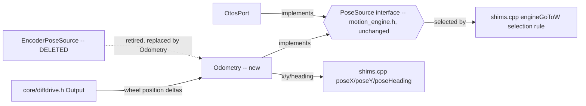
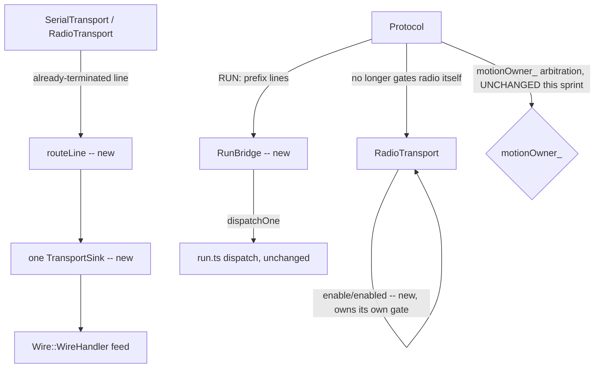

<!-- CLASI: Before changing code or making plans, review the SE process in CLAUDE.md -->

# Sprint 033: Cohesion: odometry object, config descriptor table, Protocol diet

## Goals

Close the three biggest cohesion losses the last two sprints introduced.
Odometry becomes one object (`Odometry`, host-portable) that directly
implements `PoseSource` instead of being spread across `Rig`'s
`x/y/heading`/`odomPos*`/`odomPrimed`/two epochs, a free `odomUpdate()`
function, and `EncoderPoseSource`'s 45-line lifetime essay holding
`const float&` into `Rig`; the kernel gains `rearmReferences()` so the
engine's rebase-epoch guard (written three times today) collapses to
one. The config surface — five hand-synchronised ordinal tables
(`setKernelValue`, `getConfigValue`, `WireAdapter::kFields`,
`ConfigField`, `diagValue`) — becomes one descriptor table the switches
and `kFields` read from, `Rig::softStop()` replaces four copies of the
soft-stop triplet, and the go-to timeout becomes an ordinary config
field instead of per-call singleton state dodging PXT's 4-argument
shim limit. `Protocol` goes on a diet: the cleartext RUN bridge becomes
a separable, host-tested `RunBridge`; the three scattered radio-enable
gates move onto `RadioTransport` itself; `routeLine()` replaces the
copy-pair serial/radio poll branches and the two identical
strip-a-trailing-byte sinks; `motionOwner_`/`jobOwnsMotion_` collapse
to one flag; the vestigial two-writer guards and retries (dead since
the emit ring made the protocol fiber the sole producer) are deleted.
Alongside these three, the wire-protocol minors: the telemetry
terminator/strip-check bug that can silently truncate a plausible
number, the single-line-per-pass RX drain with dead counters, an
uncounted `handleRun()` refusal path, the sequence-id wrap guard, and
`GET rebase` answering "unknown name" for an advertised field.

## Problem

`Rig` holds pose state directly; `odomUpdate()` is a free function over
it; `EncoderPoseSource` holds `const float&` references into `Rig` with
a lifetime essay explaining why that's safe; `resetPose()`, `seedPose()`,
and `SET rebase` are three writers with three different pre-steps;
`poseX()` mutates state as a side effect of reading. The rebase-epoch
guard this forces is written in `odomUpdate()`, `serviceMove()`, and
`progress()` — three copies of one fact. The config surface's five
tables must be hand-kept in sync; `protocol.h:281`'s "ordinal 30"
comment error is the direct cost of that duplication (the true count is
28; 30 is a different field entirely). The soft-stop triplet
(`engine.endMove` + `kernel.neutral` + `deliverStopNow`) is written out
in `stopAll`, `endMove`, the watchdog, and `updateMove` — four places
that must agree. `pendingGoToDeadlineMs_` lives on the singleton purely
to dodge a 4-argument shim limit. `Protocol` has grown a RUN bridge, a
motion arbiter, and three radio gates that belong on `RadioTransport`
(which already self-enables lazily); both transports carry two-writer
guards and retries whose comments still describe a TS-fiber writer that
hasn't existed since the emit ring shipped. Smaller: `emitHeader()`/
`emitFrame()` drop their trailing `\n` at exactly 239 bytes and both
sinks strip the last byte blind regardless, turning a plausible number
wrong; only one inbound line is drained per transport per pass with
silent overflow/drop and dead RX counters; `handleRun()`'s refusals
(overlong/non-printable/empty payloads) are uncounted and the 400 ms
dedupe eats a repeated `abort`; `expectedNext_` wraps at `UINT32_MAX`
with no guard; `GET rebase` has no read path.

## Solution

`Odometry` class (`src/motion/` or `src/platform/`) with `update(const
Output&)`, `reset()`, `seed(x, y, h)`, implementing `PoseSource`
directly — retiring `EncoderPoseSource`, its lifetime essay, and the
`Rig` pose fields; `odomUpdate()`'s math moves unchanged into
`Odometry::update()` with a host test that integrates a known wheel
path; one epoch guard lives inside `Odometry`, and the engine's two
copies go away as a byproduct of sprint A's lazy-origin-capture design
(this sprint's `Odometry` work depends on that having landed, per the
issue's own dependency note) plus the kernel's new `rearmReferences()`.
Decide once whether pose reads advance odometry (today three call
sites disagree). For config: one descriptor table `{name, ordinal, get,
set, unit}` in `shims.cpp` that both switches and `kFields` read from;
`ConfigField` generated from it where PXT can't import directly (a
script plus a drift test); `Rig::softStop()` replacing the four soft-stop
copies; the go-to timeout as an ordinary field in the same table. For
`Protocol`: `RunBridge` (host-portable like `RunQueue`) with `offer()`,
`dispatchOne()`, `currentText()`, dedupe and bypass rules host-tested
in isolation; `RadioTransport::enable()/enabled()` with `sendLine`/
`tryReceiveLine` returning false while disabled, retiring the three
scattered gates; `routeLine(handler, buf, len)` and one `TransportSink`
so both transports hand off an already-terminated line without a
strip-and-re-append round trip; one `nowMs()`; one owner flag replacing
`motionOwner_`/`jobOwnsMotion_`; deletion of `sending_` and the
transports' vestigial retries, with drop counters kept and the four
comment blocks rewritten to state the single-writer reality. For the
wire minors: bound the frame append at `sizeof - 2` and write `\n`
last, with both sinks checking the terminator before stripping (extend
the pathological-239-byte-frame test); drain up to N lines per
transport per pass and wire or delete the dead RX counters; one
`runMalformed_` counter with bypass names exempted from the dedupe;
guard the sequence-id wrap; give `GET rebase` a real read path or a
documented write-only refusal code.

## Success Criteria

- `grep -n positionEpoch src/motion src/shims.cpp` finds one reader.
- Every wire config name round-trips through SET/GET in a host test;
  every ordinal has exactly one definition; `grep -c 'deliverStopNow'
  src/shims.cpp` is 1.
- `Protocol` is composition plus `run()`; `RunBridge` has its own host
  tests independent of `Protocol`.
- The extended pathological-239-byte-frame test asserts the terminator
  survives; RX drop/accept counters actually increment; the sequence-id
  wrap is guarded; `GET rebase` answers correctly or with a documented
  refusal code instead of "unknown name".

## Scope

### In Scope

- `Odometry` object, `EncoderPoseSource` retirement (`src/motion/` or
  `src/platform/`, `src/core/rig.*`).
- Kernel `rearmReferences()` (`src/core/diffdrive.*`) — coordinate with
  sprint A since both touch the kernel; if sprint A's K4 already lands
  `rearmReferences()`, this sprint consumes it rather than re-adding it.
- Config descriptor table, `Rig::softStop()`, go-to deadline as a
  config field (`shims.cpp`, `wire_adapter.cpp`, `blocks/*.ts`
  `ConfigField`).
- `Protocol` diet: `RunBridge`, `RadioTransport` enable/enabled,
  `routeLine()`, one sink, one owner flag, vestigial guard deletion
  (`comms/protocol.*`, `comms/radio_transport.*`,
  `comms/serial_transport.*`, `comms/run_bridge.*` new).
- Wire minors: terminator/strip-check, RX drain and counters,
  `handleRun()` refusal counter, sequence-id wrap guard, `GET rebase`
  (`comms/wire_adapter.*`).

### Out of Scope

- Everything in sprints A (motion profile — including the kernel patches
  K1-K5, which this sprint's `rearmReferences()` work depends on having
  landed or landing concurrently), B (bus/fiber safety — the
  bus-ownership guard and fiber-identity check are separate from this
  sprint's `Protocol` diet, though both touch `protocol.cpp`), C (test
  program/blocks/simulator), E (bench tools), and F (comment work
  order).
- The one-fiber I2C invariant and the tick-service-hook fiber check —
  sprint B.

## Related Issues

- [`code-review/odometry-object-and-kernel-rearm-references.md`](../../issues/code-review/odometry-object-and-kernel-rearm-references.md)
- [`code-review/config-descriptor-table-softstop-goto-deadline.md`](../../issues/code-review/config-descriptor-table-softstop-goto-deadline.md)
- [`code-review/protocol-diet-runbridge-radio-enable-routeline.md`](../../issues/code-review/protocol-diet-runbridge-radio-enable-routeline.md)
- [`code-review/wire-minors-telemetry-terminator-rx-counters-seq-wrap.md`](../../issues/code-review/wire-minors-telemetry-terminator-rx-counters-seq-wrap.md)

## Test Strategy

All work in this sprint is host-testable — no bench session, no
hardware, no firmware flash except the mandatory closing
build-checkpoint. Every ticket extends `tests/host/`, compiled from the
real portable C++ sources (this repo's existing two-handle-shim
convention — `fake_ports.h`, `*_shim.cpp`, `FakePoseSource`,
`FakeSleeper` — never a mock of the class under test).

- **Odometry** (ticket 002): a new `tests/host/test_odometry.py`
  integrating a known wheel-count path through `Odometry::update()` and
  comparing it against `odomUpdate()`'s existing math — a regression
  test, not new behavior. `encoder_pose_source_syntax_check.cpp` is
  retired with the class it checks.
- **Config descriptor table** (ticket 003): extend
  `tests/host/test_config_descriptor_table.py` — today scoped to only
  the 10 sprint-029 shaping fields — to sweep every wire name in the
  unified table, reusing `test_wire_motion_verbs.py`'s existing
  `test_get_set_sweeps_every_kfields_entry_without_overflow` pattern as
  the full-surface check; a drift test comparing the generated
  `ConfigField` TS enum against the table if PXT cannot import it
  directly.
- **`Rig::softStop()` / go-to deadline field** (ticket 004): a
  call-count/mock-port host test proving `stopAll()`, `endMove()`, the
  watchdog, and `updateMove()`'s completion branch all route through
  the one function; a SET/GET round-trip test for the new
  `goto_timeout` (or similarly named) field through the same descriptor
  table ticket 003 built.
- **RunBridge** (ticket 005): a new `tests/host/test_run_bridge.py`,
  fully host-portable, exercising `offer()`/`dispatchOne()`/
  `currentText()`/dedupe/bypass in isolation from `Protocol` — the same
  shape `RunQueue`'s own host tests already use.
- **RadioTransport enable/enabled, `routeLine()`, one sink** (ticket
  006): extend whatever host-portable seam already exists for framing
  logic (`radio_transport_rx_capacity_shim.cpp` is the precedent); note
  up front that `RadioTransport`/`SerialTransport`/`Protocol`
  themselves are NOT host-testable (they include `pxt.h`) — per
  `src/DESIGN.md` §6/§8's own standing convention, changes there are
  "verified by code review, first exercised live at the bench," and
  this ticket must say so explicitly rather than claim a host test
  covers what it cannot.
- **Wire minors** (ticket 007): extend the existing pathological
  239-byte-frame test to assert the terminator survives after the
  bound-and-write-last fix; new assertions that RX drop/accept counters
  actually increment; a `runMalformed_`-counter test; a sequence-id-wrap
  unit test (`expectedNext_` seeded near `UINT32_MAX`); a `GET rebase`
  test for whichever resolution ticket 007 picks (real read path, or a
  documented refusal code distinguishable from "unknown name").
- **wifi_link identifier rename** (ticket 008): no behavior test —
  pure rename. The pass/fail gate is
  `tests/host/test_no_units_in_identifiers_source_pin.py` with the
  `wifi_link` exclusion removed, plus `tests/host/test_wifi_link.py`
  staying green.
- **Dead tick-overrun counters** (ticket 001):
  `tests/host/test_cyclestat_deleted.py`'s docstring updated to match
  whichever resolution is chosen; if deleted, a grep-based assertion the
  fields are gone; if wired up, a host test asserting the new ordinal
  reads a real value.
- **Regression**: each ticket runs its scoped `tests/host/` subset
  (`.claude/rules/source-code.md`); the full host suite runs once, at
  `close_sprint`, not per ticket.
- **No hardware acceptance is claimed by any ticket in this sprint.**
  If an implementer finds a change that genuinely cannot be verified
  host-side, that is a finding to raise to the team-lead, not something
  to paper over with an unverified MEASURED claim
  (`.claude/rules/measurement-citations.md`).

## Architecture

**Sizing: Substantial.** Five modules across three dependency layers
are touched (`src/motion/`-or-`src/platform/` for the new `Odometry`;
`src/shims.cpp`'s config surface; `src/comms/protocol.*`/
`radio_transport.*`/`serial_transport.*`/a new `run_bridge.*`;
`src/comms/wire_adapter.*`/`wire_handler.*`; `src/comms/wifi_link.*`),
two new cross-module types are introduced (`Odometry` as a new
`PoseSource` implementation consumed by `MotionEngine`/`shims.cpp`;
`RunBridge` as a new object composed into `Protocol`), and one existing
cross-module relationship is retired (`EncoderPoseSource`'s
reference-holding tie to `Rig`). Full 7-step methodology, diagrams
included.

### Architecture Overview

**Step 1 — every premise re-verified against current source, 2026-09-05
(not read from the issue text alone), per this sprint's mandate to
check desk-ticket premises before planning around them:**

- **Odometry issue** — CONFIRMED still live: `EncoderPoseSource`
  (`src/platform/encoder_pose_source.h`) still holds `const float&`
  into `Rig`, full lifetime essay intact; `Rig::x/y/heading`/
  `odomPos*`/`odomPrimed`/`odomPositionEpoch*` (`shims.cpp:121-127`)
  are unmoved. But the issue's own stated blocker — "depends on
  kernel-reference-handling (K4) and the design's lazy origin
  capture" — is **already satisfied**: `DifferentialDrive::
  rearmReferences()` shipped in sprint 029 ticket 001
  (`src/core/diffdrive.h:213`, `.cpp:393`) and is already called from
  `MotionEngine::service()` (`src/motion/motion_engine.cpp:442`); lazy
  origin capture shipped the same sprint (`Segment::originPending`,
  `src/motion/segment.h`). And the "three copies" of the rebase-epoch
  guard the issue names are **already down to one**:
  `MotionEngine::progress()` (`motion_engine.cpp:536`) and the
  pivot-then-straight handoff (`motion_engine.cpp:372-375`) now branch
  on `seg_.originPending` — a plain bool, not an epoch comparison — so
  the only surviving epoch *comparison* anywhere in the codebase is
  `odomUpdate()`'s own `r.odomPositionEpochLeft/Right` vs.
  `out.positionEpochLeft/Right` check (`shims.cpp:335-352`). The ticket
  is unblocked and smaller than advertised: "build `Odometry`, retire
  `EncoderPoseSource`, fold in the one remaining epoch guard," not
  "collapse three guards into one."
- **Config descriptor table issue** — CONFIRMED live, and the
  team-lead's re-anchoring against sprint 029 is correct. Sprint 029
  ticket 004 built `kLimitsFields` (`shims.cpp` ~1097), a
  `{ordinal, setter, field}` table over `MotionLimits` covering exactly
  the 10 shaping fields (`v_floor`, `stop_distance`, `accel`, `decel`,
  `v_max`, `jerk`, `omega_max`, `omega_floor`, `arrive_dist`,
  `arrive_yaw`) with its own host test,
  `tests/host/test_config_descriptor_table.py`. The other ~24 config
  ordinals (kernel PID/stall/lambda fields, `default_cruise`,
  `rotational_slip`, `stall_clear`, `rebase`, `estop_clear`) are **not**
  covered — `setKernelValue()`/`getConfigValue()` still switch on them
  individually (92 `case` labels total in `shims.cpp` as of this
  reading); `WireAdapter::kFields` (`wire_adapter.cpp:125`) and the TS
  `ConfigField` enum (`blocks/motion.ts:16`) are separately
  hand-kept and are not even the same length as each other — direct,
  present-tense evidence of the drift the issue names, not just a
  historical argument. `Rig::softStop()` does not exist (zero grep
  hits); the four-site soft-stop triplet is real and unconsolidated.
  `deliverStopNow` appears 15 times in `shims.cpp` as of this reading
  (calls plus comments) — more than the 9 the team-lead's brief
  measured earlier today, because intervening commits keep moving this
  number; the target ("exactly one definition") is unaffected by which
  raw count precedes it, and ticket 003/004's acceptance test should
  assert the target, not a specific starting count.
  `pendingGoToDeadlineMs_` is confirmed a `shims.cpp`-local singleton
  (`engineSetGoToDeadline()`/`engineSetGoToYawRate()`,
  `shims.cpp:1523-1544`) with **no** `wire_adapter.cpp` involvement —
  lower-risk to extract than the issue text alone suggests. The
  `protocol.h:281` "ordinal 30" defect is CONFIRMED and now precisely
  diagnosed: `protocol.h:361`'s comment claims the RUN-queue overflow
  counter is "readable (diagValue ordinal 30)," but the actual reader
  is `case 28: return protocolRunDropCount();` (`shims.cpp:1153`) —
  ordinal 30 doesn't exist in `diagValue()`'s switch at all (falls to
  `default: return 0`), and in the *separate* config-ordinal namespace
  30 is `omega_max` (`src/DESIGN.md` §5) — exactly the cross-table
  confusion five hand-synced tables produce.
- **Protocol diet issue** — PARTIALLY OVERTAKEN. "One owner flag
  replacing `motionOwner_`/`jobOwnsMotion_`" (CM-14) already shipped in
  sprint 030: `WireAdapter::jobOwnsMotion_` is gone, replaced by
  `externalOwner_` (a `core/motion_owner.h::MotionOwner`, the same type
  `Protocol::motionOwner_` uses), set exclusively through
  `WireAdapter::setExternalOwner()` (`wire_adapter.cpp:411`) and
  checked at every motion-verb intake
  (`wire_adapter.cpp:475/517/551/594/619/650`). This sprint's
  Protocol-diet tickets carry one fewer deliverable than the issue text
  describes for that reason — verification, not implementation. The
  remaining four findings are CONFIRMED still live: no `run_bridge.*`
  file exists (the RUN-parking/dedupe/dispatch logic lives inline in
  `protocol.h`/`.cpp`); `radioEnabled_` is still a `Protocol`-owned
  field checked at three call sites the source itself labels "Gate 1/2/
  3 of 3" (`protocol.cpp:216,648,707,736`, plus `enableRadio()`);
  `sending_` two-writer guards are present verbatim in both
  `radio_transport.cpp:170-186` and `serial_transport.cpp:62-96`;
  `routeLine()`/`TransportSink` do not exist anywhere in `src/comms/`.
- **Wire minors issue** — CONFIRMED live at every finding re-checked.
  `GET rebase` is confirmed refusing via `onGet()`'s explicit early
  return (`wire_adapter.cpp:909`), commented in the source as a
  deliberate (if now-reconsidered) choice, not an oversight — ticket
  007 should treat that comment as the design decision to revisit, not
  assume a bug was left unnoticed. The terminator/RX-drain/
  refusal-counter/seq-wrap findings were not independently re-verified
  line-by-line (lower drift risk — no intervening sprint touched
  `wire_handler.cpp`'s frame-emission code), but nothing in 029/030/032's
  own record claims to have fixed them.
- **`strip-units-from-wifi-link-identifiers`** — CONFIRMED live,
  unaffected by 029/030/032 (none of them touch `wifi_link.*`).
- **`dead-tick-overrun-counters-after-cyclestat-deletion`** — filed
  2026-09-05 as sprint 032's own follow-up, already carries its own
  verification table in the issue text; nothing further to re-check.

**Step 2 — responsibilities this sprint introduces or changes,
grouped:**

1. Own the robot's dead-reckoned pose as one object, implementing
   `PoseSource` directly (currently: a `Rig`-scoped free function plus
   five scattered fields plus a reference-holding adapter).
2. Own the mapping from a config-field's canonical name to its
   ordinal, getter, setter, and unit, in one place four call sites
   currently duplicate by hand.
3. Own the "stop the drivetrain right now" sequence as one callable
   (currently four independent copies).
4. Own the cleartext RUN-command parking/dedupe/dispatch surface as a
   separable, host-testable object (currently inline in `Protocol`).
5. Own "is the radio allowed to transmit/receive right now" as a
   property of `RadioTransport` itself (currently three gates on
   `Protocol`).
6. Own routing an already-framed line from either transport to the
   wire handler through one path (currently a copy-pair of poll
   branches and two duplicated strip-a-trailing-byte sinks).
7. Correct five independent small wire-protocol defects (terminator
   truncation, single-line RX drain, uncounted RUN refusals, sequence
   wrap, `GET rebase`) that share no code but share one theme: state
   that looks handled but silently isn't.
8. Rename ~70 unit-suffixed identifiers in one transport
   (`wifi_link.*`) plus three judgment-call names left by an earlier
   sprint, to the project's own naming rule.
9. Resolve two write-only diagnostic counters left behind by a
   deletion in the previous sprint.

Responsibilities 1 and 3 both touch `shims.cpp`'s pose/config surface
but change independently (pose math vs. config plumbing) — kept as
separate tickets (002 vs. 003/004). Responsibilities 4-6 all reduce
`Protocol`'s surface area and are sequenced together (005-007) because
each is easier to do correctly once the previous one has shrunk
`protocol.cpp`. Responsibility 2 is genuinely two adjacent tables in
one issue text (config ordinals) but the remedy folds them into one
new table — kept as one ticket (003) plus a dependent follow-on for the
two things that *use* a config-shaped field but aren't part of the
four hand-synced tables (softStop, go-to deadline — ticket 004).

**Step 3 — modules:**

| Module | Purpose (one sentence) | Boundary | Serves |
|---|---|---|---|
| `Odometry` (new, `src/motion/` or `src/platform/`) | Turns kernel wheel-position deltas into a dead-reckoned `(x, y, heading)`. | Inside: `update()`/`reset()`/`seed()`, the one epoch guard, the midpoint-heading integration math moved unchanged from `odomUpdate()`. Outside: how a caller decides *when* to call `update()` (still `shims.cpp`'s tick/pose-read call sites); the kernel's own `Output` type. | SUC-001 |
| `ConfigDescriptorTable` (new, inside `shims.cpp`; consumed by `wire_adapter.cpp`, generated into `blocks/motion.ts`) | Maps one config field's wire name to its ordinal, getter, setter, and unit. | Inside: the ~24 non-shaping config ordinals' `{name, ordinal, get, set, unit}` rows. Outside: the 10 shaping fields (already `kLimitsFields`' concern, sprint 029, untouched); diag ordinals (`diagValue()`, a different, read-only namespace this sprint does not fold in — see Design Rationale). | SUC-002 |
| `Rig::softStop()` (new method on the existing `Rig`, `shims.cpp`) | Delivers the kernel-neutral-plus-port-zero stop sequence exactly once. | Inside: the triplet itself. Outside: *when* to call it (unchanged call sites: `stopAll`, `endMove`, the watchdog, `updateMove`'s completion branch). | SUC-002 |
| `RunBridge` (new, `src/comms/run_bridge.h/.cpp`, host-portable like `RunQueue`) | Parks, dedupes, and hands off one cleartext RUN command at a time. | Inside: `offer()`, `dispatchOne()`, `currentText()`, the 400 ms dedupe, the abort/clearestop bypass rule. Outside: dispatching the dequeued text into TypeScript (`Protocol::dispatchJob()` keeps that call), the ring's storage (`run_queue.h`, unchanged). | SUC-003 |
| `RadioTransport` (existing, gains `enable()`/`enabled()`) | Decides, by itself, whether it is allowed to transmit or receive. | Inside: the enable/disable state and the lazy bring-up it already owned. Outside: who calls `enable()` (unchanged: `Protocol`'s own lazy-enable-on-first-use call site moves onto the transport, not away from any caller). | SUC-003 |
| `Protocol` (existing, shrinks) | Plumbs bytes between the transports and the v6 wire stack. | Inside, after this sprint: composition, `run()`'s poll/dispatch loop calling `routeLine()`, ownership arbitration (`motionOwner_`, unchanged). Outside: the RUN bridge's own state (moved to `RunBridge`), the radio-enable gates (moved to `RadioTransport`), per-transport line framing (unchanged, `SerialTransport`/`RadioTransport`'s own concern). | SUC-003 |
| `WireAdapter`/`WireHandler` (existing, five small fixes) | Decode/encode the v6 grammar and dispatch verbs. | Unchanged boundary; five internal correctness fixes (terminator, RX drain, refusal counting, seq wrap, `GET rebase`). | SUC-004 |
| `wifi_link.*` (existing, renamed identifiers only) | The WiFi transport's AT-command state machine. | Unchanged boundary and behavior; internal names only. | SUC-005 |

**Step 4 — diagrams.**

No diagram for the config-descriptor-table work (`ConfigDescriptorTable`/
`Rig::softStop()`): consolidating four hand-synced ordinal-keyed tables
into one is a data-shape change, not a new relationship between
components — the existing `setKernelValue()`/`getConfigValue()`/
`kFields`/`ConfigField` call graph is unchanged; only what backs each
call changes. Same for the wire-minors and identifier-rename work
(responsibilities 7-9): no new component, no changed dependency.

Two diagrams cover the two places this sprint *does* add or remove a
relationship between components:

**Step 5 — What Changed / Why / Impact / Migration** (per module,
compressed; the full prose is Steps 1-3 above and Design Rationale
below):

- *What changed*: see the eight items in Step 3's table plus the wire
  minors and rename items in Step 2.
- *Why*: each is a named, present-tense cohesion loss or correctness
  defect re-verified above — not a style preference.
- *Impact on existing components*: `MotionEngine`, `DifferentialDrive`,
  `WireHandler`'s grammar, and every wire verb's external behavior are
  UNCHANGED — this sprint is an internal reshuffle with one exception
  worth flagging loudly: `GET rebase` and the RX-drain/counter fixes
  ARE observable behavior changes to a host polling those specific
  wire responses (Step 7 below covers whether that is in-scope).
- *Migration*: see the Migration Concerns section below.

**Step 7 — Open questions:**

1. **Does a pose read still advance odometry as a side effect?**
   (`odomUpdate()`'s three call sites today disagree: `poseX()`
   unconditionally advances it, `updateMove()` gates on `wasActive`,
   `tickDrive()` doesn't gate at all.) The issue's own Remedy says
   "decide once" but doesn't decide. **Recommendation for ticket 002:**
   keep `poseX()`/`poseY()`/`poseHeading()`'s existing "reads advance"
   contract — `src/DESIGN.md` §5 documents it as **load-bearing**
   ("nothing else advances odometry between moves and the 50 ms
   telemetry tick is what keeps pose current"), so changing it is a
   behavior change this sprint's stated scope (cohesion, not behavior)
   doesn't ask for. Fold `tickDrive()`'s unconditional call and
   `updateMove()`'s gated call into `Odometry::update()` unchanged;
   document the "reads mutate" contract on `Odometry` itself instead of
   leaving it implicit.
2. **Does `GET rebase` get a real read path, or a documented refusal
   code?** CM-16 offers both; the current `onGet()` comment already
   argues for refusal ("no stored value... refuse outright... rather
   than manufacture a reading"). **Recommendation:** keep refusing, but
   make the refusal a distinguishable `Wire::Result` (e.g.
   `kWriteOnly`) instead of the generic `kUnknown` an actually-absent
   field gets — this fixes CM-16's real complaint (an advertised field
   answering identically to a typo) without inventing a fake reading.
   Left for ticket 007 to confirm or override with its own reasoning.
3. **Do the RX-drop/accept counters (CM-06) get wired to existing diag
   ordinals or new ones?** Not decided here; ticket 007's own
   acceptance criteria should name the ordinals it lands on so a later
   sprint's config-table work doesn't have to rediscover them.
4. **Sprint 031 coordination** — see Migration Concerns.

### Design Rationale

- **Decision: keep diag ordinals (`diagValue()`) out of the unified
  config descriptor table, despite the issue text listing `diagValue`
  among the "five hand-synchronised tables."**
  *Context*: `diagValue()`'s 30 cases are read-only diagnostics
  (fault counts, stall/estop booleans, position/duty snapshots) with no
  `SET` counterpart and no natural "unit" the `{name, ordinal, get,
  set, unit}` shape assumes uniformly.
  *Alternatives considered*: (a) fold `diagValue()` into the same
  table with a null `set`; (b) leave it fully separate, as today.
  *Why this choice*: (a) would force every consumer of the unified
  table to handle a "no setter" case that only ~30 of ~60+ total rows
  need, for a benefit the issue's own Remedy doesn't actually ask for
  (the Remedy says "kFields and both switches read from it" — it never
  names `diagValue`). The `protocol.h:281` defect this sprint fixes is
  a *comment* pointing at the wrong table's ordinal space, not evidence
  that the two namespaces should merge.
  *Consequences*: `diagValue()` stays a fifth, still-separate table
  after this sprint — the issue's count of "five tables becomes one"
  is therefore "four becomes one, diag stays separate, and the
  cross-table confusion that caused the comment bug is fixed by
  precision, not merger." State this explicitly in ticket 003 so a
  future reader doesn't reopen the issue believing diag was supposed
  to be included.
- **Decision: `ConfigField` (TypeScript) is generated by a script with
  a drift test, not imported directly from the C++ table.**
  *Context*: PXT compiles a fixed TypeScript file set; it cannot
  `#include` or reflect over `shims.cpp` at build time.
  *Alternatives considered*: (a) hand-maintain `ConfigField` as today,
  now checked against the C++ table by a drift test only; (b) a
  generation script that writes `ConfigField` from the C++ table,
  checked in as a build/dev step, with a drift test asserting the
  checked-in file matches a fresh run.
  *Why this choice*: (b) — a hand-maintained enum with only a drift
  test still requires a human to remember to update it and only tells
  them *after* they forgot; a generator removes the remembering step
  for the common case (adding/renaming a field) and the drift test
  becomes a backstop against someone editing the generated file
  directly instead of skipping the generator step. This mirrors the
  issue's own Remedy wording ("generate `ConfigField` from it... a
  script plus a drift test are acceptable where PXT cannot import").
  *Consequences*: one more script in `tools/` or a repo-root dev
  script; ticket 003 must document how/when to re-run it (a pre-commit
  hook is out of scope for a sprint about cohesion, not tooling).
- **Decision: `RunBridge` extraction happens before `RadioTransport`
  enable/`routeLine()` work (ticket 005 before 006), not the reverse or
  concurrent.**
  *Context*: both live in `protocol.cpp`/`.h` today; extracting either
  first shrinks the file the other must be read against.
  *Alternatives considered*: (a) `RadioTransport`/`routeLine()` first;
  (b) `RunBridge` first; (c) one combined ticket.
  *Why this choice*: (b) — `RunBridge`'s boundary (park/dedupe/dispatch
  one RUN command) is more self-contained and has a closer existing
  analog (`RunQueue`'s own host-test shape) to copy, so it is lower-risk
  to extract first; `routeLine()`/one-sink work benefits from a
  `protocol.cpp` that has already lost the RUN-bridge's local state,
  making the remaining poll-loop restructuring easier to read and
  review. (c) was rejected — it exceeds "one unit of work completable
  in one focused session" for a single ticket.
  *Consequences*: ticket 006 depends on 005 (see Tickets table); a
  mid-sprint stop after 005 leaves `Protocol` in a valid, smaller-but-
  still-correct intermediate state (no partial `routeLine()` work to
  half-revert).
- **Decision: `sending_` two-writer guards and their bounded retries
  are deleted outright, not reduced to a single caller assertion.**
  *Context*: the issue's own Remedy already calls for deletion,
  reasoning that the emit ring made the protocol fiber the sole
  producer; this decision records *why the plan agrees* rather than
  re-litigating it.
  *Alternatives considered*: (a) delete outright, per the issue; (b)
  keep as a defensive assert-only guard (log-and-continue on a second
  caller, never expected to fire) in case a future change reintroduces
  a second writer without updating this comment.
  *Why this choice*: (a) — `src/DESIGN.md` §6/§8 already document, in
  the present tense, that both transports' two-writer guards are
  vestigial and their comments describe a fiber that no longer exists;
  keeping a defensive assert for a scenario the architecture doc says
  cannot happen would be exactly the kind of state umm "looks handled"
  drift this sprint exists to remove (Step 2, responsibility 7's own
  theme). Drop counters are kept (per the issue's Remedy) since they
  answer a real, still-open question ("did radio ever drop a line"),
  distinct from the two-writer race.
  *Consequences*: if a future sprint ever reintroduces a second writer
  (e.g., a new fiber calling `sendLine()`), it will corrupt state
  silently rather than hit a guard — `src/DESIGN.md`'s own "single
  writer: the protocol fiber" invariant becomes the only thing
  preventing that, so ticket 006 must rewrite the four comment blocks
  as the issue's Remedy specifies, not merely delete code.

### Migration Concerns

- **No wire-facing name is added, removed, or renumbered by this
  sprint.** Every config/diag ordinal a host can already `GET`/`SET`/
  `probe()` keeps answering exactly as it does today (`GET rebase`'s
  refusal-code change, if ticket 007 adopts the Design/Open-Questions
  recommendation, changes *which* error code comes back, not whether
  the field is reachable — a host checking for a specific `kUnknown`
  vs. a new `kWriteOnly` is the only caller that could notice, and none
  of this project's own `tools/` currently branches on that
  distinction). No firmware-side data format changes, so there is no
  data migration.
- **Sprint 031 coordination (real, file-level).** Sprint 031
  (`sprint/031-drivetrain-tuning-and-gate-acceptance-on-tovez`) is
  parked mid-execution, 7/16 tickets done, on its own unmerged branch,
  with unmerged commits touching `motion_engine.*`, `segment.h`, and
  `wire_adapter.cpp` (an engine-side done-reason latch
  `lastSegmentEndedByDeadline_`/`engineMoveEndedByDeadline()`, changes
  to `resolvePendingReason()`, and `wrongWay()` gating in
  `MotionEngine::service()`). Checked against this sprint's actual
  ticket scopes (not assumed from the issue text):
  - **Ticket 002 (Odometry)** — LOW risk. It touches `shims.cpp`'s
    pose fields, new `Odometry` files, and deletes
    `platform/encoder_pose_source.h`. It does **not** need to touch
    `motion_engine.cpp`'s `service()`/`wrongWay()` or `segment.h` (the
    `PoseSource` interface itself is unchanged — `Odometry` is a new
    implementer, not an interface edit). Low collision.
  - **Ticket 003/004 (config table, softStop, go-to deadline)** —
    LOW-MEDIUM risk. `kFields` lives in `wire_adapter.cpp`
    (`wire_adapter.cpp:125`), the same file 031 edits for
    `resolvePendingReason()` — different functions, but the same file,
    so a merge will need a rebase even though a line-level conflict is
    unlikely.
  - **Tickets 005/006 (RunBridge, RadioTransport/routeLine)** — NO
    collision. Confined to `comms/protocol.*`, `radio_transport.*`,
    `serial_transport.*`, a new `run_bridge.*` — none of which 031's
    unmerged commits touch.
  - **Ticket 007 (wire minors)** — MEDIUM risk, the sprint's real
    collision point: `GET rebase` is implemented in `onGet()`
    (`wire_adapter.cpp:899-911`), in the same file as 031's
    `resolvePendingReason()` changes. Different functions again, but
    dense enough in that file (motion-completion resolution, §5 of
    `src/DESIGN.md`, is a tightly-commented section) that this ticket's
    implementer should read 031's actual diff before touching
    `wire_adapter.cpp`, not just avoid the named functions by name.
  - **Ticket 008 (wifi_link rename)** — LOW risk. `wifi_link.*` is
    untouched by 031; the `yaw`-rename judgment call in
    `wire_adapter.cpp onMoveX()` is a same-file, different-region edit
    (LOW, not NO, for that one piece).
  - **Recommendation**: land or merge sprint 031 before executing
    ticket 007 if at all possible; if 031 is still unmerged when 033
    reaches ticket 007, that ticket's implementer rebases onto 031's
    actual commits rather than planning blind against a branch that
    might have moved again. This is a sequencing note for the
    team-lead, not a blocker to writing this plan.
- **Mandatory closing build ticket.** Per `src/DESIGN.md` §11's
  standing convention, every sprint that touches build-eligible source
  ends with a build-checkpoint ticket running `tools/make_deploy.py`
  and confirming a flashable hex results from the sprint's own final
  state — ticket 009 below. This is process, not a migration per se,
  but it is the sprint's own backstop against a `-std=c++11`-only
  defect class the host suite (`-std=c++20`) cannot catch (`src/
  DESIGN.md` §11).

### Revision (as-built, 2026-09-06)

All nine tickets are done. The following implementation details diverged
from the plan above, deliberately and for reasons each ticket's own
record states — left here so a future reader of this Architecture
section does not take the planned shape as what shipped.

- **Ticket 001**: no alternative reader was wired up. `r.tickOverrunCount`,
  `simCycleCount`, and `simTickOverrunCount` were deleted outright, per
  the plan's own stated default.
- **Ticket 002**: `Odometry` landed in `src/motion/odometry.h` (the
  plan's other candidate location, `src/platform/`, was not used). It
  takes a `const MotionEngine&` at construction and reads
  `countsPerMm()`/`effectiveTrackWidth()` from it fresh on every call
  rather than owning geometry itself; `selectPoseSource()` moved into
  the same header. Open Question 1 was resolved exactly as recommended
  ("reads mutate odometry") and is documented on the class.
- **Ticket 003**: the plan's single `{name, ordinal, get, set, unit}`
  table split into two, along a portability seam the plan did not
  anticipate: `src/comms/config_fields.h` holds the host-portable
  `kConfigFields[]` (`{name, ordinal, unit}`, each row carrying a
  `// ConfigField.<Name>: "<label>"` annotation for the generator), and
  `src/shims.cpp` holds `kConfigAccessors[]` (`{ordinal, get, set}`)
  beside the untouched sprint-029 `kLimitsFields` — the behaviour half
  needs `pxt.h` and could not move to the header. `WireAdapter::kFields`
  was deleted outright. The generator is `tools/gen_config_field_enum.py`
  (`--check` for drift). Satisfying "same length, name-for-name" required
  the TS `ConfigField` enum to gain `Rebase = 32` and `EstopClear = 33`,
  reversing an earlier "wire-only, not in the block dropdown" comment for
  those two names — on the `StallClear = 17` precedent.
- **Ticket 004**: `Rig::softStop()` landed as a member function
  absorbing the former free function `deliverStopNow()`, rather than a
  new free function alongside it. `updateMove()`'s completion branch now
  also runs `engine.endMove()` + `kernel.neutral()`, documented in the
  source as inert at that call site (the port write already delivers the
  stop within the same tick). The go-to deadline is wire field
  `goto_timeout`, ordinal 39, unit ms, stored as `Rig::goToDeadline`.
- **Ticket 005**: `RunBridge::offer(data, len, now)` returns an `Offer`
  enum (`kMalformed`/`kSuppressed`/`kBypass`/`kQueued`/`kDropped`), not a
  bool; the clock is a parameter, not a member, so a host test can land
  timestamps on the window's edges. **The dedupe window is 400 ms, not
  the 3 s this Architecture section and `src/DESIGN.md` §8 stated** — the
  3 s figure was already stale before this sprint (the 2026-09-02 code
  review had flagged it); the code had been 400 ms, for a reason recorded
  in its own comment, and the ticket preserved that behavior exactly
  rather than "restoring" the stale documented figure. `src/DESIGN.md`
  §8 and this sprint.md's own Solution/Use Cases sections are corrected
  to 400 ms.
- **Ticket 006**: the one sink is a template, `TransportSink<Transport>`,
  plus a free function `wireLineContentLength()`, in a new host-portable
  `src/comms/transport_sink.h`. `routeLine()` landed as a private
  `Protocol` method; the WiFi inbound path's own copy of the
  strip-and-`RUN:`-carve-out logic (a third copy the plan did not
  separately name) was folded through the same path. The clock helper is
  `Protocol::clockNow()` (`// [ms]` trailing comment), not the plan's
  `nowMs()` spelling — the no-units-in-identifiers rule postdated this
  ticket's own text. `RadioTransport::enabled()` is still consulted at
  the two `emitTelemetry()` call sites, deliberately, so a disabled
  radio's handler does not advance header state — narrower than the
  plan's "the three gates move onto `RadioTransport`, full stop" framing.
  `sending_`, the serial retry loop, `kMaxSendAttempts`, and
  `emitLineNow()`'s sleep-and-retry were deleted as planned; drop
  counters were kept.
- **Ticket 007**: new wire error code 12, `ERR_WRITE_ONLY`/
  `Wire::kErrWriteOnly`, resolves Open Question 2 as "keep refusing,
  distinguishably," via `Adapter::onGet()` returning `Wire::Result`
  instead of `bool`. `estop_clear` keeps its existing real read path,
  unaffected. Open Question 3 (RX counters) resolved as "wire up," not
  delete: `RadioRxCounters{frames, accepted, oversizeDropped,
  overrunDropped}` via a new host-portable `radioRxClassify()`, at diag
  ordinals 31-34; the RUN-malformed counter landed at diag ordinal 30.
  `Protocol::kRxDrainPerPass = 4` for all three transports — the number
  came from serial's ~276 B/24 ms into a 255 B ring and WiFi's existing
  bound, not a figure the plan named. The sequence-id wrap is handled by
  reserving `kMaxSequenceId` (`UINT32_MAX`) as an always-invalid id — a
  line carrying it is a decode failure (`nack` + `err 3`) — rather than a
  wrap guard directly on `expectedNext_`.
- **Ticket 008**: 16 identifiers, 90 occurrences, renamed in
  `wifi_link.{h,cpp}`; `wifi_uart.*` needed no change. `onMoveX()`'s
  local landed as `engineRotation`, not the plan's suggested `rotation`,
  because `rotation` would have shadowed the function's existing
  parameter of that name. `yawRadPerS` had already been renamed to
  `yawRateFloored` by sprint 032 ticket 007, before this ticket opened.
  `WireAdapter::NowMsFn` and the shim-local `gNowMs` were left
  unrenamed — recorded in the ticket as known remaining misses, not
  claimed as done.
- **Ticket 009**: desk build only, as planned; hex from commit
  `8af1326` kept at `captures/sprint-033-build-checkpoint-20260906/`.
  Intermediate desk builds after tickets 002-007 also passed on the
  first attempt.

## Use Cases

This is a cohesion/correctness refactor sprint with (by design) almost
no user-visible behavior change — most SUCs below describe *preserved*
behavior a host or student must not see change, plus the small number
of genuine, deliberate behavior deltas (the `GET rebase` refusal code,
the RX counters actually incrementing). Each SUC is sized to that: short
where the change is purely internal, fuller where a wire-visible answer
changes.

### SUC-001: Pose stays correct and internally consistent after becoming one object
Parent: UC-009 (Read Robot Pose), UC-010 (Reset Pose)

- **Actor**: A student program (via `poseX`/`poseY`/`heading`) or a wire
  host (via telemetry/`GET`-equivalent pose reads).
- **Preconditions**: The robot has driven some known wheel-count path.
- **Main Flow**:
  1. The kernel publishes a new `Output` each `step()`.
  2. `Odometry::update()` (replacing free-function `odomUpdate()`)
     integrates the wheel deltas into `(x, y, heading)`, using the same
     midpoint-heading math as before, unchanged.
  3. A pose read (`poseX()`/telemetry/`SET rebase`) returns the same
     numeric answer it would have returned before this sprint, for the
     same wheel-count history.
- **Postconditions**: Pose is identical, tick-for-tick, to the
  pre-refactor implementation; `EncoderPoseSource` no longer exists;
  `MotionEngine::goToW()`'s `PoseSource` selection is unaffected.
- **Acceptance Criteria**:
  - [ ] `grep -n positionEpoch src/motion src/shims.cpp` finds exactly
        one reader (the Success Criteria's own bar).
  - [ ] A host test integrates a known wheel path through
        `Odometry::update()` and matches `odomUpdate()`'s pre-refactor
        output bit-for-bit (within float tolerance).
  - [ ] `grep -rn EncoderPoseSource src/` finds nothing outside
        `src/DESIGN.md`'s own historical narrative.
  - [ ] The "does a pose read advance odometry" contract (Architecture
        §Open Questions #1) is documented on `Odometry` itself, not
        left implicit.

### SUC-002: The config surface answers every wire name from one source of truth
Parent: UC-015 (Advanced Kernel Tuning via the Config Escape Hatch), UC-014 (Tune Default Move Speed and Turn Rate)

- **Actor**: A bench host or a student program's Setup-group blocks.
- **Preconditions**: None — applies to every existing `SET`/`GET`/
  `ConfigField` call.
- **Main Flow**:
  1. A host sends `SET <name> <value>` or `GET <name>`, or a block
     calls `setConfigValue(ConfigField.X, value)`.
  2. The lookup resolves through the one descriptor table (for the
     ~24 non-shaping fields) or `kLimitsFields` (for the 10 shaping
     fields, unchanged from sprint 029) — never a fourth hand-copied
     switch.
  3. The same round-trip that worked before this sprint still works,
     byte-for-byte, for every existing name.
  4. A stop is requested (`stop`/`stop move`/watchdog/move-completion)
     and reaches the motors through `Rig::softStop()`.
  5. A `goTo`/`GO_TO_R` call's deadline is read from the same config
     table instead of a call-scoped singleton.
- **Postconditions**: Every wire config name still round-trips; no
  ordinal has more than one definition; `deliverStopNow` has exactly
  one call site; `protocol.h`'s RUN-overflow comment names the correct
  ordinal (28, not 30).
- **Acceptance Criteria**:
  - [ ] Every wire config name round-trips through SET/GET in a host
        test (Success Criteria's own bar).
  - [ ] `grep -c 'deliverStopNow' src/shims.cpp` is 1.
  - [ ] `WireAdapter::kFields` and the TS `ConfigField` enum are the
        same length and agree name-for-name (drift test).
  - [ ] `protocol.h:361`'s comment is corrected to name ordinal 28.
  - [ ] The go-to deadline is settable/gettable through the same table
        as every other config field; `pendingGoToDeadlineMs_` (or its
        successor) is no longer a bespoke singleton.

### SUC-003: A RUN command and a wire motion verb are still arbitrated identically after Protocol's diet
Parent: UC-007 (Start a Move Without Blocking and Poll It), UC-011 (Stop and Emergency-Stop)

- **Actor**: A bench host (wire verbs) and a cleartext `RUN:` sender
  (radio or serial), potentially at the same time.
- **Preconditions**: `motionOwner_`'s three-way arbitration
  (`kNone`/`kWire`/`kJob`/`kBlock`) is unchanged by this sprint — this
  SUC exists to prove the diet doesn't quietly change it.
- **Main Flow**:
  1. A `RUN:<name>` line arrives; `RunBridge::offer()` parks or dedupes
     it exactly as the current inline logic does.
  2. `Protocol::dispatchJob()` calls `RunBridge::dispatchOne()`/
     `currentText()` in place of the inline ring read, with identical
     observable timing and dedupe behavior.
  3. A wire motion verb arriving while a job holds the drivetrain is
     still refused with the same `kBusy`-shaped answer as before.
  4. `RUN:abort`/`RUN:clearestop` still bypass the queue and act
     immediately, unaffected by radio being enabled or disabled.
  5. Radio enable state now lives on `RadioTransport` itself; a caller
     asking "is radio allowed to send/receive" gets the same answer at
     the same three points in the flow as the old three gates gave,
     just asked of one object instead of three inline checks.
- **Postconditions**: `Protocol` is composition plus `run()`;
  `RunBridge` has independent host tests; no behavior a host or student
  program can observe has changed.
- **Acceptance Criteria**:
  - [ ] `Protocol` is composition plus `run()`; `RunBridge` has its own
        host tests independent of `Protocol` (Success Criteria's bar).
  - [ ] The existing 400 ms same-text dedupe and abort/clearestop bypass
        behave identically before and after (host test where possible,
        code-review-verified where not, per Test Strategy).
  - [ ] `radioEnabled_`'s three call sites are gone from `protocol.cpp`;
        `RadioTransport::enabled()` is the single source of that
        answer.
  - [ ] `sending_` and its retries are deleted from both transports;
        the four comment blocks describing a TS-fiber writer are
        rewritten to state the single-writer reality.

### SUC-004: A host sending a malformed, oversized, or edge-timed wire line gets an honest, counted answer
Parent: UC-015 (Advanced Kernel Tuning via the Config Escape Hatch) — the wire protocol's own robustness surface has no dedicated student-facing UC; this SUC's actor is a bench host, not a student program

- **Actor**: A bench host (`tools/`, or a hand-typed serial session).
- **Preconditions**: None — these are edge cases any session can hit.
- **Main Flow**:
  1. A telemetry frame lands exactly at the 239-byte pathological
     length; both sinks check the terminator before stripping instead
     of stripping blind.
  2. More than one inbound line arrives in a single 24 ms tick; up to N
     are drained per transport per pass instead of exactly one, and the
     RX drop/accept counters actually increment.
  3. `handleRun()` receives an overlong, non-printable, or empty-name
     payload; it is refused AND counted (`runMalformed_`), and a
     repeated `abort` is exempted from the 400 ms dedupe rather than
     silently eaten.
  4. `expectedNext_` is near `UINT32_MAX`; the wrap is guarded rather
     than silently resetting sequencing to 0.
  5. A host sends `GET rebase`; it gets a distinguishable "write-only"
     answer (or a real read, per Open Question #2's resolution) instead
     of the same `kUnknown` a genuine typo gets.
- **Postconditions**: Every one of the five findings (CM-06/07/08/15/16)
  is fixed and covered by its own host test.
- **Acceptance Criteria**:
  - [ ] The extended pathological-239-byte-frame test asserts the
        terminator survives (Success Criteria's bar).
  - [ ] RX drop/accept counters actually increment (Success Criteria's
        bar).
  - [ ] The sequence-id wrap is guarded (Success Criteria's bar).
  - [ ] `GET rebase` answers correctly or with a documented refusal
        code instead of "unknown name" (Success Criteria's bar).
  - [ ] `handleRun()`'s refusal counter increments on each of the three
        named refusal shapes, and a repeated `abort` still executes.

### SUC-005: Identifiers in the WiFi transport say what they measure, not what they're named
Parent: N/A — internal identifier hygiene, no behavior change (this project's own naming rule, `.claude/rules/no-units-in-identifiers.md`)

- **Actor**: A future reader/editor of `src/comms/wifi_link.*`.
- **Preconditions**: None.
- **Main Flow**:
  1. Every unit-suffixed identifier in `wifi_link.h`/`.cpp` (~70,
     e.g. `kCommandTimeoutMs`, `nowMs_`) is renamed per the project
     rule, with a trailing `// [unit]` comment on each declaration.
  2. `shims.cpp`'s `yawRadPerS` (in `startMove()`) and the
     collision-avoidance spellings `distanceF`
     (`shims.cpp::startMove()`) and `yaw`
     (`wire_adapter.cpp::onMoveX()`) are folded in as the same class of
     fix, per the issue's own note.
  3. `tests/host/test_no_units_in_identifiers_source_pin.py`'s
     `wifi_link` exclusion is removed.
- **Postconditions**: No behavior change; every renamed identifier
  keeps its exact value and control flow.
- **Acceptance Criteria**:
  - [ ] The source-pin test's `wifi_link` exclusion is removed and the
        test passes.
  - [ ] `tests/host/test_wifi_link.py` stays green, unmodified in
        behavior-asserting content.
  - [ ] Every renamed identifier carries a trailing `// [unit]` comment
        per the rule.

### SUC-006: A tick-overrun counter is either real or gone, never write-only
Parent: N/A — internal diagnostic hygiene; the counter itself has no student-facing UC

- **Actor**: A future maintainer reading `shims.cpp`/`sim.ts` or
  reaching for a `DIAG`/`STATUS` field.
- **Preconditions**: Sprint 032 ticket 008 deleted `cycleStat()`/
  `_cycleStat()` and left `r.tickOverrunCount`/`simTickOverrunCount`/
  `simCycleCount` writing every tick with no reader.
- **Main Flow**:
  1. The decision (delete vs. wire up a real reader) is made explicitly
     and recorded, not left as "the variable is there so it must matter."
  2. If deleted: the three fields and their per-tick increments are
     removed; `diagValue()` case 19 (`out.cycleOverrunCount`, the
     KERNEL's own, separately-sourced counter) is explicitly left
     untouched — the issue's own named near-miss.
  3. If kept: a real `DIAG`/`STATUS` ordinal is assigned and documented,
     distinct from diag ordinal 19.
  4. `src/DESIGN.md:1747-1748` and
     `tests/host/test_cyclestat_deleted.py`'s docstring are updated to
     match whichever way this goes — both currently say "deliberately
     left in place," which becomes false the moment this ticket lands.
- **Postconditions**: No write-only diagnostic state remains from the
  `cycleStat()` deletion.
- **Acceptance Criteria**:
  - [ ] The decision is stated in the ticket's own record (delete or
        wire up), with the near-miss (diag ordinal 19) explicitly
        called out as untouched.
  - [ ] `src/DESIGN.md` and `test_cyclestat_deleted.py`'s docstring
        both reflect the actual resulting state.
  - [ ] If wired up: the new ordinal is documented in `probe()`'s doc
        comment the same way every other diag ordinal is.

## GitHub Issues

(GitHub issues linked to this sprint's tickets. Format: `owner/repo#N`.)

## Definition of Ready

Before tickets can be created, all of the following must be true:

- [x] Sprint planning document is complete (sprint.md, including its
      Architecture and Use Cases sections)
- [x] Architecture review passed (or skipped, for changes with no
      architectural impact)
- [x] Stakeholder has approved the sprint plan

## Tickets

| # | Title | Depends On | Issue |
|---|-------|------------|-------|
| 001 | Resolve dead tick-overrun counters left by `cycleStat()` deletion | — | `dead-tick-overrun-counters-after-cyclestat-deletion.md` |
| 002 | Odometry object implementing `PoseSource`; retire `EncoderPoseSource` | — | `code-review/odometry-object-and-kernel-rearm-references.md` |
| 003 | Unified config descriptor table replacing `setKernelValue`/`getConfigValue`/`kFields`/`ConfigField` | — | `code-review/config-descriptor-table-softstop-goto-deadline.md` |
| 004 | `Rig::softStop()` consolidation and go-to deadline as a config field | 003 | `code-review/config-descriptor-table-softstop-goto-deadline.md` |
| 005 | Extract `RunBridge` from `Protocol`'s inline RUN-command parking/dedupe/dispatch | — | `code-review/protocol-diet-runbridge-radio-enable-routeline.md` |
| 006 | `RadioTransport` enable/enabled, `routeLine()` + one `TransportSink`, delete vestigial two-writer guards | 005 | `code-review/protocol-diet-runbridge-radio-enable-routeline.md` |
| 007 | Wire minors: telemetry terminator, RX drain/counters, `handleRun` refusal counter, seq-id wrap, `GET rebase` | 006 | `code-review/wire-minors-telemetry-terminator-rx-counters-seq-wrap.md` |
| 008 | Strip units from `src/comms/wifi_link.*` identifiers and fold in remaining judgment calls | 007 | `code-review/strip-units-from-wifi-link-identifiers.md` |
| 009 | Build checkpoint: confirm a flashable hex from the sprint's final state | 001, 002, 003, 004, 005, 006, 007, 008 | — |

Tickets execute serially in the order listed. 001, 002, 003, and 005
have no hard prerequisite and could in principle run in any relative
order, but are sequenced up front (before the chain 004→…→008) because
they touch the least-shared surface — see the Architecture section's
Design Rationale for why 005 precedes 006, and why 007/008 land after
the `Protocol`/`wire_adapter.cpp` surface has settled. Ticket 009 is
mandatory and always last, per `src/DESIGN.md` §11's standing
build-checkpoint convention.
