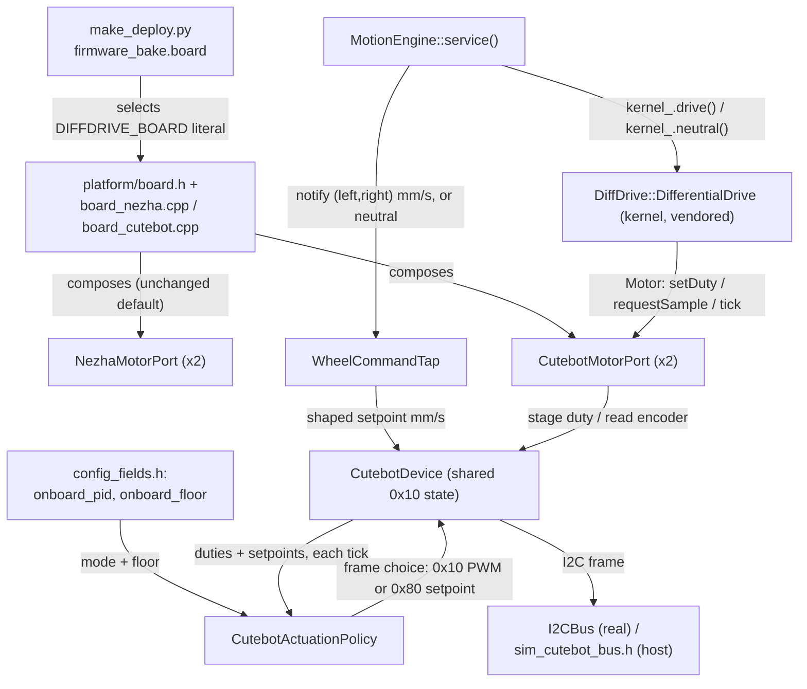

<!-- CLASI: Before changing code or making plans, review the SE process in CLAUDE.md -->

# Sprint 040: Cutebot Pro board seam, motor port, and hybrid actuation on the host

## Goals

Land the Cutebot Pro as a second `DiffDrive::Motor` board, entirely on
the host, with zero behaviour change on the existing Nezha fleet. Per
`clasi/issues/cutebot-pro-board-seam-and-hybrid-port.md`'s Proposed
resolution and `docs/design/cutebot-pro-support.md` §9's Sprint 040
paragraph:

1. **Board seam.** Move the §2.1 leak list (the `Rig`-concrete motor
   pair, diag ordinals, `configureMotor`, the fault-handler stop frame,
   `kRole`, `make_deploy.py`'s `_MOTOR_BAKE_RES`/`EXPECTED_CPP_FILES`)
   behind a compile-time board composition — `platform/board.h` +
   `board_nezha.cpp`/`board_cutebot.cpp` — selected by a new
   `geometry.firmware_bake.board` key, Nezha by default so every
   existing fleet build stays byte-identical. Host suite stays green
   throughout.
2. `CutebotMotorPort : DiffDrive::Motor` and a shared `CutebotDevice`
   for the 0x10 slave: revision probe at `begin()`, both wheels'
   duties coalesced into one `0x10` PWM frame per kernel cycle, degrees
   x10 = counts, held `sampleTime()` on a NACK, a per-board emergency
   stop frame.
3. `WheelCommandTap`: an optional observer `MotionEngine` notifies with
   the shaped `(left, right)` mm/s alongside every `kernel_.drive()`
   and "neutral" alongside every `kernel_.neutral()`
   (`motion_engine.cpp:368`, `:406`, and the neutral sites).
4. `CutebotActuationPolicy`: a pure function choosing the PWM frame or
   the `0x80` onboard-speed-loop setpoint frame per tick — modes off /
   threshold-with-hysteresis / plateau-only — gated on both wheels
   being eligible, backed by two new `config_fields.h` rows
   (`onboard_pid`, `onboard_floor`) so `onboard_pid 0` is always the
   escape hatch back to pure PWM.
5. `tests/host/sim_cutebot_bus.h` (v2 frames, revision probe, encoder
   degrees from `SimWheel`, `0x50` clear, and `0x80` modelled as a
   simulated onboard loop with the 200 mm/s clamp), a port shim and
   tests, tap and policy tests, `sim_tour.py --board cutebot-pro`, the
   pxt-bound TU list and `EXPECTED_CPP_FILES` updated.
6. Fleet JSON for the assigned board in `radio-robot-lib`
   (`hardware_model`, `firmware_bake.board`), `pxt.json` files, and
   docs (`src/platform/DESIGN.md`, `src/DESIGN.md` §7, `design.md`
   layer table).

## Problem

`src/DESIGN.md` §1's layer map already separates kernel/motion/comms
from hardware, but the Nezha brick still leaks above the
`DiffDrive::Motor` port in about a dozen concrete places (§2.1 of the
design doc enumerates all of them). A second board — the ELECFREAKS
Cutebot Pro, one I2C slave at 0x10 with both a raw-PWM path and an
onboard 200-500 mm/s speed loop — cannot be added until those leaks are
closed, and the stakeholder's hybrid-actuation direction (our kernel
below 200 mm/s, the Cutebot's own loop at cruise) needs a tap and a
policy that do not exist yet.

## Solution

Do the whole thing host-side per `docs/design/cutebot-pro-support.md`
§3.A (the port, "the base") and §3.D (the hybrid, "the plan"): a
board-composition seam so board selection is a compile-time bake key
with a safe default, a `CutebotMotorPort`/`CutebotDevice` pair
implementing the same 14-call `Motor` interface the Nezha port
implements, a `WheelCommandTap` observer in `motion/` (which this repo
owns) so the shaped setpoint reaches the board layer without touching
the vendored kernel, and a pure `CutebotActuationPolicy` the board
layer uses to pick a frame each tick. A simulated onboard loop in
`sim_cutebot_bus.h` lets a full hybrid tour run and close in
`sim_tour.py` before any board is touched. No firmware is flashed to a
real Cutebot in this sprint.

## Success Criteria

- Host test suite green with the board seam in place, both boards'
  emergency-stop frames pinned by source tests.
- A `--board cutebot-pro` build compiles (a hex that builds).
- `sim_tour.py --board cutebot-pro` runs a hybrid tour (`onboard_pid`
  1 or 2) that closes on the host simulator.
- A `--board nezha` (or default) build is byte-identical to today's
  fleet build — no behaviour change, confirmed by the existing
  tovez/gopiv-class smoke path staying green.
- `onboard_pid 0` ships PWM only, proven by a host policy test.

## Scope

### In Scope

- The board-composition seam (`platform/board.h`,
  `board_nezha.cpp`/`board_cutebot.cpp`, the `firmware_bake.board` bake
  key) and migrating every item on the design doc's §2.1 leak list
  behind it.
- `CutebotMotorPort`/`CutebotDevice` implementing the `0x10` PWM path
  and the `0x80` onboard-speed-loop path, revision probe, degrees-to-
  counts encoder read.
- `WheelCommandTap` in `motion/`, host-tested.
- `CutebotActuationPolicy` (off / threshold-with-hysteresis /
  plateau-only), its two `config_fields.h` rows, host-tested.
- `tests/host/sim_cutebot_bus.h`, `sim_tour.py --board cutebot-pro`,
  port-shim tests, tap tests, policy tests, updated `EXPECTED_CPP_FILES`
  / pxt-bound TU list / `pxt.json` manifest.
- Fleet JSON entry for the assigned board (`hardware_model`,
  `firmware_bake.board`) and doc updates (`src/platform/DESIGN.md`,
  `src/DESIGN.md` §7, `design.md` layer table).
- The `configure motor` open stakeholder question (issue item — sign-
  only flip vs. refuse on fixed Cutebot wheels) gets resolved as part
  of this sprint's ticketing, not deferred.

### Out of Scope

- Anything needing the physical Cutebot Pro — all bring-up, geometry
  measurement, sign bakes, and the real handoff probes are Sprint 041.
- §6 peripherals (servo, line sensor, headlights, ultrasonic, IR)
  beyond the device object's own plumbing for the 0x10 slave.
- §3.C (onboard distance/angle moves as a student fast path) — stays
  an issue, not this arc.
- The WiFi pin question (§5) — bench-only, deferred to Sprint 041.

## Test Strategy

Entirely host-side; no robot in this sprint. Three layers of coverage,
each mirroring how the Nezha stack is already proven:

- **Regression, not just addition.** Ticket 1 (the board seam) must
  leave the full host suite green and a `--board nezha`/default build
  byte-identical to today's fleet build *before* any Cutebot code
  lands — the seam is proven neutral in isolation, not as a side effect
  of the Cutebot work compiling.
- **Unit-level host tests**, one shim + one `test_*.py` per new module,
  same convention as `tests/host/DESIGN.md`: `cutebot_port_shim.cpp` /
  `test_cutebot_port.py` (frame bytes, direction bits, the coalesced
  two-wheel write, degrees-to-counts, `rebaseline()`,
  `emergencyStop()`, `connected()`/held `sampleTime()` on NACK),
  `test_wheel_command_tap.py` (MotionEngine notifies the tap with the
  same numbers it gives the kernel, and "neutral" on every neutral
  path), `test_cutebot_actuation_policy.py` (pure function, both-wheels
  eligibility gate, hysteresis, `onboard_pid 0` ships PWM only), plus
  the existing `test_config_surface_single_source.py` and
  `test_gen_config_field_enum.py` extended to the two new ordinals.
- **System-level host coverage**: `tests/host/sim_cutebot_bus.h` (v2
  frames, revision probe, `SimWheel`-backed encoder degrees, a
  simulated onboard loop with the 200 mm/s clamp modelled) plus
  `sim_tour.py --board cutebot-pro` running a full hybrid tour that
  closes — the same category of proof `sim_tour.py` already gives the
  Nezha board, extended to a second one.
- **Source-pin / manifest tests**: both boards' emergency-stop frames
  pinned by source tests (mirroring
  `test_real_calibration_file_has_no_mounts_table_leftovers`-style
  pinning elsewhere in this fleet), `EXPECTED_CPP_FILES`, the
  pxt-bound TU exclusion list (`test_pxt_bound_exclusion_is_current.py`),
  and `test_pxt_manifest_completeness.py` all updated to the new files.
- **Build checkpoint (mandatory, last ticket, per `design.md`'s
  standing sprint-008 convention)**: `tools/make_deploy.py` produces a
  flashable hex for both `--board nezha` (byte-identical) and
  `--board cutebot-pro` (new) from the sprint's own final state.

## Architecture

**Sizing: Substantial** — this sprint touches 3+ modules
(`platform/`, `motion/`, `comms/config_fields.h`, `shims.cpp`,
`tools/make_deploy.py`, `tests/host/`), introduces a new
cross-module dependency (`MotionEngine` → `WheelCommandTap`, a
dependency the motion layer has never had before), and adds a new
board-composition seam that changes how `shims.cpp`'s `Rig` is wired
to its motor ports. The full 7-step methodology applies, with a
component diagram (a new composition is being introduced, which is
exactly the case sprint 020's own "no diagram" exception does not
cover).

### Step 1 — The problem

`src/DESIGN.md` §1 already separates kernel/motion/comms from
hardware on paper, but `docs/design/cutebot-pro-support.md` §2.1 shows
the Nezha board still leaking through that boundary in about a dozen
concrete places: `Rig`'s two concrete `NezhaMotorPort` members, diag
ordinals reading Nezha-only fields, `configureMotor`'s Nezha-only
wiring model, the fault-handler's hard-coded Nezha stop frame,
`kRole = "NEZHA2"`, and `make_deploy.py`'s Nezha-only bake regexes and
file lists. A second board cannot be added until each of those sites
is behind a seam, and the stakeholder's hybrid-actuation direction
(our kernel below ~200 mm/s, the Cutebot's own onboard loop at cruise,
§1.5/§3.D of the design doc) needs an observer and a policy that do
not exist anywhere in this codebase yet.

### Step 2 — Responsibilities introduced or changed

1. **Board composition** — which concrete `Motor` pair, emergency-stop
   frame, diag hooks and role string a build gets, decided once at
   compile time.
2. **Cutebot wire protocol + device state** — encoding/decoding the
   v2 `FF F9 <cmd> <len> ...` frames for the 0x10 slave shared by both
   wheels: revision probe, coalesced PWM writes, encoder reads, the
   onboard-speed-loop write.
3. **`DiffDrive::Motor` port implementation for the Cutebot** — the
   14-call contract (`begin`/`requestSample`/`setDuty`/
   `emergencyStop`/`tick`/`position`/`velocity`/`appliedDuty`/
   `connected`/`sampleTime`/`rebaseline`/`wedged`/`wedgeSuspect`),
   fulfilled against responsibility 2.
4. **Shaped-setpoint observation** — publishing the per-tick
   `(left, right)` mm/s `MotionEngine` already computes, to a party
   below the kernel that has no way to see it otherwise (the kernel is
   vendored and does not publish `Command`).
5. **Actuation-mode decision** — per tick, per wheel pair, choosing
   the kernel's raw-duty frame or the onboard loop's setpoint frame,
   as a function of both wheels' eligibility and a runtime-configured
   mode.
6. **Config surface exposure** — making the actuation mode and its
   floor reachable over the wire, with an always-available escape
   hatch back to pure PWM.
7. **Host simulation** — a fake 0x10 bus (including a simulated
   onboard loop) so every responsibility above is provable without a
   board.
8. **Build/deploy plumbing** — the compile-time board selector, the
   translation-unit lists three separate tests already enforce, and
   the per-robot fleet configuration that requests a board.

These group into independently-changing units: 1 and 8 change together
(the bake key and the files it selects between) but are still
separable from 2-6 (the Cutebot's own behavior is unaffected by how it
gets selected). 4 changes only when `MotionEngine`'s own tick
structure changes, never when the Cutebot's byte protocol changes. 5
changes only when the actuation-mode policy is retuned, never when the
wire protocol changes. This is the basis for the module boundaries in
Step 3.

### Step 3 — Modules

| Module | Purpose (one sentence) | Boundary | Serves |
|---|---|---|---|
| `platform/board.h` + `platform/board_nezha.cpp` / `platform/board_cutebot.cpp` | Compose the board-specific `Motor` pair, emergency-stop frame, diag hooks and role string behind one compile-time literal. | Inside: the `#if DIFFDRIVE_BOARD == ...` composition and per-board diag/wiring hooks. Outside: I2C protocol detail (that lives in each board's port), the kernel, `MotionEngine`. | SUC-001 |
| `platform/cutebot_port.{h,cpp}` (`CutebotMotorPort`, `CutebotDevice`) | Drive one wheel of an ELECFREAKS Cutebot Pro through the `DiffDrive::Motor` contract. | Inside: v2 frame encode/decode, the 0x10 revision probe, coalescing both wheels' duties into one frame, degrees→counts. Outside: `MotionEngine`, config ordinals, board selection. | SUC-002, SUC-003 |
| `motion/wheel_command_tap.h` (`WheelCommandTap`) | Publish the shaped per-wheel setpoint `MotionEngine` computes each tick. | Inside: an observer interface and one call site per `kernel_.drive()`/`kernel_.neutral()`. Outside: I2C, board identity, actuation policy — it does not know a Cutebot exists. | SUC-003 |
| `platform/cutebot_actuation_policy.{h,cpp}` (`CutebotActuationPolicy`) | Choose, once per tick, whether the Cutebot ships the kernel's PWM or the onboard loop's setpoint. | Inside: a pure function of (staged duties, tapped setpoints, mode, floor, previous state) → (frame choice, new state). Outside: I2C, `MotionEngine`, the kernel. | SUC-003, SUC-004 |
| `comms/config_fields.h` rows `onboard_pid` (43), `onboard_floor` (44) | Expose the policy's mode and floor on the wire's `GET`/`SET` surface. | Inside: the descriptor row plus its `shims.cpp` accessor. Outside: the policy's own decision logic. | SUC-004 |
| `tests/host/sim_cutebot_bus.h` + `sim_tour.py --board cutebot-pro` | Let every module above run and be scored without a physical board. | Inside: a fake 0x10 slave (v2 frames, `SimWheel`-backed encoder, a modelled onboard loop). Outside: real I2C, real hardware timing. | SUC-005 |
| `tools/make_deploy.py` (`geometry.firmware_bake.board`, `EXPECTED_CPP_FILES`, TU/manifest lists) | Bake the board selection and the new files into a per-robot scratch build. | Inside: the scratch-copy text substitution and file-list bookkeeping. Outside: source-tree edits (never touches tracked files), the boards' own behavior. | SUC-001, SUC-005 |
| Fleet JSON (`radio-robot-lib/config/robots/<name>.json`) + docs (`src/platform/DESIGN.md`, `src/DESIGN.md` §7, `design.md` layer table) | Record which physical board a robot name maps to, and describe the resulting system for readers. | Inside: config data and prose. Outside: behavior. | SUC-001 |

Every module addresses at least one SUC below; no module is introduced
speculatively (each is required by a specific responsibility in Step
2).

### Step 4 — Diagram

3+ modules are touched and a new cross-module dependency
(`MotionEngine` → `WheelCommandTap`) is introduced, so a component
diagram is required (not merely default):

No ERD: no persistent data model changes (the fleet JSON gains a key,
not a schema). No separate dependency graph beyond the diagram above:
the one new edge worth calling out in prose is `MotionEngine` → `Motor`
port becoming `MotionEngine` → `{Motor port, WheelCommandTap}` — see
Design Rationale.

### Step 5 — What Changed / Why / Impact / Migration

**What Changed.** Eleven concrete Nezha-only sites (design doc §2.1)
move behind `platform/board.h`'s compile-time seam; two new C++
modules (`CutebotMotorPort`/`CutebotDevice`, `CutebotActuationPolicy`)
and one new small observer (`WheelCommandTap`) are added; two new wire
config rows are added; `make_deploy.py` gains a `board` bake key; the
host test suite gains a simulated 0x10 bus and a second `sim_tour.py`
board target.

**Why.** Per §1.5/§3.D of the design doc, the Cutebot Pro's onboard
speed loop floors at 200 mm/s and its readback is an unsigned
cm/s byte — neither can be the whole controller for a stack whose
precision regime lives below 200 mm/s (ramps, taper, nudge, pivots
with an inner wheel under the floor). The hybrid is the stakeholder's
explicit direction (2026-09-21): our kernel below the handoff, the
Cutebot's own loop at cruise.

**Impact on Existing Components.** `shims.cpp`'s `Rig` no longer
declares `NezhaMotorPort` members directly — it composes whatever
`board.h` selects. `MotionEngine` gains one new collaborator
(`WheelCommandTap`, optional/nullable) but no new public API beyond
accepting it; its `wheelsV`/`wheelsX`/`moveX`/`moveV`/`goToR`/`goToW`/
`service()` surface, the vendored kernel, `Odometry`, the wire
protocol, and every existing Nezha behavior are unchanged BY
CONSTRUCTION — the sprint's own success criteria require a
byte-identical `--board nezha` build. `config_fields.h` grows two rows
(43, 44) at the end of the table, per its append-only, never-reuse
convention.

**Migration Concerns.** None for data — this is a firmware/build
change, not a persistence change. Sequencing: the board-seam ticket
(refactor only, no Cutebot code) must land, pass the full host suite,
and produce a byte-identical Nezha build BEFORE any Cutebot-specific
ticket starts, so a regression in the seam itself is never masked by
"but the new board works." The fleet JSON addition
(`radio-robot-lib/config/robots/<name>.json`) is additive — no
existing robot's config changes, since `firmware_bake.board` absent
still means Nezha (the same opt-in convention `firmware_bake`'s other
keys already use).

### Design Rationale

**Decision: compile-time board bake, not runtime 0x10 autodetection.**
*Context*: the design doc (§4) and this repo's own history both weigh
against probing at boot — two open issues already exist on
first-I2C-command wedges (`RUN:probe` bricking a board;
`i2c-wedge-is-stale-state-not-firmware`), and the fleet's standing rule
is that identity comes from something baked and reported, not sniffed
(`.claude/rules`' own `identity-comes-from-hardware-not-config.md`
lesson runs the other direction for identity, but the wedge risk is
the controlling fact here). *Alternatives considered*: probe 0x10 at
`ensure()` and select the port implementation at runtime. *Why this
choice*: a compile-time bake key matches the existing, already-proven
pattern for `kChannel`/`kProfile`/`firmware_bake.motors`, costs nothing
at runtime, and cannot wedge a board that was never asked an I2C
question it doesn't expect. *Consequences*: both boards' code is
always compiled into every hex (a flash-size cost, not a behavior
cost, per the design doc); a robot's board can only change by
reflashing, which is already true of every other firmware bake this
fleet uses.

**Decision: `WheelCommandTap` lives in `motion/`, not in the kernel.**
*Context*: the kernel (`core/diffdrive.*`) is vendored and byte-stable
except under the paired-PR regime (`fiber-yield-safety.md`); it also
does not currently publish `Command`, only measured `Output`.
*Alternatives considered*: (a) add a `Command` accessor to the kernel
so a board can read back what was last commanded; (b) have
`CutebotDevice` re-derive the setpoint from `Output` itself. *Why this
choice*: (a) requires a kernel edit under the paired-PR regime for a
capability the design doc's whole point is to avoid needing; (b) is
lossy — `Output` reports measured velocity, not the shaped commanded
one, and the actuation policy specifically needs the setpoint the
shaper is asking for, not what the wheel achieved last tick. A small
observer that `MotionEngine` notifies at its two existing
`kernel_.drive()` call sites (`motion_engine.cpp:368`, `:406`) plus its
neutral sites needs no kernel change and is host-testable exactly like
`Odometry`. *Consequences*: `MotionEngine` gains exactly one new
optional collaborator; every notify call site must be updated together
(both `service()` branches and any `neutral()` path), which is the
seam `test_wheel_command_tap.py` is written to pin — a future change
to `MotionEngine`'s tick structure that adds a new drive/neutral site
must remember the tap, and that test is what would catch a forgotten
one.

**Decision: `CutebotActuationPolicy` as a pure function, not a
stateful method on `CutebotDevice`.** *Context*: hysteresis mode needs
memory of the previous engaged/disengaged state; the sim bus and host
tests need the decision to be fully deterministic and independent of
I2C timing. *Alternatives considered*: fold the decision directly into
`CutebotDevice::tick()`. *Why this choice*: matches this codebase's
existing pattern for `MotionLimits`/`VelocityShaper` — pure decision
logic factored out from the I2C-bound object that acts on it, so the
policy can be tested with `test_cutebot_actuation_policy.py` with zero
I2C in the link, the same way `VelocityShaper` is tested with zero
kernel in the link. *Consequences*: `CutebotDevice` owns the
persistent hysteresis state and passes it into the pure function each
tick, receiving the new state and frame choice back — one more small
piece of state to thread through, in exchange for policy tests that
need no simulated bus at all.

**Decision: `configureMotor` on a Cutebot is sign-only; a port change
is refused.** *Context*: design doc §10.2's open stakeholder question.
The Cutebot Pro's two wheels are physically fixed to the one 0x10
slave — there is no second port to move a wheel to, unlike the Nezha's
four M1-M4 ports. *Alternatives considered*: refuse the whole
`configure motor` block on a Cutebot board. *Why this choice*: sign-only
keeps the block's surface identical across boards (a block program
written against one board does not need an `#ifdef` to avoid a runtime
error on the other), and "flip which way a wheel spins" is still a
meaningful, safe operation on fixed wheels — only "move a wheel to a
different port" is physically incoherent for this board. *Consequences*:
the Cutebot's `configureWiring()` accepts a sign change and refuses (via
the existing refusal-code path, not a silent no-op) any port argument
that would actually change which physical wheel a side addresses; this
is called out in its own ticket as stakeholder-reviewable, since it
resolves an explicitly open design question rather than following a
settled convention.

### Migration Concerns

None beyond Step 5's sequencing note above (repeated here per the
template's own section, not because it says anything new): the
board-seam ticket must be both first and independently verified
byte-identical before Cutebot-specific work starts.

## Use Cases

Substantial sprint — full use cases. This sprint is host-side
infrastructure (no new physical robot, no new student-visible move
primitive), so its use cases describe developer/maintainer-facing
behavior that supports existing student-facing use cases
(`docs/design/usecases.md`) rather than adding a new one of their own;
each SUC below names the closest existing parent it extends or
protects.

### SUC-001: Add a second hardware board with zero behaviour change on the existing fleet
Parent: UC-013 (Calibrate the Chassis for a Non-Reference Kit)

- **Actor**: Firmware maintainer running `tools/make_deploy.py` for a
  fleet robot.
- **Preconditions**: A robot's `radio-robot-lib` config carries no
  `geometry.firmware_bake.board` key (the status quo for every fleet
  robot today).
- **Main Flow**:
  1. Maintainer runs `make_deploy.py` for a Nezha-fleet robot exactly
     as before this sprint.
  2. `board.h`'s literal defaults to Nezha in the absence of a `board`
     key, selecting `board_nezha.cpp`'s composition.
  3. The resulting scratch-copy source is byte-identical to what the
     same command produced before this sprint.
- **Postconditions**: The built hex's behavior is unchanged; the host
  suite passes with the board seam in place.
- **Acceptance Criteria**:
  - [ ] A `--board nezha` (or default, no key) build's generated
        `src/` scratch copy diffs empty against the pre-sprint output
        for the same robot config.
  - [ ] Full host suite green with the board-composition seam merged,
        before any Cutebot-specific source exists.
  - [ ] `EXPECTED_CPP_FILES`, the pxt-bound TU exclusion list, and
        `pxt.json`'s manifest all correctly enumerate the new files
        with no existing entry removed.

### SUC-002: Drive a Cutebot Pro's wheels through the same `Motor` port contract as the Nezha
Parent: UC-002 (Drive at a Constant Speed or Twist)

- **Actor**: The kernel (`DiffDrive::DifferentialDrive`), via the
  `Motor` interface — no human actor; this is the seam UC-002's
  existing student-facing behavior is built on.
- **Preconditions**: A build is baked `--board cutebot-pro`; the
  simulated (host) or real (future sprint) 0x10 slave is present.
- **Main Flow**:
  1. Kernel calls `requestSample()` on each `CutebotMotorPort`.
  2. `CutebotDevice` performs the revision probe once at `begin()` and
     caches the result for the session.
  3. Kernel calls `tick()`; on the second wheel's `tick()` the device
     ships one coalesced `0x10` PWM frame carrying both wheels' staged
     duties, then reads back each wheel's accumulated degrees via
     `0xA0 [3]`/`[4]` and converts to kernel counts (degrees ×10).
  4. A failed read (simulated NACK) holds the previous `sampleTime()`
     rather than reporting a fabricated zero velocity.
- **Postconditions**: The kernel's `Output` reflects the Cutebot's
  measured position/velocity exactly as it would for a Nezha wheel;
  callers above the port see no difference.
- **Acceptance Criteria**:
  - [ ] `test_cutebot_port.py` proves frame bytes and direction bits
        for every sign combination, the coalesced two-wheel write
        (exactly one `0x10` frame per kernel cycle), degrees-to-counts
        conversion, `rebaseline()`, `emergencyStop()` bytes, and held
        `sampleTime()` on a simulated NACK.
  - [ ] `sim_tour.py --board cutebot-pro` completes a tour using only
        the raw-PWM path (`onboard_pid 0`).

### SUC-003: Hand off cruise-speed actuation to the Cutebot's onboard loop and back
Parent: UC-002 (Drive at a Constant Speed or Twist)

- **Actor**: `CutebotActuationPolicy`, driven each tick by
  `CutebotDevice` — no human actor.
- **Preconditions**: `onboard_pid` is 1 (threshold) or 2 (plateau);
  `MotionEngine` is actively driving a segment or hold.
- **Main Flow**:
  1. Every tick, `MotionEngine` notifies `WheelCommandTap` with the
     shaped `(left, right)` mm/s it is about to hand the kernel (or
     "neutral").
  2. `CutebotDevice` asks `CutebotActuationPolicy` for this tick's
     frame choice, given the kernel's staged duties, the tapped
     setpoint, both wheels' eligibility (neither may be below
     `onboard_floor`, except exactly 0), and the previous engagement
     state.
  3. Below the floor, or with either wheel ineligible, the policy
     selects the kernel's PWM frame; at or above the floor on both
     wheels, it selects the `0x80` setpoint frame.
  4. `CutebotDevice` ships exactly one frame for the tick.
- **Postconditions**: The kernel keeps stepping in velocity mode
  throughout regardless of which frame was shipped; `appliedDuty()`
  keeps reporting what the kernel asked for so nothing upstream sees a
  discontinuity across a handoff.
- **Acceptance Criteria**:
  - [ ] `test_cutebot_actuation_policy.py` proves the both-wheels
        eligibility gate, hysteresis behavior in threshold mode, and
        plateau-only engagement/release timing, as pure functions with
        no I2C in the link.
  - [ ] `sim_tour.py --board cutebot-pro` completes a full tour at
        `onboard_pid 1` and at `onboard_pid 2`, each closing on the
        host simulator (the simulated onboard loop in
        `sim_cutebot_bus.h` models the 200 mm/s clamp).

### SUC-004: Retune or disable onboard actuation over the wire without a reflash
Parent: UC-015 (Advanced Kernel Tuning via the Config Escape Hatch)

- **Actor**: A bench operator or bench tool, over the v6 wire (`GET`/
  `SET`).
- **Preconditions**: A `--board cutebot-pro` build is running (host
  simulator or, in a later sprint, real hardware).
- **Main Flow**:
  1. Operator sends `SET onboard_pid 0`.
  2. Every subsequent tick, `CutebotActuationPolicy` returns the PWM
     frame unconditionally, regardless of setpoint or floor.
  3. Operator sends `SET onboard_pid 1` (or `2`) and `SET
     onboard_floor <mm/s>` to re-enable and retune the handoff.
- **Postconditions**: The A/B between actuation modes needs no
  reflash; `onboard_pid 0` is always available as an escape hatch back
  to pure PWM.
- **Acceptance Criteria**:
  - [ ] `onboard_pid` and `onboard_floor` are reachable rows in
        `config_fields.h` (ordinals 43, 44), covered by
        `test_config_surface_single_source.py`.
  - [ ] `blocks/motion.ts`'s generated `ConfigField` enum includes both
        rows (`tools/gen_config_field_enum.py` re-run and committed;
        `test_gen_config_field_enum.py` green).
  - [ ] A host policy test proves `onboard_pid 0` ships PWM only, even
        with both wheels at cruise speed.

### SUC-005: Prove the whole hybrid stack before touching a real board
Parent: UC-016 (Develop and Test in the Browser Simulator) — closest
existing parent for "prove behavior without hardware," though this UC
is a native host simulator rather than the browser one UC-016
describes.

- **Actor**: A firmware maintainer running `uv run pytest` /
  `sim_tour.py` on a workstation.
- **Preconditions**: None — no board, no bench, no robot.
- **Main Flow**:
  1. Maintainer runs `uv run pytest`; the full host suite, including
     every new Cutebot module's tests, passes.
  2. Maintainer runs `sim_tour.py --board cutebot-pro` with
     `onboard_pid` at each of 0/1/2.
  3. Maintainer runs `tools/make_deploy.py` for both a Nezha-fleet
     robot and the new Cutebot fleet entry; both produce a hex
     (`built/binary.hex`) of plausible size.
- **Postconditions**: Sprint 041's bench bring-up starts from firmware
  already proven correct on every axis a host can check, with only
  real-world unknowns (geometry, sign, exact bench-tuned thresholds)
  left to measure.
- **Acceptance Criteria**:
  - [ ] `uv run pytest` is green with no `xfail`/skip introduced for
        Cutebot coverage.
  - [ ] `sim_tour.py --board cutebot-pro` closes (reports a closing
        tour, same pass bar as the existing Nezha `sim_tour.py` runs)
        at `onboard_pid` 1 and 2.
  - [ ] Both boards' `make_deploy.py` runs produce a hex meeting the
        existing `MIN_HEX_SIZE_BYTES` sanity floor.

## GitHub Issues

(GitHub issues linked to this sprint's tickets. Format: `owner/repo#N`.)

## Definition of Ready

Before tickets can be created, all of the following must be true:

- [x] Sprint planning document is complete (sprint.md, including its
      Architecture and Use Cases sections)
- [x] Architecture review passed (or skipped, for changes with no
      architectural impact)
- [ ] Stakeholder has approved the sprint plan

## Tickets

| # | Title | Depends On |
|---|-------|------------|
| 001 | Board composition seam: zero behaviour change on the Nezha fleet | — |
| 002 | CutebotMotorPort + CutebotDevice: PWM path, revision probe, encoder, e-stop | 001 |
| 003 | WheelCommandTap observer in MotionEngine | 001 |
| 004 | CutebotActuationPolicy and the 0x80 onboard-loop actuation path | 002, 003 |
| 005 | make_deploy.py board bake, manifest/TU lists, and the fleet JSON | 001, 002, 004 |
| 006 | sim_tour.py --board cutebot-pro: a hybrid tour that closes on the host | 004, 005 |
| 007 | Build checkpoint: both boards produce a flashable hex | 005, 006 |
| 008 | Design-doc overlay: platform, motion, and host-test subsystem docs | 007 |

Tickets execute serially in the order listed.
