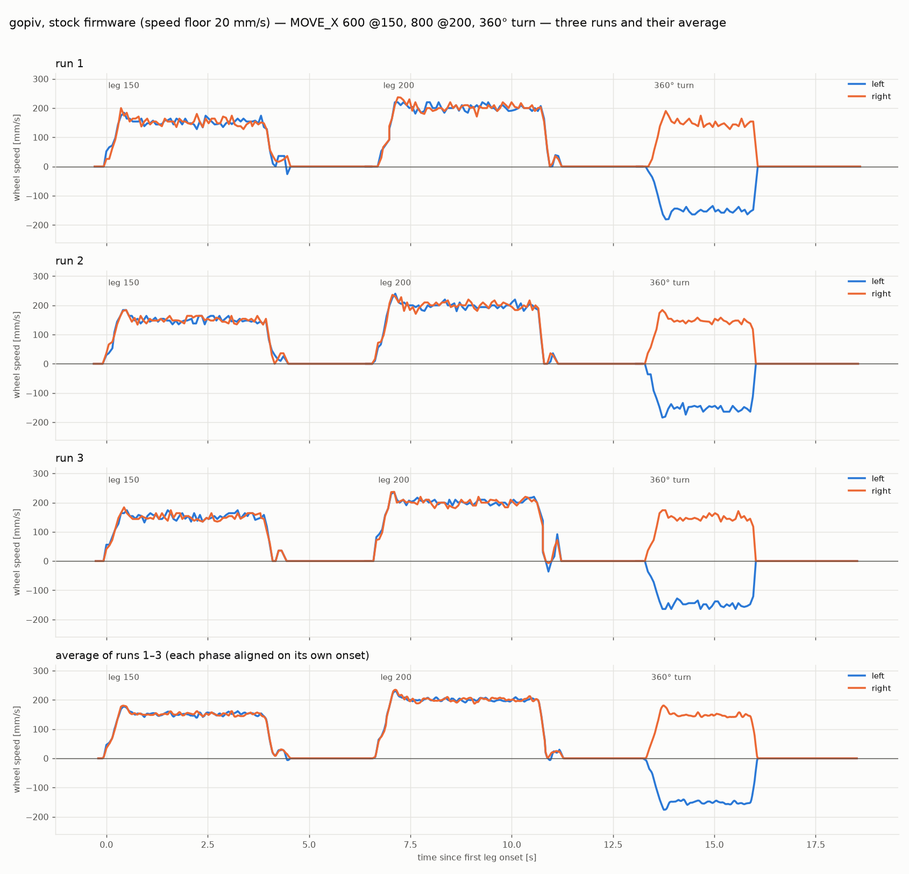
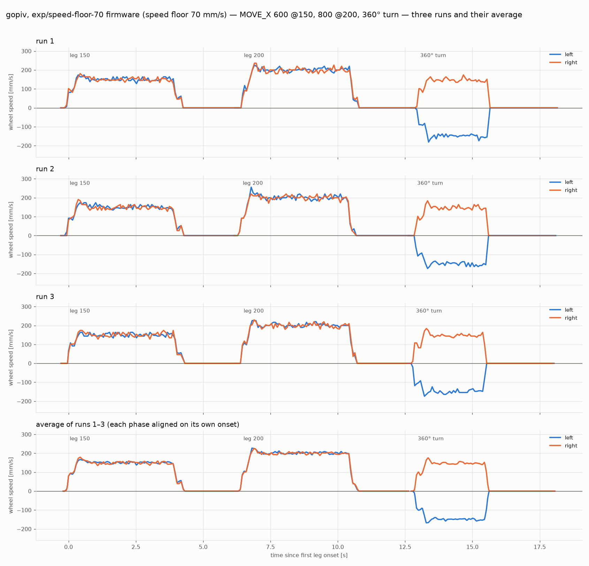
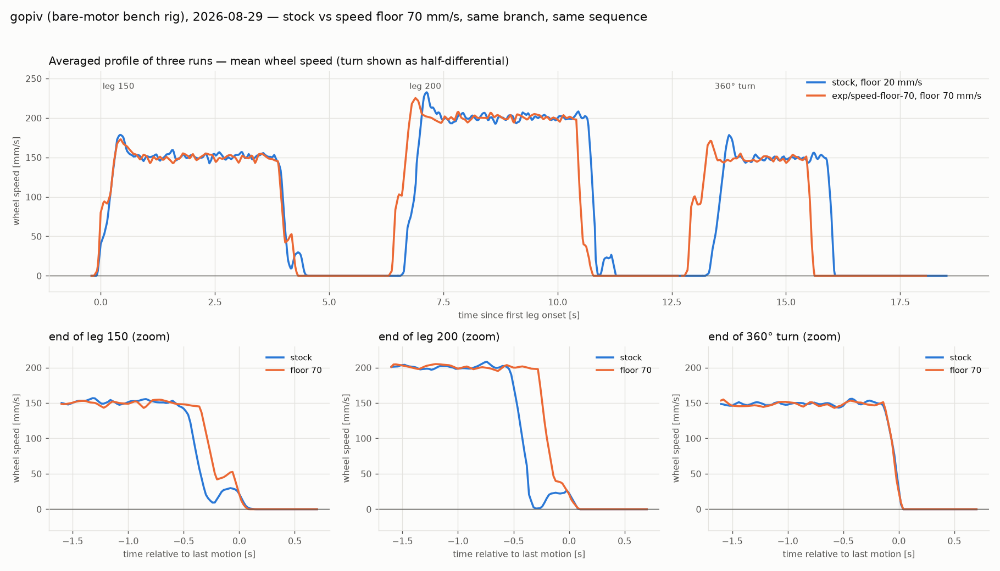

# gopiv — speed floor 70 mm/s in source, A/B on the legs-and-turn sequence, 2026-08-29

Branch `exp/speed-floor-70` (worktree `.claude/worktrees/speed-floor-70`,
out-of-process; merged to master the same day on the strength of this
run). One source change — the kernel's default speed floor,
`src/shims.cpp` `cfg.vMin` 255.2 → 893.2 counts/s (20 → 70 mm/s) —
built twice from the same branch (stock with the edit stashed, then the
edit) and flashed to **gopiv**, the farm's bare-motor bench rig
(`radio-robot-lib/config/robots/gopiv.json`: no wheels, never on the
playfield; node hodr / 192.168.1.148, `mbdeploy deploy --remote`).
tovez is on battery over the radio and cannot be flashed, which is why
the source test ran here; gopiv reproduces the tovez end-of-leg stall
exactly (see `smoke.json` below).

Sequence per run — the 2026-08-28 "first test" (4 s at 150, 4 s at 200,
then a 360°) re-expressed as distance moves so each leg has MOVE_X's
taper and ending: `MOVE_X 600 0 150`, `MOVE_X 800 0 200`,
`MOVE_X 0 6283 150` (360° CCW). Three runs per firmware, completion from
telemetry with the 0.7 s grace re-check, TLM FULL at 13.9 Hz over the
farm's TCP serial socket. Artifacts: `captures/gopiv-floor70-20260829/`
— `stock.json`, `floor70.json`, `smoke.json`, build logs (the two
hexes, `stock-gopiv.hex` md5 bb842190… and `floor70-gopiv.hex` md5
637eebaf…, stay on disk in the worktree and are not committed — the
repo tracks no hex; rebuild from this branch), `run_seq.py`, `chart_runs.py`, `chart_compare.py`,
`numbers.py`.

## Provenance of the two hexes

| | stock | speed-floor-70 |
|---|---|---|
| compiled source (`.tmp/deploy-head/built/dockercodal/.../src/shims.cpp`) | `cfg.vMin = 255.2f` | `cfg.vMin = 893.2f` |
| TUs compiled / block markers | 180 / 0 (plain V2) | 180 / 0 (plain V2) |
| `GET speed_floor` on the board after flashing | 255.200012 | 893.200012 |
| other kernel fields (`GET`) | kp 0, ki 6, i_max 765.6, pos_err_max 127.6, twist_hold 2.0, crawl 0 | identical |

## Three runs and their average — stock

## Three runs and their average — speed floor 70 mm/s

## Side by side, with the leg endings zoomed

## Numbers (`numbers.py`; counts/mm 12.76 = the tovez calib this firmware bakes for every board)

| | stock leg 150 | stock leg 200 | floor70 leg 150 | floor70 leg 200 |
|---|---|---|---|---|
| wheels first at rest, mm short of target | 11.3 ± 0.8 | 10.3 ± 0.8 | 0.9 ± 0.6 | 3.2 ± 0.3 |
| restart bump after that rest | **3 / 3** | **3 / 3** | **0 / 3** | **0 / 3** |
| distance covered by the bump | 7.8–9.8 mm | 6.6–9.9 mm | — | — |
| motion onset → last motion | 4.39 ± 0.07 s | 4.38 ± 0.08 s | 4.18 ± 0.00 s | 4.20 ± 0.04 s |
| final error (this decode's calib) | −2.6 ± 0.3 mm | −2.2 ± 2.3 mm | −0.9 ± 0.6 mm | −3.2 ± 0.3 mm |

- **The bump is gone in source, 6 of 6 legs**, and each leg finishes
  ~0.2 s sooner because the taper no longer dead-stops and waits for the
  I-term to wind up. Stock stalls 10–11 mm short on this rig (tovez:
  6–9 mm) and jumps the rest.
- The final-error row carries this decode's counts/mm assumption: the
  firmware's baked 12.76 vs the 12.70–12.74 implied by the smoke run is
  a 0.3–0.5 % scale, i.e. 2–4 mm on an 800 mm leg, so the absolute
  values are not a verdict on either firmware. Run-to-run scatter (the
  ± column) is what to read: 0.3–0.6 mm for the fix, and the stock
  leg-200 spread of 2.3 mm is one leg whose bump landed long.
- **The 360° turn is unchanged in shape** (hard cut at the end, 2.56 vs
  2.57 s). Its half-differential travel grew 375.4 → 377.1 mm (+0.5 %,
  ≈1.7° on this rig's geometry): the floor also lifts the pivot's own
  crawl, so the turn coasts a touch further past its 4-count yaw margin.
  UNVERIFIED on a wheeled robot; the pivot's separate over-rotation
  (+2 %/90° on tovez 2026-08-28) is not touched by this change.
- The accel ramp now begins with a step to ~70–90 mm/s instead of 25 %
  of cruise (visible at every leg start and at the turn start). That is
  the same `applySpeedFloor()` scaling acting on the ramp's low end.
  Harmless on the bench; on a loaded robot it means every move starts
  at breakaway speed rather than below it — arguably the point.

## What this does and does not settle

Settled: the default at `src/shims.cpp:200` is the knob, the change
builds, flashes and behaves as the live `SET` predicted
(`docs/tovez-taper-stall-20260829.md`), and it removes the end-of-leg
stall on a second drivetrain.

Not settled: the value. 70 mm/s was the better of the two floors tried on
tovez (100 overshot 2–4 mm); it has not been tried loaded, on the floor,
or on vevov. Whether the floor should be a per-robot bake (from each
robot's measured breakaway) rather than a fleet default is a design
decision for the ticket that makes this permanent. Also worth a look
there: clamping the I-term to ≥ 0 while `remain > margin`, which
attacks the same stall without raising the ramp's starting step.

## Method notes

- A worktree has no `pxt_modules`/`node_modules`; `make_deploy.py`
  copies/symlinks them from the repo root, so symlink both from the main
  checkout into the worktree before building. Wipe `.tmp/deploy-head`
  between the two builds (stale-scratch guard). ~5 min per build.
- Two builds of different source from one worktree: `git stash push --
  src/shims.cpp` for the stock build, `git stash pop` for the fix; the
  compiled-source grep above is the check that each hex holds what it
  claims.
- gopiv's serial port on the farm is dynamic (33059 today); `run_seq.py`
  resolves it with `dns-sd -L gopiv _mbserial._tcp local.` and falls back
  to the last known value.
- A one-frame 1150 mm/s sample in the smoke run is an encoder glitch;
  the charts break the line at |v| > 500 mm/s rather than draw it.
