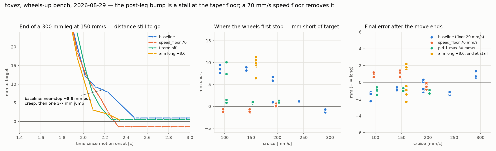

# tovez — the post-leg bump is a stall at the taper floor, 2026-08-29

Follow-up to `docs/tovez-movex-square-tour-20260828.md`, whose wheel-speed
panel shows a small forward "scooch" ~0.3 s after every straight leg
stops. This session explains it, removes it with one live `SET`, and
tests the stakeholder's proposal that the shortfall it corrects is
predictable enough to add in ahead of time.

Bench, **wheels up** (OTOS `Δox = Δoy = 0` over every warm-up — read from
the data, not assumed), tovez on battery over the torture mbrelay pool
(relay `gozop`, channel 3), identity `HELLO → device NEZHA2 robot tovez
2314287040`. Every kernel value below was read back with `GET` before and
after; the baseline config was restored at the end of every run
(`restore check … none`). Artifacts: `captures/tovez-taper-20260829/` —
`baseline.json` (30 legs), `variants.json` (48), `ffcal.json` (8),
`predict.json` (8), their `.log`s, `legs.py`/`analyze.py`/`chart.py`.

## Headline

**`SET speed_floor 893` (70 mm/s, up from the hard-coded 20 mm/s) removes
the bump at every cruise tested and lands every leg within ±1.4 mm.**
The bump was never a designed "final correction": it is the position
I-term braking the wheel to a near-stop 6–9 mm short of the target
(0–15 mm/s against a commanded 37–50), at a speed where the taper floor's
feedforward duty is below breakaway. The wheel then sits or creeps at
20–30 mm/s until the I-term winds back up, and covers the last 3–7 mm in
one stiction-release jump. Yesterday's 14 Hz USB trace at 200 mm/s
caught the fully-stalled form (three frames at zero, then a 72 mm/s
pulse); today's 11.5 Hz radio traces show the same thing as a plateau
plus creep (`analyze.py` calls the first frame under 20 mm/s the "stop").

The stakeholder's prediction idea also holds: at a fixed cruise the
shortfall repeats to ±0.5 mm, and commanding the leg long by that amount
and ending the move at the stall landed **+0.3 ± 1.8 mm** (n = 8) with no
pulse. It is a valid technique; on straight legs the floor fix makes it
unnecessary, and its natural home is the pivots (below).

## Mechanism (from the 2026-08-28 duty trace and today's sweep)

`MotionEngine::serviceMove()` (`src/motion/motion_engine.cpp:343-407`)
scales the commanded velocity by `remain / distTaper_` inside the last
400 counts (31 mm), floored at `distFloor_` = 25 % of cruise, and keeps
driving until the encoder mean is within 10 counts (0.8 mm) of the
target. The kernel (`src/core/diffdrive.cpp:836-873`) is integral-only on
position error (`pid_kp 0`, `pid_ki 6`, `pos_err_max` 10 mm, `pid_i_max`
60 mm/s, live `GET` 2026-08-29).

1. The taper's reference decelerates faster than the wheel sheds speed,
   so the wheel runs ahead of the reference; the I-term saturates at
   −60 mm/s and out-muscles the floor feedforward (50 mm/s at cruise 200),
   so the net demand goes negative and the wheel is braked to a near-stop.
   MEASURED 2026-08-28, `captures/tovez-square-20260828/
   tovez-square-movex-closed2-20260828.json`: `dutl 0 / dutr 300` at the
   stop, left wheel −36 mm/s for one frame.
2. At the floor speed the feedforward duty is ~3–5 % (cruise ≤ 200), under
   the 7–10 % breakaway, so the starved wheel sits or creeps until the
   I-term winds positive: duty climbs 300→600→900 over ~0.3 s, then the
   wheel releases and covers the last 3–7 mm in one frame.
3. Proof by removal, MEASURED today: with the I-term off (`pid_i_max 0`,
   `ffcal.json`) the wheels never stop short — mean error −0.6…+0.6 mm,
   no bump — but the per-wheel split grows to 7–11 mm (nothing but the
   weak twist-hold servo holds L−R), so that is a diagnosis, not a config.

## Baseline sweep — the shortfall vs cruise (`baseline.json`)

300 mm legs, forward and reverse, stock gains. `stop short` = target minus
encoder mean at the first at-rest frame; `final` = error after the move
ended (bump included).

| cruise | stop short fwd / rev [mm] | bump? | final fwd / rev [mm] |
|---|---|---|---|
| 100 | 8.6 ± 1.3 / 8.3 ± 0.3 | yes | −1.3 / −1.8 |
| 150 | 8.6 ± 0.4 / 8.7 ± 0.5 | yes | −0.7 / −0.5 |
| 200 | 5.5 ± 3.2 / 4.3 ± 3.6 (bistable: 5 legs at 5.9–6.7, one at 0.9) | mostly | −0.7 / −0.7 |
| 250 | 1.3 ± 0.1 / 1.3 ± 0.2 | no | −1.3 / −1.3 |
| 300 | −1.0 ± 0.4 / −0.6 ± 0.1 | no | +1.0 / +0.6 |

The stall point is where the taper reaches its floor (25 % × 31 mm ≈
7.8 mm out) and the floor feedforward can no longer move the wheel. At
250+ mm/s the floor (62–75 mm/s, 6–9 % duty) clears breakaway and the
crawl runs through to the target. Linear fit over 100–300 mm/s: **stop
short = 15.5 − 0.054 · cruise, R² 0.85, residual sd 1.5 mm** (right wheel
alone R² 0.89); at any single cruise outside the bistable band the sd is
0.3–0.5 mm. A 600 mm leg at 200 stalled 8.5 / 7.6 mm short; a 150 mm leg
at 200 did not stall at all (0.1 / −0.2). Baseline final error over all
30 legs: **−0.7 ± 0.9 mm** — the closed-loop finish was already accurate;
the bump costs time (~0.1–0.3 s per leg, frame-quantized) and looks
wrong, not distance.

## Variants — one live `SET` each, read back, restored (`variants.json`)

Two forward/reverse pairs per cruise at 100/150/200 mm/s.

| variant | 100 mm/s | 150 mm/s | 200 mm/s | verdict |
|---|---|---|---|---|
| **`speed_floor 893` (70 mm/s)** | no bump, final +0.6…+1.2 | no bump, +0.6…+1.4 | no bump, −0.8…0.0 | **use this** |
| `speed_floor 1276` (100 mm/s) | no bump, +2.5…+4.5 | no bump, +1.4…+3.4 | no bump, +1.0…+1.7 | overshoots: a 100 mm/s crawl coasts past the 0.8 mm margin |
| `pid_i_max 383` (30 mm/s) | bistable (2 of 4 stalled 7–10 mm) | no bump, −0.6…−1.0, L/R split 2.4–4.2 | no bump, −0.9…−1.3, split 2.6–3.1 | partial; halves the I authority the left wheel's 0.80 feedforward needs |
| `crawl_pulse 0.09` | stalls 12–15 mm short | 5–11 mm short | 7–8 mm short | worse — the pulse dithering stalls the wheel earlier and the pulse is bigger |

`speed_floor` works because the kernel's `applySpeedFloor()`
(`diffdrive.cpp:905`) scales any sub-floor command up to `vMin`, so the
crawl's feedforward stays above breakaway at every cruise and the I-term
can no longer bring the wheel to rest. The stock 255.2 counts/s (20 mm/s)
is the hard-coded default at `src/shims.cpp:200` — a bare-motor figure;
tovez's own population-measured breakaway is ~100 mm/s
(`radio-robot-lib/config/robots/tovez.json`, `v_min 99.7`), and 70 mm/s
is the better of the two values tested here.

## The prediction test (`predict.json`)

Stakeholder proposal: the shortfall is predictable, so add it in before
the taper ends instead of waiting for the bump. Literal test, stock
gains, cruise 150 (shortfall 8.6 ± 0.4 mm above): command `MOVE_X ±309`
with the deadline set to land during the stall (2380 ms from receipt),
score against the intended 300.4 mm. Eight legs: **+0.3 ± 1.8 mm**, no
breakaway pulse, moves ended 0.05–0.15 s sooner than the baseline's
stall-plus-bump. Two of the eight ended with a 10–15 mm left/right split
(the deadline's neutral cut the twist trim mid-correction), which is a
heading cost this form of the idea carries when the move is ended by
time rather than by the engine.

So: the idea is sound and the regression above is the calibration it
would use. Where it pays off is the **pivots**, which the 2026-08-28 tour
showed over-rotating a consistent +2 %/90° because the yaw taper (180
counts, ~14°) is too short to act — a learned per-robot yaw offset is the
right tool there. On straight legs the floor fix takes the residual to
±1 mm, inside the engine's own 0.8 mm done margin, and there is nothing
left worth predicting.

## What to do

1. Bench scripts on tovez: `SET speed_floor 893` at session start (the
   `SET` is runtime-only; a power cycle reverts it).
2. Permanent: change the `cfg.vMin` default at `src/shims.cpp:200`, or
   bake it per robot from the measured breakaway — a `src/` change, so a
   ticket. Re-verify on the floor: wheels-up breakaway is not loaded
   breakaway, and the coast past the margin will differ under load.
3. Firmware-side, UNVERIFIED (needs a reflash tovez cannot take on the
   radio): clamping the I-term to ≥ 0 while `remain > margin` would stop
   the taper from ever braking the wheel dead regardless of floor, and a
   wider `distTaper_` would let the wheel track the reference. Either is
   testable in one bench session once tovez is back on USB.
4. Apply the prediction idea to the pivots (a `RUN:pivot` sweep against
   the camera, then a per-robot yaw offset).

## Method notes

- A bare `GET` dump loses lines over the radio (`baseline.log`: 6 of 11
  fields arrived; the "differing fields" there are dropped lines, not
  changes). Read fields one at a time — each `GET <field>` is ack-retried.
- `MOVE_X` fields are `parseInt32` (`wire_handler.cpp:1274`): `MOVE_X
  308.6 …` is never acked (`predict.log`, first attempt). Send integers.
- Radio telemetry ran 11.5 Hz (72 ms median gap, 144 ms p90), so dead
  times and bump peaks here are under-resolved; stop-short and final
  error come from encoder counts and are not.
- A retransmitted leg (`tries > 1`) started on the transmission the robot
  actually received, so `t_send`-relative times are late by the retry
  wait for those legs; the encoder-based numbers are unaffected.
- One relay-pool connect returned no HELLO within 3 s right after a
  previous session closed; a 5 s pause and retry fixed it.
