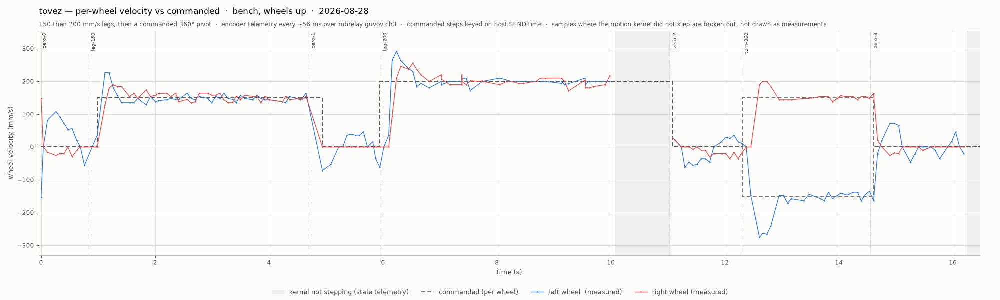
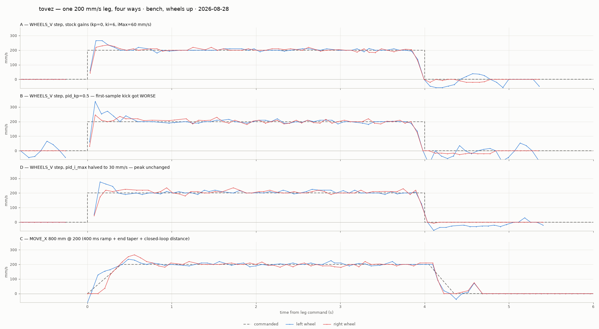

# tovez — per-wheel velocity tracking, 2026-08-28

Bench run, **wheels off the ground**, driven over the mbrelay pool
(`torture 192.168.1.12:8760`, relay `guvov`, channel 3). Firmware
`ver 0.20260827.2`. Identity confirmed by `HELLO` →
`device NEZHA2 robot tovez 2314287040`.

Artifacts: `captures/tovez-wheels-20260828/` — `tovez_wheels.json`
(190 decoded `TLM FULL` frames + the commanded event log),
`tovez_wheels.png`, and the three scripts that produced them
(`relay.py`, `capture.py`, `chart.py`).

Sequence, all via `WHEELS_V <l> <r> <ms>`: 4 s at 150 mm/s, 4 s at
200 mm/s, then a commanded 360° pivot (±150 mm/s for 2409 ms, from
`trackwidth 115` — `π·W/v`), each separated by an explicit
`WHEELS_V 0 0` phase.

## Headline

**Steady-state velocity tracking is not the problem — the start
transient is.** Both wheels hold their setpoint to within 2%, but every
start overshoots by 27–84% and takes ~0.7 s to recover, and that
transient accounts for essentially the whole distance error.

## Steady state (first 0.9 s of each phase excluded)

| phase | commanded | left mean | err | right mean | err |
|---|---|---|---|---|---|
| leg-150 | 150 / 150 | 147.2 | −1.9% | 151.2 | +0.8% |
| leg-200 | 200 / 200 | 199.4 | −0.3% | 199.5 | −0.2% |
| turn-360 | −150 / 150 | −148.1 | +1.3% | 150.9 | +0.6% |

Sample noise is σ ≈ 5–12 mm/s, so these means sit at or inside the
noise floor. Nothing here argues for re-scaling `travelCalib`.

## The transient

| phase | wheel | cmd | peak | overshoot | t(peak) | t(back in ±10%) |
|---|---|---|---|---|---|---|
| leg-150 | left | 150 | 227 | **+51%** | 0.30 s | 0.52 s |
| leg-150 | right | 150 | 190 | +27% | 0.44 s | 0.73 s |
| leg-200 | left | 200 | 292 | **+46%** | 0.30 s | 0.65 s |
| leg-200 | right | 200 | 256 | +28% | 0.58 s | 0.72 s |
| turn-360 | left | −150 | −276 | **+84%** | 0.32 s | 0.67 s |
| turn-360 | right | 150 | 200 | +33% | 0.38 s | 0.67 s |

Two things are consistent across all six steps: the peak lands at
0.30–0.58 s and recovery at 0.52–0.73 s, and **the left wheel
overshoots roughly twice as hard as the right**.

## Distance, per lease window

Position channel, `posl`/`posr` in counts ÷ `countsPerMm() = 10/travelCalib
= 12.760` (`src/motion/motion_engine.h:219`, tovez `travelCalib 0.7837`).
Commanded = commanded mm/s × the *observed* span, so lease-duration
effects are excluded.

| phase | left cmd | left actual | err | right cmd | right actual | err |
|---|---|---|---|---|---|---|
| leg-150 | 549.7 | 558.2 | +1.5% | 549.7 | 554.1 | +0.8% |
| leg-200 | 806.9 | 791.3 | −1.9% | 806.9 | 788.9 | −2.2% |
| turn-360 | −356.2 | −373.0 | −4.7% | 356.2 | 335.7 | −5.8% |

Integrating `(measured − commanded)` over just the first 0.9 s of each
leg gives the transient's own contribution: leg-200 left **−15.4 mm**
against a whole-lease error of **−15.6 mm**; leg-200 right −26.0 mm
against −18.0 mm. **The whole-leg distance error is the start
transient**, not accumulated steady-state drift. Despite the velocity
*overshoot*, the net effect is a distance *deficit* at 200 mm/s — the
startup dead time costs more than the overshoot gives back.

The pivot also nets **−18.7 mm of translation** ((L+R)/2) across a
360° turn that commands zero, while net rotation comes out within 0.5%
of commanded — consistent with the existing repo finding that rotation
scale is not where the pivot's cost lands.

## Why (hypothesis — NOT measured)

tovez runs `pid_kp = 0.0`, `pid_ki = 6.0` (`radio-robot-lib/config/robots/tovez.json`).
With no proportional term, *all* correction comes from the integrator,
which must wind up before it produces output and then overshoots
unwinding — exactly the 0.3 s-peak / 0.7 s-recovery shape above. The
left/right asymmetry lines up with the feedforward gains
(`wheel_gain_left 0.80` vs `wheel_gain_right 0.9567`): the
under-fed left wheel leaves more work for the integrator, so it
overshoots more.

**UNVERIFIED.** Nothing here changed a gain. Settling it needs a `SET
pid_kp` sweep (say 0 → 0.4) re-running this same three-phase capture and
comparing peak overshoot and the 0.9 s excess-travel integral. That is
one bench session and needs no reflash — `pid_kp` is a live `SET` field.

## Method notes worth keeping

- **A lease expiry hides the deceleration.** When `WHEELS_V`'s lease
  expires the kernel stops stepping and telemetry republishes its last
  snapshot indefinitely (measured in the first run this session: `cyc`
  frozen at 268 while `vl`/`vr` held 174/148 for 1.6 s). The descent is
  only real if an explicit `WHEELS_V 0 0` phase keeps the kernel
  stepping. The chart breaks the line and shades any span where `cyc`
  did not advance rather than drawing stale samples as measurements.
- **Streaming telemetry starves the inbound command plane.** A
  `WHEELS_V` sent under a live `TLM` stream did not execute inside a
  2.5 s window; the same verb on a quiet link acked immediately. Every
  sequenced verb here is ack-verified and retransmitted with its
  **original** id. One phase (`leg-200`) needed a retransmit: it acked
  1.28 s late while every other phase acked in 0.05 s, and the measured
  rise tracks the *send*, not the ack — the robot executed the first
  transmission and the ack was lost coming back. Commanded steps are
  therefore keyed on send time.
- **Do not send `RUN:probe` to a remote robot.** Per
  `captures/otos-run-handler-i2c-hang-20260828.md`, I2C from a RUN
  handler hangs the board and only a reflash clears it — and a robot on
  the relay cannot be reflashed. `otos=1` in `STATUS` already shows the
  boot-time OTOS init is present on this build.
- Telemetry cadence is ~56 ms (~18 Hz), which puts only ~6–8 samples on
  the rising edge. That is the firmware's rate and bounds how finely the
  transient can be resolved here.

---

## Follow-up, same day: is the overshoot a problem, and what removes it?

Same bench, same relay path (`gozop`/`guvov`), same firmware. Four
variants of the same 200 mm/s leg, one live `SET` at a time, everything
restored after (`GET pid_kp` → 0.0, `GET pid_i_max` → 765.6 confirmed
post-run). Artifacts: `tovez_abc.json`, `tovez_imax_d.json`,
`tovez_abc.png`, scripts `exp.py`/`exp_d.py`/`chart_abc.py`, all in
`captures/tovez-wheels-20260828/`.

### The live config, from the robot (not the JSON)

`GET` over the wire, 2026-08-28: `pid_kp 0.0`, `pid_ki 6.0`,
`pid_i_max 765.6`, `pos_err_max 127.6`, `full_duty_velocity 10795`,
`max_duty 100`, `twist_hold_gain 2.0`. The kernel works in encoder
counts (12.76 counts/mm), so the clamps are **10 mm** of position error
and **60 mm/s** of I-term authority — the JSON's `60`/`10` are mm-family
units, baked ×12.76.

### Mechanism, correctly stated

The I-term is `ki × posError` where `posError` integrates the
*commanded* velocity against the encoder — which is exactly the textbook
velocity-error integral (∫(v_ref − v)dt **is** position error), just
reconstructed from the encoder instead of accumulated, so it cannot
drift from the true distance deficit. Consequence: **the I-term's state
is the robot's distance deficit, and the overshoot pulse is that deficit
being repaid.** Overshoot area ≈ spin-up deficit. A separate
twist-position servo (`twist_hold_gain 2.0`, headroom-limited) holds the
L−R difference, so heading is defended independently of the per-wheel
transients.

### Results (one 200 mm/s leg each; peak = worst live sample, 2nd-worst in parens)

| run | change | L peak | R peak | steady L/R | distance |
|---|---|---|---|---|---|
| A | none (step) | 266 (266) | 236 (230) | 203 / 202 | 784 / 785 mm vs 792 v·t |
| B | `pid_kp 0.5` | **338** (272) | 246 (236) | 201 / 200 | 798 / 786 |
| D | `pid_i_max` → 30 mm/s | 276 (262) | 236 (236) | 208 / 207 | 802 / 798 |
| C | `MOVE_X 800 0 200 8000` | 236 (230) | 266 (253) | 202 / 198 | **799 / 800 of 800** |

- **`pid_kp` made the spike worse, not better** — on a step, `kp·err`
  adds a kick proportional to the full step at t=0, before there is
  anything to damp. Wrong knob for a step reference.
- **Halving `pid_i_max` left the peak unchanged** — so the initial spike
  is *not* mostly the I-term. It is the feedforward slamming
  steady-state duty into an unloaded wheel (first driven frames carry
  duty ~2900–3700 against a steady ~1900–2500); the wheel breaks away
  and momentarily runs free.
- **The reference ramp is what actually reshapes the transient.**
  MOVE_X's 400 ms ramp (`motion_engine.h` `rampMs_`, compile-time)
  walks the ascent up (128→154→164→200), tapers the descent, and closes
  the loop on distance: **799/800 mm**. The residual mid-ramp peak
  (+18–33%, worst on the wheel whose feedforward under-delivers) is the
  position servo repaying breakaway dead time that even a ramp can't
  remove.
- Run-to-run variance on the unloaded bench is comparable to the
  effects being tuned (A's left peak was 292 in the morning session,
  266 here). Single-run gain comparisons below ~30 mm/s of effect are
  not meaningful on this stand.

### Answer

For **distance prediction, the overshoot is not the enemy — it is the
repair mechanism**, and removing it without replacing it makes distance
*worse*. The two real fixes, in order:

1. **Use MOVE_X for legs.** Distance is then closed-loop (799–800/800
   measured) and both ends of the profile are shaped. WHEELS_V × time is
   the worst way to get a distance on this firmware.
2. If velocity-mode legs must not overshoot: the knob that matters is
   the **reference ramp**, not the PID gains (both measured
   ineffective). That means either commanding a software ramp from the
   host (stepped WHEELS_V setpoints) or exposing `rampMs_`-style shaping
   for velocity holds in firmware — a code change, not a `SET`.

**UNVERIFIED → now measured** (closes the morning section's hypothesis):
the overshoot is *not* integrator windup curable by `pid_kp` — B and D
falsify that directly. The windup story was wrong in the details; the
deficit-repayment framing survives because the clamps bound the I-term
to 60 mm/s, which matches the flat-topped catch-up plateau but not the
first-0.2 s spike.

All `SET`s this session were runtime-only and were restored; a power
cycle would also clear them.
