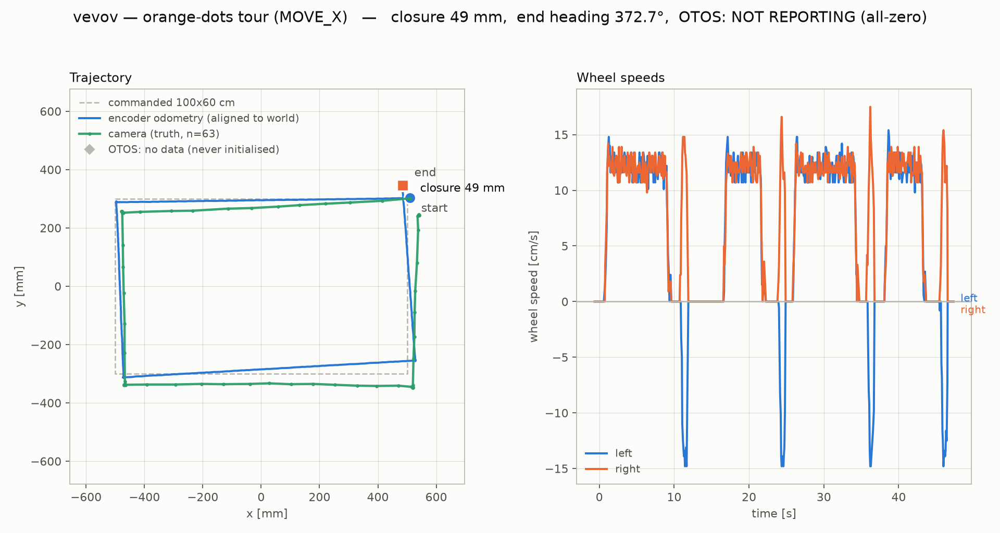

# vevov — orange-dots square tour, 2026-08-28

First tour on the rebuilt chassis (front caster removed, drive wheels
moved forward, smaller wheels) running the geometry bake committed in
`5fb41b0`: `travelCalib 0.7122`, `trackWidth 128.0`, `rotationalSlip
0.995`.

Artifacts: `captures/tour-20260828/` — `tour_pose.csv` (encoder + OTOS),
`tour_vel.csv` (wheel speeds), `tour_cam.csv` (camera), `tour_meta.json`,
and `tour_orange.py`, the capture script. Chart rendered with
`tools/tour_chart.py` (extended this session with `--cam-csv`/`--meta`).

Route: the four orange dots at (±50, ±30) cm — the 100×60 cm rectangle —
NE → NW → SW → SE → NE, counter-clockwise, driven over the radio relay
with **MOVE_X**, uncorrected.

## Three paths — one of them is missing, and that is the honest result

| source | status |
|---|---|
| camera (AprilTag 53) | 63 samples, ~1.3 s apart |
| encoder odometry | 627 telemetry frames |
| **OTOS** | **NO DATA — every frame reads `ox=oy=oh=0`** |

The OTOS is physically fitted (stakeholder-confirmed), but it has never
been initialised: `connected_` only becomes true after `otosBegin()`,
and nothing calls that at boot. The only verbs that would call it are
`RUN:probe` and the world-frame path — and **`RUN:probe` hangs the
board**, requiring a reflash. Reproduced twice on 2026-08-28: after it,
the board is silent to `PING`/`HELLO`/`STATUS` on BOTH radio and USB.

`otosBegin()` opens with `readReg8(kRegProductId)`. The code expects a
clean failure (`initialized_ = ok && ...; if (!initialized_) return
false`), but the I²C call never returns. Initially I attributed this to
a bus race with the Nezha encoder — `src/DESIGN.md` (the `buildSnapshot()`
notes) warns the protocol fiber must never trigger a fresh OTOS sample for
exactly that reason, and `busGap()` is a `fiber_sleep` that yields
*between* the register select and the read. **That theory is wrong**: it
was retested with the motion kernel fully idle (`cyc=0`, `ready=0`, no
encoder traffic at all) and still wedged. So it is an unconditional
hang, not a race. **UNVERIFIED** beyond that: nothing instrumented the
hang itself — a wedged board cannot be interrogated.

This needs an issue: an unbounded I²C wait that bricks the board until
reflash, on a verb documented as a diagnostic.

## Travel: consistently ~2% short

| leg | commanded | camera | error |
|---|---|---|---|
| NE→NW | 100 cm | 98.34 | −1.66% |
| NW→SW | 60 cm | 58.61 | −2.32% |
| SW→SE | 100 cm | 98.20 | −1.80% |
| SE→NE | 60 cm | 58.74 | −2.10% |

Mean −1.97%, and it matches the −1.6% measured for `MOVE_X` on
2026-08-27 (`captures/vevov-wheel-scale-20260828.md`) — where `WHEELS_X`
over the same distance ran −0.7%. So the residual is in the `MOVE_X`
path, not in `travelCalib`, which `WHEELS_X` confirms is right.

## Rotation error is injected by the LEGS, not the turns

Camera heading, segmented by phase:

| phase | Δheading | expected |
|---|---|---|
| leg NE→NW | +0.40° | ~0 |
| turn | +89.11° | +90 |
| leg NW→SW | −1.43° | ~0 |
| turn | +89.50° | +90 |
| leg SW→SE | −1.26° | ~0 |
| turn | +89.04° | +90 |
| leg SE→NE | −3.15° | ~0 |
| turn | +91.21° | +90 |

    turns  +358.85 deg   (360 commanded, err -1.15)
    legs     -5.44 deg   (should be 0)

Four turns are collectively within **1.15°**; the four straight legs
leak **−5.44°**. This REPRODUCES on the rebuilt chassis, with the
accurate verb, the effect CLAUDE.md records for the old one: *"the
remaining rotation must be injected during the straight LEGS — physical
heading change the wheel odometry never sees, on legs whose distance is
accurate."* Do not correct the turns; they are fine.

## Closure and corner accuracy

    camera closure   6.66 cm   <- truth
    odometry closure 4.9 cm    <- the robot's own belief, optimistic by ~1.8 cm

| corner | target | reached | error |
|---|---|---|---|
| NW | (−50, +30) | (−47.30, +25.10) | 5.59 cm |
| SW | (−50, −30) | (−46.40, −33.50) | 5.02 cm |
| SE | (+50, −30) | (+51.80, −34.40) | 4.75 cm |
| NE | (+50, +30) | (+53.90, +24.30) | 6.91 cm |

Mean bias **x +3.00 cm, y −4.62 cm**. That is a systematic offset, not
scatter — consistent with legs running 2% short while the heading walks
−5.4° around the loop. Note the tour began at (50.90, 30.30), 0.95 cm
off the NE dot (park tolerance 2.5 cm), which contributes a little.

## Wheel speeds

Clean and symmetric: four drive phases at ~12 cm/s on both wheels, four
pivots with the wheels equal and opposite at ~15 cm/s. No stalls, no
saturation, no asymmetry between left and right during the straights —
which is worth noting given the legs are where the heading is leaking.
Whatever steals that 5.4° does not show up as a wheel-speed difference.

## Next

1. File the `otosBegin()` hang. Until then the OTOS is unusable and any
   world-frame verb (`GO_TO_W`) silently falls back to drifting encoder
   odometry — `STATUS`'s `otos=` is the discriminator.
2. Find the leg heading leak. Wheel speeds are symmetric during legs, so
   it is not a commanded-speed difference; a per-boundary camera fix at
   REST on a straight-line-only run would separate a steering bias from
   a yaw disturbance at start/stop.
3. `MOVE_X`'s −2% travel versus `WHEELS_X`'s −0.7% is unexplained and
   worth isolating before either is used for scoring.

---

# Addendum, 2026-08-28 afternoon — the 2% is a MOVE_X scale error, and travelCalib is still not the place to fix it

Written after a stakeholder asked the obvious question: if travel is
consistently ~2% short, why not just raise `travelCalib`?

## Two things above make this report stale

1. **A second tour ran at 10:02 and was never written up.** Artifacts
   recovered into `captures/tour2-20260828/` (`tour2_cam.csv`,
   `tour2_pose.csv`, `tour2_vel.csv`, `tour2_meta.json`,
   `tour2_orange.png`). Same route, same `MOVE_X`, 162 camera samples
   against this report's 63. Closure **2.79 cm**, not 6.66; the leg
   heading leak totals **−2.4°**, not −5.44°.
2. **The OTOS is alive.** `tour2_meta.json` has `otos_reporting: true`,
   and vevov answered `STATUS ... otos=1` at 15:52. Something armed it
   between the two tours. The "never been initialised" section above
   describes the 08:23 state only; the `otosBegin()` hang still needs
   its issue, but the sensor is not dead.

## The travel error is a SCALE error — and it still is not travelCalib's

Ten camera-measured straight legs, all commands sent raw:
four from this report's tour, four from tour 2
(`captures/tour2-20260828/tour2_cam.csv`, segmented on
`tour2_meta.json`'s leg marks, medians of the at-rest samples in the
1.2 s before each phase boundary), and a 20 cm forward/reverse pair
driven this afternoon (`captures/tour2-20260828/sweep.json`).

| commanded | n | mean error | as % |
|---|---|---|---|
| 20 cm | 2 | −0.23 cm | −1.12% |
| 60 cm | 4 | −1.25 cm | −2.09% |
| 100 cm | 4 | −1.58 cm | −1.58% |

Least squares of `error = a + b·d`:

    a = -0.111 +- 0.222 cm      (fixed term: consistent with ZERO)
    b = -1.569 +- 0.299 %       (proportional term: real)
    residual sd 0.283 cm

So the shape is a pure scale error, **−1.6 ± 0.3%**, with no fixed
end-of-move deficit. The 60/100 legs alone cannot show this — their
within-length scatter (0.56 cm) is larger than the between-length
difference — which is why the 20 cm pair was worth driving.

**But the constant to change is not `travelCalib`.** `MotionEngine::
startSegment()` and `MotionEngine::wheelsX()` both convert mm to counts
through the same `countsPerMm() = 10 / travelCalib_`
(`src/motion/motion_engine.cpp:117-124` and `:52-80`). A constant below
both paths cannot be wrong by −1.6% for `MOVE_X` and −0.7% for
`WHEELS_X` at the same time. Raising `travelCalib` 2% to null `MOVE_X`
puts `WHEELS_X` at +1.3% — it moves the error, it does not remove it.
The residual belongs to the `MOVE_X` path.

Nor is it a knob: `GET` (read live over the relay, 15:47) lists
`rotational_slip` but no travel scale. `travelCalib_` is baked at flash
time by `tools/make_deploy.py`'s `_GEOMETRY_BAKE_RES` from
`geometry.firmware_bake` in vevov's radio-robot-lib config, mirrored in
`tools/tour_chart.py`, and guarded by
`tests/tools/test_travel_calib_drift.py`. Changing it is a reflash plus
a mirror update, not a `SET`.

**The load-bearing claim is under-measured.** The `WHEELS_X` −0.7%
figure is two runs at one distance (80 cm) from a scratchpad script.
The sweep written to re-measure it across 20/50/95 cm on both verbs
never got there — see below.

## The sweep aborted: vevov is E-STOP LATCHED, and nothing clears it

`captures/tour2-20260828/sweep.py`, run 15:57. It completed the
reposition, proved real motion against the camera (9.80 cm for a
commanded 10 cm), and drove `MOVE_X ±20` — then every subsequent verb
moved the robot 0.00 cm.

    before  status ready=1 active=0 connL=1 connR=1 otos=1 flags=31 reason=stop
    after   status ready=1 active=0 connL=1 connR=1 otos=1 flags=33 reason=estop

`flags` is hex. `31 -> 33` sets bit `0x2`, which
`src/comms/wire_adapter.cpp:201` assigns to `kFlagEstopped`. The stall
bit (`0x4`) is clear, so this is the e-stop latch, not a stall.

This is the "responds but does not move" trap in
`.claude/rules/playfield-testing.md` with a new cause: `ready=1
connL=1 connR=1` still reads perfectly healthy. **`flags` bit `0x2`
and `reason=estop` are the discriminators.**

There is no recovery path short of a power cycle. `estopClear()` exists
(`src/shims.cpp:799`) and so does the block that calls it
(`diffDrive.clearEmergencyStop()`, `src/blocks/stop.ts:33`), but
`test/test.ts` binds it to no button and no `RUN:` verb, and the v6
`ESTOP` verb only latches (`src/comms/wire_handler.cpp:464`,
`src/comms/wire_adapter.cpp:501`). Worth an issue alongside the
`RUN:probe` hang: a latch with no in-band clear.

**UNVERIFIED — what latched it.** The sweep script never sends `ESTOP`;
`grep` finds the only writers of `estopLatch_` to be `estop()` and
`emergencyStopMotors()` (`src/core/diffdrive.cpp:372,380`), both
reachable only from an explicit e-stop; and `ps` showed no other
process on the relay. A garbled radio line is possible — the `ESTOP`
verb is deliberately parsed maximally forgiving — but nothing here
isolated it. Logging the raw line that precedes a latch would settle it.

## Next, revised

1. Power-cycle vevov, then re-run `captures/tour2-20260828/sweep.py`.
   It drives 20/50/95 cm forward and reverse on both `MOVE_X` and
   `WHEELS_X` at the same 120 mm/s cruise, projecting every move
   against the field margin first. That is what decides whether the
   −1.6% is really `MOVE_X`-only.
2. Do NOT change `travelCalib` until it does.
3. File the e-stop-with-no-clear issue, and the `otosBegin()` hang.
