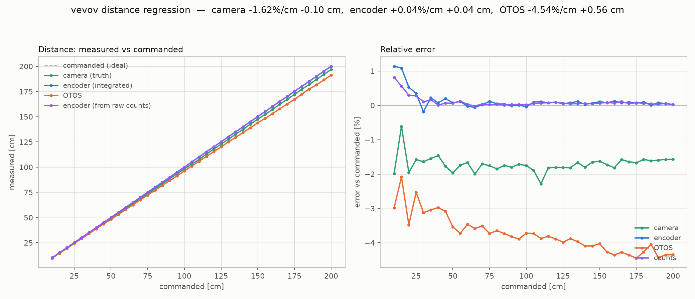
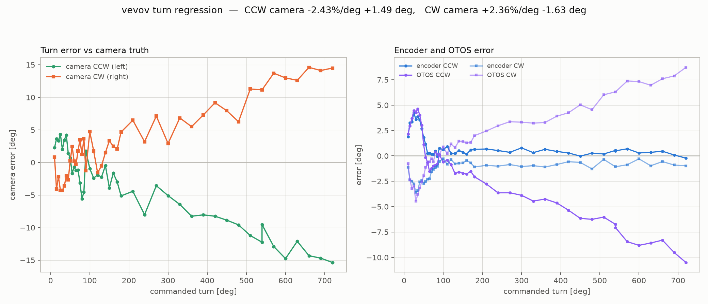

# vevov distance and turn regressions, 2026-08-28

Two complete data sets, camera-truthed, with **raw encoder counts** at
both ends of every measurement so encoder position can be recomputed
offline rather than trusted as integrated.

Artifacts in `captures/regressions-20260828/`: `dist_sweep.csv` (67 legs
/ 39 trials), `turn_sweep.csv` (89 turns), both PNGs, the harness
(`sweeplib.py`, `sweep_dist.py`, `sweep_turn.py`), the chart scripts,
and the run logs.

Driven over **gauti USB**, not the radio: a foreign transmitter was
issuing commands on channel 4 (`MOVE_X 950 0 120 60000 #2` arrived
interleaved with our own STOP reply, and vevov was caught running away
at 5.4 cm/s). A competing command mid-sweep would corrupt trials
silently.

---

## Distance sweep — 10 to 200 cm, every 5 cm

Each trial parks on the NE orange dot and consumes the commanded
distance along the orange-dots rectangle, turning 90 deg at corners.
Turns are NOT measured; each straight leg is measured and summed. That
is how 200 cm is measured inside a 110 cm box.

    camera  = 0.98379 * cmd - 0.097 cm     scale -1.62%,  fixed -0.10 cm
    encoder = 1.00040 * cmd + 0.035 cm
    counts  = 1.00039 * cmd + 0.023 cm     re-derived from posl/posr
    OTOS    = 0.95462 * cmd + 0.563 cm     scale -4.54%

**The travel error is PURE SCALE.** The fixed term is 1 mm over a range
spanning 10 to 200 cm -- there is no per-move overshoot to chase. A
single scale constant fixes every distance at once.

**The encoder integration is faithful.** Integrated pose and position
re-derived from raw counts agree to 0.001 -- so the firmware is not
adding anything the counts do not support, and the encoder's ~0% error
is a CONSISTENCY check, not an accuracy one: the encoder is the control
loop's own feedback, so of course it believes it arrived.

**The OTOS reads 4.5% short, and it is NOT pure scale** -- its relative
error grows from ~2.5% at 10 cm to ~4.4% at 200 cm. A linear scalar
would show flat. UNEXPLAINED; worth a dedicated look before the OTOS is
used for anything absolute.

## Turn sweep — 10 to 720 deg, both directions, 89 turns

    CCW: camera err = -2.426 %/deg * A  +1.494 deg
    CW : camera err = +2.355 %/deg * A  -1.626 deg

Antisymmetric to within 3% -- the error follows the direction of
travel, so it is drivetrain, not a world-frame sensor bias.

Sign-normalised (+ = over-rotated), split by size:

| range | n | camera | encoder | slip (cam - enc) |
|---|---|---|---|---|
| <= 90 deg | 34 | **+0.59** | +1.99 | -1.40 |
| 90-200 deg | 18 | -2.23 | +0.57 | -2.79 |
| > 200 deg | 37 | **-9.60** | +0.61 | -10.21 |

**This is why single-angle turn calibrations kept contradicting each
other.** The camera error CROSSES ZERO at about 125 deg: below that the
robot over-rotates, above it under-rotates. A 90 deg spot check
(measured +0.75 deg on 2026-08-27) lands almost exactly on the
crossing and reports "turns are fine". A 30 deg check says +3.5. A
720 deg check says -15. All three are correct and all three are
useless alone.

**Two independent mechanisms, cleanly separated by the sweep:**

1. **A fixed per-turn overshoot** the encoder DOES see (+2.0 deg mean
   below 90 deg, falling to +0.6 deg for large turns). It is real
   motion, visible to both instruments -- coast/deceleration overshoot.
   It does NOT scale with angle, so it must NOT be folded into a scale
   constant.
2. **A rotational scale deficit the encoder CANNOT see** -- the
   camera-minus-encoder gap, growing to -10.2 deg over turns past
   200 deg. That is wheel scrub: the wheels turn, the robot does not
   follow. This IS what `rotational_slip` exists to model.

## Recommended constants, and the coupling that must not be applied twice

Rotation is driven by wheel ARC, and arc scales with `travelCalib`. So
the travel and turn scale errors are NOT independent:

    travel scale error (camera)   -1.62 %
    turn   scale error (camera)   -2.43 %
    common part                   -1.62 %   -> travelCalib
    rotation-only residual        -0.81 %   -> rotational_slip

    travelCalib      0.7122  ->  0.70066     (-1.62%)
    rotational_slip  0.995   ->  0.9870      (absorbs the -0.81% residual)

`motion_engine.h` warns explicitly against fixing this twice, which is
exactly the trap here: correcting rotation by the full -2.43% AND
fixing travelCalib would over-correct turns by 1.6%.

**NOT APPLIED YET** -- these are derived from this data set and have not
been flashed or re-verified on hardware. The verification is a re-run of
both sweeps, which is cheap now that the harness exists.

## Rig notes

- **The room lights switched themselves off twice**, costing 12 turn
  trials before they were re-run. The harness now re-checks the lights
  on EVERY lost fix; gating that check on a success counter meant it
  stopped firing exactly when it was needed.
- **ESTOP had no wire-reachable clear.** Once latched, every motion verb
  was silently ignored and only a reflash recovered it -- found
  mid-regression. Added `RUN:clearestop` (deliberately its own verb, not
  folded into STOP, which is issued reflexively).
- `i2cf` stayed in single digits throughout with the OTOS sampling at
  10 Hz.
