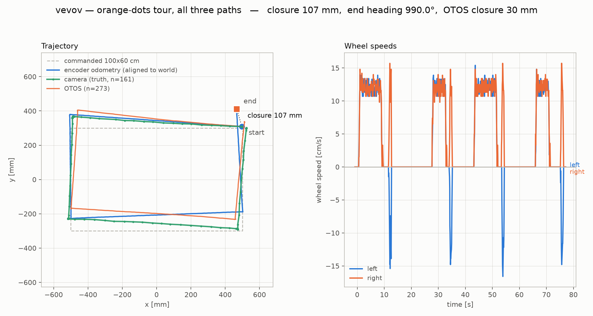

# vevov — orange-dots tour with all three paths, 2026-08-28

The tour re-run after the OTOS was brought up. **All three requested
paths are now live**: camera, OTOS, and encoder odometry, plus wheel
speeds.

Artifacts: `captures/tour-20260828-otos/`. Chart from
`tools/tour_chart.py` (extended this session with `--cam-csv`, `--meta`
world-frame alignment, and a continuous OTOS track).

## The headline: the OTOS is now the best onboard instrument

| | closure | error vs camera |
|---|---|---|
| **camera** (truth) | **2.79 cm** | — |
| **OTOS** | **3.04 cm** | **0.26 cm** |
| encoder odometry | 10.73 cm | 7.94 cm |

The OTOS lands within **2.6 mm** of camera truth over a 320 cm tour.
Dead reckoning is out by 7.9 cm — it believes it closed *worse* than it
did in absolute terms while being far less accurate about *where* it
ended up. That is exactly what an optical floor sensor is for: it sees
slip the encoders cannot.

Net rotation over the loop (4 x 90 = 360 commanded):

    encoder  +368.40 deg      <- over-reports by +8.4
    OTOS       -0.54 deg      <- wraps; ~0 is correct for a closed loop
    camera     -1.83 deg

Path length over the whole tour (320 cm commanded): camera 325.7,
encoder 323.7, OTOS 309.9 cm. The camera figure is inflated by sampling
noise (161 samples, each contributing a little jitter to a summed
length) and the OTOS figure is the one to distrust least — but NOTE
none of these three is a clean travel measurement; closure and the
per-leg camera fixes are.

## How the OTOS was fixed

It was never the sensor. See
`captures/otos-run-handler-i2c-hang-20260828.md` for the full
measurement. Two context bugs:

1. **`otosBegin()` ran from a RUN handler.** ANY `uBit.i2c` transaction
   from that context hangs the board permanently — proven by probing
   `0x10`, the NEZHA BRICK, which hung identically while the motion
   fiber drove that same address seconds later. Moved to the main fiber
   at boot: `otos=1`.
2. **Nothing ever sampled it.** `otosGet()` is cache-only and every
   `readWorld()` caller sat inside a RUN handler, so `ox/oy/oh` read
   `(0,0,0)` forever — the flat series the first tour had to chart as
   "no data". Now sampled at 10 Hz from a background fiber.

## Lever arm re-measured on the rebuilt chassis

The baked arm (`x -38.2 mm`, 2026-08-21) predated the rebuild, which
moved the centre of rotation. Re-solved from eight 45 deg pivots with
the arm not yet applied, so the OTOS traced its own circle:

    x -52.7 mm   y -1.2 mm   |arm| 52.8 mm
    residuals 1.4 mm median, 1.9 mm max (n=9)

**Independent cross-check:** the camera's tag-53 mount solved to
53.4 mm behind the centre the same day — different instrument, same fit
shape, agreeing to **0.7 mm**. Baked as `armX/armY` and now applied at
boot. Acceptance: OTOS position holds to **1.8 mm max** across six
in-place pivots, where an unapplied 52.8 mm arm would swing ~106 mm.

**UNVERIFIED:** `armYaw` (0.89 deg) was NOT re-measured — a position fit
does not constrain the sensor's angular mounting. Re-measure by
comparing OTOS heading to camera heading at rest across several
headings.

## Reading the chart

The OTOS keeps its OWN world frame — origin and heading-zero wherever
it started — so plotted raw it draws a correctly-shaped path at an
arbitrary rotation (~45 deg off here). `tour_chart.py` now applies the
same rigid transform it uses for the encoder, from the capture's camera
start fix. That is a CHANGE OF FRAME, not a fit: nothing is tuned to
make the curves agree.

## Field notes

- **The room lights switched themselves off mid-run** and every tag
  vanished. CLAUDE.md's rule held: suspect the lights first. Shelly at
  `192.168.1.122`; confirm with `Switch.GetStatus`, not `Set`'s
  `was_on`. The camera needs ~8 s to re-expose afterwards.
- **The camera reports BOTH `yaw=` and `heading=` for a mounted tag and
  they differ by ~29 deg.** Measured against travel bearing: **`yaw=` is
  the robot heading** (offset +0.74 deg); `heading=` was off by -81 deg.
  Do not assume.
- **zeguz broadcasts v5 `TLM:`/`DIAG:` lines on the radio** and they
  interleave with vevov's replies. Filter or silence it.
- `i2cf` reached 8 during OTOS sampling. Small, but the OTOS and Nezha
  share the bus with no mutual exclusion — watch it.
