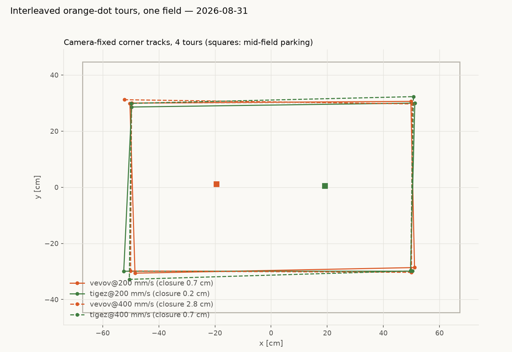

# Multi-robot orange-dot tours — vevov + tigez, one field (2026-08-31, evening)

The stakeholder's challenge: verify the fleet's firmware, park robots
mid-field, take each out for a camera-checked orange-dot tour with the
legs interleaved between robots, and park them back in the middle.
Run with **two** robots — gopiv was pulled mid-session for separate
hardware diagnosis (below).

## Result

| | vevov | tigez |
|---|---|---|
| probe (heading-model check) | +1.7° | −1.5° |
| leg misses at the dots | 1.9 / 5.4 / 2.6 / 5.2 cm | 3.2 / 1.4 / 3.7 / 4.8 cm |
| corrections | 2 of 4 legs | 3 of 4 legs |
| **closure** | **1.00 cm** | **0.50 cm** |

- Tour: the 100×60 orange-dot rectangle (corners ±50, ±30), toured
  counterclockwise by both robots simultaneously — **legs interleaved,
  one robot moving at any instant**, starting from opposite corners so
  the destination corner is always empty by construction.
- Every leg ended with a camera fix at the dot; misses > 3 cm got a
  correction move. No guard aborts, no veers, no dogleg fallbacks
  needed during the tour, nothing within 15 cm of a rail.
- Choreography: gather from wherever they stood to mid-line stations
  (±20, 0) → out to opposite dots → 4 interleaved rounds → back to the
  mid-line stations. Per-robot detail charts:

[vevov tour](fleet-tours-20260831/vevov-tour.png) ·
[tigez tour](fleet-tours-20260831/tigez-tour.png)

## Firmware verification (task 1)

The pre-flight check caught that **gopiv and vevov were still on
1.20260829.1** — the build that hard-faults with motors latched when
driven over radio (`fw-1-20260829-1-wedges-on-radio-traffic-during-
motion.md`). Both were reflashed to the safe v0.20260829.3 build over
farm USB and verified (`id diffdrive <name> 0.20260829.2`, correct
names, 4/4 PING on derived addresses, silent on the legacy 4/10).
tigez was already correct. Addressing was cross-checked three ways:
the new relay-server registry code, the relay firmware's own `!N`,
and the silicon-derived boot announcement — all agree.

## Session protocol that made it safe

Per robot, before anything real: re-register the camera tag mount
(registrations are per-session by API design), net-zero warm-up, then
a **probe** — a 12 cm measured drive that fits the yaw→heading offset
from what the camera actually saw; |OFF| > 15° refuses to drive.
Every leg is **guarded**: measured bearing > 25° off the commanded one
stops the robot at the camera fix (one retry, then abort). Transits
between parked robots use straight-line clearance checks (≥ 18 cm)
with a dogleg-waypoint fallback, and any non-participant robot tag
visible on the field is treated as a static obstacle. Lights
re-asserted every 60 s.

Those guards were not decorative — earlier attempts this session were
stopped safely by, in order: a dead relay draw, the probe gate (twice,
once catching a genuinely sick robot, once catching a harness math
bug), a clearance deadlock, a lost-ack stall, a 43° veer, and an
ESTOP latch. Each produced a fix now baked into the harness
(`fleetlib.py` / `threetours.py`, session scratchpad; data in
`captures/fleet-tours-20260831.json`).

## gopiv — pulled for hardware diagnosis

gopiv's **left drive channel is intermittently faulty**: one episode
of dead left encoder + `i2cf` bursts to 87 with duty wound to
saturation while the camera confirmed ~0 real motion, and one 43°
left veer caught by the drive guard — interleaved with fully clean
runs (three passed probes, a clean park). A power cycle cleared the
first episode, consistent with wedged I2C peripheral state, but the
recurrence pattern says hardware: left motor/encoder connector is the
first thing to check. Evidence: `gopiv-diag.log.jsonl`,
`gopiv-diag2.log.jsonl` (session scratchpad).

## Round 2 (later the same evening): speed tiers — 200 and 400 mm/s

The stakeholder's follow-up: run it again from the top, two more tours
per robot, legs at ≥200 and at 400 mm/s. Same choreography (probes
−0.4°/+0.4°, gather, opposite dots, interleaved legs, re-park); the
400 mm/s legs were split at their midpoints with a camera check
between halves, since a full-leg veer at that speed would consume the
rail margin before any fix could catch it.

| | vevov @200 | tigez @200 | vevov @400 | tigez @400 |
|---|---|---|---|---|
| leg misses (cm) | 1.6/1.8/0.6/4.2 | 1.2/1.4/2.5/3.3 | 3.3/5.3/3.1/2.5 | 2.4/4.6/2.8/6.8 |
| corrections | 1 | 1 | 3 | 2 |
| **closure** | **0.71** | **0.22** | **2.77** | **0.70** |

- **tigez @200 closed at 0.22 cm — the best closure ever measured on
  this rig**, at nearly double the historical tour speed. 200 mm/s
  legs were *more* accurate than the morning's 120 mm/s runs.
- At 400 mm/s misses roughly double and corrections become routine,
  but everything stayed contained: no aborts, no veers past the
  guard threshold, nothing near a rail.
- Per-tour charts:
  [vevov @200](fleet-tours-20260831/vevov-200-tour.png) ·
  [tigez @200](fleet-tours-20260831/tigez-200-tour.png) ·
  [vevov @400](fleet-tours-20260831/vevov-400-tour.png) ·
  [tigez @400](fleet-tours-20260831/tigez-400-tour.png);
  all four overlaid in the overview at the top (solid = 200,
  dashed = 400). Raw data:
  `captures/fleet-tours-speed-20260831.json`.

## Firmware gaps this session exposed (issues filed)

- `estop-latches-with-no-wire-clear.md` — ESTOP latches until reboot;
  kernel has `estopClear()` but no wire verb reaches it. Cost one
  power-cycle walk to the field tonight.
- `no-wire-verb-reaches-rebaseposition-so-tours-cannot-zero-their-frame.md`
  — tours cannot zero their odometry frame remotely.
