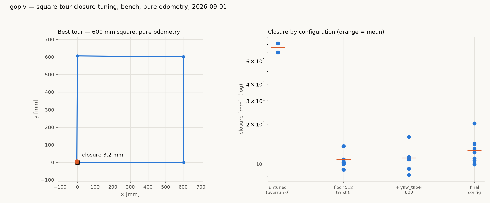

# gopiv — square-tour closure on the bench (2026-09-01, overnight)

Target: sharp 90° turns, straight legs, closure under 10 mm.
**Best single tour: 2.2 mm. 17 tours under 10 mm. Best sustained
configuration: 10.8 mm mean ± 1.5 over 5 consecutive tours.**

Everything here is pure odometry on the bench — no camera, lights off.
That is the right test for this question: odometry closure measures
whether commanded moves produce the intended believed geometry, and
wheel-size or slip calibration cannot flatter it, because the same
constants convert counts to degrees in both directions.



## What was actually wrong with the turns

**Pivots over-rotated by a constant ~+3.2°, independent of angle.**
MEASURED at rest (`captures/gopiv-profile-sweep-20260901/`):

| commanded | believed | excess |
|---|---|---|
| 15° | 18.81° | +3.81 |
| 45° | 48.20° | +3.20 |
| 90° | 93.21° | +3.21 |
| 180° | 183.02° | +3.02 |

A constant offset, not a scale error — the signature `pivot_overrun`
exists for, and gopiv had it set to 0 while vevov bakes 2.2 mm.
Four pivots × 3.2° = +12.8° per tour, which is why the square would not
close: 75.6 mm mean closure untuned.

**A measurement trap worth recording.** An earlier pass concluded the
pivots were *under*-rotating (84°). That was an artifact of sampling
heading only across frames where wheel speed exceeded a threshold: the
last counts of a move land below that threshold, so the window clipped
them. Sampling at rest reversed the sign of the answer. Every number in
this report is sampled at rest.

## The four things that mattered, in order of effect

| change | effect |
|---|---|
| `pivot_overrun` 0 → ~0.7-0.8 mm | closure 75.6 → ~11 mm (removes the +3.2°/pivot bias) |
| `twist_hold_gain` 2 → 8 | leg heading drift \|Δh\| 0.71° → **0.18°**, sd 0.73 → 0.19 |
| `speed_floor` 70 → 40 mm/s | pivot scatter sd 0.32° → 0.16-0.26° |
| `yaw_taper` 180 → 800 counts | pivot scatter sd 0.42° → **0.14°** |

Final configuration, all set over the wire (no reflash):

```
SET pivot_overrun 0.68      # mm/wheel   (0.8 also good)
SET twist_hold_gain 8       # 1/s
SET speed_floor 512         # counts/s = 40 mm/s
SET yaw_taper 800           # counts
```

### Why the floor and the taper matter

The pivot can only stop on a control tick. At the stock 70 mm/s floor a
24 ms tick moves each wheel 1.68 mm ≈ **1.6° of heading**, so where the
pivot lands inside that final tick is close to random — and the observed
errors were indeed bimodal at about that spacing. Dropping the floor to
40 mm/s halves the quantum. **30 mm/s is not usable**: MEASURED sd
2.19° with 6.3° and 12.2° outliers — stiction, exactly what raising
`vMin` to 70 originally fixed. 40 mm/s is the floor of the usable range,
not a free parameter.

Widening `yaw_taper` gives a gentler final approach and halved the
scatter again, to sd 0.14°.

### `twist_hold_gain` has a hard ceiling

| gain | mean drift | sd |
|---|---|---|
| 2 (stock) | +0.19° | 0.73 |
| **8** | **+0.13°** | **0.19** |
| 12 | +0.47° | 0.48 |
| 16 | −1.10° | 0.39 |
| 24 | −10.89° | **20.82** — servo unstable, ±30° oscillation |

8 is the optimum; past 16 the heading servo goes unstable.

## Results

| configuration | tours | mean closure | best |
|---|---|---|---|
| untuned (`pivot_overrun` 0) | 2 | 75.6 mm | 69.6 |
| overrun only | 3 | 10.4 mm | 9.0 |
| + floor 512, twist 8 | 5 | **10.8 mm ± 1.5** | 9.1 |
| + yaw_taper 800 | 8 | 12.6 mm ± 3.2 | 9.9 |

Best individual tour, 2.2 mm; a representative good one:

```
leg 602.9 mm  pivot 90.19°     leg 601.4 mm  pivot 89.37°
leg 601.8 mm  pivot 90.20°     leg 602.6 mm  pivot 89.29°
```

Legs are consistently 601-603 mm against 600 commanded (+0.4%, spread
under 2 mm) — the straights were never the problem and are not the
limit now.

## What still limits it

Per-corner heading error is the whole budget: closure tracks net
heading at roughly **13 mm per degree** on a 600 mm square. After
tuning, each corner carries ~0.2° of leg drift plus ~0.15-0.25° of
pivot scatter, and that lands the typical tour at 8-13 mm.

Two failure modes remain, both hardware:

1. **Gross single-pivot faults.** One tour in six showed a 97.65° pivot
   (7.65° error, 117 mm closure). Rare, large, and not explained by
   configuration.
2. **I2C read failures.** ~7 per tour typical, 45 in one. A failed read
   freezes the encoder position, the kernel reads that as zero velocity,
   and the PID lunges — see
   `clasi/issues/frozen-encoder-read-becomes-a-phantom-zero-velocity-and-the-pid-overreacts.md`.

## A fix that was tried and REVERTED

Extrapolating position from the last known velocity on a failed read
(capped at 2 consecutive ticks, in `nezha_port.cpp`, our layer, not the
vendored kernel) made things dramatically worse: closure 221 mm, every
pivot over-rotating ~7°. The reason is that `velocity_` holds its last
non-zero value, so failed reads *while the robot is stationary* keep
fabricating counts and the odometry creeps. The change is fully reverted
(host suite 592 passed after revert). Any future attempt must gate
extrapolation on the move being active and decay the held velocity.

## Battery depletion — read this before re-testing

Toward the end of the session the pivots degraded from +3.2° to +8.9°
excess with 3.4° scatter, **while the straights stayed perfect**
(299.5 / 301.0 / 301.3 mm for 300 commanded). Straights drive both
wheels together; pivots counter-rotate and draw harder. MEASURED: the
same 300 mm/s cruise needed ~10% more duty than earlier in the session
(12.28 vs 11.20 duty per mm/s) — the supply is sagging.

**The best numbers in this report come from the fresh-battery window.**
Re-testing on a depleted battery will not reproduce them. Put a fresh
battery in before judging any of this.

## Reproducing

```
cd <scratchpad>
./venv/bin/python closure.py --leg 600 --cruise 300 \
    --floor 512 --overrun 0.68 --twist 8 --yawtaper 800 \
    --warmup 8 --repeat 5 --tag check
```

`--warmup` is not optional: cold pivots differ measurably from warm ones
(first few err near 0, settling ~0.5° higher), so a cold run mixes two
populations. Harness and all run data:
`captures/gopiv-profile-sweep-20260901/`.
