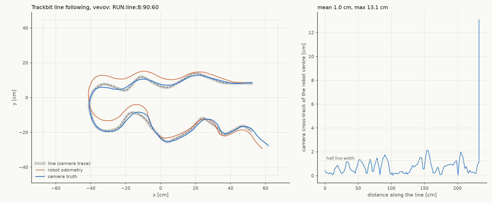
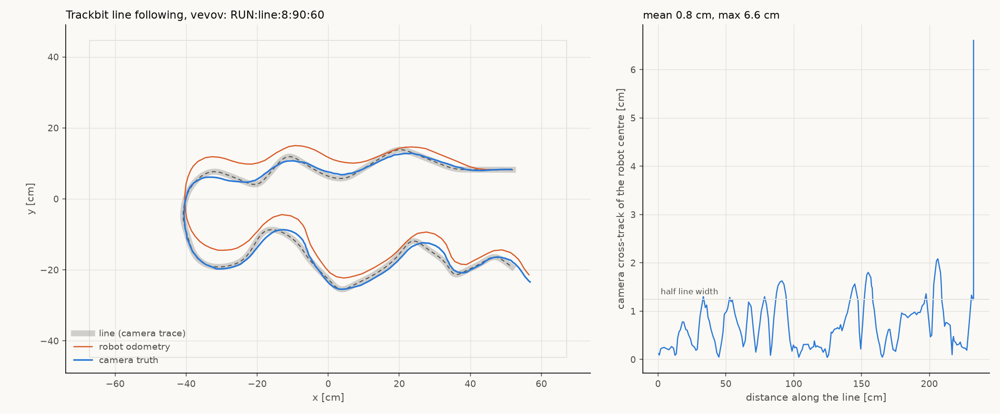
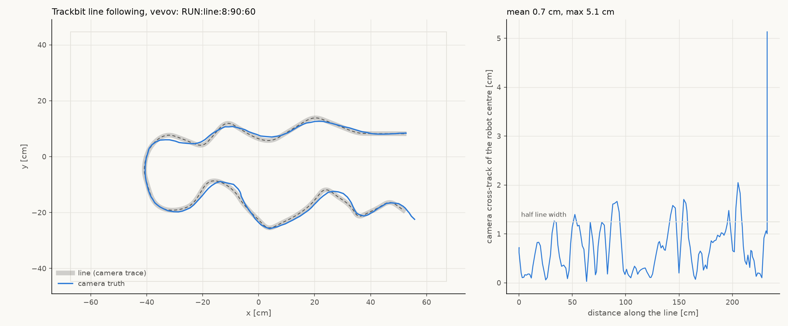
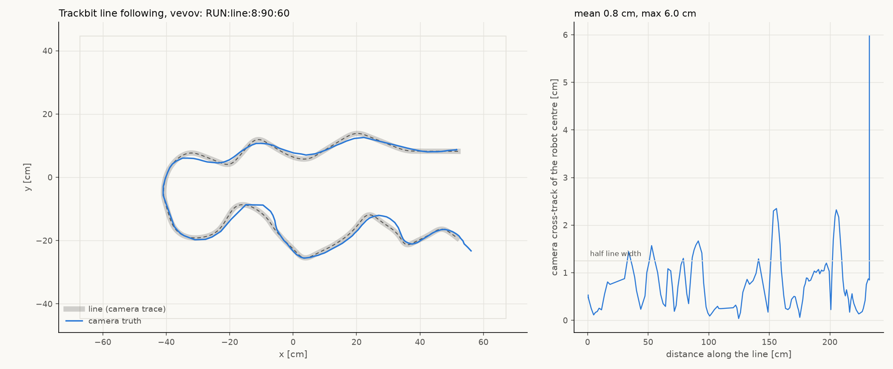
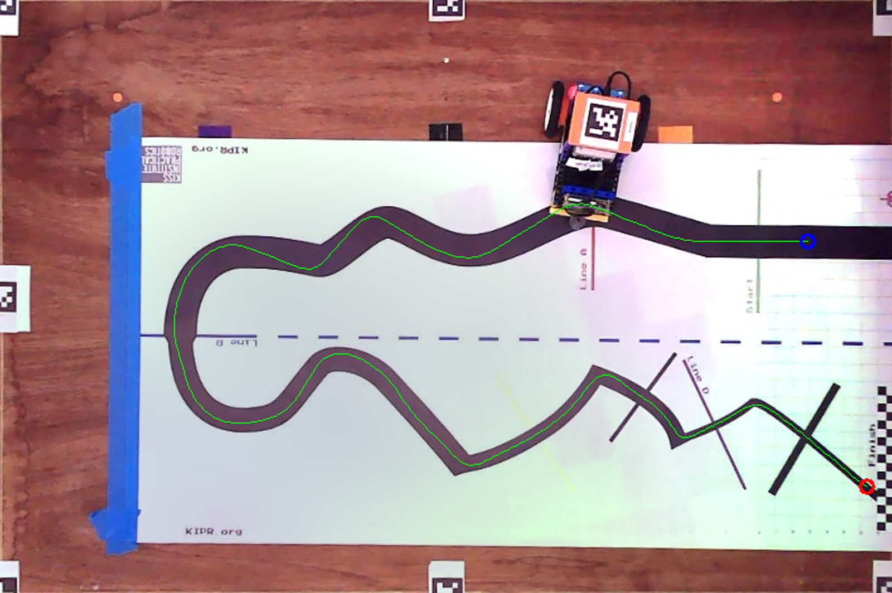
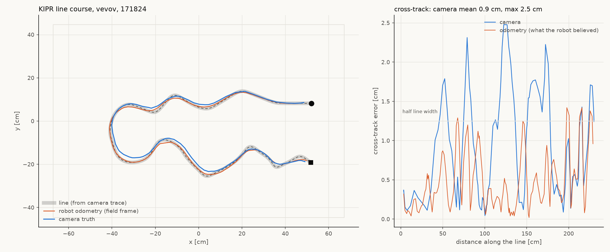
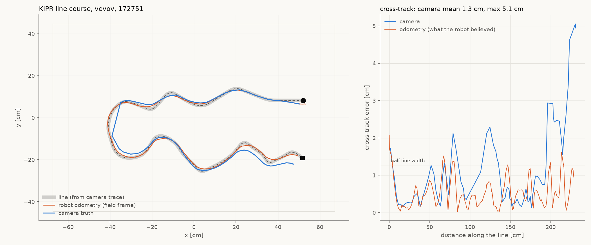

# Line following on the KIPR mat, vevov, 2026-09-02

vevov follows the black KIPR course on its **PlanetX Trackbit** line sensor,
running entirely on the robot. Two runs over the full 233 cm course, scored by
the overhead camera against the traced line:

| run | wall | camera cross-track of the robot centre | ended by |
|---|---|---|---|
| 1 | 31.0 s | **mean 1.0 cm, p95 2.0 cm** | rail guard at true x = 59.6 (robot ran on past the reference toward the Finish) |
| 2 | 30.1 s | **mean 0.8 cm, p95 1.7 cm** | rail guard at true x = 55.3 |

The line is ~2.5 cm wide, so the robot's centre stayed inside the line's own
width for essentially the whole course, sharp zigzag corners included. The
robot's odometry (orange in the charts) drifts several cm from the truth over
the same run, which is why the earlier camera-mapped, odometry-driven attempt
(appendix) could not do this.





Data: `captures/vevov-line-20260902/16-sensor-run1.*`, `19-sensor-run2.*`
(serial log, parsed JSON with the robot's LINE: trace and the camera track).

## The minimal program (final form)

The follower was then cut down to the smallest program that does the job:
[`test/linefollow.ts`](../../test/linefollow.ts), 85 lines including comments.
It reads one Trackbit register (the line bitmask), steers with
`driveTwist(speed, kp * error)` inside a `driveTick()` loop, and exposes
`RUN:line`, `RUN:abort`, `RUN:linesense`, and button A. It is built in place
of `test.ts` with the new make_deploy switch:

```
uv run python tools/make_deploy.py --program linefollow.ts --robot vevov
mbdeploy deploy --remote vevov --hex .tmp/deploy-linefollow/built/binary.hex
```

`test.ts` itself is untouched (the earlier additions to it were reverted), so
the tour suite and its host tests are as before.

Driven entirely over the **radio relay** (torture, channel 37 group 43):
`stage.py` put the robot on the start (0.7 cm, 2.3 deg), `sensor_run.py
--radio` sent `RUN:line:8:90:60` and guarded the rails.

| run | wall | camera cross-track of the robot centre | ended by |
|---|---|---|---|
| minimal, radio, 1 | 30.5 s | **mean 0.7 cm, p95 1.6 cm** | rail guard at true x = 55.7 |
| minimal, radio, 2 | 30.5 s | **mean 0.8 cm, p95 2.2 cm** | rail guard at true x = 56.1 |





Editor/type-check note: `test/linefollow.ts` is wrapped in its own
`namespace linefollow` so it can sit beside `test.ts` in the repo's tsconfig
type-check without name collisions, and `tsconfig-simulator-globals.d.ts`
now declares `pins.i2cReadNumber`/`i2cWriteNumber` (pxt's `pins.ts` does
not type-check under that harness). `npx tsc -p tsconfig.json --noEmit` is
clean. The namespace wrap was made after the runs above; the build carrying
it compiled (`26-build-minimal-ns.txt`) but could not be flashed that
evening because vevov's farm node dropped off mDNS and gauti was down, so
**the robot still runs the pre-namespace build of the same program**
(identical logic). Reflash with the `mbdeploy deploy --remote` line above
when the farm is back.

Rail-guard lesson: the guard briefly used `ESTOP` as a backstop after
`RUN:abort`; that latched the robot and the minimal program has no clear
verb. `SET estop_clear 1 #<id>` over the radio clears it (sprint 028's
sequenced verb). The guard now sends only `RUN:abort`, twice.

Data: `captures/vevov-line-20260902/25-radio-run1.*`. The radio heard 8 of 20
`linesense` samples, as expected for that link; the follower itself needs no
link at all once started.

## The sensor

The ElecFreaks PlanetX **Trackbit**: a four-channel reflectance array on the
I2C bus at 0x1A, mounted at the front of vevov (`radio-robot-lib
config/robots/vevov.json` "perception.line_array": 96 mm ahead of the centre,
channels at y = +32, +8, -8, -32 mm, channel 0 on the robot's left; those
numbers are copied from tovez and not re-measured). Protocol, as in
`PlanetX_Basic.Trackbit*` of https://github.com/elecfreaks/pxt-planetx
(`basic.ts`, v1.6.7) and the radio-robot-c `LineSensor` driver: write a
1-byte register, read 1 byte. Registers 0-3 are per-channel grayscale
(0 white .. 255 black), 4 is the line bitmask (bit i = channel i on the line),
5/6 the sensor's own offset. Parked on the start of the course it read
bitmask 7 with grays 150 / 243 / 226 / 70 (`15-trackbit.txt`).

Two things were ruled out first, and cost an hour: the two-channel digital
PlanetX line-tracking sensor on a J port (RUN:pinsurvey showed every J-port
pin floating, `12-pinsurvey.txt`), and, before that, following the line with
no sensor at all (appendix).

## The first program (superseded by the minimal one above)

The first two Trackbit runs used handlers added to the on-robot test program
`test/test.ts` (since reverted; the same logic now lives in
`test/linefollow.ts`), flashed as fw 0.20260902.3
(`captures/vevov-line-20260902/13-build3.txt`, `14-flash3.txt`):

- `RUN:linesense[:s]` -- sample the Trackbit, report each sample and a
  histogram. `RUN:pinsurvey` -- which J-port pins are driven.
- `RUN:line[:speed_cm_s[:max_s[:kp]]]` -- the follower. Every control cycle
  (~24 ms, the continuous drive loop `driveTwist` + `driveTick`) it reads
  the bitmask, takes the centroid of the channels that see the line
  (+1.5 far left .. -1.5 far right), and commands yaw rate = kp * error
  (deg/s, CCW+). Nothing seen: turn toward the side the line was last on at
  0.4x speed; give up after 1.5 s. Ends on lost line, the time limit, or
  `RUN:abort`. Emits a 4 Hz `LINE:` odometry trace and a `LINE:end` summary.
  Both runs used `RUN:line:8:90:60`: 8 cm/s, 90 s limit, kp 60.

Host side, `tools/linefollow/sensor_run.py` opens one lossless session to
the farm serial daemon (`nada.local`, dns-sd `_mbserial._tcp`), sends the
command, logs everything, and runs a camera **guard** that sends `RUN:abort`
if the robot's true centre comes within 12 cm of a rail. The camera never
steers; the line ends at the Finish flag against the east rail, so
something has to stop the robot there. `chart_sensor.py` scores the camera
track against `kipr_course.path.json` (the line as traced from the camera,
trimmed to x <= 52 cm, hence the run-out spike at the very end of run 1).

## Things learned

- **Every J-port pin floats on vevov.** `RUN:pinsurvey` reads each pin
  under pull-up then pull-down; all of P1/P2/P8/P12-P16 followed the pull.
  The Trackbit is on I2C, not a J port.
- **I2C fault counter climbs while the follower runs**: STATUS `i2cf` went
  0 -> 201 in run 1 and to 216 after run 2 (~6/s), with connL/connR staying
  1 and the drive unaffected. The Trackbit reads happen on the same fiber as
  the kernel tick, so this is probably the brick side NAKing right after a
  Trackbit transaction. Worth a look given sprint 028's frozen-encoder work;
  not investigated here.
- **The first MOVE_X after an idle stretch or a STOP-ended session can ack
  and not move** (`ack <id> <lastDone> timeout`, no rotation; seen three
  times: `03-stage-run2.txt`, `06-stage-sensor-run.txt`, and the survey
  session). `stage.py` therefore verifies every pivot with the camera before
  driving a leg. Not understood; also worth a firmware look.
- **Camera positions of the 12 cm tag are parallax-dilated about the nadir**:
  `true = N + (apparent - N)/K`, N = (3.06, -2.80) cm, K = 1.119, up to
  5.4 cm at the mat's east end. Displacements only need /K.
- **The kernel starts asleep** after a reflash: STATUS `ready=0 cyc=0` until
  the first motion command.

## Reproduce

```
uv run tools/field_dance.py                       # convention check, robot mid-field, every session
uv run python tools/make_deploy.py --robot vevov  # builds test.ts in; then
mbdeploy deploy --remote vevov --hex .tmp/deploy-head/built/binary.hex
P=~/.local/pipx/venvs/aprilcam/bin/python
$P tools/linefollow/stage.py 52 8.2 180            # onto the course start facing west (true coords)
python3 tools/linefollow/linerun.py vevov /tmp/x.log "RUN:linesense:3|4.5"   # sensor sanity: bitmask 7-ish on the line
$P tools/linefollow/sensor_run.py vevov captures/<dir>/runN 8 90 60
cd tools/linefollow && uv run --with numpy --with matplotlib python chart_sensor.py <runN.json> kipr_course.path.json <out.png>
```

## Appendix: the camera-mapped attempt (earlier the same day)

Before finding the Trackbit I built a follower with no line sensor: trace the
line once from a camera frame, seed once from the camera, pure-pursue on
odometry. It completes the course (camera cross-track mean 0.9 / max 2.5 cm
on one run, 1.3 / 5.1 cm on the next, the difference being odometry heading
drift after the U-turn) and is kept here as the comparison that shows why a
line sensor is the right tool. Scripts: `tools/linefollow/follow.py`,
`stage.py`, `camlog.py`, `chart.py`. The original write-up follows.

## Method (camera-mapped)

The firmware has no line sensor, so the line is followed the way this repo
follows any figure: the robot drives on its own odometry, and the camera is
used once at the start (seed) and once at the end (score), recording in
between purely as a diagnostic (`.claude/rules`, camera-is-diagnostics).

1. **Map the line once.** Two deskewed camera frames (robot parked in two
   different places so its body could be masked out of each) were thresholded
   for near-black (`max(R,G,B) < 110`), unioned, opened, and traced with a
   momentum tracker that steps 4 px along the line and re-centres on the mask
   ahead of it. The deskewed image maps linearly to the field (5.957 px/cm).
   Result: `tools/linefollow/kipr_course.path.json`, 471 points
   at 5 mm spacing, 232.6 cm long, min radius 26 mm (zigzag corners), trimmed
   to |x| <= 52 cm at both ends so the robot's centre stays 12 cm off the
   east rail.

   

2. **Stage** the robot on the path start from one camera fix
   (`stage.py`): pivot, straight, pivot, each pivot verified with the camera
   before the next leg.

3. **Seed once.** `follow.py` takes one at-rest camera fix (median of 6),
   converts it to TRUE ground coordinates (see parallax below), reads the
   robot's odometry pose from `TLM FULL`, and fixes the field->odometry
   transform for the run.

4. **Pure pursuit on odometry.** Every 120 ms: nearest point on the path
   (windowed, monotone cursor), aim 90 mm ahead, `MOVE_V v omega 264ms`
   at 140 mm/s (half speed when |omega| > 1.2 rad/s, clamped at 2.5 rad/s).
   Odometry geofence at |x| > 60, |y| > 40 cm. Same loop shape as
   `tests/system/run_tour.py`'s SPLINE step, but anchored in the field
   frame rather than to the robot's start pose (see "why not run_tour").

5. **Score** with the camera log (`camlog.py`, ~4-5 Hz, converted to true
   ground coordinates) against the path; charts from `chart.py`.

## Results

| run | file | wall | odometry cross-track (believed) | camera cross-track (true) | end fix |
|---|---|---|---|---|---|
| 1 (17:18) | `follow-171824.json`, `camlog-run1.csv` | 22.1 s, 167 cycles | mean 0.49, max 1.42 cm | mean 0.95, p95 2.18, **max 2.48 cm** | 1.4 cm off line, 3.1 cm from path end |
| 2 (17:27) | `follow-172751.json`, `camlog-run2.csv` | 22.8 s, 162 cycles | mean 0.57, max 2.07 cm | mean 1.26, p95 4.80, **max 5.06 cm** | 5.0 cm off line, 5.3 cm from path end |





The line is ~2.5 cm wide, so half-width is 1.25 cm. Run 1 kept the robot's
centre of rotation within the line's width except at the four sharp zigzag
corners, where a 90 mm lookahead cuts inside by up to 2.5 cm (that is the
follower's geometry, visible in both the odometry and camera series and
fixable with a shorter lookahead there). Run 2 tracked equally well on the
robot's own estimate but the camera shows it running ~3 cm south of the line
along the whole bottom leg and 5 cm off by the zigzag: a heading error of
roughly 1-1.5 deg accumulated around the U-turn that odometry cannot see.
Run 2's camera trace also has a dropout at the U-turn (the straight chord
at x = -40): the camera lost the tag for ~1 s there; it is a gap in the
truth record, not robot motion.

**Bottom line:** with a static camera map and pure odometry the robot follows
the course end to end and stays within about 1-2 cm for the first ~1.5 m; over
the full 2.3 m, drift of up to 5 cm is to be expected. Staying ON a 2.5 cm
line reliably needs a sensor that sees the line (a reflectance array, or the
robot's own camera), not better odometry.

## Things learned on the way

- **Camera positions of the tag are parallax-dilated about the nadir.** The
  tag is 12 cm up, so the daemon reports `apparent = N + K*(true - N)` with
  K = 1.119 and N = (3.06, -2.80) cm. At the east end of the mat that is a
  **5.4 cm** difference in x. Displacements only need /K (which the dance
  already does); absolute positions need the nadir too. `stage.py`,
  `follow.py` and `camlog.py` all convert; the first staging attempt did not,
  and put the robot 3.4 cm short of where it thought.
- **Why not `run_tour.py`'s SPLINE step:** it anchors the path to the robot's
  start pose and rotates the path so its first tangent matches the robot's
  heading. An 8 deg staging heading error would rotate this 2.3 m course by
  30 cm at the far end. Anchoring in the field frame from the camera seed
  turns staging error into a small cross-track offset the follower steers out.
- **Never drive a leg after an unverified pivot.** Staging attempt 2
  (`03-stage-run2.txt`): `MOVE_X 0 -1328 188 9000` acked `ack 1 169 timeout`
  and did not turn at all (i2cf went 3 -> 5 around then). The following
  27 cm reverse leg then went the wrong way. `stage.py` now re-reads the
  camera after each pivot, retries the residual once, and refuses the leg
  if the heading is not within 8 deg.
- **The kernel starts asleep:** STATUS `ready=0 cyc=0` until a 2 mm `MOVE_X`
  kick; `RUN:clearestop` alone does not start it.
- `aprilcam` `stream_tags` ignores SIGINT inside gRPC; kill the logger with
  SIGKILL (it now flushes every row). A logger left running silently appended
  the next staging move to run 1's CSV; `chart.py` windows the camera log to
  the run's wall time for that reason.
- MCP `get_tags` on this camera returned `[]` twice while `get_tag` and the
  Python client's `get_tags` returned all 8 tags. Unexplained; the tools use
  the client path.

## Reproduce

The scripts are checked in under `tools/linefollow/` (the copies in the
git-ignored `captures/vevov-line-20260902/` are the run record).

```
uv run tools/field_dance.py                                   # convention check, robot mid-field
P=~/.local/pipx/venvs/aprilcam/bin/python; cd tools/linefollow
$P stage.py 52 8.2 180                                        # onto the path start, facing west
$P camlog.py camlog-runN.csv & $P follow.py kipr_course.path.json --speed 140 --lookahead 90; kill -9 %1
uv run --with numpy --with matplotlib python chart.py follow-*.json camlog-runN.csv ../../reports/line-follow-20260902/runN.png
```

Re-trace the course (`kipr_course.path.json`) if the mat moves; re-measure
`tools/field_calibration.json` if the tag plate or camera moves.
