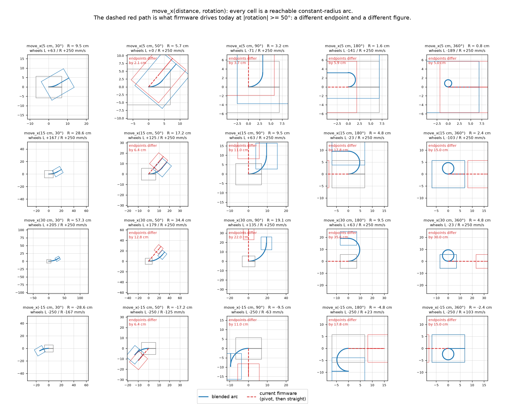
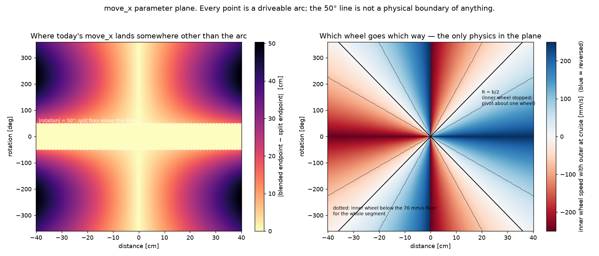
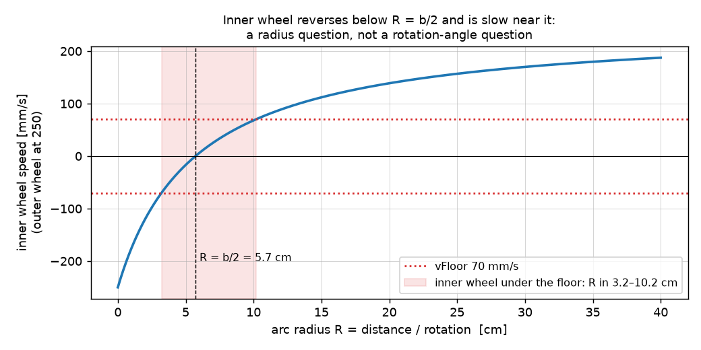
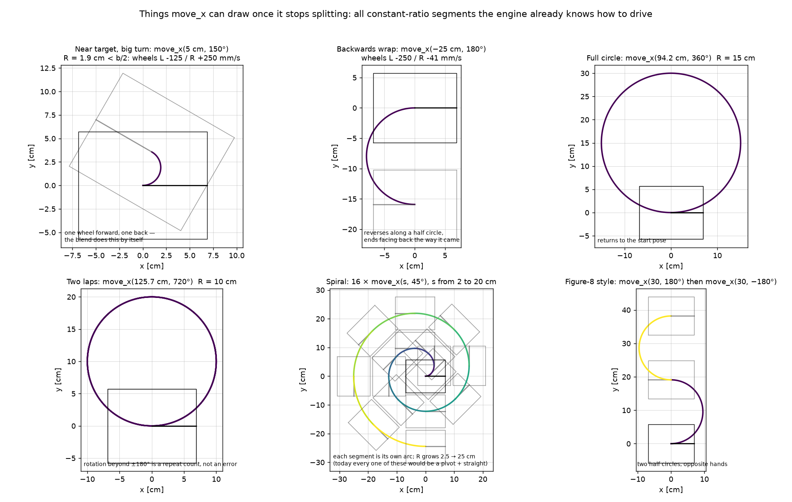
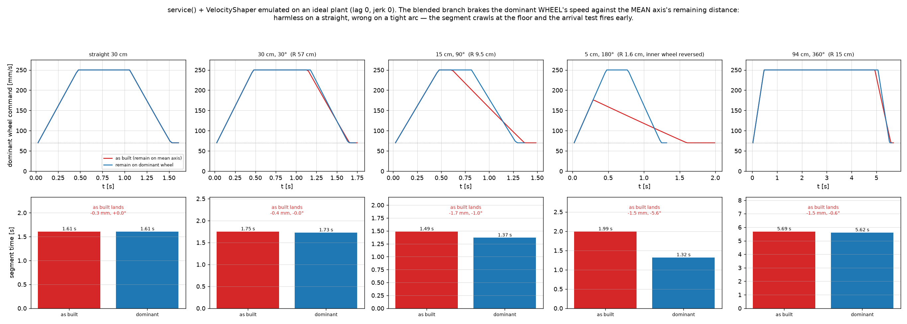
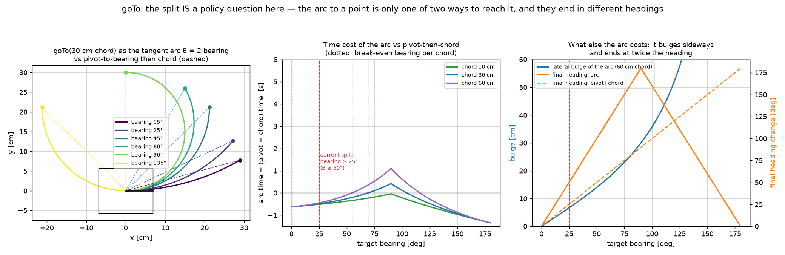

# `move_x` should never split; the 50° rule belongs to `go_to` only

**Date:** 2026-09-06. **Method:** kinematic simulation plus an emulation of
`MotionEngine::service()` + `VelocityShaper` on an ideal plant. Nothing in
this report was run on a robot; every hardware statement below is marked
UNVERIFIED with the bench check that would settle it.

Script and raw output: `reports/move-x-arc-space-20260906/movex_space.py`,
`sim.out`. Geometry: tigez effective track width b = 114.4 mm (MEASURED
2026-08-30, `captures/tigez-cal-20260830/notes.md`); shaping numbers are
`MotionLimits` defaults (cruise 250, floor 70, accel/decel 400 mm/s²).

**Implemented 2026-09-07, out of process, on master.** `moveX()` no
longer splits; `Segment::dominantScale()` puts a blended segment's
`remaining()` in the dominant wheel's frame; the simulator, shim budget,
block docs and design docs follow. Pinned by
`tests/host/test_move_x_arc_space.py` (nine-case gallery through the real
engine on ideal wheels, plus the tight-arc timing test) and
`tests/host/test_sim_move_is_one_arc.py` (the extracted simulator core,
executed). The bench checks at the end are still UNVERIFIED.

## The question

`move_x(distance, rotation)` currently runs as one blended arc below
|rotation| = 50° and as **pivot-then-straight** at or above it
(`src/motion/motion_engine.cpp:207-210`, `kTurnFirstAngle`). The
stakeholder's claim: there is no rotation at which a blended arc becomes
impossible for a differential drive, so `move_x` should always drive the
arc, and the 50° policy is a `go_to` question that was misapplied to
`move`.

## Answer

The claim is correct on every count.

1. **Every `(distance, rotation)` pair is a driveable constant-radius
   arc.** R = distance / rotation. |R| > b/2 is an ordinary arc, R = b/2
   is a pivot about one wheel, |R| < b/2 has the inner wheel running
   backwards, and R = 0 is a spot pivot. The wheel commands are simply
   `v ± rotation·b/2`, and the engine's blended `Segment` already
   computes and drives exactly that ratio. There is no infeasible region
   anywhere in the plane (figure 2, right).
2. **The split does not approximate the arc, it replaces it with a
   different figure.** Pivot-then-straight ends at
   `distance·(cos θ, sin θ)`; the arc ends at `R·(sin θ, 1−cos θ)`. For
   `move_x(30 cm, 90°)` those are 22 cm apart; for `move_x(30 cm, 180°)`
   36 cm; and every `360°` request today becomes a spin followed by a
   straight instead of the circle that was asked for (figure 1, figure 2
   left).
3. **The 50° constant was never about `move`.** `motion-api.md` §3.3
   records it as "recovered from `navigator.cpp:237-240`", alongside a
   `behind_angle` of 90° defined on target *bearing*. Both are go-to-a-
   point heuristics. Sprint 003 ticket 007 (4027a87) transplanted the
   first onto `moveX` as a "measured turn_first_angle"; what was measured
   was a navigator's choice about how to reach a point, not a limit of
   the drivetrain.
4. **`go_to` genuinely does need a split, but for policy reasons, and it
   already owns its own** (`decomposeGoToR`, sprint 006). The arc to a
   point is one of two ways to get there; they differ in time, in lateral
   excursion, and in final heading (figure 6).

## Figures

### Figure 1: the parameter gallery

Blue is the arc `move_x` asks for. Red dashed is what firmware does today
whenever |rotation| ≥ 50°. Note the wheel speeds in each title: the
inner wheel simply passes through zero and reverses as the radius drops
below b/2; nothing special happens at 50°.

### Figure 2: the whole plane

Left: how far today's endpoint is from the requested arc's endpoint. The
white 50° line is the only structure, and it is a policy line, not a
physical one. Right: the inner wheel's speed with the outer wheel at
cruise. The solid black lines are R = b/2 (one wheel stopped). Blue means
the inner wheel is reversed, which is the stakeholder's "drive one wheel
forward and one back" case and is exactly what the blend produces.

### Figure 3: the one real physical band

The only physics worth a rule is this: with the outer wheel at 250 mm/s,
the inner wheel sits below the 70 mm/s floor for the whole segment
whenever R is between 3.2 and 10.2 cm (the band straddling b/2 = 5.7 cm).
Inside that band the inner wheel is stiction-bound and its PI loop will
stick and jerk (the same I-term stall mechanism as the MOVE_X end bump, MEASURED on
vevov 2026-08-29, `reports/vevov-square-tours-20260829.md`). Two things
follow:

- It is a **radius** band, so no rotation-angle threshold can express it.
  `move_x(30 cm, 90°)` (R 19 cm) is outside it and `move_x(5 cm, 30°)`
  (R 9.5 cm) is inside it, the opposite of what the 50° rule assumes.
- The right response is not a pivot substitute. It is either to accept it
  (the wheel still integrates the right distance on average; the arc
  endpoint is unaffected in the ideal case), or to lower the outer
  wheel's cruise so the inner wheel clears the floor. UNVERIFIED on
  hardware: a wheels-up bench sweep of R across 2 to 15 cm at fixed
  180° would show whether the inner wheel tracks.

### Figure 4: what `move_x` can draw once it stops splitting

Near-target big turn, backwards half-circle, full circle, two laps, a
16-segment spiral, a figure-8. All of these are single blended segments
the engine already knows how to drive. Today every panel except the two
30° spiral segments would be executed as pivot + straight.

### Figure 5: a real engine defect the arc exposes

Reading `service()` (source, `motion_engine.cpp:282-343`): for a blended
segment `dominantAxis` is `kDistance`, so `Segment::remaining()` returns
distance left on the **mean** axis, while the shaper's `vCmd`, brake
budget and arrival test (`remain <= vNext·dt`) are all in the **dominant
wheel**'s frame. On a straight the two frames coincide. On a tight arc the
mean axis moves at `distTarget/dominant` of the wheel speed, so the
shaper brakes far too early (the segment crawls at the floor) and the
arrival window `vNext·dt` is `dominant/distTarget` times too wide on the
mean axis.

Emulated on an ideal plant, lag 0:

| segment | time as built | time with remain on dominant wheel | as-built landing error |
|---|---|---|---|
| straight 30 cm | 1.61 s | 1.61 s | −0.3 mm, 0.0° |
| 30 cm, 30° (R 57 cm) | 1.75 s | 1.73 s | −0.4 mm, 0.0° |
| 15 cm, 90° (R 9.5 cm) | 1.49 s | 1.37 s | −1.7 mm, −1.0° |
| 5 cm, 180° (R 1.6 cm) | 1.99 s | 1.32 s | −1.5 mm, −5.6° |
| 94 cm, 360° (R 15 cm) | 5.69 s | 5.62 s | −1.5 mm, −0.6° |

The as-built profile for the 5 cm / 180° case never reaches cruise: it
starts braking on the second tick. This is invisible today precisely
because the split hides every tight arc from the blended branch. If the
split is removed, `remaining()` for a blended segment has to be measured
on the dominant wheel (or the shaper fed a mean-axis speed and floor).
UNVERIFIED on hardware; the emulation is the shaper's own arithmetic, so
the timing numbers are exact for an ideal plant and the landing errors
will only be larger with lag and stiction.

### Figure 6: why `go_to` is different

`goToR` reaches (x, y) either by the tangent arc, whose heading change is
θ = 2·bearing, or by pivoting to the bearing and driving the chord. Both
land on the point. They differ in:

- **Time** (middle panel, including ramps). The arc wins for small
  bearings and loses past a break-even that depends on chord: about 55°
  bearing for a 60 cm chord, 68° for 30 cm, never for 10 cm. The current
  split at 25° bearing (θ = 50°) is well on the conservative side of
  break-even for time alone.
- **Lateral excursion** (right panel, blue). The arc bulges
  `(chord/2)·tan(bearing/2)` sideways: 16 cm for a 60 cm chord at 60°
  bearing. On a 134 × 89 cm field with a 12 cm margin this is the
  binding constraint, and it is why `world.ts` pulled its own threshold
  down to 12°.
- **Final heading** (right panel, orange). The arc ends at 2·bearing, the
  pivot-then-chord at bearing. For a tour, the next leg is planned from
  whichever one you got, so this is not cosmetic.

So `go_to`'s split is a legitimate planning decision with three inputs,
none of which apply to `move_x`, where the caller has already chosen the
arc by specifying it.

## Recommended rules

| verb | rule |
|---|---|
| `move_x(distance, rotation)` | Always one blended segment. No angle threshold. `rotation` past ±180° means more than half a turn (a 360° is a full circle, 720° two laps), never a wrap. Sign of `distance` selects forward or reverse along the same arc. |
| `go_to(x, y)` | Keeps its own split in `decomposeGoToR`. The threshold is a policy on bearing (or on the arc's bulge relative to the field margin), stated in bearing terms, not inherited from any `move_x` constant. Above it: pivot to bearing, then chord. |
| `go to world` block | Unchanged (12° bearing, `world.ts:152`); it is the same policy with a field-margin argument already written down. |

## What changing this touches

Not done here; this is a report, not a ticket. Team-lead scope excludes
`src/` and `tests/` in any case.

- `src/motion/motion_engine.cpp` `moveX()`: drop the
  `queuePivotThenStraight` branch. `goToR()` already bypasses `moveX`'s
  split and is unaffected. `kTurnFirstAngle` then belongs to
  `decomposeGoToR` alone and should be renamed for what it is (a bearing
  policy, `turnFirstAngle()` is exposed at `motion_engine.h:119`).
- `src/motion/segment.h` `remaining()`: for a blended segment, measure on
  the dominant wheel (figure 5). Needs a host test with a tight arc
  that asserts both cruise is reached and the yaw axis lands.
- `src/shims.cpp:594-600`: `startMove()` budgets the split's sequential
  duration when `willSplit`; that branch goes.
- `src/blocks/motion.ts:264`, `src/blocks/sim.ts:239`: the block doc and
  the browser simulator's mirror of the split.
- `docs/design/specification.md:132`, `usecases.md:167-193`,
  `src/DESIGN.md:221`: prose.
- Tests that pin the split, all in `tests/host/`:
  `test_motion_engine_reductions.py`, `test_sim_pivot_then_straight_split.py`,
  `test_motion_engine_deadline_boundary.py`, `test_wire_motion_verbs.py`,
  `test_goto_turn_rate_reconciliation.py`, `test_goto_block_regression.py`,
  `test_run_tour_programs.py`,
  `test_sim_geometry_matches_kernel_and_setters_apply.py`,
  `test_heading_wrap.py`, and the `motion_engine_shim.cpp` harness.
- `radio-robot-lib/docs/design/motion-api.md` §3.3: the table that
  states the rule.

## Bench verification before any of this ships

All UNVERIFIED until run. On the bench stand, wheels up, one serial
session (the port reset trap, `playfield-testing.md`):

1. `MOVE_X` at 50 mm and 180° on a build without the split. Expect the
   right wheel to run forward and the left backward at roughly the 250 /
   −141 mm/s ratio in figure 1, and the yaw axis to land within a degree
   once `remaining()` is on the dominant wheel. Today's build will show
   the crawl-and-stop-short profile of figure 5 if the split is merely
   disabled without the `remaining()` fix.
2. A radius sweep at fixed 180°, R from 2 to 15 cm, reading per-wheel
   encoder velocity from `TLM`. This measures the figure 3 floor band on
   real wheels.
3. On the field, from a camera fix at the centre after the dance
   (`field-dance-first.md`): `move_x(94 cm, 360°)` must return to the
   start pose within the usual closure. A full circle at R = 15 cm stays
   inside a 30 cm box, so no path projection is needed beyond that.
