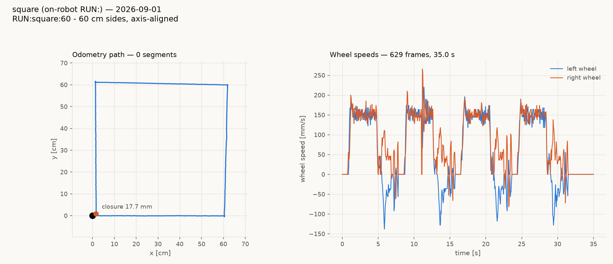
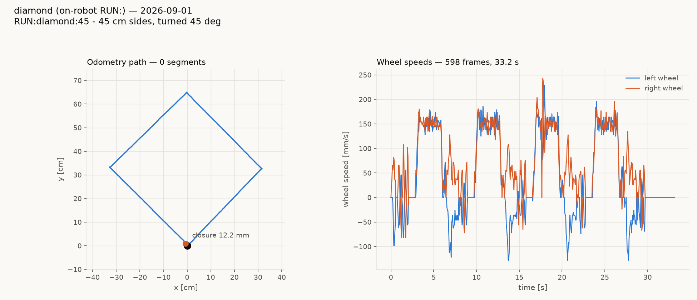
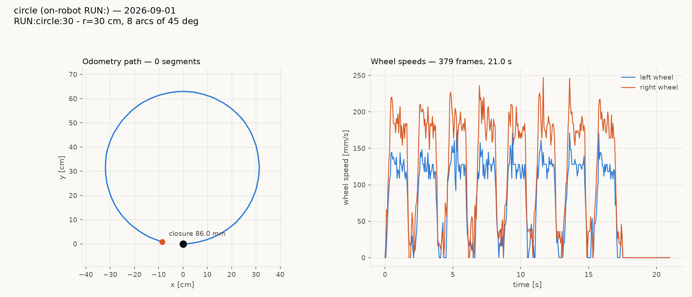
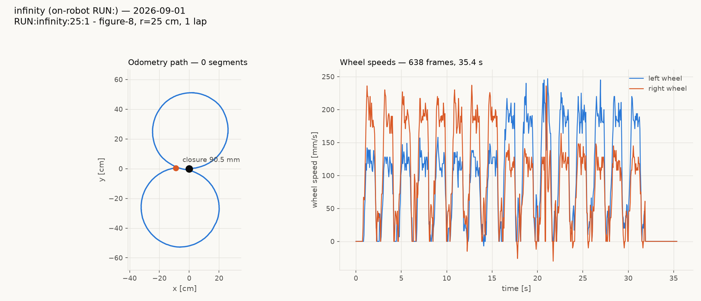
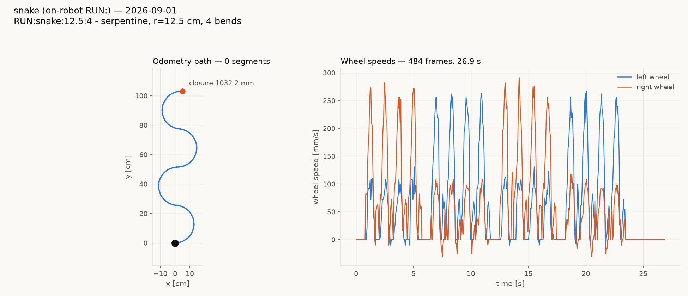

# On-robot tours over `RUN:` — gopiv, 2026-09-01

**The `RUN:` command works.** Three tour programs, driven entirely by
the robot from a single wire command each, on firmware carrying the VFP
yield guard. Bench, wheels up, pure odometry.

| tour | command | closure, 3 reps | net rotation |
|---|---|---|---|
| square | `RUN:square:60` | 45.0 ± 30.1 mm | +356.97° (ideal 360) |
| diamond | `RUN:diamond:45` | **23.9 ± 13.9 mm** | +402.14° (ideal 405) |
| circle | `RUN:circle:30` | 42.0 ± 31.6 mm | +355.28° (ideal 360) |
| infinity | `RUN:infinity:25:1` | 94.5 ± 7.5 mm | +2.74° (ideal 0) |
| snake | `RUN:snake:12.5:4` | *(open path)* | −3.93° (ideal 0) |







**Every figure is three repeats, and the spread is the point.** A
figure-8 is 16 arcs whose individual errors can cancel or accumulate:
one earlier single run of the infinity closed at 2.8 mm, which was luck,
not performance. Single-sample closures on these figures are not
meaningful.

The snake is an open path, so its printed "closure" of 1060 mm is really
end displacement. Scored in its own frame: **advance 1060 mm** against
an ideal of 8r = 1000, **lateral span 264 mm** against an ideal of 2r =
250, and **0 mm of backtracking** — it is monotone along its axis, which
is what makes it a serpentine rather than a coil.

## What this proves

This is the first time any of these has run. Before today every `RUN:`
verb that drove the motors hard-faulted the board — `RUN:straight:20`,
`RUN:pivot:90` and `RUN:square:20` all reset 3/3 on this same robot this
morning.

The kill test, on the guarded firmware, same board, same session:

| command | resets |
|---|---|
| `RUN:straight:20` ×10 | **0** |
| `RUN:pivot:90` ×10 | **0** |
| `RUN:square:20` ×5 | **0** |
| **total** | **0 / 25** |

Then the harder case, which is the one that actually matters — telemetry
subscribed so the protocol fiber is busy, and 209 sequenced `MOVE_X`
commands fired at the wire *during* four `RUN:square:20` tours, so two
fibers are genuinely contending:

| lap | result | telemetry |
|---|---|---|
| 1–4 | **clean, 0/4 resets** | 177–178 frames each |

That is precisely the configuration that was fatal. `cyc` ran to 5635
across the whole run without a single reset.

## Why it was broken

CODAL's fiber context switch saves R0–R12/SP/LR and **no VFP registers**,
while the build enables the hardware FPU. GCC uses the callee-saved bank
d8–d15 as ordinary spill space — for *pointers*, not just floats — so a
fiber parked at a yield had its locals overwritten by the next fiber's
arithmetic. `Protocol::run()` parked `&radioTransport_` in s17, a tour
fiber's PID wrote a wheel speed over it, and the protocol fiber woke and
dereferenced float −25.0f as `this`.

The fix wraps every yield this extension owns in a `noinline` helper
whose inline-asm clobber of d8–d15 forces the bank onto the calling
fiber's own stack around the switch. Verified in the shipped binary:

```
0002c6f4 <diffDrive::vfpSafeSleep(unsigned long)>:
   2c6f4:  push   {r3, lr}
   2c6f6:  vpush  {d8-d15}
   2c6fa:  bl     codal::fiber_sleep(unsigned long)
   2c6fe:  vpop   {d8-d15}
```

A `bl` rather than a `b.w` — the tail call did not survive, so the guard
is live rather than inert. Same shape in `vfpSafeYield` and in
`guardedSerialSend`, which covers `uBit.serial.send(..., SYNC_SLEEP)`, a
yield that grepping for `fiber_sleep` cannot find.

A disassembly census of the whole image confirms completeness: **17
direct yield calls across 13 of our symbols before, only the guards
after.**

## Reading the charts

Compare the square's wheel panel with this morning's. The straights hold
a clean ~200 mm/s plateau and the pivots counter-rotate properly
(left negative, right positive) instead of chattering at the stiction
floor. The infinity chart shows the lobe swap at 13.5 s, where the two
wheels trade the lead as the curvature reverses; the snake shows the
same trade three times, once per bend.

Paths are drawn in each tour's own start frame — translated to the start
position *and rotated to the start heading* — because nothing on the
wire can rebase the robot's odometry frame between tours.

## Caveats

- **`RUN:spline` is now `RUN:snake`,** and `RUN:diamond` / `RUN:circle`
  were added, so every arc figure has an on-robot program. The fitted
  pure-pursuit spline stays host-driven: it needs the sampled path and a
  steering loop, which is not the robot's job.
- **THE MOVES DO NOT GLIDE.** Stakeholder observation, confirmed in the
  telemetry: 9.0 s of crawl across 10 move endings, 27 duty reversals,
  and 12 frames still driving after the wheels read zero. Root cause is
  that the constant-acceleration shaping is switched OFF by default
  (`accel` and `decel` both read 0, the documented "legacy mode"
  selector), so every tour here ran on the old proportional taper.
  Tracked in `clasi/issues/moves-crawl-and-correct-instead-of-gliding-to-a-stop.md`.
  The closures above are therefore **not** what this drivetrain can do.
- I2C read failures ran 170–237 per tour. Unrelated to this work, and
  tracked separately.
- Bench numbers, wheels up. Closure here measures whether commanded
  moves produce the intended *believed* geometry; it says nothing about
  physical accuracy on the floor.

## Reproducing

```
uv run python tools/make_deploy.py --robot gopiv
scp .tmp/deploy-head/built/binary.hex jtl@magni:/tmp/g.hex
ssh jtl@magni '/home/jtl/mbdeploy/.venv/bin/pyocd erase -t nrf52833 --mass'
ssh jtl@magni '/home/jtl/mbdeploy/.venv/bin/pyocd flash -t nrf52833 /tmp/g.hex'
```

Flash with pyOCD, never DAPLink mass storage — an MSD write to this
board was interrupted mid-transfer today and left it blank. A bare
`pyocd flash` also fails erasing sector 0; the mass erase first is not
optional.
