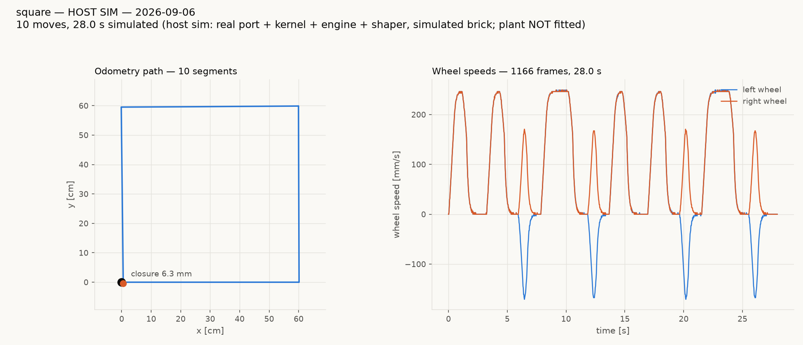
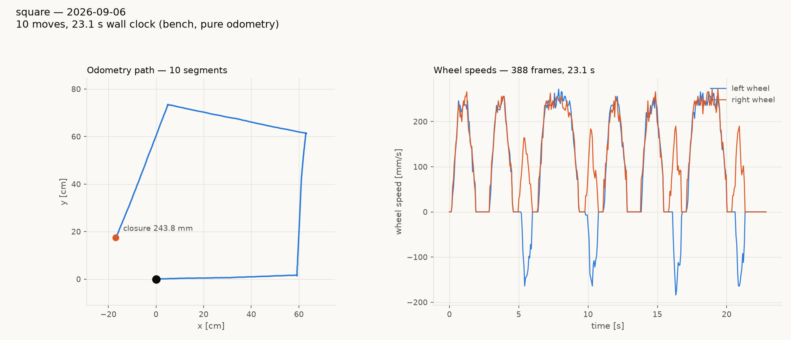

# Square tour — tovez hardware vs host sim, 2026-09-06

Both sides drive the SAME file, `tests/system/tours/square.tour`, and
both charts come from the same function (`run_tour.py::chart`), so the
figures differ only in what produced the trace.

Hardware is **tovez** on the playfield, firmware **1.20260906.4** —
HEAD plus the arrival-predicate fix this session produced. (That stamp
was the working-tree build the measurements below were taken on; the
same `src/` was committed as **1.20260906.5** so the fix is
distinguishable on the wire from HEAD's unfixed `.4`, and tovez was
reflashed with it.) Sim is the
host tier (real port + kernel + engine + shaper over a simulated Nezha
brick), parameterised from tovez's own `GET` dump.

---

## Host sim



Closure **6.3 mm**; legs 300.7 / 300.7 / 598.9 mm against 300 / 300 /
600; pivots +90.19, +90.27, +90.34, +90.04 against +90.

## tovez hardware



Odometry closure **243.8 mm**; camera-truthed closure **105.3 mm**;
physical net rotation **+343.85 deg** against a commanded +360.

The sim closes 17x tighter, and the gap is real physics the model does
not carry — not a firmware discrepancy. What the session established
about that gap is below.

---

## 1. The merge introduced an arrival-predicate regression — FIXED

`974b52b` changed `src/motion/velocity_shaper.cpp` so that, whenever
`lag > 0`, the one-tick pipeline term used the wheel's MEASURED speed
instead of the COMMANDED one, in both the braking budget and the
arrival predicate:

```c
remain <= (lim.lag > 0.0f ? vAct : vNext) * dt + vAct * lim.lag + lim.stopDistance
```

`vAct` leads the falling command while decelerating, so this inflates
the arrival threshold and the move ends before the wheels have covered
the commanded arc.

MEASURED tovez 2026-09-06, in-place 90 deg pivots, interleaved, n=4 per
arm (`pivot-cruise-ab.json`, `pivot-cruise-ab-PREMERGE.json`,
`pivot-cruise-ab-FIXED.json`), ODOMETRY error per pivot:

| build | cruise 100 | cruise 188 |
|---|---|---|
| pre-merge `1.20260906.900` (`4859d5b`) | -4.47 deg | -6.91 deg |
| as merged `1.20260906.3` | -7.14 deg | **-8.75 deg** |
| **fixed `1.20260906.4`** | -4.78 deg | **-7.05 deg** |

The fix restores pre-merge behaviour to within 0.3 deg at both cruises.

**Why it survived review.** The `lag > 0` guard left every host test
bit-identical, because `MotionLimits`' default lag is 0. The host sim
could not show it either: its plant IS a first-order lag with `tau`
equal to the configured `lag`, so the extra coast that form assumes is
delivered by construction — the sim scored 4.8-17.0 mm closure on the
buggy form versus 21.9-28.7 mm on the correct one. And the merge's own
validation (`captures/vevov-motion-20260906/notes.md`) was run on vevov
**wheels up** at **lag 0.04**, with — in its own words — "no baseline
firmware tour recorded in this session".

Now pinned by
`tests/host/test_velocity_shaper.py::test_lagged_arrival_is_not_advanced_by_the_pipeline_term`,
which runs at `lag > 0` (it cannot see the bug otherwise) and was
verified to FAIL on the merged form before being kept.

## 2. Do NOT bake lag 0.04 on tovez

The obvious next move — copy vevov's lag 0.04 — is wrong here, and the
camera is what says so. 2x2 lag x cruise on the fixed firmware, n=3 per
cell (`pivot-lag-cruise-2x2-FIXED.json`):

| | odometry error | camera (physical) |
|---|---|---|
| lag 0.13, cruise 100 | -5.72 deg | **-1.58 deg** |
| lag 0.04, cruise 100 | -1.00 deg | **+5.86 deg** |
| lag 0.13, cruise 188 | -7.23 deg | **-2.02 deg** |
| lag 0.04, cruise 188 | -0.82 deg | **+5.02 deg** |

tovez's encoders under-read rotation and `rotational_slip 0.962`
compensates; the two errors cancel. lag 0.04 fixes the odometry and
BREAKS the physics, over-rotating ~6 deg per corner. **lag 0.13 is
correct for this robot** and nothing was baked.

## 3. The tour's remaining error is in the LEGS, not the pivots

Physical net shortfall over the tour is -16.15 deg. Isolated pivots at
this exact config measure **-2.02 deg** by camera, so:

| source | physical contribution |
|---|---|
| 4 pivots x -2.02 deg | **-8.08 deg** |
| 6 straight legs | **-8.07 deg** |

Half the rotation error is injected during the STRAIGHTS, and it is
entirely encoder-invisible — the robot's own odometry attributes just
**+0.89 deg** to all six legs combined. `lexc`, `wrng` and `cycovr` were
zero throughout; `i2cf` rose 56 (a breakaway counter, not bus health).

This independently reproduces the finding already recorded in
`.claude/rules/playfield-testing.md` from vevov, 2026-08-25: "rotation
is the error budget, but the pivots are not where it comes from ... the
remaining ~+7 deg must be injected during the straight LEGS." Splitting
it further needs per-boundary camera fixes AT REST, which this session
did not run.

---

## Hypotheses tested and WRONG — do not re-run these

1. **`SET twist_hold_gain 8`** (the tour's stale SET block). Cost a full
   second tour to disprove: mean pivot +81.11 deg at gain 8 vs +82.05 at
   gain 4. No effect.
2. **`TLM FULL` during the tour.** 8 in-place pivots, interleaved
   off/on (`pivot-tlm-ab.json`): -2.09 deg vs -2.87 deg mean, against
   ~6 deg of scatter within each arm. No effect.
3. **Back-to-back moves / the port's 100 ms reversal dwell.** Free sim
   sweep at `settle_ticks` 16 / 8 / 2: pivots stayed +90.0 to +90.3 deg,
   closure 6.3 / 14.9 / 5.4 mm. No sensitivity.
4. **Battery state.** Proposed in an earlier draft of this document with
   no evidence behind it and REJECTED by the stakeholder. It was a guess
   dressed as a finding; the real cause was in the code.

## Artifact provenance

`pivot-lag-cruise-2x2-FIXED.json` is the script's own output. The other
four pivot files (`pivot-lag-ab.json`, `pivot-cruise-ab*.json`) are
RECONSTRUCTED from the per-pivot rows each script printed at run time:
the scripts shared one output path and each run overwrote the last,
which was noticed only at commit. Every value is exactly as printed --
nothing re-measured, nothing inferred -- and each file says so in its
`_note`. The printed tables are also quoted verbatim above.

## Session log

- tovez flashed HEAD, then the pre-merge probe build, then the fix
  (three flashes; one routine CTRL-AP mass-erase recovery).
- `calibrate.py dance` PASSED before any tour: +88.2 / -175.8 / +87.7,
  drives 19.2 / 39.1 / 19.1 cm, home to 3.7 cm.
- Run 0 VOID — a cat on the table displaced the robot mid-tour, kept in
  `discarded/` as a worked example (odometry 167.0 mm closure while the
  camera measured 406.5 mm and -49.50 deg).
- Two tours on the merged firmware walked into the west rail. Those are
  the regression in section 1, and are not cited as measurements.

## Stale tour file (unfixed)

`tests/system/tours/square.tour` still issues `SET speed_floor 512`,
`SET yaw_taper 800` and `SET pivot_overrun 2.0` — all RETIRED ordinals
(`src/comms/config_fields.h`). The robot answers `err` and keeps its
defaults, so they are silent no-ops, but the file's pivot-tuning header
describes knobs that no longer exist.
