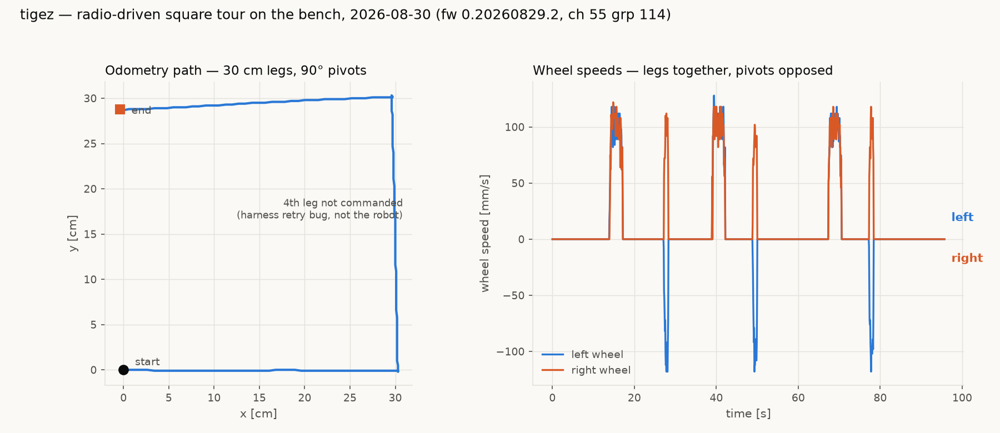
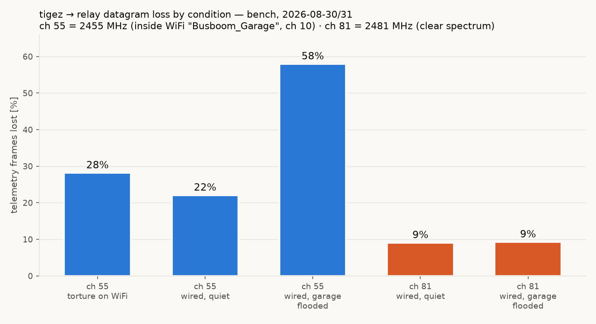

# tigez — radio-driven square tour on the bench (2026-08-30, evening)

First radio-driven tour on tigez, and the demonstration that the
day-long wedge saga is closed for driving purposes: **six clean
segments, zero faults, with full telemetry streaming over the radio
the entire time** — the exact traffic pattern that killed the board on
master firmware all afternoon.

## Setup

- tigez on the bench at farm node magni, Nezha brick powered, wheels up.
- Firmware: the v0.20260829.3 build (`ver 0.20260829.2`), channel 55
  group 114 (name-derived; `radio-robot-lib/config/robots/tigez.json`).
- Driven over the torture relay pool (192.168.1.12:8760) with v6 wire
  `MOVE_X` commands: 4 × (300 mm leg @100 mm/s + 90° pivot), command
  sent then radio held mostly quiet during each segment, `STATUS`
  between segments.
- Telemetry: `TLM FULL` for the whole tour; the chart's data is the
  **lossless USB serial tap** on magni (1559 `t` frames over 95.7 s),
  captured concurrently with the radio drive.

## What the chart shows

- **Path panel:** wheels-up odometry draws three crisp 30 cm legs with
  square corners. The missing 4th leg is a harness defect, not a robot
  one: the tour driver retried "lost" commands with a FRESH sequence id
  instead of reusing the original (violating the wire rule in
  `.claude/rules/playfield-testing.md`), so one leg was skipped and two
  segments double-ran. The robot executed every command it received
  (`done` reached 8).
- **Wheel panel:** legs show both wheels at +100 mm/s in lockstep;
  pivots show clean equal-and-opposite pairs; trapezoidal
  accelerations; no stalls, no end-of-move bumps at this speed.

## Why this matters

Master firmware (1.20260829.1) hard-faults within one or two radio
commands during motion — the whole day's forensic record is in
`clasi/issues/fw-1-20260829-1-wedges-on-radio-traffic-during-motion.md`
and `captures/tigez-cal-20260830/`. This tour is the positive control:
the same robot, bench, relay, and traffic on the previous firmware
tag drives indefinitely. The fleet keeps v0.20260829.3 for driving
until the master regression is fixed (leading candidate: eager Rig
allocation at boot, so radio buffer churn cannot land on it).

Harness note for the calibration tooling: retries of sequenced verbs
MUST reuse the original `#id` (`tools/robotlink.py` already does this;
tonight's ad-hoc tour script did not).

## Addendum (same night, ~21:00-22:00): where the radio telemetry loss is

The stakeholder rejected the field charts as "losing a lot of data" and
sent tigez back to the bench to find out why. All artifacts are in
`captures/tigez-cal-20260830/` (bench3/losslen/tworx/txcount/dbglisten/
ch81/wificorr .json), MEASURED tigez on meili + torture relay pool,
2026-08-30 evening. The chart above's clean twin from this pass is
`tigez-bench-square-20260830/square-tour-tap.png` (dual-capture tour:
radio-driven, USB tap concurrent).

The chain of experiments, each killing one hypothesis:

1. **USB tap vs radio, same tour** (`bench3.json`): tap received
   943/943 frames (0.0% loss, seq-gap audit); the radio path lost
   28.2%. Field loss the same night was 29.3% (`fieldtour4.json`).
   The loss is in the radio path, not the robot's emitter.
2. **Line length** (`losslen.json`): TLM POSE (~45 chars) lost 30.1%,
   TLM FULL (~75 chars) 28.8%. Length-independent -> not serial
   forwarding time, not on-air corruption probability.
3. **Two relays at once** (`tworx.json`, pool banners confirm guvov +
   getez): both missed the SAME frames (passive set a strict subset,
   joint P 0.71 vs 0.52 if independent). The frames never reached the
   relay desk.
4. **Robot TX counters** (`txcount.json`, scratch diagnostic build,
   patch in `radio-txcount-diagnostic.patch`): 854 sends, every one
   returned DEVICE_OK from CODAL's synchronous send (waits for
   EVENTS_END, i.e. the packet physically radiated), zero re-entrancy
   guard trips. The robot transmits 100%, at kTransmitPower=7 (max).
5. **Relay `!DEBUG ON` RSSI** (`dbglisten.json`): arriving frames are
   STRONG, median -58 dBm, and none garbled. 21.7% of datagrams
   (transport-seq audit) simply never produce an RX event.
6. **Channel test** (`ch81.json`, scratch build forcing ch 81 =
   2481 MHz): loss drops 25.6% -> 17.2%. Better above the WiFi band,
   but not cured.
7. **WiFi correlation** (`wificorr.json`): torture has NO wired
   network -- `wlp2s0` at 2.432 GHz, 17 dBm, carries every relay's
   TCP stream; the mesh AP sits at -11 dBm (on the desk). Per-frame
   loss vs WiFi byte rate, 90 s, 1614 frames: quietest quartile
   16.8% -> busiest 26.7%, monotonic.

**Conclusion: the loss is receiver-site RF interference at the torture
relay desk.** Two strong 2.4 GHz transmitters (torture's own WiFi
uplink and the mesh AP) sit centimetres from the relay micro:bits;
every WiFi burst blinds them. The loop is self-inflicting: forwarding
a received frame over WiFi is itself the burst that kills the next
frame -- which is why loss is anti-correlated frame-to-frame
(P(lost|prev lost) 22.9% vs P(lost|prev received) 30.4%, bench3).

Remedies, in order of expected effect (hardware ones are the
stakeholder's call):

1. Put torture on Ethernet -- `enp1s0` is UP with no IPv4; a cable
   and a DHCP lease remove the 17 dBm transmitter entirely.
2. Move the relay micro:bits (USB extension) a few metres from the
   mesh node.
3. Shift the fleet channel plan above the WiFi band (78-83): worth
   ~8 points, measured.
4. Robot TX power is already at maximum; nothing to gain there.

For charts meanwhile: bench data comes off the USB tap (lossless);
field runs accept the loss and lean on camera fixes for truth.

### Second addendum (2026-08-31, after the stakeholder wired torture)

With torture on Ethernet (enp1s0 = 192.168.1.12, wlp2s0 idle — 1 kB
TX across a full test) the ch 55 loss fell to **22.1%** and the
frame-to-frame anti-correlation vanished (21.2%/22.3%), confirming
the self-inflicted forward-burst mechanism and eliminating it.

The remaining jammer is **in-channel WiFi**: the farm Pis associate to
`Busboom_Garage` at **2457 MHz (WiFi ch 10, 2447-2467)**, which covers
micro:bit ch 47/55 — the fleet's whole 2425-2473 channel map sits
inside the two house networks. MEASURED (`floodtest.json`,
`ch81wired.json`, tigez bench 2026-08-31 ~00:30):

| condition | loss |
|---|---|
| ch 55, torture on WiFi | 25.6-30% |
| ch 55, wired, quiet | 22.1% |
| ch 55, wired, garage flooded via meili | **58.0%** |
| ch 81 (2481 MHz), wired, quiet | **9.1%** |
| ch 81, wired, garage flooded | **9.3%** (immune) |

So: the wire fixed the self-jamming; a fleet channel move to
**micro:bit 76-83 (2476-2483)** fixes the garage-band jamming and is
immune to the rig's own tap/camera traffic; the last ~9% is desk-local
(mesh AP at -11 dBm, BLE at 2480) and yields to physically moving the
relays. Fleet channel remap tracked in
`clasi/issues/radio-telemetry-loss-is-wifi-interference-at-the-relay-site.md`.
