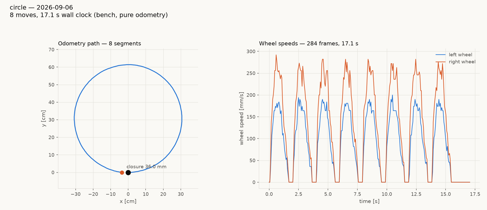

# tigez circle tour, bench, unbaked firmware — 36.0 mm closure

The circle tour run the same way as yesterday's square
(`../tigez-square-20260906/`): tigez on the bench, wheels up, pure
odometry, `tests/system/run_tour.py` over a local `mbdeploy serve`
serial daemon (the board is on this Mac's USB, not a farm node).
`tests/system/tours/circle.tour`: r = 300 mm, eight 45 deg arcs
(`TWIST vx=250 omega=47.75 angle=45`, each one `MOVE_X 236 785 250`),
CCW, one `--warmup 1` pivot before the mark as the kernel kick.

The tour's stale `SET` block (`twist_hold_gain 8`, plus three retired
ordinals) was dropped first, for the same reason square.tour's was on
2026-09-06: a tour benchmarks the firmware's defaults.



MEASURED tigez 2026-09-06, `circle-bench.json` (284 telemetry frames,
17.1 s wall clock):

| | |
|---|---|
| closure | **36.0 mm** |
| net rotation | **+352.7 deg** (ideal 360) |
| per-arc rotation | 44.21 / 44.14 / 44.21 / 44.40 / 43.91 / 43.91 / 44.10 / 43.80 deg, mean **44.09** (−0.91 deg per arc) |
| per-arc chord | 230.3–231.8 mm (ideal 229.6, +0.6%) |
| fitted radius | 307.2 mm (ideal 300, +2.4%) |
| arc duration | 1.62–1.66 s each |
| wheel speeds | left ≈ 125 mm/s, right ≈ 188 mm/s mean over the arc; peaks 184–200 / 272–292; ratio 0.65–0.68 (ideal 0.680 for b = 114.4 mm) |

Every arc comes out the same: 0.9 deg short of 45 while its chord is
1–2 mm long. The rotation deficit alone (7.3 deg on a 307 mm radius,
307 × 0.127 = 39 mm) accounts for the closure, so the circle is
slightly too big and does not quite come round, rather than being
lopsided. Compare the square on the same board the day before: pivots
over-rotate +0.35 deg, closure 13.0 mm. Arcs and pivots miss in
opposite directions.

For scale, gopiv on the pre-029 engine on 2026-09-01 closed this same
tour at 36.0 mm (`tests/system/DESIGN.md`), by coincidence the same
number.

## Firmware caveat — this is NOT the 1.20260906.7 bake

`ID` answered `id diffdrive unbaked unbaked tigez` and `VER` answered
`ver unbaked`: the hex on the board did not come through
`tools/make_deploy.py` (its `_inject_version()` docstring names the
`unbaked` placeholder as exactly that signature). The live config
confirms it: `GET rotational_slip` = 0.952 (the firmware default;
tigez's bake is 0.9617), `GET twist_hold_gain` = 4.0, `GET
default_cruise` = 150, and `GET lag_s` answers `err 1`. Yesterday's
square (13.0 mm) ran on the baked `1.20260906.7` with `lag_s 0.05`,
`slip 0.9617`. Who flashed the unbaked build, and from what source, is
not recorded anywhere I could find; the board was on farm node hodr
for the square and is on the desk USB now. `git diff ce3445d~1..HEAD
-- src test` is empty, so a `make_deploy.py --robot tigez --flash`
from HEAD would reproduce the .7 bake exactly.

So the two numbers (13.0 mm square, 36.0 mm circle) are not the same
firmware and the comparison is not clean. The per-arc deficit is worth
re-measuring on the bake before anything is tuned from it.

## How it was run

```
mbdeploy serve --base-port 40100 --bind 127.0.0.1 --no-flash   # background
uv run --with numpy --with matplotlib python tests/system/run_tour.py \
    tests/system/tours/circle.tour --host 127.0.0.1 --port 40100 \
    --warmup 1 --out reports/tigez-circle-20260906/circle-bench.png --open
```

The daemon opens the USB port lazily on each TCP connect, and the open
RESETS the board: a command sent inside the first ~3 s after connecting
gets no reply at all (measured here twice before waiting 5 s fixed it).
`run_tour.py`'s HELLO retries cover it; a hand probe must sleep first.
