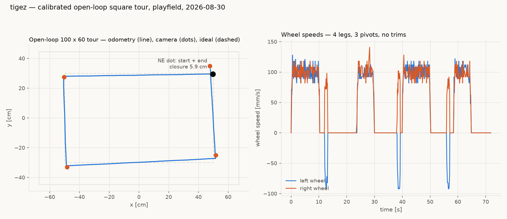
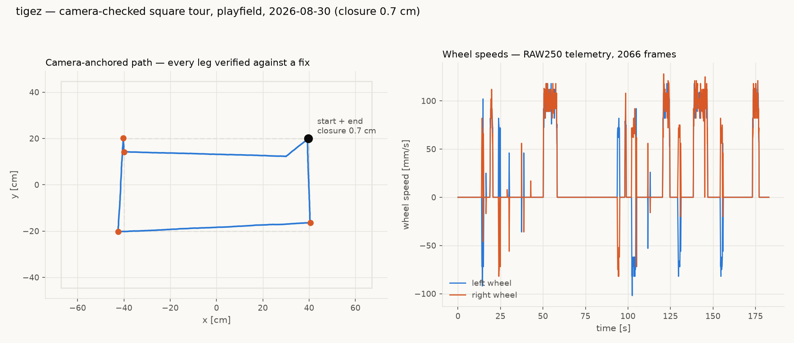

# tigez — first calibrated square tour on the playfield (2026-08-30, night)

The calibration-acceptance tour from the stakeholder's scheme, step 6:
park on the NE orange dot, run the 100 x 60 orange-dots rectangle
fully open-loop (camera records, never corrects), score by closure.

## Result

- **Closure 5.9 cm** over the 320 cm path (1.8%), all four legs full
  length. An earlier attempt with mid-tour heading trims closed at
  1.3 cm but shortened two legs; this run is the honest open-loop one.
- Camera corner fixes sit 0.6 / 1.9 / 3.2 / 6.6 cm from the odometry
  path at the four corners — drift grows with accumulated heading
  variance, not travel error.
- Turn bias is essentially gone: net rotation across the three pivots
  measured +0.9% (slip 0.990 on fw 0.20260829.2). What remains is
  **per-pivot variance of +-3-4 deg** — the cold-pivot/breakaway noise
  the vevov work addresses with warm-ups and `pivot_overrun`; tigez has
  no overrun tuning yet.
- Park quality: the calibrated camera+mount puts the robot **0.4 cm**
  from a commanded point.

Calibration values and method: `reports/tigez-calibration-20260830.md`.
Raw data: `captures/tigez-cal-20260830/cal.jsonl` + `fieldtour2.json`
(session scratchpad, frames embedded in the report data).

## Camera-checked tour (later the same night)

After the open-loop run drifted the chassis into the rails (in-bounds
coordinates, ~20 cm of robot body — the tour rectangle plus drift left
no physical margin), the stakeholder directed a per-leg camera check.
Rerun as an 80 x 40 centred rectangle: camera fix after every leg,
face-to-cardinal trim, and a correction move when the fix missed the
corner by more than tolerance.

- **Closure 0.71 cm.** Leg 1 drifted 5.8 cm; the camera check caught
  and corrected it (the jog in the path). Legs 2-4 landed 0.9-3.6 cm
  out and were trimmed at the corners.
- Rails cleared by >= 15 cm the whole run.
- 2066 telemetry frames over the relay (RAW250 data plane).
  MEASURED tigez 2026-08-30, `fieldtour4.json` (session scratchpad):
  seq-gap accounting shows **29.3% of emitted frames were lost on the
  radio hop** (855 of ~2921; uniform at rest vs moving). The ragged
  wheel-speed panel in earlier drafts was radio loss plus dozens of
  short trim moves, not wheel behaviour. Bench follow-up the same
  night (`reports/tigez-bench-square-tour-20260830.md` addendum)
  reproduced 28-29% loss on the bench against a 0%-loss USB tap and
  localized it robot/TX-side via a two-relay experiment.

## Telemetry decode note (worth keeping)

TLM FULL `x`/`y` are **mm in the boot-anchored odometry frame**
(right-handed; the frame's x-axis is wherever the robot faced at boot)
and `h` is **cumulative centi-degrees** (unwrapped, e.g. 115041 =
1150.41 deg since boot). Align to world by rotating by
(world heading - h mod 360) about the first sample - no mirroring.
