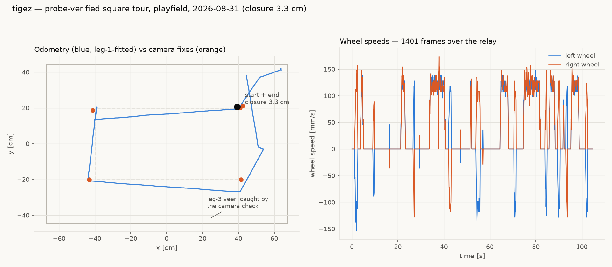
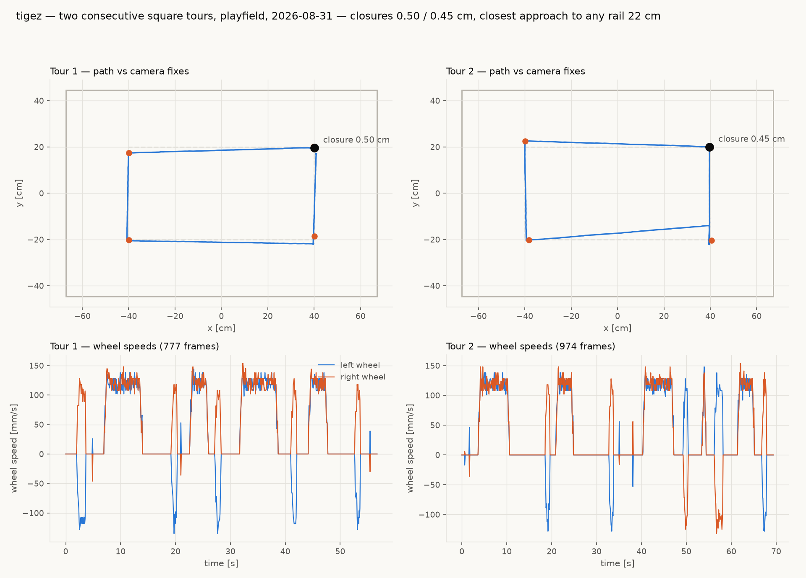

# tigez — probe-verified square tour, playfield (2026-08-31)

## Addressing verification (the stakeholder's ask)

Four independent implementations agree tigez is on **channel 55,
group 114**:

| implementation | answer |
|---|---|
| relay server registry default (`mbrelay.naming.name_to_radio`, commit 4305796) | (55, 114) |
| relay firmware `!N tigez` (relay getez) | 55 / 114 |
| the robot itself | `id diffdrive tigez` on 55/114, 4/4 PING |
| negative control `!CG 4 10` | silent, 0/3 |

Note: the new registry feature (`mbrelay names`, override API) is in
the repo but **not yet deployed** on torture — the installed daemon
(0.20260826.9-old) predates it. Deploy = install the freshly built
wheel (`server/dist/microbit_relayd-0.20260826.9-py3-none-any.whl`,
which does contain `registry.py`) and restart `mbrelay.service`.
The wheel version was NOT bumped with the feature — worth fixing
before it confuses provenance.

## The rails incident, and the fix

The first tour attempt drove tigez into the NE rails. Cause, settled
after the stakeholder's correction ("the tags are removable, and it's
possible to get them on backwards... the tag on tigez is currently
correct"): **the tag had been remounted between sessions** — it sat
rotated ~90° on 2026-08-30 (the 9-pose solve faithfully measured
+91.15° for that mounting, and the harness offset compensated, so
tours closed at 0.71 cm), and went back on CORRECTLY when the robot
moved bench → field. The harness then inherited the stale convention;
a goto loop iterating a ~90°-wrong heading model walks the robot AWAY
from its target. The camera daemon changed nothing — an earlier draft
of this report blamed a "silent yaw flip" and was wrong.

Confirmations, all from data (`fieldtour5.log.jsonl`, live get_tag):

- Probe-fitted offset today: −179.2° — exactly a correctly-mounted
  tag (aprilcam's tag yaw measures the tag's x-axis = paper-right,
  90° off paper-top; verified from world_corners: paper-right points
  north while the robot faces west, i.e. paper-top = robot front).
- Every other robot's registration is ≈ −90° — the value a CORRECT
  mounting needs to cancel the paper-right convention. tigez's
  +91.15° was the signature of the sideways mounting, not an error
  in the solve.
- Re-registered −89.65° (= −1.5647 rad): get_tag then reads
  yaw 178.7° with the robot at a known ~179°, and a 180° pivot-wobble
  test holds the centre to 0.50 cm.
- `register_tag` is documented **in-memory, per-session** — "never
  assume a previous session's registration is still there." The
  harness must re-register AND probe-fit at every session start.

Suggestion for aprilcam (its repo's call): define tag yaw as
paper-top instead of paper-right, and every registration becomes the
physically intuitive 0° (front) or 180° (back) instead of ±90°.

Countermeasures now in the tour harness (`fieldtour6.py`):

1. **Probe first, inherit nothing**: face open field, drive 12 cm,
   fit the yaw→heading offset from what the camera measured.
2. **Guarded drives**: any leg whose camera-measured bearing deviates
   more than 25° from commanded → STOP and abort the session.

## Tour result

80×40 cm rectangle, camera fix + trim at every corner, correction
move when a fix missed by > 4 cm:

- **Closure 3.34 cm.** Park landed 1.1 cm from the corner.
- Leg misses: 6.5 (corrected), 3.2, **27.0 (corrected)**, 0.9 cm.
- Leg 3 veered ~16° south across its 85 cm — heading walked ~10°
  during the leg (yaw −181.6° → −191.1°) — and its end fix came
  within ~3 cm of the south limit before the camera check caught it.
  Same family as the known "rotation is injected by the legs" issue;
  the guard threshold (25°) held but this is the margin-eater to fix
  next (warm-up state / load asymmetry candidate).
- 1401 TLM frames over the relay; wheel-speed panel shows clean legs
  and pivots throughout.

Raw data: `fieldtour6.json` + `fieldtour6.log.jsonl` (copied to
`captures/tigez-cal-20260830/`).

## Two consecutive tours under the full protocol (later, same day)

With the corrected tag registration, the session protocol
(re-register → warm-up → probe → guarded legs → per-leg fixes) and a
harness fix — move completion is now `done >= id` from STATUS, because
polling `active=0` races the motor start (a 12 cm probe "completed" in
0.1 s and got a mid-flight camera fix; the probe guard caught it and
refused to tour):

| | tour 1 | tour 2 |
|---|---|---|
| probe fit | −1.6° (expect ≈0 — registration verified at runtime) | — |
| park error | 0.4 cm | 0.3 cm |
| leg misses | 2.6 / 0.3 / 1.4 / 0.4 cm (no corrections) | 2.6 / 1.7 / 7.6 (corrected) / 0.2 cm |
| **closure** | **0.50 cm** | **0.45 cm** |
| closest rail approach | ≥ 22 cm both tours | |

Best closures measured on tigez to date (previous best 0.71 cm,
2026-08-30). The recurring soft spot is the long east leg (leg 3) —
it produced the 27 cm veer earlier and tour 2's 7.6 cm miss; heading
drifts during that leg specifically. Candidate next investigation:
carpet grain / drive direction asymmetry, or warm-state — needs a
camera-truthed repeat of that leg in isolation.

Raw data: `fieldtour7.json` + `fieldtour7.log.jsonl` in
`captures/tigez-cal-20260830/`.
