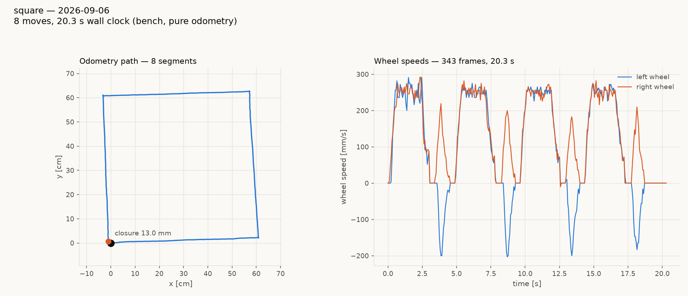

# tigez square tour, bench, firmware 1.20260906.7 — no retune

Transfer check for the floor-relative arrival credit (`42bd5be`,
design S6.3). tigez on farm node hodr, wheels up, pure odometry,
flashed from `1.20260904.4` (the sprint-029 build) to `.7` with its
EXISTING bake untouched: `lag_s 0.05`, `rotational_slip 0.9617`,
`stop_distance 0`. `tests/system/tours/square.tour` (four 600 mm legs,
four 90 deg pivots at 180 deg/s).

| | |
|---|---|
| closure | **13.0 mm** |
| pivots (odometry) | +90.54 / +90.77 / +90.25 / +89.83, mean **+90.35** |
| legs | 602 / 602 / 602 / 603 mm |
| net rotation | +360.56 deg |
| `lexc` / `wrng` / `cycovr` | 0 / 0 / 0 |

Predicted before the run from tovez's bench sweep on the fixed credit
(`../square-hw-vs-sim-20260906/bench-demo/lag-sweep-bench-FLOORCREDIT.json`):
a lag-0.05 board would over-rotate ~+1 deg per pivot untuned. Measured
+0.35 deg. tigez does not need a retune; its 2026-09-04 `lag 0.05` was
already the value that centred pivots under the old credit, so removing
that credit moved it very little. tovez, baked at the raw step-response
`lag 0.13`, was the board that needed one (`../tovez-retune-20260906/`).

Same day, same tour, for scale: tovez on the merged firmware, bench,
387 mm; tovez after the fix, bench, 11.0 mm; tovez retuned, on the
field, 7.2 mm odometry / 16.4 mm camera.
