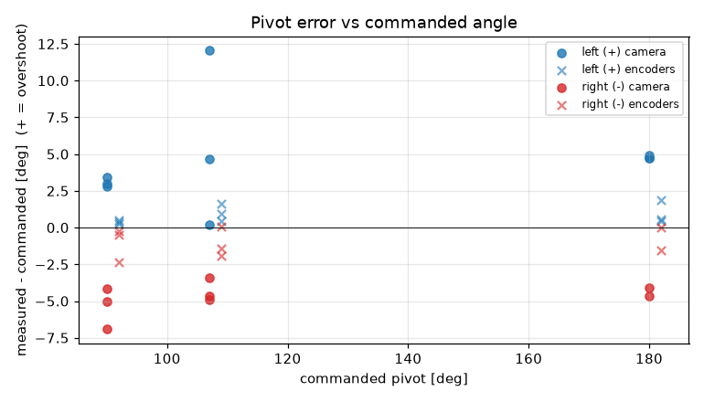
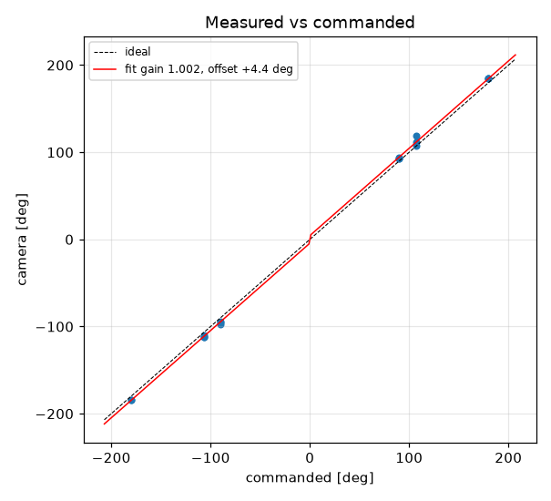
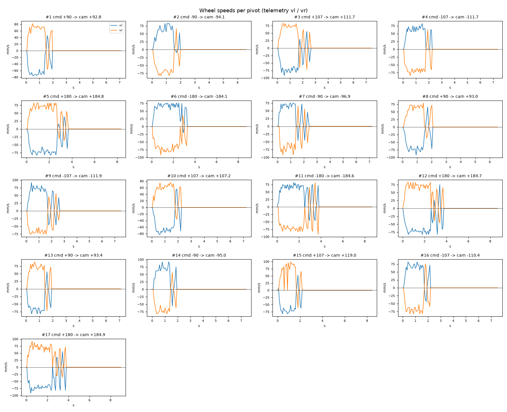

# Turn calibration -- tigez -- 01-baseline

17 camera-scored pivots at cruise 60 mm/s, rotational_slip 0.952, pivot_overrun 0.0 mm (b_eff 119.96 mm).

| commanded | n | mean error [deg] | min | max |
|---|---|---|---|---|
| +90 | 3 | +3.06 | +2.8 | +3.4 |
| +107 | 3 | +5.63 | +0.2 | +12.1 |
| +180 | 3 | +4.79 | +4.7 | +4.9 |
| -90 | 3 | -5.35 | -6.9 | -4.1 |
| -107 | 3 | -4.34 | -4.9 | -3.4 |
| -180 | 2 | -4.37 | -4.6 | -4.1 |

Fit: camera = **1.0019** x commanded **+4.37** deg; mean |error| 4.6 deg; left mean 4.49, right mean -4.73; mean centre drift 0.33 cm.

Suggested: `SET rotational_slip 0.9538`, `SET pivot_overrun 4.58` (camera = gain*cmd + offset; slip_new = slip*gain; overrun_new = overrun + offset_rad*b_eff/2).

| # | cmd | camera | err | encoder err | drift cm | peak vl | peak vr | dur s | reason |
|---|---|---|---|---|---|---|---|---|---|
| 1 | +90 | +92.8 | +2.8 | +0.3 | 0.1 | 75 | 82 | 1.8 | stop |
| 2 | -90 | -94.1 | -4.1 | -0.5 | 0.4 | 82 | 82 | 1.8 | stop |
| 3 | +107 | +111.7 | +4.7 | +1.6 | 0.1 | 92 | 82 | 2.4 | stop |
| 4 | -107 | -111.7 | -4.7 | +0.1 | 0.6 | 82 | 84 | 2.1 | stop |
| 5 | +180 | +184.8 | +4.8 | +0.4 | 0.2 | 82 | 82 | 3.5 | stop |
| 6 | -180 | -184.1 | -4.1 | -0.0 | 0.3 | 76 | 92 | 3.1 | stop |
| 7 | -90 | -96.9 | -6.9 | -2.4 | 0.1 | 75 | 92 | 2.2 | stop |
| 8 | +90 | +93.0 | +3.0 | +0.5 | 0.7 | 92 | 79 | 1.9 | stop |
| 9 | -107 | -111.9 | -4.9 | -1.9 | 0.3 | 92 | 76 | 2.5 | stop |
| 10 | +107 | +107.2 | +0.2 | +0.4 | 0.6 | 82 | 76 | 2.1 | stop |
| 11 | -180 | -184.6 | -4.6 | -1.6 | 0.4 | 82 | 92 | 3.7 | stop |
| 12 | +180 | +184.7 | +4.7 | +0.5 | 0.6 | 82 | 82 | 3.6 | stop |
| 13 | +90 | +93.4 | +3.4 | +0.4 | 0.1 | 82 | 89 | 1.7 | stop |
| 14 | -90 | -95.0 | -5.0 | -0.3 | 0.1 | 92 | 82 | 1.7 | stop |
| 15 | +107 | +119.0 | +12.1 | +1.0 | 0.7 | 82 | 99 | 2.0 | stop |
| 16 | -107 | -110.4 | -3.4 | -1.4 | 0.1 | 82 | 82 | 2.0 | stop |
| 17 | +180 | +184.9 | +4.9 | +1.9 | 0.2 | 92 | 92 | 3.6 | stop |
