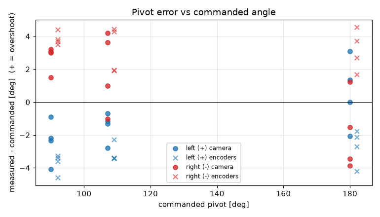
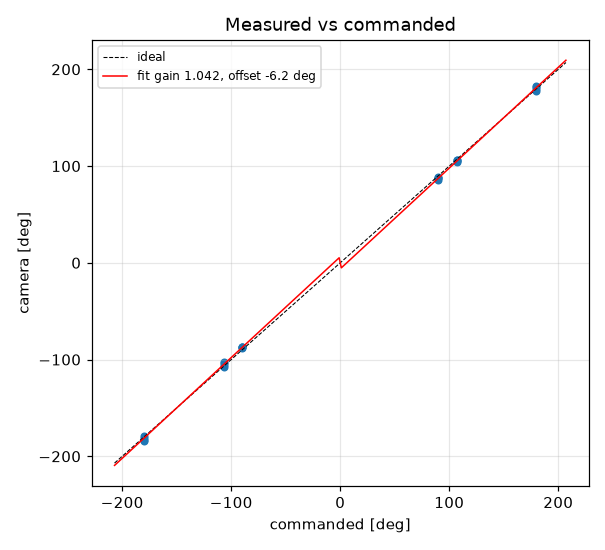
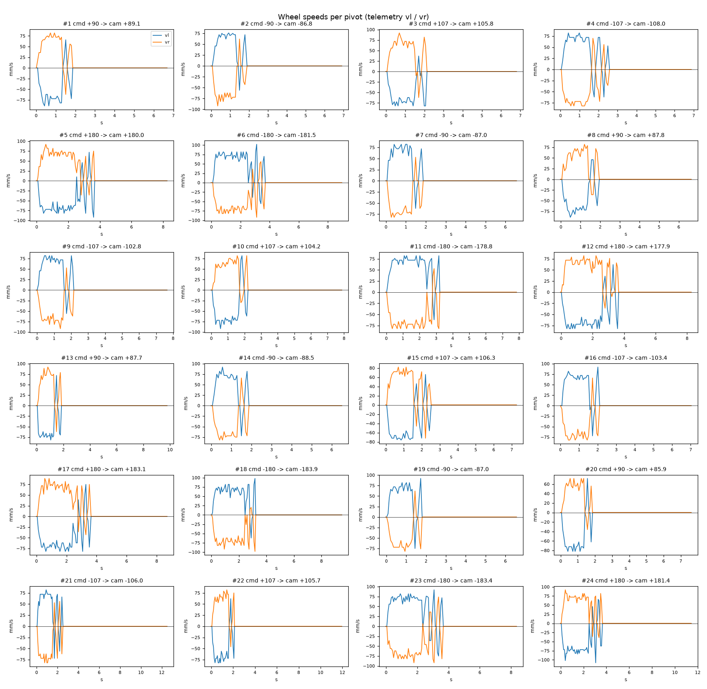

# Turn calibration -- tigez -- 02-verify-overrun

24 camera-scored pivots at cruise 60 mm/s, rotational_slip 0.954, pivot_overrun 4.58 mm (b_eff 119.71 mm).

| commanded | n | mean error [deg] | min | max |
|---|---|---|---|---|
| +90 | 4 | -2.38 | -4.1 | -0.9 |
| +107 | 4 | -1.49 | -2.8 | -0.7 |
| +180 | 4 | +0.60 | -2.1 | +3.1 |
| -90 | 4 | +2.69 | +1.5 | +3.2 |
| -107 | 4 | +1.95 | -1.0 | +4.2 |
| -180 | 4 | -1.91 | -3.9 | +1.2 |

Fit: camera = **1.0417** x commanded **-6.24** deg; mean |error| 2.2 deg; left mean -1.09, right mean 0.91; mean centre drift 0.34 cm.

Suggested: `SET rotational_slip 0.9937`, `SET pivot_overrun 0.0` (camera = gain*cmd + offset; slip_new = slip*gain; overrun_new = overrun + offset_rad*b_eff/2).

| # | cmd | camera | err | encoder err | drift cm | peak vl | peak vr | dur s | reason |
|---|---|---|---|---|---|---|---|---|---|
| 1 | +90 | +89.1 | -0.9 | -3.6 | 0.1 | 89 | 82 | 1.7 | stop |
| 2 | -90 | -86.8 | +3.2 | +3.7 | 0.1 | 76 | 92 | 1.7 | stop |
| 3 | +107 | +105.8 | -1.2 | -3.4 | 0.1 | 82 | 92 | 1.9 | stop |
| 4 | -107 | -108.0 | -1.0 | +1.9 | 0.1 | 82 | 82 | 2.4 | stop |
| 5 | +180 | +180.0 | +0.0 | -2.7 | 0.2 | 92 | 92 | 3.5 | stop |
| 6 | -180 | -181.5 | -1.5 | +2.7 | 0.3 | 102 | 92 | 3.5 | stop |
| 7 | -90 | -87.0 | +3.0 | +3.8 | 0.2 | 82 | 82 | 1.7 | stop |
| 8 | +90 | +87.8 | -2.2 | -3.4 | 0.7 | 89 | 82 | 1.7 | stop |
| 9 | -107 | -102.8 | +4.2 | +4.4 | 0.4 | 82 | 92 | 2.0 | stop |
| 10 | +107 | +104.2 | -2.8 | -3.4 | 0.9 | 92 | 82 | 2.0 | stop |
| 11 | -180 | -178.8 | +1.2 | +3.7 | 0.6 | 82 | 82 | 3.1 | stop |
| 12 | +180 | +177.9 | -2.1 | -4.2 | 0.6 | 82 | 82 | 3.5 | stop |
| 13 | +90 | +87.7 | -2.3 | -3.3 | 0.2 | 82 | 92 | 1.6 | stop |
| 14 | -90 | -88.5 | +1.5 | +3.5 | 0.2 | 92 | 82 | 1.6 | stop |
| 15 | +107 | +106.3 | -0.7 | -2.3 | 0.2 | 76 | 82 | 2.3 | stop |
| 16 | -107 | -103.4 | +3.6 | +4.3 | 0.1 | 92 | 82 | 1.9 | stop |
| 17 | +180 | +183.1 | +3.1 | -1.8 | 0.0 | 82 | 89 | 3.4 | stop |
| 18 | -180 | -183.9 | -3.9 | +4.5 | 0.6 | 98 | 98 | 3.1 | stop |
| 19 | -90 | -87.0 | +3.0 | +4.4 | 0.2 | 92 | 82 | 1.6 | stop |
| 20 | +90 | +85.9 | -4.1 | -4.6 | 0.7 | 82 | 72 | 1.7 | stop |
| 21 | -107 | -106.0 | +1.0 | +1.9 | 0.4 | 82 | 82 | 2.3 | stop |
| 22 | +107 | +105.7 | -1.3 | -3.4 | 0.6 | 82 | 82 | 1.9 | stop |
| 23 | -180 | -183.4 | -3.5 | +1.7 | 0.3 | 92 | 92 | 3.5 | stop |
| 24 | +180 | +181.4 | +1.4 | -2.1 | 0.4 | 108 | 92 | 3.5 | stop |
