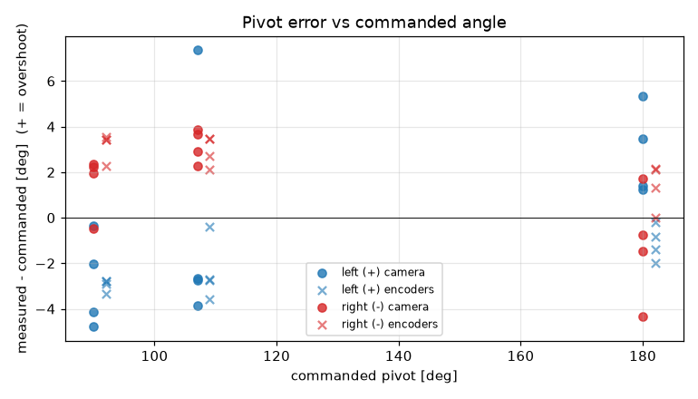
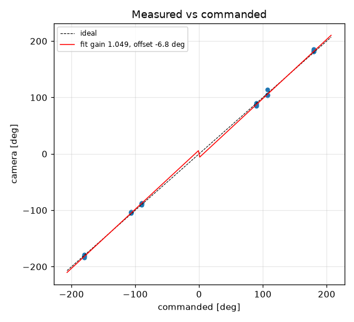
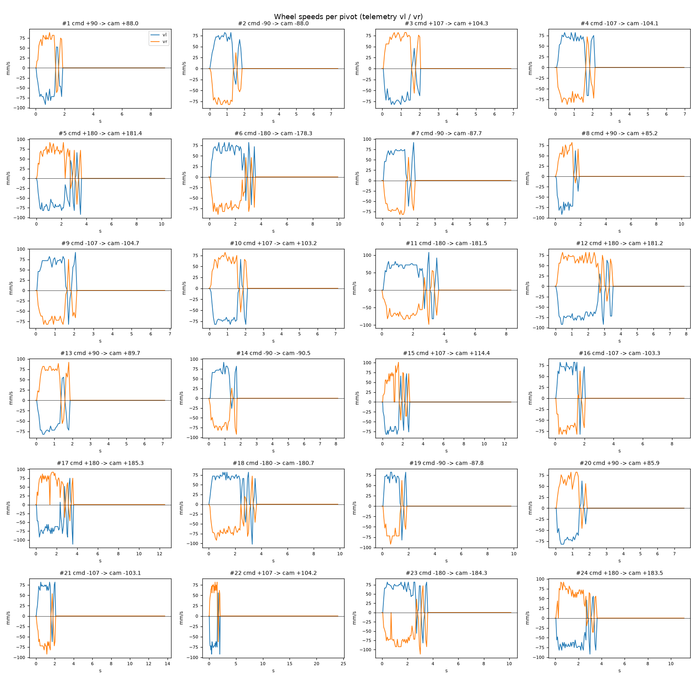

# Turn calibration -- tigez -- 03-tune

24 camera-scored pivots at cruise 60 mm/s, rotational_slip 0.965, pivot_overrun 3.5 mm (b_eff 118.34 mm).

| commanded | n | mean error [deg] | min | max |
|---|---|---|---|---|
| +90 | 4 | -2.82 | -4.8 | -0.3 |
| +107 | 4 | -0.47 | -3.8 | +7.4 |
| +180 | 4 | +2.86 | +1.2 | +5.3 |
| -90 | 4 | +1.52 | -0.5 | +2.3 |
| -107 | 4 | +3.18 | +2.3 | +3.9 |
| -180 | 4 | -1.21 | -4.3 | +1.7 |

Fit: camera = **1.0486** x commanded **-6.76** deg; mean |error| 2.81 deg; left mean -0.15, right mean 1.17; mean centre drift 0.35 cm.

Suggested: `SET rotational_slip 1.0119`, `SET pivot_overrun 0.0` (camera = gain*cmd + offset; slip_new = slip*gain; overrun_new = overrun + offset_rad*b_eff/2).

| # | cmd | camera | err | encoder err | drift cm | peak vl | peak vr | dur s | reason |
|---|---|---|---|---|---|---|---|---|---|
| 1 | +90 | +88.0 | -2.0 | -2.8 | 0.2 | 92 | 89 | 1.7 | stop |
| 2 | -90 | -88.0 | +2.0 | +3.4 | 0.1 | 82 | 82 | 1.7 | stop |
| 3 | +107 | +104.3 | -2.7 | -3.6 | 0.3 | 82 | 82 | 1.9 | stop |
| 4 | -107 | -104.1 | +2.9 | +3.5 | 0.2 | 82 | 87 | 1.9 | stop |
| 5 | +180 | +181.4 | +1.4 | -0.8 | 0.2 | 92 | 92 | 3.5 | stop |
| 6 | -180 | -178.3 | +1.7 | +2.1 | 0.3 | 82 | 89 | 3.4 | stop |
| 7 | -90 | -87.7 | +2.3 | +3.4 | 0.2 | 92 | 82 | 1.7 | stop |
| 8 | +90 | +85.2 | -4.8 | -2.9 | 0.7 | 92 | 82 | 1.7 | stop |
| 9 | -107 | -104.7 | +2.3 | +2.1 | 0.2 | 92 | 82 | 1.9 | stop |
| 10 | +107 | +103.2 | -3.8 | -2.8 | 0.5 | 82 | 82 | 1.9 | stop |
| 11 | -180 | -181.5 | -1.5 | +0.0 | 0.5 | 108 | 98 | 3.5 | stop |
| 12 | +180 | +181.2 | +1.2 | -2.0 | 0.4 | 92 | 82 | 3.4 | stop |
| 13 | +90 | +89.7 | -0.3 | -2.8 | 0.4 | 82 | 92 | 1.7 | stop |
| 14 | -90 | -90.5 | -0.5 | +3.5 | 0.2 | 92 | 92 | 1.7 | stop |
| 15 | +107 | +114.4 | +7.4 | -0.4 | 0.9 | 82 | 101 | 2.5 | stop |
| 16 | -107 | -103.3 | +3.7 | +3.5 | 0.2 | 82 | 82 | 1.9 | stop |
| 17 | +180 | +185.3 | +5.3 | -0.2 | 0.5 | 112 | 92 | 3.5 | stop |
| 18 | -180 | -180.7 | -0.7 | +2.1 | 0.2 | 102 | 92 | 3.5 | stop |
| 19 | -90 | -87.8 | +2.2 | +2.3 | 0.2 | 82 | 92 | 1.7 | stop |
| 20 | +90 | +85.9 | -4.1 | -3.3 | 0.5 | 82 | 82 | 1.7 | stop |
| 21 | -107 | -103.1 | +3.9 | +2.7 | 0.3 | 82 | 92 | 1.9 | stop |
| 22 | +107 | +104.2 | -2.8 | -2.7 | 0.4 | 92 | 82 | 1.9 | stop |
| 23 | -180 | -184.3 | -4.3 | +1.3 | 0.4 | 82 | 112 | 3.4 | stop |
| 24 | +180 | +183.5 | +3.5 | -1.4 | 0.3 | 92 | 92 | 3.4 | stop |
