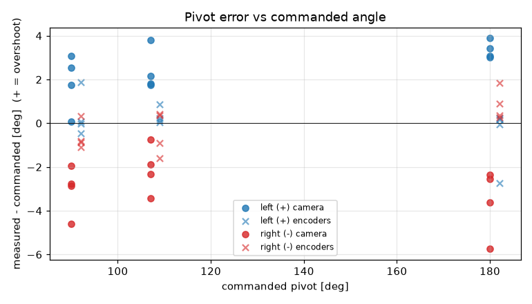
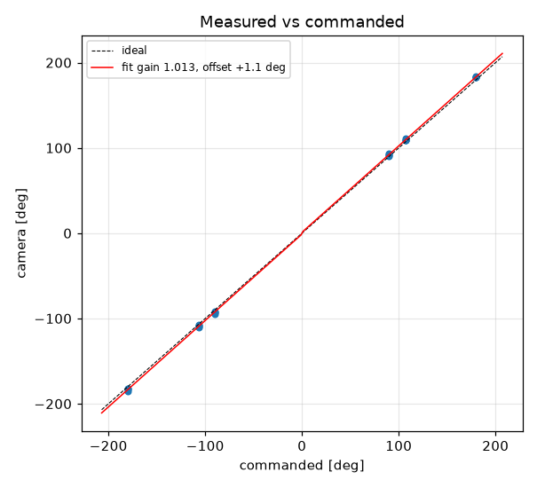
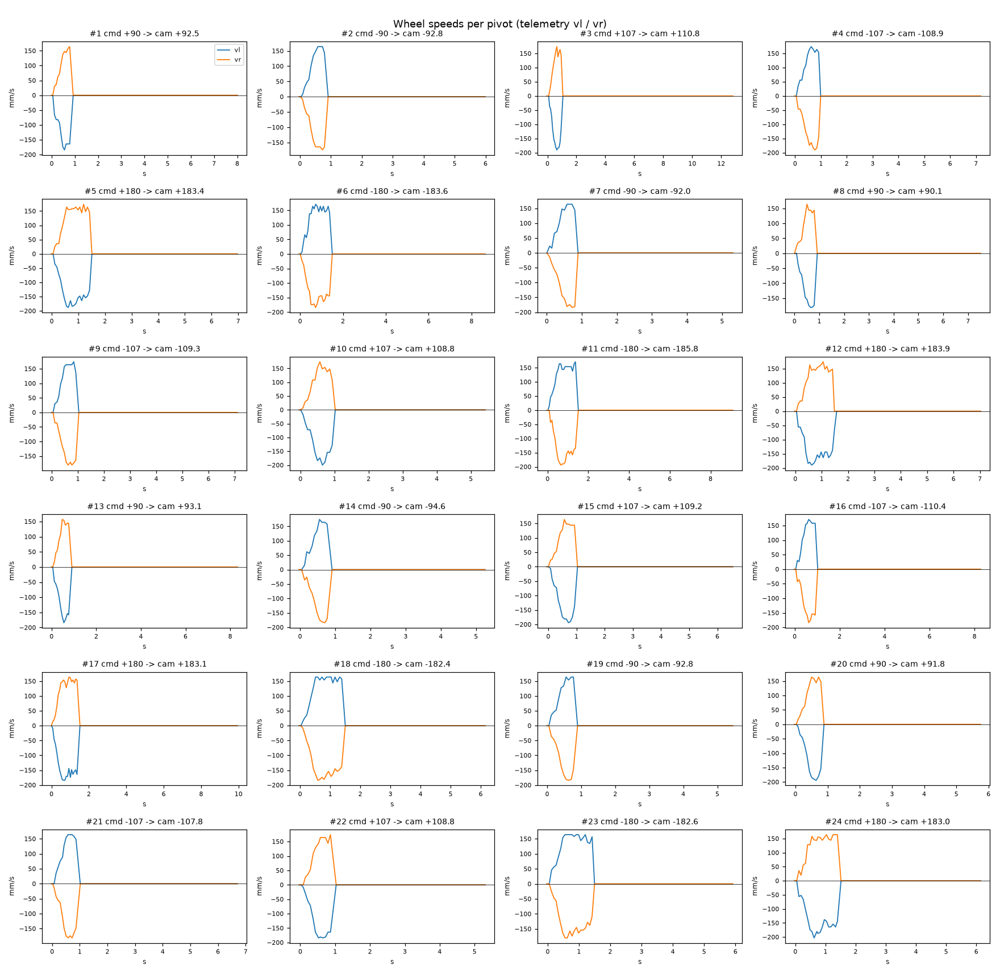

# Turn calibration -- tigez -- 04-default-cruise

24 camera-scored pivots at cruise 0 mm/s, rotational_slip 0.954, pivot_overrun 4.58 mm (b_eff 119.71 mm).

| commanded | n | mean error [deg] | min | max |
|---|---|---|---|---|
| +90 | 4 | +1.85 | +0.1 | +3.1 |
| +107 | 4 | +2.38 | +1.8 | +3.8 |
| +180 | 4 | +3.35 | +3.0 | +3.9 |
| -90 | 4 | -3.04 | -4.6 | -2.0 |
| -107 | 4 | -2.10 | -3.4 | -0.8 |
| -180 | 4 | -3.57 | -5.8 | -2.4 |

Fit: camera = **1.0129** x commanded **+1.1** deg; mean |error| 2.72 deg; left mean 2.53, right mean -2.91; mean centre drift 0.67 cm.

Suggested: `SET rotational_slip 0.9663`, `SET pivot_overrun 5.73` (camera = gain*cmd + offset; slip_new = slip*gain; overrun_new = overrun + offset_rad*b_eff/2).

| # | cmd | camera | err | encoder err | drift cm | peak vl | peak vr | dur s | reason |
|---|---|---|---|---|---|---|---|---|---|
| 1 | +90 | +92.5 | +2.5 | +1.9 | 1.0 | 184 | 164 | 0.7 | stop |
| 2 | -90 | -92.8 | -2.8 | -0.8 | 0.2 | 164 | 174 | 0.7 | stop |
| 3 | +107 | +110.8 | +3.8 | +0.9 | 1.0 | 190 | 174 | 0.8 | stop |
| 4 | -107 | -108.9 | -1.9 | +0.4 | 0.2 | 174 | 190 | 0.8 | stop |
| 5 | +180 | +183.4 | +3.4 | -0.1 | 1.4 | 188 | 174 | 1.3 | stop |
| 6 | -180 | -183.6 | -3.6 | +0.9 | 0.3 | 171 | 184 | 1.3 | stop |
| 7 | -90 | -92.0 | -2.0 | -0.9 | 0.5 | 164 | 184 | 0.7 | stop |
| 8 | +90 | +90.1 | +0.1 | +0.1 | 0.9 | 181 | 164 | 0.7 | stop |
| 9 | -107 | -109.3 | -2.3 | -0.9 | 0.6 | 174 | 181 | 0.8 | stop |
| 10 | +107 | +108.8 | +1.8 | +0.1 | 0.5 | 200 | 174 | 0.8 | stop |
| 11 | -180 | -185.8 | -5.8 | +0.2 | 0.5 | 171 | 194 | 1.3 | stop |
| 12 | +180 | +183.9 | +3.9 | -2.7 | 1.0 | 190 | 174 | 1.4 | stop |
| 13 | +90 | +93.1 | +3.1 | -0.0 | 1.1 | 184 | 157 | 0.6 | stop |
| 14 | -90 | -94.6 | -4.6 | -1.1 | 0.3 | 174 | 184 | 0.6 | stop |
| 15 | +107 | +109.2 | +2.2 | +0.1 | 1.2 | 194 | 164 | 0.8 | stop |
| 16 | -107 | -110.4 | -3.4 | -1.6 | 0.3 | 171 | 184 | 0.8 | stop |
| 17 | +180 | +183.1 | +3.1 | +0.2 | 1.4 | 184 | 164 | 1.3 | stop |
| 18 | -180 | -182.4 | -2.4 | +0.4 | 0.3 | 164 | 184 | 1.3 | stop |
| 19 | -90 | -92.8 | -2.9 | +0.3 | 0.3 | 164 | 184 | 0.7 | stop |
| 20 | +90 | +91.8 | +1.8 | -0.5 | 0.7 | 194 | 164 | 0.7 | stop |
| 21 | -107 | -107.8 | -0.8 | +0.4 | 0.3 | 164 | 181 | 0.8 | stop |
| 22 | +107 | +108.8 | +1.8 | +0.2 | 0.7 | 184 | 174 | 0.8 | stop |
| 23 | -180 | -182.6 | -2.5 | +1.8 | 0.2 | 164 | 180 | 1.3 | stop |
| 24 | +180 | +183.0 | +3.0 | +0.2 | 1.2 | 203 | 164 | 1.3 | stop |
