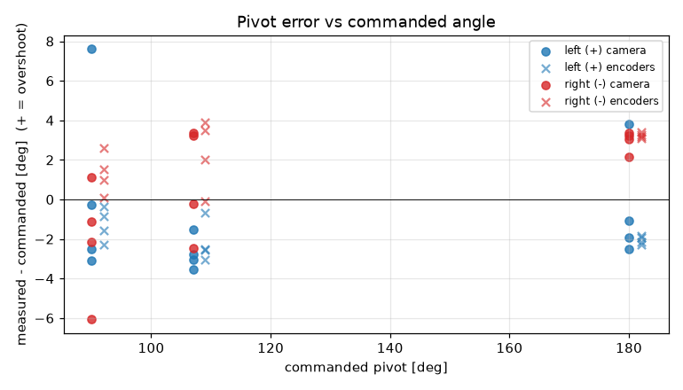
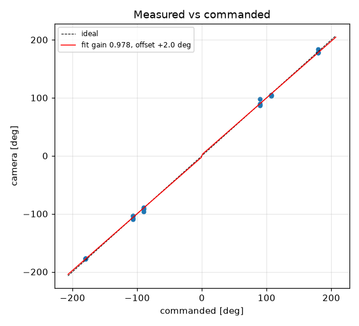
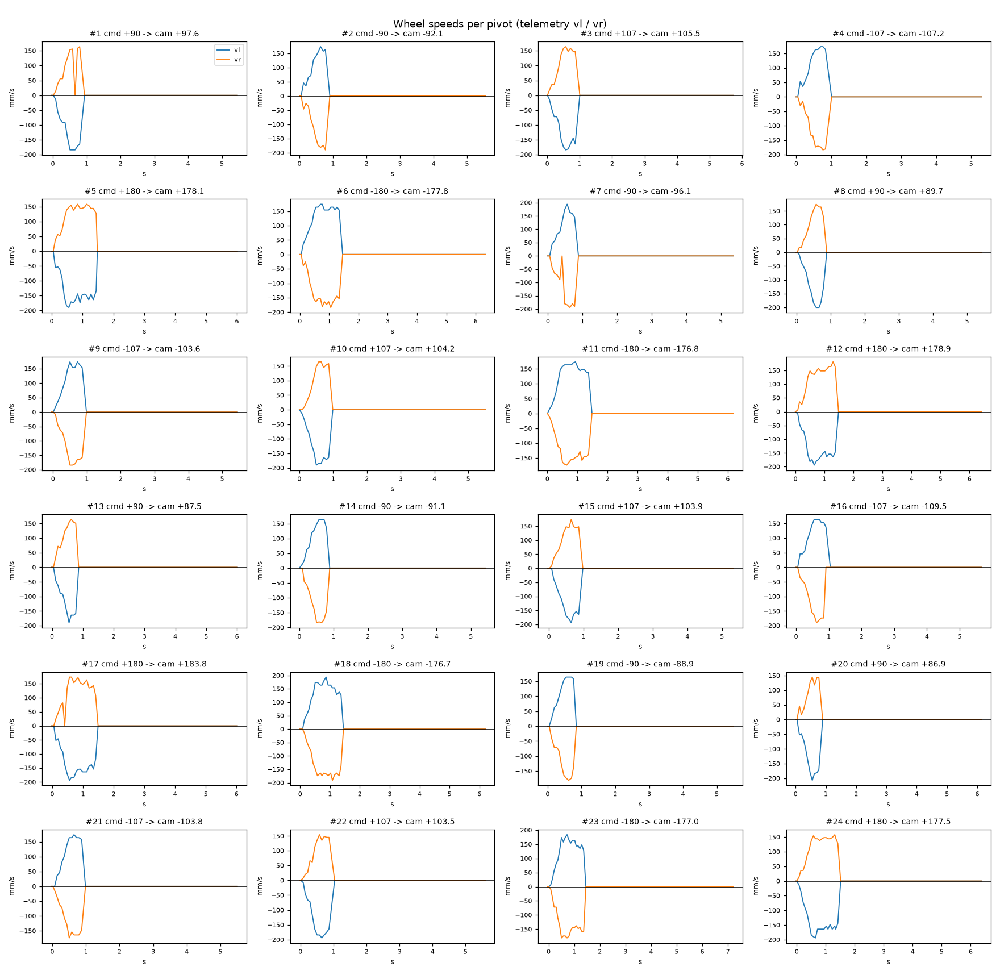

# Turn calibration -- tigez -- 05-default-cruise-tuned

24 camera-scored pivots at cruise 0 mm/s, rotational_slip 0.965, pivot_overrun 6.4 mm (b_eff 118.34 mm).

| commanded | n | mean error [deg] | min | max |
|---|---|---|---|---|
| +90 | 4 | +0.43 | -3.1 | +7.6 |
| +107 | 4 | -2.72 | -3.5 | -1.5 |
| +180 | 4 | -0.43 | -2.5 | +3.8 |
| -90 | 4 | -2.05 | -6.1 | +1.1 |
| -107 | 4 | +0.97 | -2.5 | +3.4 |
| -180 | 4 | +2.94 | +2.2 | +3.4 |

Fit: camera = **0.9779** x commanded **+2.02** deg; mean |error| 2.72 deg; left mean -0.91, right mean 0.62; mean centre drift 0.64 cm.

Suggested: `SET rotational_slip 0.9436`, `SET pivot_overrun 8.49` (camera = gain*cmd + offset; slip_new = slip*gain; overrun_new = overrun + offset_rad*b_eff/2).

| # | cmd | camera | err | encoder err | drift cm | peak vl | peak vr | dur s | reason |
|---|---|---|---|---|---|---|---|---|---|
| 1 | +90 | +97.6 | +7.6 | -0.4 | 0.7 | 184 | 164 | 0.7 | stop |
| 2 | -90 | -92.1 | -2.1 | +0.1 | 0.3 | 174 | 190 | 0.7 | stop |
| 3 | +107 | +105.5 | -1.5 | -2.6 | 0.8 | 184 | 164 | 0.8 | stop |
| 4 | -107 | -107.2 | -0.2 | -0.1 | 0.3 | 174 | 184 | 0.7 | stop |
| 5 | +180 | +178.1 | -1.9 | -2.1 | 1.0 | 190 | 158 | 1.3 | stop |
| 6 | -180 | -177.8 | +2.2 | +3.1 | 0.2 | 174 | 184 | 1.2 | stop |
| 7 | -90 | -96.1 | -6.1 | +1.0 | 0.4 | 194 | 194 | 0.7 | stop |
| 8 | +90 | +89.7 | -0.3 | -0.9 | 0.9 | 200 | 174 | 0.7 | stop |
| 9 | -107 | -103.6 | +3.4 | +3.9 | 0.1 | 174 | 184 | 0.8 | stop |
| 10 | +107 | +104.2 | -2.8 | -0.7 | 1.1 | 190 | 164 | 0.8 | stop |
| 11 | -180 | -176.8 | +3.2 | +3.2 | 0.2 | 174 | 174 | 1.3 | stop |
| 12 | +180 | +178.9 | -1.1 | -2.3 | 1.4 | 194 | 181 | 1.3 | stop |
| 13 | +90 | +87.5 | -2.5 | -2.3 | 0.4 | 190 | 164 | 0.7 | stop |
| 14 | -90 | -91.1 | -1.1 | +1.5 | 0.4 | 164 | 184 | 0.7 | stop |
| 15 | +107 | +103.9 | -3.1 | -3.0 | 0.5 | 194 | 174 | 0.8 | stop |
| 16 | -107 | -109.5 | -2.5 | +3.5 | 0.4 | 164 | 190 | 0.8 | stop |
| 17 | +180 | +183.8 | +3.8 | -1.9 | 0.6 | 194 | 174 | 1.3 | stop |
| 18 | -180 | -176.7 | +3.4 | +3.3 | 1.1 | 194 | 191 | 1.2 | stop |
| 19 | -90 | -88.9 | +1.1 | +2.6 | 0.1 | 164 | 181 | 0.7 | stop |
| 20 | +90 | +86.9 | -3.1 | -1.6 | 1.4 | 207 | 145 | 0.6 | stop |
| 21 | -107 | -103.8 | +3.2 | +2.0 | 0.1 | 174 | 174 | 0.8 | stop |
| 22 | +107 | +103.5 | -3.5 | -2.5 | 1.5 | 194 | 154 | 0.8 | stop |
| 23 | -180 | -177.0 | +3.0 | +3.4 | 0.2 | 184 | 181 | 1.3 | stop |
| 24 | +180 | +177.5 | -2.5 | -1.8 | 1.3 | 194 | 158 | 1.3 | stop |
