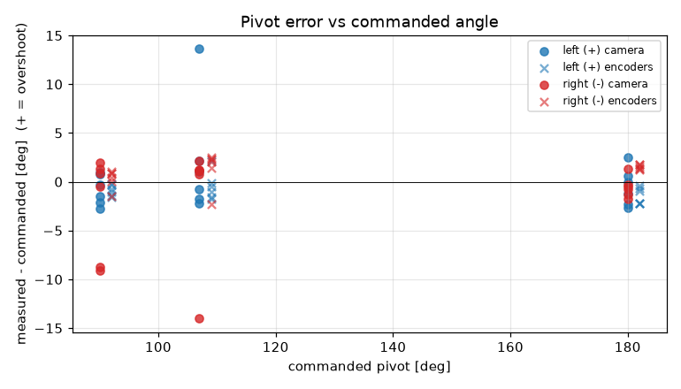
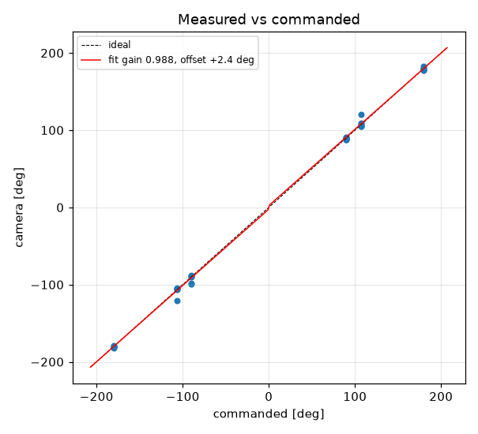
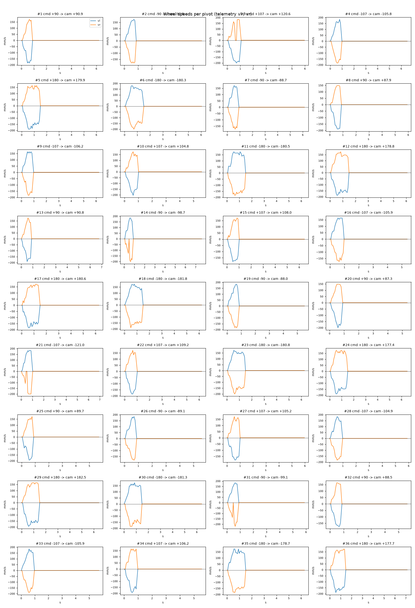

# Turn calibration -- tigez -- 06-confirm

36 camera-scored pivots at cruise 0 mm/s, rotational_slip 0.96, pivot_overrun 5.5 mm (b_eff 118.96 mm).

| commanded | n | mean error [deg] | min | max |
|---|---|---|---|---|
| +90 | 6 | -0.83 | -2.7 | +0.9 |
| +107 | 6 | +2.01 | -2.2 | +13.6 |
| +180 | 6 | -0.52 | -2.6 | +2.5 |
| -90 | 6 | -2.35 | -9.1 | +2.0 |
| -107 | 6 | -1.27 | -14.0 | +2.1 |
| -180 | 6 | -0.55 | -1.8 | +1.3 |

Fit: camera = **0.9875** x commanded **+2.37** deg; mean |error| 2.45 deg; left mean 0.22, right mean -1.39; mean centre drift 0.56 cm.

Suggested: `SET rotational_slip 0.948`, `SET pivot_overrun 7.96` (camera = gain*cmd + offset; slip_new = slip*gain; overrun_new = overrun + offset_rad*b_eff/2).

| # | cmd | camera | err | encoder err | drift cm | peak vl | peak vr | dur s | reason |
|---|---|---|---|---|---|---|---|---|---|
| 1 | +90 | +90.9 | +0.9 | -1.0 | 0.7 | 184 | 171 | 0.7 | stop |
| 2 | -90 | -90.5 | -0.5 | +0.8 | 0.2 | 174 | 180 | 0.6 | stop |
| 3 | +107 | +120.6 | +13.6 | +2.2 | 0.9 | 200 | 184 | 0.8 | stop |
| 4 | -107 | -105.8 | +1.2 | +2.0 | 0.2 | 184 | 184 | 0.8 | stop |
| 5 | +180 | +179.9 | -0.1 | -1.0 | 0.7 | 190 | 164 | 1.3 | stop |
| 6 | -180 | -180.3 | -0.3 | +1.7 | 0.3 | 181 | 200 | 1.3 | stop |
| 7 | -90 | -88.7 | +1.3 | +0.8 | 0.1 | 171 | 174 | 0.7 | stop |
| 8 | +90 | +87.9 | -2.1 | -0.3 | 1.1 | 190 | 148 | 0.7 | stop |
| 9 | -107 | -106.2 | +0.8 | +1.4 | 0.2 | 164 | 184 | 0.7 | stop |
| 10 | +107 | +104.8 | -2.2 | -1.8 | 1.0 | 204 | 174 | 0.8 | stop |
| 11 | -180 | -180.5 | -0.5 | +1.4 | 0.3 | 174 | 184 | 1.3 | stop |
| 12 | +180 | +178.8 | -1.2 | -2.2 | 0.5 | 188 | 174 | 1.3 | stop |
| 13 | +90 | +90.8 | +0.8 | -0.2 | 0.9 | 191 | 174 | 0.7 | stop |
| 14 | -90 | -98.7 | -8.7 | +0.1 | 0.2 | 184 | 200 | 0.7 | stop |
| 15 | +107 | +108.0 | +1.0 | -0.1 | 1.1 | 181 | 171 | 0.8 | stop |
| 16 | -107 | -105.9 | +1.1 | +2.5 | 0.1 | 164 | 174 | 0.8 | stop |
| 17 | +180 | +180.6 | +0.6 | -0.7 | 1.4 | 184 | 171 | 1.2 | stop |
| 18 | -180 | -181.8 | -1.8 | +1.6 | 0.2 | 174 | 190 | 1.3 | stop |
| 19 | -90 | -88.0 | +2.0 | +1.0 | 0.3 | 184 | 184 | 0.6 | stop |
| 20 | +90 | +87.3 | -2.7 | -1.4 | 0.9 | 200 | 148 | 0.7 | stop |
| 21 | -107 | -121.0 | -14.0 | -2.3 | 0.8 | 184 | 200 | 0.8 | stop |
| 22 | +107 | +109.2 | +2.1 | -0.5 | 0.5 | 184 | 171 | 0.8 | stop |
| 23 | -180 | -180.8 | -0.8 | +1.4 | 0.2 | 172 | 200 | 1.3 | stop |
| 24 | +180 | +177.4 | -2.6 | -2.2 | 0.6 | 190 | 174 | 1.3 | stop |
| 25 | +90 | +89.7 | -0.3 | -1.6 | 1.0 | 194 | 171 | 0.7 | stop |
| 26 | -90 | -89.1 | +0.9 | +0.4 | 0.2 | 184 | 181 | 0.7 | stop |
| 27 | +107 | +105.2 | -1.8 | -1.1 | 0.9 | 181 | 172 | 0.8 | stop |
| 28 | -107 | -104.9 | +2.1 | +2.4 | 0.2 | 184 | 184 | 0.8 | stop |
| 29 | +180 | +182.5 | +2.5 | -0.4 | 1.2 | 194 | 164 | 1.3 | stop |
| 30 | -180 | -181.3 | -1.3 | +1.2 | 0.3 | 174 | 184 | 1.3 | stop |
| 31 | -90 | -99.1 | -9.1 | -1.5 | 0.7 | 184 | 220 | 0.7 | stop |
| 32 | +90 | +88.5 | -1.5 | -0.8 | 0.5 | 174 | 164 | 0.7 | stop |
| 33 | -107 | -105.9 | +1.1 | +2.4 | 0.2 | 184 | 190 | 0.8 | stop |
| 34 | +107 | +106.2 | -0.8 | -1.6 | 0.4 | 193 | 164 | 0.8 | stop |
| 35 | -180 | -178.7 | +1.3 | +1.8 | 0.1 | 174 | 184 | 1.3 | stop |
| 36 | +180 | +177.7 | -2.3 | -2.2 | 1.0 | 190 | 174 | 1.2 | stop |
