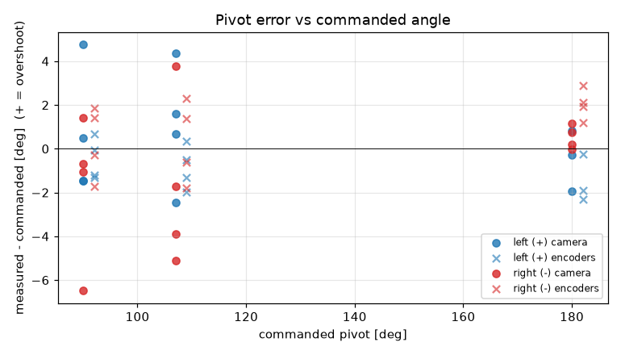
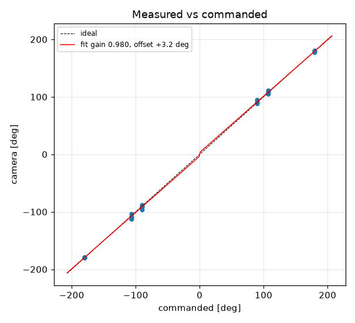
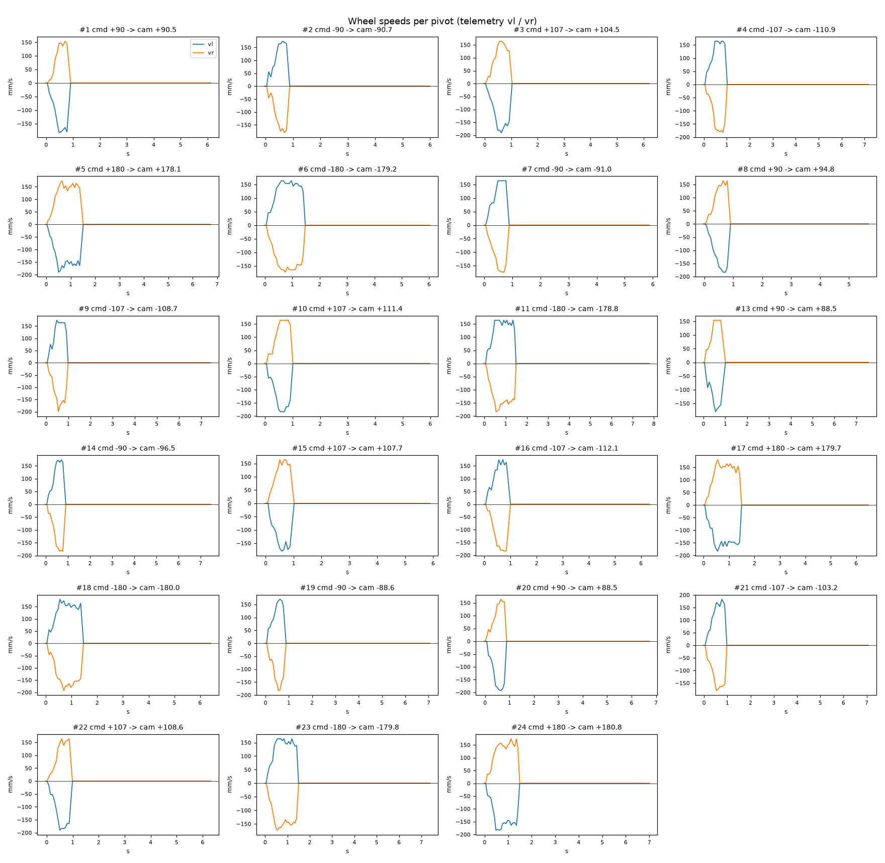

# Turn calibration -- tigez -- 10-post-flash

23 camera-scored pivots at cruise 0 mm/s, rotational_slip 0.962, pivot_overrun 5.5 mm (b_eff 118.71 mm).

| commanded | n | mean error [deg] | min | max |
|---|---|---|---|---|
| +90 | 4 | +0.58 | -1.5 | +4.8 |
| +107 | 4 | +1.05 | -2.5 | +4.4 |
| +180 | 3 | -0.47 | -1.9 | +0.8 |
| -90 | 4 | -1.70 | -6.5 | +1.4 |
| -107 | 4 | -1.74 | -5.1 | +3.8 |
| -180 | 4 | +0.52 | -0.0 | +1.2 |

Fit: camera = **0.9796** x commanded **+3.24** deg; mean |error| 2.03 deg; left mean 0.46, right mean -0.97; mean centre drift 0.54 cm.

Suggested: `SET rotational_slip 0.9424`, `SET pivot_overrun 8.86` (camera = gain*cmd + offset; slip_new = slip*gain; overrun_new = overrun + offset_rad*b_eff/2).

| # | cmd | camera | err | encoder err | drift cm | peak vl | peak vr | dur s | reason |
|---|---|---|---|---|---|---|---|---|---|
| 1 | +90 | +90.5 | +0.5 | -1.2 | 1.0 | 183 | 154 | 0.7 | stop |
| 2 | -90 | -90.7 | -0.7 | -0.3 | 0.3 | 174 | 180 | 0.7 | stop |
| 3 | +107 | +104.5 | -2.5 | -2.0 | 1.0 | 190 | 164 | 0.8 | stop |
| 4 | -107 | -110.9 | -3.9 | -1.8 | 0.4 | 164 | 183 | 0.8 | stop |
| 5 | +180 | +178.1 | -1.9 | -1.9 | 0.8 | 190 | 174 | 1.3 | stop |
| 6 | -180 | -179.2 | +0.8 | +2.1 | 0.2 | 164 | 173 | 1.3 | stop |
| 7 | -90 | -91.0 | -1.0 | +1.4 | 0.1 | 164 | 174 | 0.7 | stop |
| 8 | +90 | +94.8 | +4.8 | +0.7 | 0.8 | 183 | 164 | 0.7 | stop |
| 9 | -107 | -108.7 | -1.7 | +1.4 | 0.1 | 174 | 200 | 0.8 | stop |
| 10 | +107 | +111.4 | +4.4 | +0.4 | 0.8 | 183 | 164 | 0.8 | stop |
| 11 | -180 | -178.8 | +1.2 | +1.9 | 0.1 | 164 | 183 | 1.3 | stop |
| 13 | +90 | +88.5 | -1.5 | -1.3 | 0.5 | 180 | 154 | 0.7 | stop |
| 14 | -90 | -96.5 | -6.5 | -1.7 | 0.3 | 174 | 183 | 0.7 | stop |
| 15 | +107 | +107.7 | +0.7 | -1.3 | 0.5 | 180 | 164 | 0.8 | stop |
| 16 | -107 | -112.1 | -5.1 | -0.6 | 0.4 | 174 | 184 | 0.7 | stop |
| 17 | +180 | +179.7 | -0.3 | -2.3 | 0.3 | 183 | 180 | 1.3 | stop |
| 18 | -180 | -180.0 | -0.0 | +2.9 | 0.6 | 180 | 193 | 1.2 | stop |
| 19 | -90 | -88.6 | +1.4 | +1.8 | 0.2 | 170 | 183 | 0.7 | stop |
| 20 | +90 | +88.5 | -1.5 | -0.1 | 1.0 | 193 | 164 | 0.7 | stop |
| 21 | -107 | -103.2 | +3.8 | +2.3 | 0.2 | 183 | 180 | 0.8 | stop |
| 22 | +107 | +108.6 | +1.6 | -0.5 | 1.1 | 190 | 164 | 0.8 | stop |
| 23 | -180 | -179.8 | +0.2 | +1.2 | 0.4 | 164 | 173 | 1.3 | stop |
| 24 | +180 | +180.8 | +0.8 | -0.2 | 1.2 | 183 | 174 | 1.3 | stop |
