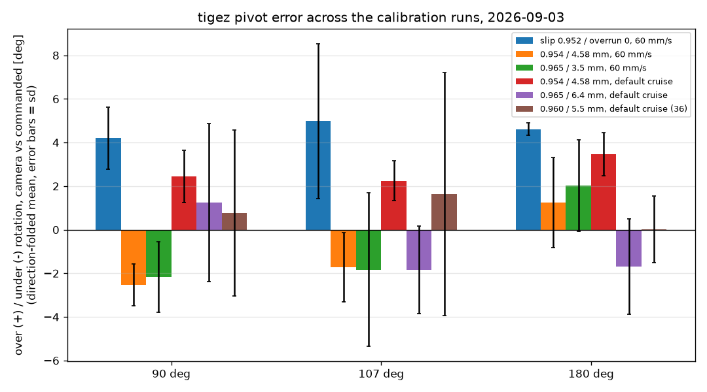
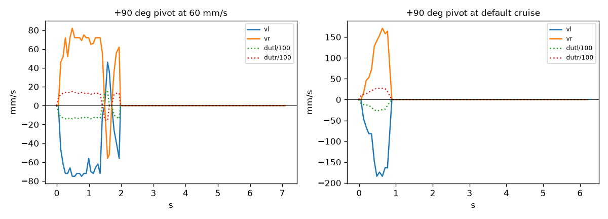

# tigez turn calibration, 2026-09-03 -- camera-scored pivots of +-90, +-107, +-180

**Tool:** `tests/playfield/turn_calibration.py` (new). **Robot:** tigez on
the playfield, driven through its own Raspberry Pi's serial daemon
(`nada`, 192.168.4.53:42181) -- lossless, no cable, no relay. **Truth:**
the overhead camera (aprilcam daemon, tag 57 with its registered mount,
so the daemon reports the centre of rotation and the corrected heading).
**Telemetry:** `TLM FULL` streamed throughout; every frame's `vl`/`vr`,
duties and encoder heading are in each run's `frames.csv`.

Safety: the turn half of the field dance ran first
(`00-dance-turns.log`): +90, +180, +90 all read as left turns, home
within 0.6 cm. The drive legs were skipped because tigez sat 17 cm from
the east rail; pivots move the body nowhere, and the tool refuses to
pivot inside 12 cm of a rail.

## Result

| setting | cruise | pivots | mean over(+)/under(-) at 90 / 107 / 180 | mean abs err | run |
|---|---|---|---|---|---|
| slip 0.952, overrun 0 (as found) | 60 mm/s | 17 | **+4.2 / +5.0 / +4.6** | 4.6 deg | `01-baseline` |
| slip 0.954, overrun 4.58 mm | 60 mm/s | 24 | -2.5 / -1.7 / +1.2 | 2.2 deg | `02-verify-overrun` |
| slip 0.965, overrun 3.5 mm | 60 mm/s | 24 | -2.2 / -1.8 / +2.0 | 2.8 deg | `03-tune` |
| slip 0.954, overrun 4.58 mm | default (~185 mm/s at the wheels) | 24 | +2.5 / +2.2 / +3.5 | 2.8 deg | `04-default-cruise` |
| slip 0.965, overrun 6.4 mm | default | 24 | +1.2 / -1.8 / -1.7 | 2.7 deg | `05-default-cruise-tuned` |
| **slip 0.960, overrun 5.5 mm** | default | 36 | **+0.8 / +1.6 / 0.0** (median -0.6 / -1.0 / +0.4) | 2.5 deg (1.3 deg sd without the 4 glitch pivots) | `06-confirm` |





Per-run charts: `<run>/turn-error.png` (camera and encoder error vs
angle, left vs right), `<run>/fit.png`, `<run>/wheel-speeds.png` (every
pivot's `vl`/`vr`), plus `<run>/REPORT.md` with the per-pivot table.

## What the data says

1. **As found, tigez over-rotated a flat +4.4 deg on every pivot**, left
   and right, 90 through 180, at 60 mm/s -- while its encoders believed
   it landed within +0.9 deg. Almost all of the overshoot is physical
   rotation the wheels never register (the body keeps turning after the
   controller has stopped counting), i.e. an end-of-move overrun, not a
   track-width scale error (fit gain 1.002). That is what
   `pivot_overrun` exists for.
2. **The overrun is speed dependent.** 4.58 mm removed ~6.7 deg at 90 and
   107 but only ~3.4 deg at 180 at 60 mm/s, and at the default cruise the
   same setting still left +2.7 deg. A single constant cannot fit both
   speeds: values that centre the default cruise under-rotate 90s by
   about 2 deg at 60 mm/s. Sprint 029's "pivot-end predictive
   termination and yaw floor" issue is the real fix; this calibration is
   the stopgap for the operating point tours actually use (default
   cruise).
3. **Chosen: `pivot_overrun` 5.5 mm, `rotational_slip` 0.960** (b_eff
   119.0 mm against the 114.2 mm firmware default). At the default cruise
   over 36 pivots: +0.8 / +1.6 / 0.0 deg per angle; excluding the four
   glitch pivots below, -0.9 / -0.8 / 0.0 with 1.2-1.5 deg sd. Centre
   drift per pivot 0.6 cm.
4. **Four of 36 default-cruise pivots over-rotated by 9-14 deg, and all
   four share one signature**: a wheel-velocity sample of 0 in the
   middle of the acceleration ramp (`frames.csv`, e.g. `vr ... 164, 148,
   0, 0, 181`), after which the controller drives that wheel to peak duty
   and the body swings past. The encoders believe +2 deg; the camera sees
   +10. tigez was running an unbaked build older than sprint 028's
   frozen-encoder-read fix (028/001); see the post-flash section for
   whether the new build still shows it. This is a firmware/encoder-read
   defect, not calibration -- it does not shift the means much but it is
   the spread.
5. The camera loses the field when the lights go out (they did, once,
   mid-session despite two keeper loops); the tool now re-asserts the
   Shelly before every pivot.

## Bake

Written to `radio-robot-lib/config/robots/tigez.json`
`geometry.firmware_bake`: `travel_calib 0.78623`, `trackwidth 114.4`
(caliper), `rotational_slip 0.9617` (= 0.960 x 114.4/114.2, so b_eff is
unchanged with the caliper track width baked), `pivot_overrun_mm 5.5`.
`tools/make_deploy.py --robot tigez` bakes these into the hex; flash
through the Pi with `mbdeploy deploy --remote tigez --hex <hex>`.

## Post-flash check

Built from master with the bake (`07-build-tigez.log`: `geometry bake
travel_calib 0.78623 / trackwidth 114.4 / rotational_slip 0.9617 /
pivot_overrun_mm 5.5`, hex sha256
`a9013d48d97a4f943c046a1f465184a4e4fd673faa92a75ad1c723c2bad3612b`),
flashed through the Pi on the first try (`08-flash-tigez-1.log`). Over
the wire afterwards (`09-post-flash-identity.log`): `id diffdrive tigez
1.20260903.1 tigez`, `get rotational_slip 0.962000`, `get pivot_overrun
5.500000` -- the bake is what the robot boots with.

`10-post-flash`: 23 pivots at the default cruise, **no live SET**:

| angle | mean over(+)/under(-) | median | sd | encoder-believed |
|---|---|---|---|---|
| 90 | +1.1 | +0.6 | 2.8 | -0.4 |
| 107 | +1.4 | +1.7 | 3.0 | -0.6 |
| 180 | -0.5 | -0.3 | 0.8 | -1.8 |

Mean abs error 2.0 deg, centre drift 0.5 cm per pivot. **The mid-ramp
zero-velocity sample never occurred on this build: 0 of 46 wheel traces**,
against 4 of 36 pivots on the pre-028 build -- so those 9-14 deg
excursions were the encoder-read defect sprint 028/001 fixed, not the
drivetrain. One pivot (#12) lost the camera fix after the turn and was
skipped.

Note: this build has the v6 radio link OFF (`BOOT_RADIO_LINK = false`,
the 2026-09-02 default) and no WiFi module is fitted, so tigez is now
reached through its Pi's serial daemon (`tigez._mbserial._tcp`, i.e.
`nada.local:42181`) or local USB. A relay session needs a build made
with `make_deploy.py --robot tigez --radio-link`.

## Reproduce

```bash
uv run python tests/playfield/turn_calibration.py --robot tigez --dance-only --dance-turns-only --margin 12
uv run python tests/playfield/turn_calibration.py --robot tigez --angles 90 107 180 --reps 4 --cruise 0 --margin 12 --out reports/<dir>
<venv with matplotlib>/bin/python tests/playfield/turn_calibration.py --render reports/<dir>
```
