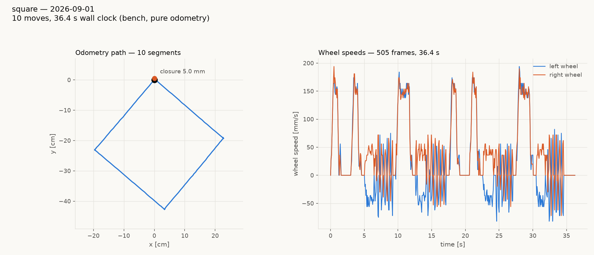
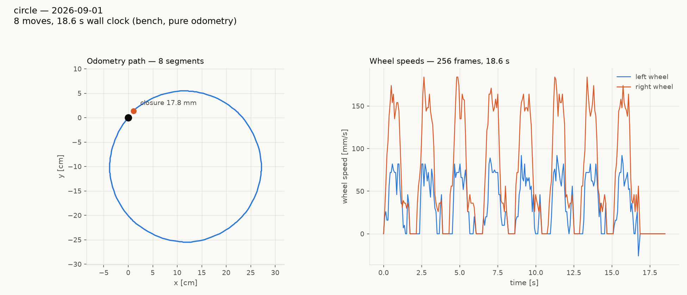
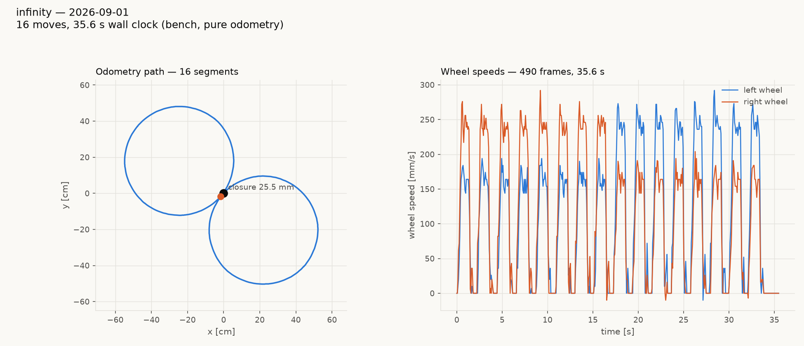
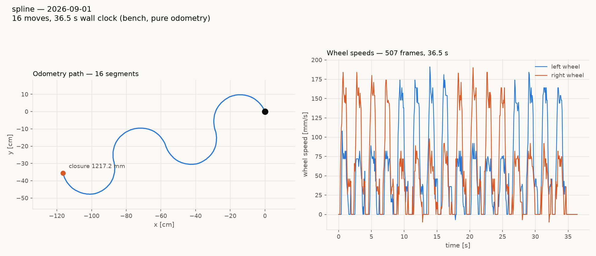

# The tour suite — four figures on gopiv (2026-09-01)

The `.tour` system-test suite is ported from `radio-robot-elite` and
running. Four figures, all on gopiv at the magni bench, **pure
odometry** — no camera, lights off.

| tour | figure | moves | wall | closure | net rotation |
|---|---|---|---|---|---|
| `square.tour` | 600 mm square, 4 legs + 4 pivots | 10 | 36.4 s | **5.0 mm** | +358.17° (ideal 360) |
| `circle.tour` | one circle r=150 mm, 8 × 45° arcs | 8 | 18.6 s | **17.8 mm** | +355.50° (ideal 360) |
| `infinity.tour` | figure-8, two circles r=300 mm, 16 arcs | 16 | 35.6 s | **25.5 mm** | +2.60° (ideal 0) |
| `spline.tour` | serpentine, 4 half-circles r=150 mm, 16 arcs | 16 | 36.5 s | *(open path)* | −7.11° (ideal 0) |






## Reading the numbers

**Closure** is how far the finish pose sits from the start pose. It is
the right score for a closed figure and it is **meaningless for the
serpentine**, which is an open path that ends 1200 mm away by design —
the chart still prints "closure 1217.2 mm" because the plotting code is
generic, and that number should be read as *end displacement* there,
against an ideal of 1200 mm (+1.4%).

Scored in its own frame, the serpentine comes out clean:

| | measured | ideal |
|---|---|---|
| advance along its axis | 1217 mm | 1200 (= 8r) |
| perpendicular span | 317 mm | 300 (= 2r) |
| excursion each side | +174 / −142 mm | ±150 |
| backtracking along the axis | −1 mm | 0 |

The ±16 mm asymmetry in the excursion is the −7.11° of net rotation
showing up as position, which is what a heading error does on a path
that never returns to correct it.

## The one thing that will bite anyone editing these files

**An arc segment must stay under 50°.** `MotionEngine::moveX()` splits
any move with a nonzero distance and |rotation| ≥ `kTurnFirstAngleRad`
(0.8726 rad = 50°) into a pivot *then* a straight. Ask for a curve in
pieces at or above that and you get corners, silently — normal acks,
normal completion receipts, wrong shape.

MEASURED here, and it is not a small effect:

- `circle.tour` written as **one 360° arc** drove a **942 mm straight
  line** (closure 942.2 mm — the whole circumference, in a line).
- Written as **90° arcs**, it drew a **square**.
- Written as **45° arcs**, it draws the circle above.

The same trap was already in the infinity tour on its first run. Every
circular figure in the suite is therefore built from 45° arcs, and
`tests/host/test_run_tour_programs.py` now fails the build if any
`.tour` file or any on-robot tour program asks for an arc at or above
the threshold — reading the threshold out of `motion_engine.h` rather
than hardcoding it, so the check tracks the constant.

## Why arcs at all

`MOVE_X` takes a body distance **and** a rotation, so a
constant-curvature segment is one command the motion engine shapes end
to end. The alternative — chopping a circle into dozens of straight
chords — puts an acceleration ramp and an end taper inside every chord,
and the robot stutters through a polygon instead of driving a curve.
Eight moves for a circle, sixteen for a figure-8.

## Tuning

Every tour carries the tuned constants as `SET` lines so a run is
reproducible without remembering the configuration:

```
SET twist_hold_gain 8       SET speed_floor 512
SET yaw_taper 800           SET pivot_overrun 0.68
```

Where those came from, and the hard limits on each (the heading servo
goes unstable above `twist_hold_gain` 16; `speed_floor` 30 mm/s is
stiction-bound and unusable): `reports/gopiv-closure-20260901.md`.

## The on-robot versions do not work on this firmware

`test/test.ts` now implements `RUN:square`, `RUN:infinity` and
`RUN:spline` over `diffDrive.move(distance_cm, yaw_deg)`. They build,
they dispatch, and they parse their arguments correctly — but they
cannot complete, because **any RUN: program that drives the motors
resets the board on fw 1.20260829.1**.

This is not new code failing. `RUN:straight` and `RUN:pivot`, both of
which predate this work, fail identically; three non-motion RUN verbs
and the host-driven `MOVE_X` equivalents of the same motions all run
clean. Full isolation, evidence and next steps:
`clasi/issues/run-fiber-motion-resets-the-board-on-fw-1-20260829-1.md`.

**Host-driven `.tour` runs are the working path today** — every result
in this report came through `tests/system/run_tour.py`.

## Running one

```
uv run --with numpy --with matplotlib python tests/system/run_tour.py \
    tests/system/tours/square.tour --host magni --robot gopiv \
    --out reports/tours-20260901
```

`--out` takes a directory or a `.png` path. Each run writes the chart
and a JSON of every telemetry frame, so a run can be re-analysed
without re-driving it.
