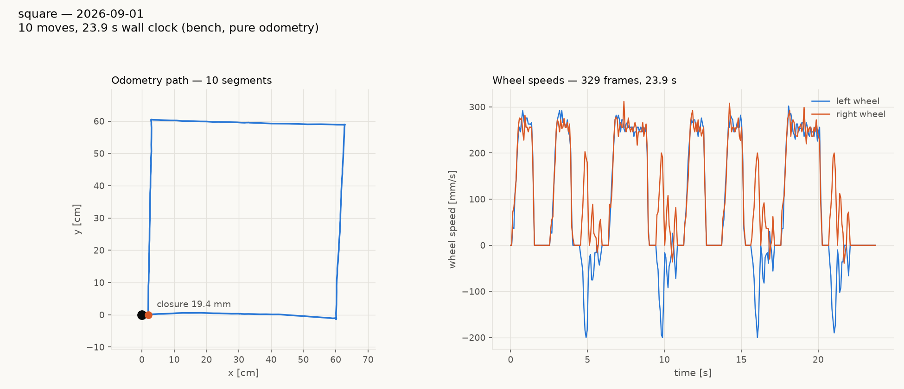
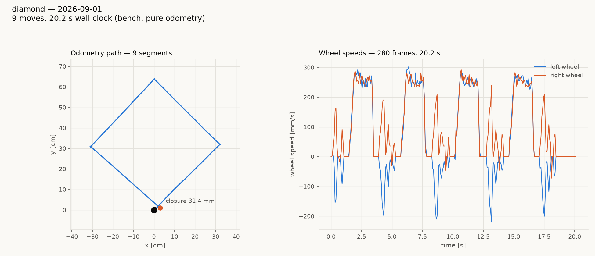
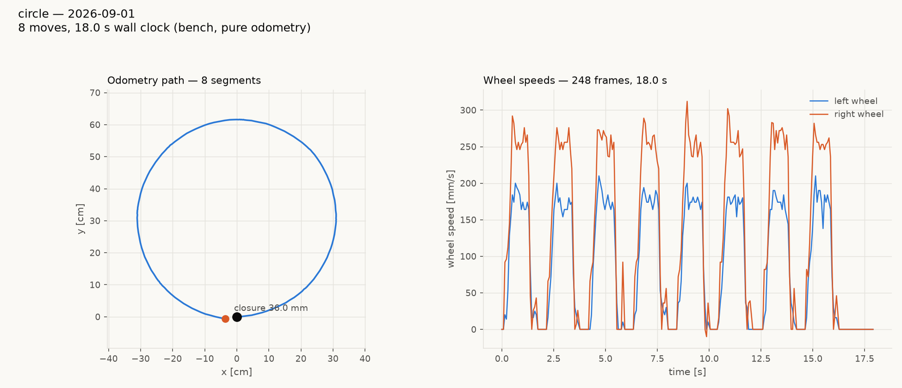
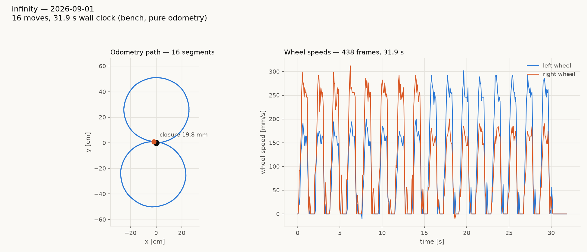
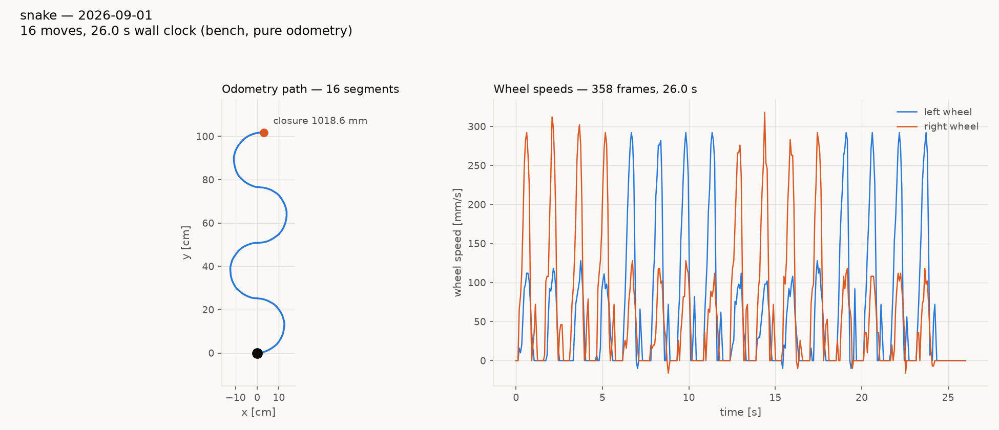
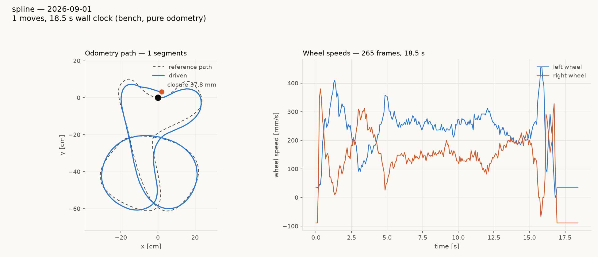

# The tour suite, rescaled and corrected (gopiv, 2026-09-01)

Six figures, all sized to the **usable** playfield (120 x 80 cm, so the
robot centre lives in ±600 x ±400 mm) with 50 mm of margin. Bench, pure
odometry.

| tour | figure | wall | closure | note |
|---|---|---|---|---|
| `square` | 600 mm square, axis-aligned | 24.1 s | **19.4 mm** | |
| `diamond` | 450 mm square turned 45° | 20.2 s | 31.4 mm | |
| `circle` | r = 300 mm, 8 × 45° arcs | 18 s | 36.0 mm | |
| `infinity` | figure-8, r = 250 mm, 16 arcs | 30 s | 19.8 mm | |
| `snake` | serpentine, r = 125 mm, 4 half-circles | 30 s | *(open path)* | ends 1000 mm away by design |
| `spline` | `complex.path.json`, **pure pursuit** | 18.5 s | 37.8 mm | **cross-track 10.5 mm mean, 35.1 max** |

## The square was never a diamond

It drew as one, but that was the **chart**, not the robot. The robot's
odometry frame is whatever it was when the program last booted, and
nothing on the wire can rebase it, so a tour run after other tours
starts at an arbitrary pose in an inherited frame.

MEASURED, `reports/tours-20260901/square.json`: the run began at
(−1154, −208) mm with a cumulative heading of 4909.66° = **229.66°**,
and its first leg travelled at **−130.19°** — the same direction.
Re-rendered in its own start frame the identical data is a
**30.4 × 30.2 cm square with its first leg at +0.15°**.

`run_tour.py` now always charts in the tour's start frame: translated
to the start position *and rotated to the start heading*. `diamond.tour`
is the figure that was actually being asked for — a square entered
through a 45° pivot, so its legs run diagonally on purpose.

## The wheel speeds were the pivots, and they were at the stiction floor

The tours were ported with `omega=45` deg/s for pivots. That is 47 mm/s
at the wheel. MEASURED: each 90° pivot took 4.5–5.0 s, ran a median
46 mm/s, and chattered raggedly between 0 and 75 mm/s while the
straights held a clean 144 mm/s.

Raising it produced the one genuinely surprising result of the session.
An **interleaved** A/B (alternating arms so battery drift hits both
equally, n = 8 each, heading sampled at rest):

| pivot cruise | excess per 90° | sd |
|---|---|---|
| **188 mm/s (180 deg/s)** | **+1.34°** | **0.35** |
| 300 mm/s (286 deg/s) | +6.88° | 1.03 |

188 mm/s is five times better in both bias and scatter — which
contradicts the closure sweep's best-known configuration, and the
reason is that `pivot_overrun` is **speed-dependent**. Swept at
188 mm/s, the 0.68 mm that sweep found (at 300 mm/s) leaves +1.44° on
the table; **2.0 mm is the zero crossing** (1.8 → +0.29°, 2.2 → −0.25°).
All six tours now set `pivot_overrun 2.0` and pivot at 180 deg/s.

Retune `pivot_overrun` whenever the pivot cruise changes. Nothing about
it is a fixed property of the robot.

### A confounded comparison, called out

The first two square runs (30.1 mm at 180 deg/s, then 120.4 mm at
286 deg/s) were run back to back on a draining pack and **do not settle
anything**. Within that single 120 mm run the per-pivot excess climbed
+3.62 → +3.12 → +5.81 → +8.47°, and duty-per-unit-speed read 12.55
against 11.20 fresh — the battery-depletion signature. The interleaved
A/B above is what the numbers in this report rest on.

## The spline is now an actual spline

`spline.tour` follows `complex.path.json` — 321 points, 3493.6 mm,
minimum radius 32 mm — with **pure pursuit**: read the odometry pose,
slide an arc-length cursor to the nearest point on the path, take the
point one lookahead further on, convert the offset to a curvature
(`kappa = 2·dy/L²`, `omega = kappa·v`) and command it with `MOVE_V`.
Repeat every 120 ms. `MOVE_V` holds a body speed and a yaw rate for a
duration, so the robot keeps rolling between updates instead of
stopping at every aim point — the wheel-speed panel never returns to
zero mid-path, which is the visible difference from the arc tours.

The old `spline.tour` — four half-circles — is renamed **`snake.tour`**.
It was a chain of arcs, not a fitted curve, and the name now says so.

**Two bugs found on the way, both worth recording:**

1. **`Link.pose()` read the wrong columns.** `frames()` strips the
   leading `t` tag and is indexed one lower throughout; `pose()`
   indexed the raw split line with `frames()`'s offsets and returned
   `(flags, x, y)`. A 91.25° pivot measured as 0.02°. It made the first
   pivot A/B report every arm as exactly −90.00 excess, and it would
   have silently wrecked the follower.
2. **The path was anchored on its +x axis, not its initial tangent.**
   `complex.path.json` leaves its first point heading almost due +y, so
   the robot started 90° off the path and spent the first lobe swerving
   back onto it: cross-track **mean 65.0 mm, max 307.1**. Aligning the
   path's initial tangent to the robot's heading took the same run to
   **mean 10.5 mm, p95 28.9, max 35.1**.

The remaining error is concentrated where the path is tightest. With a
160 mm lookahead the follower cannot track curvature much below ~80 mm
radius, and this path's minimum is 32 mm, so the sharpest corners are
cut. That is a property of the path and the lookahead, not a fault —
lookahead is the knob, and shortening it trades corner-cutting for
oscillation.

## Sizing

The old sizes were built against ±671.5 × ±446.5 mm — the *field*, not
the *usable area*. `infinity.tour` at r = 300 mm spanned 1200 mm, the
entire usable width, with zero margin.

Two of the figures advance **perpendicular** to the start heading,
which is the easy thing to get backwards: the first half-circle turns
the robot 180°, so progress is sideways. `infinity` spans 2r × 4r and
`snake` 2r × 8r, both tall in the start frame, and both must be staged
facing the field's **short** axis. Full budget and per-tour staging:
[`tests/system/tours/FIELD.md`](../tests/system/tours/FIELD.md).

`tests/host/test_run_tour_programs.py` now dead-reckons every tour's
commanded geometry (sampling arcs, not just endpoints) and fails if the
centred figure does not fit ±550 × ±350 mm in either orientation, and
checks every `SPLINE` path's extent the same way. Verified against a
deliberately oversized infinity.

## Still open

The on-robot `RUN:square` / `RUN:infinity` / `RUN:spline` programs
remain unusable on fw 1.20260829.1 — any RUN: program that drives the
motors resets the board, and that predates this work
(`clasi/issues/run-fiber-motion-resets-the-board-on-fw-1-20260829-1.md`).
Everything in this report is host-driven.
