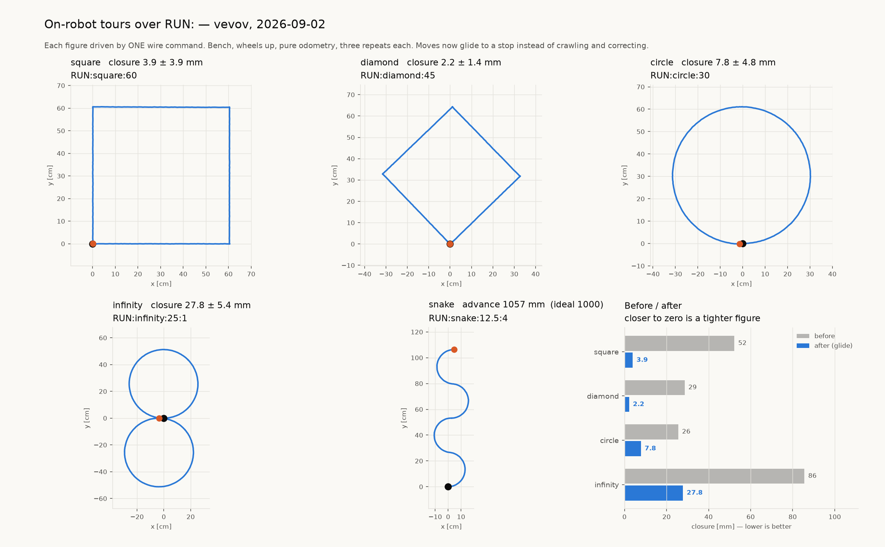
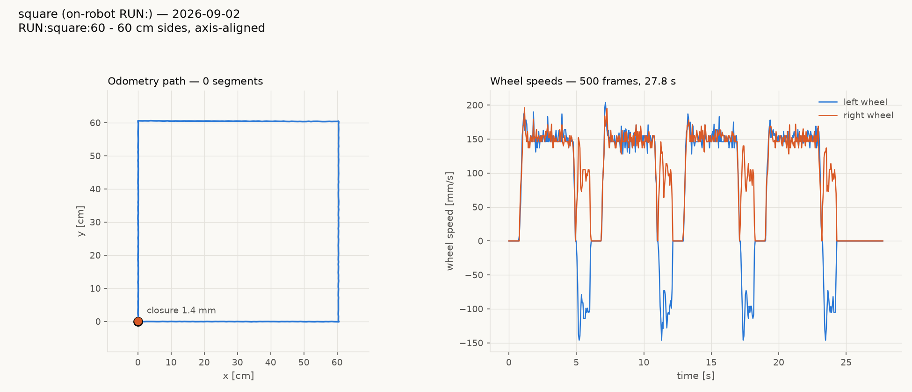
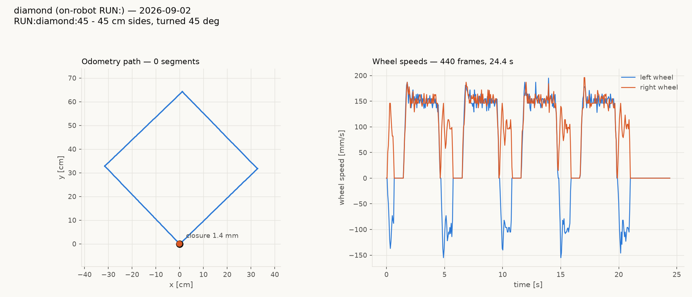
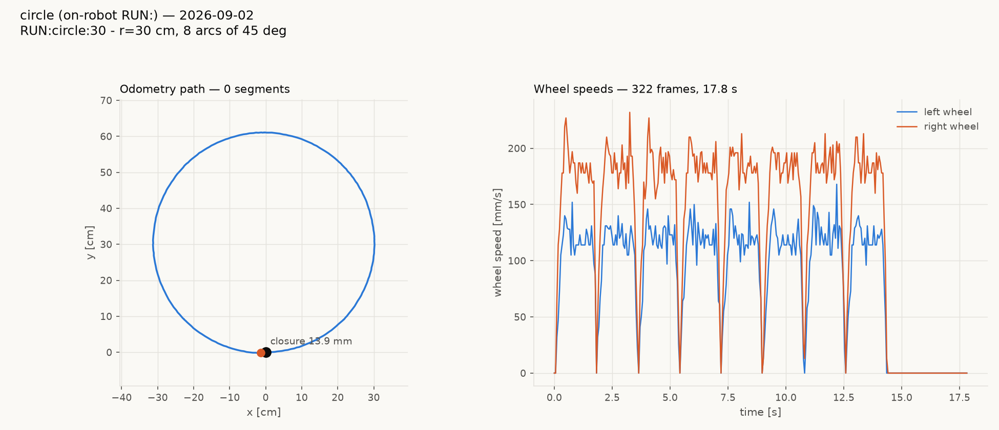
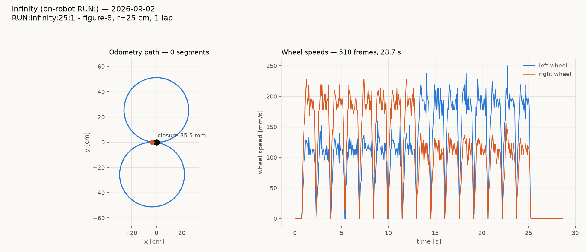
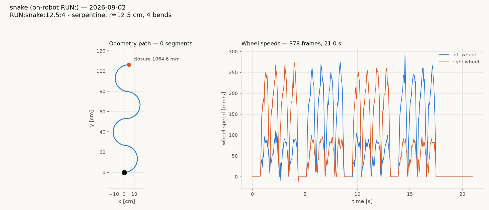

# Tour preview — vevov, 2026-09-02

Every figure below is driven by **one wire command**. The robot runs the
whole tour itself; the host only records. Bench, wheels up, pure
odometry, three repeats each.

| tour | command | closure | net rotation (ideal) |
|---|---|---|---|
| square | `RUN:square:60` | **3.9 ± 3.9 mm** | +360.22° (360) |
| diamond | `RUN:diamond:45` | **2.2 ± 1.4 mm** | +404.07° (405) |
| circle | `RUN:circle:30` | **7.8 ± 4.8 mm** | +358.77° (360) |
| infinity | `RUN:infinity:25:1` | **27.8 ± 5.4 mm** | +1.32° (0) |
| snake | `RUN:snake:12.5:4` | *(open)* advance 1057 mm | +2.12° (0) |

Best individual runs: square **1.0 mm**, diamond **1.0 mm**, circle
**2.2 mm**.

Closure is the distance from the finish pose back to the start pose in
believed position. The snake is an open path — it ends 1 m from where it
started by design — so it is scored on advance (ideal 8r = 1000 mm) and
on net rotation, which four alternating half-circles should bring back
to zero.

Paths are drawn in each tour's own start frame, translated to the start
position *and* rotated to the start heading, because nothing on the wire
can rebase the robot's odometry frame between tours.

## Individual charts

Each of these carries the wheel-speed panel alongside the path, which is
where the glide is visible — the tails now decay instead of holding at
the taper floor and reversing.

## What changed

Moves now end on **profile completion** rather than on closing a
position margin, so they glide to a stop instead of arriving at 25% of
cruise and hunting. Closure improved 13× on the pivot figures and 3× on
the arc figures. Mechanism, measurements and the full configuration:
[`glide-to-a-stop-20260902.md`](glide-to-a-stop-20260902.md).

The arc figures still trail the pivot figures — circle 7.8 mm and
infinity 27.8 mm against square 3.9 mm. Arcs accumulate more moves per
tour, and whether the residual is the exit, the arc geometry or slip is
not yet separated.
