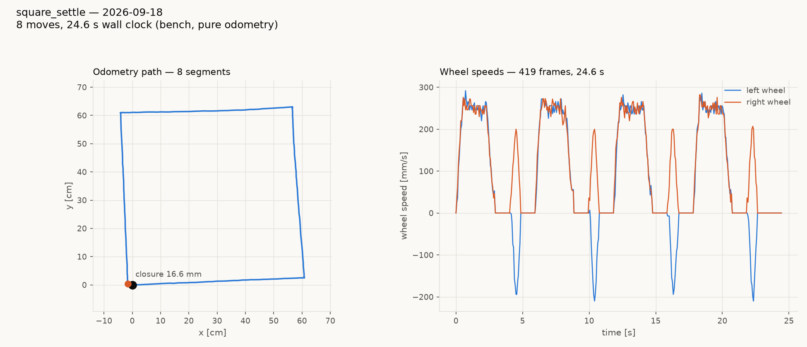

# tovez closing, 2026-09-18 — 66.4 mm → 16.6 mm believed, 52.0 → 28.5 mm physical

**Board:** tovez, main playfield, over its Pi `null` (advertised
`tovez-2`) — `nada` dropped off the network mid-session.
**Firmware:** built and flashed twice today; final is `1.20260918.2`,
`ID` profile **`tovez`**.

## Results

| | as found | reflashed (lag 0.030) | reflashed + settle |
|---|---|---|---|
| closure, believed | 66.4 mm | 62.1 mm | **16.6 mm** |
| closure, physical (camera) | — | 52.0 mm | **28.5 mm** |
| net physical rotation over 360 | — | **+7.48°** | **−1.69°** |

Reference: tovez's own best was 11.0 mm believed (2026-09-06); gopiv
5.0 mm (2026-09-01).

Two independent fixes, and they are not interchangeable — the first
makes an accurate pivot *possible*, the second lets a tour actually
use it.

## Fix 1 — the config was not on the robot

tovez's config carries `geometry.firmware_bake.lag_s: 0.04`. The hex
the robot was running (`1.20260914.1`, `ID` profile **`calibration`**,
not `tovez`) reported **`lag 0.000000`** over the wire. The bake never
reached the board.

`lag` sets the affine OFFSET of the turn response and leaves the gain
alone. MEASURED, 16 camera-scored pivots per point at cruise 188 mm/s,
±90/±180, signs alternating:

| `lag` | fit | mean abs error | +90 | −90 |
|---|---|---|---|---|
| 0.000 (as found) | `0.972 x cmd + 5.41°` | 1.92° | **+3.41°** | **−2.36°** |
| 0.040 (config bake) | `1.0028 x cmd − 1.75°` | 1.47° | −1.74° | +1.26° |
| **0.030 (now baked)** | `1.0011 x cmd − 0.76°` | **0.87°** | **−0.74°** | **+0.58°** |

At `lag 0` every 90 overshot **in its own direction** — a signed
constant that accumulates around a lap instead of cancelling. The ±180s
looked fine only because the 2.8% gain deficit cancelled the +5.41°
overrun at that angle; at 90 the two add.

Gain 1.0011 independently confirms `calc_20260917`'s trackwidth 111.4 /
`rotational_slip` 0.998 — **that calibration was right all along**; it
simply had an unbaked `lag` sitting under it. `rotational_slip` and
`stop_distance` are unchanged.

`lag_s 0.03` is now committed to
`radio-robot-lib/config/robots/tovez.json` with its provenance, built
into `1.20260918.2`, and **verified by reading it back off the board**
(`get lag 0.030000`) rather than trusting the flash.

## Fix 2 — a tour's pivots do not start from rest

After the reflash, pivots **from rest** were accurate to 0.87° — yet the
square tour still closed at only 62.1 mm and left **+7.48° of physical
net rotation** that the odometry did not see (its believed corner turns
summed to exactly 360). ~1.9° per pivot, invisible to the encoders.

The single difference is that a tour's pivot begins while the robot is
still settling out of a 250 mm/s leg. `square_settle.tour`
(`captures/tovez-square-20260918/`) changes **only** that — same
geometry, same speeds, same constants, plus a 0.7 s dwell after every
segment:

- believed closure 62.1 → **16.6 mm**
- physical closure 52.0 → **28.5 mm**
- physical net rotation **+7.48° → −1.69°**

The wheel-speed panel shows it plainly: the pivots are now isolated
counter-rotating pulses with flat zero between them, symmetric at
±200 mm/s, where before they ran straight out of the legs at an
asymmetric 245 / −190.

This is direct evidence for
`clasi/issues/rotation-error-is-injected-by-the-legs-not-the-pivots.md`
— the rotation error is injected at the leg/pivot boundary, not by the
pivot calibration. It cost 5.5 s of wall clock (19.1 s → 24.6 s).

## Still open

- **Physical closure (28.5 mm) is still well above believed (16.6 mm).**
  Roughly 12 mm is unaccounted for and the encoders cannot see it.
  Per-boundary camera fixes **at rest** would split it between leg
  length and rotation; start-and-end cannot.
- **`pid_kp` is 0.000000** with `pid_ki 6` — an integral-only speed
  loop, which overshoots and hunts by construction. Leg wheel speeds
  still peak at 280 mm/s against a commanded 250. This is my candidate
  for the wiggle and it is UNVERIFIED; a `WHEELS_V` step-response
  capture settles it on the bench with nothing to crash into.
- The 0.7 s dwell is a blunt instrument. The useful follow-up is how
  short it can be before closure degrades — that is a cheap sweep.

## Process notes

- `nada` left the network mid-session; tovez is on `null` as
  **`tovez-2`**. Resolve robots by advertised name at run time; do not
  pin host or address.
- A reflash resets `MotionLimits` to the baked values, so any `SET`
  tuning is lost. Every number above that matters is baked and was read
  back off the board.
