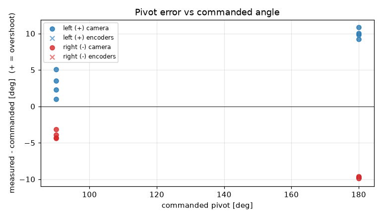
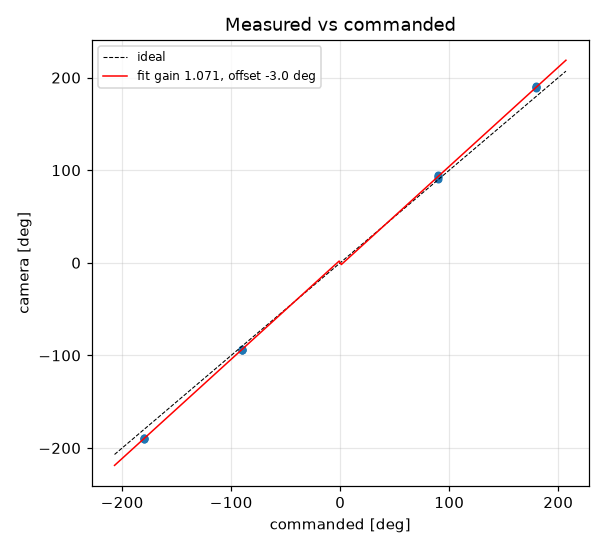

# Turn calibration -- tovez -- 01-turns-slip0962

16 camera-scored pivots at cruise 188 mm/s, rotational_slip 0.962, pivot_overrun 0.0 mm (b_eff 118.71 mm).

| commanded | n | mean error [deg] | min | max |
|---|---|---|---|---|
| +90 | 4 | +2.97 | +1.0 | +5.0 |
| +180 | 4 | +9.98 | +9.2 | +10.8 |
| -90 | 4 | -3.95 | -4.4 | -3.2 |
| -180 | 4 | -9.75 | -9.9 | -9.6 |

Fit: camera = **1.0712** x commanded **-2.95** deg; mean |error| 6.66 deg; left mean 6.48, right mean -6.85; mean centre drift 0.95 cm.

Suggested: `SET rotational_slip 1.0305`, `SET stop_distance 0.0` (camera = gain*cmd + offset; slip_new = slip*gain; stop_distance_new = stop_distance + offset_rad*b_eff/2). 029 firmware: measure and SET lag first (S10.2); this stop_distance is only valid at the cruise it was fitted at

| # | cmd | camera | err | encoder err | drift cm | peak vl | peak vr | dur s | reason |
|---|---|---|---|---|---|---|---|---|---|
| 1 | +90 | +93.5 | +3.5 |  | 0.8 |  |  | 0.0 | stop |
| 2 | -90 | -93.2 | -3.2 |  | 1.0 |  |  | 0.0 | stop |
| 3 | +180 | +190.8 | +10.8 |  | 0.7 |  |  | 0.0 | stop |
| 4 | -180 | -189.9 | -9.9 |  | 1.4 |  |  | 0.0 | stop |
| 5 | -90 | -93.9 | -3.9 |  | 1.3 |  |  | 0.0 | stop |
| 6 | +90 | +91.0 | +1.0 |  | 0.7 |  |  | 0.0 | stop |
| 7 | -180 | -189.8 | -9.8 |  | 1.3 |  |  | 0.0 | stop |
| 8 | +180 | +190.0 | +10.0 |  | 0.6 |  |  | 0.0 | stop |
| 9 | +90 | +95.0 | +5.0 |  | 0.8 |  |  | 0.0 | stop |
| 10 | -90 | -94.3 | -4.3 |  | 0.9 |  |  | 0.0 | stop |
| 11 | +180 | +189.8 | +9.8 |  | 0.6 |  |  | 0.0 | stop |
| 12 | -180 | -189.6 | -9.6 |  | 1.2 |  |  | 0.0 | stop |
| 13 | -90 | -94.4 | -4.4 |  | 1.3 |  |  | 0.0 | stop |
| 14 | +90 | +92.3 | +2.3 |  | 0.7 |  |  | 0.0 | stop |
| 15 | -180 | -189.7 | -9.7 |  | 1.3 |  |  | 0.0 | stop |
| 16 | +180 | +189.2 | +9.2 |  | 0.6 |  |  | 0.0 | stop |
