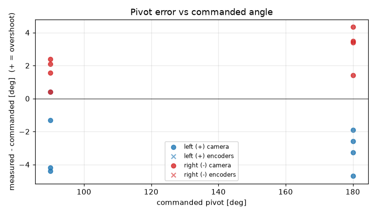
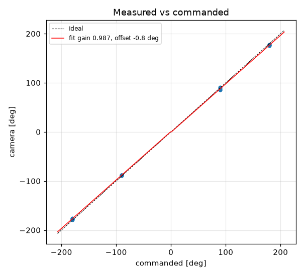

# Turn calibration -- tovez -- 02-turns-slip10305

16 camera-scored pivots at cruise 188 mm/s, rotational_slip 1.031, pivot_overrun 0.0 mm (b_eff 110.77 mm).

| commanded | n | mean error [deg] | min | max |
|---|---|---|---|---|
| +90 | 4 | -2.36 | -4.4 | +0.4 |
| +180 | 4 | -3.11 | -4.7 | -1.9 |
| -90 | 4 | +1.62 | +0.4 | +2.4 |
| -180 | 4 | +3.15 | +1.4 | +4.3 |

Fit: camera = **0.9873** x commanded **-0.85** deg; mean |error| 2.61 deg; left mean -2.74, right mean 2.39; mean centre drift 0.95 cm.

Suggested: `SET rotational_slip 1.0179`, `SET stop_distance 0.0` (camera = gain*cmd + offset; slip_new = slip*gain; stop_distance_new = stop_distance + offset_rad*b_eff/2). 029 firmware: measure and SET lag first (S10.2); this stop_distance is only valid at the cruise it was fitted at

| # | cmd | camera | err | encoder err | drift cm | peak vl | peak vr | dur s | reason |
|---|---|---|---|---|---|---|---|---|---|
| 1 | +90 | +90.4 | +0.4 |  | 0.8 |  |  | 0.0 | stop |
| 2 | -90 | -87.9 | +2.1 |  | 1.0 |  |  | 0.0 | stop |
| 3 | +180 | +177.4 | -2.6 |  | 1.0 |  |  | 0.0 | stop |
| 4 | -180 | -176.5 | +3.5 |  | 1.0 |  |  | 0.0 | stop |
| 5 | -90 | -89.6 | +0.4 |  | 1.2 |  |  | 0.0 | stop |
| 6 | +90 | +85.6 | -4.4 |  | 0.7 |  |  | 0.0 | stop |
| 7 | -180 | -176.6 | +3.4 |  | 1.4 |  |  | 0.0 | stop |
| 8 | +180 | +176.7 | -3.3 |  | 0.7 |  |  | 0.0 | stop |
| 9 | +90 | +88.7 | -1.3 |  | 0.8 |  |  | 0.0 | stop |
| 10 | -90 | -87.6 | +2.4 |  | 1.2 |  |  | 0.0 | stop |
| 11 | +180 | +178.1 | -1.9 |  | 0.8 |  |  | 0.0 | stop |
| 12 | -180 | -178.6 | +1.4 |  | 1.5 |  |  | 0.0 | stop |
| 13 | -90 | -88.4 | +1.6 |  | 0.9 |  |  | 0.0 | stop |
| 14 | +90 | +85.8 | -4.2 |  | 0.7 |  |  | 0.0 | stop |
| 15 | -180 | -175.7 | +4.3 |  | 1.2 |  |  | 0.0 | stop |
| 16 | +180 | +175.3 | -4.7 |  | 0.3 |  |  | 0.0 | stop |
