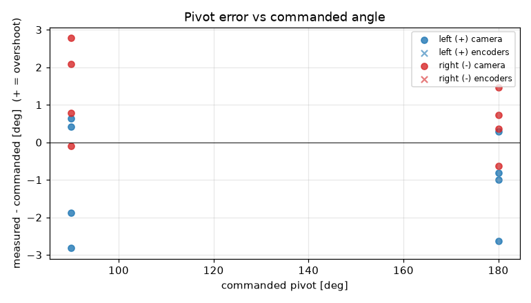
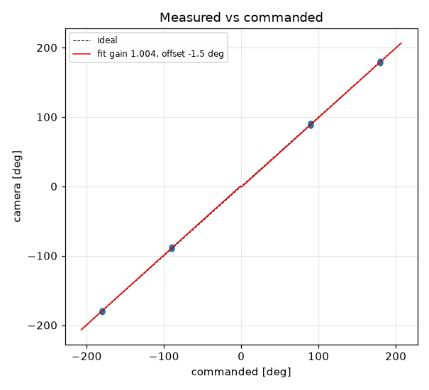

# Turn calibration -- tovez -- 03-turns-slip10179

16 camera-scored pivots at cruise 188 mm/s, rotational_slip 1.018, pivot_overrun 0.0 mm (b_eff 112.18 mm).

| commanded | n | mean error [deg] | min | max |
|---|---|---|---|---|
| +90 | 4 | -0.91 | -2.8 | +0.6 |
| +180 | 4 | -1.04 | -2.6 | +0.3 |
| -90 | 4 | +1.39 | -0.1 | +2.8 |
| -180 | 4 | +0.48 | -0.6 | +1.5 |

Fit: camera = **1.0043** x commanded **-1.54** deg; mean |error| 1.21 deg; left mean -0.98, right mean 0.93; mean centre drift 0.94 cm.

Suggested: `SET rotational_slip 1.0224`, `SET stop_distance 0.0` (camera = gain*cmd + offset; slip_new = slip*gain; stop_distance_new = stop_distance + offset_rad*b_eff/2). 029 firmware: measure and SET lag first (S10.2); this stop_distance is only valid at the cruise it was fitted at

| # | cmd | camera | err | encoder err | drift cm | peak vl | peak vr | dur s | reason |
|---|---|---|---|---|---|---|---|---|---|
| 1 | +90 | +90.6 | +0.6 |  | 0.8 |  |  | 0.0 | stop |
| 2 | -90 | -87.9 | +2.1 |  | 1.2 |  |  | 0.0 | stop |
| 3 | +180 | +180.3 | +0.3 |  | 0.6 |  |  | 0.0 | stop |
| 4 | -180 | -180.6 | -0.6 |  | 1.3 |  |  | 0.0 | stop |
| 5 | -90 | -89.2 | +0.8 |  | 1.1 |  |  | 0.0 | stop |
| 6 | +90 | +88.1 | -1.9 |  | 0.7 |  |  | 0.0 | stop |
| 7 | -180 | -179.3 | +0.7 |  | 1.2 |  |  | 0.0 | stop |
| 8 | +180 | +179.0 | -1.0 |  | 0.8 |  |  | 0.0 | stop |
| 9 | +90 | +90.4 | +0.4 |  | 0.7 |  |  | 0.0 | stop |
| 10 | -90 | -87.2 | +2.8 |  | 1.0 |  |  | 0.0 | stop |
| 11 | +180 | +179.2 | -0.8 |  | 0.8 |  |  | 0.0 | stop |
| 12 | -180 | -178.5 | +1.5 |  | 1.4 |  |  | 0.0 | stop |
| 13 | -90 | -90.1 | -0.1 |  | 1.2 |  |  | 0.0 | stop |
| 14 | +90 | +87.2 | -2.8 |  | 0.7 |  |  | 0.0 | stop |
| 15 | -180 | -179.6 | +0.4 |  | 1.2 |  |  | 0.0 | stop |
| 16 | +180 | +177.4 | -2.6 |  | 0.4 |  |  | 0.0 | stop |
